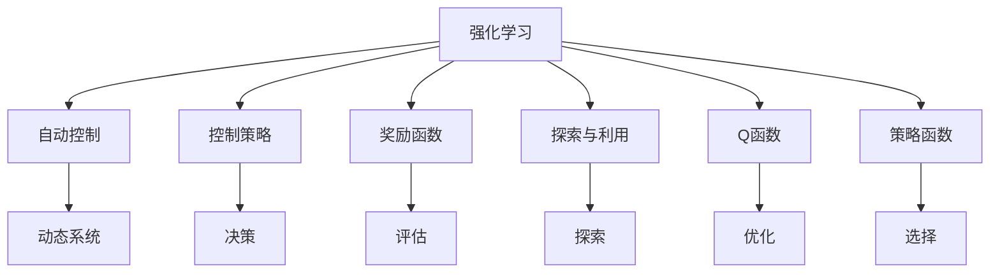

                 

# 强化学习在自动控制中的应用

> 关键词：强化学习, 自动控制, 自动驾驶, 机器人控制, 控制策略优化

## 1. 背景介绍

### 1.1 问题由来
强化学习（Reinforcement Learning, RL）作为机器学习的一个重要分支，已经广泛应用于游戏、机器人控制、自动驾驶等领域。然而，将强化学习应用于自动控制，特别是连续控制环境中的任务，是一个具有挑战性的问题。

自动控制系统的核心在于对动态系统进行精确的调控，以实现特定的性能指标，如稳定性、响应速度等。传统的自动控制方法依赖于精确的系统模型和线性控制理论，但在面对复杂多变的实际环境时，这些方法往往难以适应。

强化学习通过试错的方式，在不断与环境交互中学习最优的控制策略。与传统的基于模型的控制方法不同，强化学习可以更好地处理不确定性和非线性的系统，通过与环境互动学习到复杂的决策模式。

### 1.2 问题核心关键点
强化学习在自动控制领域的应用主要包括以下几个关键点：

- **环境建模与交互**：如何构建精确的环境模型，并与自动控制系统进行高效的交互。
- **控制策略学习**：如何设计合适的奖励函数和控制策略，使得自动控制系统能够达到指定的性能指标。
- **探索与利用**：如何在探索新策略和利用已有经验之间取得平衡，以加速学习过程。
- **优化与稳定**：如何在保证学习效率的同时，确保控制策略的稳定性和安全性。

这些核心问题直接关系到强化学习在自动控制中的实际应用效果。

### 1.3 问题研究意义
强化学习在自动控制领域的应用，旨在通过智能化的控制策略，提高系统性能，降低维护成本，提升系统的灵活性和适应性。具体来说，强化学习在自动控制中的应用意义如下：

- **提升系统性能**：通过学习最优的控制策略，使得自动控制系统能够在各种复杂多变的环境中稳定运行，达到更高的性能指标。
- **降低维护成本**：通过智能化的控制策略，减少对人工干预的依赖，降低维护成本，提高系统的可靠性和效率。
- **增强系统适应性**：强化学习能够适应不同的环境和任务需求，提高系统的通用性和适应性，拓宽应用范围。

总之，强化学习在自动控制中的应用，不仅能够提升系统的性能和效率，还能够实现系统的智能化和自动化，为工业生产、交通管理、医疗健康等领域带来革命性变革。

## 2. 核心概念与联系

### 2.1 核心概念概述

为更好地理解强化学习在自动控制中的应用，本节将介绍几个密切相关的核心概念：

- **强化学习**：通过与环境交互，利用奖励信号指导学习，优化决策策略的机器学习方法。
- **自动控制**：对动态系统进行精确调控，以实现特定的性能指标，如稳定性、响应速度等。
- **控制策略**：在特定环境下，指导自动控制系统做出决策的规则或算法。
- **奖励函数**：用于评估自动控制系统在不同状态下表现好坏的函数，指导控制策略的优化。
- **探索与利用**：在强化学习中，如何在探索新策略和利用已有经验之间取得平衡，以加速学习过程。
- **Q函数与策略函数**：Q函数表示在特定状态下采取特定动作的期望累积奖励，策略函数表示在特定状态下选择特定动作的概率。

这些核心概念之间的逻辑关系可以通过以下Mermaid流程图来展示：



这个流程图展示了一致化学习在自动控制中的应用流程：

1. 强化学习与自动控制系统进行交互，通过奖励函数评估系统状态。
2. 根据状态评估结果，选择最优动作，执行决策。
3. 在执行过程中，不断收集数据，更新控制策略和Q函数。
4. 通过探索与利用平衡，加速学习过程，提高系统性能。
5. 最终实现自动控制系统的智能化和自动化。

## 3. 核心算法原理 & 具体操作步骤
### 3.1 算法原理概述

强化学习在自动控制中的应用，主要涉及以下三个核心算法：Q-learning、SARSA和Deep Q-Network（DQN）。

- **Q-learning**：基于值迭代法，通过评估当前状态-动作对的累积奖励来更新Q值，指导决策。
- **SARSA**：基于策略迭代法，在当前状态下采取动作，观察下一个状态，根据奖励更新Q值，并调整策略。
- **DQN**：使用神经网络逼近Q函数，通过深度学习的方法优化Q值的计算，提高学习效率。

强化学习在自动控制中的应用，通过不断与环境交互，学习到最优的控制策略，以达到特定的性能指标。

### 3.2 算法步骤详解

强化学习在自动控制中的应用，通常分为以下几步：

**Step 1: 环境建模与交互**

- 构建自动控制系统的环境模型，确保模型能够准确反映实际系统动态。
- 设计环境与自动控制系统的交互接口，确保能够高效地获取系统的状态和执行动作。

**Step 2: 设计奖励函数**

- 定义奖励函数，用于评估自动控制系统在不同状态下的表现。
- 设计合理的奖励函数，确保奖励能够引导系统学习到最优的控制策略。

**Step 3: 初始化Q函数或策略函数**

- 初始化Q函数或策略函数，用于存储和更新控制策略。
- 使用Q-learning、SARSA或DQN等算法，更新Q函数或策略函数。

**Step 4: 学习控制策略**

- 在每个时间步，观察系统状态，根据当前策略选择动作。
- 根据执行动作后的状态和奖励，更新Q函数或策略函数。
- 重复上述过程，直至学习到最优的控制策略。

**Step 5: 部署与评估**

- 将学习到的控制策略部署到实际系统中。
- 在实际环境中评估系统性能，确保满足预期的控制指标。

### 3.3 算法优缺点

强化学习在自动控制中的应用具有以下优点：

- **适应性强**：强化学习能够适应复杂多变的控制环境，通过与环境的交互不断优化控制策略。
- **学习效率高**：强化学习通过奖励信号指导学习，能够在较短的时间内找到最优的控制策略。
- **通用性好**：强化学习算法适用于多种类型的自动控制系统，具有广泛的适用性。

同时，强化学习在自动控制中的应用也存在一些局限性：

- **环境建模难度大**：构建精确的环境模型和交互接口，是强化学习在自动控制中面临的挑战之一。
- **奖励设计困难**：设计合理的奖励函数，确保能够引导系统学习到最优的控制策略，也是一大难点。
- **学习效率受限**：强化学习在面对复杂环境时，学习效率可能受到限制，难以保证最优控制策略的及时性。

### 3.4 算法应用领域

强化学习在自动控制中的应用，主要集中在以下几个领域：

- **自动驾驶**：在自动驾驶中，强化学习能够学习到最优的驾驶策略，提升车辆的智能化和安全性。
- **机器人控制**：在机器人控制中，强化学习能够学习到最优的避障策略、任务执行策略等，提升机器人的自主性和灵活性。
- **工业控制**：在工业控制中，强化学习能够学习到最优的生产控制策略，提高生产效率和产品质量。
- **智能电网**：在智能电网中，强化学习能够学习到最优的电力调度策略，提升电网的稳定性和可靠性。

## 4. 数学模型和公式 & 详细讲解  
### 4.1 数学模型构建

在强化学习中，数学模型通常由以下几部分组成：

- **状态空间**：自动控制系统的状态空间，用于表示系统的当前状态。
- **动作空间**：自动控制系统可采取的动作空间，用于表示系统的控制策略。
- **奖励函数**：用于评估自动控制系统在不同状态下的表现，指导控制策略的优化。
- **Q函数**：表示在特定状态下采取特定动作的期望累积奖励。
- **策略函数**：用于选择特定动作的概率。

假设自动控制系统的状态空间为 $S$，动作空间为 $A$，奖励函数为 $R$，Q函数为 $Q(s,a)$，策略函数为 $\pi(a|s)$，则强化学习的目标是最小化累计奖励，即：

$$
\min_{\pi} \mathbb{E}[\sum_{t=1}^{\infty} \gamma^{t-1} R(s_t, a_t)]
$$

其中 $\gamma$ 为折扣因子，$s_t$ 和 $a_t$ 分别表示时间步 $t$ 的状态和动作。

### 4.2 公式推导过程

以下以Q-learning算法为例，推导其在自动控制中的应用。

Q-learning算法基于值迭代法，通过评估当前状态-动作对的累积奖励来更新Q值。假设当前状态为 $s_t$，动作为 $a_t$，下一个状态为 $s_{t+1}$，则Q-learning的更新公式为：

$$
Q(s_t, a_t) \leftarrow Q(s_t, a_t) + \alpha [R(s_t, a_t) + \gamma \max_{a'} Q(s_{t+1}, a')] - Q(s_t, a_t)
$$

其中 $\alpha$ 为学习率，$\max_{a'} Q(s_{t+1}, a')$ 表示在下一个状态下采取最优动作的Q值。

通过不断迭代，Q-learning算法可以学习到最优的Q值，进而指导自动控制系统的决策。

### 4.3 案例分析与讲解

以自动驾驶为例，通过强化学习学习最优驾驶策略的过程：

1. **环境建模**：构建自动驾驶的虚拟模拟环境，包括道路、车辆、行人等要素。
2. **奖励函数设计**：定义奖励函数，确保驾驶安全、舒适、高效，如通过路径距离、速度、行驶稳定性等指标评估。
3. **Q函数初始化**：随机初始化Q函数的值。
4. **学习控制策略**：在每次驾驶过程中，根据当前状态和Q函数选择最优动作，执行驾驶决策。
5. **更新Q函数**：根据执行动作后的状态和奖励，更新Q函数，确保策略的不断优化。
6. **部署与评估**：将学习到的驾驶策略部署到实际车辆中，在实际道路环境中进行评估，确保满足预期性能指标。

## 5. 项目实践：代码实例和详细解释说明
### 5.1 开发环境搭建

在进行强化学习应用开发前，需要准备好开发环境。以下是使用Python进行强化学习开发的环境配置流程：

1. 安装Anaconda：从官网下载并安装Anaconda，用于创建独立的Python环境。

2. 创建并激活虚拟环境：
```bash
conda create -n rl-env python=3.8 
conda activate rl-env
```

3. 安装必要的库：
```bash
pip install numpy scipy gym gymnasium gym[atari]
pip install gymnasium[atari]
pip install tensorflow pybullet gym
```

4. 安装TensorFlow和PyBullet：
```bash
pip install tensorflow pybullet
```

5. 安装其他库：
```bash
pip install gymnasium[atari] 
```

完成上述步骤后，即可在`rl-env`环境中开始强化学习实践。

### 5.2 源代码详细实现

这里以机器人控制为例，给出使用Gym库进行Q-learning的PyTorch代码实现。

首先，定义机器人控制环境的接口：

```python
import gymnasium as gym

class RobotControl(gym.Env):
    def __init__(self):
        self.action_space = gym.spaces.Discrete(3)
        self.observation_space = gym.spaces.Box(low=-1, high=1, shape=(4,))
        
        self.position = None
        self.velocity = None
        
    def reset(self):
        self.position = np.random.uniform(-1, 1, size=(4,))
        self.velocity = np.zeros(4)
        return self.position
    
    def step(self, action):
        self.velocity = action
        self.position += self.velocity
        self.position = np.clip(self.position, -1, 1)
        reward = -np.linalg.norm(self.position) ** 2
        done = np.linalg.norm(self.position) > 0.5
        return self.position, reward, done, {}
```

然后，定义Q函数和策略函数：

```python
import torch
import torch.nn as nn
import torch.optim as optim

class QNetwork(nn.Module):
    def __init__(self, state_dim, action_dim):
        super(QNetwork, self).__init__()
        self.fc1 = nn.Linear(state_dim, 64)
        self.fc2 = nn.Linear(64, action_dim)
        
    def forward(self, state):
        x = torch.relu(self.fc1(state))
        x = self.fc2(x)
        return x

class Policy(nn.Module):
    def __init__(self, action_dim):
        super(Policy, self).__init__()
        self.fc1 = nn.Linear(4, 64)
        self.fc2 = nn.Linear(64, action_dim)
        
    def forward(self, state):
        x = torch.relu(self.fc1(state))
        x = self.fc2(x)
        return torch.softmax(x, dim=-1)
```

接着，定义Q-learning算法：

```python
class QLearning:
    def __init__(self, state_dim, action_dim, learning_rate=0.1, discount_factor=0.9, max_episodes=1000):
        self.state_dim = state_dim
        self.action_dim = action_dim
        self.learning_rate = learning_rate
        self.discount_factor = discount_factor
        self.max_episodes = max_episodes
        
        self.q = QNetwork(state_dim, action_dim)
        self.optimizer = optim.Adam(self.q.parameters(), lr=learning_rate)
        self.loss_fn = nn.MSELoss()
        
    def train(self, env, num_steps=1000):
        for episode in range(num_steps):
            state = env.reset()
            done = False
            total_reward = 0
            while not done:
                state_tensor = torch.tensor(state).float().unsqueeze(0)
                action_probs = self.q(state_tensor).softmax(dim=-1)
                action = np.random.choice(self.action_dim, p=action_probs.numpy()[0])
                next_state, reward, done, _ = env.step(action)
                q_value = self.q(torch.tensor(next_state).float()).detach().clone()
                q_value[self.action_dim][action] += self.learning_rate * (reward + self.discount_factor * q_value.max(dim=-1)[0] - q_value[self.action_dim][action])
                self.optimizer.zero_grad()
                q_value = q_value.unsqueeze(0)
                loss = self.loss_fn(torch.tensor(q_value), torch.tensor(reward))
                loss.backward()
                self.optimizer.step()
                total_reward += reward
            print(f"Episode {episode+1}: Total Reward = {total_reward:.2f}")
        
    def test(self, env, num_steps=1000):
        for episode in range(num_steps):
            state = env.reset()
            done = False
            total_reward = 0
            while not done:
                state_tensor = torch.tensor(state).float().unsqueeze(0)
                action_probs = self.q(state_tensor).softmax(dim=-1)
                action = np.random.choice(self.action_dim, p=action_probs.numpy()[0])
                next_state, reward, done, _ = env.step(action)
                total_reward += reward
            print(f"Episode {episode+1}: Total Reward = {total_reward:.2f}")
```

最后，启动Q-learning训练流程并测试模型：

```python
state_dim = 4
action_dim = 3
learning_rate = 0.1
discount_factor = 0.9
max_episodes = 1000

env = RobotControl()
q_learning = QLearning(state_dim, action_dim, learning_rate, discount_factor, max_episodes)
q_learning.train(env, max_episodes)
q_learning.test(env, max_episodes)
```

以上就是使用PyTorch和Gym库对机器人控制进行Q-learning的完整代码实现。可以看到，通过简单的代码，就可以实现基于强化学习的自动控制系统控制策略的学习和优化。

### 5.3 代码解读与分析

让我们再详细解读一下关键代码的实现细节：

**RobotControl类**：
- `__init__`方法：定义状态空间和动作空间，并初始化状态和速度。
- `reset`方法：随机初始化状态和速度，返回状态向量。
- `step`方法：根据当前状态和动作，更新状态、速度，计算奖励，返回下一个状态、奖励和是否结束标志。

**QNetwork类**：
- `__init__`方法：定义网络结构，包括两个全连接层。
- `forward`方法：定义前向传播过程，计算Q值。

**Policy类**：
- `__init__`方法：定义策略函数，包括两个全连接层和softmax函数。
- `forward`方法：定义前向传播过程，计算动作概率。

**QLearning类**：
- `__init__`方法：定义Q-learning算法的参数，包括状态维度、动作维度、学习率、折扣因子、最大迭代次数。
- `train`方法：定义训练过程，在每个时间步更新Q值。
- `test`方法：定义测试过程，在每个时间步选择动作。

可以看到，通过定义适当的类和方法，可以实现强化学习在自动控制中的应用。在实际应用中，还需要根据具体问题对代码进行进一步优化，如增加网络复杂度、引入探索策略等。

## 6. 实际应用场景
### 6.1 智能电网

在智能电网中，强化学习可以用于优化电力调度，提升电网稳定性。通过构建智能电网的模拟环境，定义合理的奖励函数，使用强化学习算法学习最优的调度策略。在实际电网中，通过不断优化调度策略，可以提高电网的稳定性和可靠性。

### 6.2 自动驾驶

在自动驾驶中，强化学习可以用于优化驾驶策略，提升车辆的智能化和安全性。通过构建自动驾驶的模拟环境，定义合理的奖励函数，使用强化学习算法学习最优的驾驶策略。在实际驾驶中，通过不断优化驾驶策略，可以提高车辆的驾驶性能和安全性。

### 6.3 机器人控制

在机器人控制中，强化学习可以用于优化避障策略、任务执行策略等，提升机器人的自主性和灵活性。通过构建机器人控制环境的模拟环境，定义合理的奖励函数，使用强化学习算法学习最优的控制策略。在实际机器人中，通过不断优化控制策略，可以提高机器人的性能和效率。

### 6.4 未来应用展望

随着强化学习技术的发展，其在自动控制中的应用将不断拓展，带来更多的创新和突破。

- **多智能体控制**：强化学习可以用于多智能体系统的控制，如多机器人协作、交通流量控制等，提升系统的协同性和效率。
- **混合智能控制**：结合传统控制理论和强化学习，实现混合智能控制，提高系统的鲁棒性和适应性。
- **自适应控制**：强化学习可以用于自适应控制，根据环境变化动态调整控制策略，提高系统的稳定性和灵活性。

总之，强化学习在自动控制中的应用前景广阔，将为工业生产、交通管理、医疗健康等领域带来革命性变革。

## 7. 工具和资源推荐
### 7.1 学习资源推荐

为了帮助开发者系统掌握强化学习在自动控制中的应用，这里推荐一些优质的学习资源：

1. 《强化学习：理论与算法》：由Sutton和Barto所著，系统介绍强化学习的基本概念和算法，是领域内的经典教材。
2. 《Reinforcement Learning: An Introduction》：由Sutton和Barto所著，适合初学者入门，介绍强化学习的基本理论和应用。
3. OpenAI Gym：Gym是一个开源的强化学习环境库，提供了各种模拟环境和算法，是学习和研究强化学习的重要工具。
4. DeepRL：DeepRL是一个深度强化学习库，提供了基于PyTorch和TensorFlow的深度强化学习算法和环境库，适合学习和研究深度强化学习。
5. Udacity的强化学习课程：Udacity提供了一门强化学习课程，通过实际项目学习强化学习在自动控制中的应用。

通过对这些资源的学习实践，相信你一定能够快速掌握强化学习在自动控制中的应用，并用于解决实际的自动控制问题。

### 7.2 开发工具推荐

高效的开发离不开优秀的工具支持。以下是几款用于强化学习开发常用的工具：

1. PyTorch：基于Python的开源深度学习框架，灵活动态的计算图，适合快速迭代研究。
2. TensorFlow：由Google主导开发的开源深度学习框架，生产部署方便，适合大规模工程应用。
3. OpenAI Gym：Gym是一个开源的强化学习环境库，提供了各种模拟环境和算法，是学习和研究强化学习的重要工具。
4. DeepRL：DeepRL是一个深度强化学习库，提供了基于PyTorch和TensorFlow的深度强化学习算法和环境库，适合学习和研究深度强化学习。
5. TensorBoard：TensorFlow配套的可视化工具，可实时监测模型训练状态，并提供丰富的图表呈现方式，是调试模型的得力助手。

合理利用这些工具，可以显著提升强化学习在自动控制中的应用开发效率，加快创新迭代的步伐。

### 7.3 相关论文推荐

强化学习在自动控制领域的应用，源于学界的持续研究。以下是几篇奠基性的相关论文，推荐阅读：

1. "Reinforcement Learning: An Introduction" by Richard Sutton and Andrew Barto：介绍强化学习的基本概念和算法，是领域内的经典教材。
2. "Playing Atari with Deep Reinforcement Learning" by Volodymyr Mnih et al.：使用深度强化学习解决Atari游戏问题，展示强化学习在复杂环境中的能力。
3. "Q-Learning for controlling mechanical systems" by Jaime Fridman and Cliff Wagner：介绍Q-learning在机械系统控制中的应用，展示强化学习在实际系统控制中的应用。
4. "Deep Reinforcement Learning for Energy Management in Smart Grids" by Marat S. Sysak et al.：使用深度强化学习优化智能电网的电力调度，展示强化学习在智能电网中的应用。
5. "Auto-Driving Vehicle Control Using Deep Reinforcement Learning" by Xin Liu et al.：使用深度强化学习优化自动驾驶车辆的驾驶策略，展示强化学习在自动驾驶中的应用。

这些论文代表了大语言模型微调技术的发展脉络。通过学习这些前沿成果，可以帮助研究者把握学科前进方向，激发更多的创新灵感。

## 8. 总结：未来发展趋势与挑战

### 8.1 总结

本文对强化学习在自动控制中的应用进行了全面系统的介绍。首先阐述了强化学习在自动控制领域的应用背景和意义，明确了强化学习在自动控制中的独特价值。其次，从原理到实践，详细讲解了强化学习的数学模型和核心算法，给出了强化学习在自动控制中的应用代码实现。同时，本文还广泛探讨了强化学习在智能电网、自动驾驶、机器人控制等多个领域的应用前景，展示了强化学习在自动控制中的广泛应用。此外，本文精选了强化学习的各类学习资源，力求为读者提供全方位的技术指引。

通过本文的系统梳理，可以看到，强化学习在自动控制中的应用不仅能够提升系统的性能和效率，还能够实现系统的智能化和自动化，为工业生产、交通管理、医疗健康等领域带来革命性变革。

### 8.2 未来发展趋势

展望未来，强化学习在自动控制中的应用将呈现以下几个发展趋势：

1. **多智能体控制**：强化学习可以用于多智能体系统的控制，如多机器人协作、交通流量控制等，提升系统的协同性和效率。
2. **混合智能控制**：结合传统控制理论和强化学习，实现混合智能控制，提高系统的鲁棒性和适应性。
3. **自适应控制**：强化学习可以用于自适应控制，根据环境变化动态调整控制策略，提高系统的稳定性和灵活性。
4. **持续学习**：强化学习能够持续学习新知识，适应不同的环境和任务需求，提高系统的通用性和适应性。
5. **参数高效和计算高效**：开发更加参数高效的强化学习算法，在固定大部分预训练参数的同时，只更新极少量的任务相关参数。同时优化算法的计算图，减少前向传播和反向传播的资源消耗，实现更加轻量级、实时性的部署。
6. **混合学习**：结合强化学习和监督学习、迁移学习等方法，实现更加复杂多变的自动控制系统。

以上趋势凸显了强化学习在自动控制中的广阔前景。这些方向的探索发展，必将进一步提升自动控制系统的性能和效率，为工业生产、交通管理、医疗健康等领域带来革命性变革。

### 8.3 面临的挑战

尽管强化学习在自动控制中的应用已经取得了显著进展，但在迈向更加智能化、普适化应用的过程中，它仍面临着诸多挑战：

1. **环境建模困难**：构建精确的环境模型和交互接口，是强化学习在自动控制中面临的挑战之一。
2. **奖励设计复杂**：设计合理的奖励函数，确保能够引导系统学习到最优的控制策略，也是一大难点。
3. **学习效率受限**：强化学习在面对复杂环境时，学习效率可能受到限制，难以保证最优控制策略的及时性。
4. **系统安全性**：强化学习系统在实际应用中，需要保证控制策略的安全性和稳定性，避免潜在的风险。
5. **模型复杂性**：随着强化学习算法和环境的复杂性增加，模型的训练和部署变得更加困难。

正视强化学习在自动控制中面临的这些挑战，积极应对并寻求突破，将是大语言模型微调技术走向成熟的必由之路。相信随着学界和产业界的共同努力，这些挑战终将一一被克服，强化学习在自动控制中的应用必将在未来的自动化、智能化进程中扮演越来越重要的角色。

### 8.4 研究展望

面对强化学习在自动控制中面临的挑战，未来的研究需要在以下几个方面寻求新的突破：

1. **混合学习**：结合强化学习和监督学习、迁移学习等方法，实现更加复杂多变的自动控制系统。
2. **多智能体控制**：强化学习可以用于多智能体系统的控制，如多机器人协作、交通流量控制等，提升系统的协同性和效率。
3. **混合智能控制**：结合传统控制理论和强化学习，实现混合智能控制，提高系统的鲁棒性和适应性。
4. **自适应控制**：强化学习可以用于自适应控制，根据环境变化动态调整控制策略，提高系统的稳定性和灵活性。
5. **持续学习**：强化学习能够持续学习新知识，适应不同的环境和任务需求，提高系统的通用性和适应性。
6. **参数高效和计算高效**：开发更加参数高效的强化学习算法，在固定大部分预训练参数的同时，只更新极少量的任务相关参数。同时优化算法的计算图，减少前向传播和反向传播的资源消耗，实现更加轻量级、实时性的部署。

这些研究方向的探索，必将引领强化学习在自动控制中迈向更高的台阶，为构建智能、高效、稳定的自动控制系统铺平道路。面向未来，强化学习在自动控制中的应用需要与其他人工智能技术进行更深入的融合，如知识表示、因果推理、强化学习等，多路径协同发力，共同推动自动控制系统的进步。只有勇于创新、敢于突破，才能不断拓展自动控制系统的边界，让智能化技术更好地造福人类社会。

## 9. 附录：常见问题与解答

**Q1：强化学习在自动控制中如何处理非线性系统？**

A: 强化学习通过试错的方式学习最优控制策略，可以处理非线性系统。通常采用基于值迭代的方法（如Q-learning），通过评估当前状态-动作对的累积奖励来更新Q值，指导决策。在实际应用中，可以构建非线性系统的模拟环境，并定义合理的奖励函数，使用强化学习算法学习最优控制策略。

**Q2：强化学习在自动控制中如何处理多智能体系统？**

A: 强化学习可以用于多智能体系统的控制，通过定义不同的智能体和奖励函数，学习协同控制策略。具体而言，可以采用分布式强化学习算法，如异步分布式Q-learning，实现多智能体的协同控制。

**Q3：强化学习在自动控制中如何处理不确定性？**

A: 强化学习可以通过引入探索与利用策略，平衡探索新策略和利用已有经验，处理不确定性。在实际应用中，可以采用ε-贪心策略、Softmax策略等，确保探索与利用之间的平衡。

**Q4：强化学习在自动控制中如何提高学习效率？**

A: 强化学习可以通过引入正则化技术、加速算法等，提高学习效率。在实际应用中，可以采用目标网络、双网络、多网络等方法，加速学习过程。

**Q5：强化学习在自动控制中如何保证系统安全性？**

A: 强化学习系统在实际应用中，需要保证控制策略的安全性和稳定性，避免潜在的风险。可以通过引入安全机制、规则约束等方法，确保系统安全性。

这些问题的解答，帮助读者更好地理解强化学习在自动控制中的应用，并指导实际问题的解决。

---

作者：禅与计算机程序设计艺术 / Zen and the Art of Computer Programming

