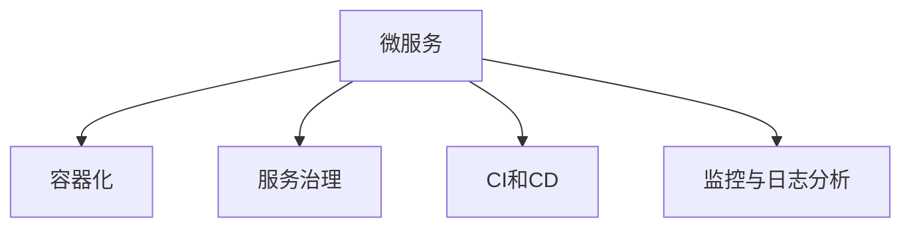

                 

# 微服务架构：设计、实现与治理

> 关键词：微服务, 分布式系统, 服务治理, 持续集成(CI), 持续部署(CD), 监控与日志分析

## 1. 背景介绍

### 1.1 问题由来
随着互联网应用的发展，企业系统变得越来越复杂，单一的应用系统难以应对快速变化的业务需求和日益增长的用户量。传统单体架构的“巨无霸”应用，不仅维护成本高，且容易成为系统性能瓶颈。微服务架构应运而生，它通过将大系统拆分成一系列独立、自治的服务，使得系统更容易扩展和维护，同时提供了更高的灵活性和可靠性。

### 1.2 问题核心关键点
微服务架构的核心在于将复杂系统拆分为一系列独立服务，每个服务聚焦于单一的业务能力，能够独立部署和扩展。这种架构思想不仅适用于软件开发领域，在数据分析、人工智能、物联网等领域也得到了广泛应用。

微服务架构的实现关键在于：

- **服务拆分**：根据业务领域和功能，将系统拆分为多个独立服务。
- **服务通信**：服务间通过轻量级通信协议进行通信，如REST、gRPC、HTTP等。
- **服务治理**：通过统一的治理平台，实现服务的注册、发现、负载均衡、健康检查等功能。
- **持续集成(CI)和持续部署(CD)**：通过自动化工具链，实现代码的快速构建、测试和部署。
- **监控与日志分析**：实时监控系统性能和健康状态，及时发现和解决问题。

## 2. 核心概念与联系

### 2.1 核心概念概述

为更好地理解微服务架构的设计与实现，本节将介绍几个密切相关的核心概念：

- **微服务（Microservices）**：将单体应用拆分成一系列独立、自治的服务，每个服务聚焦于单一的业务能力。
- **容器化（Containerization）**：通过Docker等容器技术，将服务打包在轻量级的容器中，便于部署和扩展。
- **服务治理（Service Governance）**：通过服务发现、负载均衡、健康检查等功能，实现服务的统一管理和调度。
- **持续集成（CI）和持续部署（CD）**：通过自动化工具链，实现代码的快速构建、测试和部署。
- **监控与日志分析（Monitoring & Logging）**：通过实时监控和日志分析，及时发现和解决问题，优化系统性能。

这些核心概念之间的逻辑关系可以通过以下Mermaid流程图来展示：



这个流程图展示了大规模微服务架构的关键组件及其之间的关系：

1. 微服务通过容器化技术进行打包和部署。
2. 服务治理平台实现服务的统一管理和调度。
3. 持续集成和持续部署工具链保障代码的高效构建和部署。
4. 监控和日志分析工具实时监控系统性能和健康状态。

这些组件共同构成了微服务架构的设计与实现框架，使得系统能够具备更高的灵活性、可扩展性和可维护性。

## 3. 核心算法原理 & 具体操作步骤

### 3.1 算法原理概述

微服务架构的实现基于分布式系统理论，将大系统拆分为多个独立的服务单元。每个服务通过轻量级通信协议进行通信，服务间通过服务注册中心进行发现和调用。

微服务的核心设计思想包括：

- **服务拆分**：将单体应用按照业务功能进行拆分，形成独立的服务单元。
- **服务通信**：服务间通过轻量级通信协议进行通信，保障服务调用的高效和可靠性。
- **服务治理**：通过服务注册中心和服务发现机制，实现服务的统一管理和调度。
- **数据管理**：使用数据库拆分、分布式事务等技术，解决服务的异构性和数据一致性问题。

### 3.2 算法步骤详解

微服务架构的设计与实现一般包括以下几个关键步骤：

**Step 1: 服务拆分与设计**
- 根据业务领域和功能，将系统拆分为多个独立的服务单元。每个服务应聚焦于单一的业务能力，具有独立的数据存储和业务逻辑。
- 设计服务的接口规范，确保服务间的通信协议和数据格式一致。

**Step 2: 服务部署与容器化**
- 使用Docker等容器技术，将服务打包在轻量级的容器中。容器化保障了服务的独立性和一致性，便于部署和扩展。
- 使用容器编排工具，如Kubernetes，实现服务的自动化部署和管理。

**Step 3: 服务治理与注册**
- 搭建服务注册中心，实现服务的动态注册和发现。服务注册中心通常采用Eureka、Consul等开源解决方案。
- 配置服务间的负载均衡和健康检查机制，确保服务的可用性和性能。

**Step 4: 持续集成与持续部署**
- 搭建CI/CD自动化工具链，包括代码构建、测试和部署等环节。工具链通常采用Jenkins、GitLab CI等开源解决方案。
- 实现代码的快速构建和部署，保障应用的稳定性和一致性。

**Step 5: 监控与日志分析**
- 部署实时监控和日志分析工具，如Prometheus、ELK Stack等。
- 实时监控系统性能和健康状态，及时发现和解决问题，优化系统性能。

### 3.3 算法优缺点

微服务架构的优点包括：

1. **灵活性高**：系统容易扩展和维护，可以快速响应业务变化。
2. **独立性强**：每个服务独立部署，降低了系统风险和维护成本。
3. **可扩展性好**：服务易于水平扩展，系统负载可动态调整。
4. **容错性高**：单个服务的故障不会影响整个系统，保障了系统的可靠性。

微服务架构的缺点包括：

1. **复杂度高**：系统由多个独立服务组成，设计和管理难度较大。
2. **通信开销大**：服务间通信协议和数据格式复杂，增加了系统开销。
3. **数据一致性难以保障**：服务间数据管理复杂，容易出现数据一致性问题。
4. **调试困难**：服务间分布式调用，调试复杂，需要深入理解服务交互逻辑。

尽管存在这些缺点，但微服务架构在大规模系统设计中已经得到了广泛应用，成为现代系统架构的主流范式。

### 3.4 算法应用领域

微服务架构已经被广泛应用于各种类型的软件系统和业务场景，例如：

- **电商平台**：将购物、支付、物流等服务拆分，实现独立部署和扩展。
- **金融系统**：将交易、风控、结算等服务拆分，保障系统稳定性和安全性。
- **游戏平台**：将游戏引擎、服务器、数据库等服务拆分，提升游戏体验和系统可扩展性。
- **医疗系统**：将预约、诊疗、支付等服务拆分，实现医疗服务的数字化和智能化。

除了上述这些经典场景外，微服务架构还被创新性地应用到更多领域，如智能交通、智慧城市、工业互联网等，为各行业带来了新的变革。

## 4. 数学模型和公式 & 详细讲解 & 举例说明（备注：数学公式请使用latex格式，latex嵌入文中独立段落使用 $$，段落内使用 $)
### 4.1 数学模型构建

本节将使用数学语言对微服务架构的设计与实现进行更加严格的刻画。

记微服务系统由$n$个独立服务组成，每个服务$S_i$的响应时间分别为$t_i$。服务间的通信延迟为$d$，负载均衡算法分配给每个服务的请求比例为$p_i$。系统总负载为$T$，假设服务间通信和负载均衡的延迟可以忽略不计。

定义系统响应时间为$T_s$，则有：

$$
T_s = \sum_{i=1}^n p_i t_i + d
$$

服务间通信延迟$d$通常取决于网络环境和通信协议，可以采用Pareto分布进行建模：

$$
d \sim Pareto(\alpha)
$$

其中$\alpha$为参数，表示通信延迟的分布情况。服务响应时间$t_i$通常服从指数分布：

$$
t_i \sim Exp(\lambda_i)
$$

其中$\lambda_i$为参数，表示服务响应时间的速率。假设服务间通信延迟和负载均衡延迟对系统响应时间的贡献可忽略不计，则有：

$$
T_s = \sum_{i=1}^n p_i t_i
$$

### 4.2 公式推导过程

根据上述模型，我们可以推导出系统响应时间的数学表达式。假设系统负载$T$服从泊松分布：

$$
T \sim Poisson(\lambda)
$$

其中$\lambda$为参数，表示单位时间内到达系统的请求数。令$p_i = \frac{1}{n}$，则有：

$$
T_s = \frac{1}{n} \sum_{i=1}^n t_i = \frac{1}{n} \sum_{i=1}^n \frac{1}{\lambda_i}
$$

进一步简化可得：

$$
T_s = \frac{1}{n\lambda} \sum_{i=1}^n \frac{1}{t_i}
$$

该公式表明，系统响应时间与单位时间内到达系统的请求数$\lambda$和服务响应时间的倒数$\frac{1}{t_i}$成正比。通过调整服务响应时间$t_i$和负载均衡算法$p_i$，可以优化系统响应时间，提升系统性能。

### 4.3 案例分析与讲解

以电商平台的购物服务为例，说明微服务架构的设计与实现。

**购物服务设计**
- 将购物服务拆分为商品信息服务、购物车服务、订单服务、物流服务等独立的服务单元。
- 每个服务独立存储数据和实现业务逻辑，通过REST API进行通信。

**容器化和部署**
- 使用Docker容器技术，将每个服务打包成独立的容器镜像。
- 使用Kubernetes容器编排工具，实现服务的自动化部署和扩展。

**服务治理**
- 搭建Eureka服务注册中心，实现服务的动态注册和发现。
- 配置负载均衡算法和健康检查机制，确保服务的可用性和性能。

**持续集成与持续部署**
- 搭建Jenkins CI/CD自动化工具链，实现代码的快速构建、测试和部署。
- 实现代码的自动化测试和集成，保障应用的稳定性和一致性。

**监控与日志分析**
- 部署Prometheus实时监控系统，实时监控系统性能和健康状态。
- 部署ELK Stack日志分析系统，实时分析和处理系统日志。

通过以上步骤，电商平台实现了微服务架构的设计与实现，保障了系统的灵活性、可扩展性和稳定性。

## 5. 项目实践：代码实例和详细解释说明
### 5.1 开发环境搭建

在进行微服务实践前，我们需要准备好开发环境。以下是使用Spring Boot和Docker进行微服务开发的环境配置流程：

1. 安装Java Development Kit (JDK)：从官网下载并安装JDK，确保版本为1.8或更高。
2. 安装Spring Boot：使用Spring官网上传的最新稳定版。
3. 安装Docker：从官网下载并安装Docker，确保版本为19.03或更高。
4. 配置Spring Boot和Docker：在Spring Boot项目中添加Docker依赖，并在Dockerfile中配置服务镜像构建命令。

### 5.2 源代码详细实现

下面我们以电商平台购物服务为例，给出使用Spring Boot和Docker进行微服务的PyTorch代码实现。

首先，定义购物服务的Spring Boot应用：

```java
@SpringBootApplication
public class ShoppingServiceApplication {
    public static void main(String[] args) {
        SpringApplication.run(ShoppingServiceApplication.class, args);
    }
}
```

然后，定义商品信息服务、购物车服务和订单服务的REST API：

```java
@RestController
@RequestMapping("/api/v1/shopping")
public class ShoppingController {

    @Autowired
    private ShoppingService shoppingService;

    @GetMapping("/items")
    public List<Item> getItems() {
        return shoppingService.getItems();
    }

    @PostMapping("/shoppingcart")
    public ShoppingCart addToShoppingCart(@RequestBody ShoppingCart shoppingCart) {
        return shoppingService.addToShoppingCart(shoppingCart);
    }

    @PostMapping("/order")
    public Order placeOrder(@RequestBody Order order) {
        return shoppingService.placeOrder(order);
    }
}
```

接着，实现购物服务的业务逻辑：

```java
@Service
public class ShoppingService {

    @Autowired
    private ItemRepository itemRepository;
    @Autowired
    private ShoppingCartRepository shoppingCartRepository;
    @Autowired
    private OrderRepository orderRepository;

    public List<Item> getItems() {
        return itemRepository.findAll();
    }

    public ShoppingCart addToShoppingCart(ShoppingCart shoppingCart) {
        shoppingCartRepository.save(shoppingCart);
        return shoppingCart;
    }

    public Order placeOrder(Order order) {
        orderRepository.save(order);
        return order;
    }
}
```

最后，配置Docker镜像构建命令，并实现Docker容器的启动脚本：

```Dockerfile
FROM springboot:2.4.5
ADD target/shopping-service.jar /app/shopping-service.jar
EXPOSE 8080
ENTRYPOINT ["java", "-jar", "/app/shopping-service.jar"]
```

```bash
docker-compose up
```

### 5.3 代码解读与分析

让我们再详细解读一下关键代码的实现细节：

**ShoppingServiceApplication类**：
- 定义Spring Boot应用的入口点，通过SpringApplication.run()方法启动应用。

**ShoppingController类**：
- 定义REST API的接口，使用@RequestMapping注解定义请求路径，通过@Autowired注入业务逻辑类，实现接口方法。

**ShoppingService类**：
- 定义购物服务的业务逻辑，使用@Autowired注解注入数据访问对象(DAO)，实现具体业务功能。

**Dockerfile**：
- 定义Docker镜像构建命令，ADD指令将编译生成的JAR包添加到容器中，EXPOSE指令暴露8080端口，ENTRYPOINT指令指定启动命令。

**docker-compose.yml**：
- 定义多个服务的Docker容器，通过EXPOSE指令暴露8080端口，使用服务名调用其他服务。

通过以上步骤，实现了电商平台的微服务架构的实践。可以看到，Spring Boot和Docker使得微服务的开发和部署变得非常简单。开发者只需关注业务逻辑的实现，无需过多关注底层的容器化部署。

## 6. 实际应用场景
### 6.1 智能交通系统

智能交通系统可以通过微服务架构，实现交通流量监控、路况分析、智能调度等功能。传统交通系统依赖人工监控，容易滞后于实时路况变化，而智能交通系统通过微服务架构，可以实现实时数据采集、处理和调度，提升交通效率和安全性。

具体而言，可以构建多个微服务，如摄像头监控服务、传感器数据处理服务、路线规划服务等，分别处理不同的数据源和业务需求。这些微服务通过API网关进行统一调用，实现数据的实时分析和处理。在实时分析的基础上，智能交通系统可以实时调整信号灯、优化路线，保障道路的顺畅和高效。

### 6.2 智慧城市治理

智慧城市治理需要处理海量数据，实现对城市运行的全面感知和智能决策。微服务架构通过将系统拆分为多个独立的服务单元，可以更好地实现数据的分布式存储和处理，提升系统的灵活性和可扩展性。

具体而言，可以构建多个微服务，如视频监控服务、环境监测服务、交通管理服务等，分别处理不同类型的数据源。这些微服务通过API网关进行统一调用，实现数据的实时分析和处理。智慧城市治理系统可以实时监控城市运行状态，根据实时数据进行智能决策，提升城市治理效率和服务水平。

### 6.3 智能医疗系统

智能医疗系统通过微服务架构，可以实现对患者数据的全面管理和智能分析，提升医疗服务的精准度和效率。

具体而言，可以构建多个微服务，如患者信息服务、病历管理服务、医疗影像处理服务等，分别处理不同类型的数据源。这些微服务通过API网关进行统一调用，实现数据的实时分析和处理。智能医疗系统可以实时监控患者状态，根据实时数据进行智能决策，提升医疗服务的精准度和效率。

### 6.4 未来应用展望

随着微服务架构的不断发展，其在各领域的应用场景将不断拓展。微服务架构的设计与实现需要根据具体业务场景进行调整和优化，但以下趋势将引领微服务架构的未来发展：

1. **服务网格（Service Mesh）**：通过服务网格技术，实现服务间的通信管理、负载均衡、健康检查等功能的统一管理，提升系统性能和可靠性。
2. **无服务器架构（Serverless Architecture）**：通过无服务器架构，实现函数的快速部署和扩展，降低系统的维护成本。
3. **边缘计算（Edge Computing）**：通过边缘计算技术，将计算和存储资源部署在靠近数据源的地方，提升系统的响应速度和效率。
4. **DevOps文化**：通过DevOps文化，实现软件的快速构建、测试和部署，保障软件的质量和稳定性。
5. **云原生技术（Cloud-Native Technology）**：通过云原生技术，实现微服务的自动化部署和扩展，提升系统的弹性和可扩展性。

以上趋势将进一步推动微服务架构的发展，使得微服务架构在各行业的应用更加广泛和深入。微服务架构的设计与实现需要根据具体业务场景进行调整和优化，但这些趋势将为微服务架构的未来发展提供新的方向。

## 7. 工具和资源推荐
### 7.1 学习资源推荐

为了帮助开发者系统掌握微服务架构的设计与实现，这里推荐一些优质的学习资源：

1. 《微服务架构设计模式》系列博文：由微服务架构专家撰写，深入浅出地介绍了微服务架构的设计模式和最佳实践。
2. 《微服务实战》书籍：结合实际项目，详细讲解了微服务架构的设计与实现，涵盖服务拆分、服务通信、服务治理等各个环节。
3. 《Spring Cloud》文档：Spring官方文档，详细介绍了Spring Cloud微服务架构的实现和应用。
4. Kubernetes官方文档：Kubernetes官方文档，详细介绍了Kubernetes容器编排工具的实现和应用。
5. Docker官方文档：Docker官方文档，详细介绍了Docker容器技术的实现和应用。

通过对这些资源的学习实践，相信你一定能够快速掌握微服务架构的设计与实现，并用于解决实际的系统问题。

### 7.2 开发工具推荐

高效的开发离不开优秀的工具支持。以下是几款用于微服务开发常用的工具：

1. Spring Boot：基于Java的开源微服务框架，提供了丰富的工具和组件，方便微服务开发和部署。
2. Kubernetes：由Google主导开发的容器编排工具，支持大规模微服务系统的部署和管理。
3. Docker：Docker容器技术，提供轻量级容器化解决方案，方便微服务的打包和部署。
4. Jenkins：开源持续集成工具，支持代码构建、测试和部署的自动化。
5. ELK Stack：开源日志和监控解决方案，提供实时监控和日志分析功能。
6. Prometheus：开源监控系统，支持高可用性、高性能的数据采集和分析。

合理利用这些工具，可以显著提升微服务开发的效率，加快创新迭代的步伐。

### 7.3 相关论文推荐

微服务架构的研究源于学界的持续研究。以下是几篇奠基性的相关论文，推荐阅读：

1. "Microservices: A service-centric architecture for developing complex distributed systems"（《微服务架构：设计分布式系统的面向服务的架构》）： paper 作者：Sam Newman
2. "Monolithic Application Architecture: The Emerging Migration Story"（《单体架构：新兴的迁移故事》）： paper 作者：Sam Newman
3. "Microservices Patterns: Implementing Flexible Systems with Microservices"（《微服务模式：使用微服务实现灵活的系统》）： paper 作者：Sam Newman
4. "Serverless Computing: Concepts, Architectures, and a Case Study"（《无服务器计算：概念、架构和案例研究》）： paper 作者：Peter Lyman、Rich Doherty、Brett Lacy、John Dufner、Gordon Crispin、Douglas Ross
5. "Service Mesh for Microservices: An Infrastructure Layer for Distributed Systems"（《微服务架构中的服务网格：分布式系统的基础设施层》）： paper 作者：Istio团队

这些论文代表了大规模微服务架构的发展脉络。通过学习这些前沿成果，可以帮助研究者把握学科前进方向，激发更多的创新灵感。

## 8. 总结：未来发展趋势与挑战

### 8.1 总结

本文对微服务架构的设计与实现进行了全面系统的介绍。首先阐述了微服务架构的研究背景和意义，明确了微服务在应对复杂系统需求方面的独特价值。其次，从原理到实践，详细讲解了微服务架构的数学模型和核心步骤，给出了微服务开发的具体代码实例。同时，本文还广泛探讨了微服务架构在智能交通、智慧城市、智能医疗等多个行业领域的应用前景，展示了微服务架构的广阔应用场景。此外，本文精选了微服务架构的各类学习资源，力求为读者提供全方位的技术指引。

通过本文的系统梳理，可以看到，微服务架构的设计与实现已经成为现代系统架构的主流范式，极大地拓展了系统架构的设计空间，提升了系统的灵活性和可扩展性。微服务架构的设计与实现需要根据具体业务场景进行调整和优化，但核心思想和基本组件是一致的。未来，随着微服务架构的不断发展，其在各行业的应用将更加广泛和深入。

### 8.2 未来发展趋势

展望未来，微服务架构的发展趋势包括：

1. **微服务网格（Service Mesh）**：通过服务网格技术，实现服务间的通信管理、负载均衡、健康检查等功能的统一管理，提升系统性能和可靠性。
2. **无服务器架构（Serverless Architecture）**：通过无服务器架构，实现函数的快速部署和扩展，降低系统的维护成本。
3. **边缘计算（Edge Computing）**：通过边缘计算技术，将计算和存储资源部署在靠近数据源的地方，提升系统的响应速度和效率。
4. **DevOps文化**：通过DevOps文化，实现软件的快速构建、测试和部署，保障软件的质量和稳定性。
5. **云原生技术（Cloud-Native Technology）**：通过云原生技术，实现微服务的自动化部署和扩展，提升系统的弹性和可扩展性。

这些趋势将进一步推动微服务架构的发展，使得微服务架构在各行业的应用更加广泛和深入。微服务架构的设计与实现需要根据具体业务场景进行调整和优化，但这些趋势将为微服务架构的未来发展提供新的方向。

### 8.3 面临的挑战

尽管微服务架构已经取得了瞩目成就，但在迈向更加智能化、普适化应用的过程中，它仍面临着诸多挑战：

1. **复杂度高**：微服务架构的设计和维护难度较大，需要高水平的技术人员和管理团队。
2. **通信开销大**：服务间通信协议和数据格式复杂，增加了系统开销。
3. **数据一致性难以保障**：服务间数据管理复杂，容易出现数据一致性问题。
4. **调试困难**：服务间分布式调用，调试复杂，需要深入理解服务交互逻辑。
5. **监控和日志分析难度大**：微服务架构涉及大量的服务单元，监控和日志分析难度较大。

尽管存在这些挑战，但微服务架构在大规模系统设计中已经得到了广泛应用，成为现代系统架构的主流范式。

### 8.4 研究展望

面对微服务架构面临的这些挑战，未来的研究需要在以下几个方面寻求新的突破：

1. **服务网格技术**：探索更加灵活和高效的服务网格解决方案，提升微服务架构的性能和可靠性。
2. **数据一致性**：研究更加高效的数据管理方案，保障服务间的数据一致性和可靠性。
3. **服务通信优化**：探索更加高效的服务通信协议和数据格式，降低服务间通信开销。
4. **监控和日志分析**：研究更加灵活和高效的监控和日志分析方案，实时监控和分析微服务架构的性能和状态。
5. **自动化部署和扩展**：研究更加高效和灵活的自动化部署和扩展方案，提升微服务架构的弹性和可扩展性。

这些研究方向的探索，将引领微服务架构的发展，使得微服务架构在各行业的应用更加广泛和深入。微服务架构的设计与实现需要根据具体业务场景进行调整和优化，但这些趋势将为微服务架构的未来发展提供新的方向。

## 9. 附录：常见问题与解答

**Q1：微服务架构是否适用于所有系统？**

A: 微服务架构适用于大多数复杂系统，特别是那些需要高效扩展和灵活维护的系统。但对于一些数据管理复杂、通信开销大的系统，微服务架构可能不是最佳选择。需要根据具体业务场景进行调整和优化。

**Q2：微服务架构的设计和实现有哪些关键点？**

A: 微服务架构的设计和实现关键在于：
1. 服务拆分和设计：根据业务需求和功能，将系统拆分为多个独立服务，设计服务接口规范。
2. 服务通信和治理：选择合适的通信协议，配置服务注册和发现机制，实现服务的统一管理和调度。
3. 持续集成和持续部署：搭建CI/CD工具链，实现代码的快速构建、测试和部署。
4. 监控和日志分析：部署实时监控和日志分析工具，实时监控系统性能和健康状态，及时发现和解决问题。

这些关键点决定了微服务架构的成功与否，需要仔细设计和实现。

**Q3：微服务架构的维护成本是否较高？**

A: 微服务架构的设计和实现复杂度较高，需要高水平的技术人员和管理团队，维护成本确实较高。但通过服务网格、DevOps等技术，可以降低微服务架构的维护成本，提升系统的稳定性和可靠性。

**Q4：微服务架构是否需要关注数据一致性问题？**

A: 微服务架构涉及多个独立的服务单元，数据一致性问题不可避免。需要通过数据拆分、分布式事务等技术，保障数据的一致性和可靠性。同时，服务间的同步和协调也需要设计合理的机制。

**Q5：微服务架构的性能是否受到影响？**

A: 微服务架构涉及多个独立的服务单元，通信开销和数据一致性问题可能影响系统性能。需要设计合理的服务治理机制，如负载均衡、健康检查等，提升系统的性能和可靠性。

通过以上分析，我们可以看到微服务架构在设计与实现中需要注意的关键点，以及未来发展中面临的挑战。微服务架构的不断演进和发展，将为现代系统架构的设计与实现提供更加灵活和高效的方式，推动各行业的数字化转型和升级。

