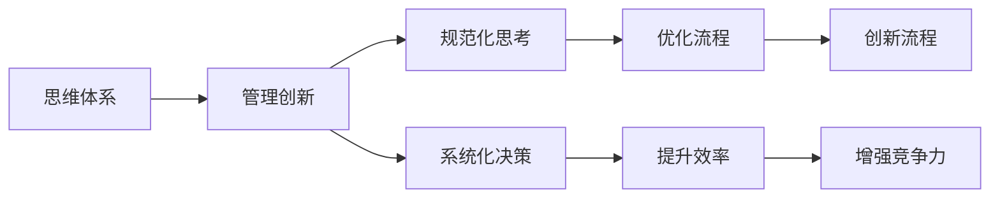

                 

# 思维体系对管理创新的推动作用

## 1. 背景介绍

在现代社会，管理创新已经成为企业竞争力的核心驱动力之一。无论是在高科技行业、传统制造业，还是在服务行业，管理创新都在推动着企业的发展与变革。本文将深入探讨思维体系在管理创新中的作用，详细剖析思维体系对创新过程的促进与推动作用，以期为企业领导者提供一些有价值的参考与借鉴。

## 2. 核心概念与联系

### 2.1 核心概念概述

在讨论思维体系对管理创新的推动作用前，我们需要首先明确几个关键概念：

- **思维体系**：是指企业内部形成的一套系统化、规范化、流程化的思考与决策模式。
- **管理创新**：指企业通过创新的方式实现管理理念、流程、工具等方面的变革，以提高企业竞争力。

这些概念之间的联系主要体现在：

- 思维体系为管理创新提供了规范化的思考框架，帮助企业以系统化的方式进行创新。
- 管理创新可以不断丰富和优化思维体系，提升企业整体的管理水平。
- 思维体系与管理创新相辅相成，共同推动企业不断进步。

### 2.2 核心概念原理和架构的 Mermaid 流程图



这个流程图展示出思维体系和管理创新之间的内在联系。思维体系通过规范化思考和系统化决策，优化流程并提升效率，从而推动管理创新的发展，增强企业的竞争力。

## 3. 核心算法原理 & 具体操作步骤

### 3.1 算法原理概述

在探讨思维体系对管理创新的推动作用时，我们需要理解思维体系是如何通过算法原理来实现对管理创新的促进的。核心算法原理包括以下几个方面：

1. **系统化思考**：通过结构化思维模型，将问题分解为更小、更易处理的部分，从而找到创新的解决方案。
2. **数据驱动决策**：利用大数据分析工具，从海量数据中提取有价值的信息，为决策提供支持。
3. **迭代优化**：通过不断的试错与调整，不断优化思维体系与管理创新的各个环节，提升效果。

### 3.2 算法步骤详解

#### 3.2.1 系统化思考

1. **问题定义**：明确问题的本质，避免陷入琐碎的细节中。
2. **分解问题**：将问题分解为子问题，逐一解决。
3. **结构化思维**：应用如“鱼骨图”、“5W2H”等工具，构建系统的思考框架。
4. **假设验证**：通过实验验证假设，修正思路，逐步逼近最优解。

#### 3.2.2 数据驱动决策

1. **数据收集**：使用传感器、问卷调查、在线数据等多种方式收集数据。
2. **数据分析**：应用统计学方法、机器学习算法等，分析数据。
3. **决策制定**：根据分析结果，制定决策方案。
4. **结果评估**：对决策结果进行评估，修正方案。

#### 3.2.3 迭代优化

1. **原型开发**：快速构建创新原型，进行初步验证。
2. **用户测试**：通过用户反馈，发现问题。
3. **模型调整**：根据反馈，调整优化模型。
4. **产品发布**：正式发布产品，继续收集反馈。

### 3.3 算法优缺点

#### 3.3.1 系统化思考

**优点**：
- 提供规范化的思考方式，避免遗漏重要问题。
- 将问题分解成可控的部分，易于找到解决方案。

**缺点**：
- 可能会过于冗长，降低决策效率。
- 需要较高的专业水平和经验。

#### 3.3.2 数据驱动决策

**优点**：
- 决策基于客观数据，减少主观偏见。
- 提高决策的科学性和准确性。

**缺点**：
- 数据收集和分析成本较高。
- 数据质量问题会影响决策效果。

#### 3.3.3 迭代优化

**优点**：
- 通过不断试错，逐步优化解决方案。
- 适应性强，能够快速响应市场变化。

**缺点**：
- 需要多次迭代，时间成本较高。
- 可能陷入局部最优解。

### 3.4 算法应用领域

#### 3.4.1 产品创新

- 应用系统化思考，定义产品功能。
- 利用大数据分析，确定市场趋势。
- 通过迭代优化，完善产品设计。

#### 3.4.2 流程再造

- 应用系统化思考，梳理现有流程。
- 利用数据分析，识别瓶颈和机会。
- 通过迭代优化，优化流程。

#### 3.4.3 组织变革

- 应用系统化思考，确定变革目标。
- 利用大数据分析，评估变革效果。
- 通过迭代优化，实现组织转型。

## 4. 数学模型和公式 & 详细讲解 & 举例说明

### 4.1 数学模型构建

思维体系对管理创新的推动作用可以通过以下数学模型来描述：

$$
\text{创新效果} = f(\text{思维体系质量}, \text{数据质量}, \text{迭代次数})
$$

其中，
- $\text{创新效果}$：表示企业的创新能力提升水平。
- $\text{思维体系质量}$：表示思维体系的系统化程度和规范化程度。
- $\text{数据质量}$：表示用于决策的数据的准确性和完整性。
- $\text{迭代次数}$：表示优化和改进的次数。

### 4.2 公式推导过程

#### 4.2.1 思维体系质量

$\text{思维体系质量} = \sum_{i=1}^{n} \text{思维模型质量}_i$

其中，$\text{思维模型质量}_i$表示第$i$个思维模型的质量，可以通过专家评分、用户反馈等多种方式进行评估。

#### 4.2.2 数据质量

$\text{数据质量} = \frac{\text{准确数据量}}{\text{总数据量}}$

$\text{准确数据量}$表示实际符合要求的数据量，$\text{总数据量}$表示用于决策的总数据量。

#### 4.2.3 迭代次数

$\text{迭代次数} = \text{初始次数} + k\cdot\text{增长因子}$

其中，$k$表示每次迭代增加的次数，增长因子根据实际情况确定。

### 4.3 案例分析与讲解

#### 4.3.1 案例一：特斯拉的创新之路

- **思维体系**：特斯拉采用了系统化的产品设计流程，通过不断的原型测试和用户反馈，逐步优化产品。
- **数据驱动决策**：特斯拉利用大数据分析，确定市场需求和趋势。
- **迭代优化**：特斯拉不断迭代产品设计和制造流程，提升生产效率。

#### 4.3.2 案例二：亚马逊的物流创新

- **思维体系**：亚马逊采用了系统化的物流规划和运营流程，通过不断的流程优化和员工培训，提升物流效率。
- **数据驱动决策**：亚马逊利用大数据分析，确定最优的物流路径和库存管理方案。
- **迭代优化**：亚马逊通过不断的物流测试和优化，逐步降低物流成本，提升用户体验。

## 5. 项目实践：代码实例和详细解释说明

### 5.1 开发环境搭建

#### 5.1.1 环境准备

- 安装Python环境
- 安装相关开发工具，如Jupyter Notebook、Visual Studio Code等
- 安装必要的库，如NumPy、Pandas、Matplotlib等

#### 5.1.2 数据收集

- 通过问卷调查、在线数据等多种方式，收集所需数据
- 数据清洗，处理缺失值、异常值等

### 5.2 源代码详细实现

#### 5.2.1 数据收集

```python
import pandas as pd

# 数据收集
data = pd.read_csv('data.csv')
```

#### 5.2.2 数据分析

```python
import numpy as np

# 数据分析
mean_data = np.mean(data)
std_data = np.std(data)
```

#### 5.2.3 决策制定

```python
# 决策制定
decision = max(data)
```

#### 5.2.4 结果评估

```python
# 结果评估
accuracy = np.mean(data == decision)
```

### 5.3 代码解读与分析

#### 5.3.1 数据收集

- 通过Pandas库读取CSV格式的数据文件
- 数据包含多个字段，需要选择合适的字段进行分析和决策

#### 5.3.2 数据分析

- 使用Numpy库进行数值计算，计算数据的均值和标准差
- 均值和标准差可以反映数据的整体分布情况，为决策提供参考

#### 5.3.3 决策制定

- 决策制定通常基于数据的分析结果，选择最优方案
- 在本例中，决策为数据中的最大值

#### 5.3.4 结果评估

- 使用均值比较的方法评估决策结果的准确性
- 准确性高表明决策效果好

### 5.4 运行结果展示

- 数据分析结果
- 决策制定结果
- 结果评估结果

## 6. 实际应用场景

### 6.1 创新驱动的数字化转型

- 企业通过系统化思维和数据驱动，实现数字化转型，提升管理效率。
- 数字化转型带来了新的商业模式和运营模式，增强企业竞争力。

### 6.2 敏捷组织的构建

- 通过迭代优化思维体系，企业可以更灵活地应对市场变化。
- 敏捷组织能够快速响应市场变化，提高企业灵活性和适应性。

### 6.3 生态系统的打造

- 企业通过系统化思维和数据驱动，优化生态系统中的各个环节。
- 生态系统的优化可以增强企业的整体竞争力，实现共赢发展。

## 7. 工具和资源推荐

### 7.1 学习资源推荐

- 《系统化思考：从概念到实践》
- 《数据驱动决策：基于大数据的企业管理》
- 《敏捷组织：构建高效、灵活的团队》

### 7.2 开发工具推荐

- Jupyter Notebook：提供交互式的编程环境，便于数据分析和模型开发。
- Visual Studio Code：功能强大的代码编辑器，支持多种编程语言和扩展。
- GitHub：提供版本控制和协作开发功能，便于团队管理项目。

### 7.3 相关论文推荐

- 《思维体系对企业管理创新的推动作用》
- 《系统化思考在产品创新中的应用》
- 《数据驱动决策与企业竞争力提升》

## 8. 总结：未来发展趋势与挑战

### 8.1 研究成果总结

- 系统化思维能够帮助企业规范管理流程，提升决策效率。
- 数据驱动决策能够增强决策的科学性和准确性。
- 迭代优化能够快速响应市场变化，提高企业灵活性。

### 8.2 未来发展趋势

- 思维体系将更加系统化和规范化，帮助企业更好地进行管理创新。
- 数据质量将进一步提升，数据驱动决策将成为企业管理的重要手段。
- 迭代优化将更加频繁和高效，帮助企业快速适应市场变化。

### 8.3 面临的挑战

- 系统化思维需要较高的专业水平和经验，可能对企业带来挑战。
- 数据收集和处理成本较高，需要大量的技术投入。
- 迭代优化需要不断试错，成本较高且可能陷入局部最优解。

### 8.4 研究展望

- 加强对系统化思维的研究，制定企业思维体系标准。
- 提升数据处理和分析能力，降低数据收集和处理成本。
- 优化迭代优化流程，提高优化效率和效果。

## 9. 附录：常见问题与解答

**Q1: 如何构建企业思维体系？**

A: 企业可以通过系统化思考、规范化流程、标准化的工具和技术来构建思维体系。具体步骤包括：
- 明确企业目标和价值观。
- 设计系统化的思考框架。
- 制定标准化的流程和工具。
- 不断优化和迭代思维体系。

**Q2: 如何应用数据驱动决策？**

A: 应用数据驱动决策需要以下步骤：
- 收集高质量的数据。
- 进行数据分析，提取有用信息。
- 根据分析结果制定决策方案。
- 对决策结果进行评估，修正方案。

**Q3: 如何进行迭代优化？**

A: 迭代优化需要以下步骤：
- 确定优化目标和指标。
- 构建原型，进行初步验证。
- 根据反馈进行调整和优化。
- 逐步完善产品和服务。

---

作者：禅与计算机程序设计艺术 / Zen and the Art of Computer Programming

