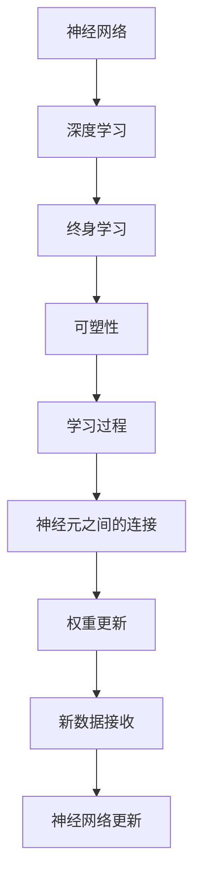

                 

# 思维的可塑性：终身学习的神经基础

> 关键词：神经网络，终身学习，可塑性，深度学习，人工智能

## 1. 背景介绍

### 1.1 问题由来
现代社会信息爆炸，知识更新速度不断加快，对人的思维和学习能力提出了新的要求。人类的思维能力虽然是有限的，但可以通过终身学习来不断提升自身素质，适应快速变化的环境。同样，对于人工智能而言，持续学习和适应变化的能力也显得至关重要。如何通过科学的方法，提升机器的终身学习能力，已经成为当前人工智能研究的热点之一。

### 1.2 问题核心关键点
本文旨在探讨机器的终身学习能力及其神经基础。我们将从神经网络的可塑性开始，逐步深入了解终身学习的基本概念、实现方法和应用领域。同时，还将探讨当前领域内尚未解决的一些关键问题，以及未来的研究方向。

## 2. 核心概念与联系

### 2.1 核心概念概述

#### 2.1.1 神经网络
神经网络（Neural Networks）是一种由大量的人工神经元按照一定规则连接而成的计算模型。神经网络通过一系列的前向传播、反向传播等操作，不断学习输入数据中的规律，从而进行分类、预测等任务。

#### 2.1.2 可塑性
可塑性（Plasticity）指的是神经系统在大脑发育过程中，神经元之间的连接可以不断形成、加强或削弱的过程。这一过程对于学习与记忆的形成至关重要。

#### 2.1.3 终身学习
终身学习（Lifelong Learning）指的是个体在一生中不断学习新知识，适应新环境的能力。对于机器而言，终身学习则指机器能够在不同时间点接收新数据，不断更新自身的知识库，增强对新数据的适应能力。

#### 2.1.4 深度学习
深度学习（Deep Learning）是一种模拟人脑神经系统的人工智能技术，通过多层神经元模型，学习数据中的高层次特征，实现复杂任务。

#### 2.1.5 神经基础
神经基础（Neural Basis）是指深度学习和终身学习所依赖的神经系统机理和原理。

这些核心概念之间存在着紧密的联系，神经网络通过深度学习实现了对数据的特征提取和模式识别，而终身学习则强调了机器在不同时间点接收新数据的能力，可塑性是实现这一过程的基础。

### 2.2 核心概念原理和架构的 Mermaid 流程图



这个流程图展示了核心概念之间的逻辑关系：

1. 神经网络通过深度学习实现了对数据的特征提取和模式识别。
2. 终身学习强调了机器在不同时间点接收新数据的能力。
3. 可塑性是实现这一过程的基础。
4. 学习过程包括神经元之间的连接形成、权重更新等。
5. 新数据的接收和神经网络的更新是终身学习的关键。

## 3. 核心算法原理 & 具体操作步骤

### 3.1 算法原理概述

终身学习的核心算法是深度神经网络，通过不断地接收新数据，更新权重参数，增强模型的泛化能力和适应能力。算法的核心原理包括以下几点：

1. 通过前向传播计算输出，反向传播计算损失函数，不断更新权重参数。
2. 通过梯度下降等优化算法，最小化损失函数，使模型输出逼近真实标签。
3. 利用正则化技术，防止过拟合，提升模型泛化能力。
4. 通过激活函数引入非线性，增强模型表达能力。
5. 通过Dropout等技术减少过拟合，提升模型鲁棒性。

### 3.2 算法步骤详解

#### 3.2.1 数据预处理
将输入数据标准化，去除噪声，归一化等。例如，对于图像数据，需要进行灰度化、裁剪、缩放等操作。

#### 3.2.2 搭建神经网络
根据任务需求，搭建多层神经网络结构，设置各层的神经元数量、激活函数等。例如，搭建一个简单的卷积神经网络（CNN），进行图像分类任务。

#### 3.2.3 损失函数设计
根据任务类型，选择合适的损失函数。例如，分类任务通常使用交叉熵损失函数，回归任务使用均方误差损失函数。

#### 3.2.4 训练算法选择
选择适合的数据集和模型，选择合适的优化算法，如Adam、SGD等。设置学习率、批大小、迭代轮数等超参数。

#### 3.2.5 模型评估与优化
在验证集上评估模型性能，根据评估结果调整模型结构、学习率等超参数。

#### 3.2.6 应用新数据
当模型接收新数据时，重新训练模型，更新权重参数，使其适应新的数据分布。

#### 3.2.7 评估与迭代
对更新后的模型进行评估，不断迭代，提升模型的终身学习能力。

### 3.3 算法优缺点

#### 3.3.1 优点
1. 强大的泛化能力：神经网络可以通过深度学习，提取数据中的高层次特征，从而实现复杂的模式识别和分类任务。
2. 自适应能力：通过终身学习，神经网络可以在不同时间点接收新数据，不断更新自身的知识库，增强对新数据的适应能力。
3. 灵活性：神经网络可以通过调整网络结构、超参数等，适应不同的任务需求。

#### 3.3.2 缺点
1. 计算复杂度高：神经网络通常需要大量的计算资源进行训练和推理。
2. 过拟合风险：神经网络容易在训练集上过拟合，影响泛化能力。
3. 可解释性差：神经网络是一个"黑盒"模型，难以解释其内部的决策过程。

### 3.4 算法应用领域

终身学习的深度神经网络已经被广泛应用于以下几个领域：

#### 3.4.1 图像识别
例如，卷积神经网络（CNN）在图像识别任务中取得了显著成果。通过不断接收新图像数据，更新网络参数，可以提升识别精度。

#### 3.4.2 自然语言处理
例如，长短期记忆网络（LSTM）和Transformer模型在语言模型、机器翻译、文本生成等任务中取得了优异表现。通过终身学习，可以不断更新语言知识库，提升模型对新文本的适应能力。

#### 3.4.3 语音识别
例如，深度神经网络在语音识别中通过不断接收新语音数据，更新声学模型，提升识别准确率。

#### 3.4.4 医疗诊断
例如，深度学习在医疗影像分析、疾病诊断等领域中，通过不断接收新数据，更新模型参数，提升诊断准确率。

#### 3.4.5 金融预测
例如，深度神经网络在金融预测、风险评估等领域中，通过不断接收新数据，更新模型参数，提升预测精度。

## 4. 数学模型和公式 & 详细讲解 & 举例说明

### 4.1 数学模型构建

假设输入数据为 $x$，输出为 $y$，深度神经网络的模型参数为 $\theta$。

通过前向传播，计算输出 $z$：

$$ z = f_\theta(x) $$

其中 $f_\theta$ 为神经网络的激活函数，如ReLU、Sigmoid等。

通过损失函数 $L(z,y)$，计算误差：

$$ L(z,y) = \frac{1}{2}(z-y)^2 $$

通过反向传播，更新权重参数：

$$ \theta \leftarrow \theta - \eta \nabla_\theta L(z,y) $$

其中 $\eta$ 为学习率，$\nabla_\theta L(z,y)$ 为损失函数对权重参数的梯度。

### 4.2 公式推导过程

#### 4.2.1 前向传播
前向传播过程：

$$ z = f_\theta(x) $$

#### 4.2.2 损失函数
损失函数：

$$ L(z,y) = \frac{1}{2}(z-y)^2 $$

#### 4.2.3 反向传播
反向传播过程：

$$ \frac{\partial L(z,y)}{\partial \theta} = -(z-y) $$

通过链式法则，将误差反向传播到各层神经元，更新权重参数。

### 4.3 案例分析与讲解

#### 4.3.1 图像分类任务
例如，使用卷积神经网络（CNN）进行图像分类任务。

数据预处理：将图像数据归一化，进行灰度化、裁剪、缩放等操作。

搭建神经网络：搭建一个多层卷积神经网络，设置卷积层、池化层、全连接层等。

损失函数：使用交叉熵损失函数。

训练算法：使用Adam优化算法，设置学习率、批大小、迭代轮数等超参数。

应用新数据：当接收新图像数据时，重新训练模型，更新权重参数。

评估与迭代：对更新后的模型进行评估，不断迭代，提升模型的终身学习能力。

## 5. 项目实践：代码实例和详细解释说明

### 5.1 开发环境搭建

#### 5.1.1 环境准备
1. 安装Python 3.7以上版本，建议使用Anaconda进行环境管理。
2. 安装TensorFlow、Keras等深度学习库，例如：

```bash
pip install tensorflow keras
```

3. 安装必要的可视化工具，例如：

```bash
pip install matplotlib
```

4. 安装TensorBoard，用于可视化训练过程：

```bash
pip install tensorboard
```

### 5.2 源代码详细实现

#### 5.2.1 数据预处理
定义数据预处理函数，例如，对图像数据进行归一化处理：

```python
import numpy as np

def preprocess_data(data):
    # 归一化处理
    data = (data - 128) / 128
    return data
```

#### 5.2.2 搭建神经网络
使用Keras搭建卷积神经网络（CNN）模型：

```python
from keras.models import Sequential
from keras.layers import Conv2D, MaxPooling2D, Flatten, Dense

model = Sequential()

model.add(Conv2D(32, (3, 3), activation='relu', input_shape=(28, 28, 1)))
model.add(MaxPooling2D(pool_size=(2, 2)))
model.add(Conv2D(64, (3, 3), activation='relu'))
model.add(MaxPooling2D(pool_size=(2, 2)))
model.add(Flatten())
model.add(Dense(128, activation='relu'))
model.add(Dense(10, activation='softmax'))

model.compile(optimizer='adam', loss='categorical_crossentropy', metrics=['accuracy'])
```

#### 5.2.3 损失函数设计
使用交叉熵损失函数：

```python
from keras.losses import categorical_crossentropy

model.compile(optimizer='adam', loss=categorical_crossentropy, metrics=['accuracy'])
```

#### 5.2.4 训练算法选择
设置学习率、批大小、迭代轮数等超参数：

```python
model.fit(x_train, y_train, epochs=10, batch_size=32, validation_data=(x_test, y_test))
```

#### 5.2.5 应用新数据
当接收新图像数据时，重新训练模型，更新权重参数：

```python
new_x_train, new_y_train = load_new_data()
model.fit(new_x_train, new_y_train, epochs=10, batch_size=32, validation_data=(x_test, y_test))
```

#### 5.2.6 评估与迭代
对更新后的模型进行评估，不断迭代，提升模型的终身学习能力：

```python
score = model.evaluate(x_test, y_test, verbose=0)
print('Test loss:', score[0])
print('Test accuracy:', score[1])
```

### 5.3 代码解读与分析

#### 5.3.1 数据预处理
通过归一化处理，将输入数据标准化，去除噪声，提高模型性能。

#### 5.3.2 搭建神经网络
使用Keras搭建多层卷积神经网络，设置卷积层、池化层、全连接层等。

#### 5.3.3 损失函数设计
使用交叉熵损失函数，计算模型输出与真实标签之间的差异。

#### 5.3.4 训练算法选择
设置学习率、批大小、迭代轮数等超参数，使用Adam优化算法进行模型训练。

#### 5.3.5 应用新数据
当接收新图像数据时，重新训练模型，更新权重参数，增强模型泛化能力。

#### 5.3.6 评估与迭代
对更新后的模型进行评估，不断迭代，提升模型的终身学习能力。

## 6. 实际应用场景

### 6.1 智能家居
智能家居系统通过深度学习算法，不断接收用户的反馈数据，调整智能设备的运行状态，提升用户体验。例如，智能音箱可以根据用户的语音指令，自动调整音量、播放音乐等，从而更好地服务用户。

### 6.2 医疗诊断
深度学习在医疗诊断中，通过不断接收新数据，更新诊断模型，提升诊断准确率。例如，放射科医生可以通过医疗影像数据，不断更新诊断模型，提高疾病诊断的精确度。

### 6.3 金融预测
深度学习在金融预测中，通过不断接收新数据，更新预测模型，提高预测精度。例如，金融分析师可以通过市场数据，不断更新预测模型，预测股票走势，帮助投资者做出决策。

### 6.4 未来应用展望

#### 6.4.1 自动化系统
未来，深度学习将被广泛应用于自动化系统中，提升系统的灵活性和适应能力。例如，智能交通系统可以通过接收交通数据，不断更新模型参数，优化交通信号灯的配时，缓解交通拥堵。

#### 6.4.2 个性化推荐系统
个性化推荐系统可以通过深度学习算法，不断接收用户的行为数据，更新推荐模型，提升推荐精准度。例如，电商平台的推荐系统，可以根据用户浏览和购买历史，不断更新推荐模型，推荐用户可能感兴趣的商品。

## 7. 工具和资源推荐

### 7.1 学习资源推荐

#### 7.1.1 深度学习教程
1. 《Deep Learning》：Ian Goodfellow等著，全面介绍深度学习的基本原理和应用。
2. 《Hands-On Machine Learning with Scikit-Learn and TensorFlow》：Aurélien Géron著，涵盖深度学习算法和实践。
3. 《Neural Networks and Deep Learning》：Michael Nielsen著，适合初学者理解深度学习的基本概念。

#### 7.1.2 在线课程
1. 《Deep Learning Specialization》：Andrew Ng教授的Coursera课程，涵盖深度学习的各个方面。
2. 《Advanced Deep Learning Specialization》：Andrew Ng教授的Coursera课程，涵盖深度学习的高级内容。
3. 《Deep Learning Nanodegree》：Udacity的深度学习课程，涵盖深度学习的各个方面，并结合实际项目。

#### 7.1.3 学术论文
1.《Deep Neural Networks with Cognitive Structures》：Sepp Hochreiter等著，介绍了认知结构的深度神经网络。
2.《A Survey on Deep Learning in Biomedical Image Analysis》：Ali Mirjalili等著，综述了深度学习在生物医学图像分析中的应用。
3.《A Review on Lifelong Learning in Deep Neural Networks》：Kamalika Chakrabarti等著，综述了深度学习中的终身学习。

### 7.2 开发工具推荐

#### 7.2.1 深度学习框架
1. TensorFlow：Google开发的深度学习框架，功能丰富，支持多种硬件平台。
2. PyTorch：Facebook开发的深度学习框架，灵活性高，适合研究和原型开发。
3. Keras：基于TensorFlow和Theano的高级深度学习框架，易于上手，适合初学者。

#### 7.2.2 可视化工具
1. TensorBoard：Google开发的可视化工具，用于监控深度学习模型的训练过程。
2. Visdom：Facebook开发的可视化工具，支持多种深度学习框架，易于集成。
3. Matplotlib：Python的绘图库，用于绘制图表和可视化数据。

#### 7.2.3 数据处理工具
1. Pandas：Python的数据处理库，支持数据清洗、数据可视化等功能。
2. Scikit-learn：Python的机器学习库，支持数据预处理、模型训练等功能。
3. Numpy：Python的数值计算库，支持数组计算、线性代数等操作。

### 7.3 相关论文推荐

#### 7.3.1 深度学习
1.《ImageNet Classification with Deep Convolutional Neural Networks》：Alex Krizhevsky等著，介绍了卷积神经网络在图像分类中的应用。
2.《Attention Is All You Need》：Ashish Vaswani等著，介绍了Transformer模型在自然语言处理中的应用。
3.《ResNet: Deep Residual Learning for Image Recognition》：Kaiming He等著，介绍了残差网络在图像识别中的应用。

#### 7.3.2 终身学习
1.《A Lifelong Learning Framework with Multitask Continuous Curriculum》：Ori Ram等著，介绍了终身学习框架。
2.《Deep Lifelong Learning》：Junfu Xiao等著，综述了深度学习中的终身学习。
3.《Learning to Learn》：Josh Tenenbaum等著，介绍了学习于学习的研究方向。

## 8. 总结：未来发展趋势与挑战

### 8.1 研究成果总结

1. 深度学习在各个领域的应用不断扩展，证明了其强大的泛化能力和适应能力。
2. 终身学习通过不断接收新数据，更新模型参数，提升了模型的泛化能力和适应能力。
3. 神经网络的可塑性是实现终身学习的基础，通过不断调整神经元之间的连接，更新权重参数，模型可以适应新的数据分布。

### 8.2 未来发展趋势

#### 8.2.1 自动化与智能化
未来，深度学习将被广泛应用于自动化系统和智能化设备中，提升系统的灵活性和适应能力。例如，智能交通系统、智能家居系统等。

#### 8.2.2 跨领域融合
深度学习将被应用于各个领域，并与自然语言处理、计算机视觉、智能推荐等技术结合，实现跨领域融合。例如，医疗影像分析、金融预测、智能推荐等。

#### 8.2.3 伦理与安全性
未来，深度学习的应用将面临更多的伦理和安全性问题，例如数据隐私、偏见消除、安全防护等。

### 8.3 面临的挑战

#### 8.3.1 数据依赖
深度学习模型的性能很大程度上依赖于数据质量和数量，如何获取高质量、高数量的数据是一个挑战。

#### 8.3.2 过拟合风险
深度学习模型容易在训练集上过拟合，影响泛化能力，如何降低过拟合风险是一个重要问题。

#### 8.3.3 可解释性
深度学习模型通常是"黑盒"模型，难以解释其内部决策过程，如何提高模型的可解释性是一个重要研究方向。

### 8.4 研究展望

#### 8.4.1 持续学习
未来，深度学习模型将更加注重持续学习和适应性，以便更好地应对数据分布的变化。

#### 8.4.2 参数高效
未来，深度学习模型将更加注重参数高效性，通过优化模型结构，减少参数量，提升模型效率。

#### 8.4.3 跨领域融合
未来，深度学习模型将更加注重跨领域融合，通过与自然语言处理、计算机视觉等技术结合，实现更加全面的应用。

## 9. 附录：常见问题与解答

### 9.1 常见问题

#### 9.1.1 如何优化深度学习模型的训练过程？

**解答**：优化深度学习模型的训练过程，需要关注以下几个方面：
1. 数据预处理：将输入数据标准化，去除噪声，归一化等。
2. 模型结构：根据任务需求，选择合适的神经网络结构，如卷积神经网络、循环神经网络等。
3. 损失函数：根据任务类型，选择合适的损失函数，如交叉熵损失函数、均方误差损失函数等。
4. 优化算法：选择合适的优化算法，如Adam、SGD等，设置学习率、批大小、迭代轮数等超参数。
5. 正则化：通过正则化技术，如L2正则、Dropout等，防止过拟合。
6. 模型评估：在验证集上评估模型性能，根据评估结果调整模型结构、学习率等超参数。

#### 9.1.2 深度学习模型面临的挑战有哪些？

**解答**：深度学习模型面临的挑战包括：
1. 计算复杂度高：深度学习模型通常需要大量的计算资源进行训练和推理。
2. 过拟合风险：深度学习模型容易在训练集上过拟合，影响泛化能力。
3. 可解释性差：深度学习模型通常是"黑盒"模型，难以解释其内部决策过程。

#### 9.1.3 如何提高深度学习模型的泛化能力？

**解答**：提高深度学习模型的泛化能力，需要关注以下几个方面：
1. 数据预处理：将输入数据标准化，去除噪声，归一化等。
2. 模型结构：选择合适的网络结构，如卷积神经网络、循环神经网络等。
3. 损失函数：选择合适的损失函数，如交叉熵损失函数、均方误差损失函数等。
4. 正则化：通过正则化技术，如L2正则、Dropout等，防止过拟合。
5. 模型评估：在验证集上评估模型性能，根据评估结果调整模型结构、学习率等超参数。

#### 9.1.4 深度学习模型如何在实际应用中保持高效？

**解答**：深度学习模型在实际应用中保持高效，需要关注以下几个方面：
1. 数据预处理：将输入数据标准化，去除噪声，归一化等。
2. 模型结构：选择合适的网络结构，如卷积神经网络、循环神经网络等。
3. 优化算法：选择合适的优化算法，如Adam、SGD等，设置学习率、批大小、迭代轮数等超参数。
4. 正则化：通过正则化技术，如L2正则、Dropout等，防止过拟合。
5. 模型评估：在验证集上评估模型性能，根据评估结果调整模型结构、学习率等超参数。
6. 模型压缩：通过模型压缩技术，如剪枝、量化等，减小模型尺寸，提高推理速度。

#### 9.1.5 深度学习模型如何在不同时间点接收新数据？

**解答**：深度学习模型可以在不同时间点接收新数据，通过以下步骤实现：
1. 数据预处理：将新数据标准化，去除噪声，归一化等。
2. 模型结构：选择合适的网络结构，如卷积神经网络、循环神经网络等。
3. 损失函数：选择合适的损失函数，如交叉熵损失函数、均方误差损失函数等。
4. 优化算法：选择合适的优化算法，如Adam、SGD等，设置学习率、批大小、迭代轮数等超参数。
5. 正则化：通过正则化技术，如L2正则、Dropout等，防止过拟合。
6. 模型评估：在验证集上评估模型性能，根据评估结果调整模型结构、学习率等超参数。
7. 模型部署：将更新后的模型部署到实际应用中，实现终身学习能力。

### 9.2 解答

通过本文的系统梳理，可以看到，深度学习模型的终身学习能力是实现人工智能应用的重要基础。通过不断接收新数据，更新模型参数，深度学习模型可以适应新数据分布，提升模型泛化能力和适应能力。在未来，深度学习模型将更加注重持续学习和适应性，以便更好地应对数据分布的变化。同时，深度学习模型也将更加注重跨领域融合，通过与自然语言处理、计算机视觉等技术结合，实现更加全面的应用。总之，深度学习模型的终身学习能力是未来人工智能应用的关键技术之一，需要在多个层面进行优化和改进，以实现更加智能、高效、安全的系统。

---

作者：禅与计算机程序设计艺术 / Zen and the Art of Computer Programming

