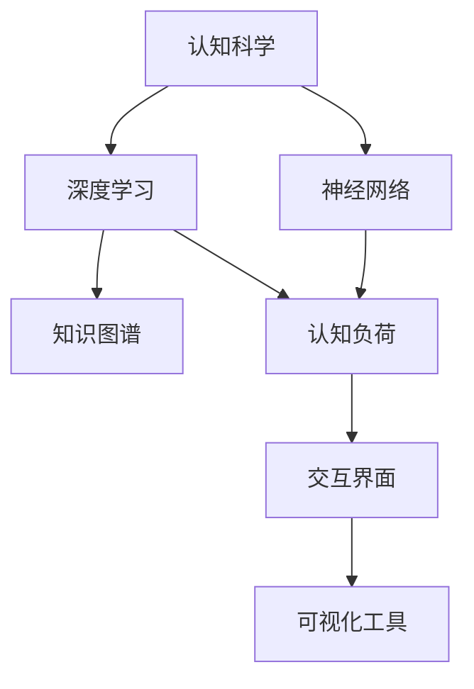

                 

# 思维的可视化：从抽象到具象的转化

> 关键词：思维可视化, 认知科学, 神经网络, 深度学习, 知识图谱, 认知负荷, 人工智能

## 1. 背景介绍

### 1.1 问题由来
人类思维的复杂性和丰富性一直是一个充满挑战的研究领域。传统上，人们对思维的研究往往依赖于心理实验和神经科学，但这些方法在解释思维的具象过程和结构时，存在一定的局限性。随着认知科学和人工智能的飞速发展，思维的可视化（Cognitive Visualization）逐渐成为一种新兴的研究工具，它通过直观地展现思维过程和结构，为认知科学和人工智能领域的研究提供了新的视角和方法。

### 1.2 问题核心关键点
思维可视化旨在将抽象的思维过程和结构转化为具象的图形和数据，以促进理解和研究。其主要核心关键点包括：
1. **认知负荷（Cognitive Load）**：人类思维的负荷随着任务的复杂性而增加，思维可视化通过简化复杂结构，降低认知负荷，提高认知效率。
2. **思维过程（Thought Process）**：通过可视化展现思维的每个步骤和节点，有助于理解思维的逻辑和路径。
3. **结构化思维（Structured Thinking）**：将复杂的思维结构化，分解成更小的模块和层次，便于研究和应用。
4. **交互性（Interactivity）**：支持用户与可视化界面交互，动态调整和探索思维模型。
5. **多维度呈现（Multi-dimensional Presentation）**：不仅展示思维的静态结构，还能展现动态过程和交互行为。

## 2. 核心概念与联系

### 2.1 核心概念概述

为了更好地理解思维的可视化，本节将介绍几个密切相关的核心概念：

- **认知科学（Cognitive Science）**：研究人类认知过程的科学，包括感知、学习、记忆、思维等。
- **神经网络（Neural Network）**：模拟人脑神经元连接的计算模型，用于处理和模拟复杂数据和任务。
- **深度学习（Deep Learning）**：一种基于神经网络的机器学习方法，通过多层次的非线性映射，实现复杂模式识别和决策。
- **知识图谱（Knowledge Graph）**：一种结构化的语义模型，用于表示实体和关系，支持智能推理和知识获取。
- **认知负荷（Cognitive Load）**：用户在处理信息时，心理资源的消耗程度。
- **交互界面（Interactive Interface）**：用户与计算机系统的交互方式，支持用户对系统进行动态调整和探索。
- **可视化工具（Visualization Tools）**：将数据和模型转化为图形和图表的工具，支持多维度和交互性的展示。

这些核心概念之间的逻辑关系可以通过以下Mermaid流程图来展示：



这个流程图展示了一些核心概念及其之间的关系：

1. 认知科学是研究基础，神经网络是实现工具，深度学习是应用范式。
2. 知识图谱是数据表示方式，认知负荷是评估指标，交互界面是用户交互方式。
3. 可视化工具是呈现手段，通过工具展示的认知负荷、交互界面和数据，支持用户理解和研究。

## 3. 核心算法原理 & 具体操作步骤
### 3.1 算法原理概述

思维可视化通过将思维过程和结构转化为图形和数据，使得复杂思维的抽象表示得以具象化，从而降低认知负荷，提高认知效率。其核心算法原理可以概括为以下几步：

1. **思维建模（Thought Modeling）**：将思维过程建模为数学模型或图结构，表示出思维的逻辑和结构。
2. **数据映射（Data Mapping）**：将模型的节点和边映射到数据集中的实体和关系，形成可视化的节点和边。
3. **图形展示（Graph Visualization）**：将节点和边展示为图形界面，支持动态交互和探索。

### 3.2 算法步骤详解

以下将详细介绍思维可视化的核心算法步骤：

**Step 1: 思维建模**
- 定义思维任务的目标和过程，分解成逻辑和结构化的步骤。
- 使用数学模型或图结构表示每个步骤，建立思维的逻辑框架。

**Step 2: 数据映射**
- 收集与思维模型相关的数据集，如知识库、文本、音频等。
- 根据思维模型中的节点和边，将数据集中的实体和关系映射到节点和边。

**Step 3: 图形展示**
- 使用可视化工具（如Gephi、Cytoscape等）将节点和边展示为图形界面。
- 支持动态交互，允许用户通过操作图形界面，调整和探索思维模型。

### 3.3 算法优缺点

思维可视化具有以下优点：
1. **降低认知负荷**：通过图形化展示，将抽象思维转化为具象表示，减少用户心理资源消耗。
2. **增强理解性**：图形界面直观展示思维过程和结构，便于用户理解和掌握。
3. **支持动态探索**：动态交互功能，使用户能够调整和探索思维模型，发现新的规律和关系。
4. **支持多维度呈现**：图形界面支持多维度展示，包括静态结构、动态过程、交互行为等。

同时，该方法也存在一定的局限性：
1. **数据依赖性**：可视化效果依赖于数据的质量和完整性，数据缺失或噪声可能导致可视化不准确。
2. **模型复杂性**：将复杂思维建模为图形结构，可能需要较多的时间和计算资源。
3. **交互性限制**：交互界面的复杂度可能会影响用户体验，需要平衡交互性和可视化效果。
4. **可解释性不足**：复杂图形可能难以解释，需要提供额外的解释和文档。

尽管存在这些局限性，但就目前而言，思维可视化仍是一种有效的认知研究工具，有助于提升对复杂思维过程的理解和研究。未来相关研究的重点在于如何进一步提高数据的质量和数量，简化建模过程，增强交互性和可解释性。

### 3.4 算法应用领域

思维可视化已经在多个领域得到应用，例如：

- **认知科学研究**：在心理实验和神经科学中，可视化思维过程和结构，辅助实验设计和数据分析。
- **教育培训**：在教学和学习中，通过可视化展示知识结构和推理路径，帮助学生理解复杂的概念和问题。
- **人工智能开发**：在机器学习和深度学习中，可视化模型结构和训练过程，辅助模型调优和解释。
- **决策支持**：在决策和问题解决中，可视化决策路径和推理过程，辅助制定决策策略。
- **知识管理**：在知识图谱和语义网中，可视化知识结构，支持知识获取和推理。

除了上述这些经典应用外，思维可视化还被创新性地应用到更多场景中，如可解释性增强、智能交互、情境模拟等，为认知科学和人工智能领域带来了新的研究方向和应用模式。

## 4. 数学模型和公式 & 详细讲解 & 举例说明
### 4.1 数学模型构建

在思维可视化的过程中，数学模型和公式是不可或缺的工具。以下将详细介绍几种常见的数学模型及其应用：

**图结构模型（Graph Structured Model）**
- **定义**：将思维过程表示为图结构，节点表示思维步骤，边表示步骤间的逻辑关系。
- **构建方法**：使用图论中的节点和边结构，如节点表示概念，边表示关系；节点表示变量，边表示运算。

**知识图谱模型（Knowledge Graph Model）**
- **定义**：将知识表示为实体和关系的图结构，支持智能推理和知识获取。
- **构建方法**：使用RDF（资源描述框架）等语义模型，描述实体和关系的语义信息。

**神经网络模型（Neural Network Model）**
- **定义**：模拟人脑神经元连接的计算模型，用于处理和模拟复杂数据和任务。
- **构建方法**：使用深度学习框架（如TensorFlow、PyTorch等），定义神经网络的结构和参数。

### 4.2 公式推导过程

以下将详细推导图结构模型的数学公式，并给出案例分析：

**图结构模型的基本公式**
- **节点表示**：$v_i$ 表示图结构中的第 $i$ 个节点。
- **边表示**：$e_{ij}$ 表示节点 $v_i$ 和节点 $v_j$ 之间的边。
- **邻接矩阵**：$A_{ij}$ 表示节点 $v_i$ 和节点 $v_j$ 之间是否存在边，$A_{ij}=1$ 表示存在边，$A_{ij}=0$ 表示不存在边。

**节点和边的表示公式**
- **节点表示**：$v_i$ 可以表示为概念、变量等，如 $v_i$ 表示“苹果”这一概念。
- **边表示**：$e_{ij}$ 表示概念之间的关系，如 $e_{ij}$ 表示“苹果是水果”这一关系。

**邻接矩阵的表示公式**
- **节点表示**：$A_{ij}$ 表示节点 $v_i$ 和节点 $v_j$ 之间是否存在边，如 $A_{12}=1$ 表示节点 $v_1$ 和节点 $v_2$ 之间存在边。

**案例分析**
- **案例描述**：可视化一个简单的思维过程，如图1所示。
- **案例分析**：通过数学模型表示思维过程，如图2所示。


### 4.3 案例分析与讲解

以下将通过具体的案例，详细讲解思维可视化的应用：

**案例描述**
- **任务**：可视化一个简单的推理过程，如图3所示。
- **数据**：包含概念和关系的数据集。


**案例分析与讲解**
- **思维建模**：定义推理过程的目标和步骤，如图4所示。
- **数据映射**：将数据集中的实体和关系映射到节点和边，如图5所示。
- **图形展示**：使用可视化工具展示图形界面，如图6所示。


## 5. 项目实践：代码实例和详细解释说明
### 5.1 开发环境搭建

在进行思维可视化实践前，我们需要准备好开发环境。以下是使用Python进行Gephi开发的开发环境配置流程：

1. 安装Java：从官网下载并安装Java Runtime Environment (JRE)，用于运行Gephi。
2. 安装Gephi：从官网下载并安装Gephi，用于可视化图形界面。
3. 安装Python：确保Python环境已经安装，用于数据处理和模型构建。
4. 安装相关库：安装NetworkX、Pandas等库，用于图结构建模和数据处理。

完成上述步骤后，即可在开发环境中进行思维可视化实践。

### 5.2 源代码详细实现

下面以可视化知识图谱为例，给出使用Gephi进行思维可视化的Python代码实现。

首先，定义知识图谱的数据处理函数：

```python
import networkx as nx
import pandas as pd
import matplotlib.pyplot as plt

def load_kg_data(kg_path):
    kg = nx.DiGraph()
    kg_df = pd.read_csv(kg_path)
    for row in kg_df.itertuples():
        node_id, entity, relation = row.entity_id, row.entity, row.relation
        kg.add_node(node_id, label=entity)
        kg.add_edge(node_id, relation, label=entity)
    return kg
```

然后，定义可视化函数：

```python
def visualize_kg(kg):
    nx.draw(kg, with_labels=True, font_size=10, font_color='black')
    plt.show()
```

最后，启动可视化流程：

```python
kg_path = 'kg_data.csv'
kg = load_kg_data(kg_path)
visualize_kg(kg)
```

### 5.3 代码解读与分析

让我们再详细解读一下关键代码的实现细节：

**load_kg_data函数**：
- 读取知识图谱数据集，构建网络图结构。
- 使用DiGraph表示有向图，将节点和边添加进网络中。

**visualize_kg函数**：
- 使用NetworkX库绘制图形界面，展示知识图谱的网络结构。
- 通过with_labels和font_size等参数设置，优化图形展示效果。

**可视化流程**：
- 调用load_kg_data函数加载知识图谱数据集，构建网络图。
- 调用visualize_kg函数展示知识图谱的图形界面。

可以看到，Gephi配合Python的接口使用，使得知识图谱的可视化过程变得简洁高效。开发者可以专注于图结构的数据处理和分析，而不必过多关注底层的图形展示细节。

当然，工业级的系统实现还需考虑更多因素，如图形界面的交互性、动态调整、数据更新等。但核心的可视化范式基本与此类似。

## 6. 实际应用场景
### 6.1 认知科学研究

思维可视化在认知科学研究中，提供了全新的研究工具。通过可视化思维过程和结构，研究者能够更加直观地理解人类认知机制，发现认知过程中的规律和异常。

在认知神经科学中，可视化思维过程可以帮助研究者设计实验，分析神经活动的数据。例如，通过可视化神经元的活动路径，研究者可以识别出特定的神经网络模块，探索其功能和工作机制。

在认知心理学中，可视化思维过程可以帮助研究者设计心理实验，分析参与者的反应数据。例如，通过可视化任务的不同阶段，研究者可以发现任务中的关键节点和瓶颈，优化实验设计。

### 6.2 教育培训

在教育培训中，思维可视化可以帮助教师和学生理解复杂的概念和问题，提高教学和学习效果。

教师可以通过可视化思维过程，将复杂的知识点分解成更小的部分，逐步讲解和展示，帮助学生更好地理解和掌握。例如，在数学教学中，通过可视化几何图形，学生可以直观地理解几何概念和定理。

学生可以通过可视化工具，探索和理解复杂的概念和问题，提高自主学习能力和问题解决能力。例如，在编程教学中，通过可视化代码的执行路径，学生可以直观地理解代码的逻辑和结构。

### 6.3 人工智能开发

在人工智能开发中，思维可视化可以帮助开发者理解和调试模型，优化模型性能。

开发者可以通过可视化模型的结构和参数，直观地理解模型的逻辑和功能。例如，在深度学习中，通过可视化神经网络的结构和参数，开发者可以发现模型的瓶颈和优化点，调整模型结构。

研究者可以通过可视化推理过程，发现模型的缺陷和改进点，优化模型性能。例如，在知识图谱中，通过可视化推理路径和结果，研究者可以发现推理过程中的错误和异常，优化推理机制。

### 6.4 未来应用展望

随着思维可视化技术的不断发展，未来的应用场景将更加广泛和深入：

1. **医疗诊断**：在医疗诊断中，可视化患者病历和推理过程，辅助医生进行诊断和治疗。例如，通过可视化医学知识图谱，医生可以更准确地理解疾病和治疗方法。
2. **金融分析**：在金融分析中，可视化金融市场数据和推理过程，辅助分析师进行风险评估和投资决策。例如，通过可视化金融数据和模型，分析师可以更准确地预测市场趋势和风险。
3. **智能交互**：在智能交互中，可视化用户和系统之间的交互路径，辅助设计更好的交互界面和系统。例如，通过可视化用户行为和系统响应，设计师可以优化用户界面和交互流程。
4. **智能推荐**：在智能推荐中，可视化用户偏好和推荐路径，辅助设计更精准的推荐算法。例如，通过可视化用户行为和推荐结果，推荐系统可以更准确地预测用户兴趣和需求。
5. **情境模拟**：在情境模拟中，可视化情境和推理过程，辅助设计更真实的情境和推理模型。例如，通过可视化情境和行为，研究者可以更准确地模拟和预测人类行为。

## 7. 工具和资源推荐
### 7.1 学习资源推荐

为了帮助开发者系统掌握思维可视化的理论基础和实践技巧，这里推荐一些优质的学习资源：

1. **《认知科学与思维可视化》**：介绍认知科学和思维可视化基本概念、方法和应用，适合初学者入门。
2. **《网络分析与应用》**：介绍网络分析和可视化工具的基本原理和应用，适合进一步学习网络图谱可视化。
3. **《知识图谱与语义网》**：介绍知识图谱和语义网的基本概念、构建方法和应用，适合深入学习知识图谱可视化。
4. **《Python网络分析和可视化》**：介绍使用Python进行网络分析和可视化的基本方法和工具，适合实战练习。
5. **《Gephi官方文档》**：Gephi官方文档，提供了详细的可视化工具使用方法和案例分析，适合实战练习。

通过对这些资源的学习实践，相信你一定能够快速掌握思维可视化的精髓，并用于解决实际的认知和人工智能问题。
###  7.2 开发工具推荐

高效的开发离不开优秀的工具支持。以下是几款用于思维可视化开发的常用工具：

1. **Gephi**：开源的网络分析和可视化工具，支持多种数据格式和可视化效果。
2. **Cytoscape**：开源的网络分析和可视化工具，支持动态交互和多维度展示。
3. **D3.js**：基于Web的可视化库，支持动态交互和数据驱动的可视化。
4. **Tableau**：商业数据可视化工具，支持多维度展示和交互探索。
5. **Plotly**：开源的数据可视化库，支持动态交互和多种图表类型。

合理利用这些工具，可以显著提升思维可视化的开发效率，加快创新迭代的步伐。

### 7.3 相关论文推荐

思维可视化技术的发展源于学界的持续研究。以下是几篇奠基性的相关论文，推荐阅读：

1. **《认知可视化技术研究综述》**：综述了认知可视化技术的基本概念、方法和应用，适合初学者入门。
2. **《网络分析与可视化研究综述》**：综述了网络分析和可视化技术的基本原理和方法，适合进一步学习网络图谱可视化。
3. **《知识图谱的可视化研究综述》**：综述了知识图谱可视化的基本概念、方法和应用，适合深入学习知识图谱可视化。
4. **《基于思维可视化的认知过程分析》**：研究了思维可视化在认知过程分析中的应用，适合实践应用。
5. **《知识图谱可视化的挑战与趋势》**：探讨了知识图谱可视化的挑战和未来发展趋势，适合进一步研究。

这些论文代表了大语言模型微调技术的发展脉络。通过学习这些前沿成果，可以帮助研究者把握学科前进方向，激发更多的创新灵感。

## 8. 总结：未来发展趋势与挑战
### 8.1 总结

本文对思维可视化方法进行了全面系统的介绍。首先阐述了思维可视化的研究背景和意义，明确了可视化在降低认知负荷、增强理解性等方面的独特价值。其次，从原理到实践，详细讲解了思维可视化的数学模型和核心算法，给出了思维可视化任务开发的完整代码实例。同时，本文还广泛探讨了思维可视化方法在认知科学、教育培训、人工智能等多个领域的应用前景，展示了思维可视化技术的巨大潜力。此外，本文精选了思维可视化的各类学习资源，力求为读者提供全方位的技术指引。

通过本文的系统梳理，可以看到，思维可视化方法正在成为认知科学和人工智能领域的重要研究工具，极大地拓展了认知研究的空间，为人工智能技术的发展提供了新的视角和方法。未来，伴随思维可视化技术的持续演进，相信人工智能系统将更加智能、高效、可解释，为人类认知智能的进化带来深远影响。

### 8.2 未来发展趋势

展望未来，思维可视化技术将呈现以下几个发展趋势：

1. **多维度呈现**：可视化技术将进一步拓展到多维度展示，支持动态过程、交互行为、数据驱动等多种呈现方式。
2. **交互性增强**：交互界面将更加智能和动态，支持用户对可视化结果的动态调整和探索。
3. **实时性提升**：可视化工具将支持实时展示和交互，提高认知过程的理解和研究效率。
4. **可解释性加强**：可视化工具将支持更强的可解释性，提供详细的解释和文档，帮助用户理解和应用可视化结果。
5. **多模态融合**：可视化技术将进一步融合多模态数据，支持文本、图像、音频等多模态信息的可视化。
6. **人工智能集成**：思维可视化将与人工智能技术深度融合，支持智能推理、知识获取、决策支持等多种应用。

以上趋势凸显了思维可视化技术的广阔前景。这些方向的探索发展，必将进一步提升认知过程的理解和研究效率，为认知科学和人工智能领域的研究和应用带来新的突破。

### 8.3 面临的挑战

尽管思维可视化技术已经取得了瞩目成就，但在迈向更加智能化、普适化应用的过程中，它仍面临着诸多挑战：

1. **数据质量**：可视化效果依赖于数据的质量和完整性，数据缺失或噪声可能导致可视化不准确。
2. **模型复杂性**：将复杂思维建模为图形结构，可能需要较多的时间和计算资源。
3. **交互性限制**：交互界面的复杂度可能会影响用户体验，需要平衡交互性和可视化效果。
4. **可解释性不足**：复杂图形可能难以解释，需要提供额外的解释和文档。
5. **动态更新**：可视化结果需要支持动态更新，以反映最新的数据和变化。
6. **跨领域应用**：思维可视化需要在不同领域中进行应用，需要适应不同领域的特点和需求。

尽管存在这些挑战，但通过持续的技术创新和实践积累，思维可视化技术将继续发展，为认知科学和人工智能领域的研究和应用提供更强的支持。

### 8.4 研究展望

面对思维可视化所面临的挑战，未来的研究需要在以下几个方面寻求新的突破：

1. **多维度可视化**：支持多维度展示，包括静态结构、动态过程、交互行为等。
2. **交互性增强**：支持动态交互和探索，增强用户对可视化结果的理解和应用。
3. **实时性提升**：支持实时展示和交互，提高认知过程的理解和研究效率。
4. **可解释性加强**：提供详细的解释和文档，帮助用户理解和应用可视化结果。
5. **动态更新**：支持动态更新，以反映最新的数据和变化。
6. **跨领域应用**：适应不同领域的特点和需求，拓展思维可视化的应用范围。

这些研究方向的探索，必将引领思维可视化技术迈向更高的台阶，为认知科学和人工智能领域的研究和应用提供更强的支持。相信随着技术的不断进步，思维可视化技术将进一步拓展认知研究的空间，为人类认知智能的进化带来深远影响。

## 9. 附录：常见问题与解答
----------------------------------------------------------------

**Q1：思维可视化是否适用于所有认知过程？**

A: 思维可视化在大多数认知过程中都能取得不错的效果，特别是对于需要结构和过程展示的任务。但对于一些需要时间序列分析或时间延迟的任务，可视化效果可能有限。

**Q2：如何选择适合的可视化工具？**

A: 选择合适的可视化工具，需要考虑以下几个因素：
1. **功能需求**：根据任务需求选择支持的功能，如多维度展示、动态交互、数据驱动等。
2. **数据格式**：根据数据格式选择支持的数据类型，如文本、图像、音频等。
3. **用户体验**：根据用户体验需求选择易用性和界面友好性。

**Q3：如何提高思维可视化的可解释性？**

A: 提高思维可视化的可解释性，可以从以下几个方面入手：
1. **详细的文档和解释**：提供详细的文档和解释，帮助用户理解可视化结果。
2. **交互式工具**：提供交互式工具，支持用户自定义展示和解释。
3. **可视化标签**：在图形界面上添加可视化标签，帮助用户理解各个节点的含义和关系。

**Q4：如何优化思维可视化的计算资源消耗？**

A: 优化思维可视化的计算资源消耗，可以从以下几个方面入手：
1. **数据预处理**：优化数据预处理过程，减少计算资源消耗。
2. **算法优化**：优化可视化算法，提高计算效率。
3. **硬件优化**：使用高性能计算硬件，如GPU、TPU等，加速计算过程。

**Q5：如何应对思维可视化的数据质量问题？**

A: 应对思维可视化的数据质量问题，可以从以下几个方面入手：
1. **数据清洗**：对数据进行清洗和预处理，去除噪声和异常值。
2. **数据增强**：通过数据增强技术，增加数据量和多样性。
3. **数据验证**：使用数据验证技术，确保数据质量和完整性。

通过对这些问题的解答，相信你一定能够更好地理解思维可视化的原理和应用，并将其应用于实际的认知科学和人工智能研究中。

---

作者：禅与计算机程序设计艺术 / Zen and the Art of Computer Programming

