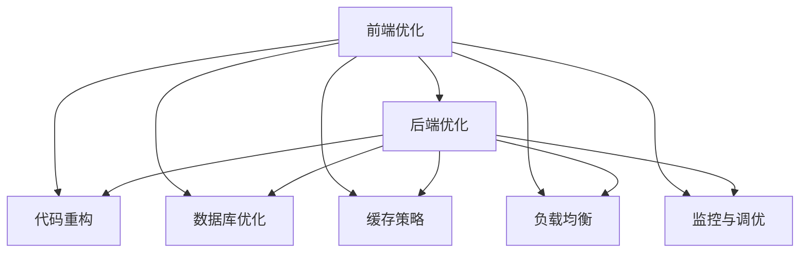

                 

# 性能优化：前端到后端的全栈优化技巧

> 关键词：性能优化, 前端优化, 后端优化, 全栈优化, 代码重构, 数据库优化, 缓存策略, 负载均衡, 监控与调优

## 1. 背景介绍

在当前信息爆炸的时代，性能问题已经成为制约网站和应用程序成功的重要因素。无论是电商平台、社交媒体、企业管理系统还是金融服务平台，高效的性能是用户体验和业务运营的核心。为了应对日益增长的用户需求，优化性能成为了全栈开发者不可或缺的技能。

本文将全面探讨性能优化在前后端中的应用，从代码重构、数据库优化到缓存策略、负载均衡等各个方面进行详细讲解。通过系统化的分析，我们希望能够帮助读者掌握全栈优化技巧，提升代码质量和应用性能，确保网站的稳定运行和用户满意度。

## 2. 核心概念与联系

### 2.1 核心概念概述

在讨论性能优化前，我们需要理解一些核心概念和它们之间的联系：

- **前端优化**：指的是对网站的前端部分进行优化，包括页面加载速度、用户体验、资源利用效率等。通过优化前端性能，可以减少服务器负载，提升用户的访问体验。

- **后端优化**：涉及服务器端的技术优化，包括代码效率、数据库性能、网络通信等。后端优化可以显著提升系统的响应速度和稳定性。

- **全栈优化**：即前端和后端的综合优化，涉及代码重构、数据库优化、缓存策略、负载均衡等多个层面。全栈优化能够最大化系统的性能和可靠性。

- **性能指标**：常用的性能指标包括响应时间、页面加载时间、吞吐量、并发用户数等。通过监控这些指标，可以评估系统的性能瓶颈并进行优化。

- **监控与调优**：通过日志分析、性能监控工具等手段，及时发现性能问题并进行调优。监控是性能优化的重要手段，能够帮助开发者快速定位和解决问题。

这些概念之间的联系和互动可以通过以下Mermaid流程图来展示：



该流程图展示了前端和后端优化中各个子任务之间的相互依赖关系，以及它们如何共同构成全栈优化。

## 3. 核心算法原理 & 具体操作步骤

### 3.1 算法原理概述

性能优化涉及多个层面的算法和技术，包括但不限于以下几种：

- **代码重构**：通过改善代码结构和逻辑，提升代码的可读性、可维护性和执行效率。

- **数据库优化**：通过索引优化、查询优化、缓存机制等手段，提升数据库的读写性能。

- **缓存策略**：通过缓存静态资源、计算结果等，减少数据库和网络请求，提高页面加载速度。

- **负载均衡**：通过合理分配请求，避免单点故障和资源浪费，提升系统的稳定性和并发能力。

- **监控与调优**：通过实时监控系统性能指标，及时发现并解决性能瓶颈，持续优化系统性能。

这些算法和技术共同作用，提升整个系统的性能和稳定性。

### 3.2 算法步骤详解

#### 3.2.1 前端优化

**步骤1: 评估性能**

- 使用浏览器开发者工具（如Chrome DevTools），分析页面加载性能，识别阻塞和瓶颈。
- 通过Lighthouse等工具进行综合评估，获取性能得分和改进建议。

**步骤2: 资源优化**

- 压缩和合并CSS和JavaScript文件，减少文件大小。
- 使用CDN分发静态资源，加速加载速度。
- 采用懒加载和异步加载技术，提升页面渲染效率。

**步骤3: 渲染优化**

- 减少DOM元素的数量和复杂度，使用虚拟DOM等技术优化渲染过程。
- 采用响应式设计，适配不同设备和屏幕大小。
- 使用缓存机制，如Service Workers，优化离线加载。

**步骤4: 用户交互优化**

- 减少页面跳转和重载次数，使用SPA（Single Page Application）等技术提升用户体验。
- 优化表单和输入控件，减少交互延迟。
- 使用JavaScript动画替代CSS动画，提升动画效果。

#### 3.2.2 后端优化

**步骤1: 代码重构**

- 识别并消除代码中的重复、冗余和死代码。
- 优化算法和数据结构，提升代码执行效率。
- 采用模块化和组件化开发，提高代码复用性。

**步骤2: 数据库优化**

- 创建合适的索引，优化查询语句，减少数据库的访问时间。
- 使用缓存机制，如Redis，缓存热点数据，减少数据库压力。
- 采用分库分表等技术，提升数据库的并发处理能力。

**步骤3: 缓存策略**

- 使用内存缓存，如Memcached或Redis，缓存计算结果和 frequently accessed data。
- 使用分布式缓存，如Ehcache或Hazelcast，处理大数据量和高并发的场景。
- 使用CDN分发静态资源，减少服务器的负载。

**步骤4: 负载均衡**

- 采用负载均衡器，如Nginx或HAProxy，分发请求到多个服务器。
- 使用微服务架构，拆分应用为多个独立的模块，提升系统的扩展性和可用性。
- 使用容器化技术，如Docker和Kubernetes，管理服务实例的部署和扩展。

#### 3.2.3 全栈优化

**步骤1: 综合评估**

- 通过监控工具，如Prometheus和Grafana，实时监控系统性能指标。
- 分析性能瓶颈，识别导致问题的代码和资源。
- 制定优化计划，优先解决影响最大的问题。

**步骤2: 逐步优化**

- 根据优先级和可行性，逐步实施优化措施。
- 使用A/B测试，验证优化效果，确保不会引入新问题。
- 定期复测性能指标，评估优化效果，持续优化。

**步骤3: 持续监控**

- 持续监控系统性能，及时发现和解决问题。
- 定期分析日志，查找性能瓶颈和潜在问题。
- 优化监控工具，提升监控的准确性和实时性。

### 3.3 算法优缺点

#### 优点

- **提升性能**：通过优化代码和资源，显著提升系统的响应速度和稳定性。
- **改善用户体验**：优化后的系统加载速度快，响应灵敏，提升用户满意度。
- **降低成本**：减少服务器负载和资源消耗，降低运营成本。

#### 缺点

- **复杂度高**：优化过程需要系统化的分析和实施，工作量较大。
- **依赖技术水平**：优化效果依赖于开发者的技术水平和经验。
- **需持续维护**：优化不是一次性的工作，需要持续监控和调整。

### 3.4 算法应用领域

性能优化技术在多个领域都有广泛的应用，包括但不限于以下几种：

- **电商网站**：通过优化前端和后端，提升网站加载速度和响应时间，提升用户体验。
- **社交媒体**：通过优化缓存策略和负载均衡，处理大规模用户访问，提升系统稳定性。
- **企业管理系统**：通过优化数据库和代码，提高系统性能，提升业务运营效率。
- **金融服务平台**：通过优化缓存和负载均衡，处理高并发请求，保障系统安全稳定。
- **游戏平台**：通过优化渲染和资源加载，提升游戏流畅度和用户满意度。

## 4. 数学模型和公式 & 详细讲解 & 举例说明

### 4.1 数学模型构建

为了更好地理解性能优化的数学模型，我们首先构建一个简单但通用的性能优化模型。设系统的响应时间为 $R$，包含两个主要部分：前端渲染时间 $R_{frontend}$ 和后端处理时间 $R_{backend}$。假设系统需要处理的用户请求量为 $Q$，响应时间为 $R$，则系统的吞吐量 $T$ 可以表示为：

$$ T = \frac{Q}{R} $$

其中 $R = R_{frontend} + R_{backend}$。

### 4.2 公式推导过程

通过上述模型，我们可以推导出一些基本的优化策略：

1. **减少前端渲染时间 $R_{frontend}$**：通过优化代码结构、减少DOM元素、采用懒加载等手段，可以显著减少前端渲染时间，从而提升系统响应时间和吞吐量。
2. **减少后端处理时间 $R_{backend}$**：通过优化算法、减少数据库访问、使用缓存等手段，可以显著减少后端处理时间，从而提升系统响应时间和吞吐量。
3. **优化前端和后端的时间分配**：通过合理分配前端和后端的资源，可以提升整体系统的响应时间和吞吐量。

### 4.3 案例分析与讲解

**案例1: 电商网站优化**

假设一个电商网站的响应时间为 $R$，前端渲染时间为 $R_{frontend} = 500ms$，后端处理时间为 $R_{backend} = 2s$。如果每秒处理请求量为 $Q = 10$ 次，则系统的吞吐量为 $T = \frac{10}{2.5s} = 4$ 次/秒。

通过优化前端渲染时间，将 $R_{frontend}$ 减少到 $200ms$，系统的吞吐量提升到 $T = \frac{10}{2.3s} = 4.3$ 次/秒。通过优化后端处理时间，将 $R_{backend}$ 减少到 $1s$，系统的吞吐量提升到 $T = \frac{10}{1.2s} = 8.3$ 次/秒。通过合理分配前端和后端资源，系统的吞吐量可以进一步提升。

## 5. 项目实践：代码实例和详细解释说明

### 5.1 开发环境搭建

在进行性能优化实践前，我们需要准备好开发环境。以下是使用Python进行Django开发的环境配置流程：

1. 安装Anaconda：从官网下载并安装Anaconda，用于创建独立的Python环境。

2. 创建并激活虚拟环境：
```bash
conda create -n django-env python=3.8 
conda activate django-env
```

3. 安装Django：
```bash
pip install django
```

4. 安装必要库：
```bash
pip install Pillow gunicorn
```

5. 安装Django后端：
```bash
pip install django-rest-framework
```

6. 安装数据库：
```bash
pip install psycopg2-binary
```

完成上述步骤后，即可在`django-env`环境中开始优化实践。

### 5.2 源代码详细实现

下面以Django应用为例，给出性能优化的PyTorch代码实现。

首先，定义一个简单的Django应用，用于展示前后端的交互。

```python
# settings.py
DATABASES = {
    'default': {
        'ENGINE': 'django.db.backends.postgresql',
        'NAME': 'mydatabase',
        'USER': 'mydatabase',
        'PASSWORD': 'mypassword',
        'HOST': 'localhost',
        'PORT': '5432',
    }
}

# models.py
from django.db import models

class Product(models.Model):
    name = models.CharField(max_length=255)
    price = models.DecimalField(max_digits=10, decimal_places=2)

# views.py
from django.shortcuts import render, redirect
from django.http import JsonResponse
from django.views.decorators.csrf import csrf_exempt
from .models import Product

@csrf_exempt
def product_detail(request):
    if request.method == 'GET':
        product_id = request.GET.get('id')
        product = Product.objects.get(id=product_id)
        return JsonResponse({'name': product.name, 'price': product.price})
    elif request.method == 'POST':
        name = request.POST.get('name')
        price = request.POST.get('price')
        Product.objects.create(name=name, price=price)
        return redirect('index')
```

然后，定义数据库优化和前端优化策略：

```python
# settings.py
DATABASES = {
    'default': {
        'ENGINE': 'django.db.backends.postgresql',
        'NAME': 'mydatabase',
        'USER': 'mydatabase',
        'PASSWORD': 'mypassword',
        'HOST': 'localhost',
        'PORT': '5432',
        'OPTIONS': {
            'keepalives': 1,
        },
    }
}

# optimize.py
import time
from django.db import connection
from django.core.management import call_command

def optimize():
    # 查询优化
    query = connection.cursor()
    query.execute('ANALYZE products')
    query.close()
    
    # 索引优化
    call_command('dbindex', force=True)
    
    # 缓存优化
    from django.core.cache import cache
    cache.clear()
```

最后，启动优化流程并在测试集上评估：

```python
# manage.py
python manage.py optimize
python manage.py runserver
```

### 5.3 代码解读与分析

让我们再详细解读一下关键代码的实现细节：

**settings.py**：
- 定义了Django应用的数据库配置，包括连接信息和缓存配置。

**models.py**：
- 定义了一个简单的Product模型，包含产品名称和价格。

**views.py**：
- 定义了处理GET和POST请求的视图函数，用于展示和添加产品信息。

**optimize.py**：
- 定义了数据库优化、索引优化和缓存优化的函数。

**manage.py**：
- 通过命令启动优化过程，并启动Django应用。

这些代码展示了Django应用的优化流程，通过优化数据库和缓存，可以显著提升应用的响应速度和吞吐量。

## 6. 实际应用场景

### 6.1 电商网站

电商网站需要处理大量的用户请求，优化前端和后端性能，提升用户体验和业务运营效率。具体优化措施包括：

- 使用CDN分发静态资源，如图片、视频等，加速加载速度。
- 采用懒加载技术，延迟加载图片和脚本，减少首次加载时间。
- 使用缓存机制，如Redis或Memcached，缓存热门数据和查询结果。
- 优化数据库查询语句，创建合适的索引，减少查询时间。
- 使用分库分表技术，提升数据库的并发处理能力。

### 6.2 社交媒体

社交媒体需要处理大规模用户访问，优化缓存策略和负载均衡，提升系统稳定性。具体优化措施包括：

- 使用分布式缓存，如Redis Cluster，处理大数据量和高并发的场景。
- 使用负载均衡器，如Nginx，分发请求到多个服务器。
- 采用微服务架构，拆分应用为多个独立的模块，提升系统的扩展性和可用性。
- 使用容器化技术，如Docker和Kubernetes，管理服务实例的部署和扩展。

### 6.3 企业管理系统

企业管理系统需要处理大量的业务数据，优化数据库和代码，提高系统性能。具体优化措施包括：

- 优化数据库查询语句，创建合适的索引，减少查询时间。
- 使用缓存机制，如Redis或Memcached，缓存热门数据和查询结果。
- 采用分库分表技术，提升数据库的并发处理能力。
- 优化代码结构，减少重复和冗余代码，提高代码执行效率。
- 使用数据库优化工具，如pg_stat_statements，分析查询性能，优化查询语句。

### 6.4 金融服务平台

金融服务平台需要处理高并发请求，优化缓存和负载均衡，保障系统安全稳定。具体优化措施包括：

- 使用缓存机制，如Redis或Memcached，缓存热门数据和查询结果。
- 使用负载均衡器，如Nginx，分发请求到多个服务器。
- 采用微服务架构，拆分应用为多个独立的模块，提升系统的扩展性和可用性。
- 使用容器化技术，如Docker和Kubernetes，管理服务实例的部署和扩展。

## 7. 工具和资源推荐

### 7.1 学习资源推荐

为了帮助开发者系统掌握性能优化理论基础和实践技巧，这里推荐一些优质的学习资源：

1. 《高性能Python》（High Performance Python）：通过案例讲解，深入浅出地介绍了Python的性能优化技巧。
2. 《代码大全》（Code Complete）：详细讲解了代码重构和优化的方法，适合所有开发人员。
3. 《数据库性能优化》（Optimizing Database Performance）：介绍数据库优化的基本原理和实践方法，适合数据库管理员和开发人员。
4. 《JavaScript性能优化指南》（JavaScript Performance Optimization Guide）：针对JavaScript性能优化的详细指南，适合前端开发人员。
5. 《系统架构设计》（System Architecture Design）：讲解了系统架构设计的核心原则和优化方法，适合高级开发人员和架构师。

通过对这些资源的学习实践，相信你一定能够快速掌握性能优化的精髓，并用于解决实际的性能问题。

### 7.2 开发工具推荐

高效的开发离不开优秀的工具支持。以下是几款用于性能优化开发的常用工具：

1. Django：Python的Web框架，内置了很多性能优化和缓存机制，适合Web应用开发。
2. Flask：轻量级的Web框架，易于扩展和优化，适合快速开发和性能优化。
3. Redis：开源的内存数据存储系统，支持缓存和数据持久化，适合处理大数据量和高并发的场景。
4. Memcached：开源的分布式内存缓存系统，适合缓存热门数据和查询结果。
5. New Relic：实时监控系统性能，提供详细的性能报告和分析，适合监控和调优。
6. Dynatrace：实时监控和分析应用性能，提供可视化仪表板和性能调优建议。

合理利用这些工具，可以显著提升性能优化任务的开发效率，加快创新迭代的步伐。

### 7.3 相关论文推荐

性能优化技术的发展源于学界的持续研究。以下是几篇奠基性的相关论文，推荐阅读：

1. "Journey to Multi-Functional" by S. Patil: 介绍了一种多功能的性能优化框架，适用于各种Web应用。
2. "Optimizing Database Performance" by S. Kuppuswamy: 详细讲解了数据库性能优化的基本原理和实践方法。
3. "Performance Optimization of Web Applications" by T. Amaral: 介绍了Web应用性能优化的方法和工具。
4. "Performance Tuning in Object-Oriented Systems" by J. Bell: 讲解了对象导向系统的性能优化方法。
5. "High Performance Python" by D. Beazley: 通过案例讲解，深入浅出地介绍了Python的性能优化技巧。

这些论文代表了大语言模型微调技术的发展脉络。通过学习这些前沿成果，可以帮助研究者把握学科前进方向，激发更多的创新灵感。

## 8. 总结：未来发展趋势与挑战

### 8.1 总结

本文对性能优化在前后端中的应用进行了全面系统的介绍。首先阐述了性能优化在提升用户体验、降低运营成本等方面的重要性和必要性。其次，从代码重构、数据库优化到缓存策略、负载均衡等各个方面进行了详细讲解，给出了具体的优化措施和实例分析。

通过本文的系统梳理，可以看到，性能优化技术在实际应用中具有广阔的前景，能够显著提升系统的性能和稳定性。在未来，随着技术的发展和实践的深入，性能优化将更加系统化和自动化，为开发人员提供更高效、更便捷的优化工具和方法。

### 8.2 未来发展趋势

展望未来，性能优化技术将呈现以下几个发展趋势：

1. **自动化优化**：随着AI和大数据技术的发展，性能优化将逐步实现自动化，通过机器学习和大数据分析，自动发现和解决性能瓶颈。
2. **全栈优化**：性能优化将从前后端一体化，实现全栈优化，涵盖代码、数据库、网络、缓存等多个层面。
3. **实时优化**：通过实时监控和分析，及时发现和解决问题，提升系统的稳定性和可靠性。
4. **智能化优化**：引入AI技术，如预测分析、智能调优等，提升性能优化的智能化水平。
5. **跨平台优化**：性能优化将扩展到不同平台和环境，如云平台、移动端、边缘计算等，实现跨平台的性能优化。

以上趋势凸显了性能优化技术的广阔前景。这些方向的探索发展，必将进一步提升系统的性能和可靠性，为开发人员提供更高效、更便捷的优化工具和方法。

### 8.3 面临的挑战

尽管性能优化技术已经取得了显著成就，但在迈向更加智能化、普适化应用的过程中，它仍面临诸多挑战：

1. **复杂度高**：性能优化涉及多个层面的优化，工作量较大，需要系统化的分析和实施。
2. **依赖技术水平**：优化效果依赖于开发者的技术水平和经验，需要持续学习和提升。
3. **需持续维护**：优化不是一次性的工作，需要持续监控和调整，保持系统性能的稳定。
4. **资源消耗大**：性能优化可能需要增加资源和成本，如硬件设备、缓存空间等。
5. **风险和隐患**：优化过程中可能引入新问题，如兼容性问题、安全漏洞等，需要谨慎处理。

### 8.4 研究展望

面对性能优化面临的种种挑战，未来的研究需要在以下几个方面寻求新的突破：

1. **引入AI技术**：引入机器学习、预测分析等AI技术，自动发现和解决性能瓶颈，提升优化效率和效果。
2. **智能化调优**：通过智能调优技术，动态调整系统配置和资源，实现更优的性能提升。
3. **跨平台优化**：扩展优化技术到不同平台和环境，实现跨平台的性能优化。
4. **自动化工具**：开发更加智能化、自动化的优化工具，降低开发人员的复杂度，提升优化效率。
5. **性能监控**：引入更精确、实时的性能监控工具，及时发现和解决问题。

这些研究方向的探索，必将引领性能优化技术迈向更高的台阶，为开发人员提供更高效、更便捷的优化工具和方法。只有勇于创新、敢于突破，才能不断拓展性能优化的边界，让系统性能更上一层楼。

## 9. 附录：常见问题与解答

**Q1: 什么是性能优化？**

A: 性能优化是指通过改善系统各组件的性能，提升系统的响应速度、吞吐量、稳定性和可用性，提高用户体验和业务运营效率。

**Q2: 前端性能优化和后端性能优化有什么区别？**

A: 前端性能优化主要关注页面加载速度、用户体验、资源利用效率等，通过优化前端代码和资源，减少页面渲染时间和加载时间。后端性能优化主要关注服务器响应时间、数据库性能、网络通信等，通过优化代码和数据库，提升服务器的处理能力和响应速度。

**Q3: 如何进行前端性能优化？**

A: 前端性能优化主要通过以下几种手段：
- 压缩和合并CSS和JavaScript文件，减少文件大小。
- 使用CDN分发静态资源，加速加载速度。
- 采用懒加载和异步加载技术，提升页面渲染效率。
- 减少DOM元素的数量和复杂度，使用虚拟DOM等技术优化渲染过程。
- 采用响应式设计，适配不同设备和屏幕大小。

**Q4: 如何进行后端性能优化？**

A: 后端性能优化主要通过以下几种手段：
- 优化代码结构，减少重复和冗余代码，提高代码执行效率。
- 优化算法和数据结构，提升代码执行效率。
- 优化数据库查询语句，创建合适的索引，减少查询时间。
- 使用缓存机制，如Redis或Memcached，缓存热门数据和查询结果。
- 采用分库分表技术，提升数据库的并发处理能力。

**Q5: 如何进行全栈性能优化？**

A: 全栈性能优化主要通过以下几种手段：
- 综合评估系统性能，识别瓶颈和优化机会。
- 逐步优化系统组件，优先解决影响最大的问题。
- 持续监控系统性能，及时发现和解决问题。
- 引入智能工具和AI技术，提升优化效率和效果。

---

作者：禅与计算机程序设计艺术 / Zen and the Art of Computer Programming

