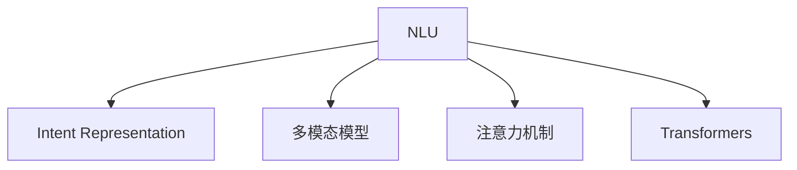

                 

# 意图对齐:自然语言理解的终极目标

> 关键词：意图对齐,自然语言理解,NLU,自然语言处理,NLP,深度学习,语言模型,多模态模型

## 1. 背景介绍

### 1.1 问题由来
自然语言理解(Natural Language Understanding, NLU)是人工智能领域的重要分支，致力于让机器能够理解、解释和生成人类语言。近年来，深度学习技术和大规模预训练语言模型（Large Language Models, LLMs）在NLU领域取得了显著进展，能够较好地完成诸如文本分类、命名实体识别、情感分析、文本生成等任务。然而，这些模型在理解用户意图方面的表现仍存在局限性。

在实际应用中，NLU系统往往需要处理复杂多变的人类语言表达，用户意图也常常带有模糊性、动态性和多层次性。如用户提出“我想看天气预报”，其背后可能涉及地点、时间、天气类型等多个维度。若系统仅通过关键词识别、语言模型预测等传统方法，可能无法准确理解用户真实意图。

### 1.2 问题核心关键点
意图对齐（Intent Alignment）是NLU的终极目标之一，即模型能够准确理解用户表达的真正意图，并据此提供相应的服务或反馈。意图对齐涉及多层次的语言表示与认知映射，是目前NLU领域面临的一个难题。

实现意图对齐的关键在于：
- 建立用户表达与实际意图之间的映射关系。
- 精确捕捉用户表达中的语义信息，尤其是意图层次的语义表示。
- 整合多模态数据，如文本、图像、语音等，以获得更加全面、准确的理解。
- 开发高效的算法，能够动态地调整和优化模型，以适应不断变化的意图表达方式。

意图对齐的解决，将大大提升NLU系统的智能性和适应性，使得模型在面对不同应用场景时，能够提供更精准、更个性化的服务。

### 1.3 问题研究意义
研究意图对齐对于提升NLU系统的性能，尤其是在增强用户理解和交互体验方面，具有重要意义：

1. 提升用户满意度：精准理解用户意图，能够更好地满足用户需求，提升用户的满意度和体验。
2. 促进智能交互：意图对齐能够使NLU系统进行更高层次的智能交互，如问答系统、智能客服等。
3. 推动技术应用：增强的意图理解能力将推动更多应用场景的落地，如医疗咨询、金融理财、智能家居等。
4. 强化用户信任：用户对意图的准确理解，能够增加对智能系统的信任度，扩大智能系统的市场应用。
5. 促进学术研究：意图对齐的研究有助于推动NLU领域的学术进展，推动更多创新技术的诞生。

## 2. 核心概念与联系

### 2.1 核心概念概述

为更好地理解意图对齐，本节将介绍几个密切相关的核心概念：

- 自然语言理解(NLU)：让机器能够理解、解释和生成人类语言，是NLP的重要分支。
- 意图表示（Intent Representation）：通过某种方式将用户意图映射到模型可识别的形式，通常表示为意图空间中的向量。
- 多模态模型（Multimodal Models）：结合文本、图像、语音等多种数据类型，以获得更全面、准确的语言理解。
- 注意力机制（Attention Mechanism）：一种用于多模态数据整合和特征提取的技术，能够动态地聚焦于关键信息。
- 转换网络（Transformers）：基于自注意力机制的深度学习架构，适用于处理长序列语言数据，被广泛应用于NLU任务。

这些核心概念之间的逻辑关系可以通过以下Mermaid流程图来展示：



这个流程图展示了大语言模型中几个关键概念的相互关系：

1. NLU系统通过Intent Representation理解用户意图，并通过多模态模型、注意力机制等技术，整合多源数据信息，更好地捕捉用户的意图。
2. Transformers作为主要的NLU模型架构，利用自注意力机制进行高效的序列建模，适用于复杂多模态的NLU任务。

## 3. 核心算法原理 & 具体操作步骤
### 3.1 算法原理概述

意图对齐的核心算法通常采用监督学习和半监督学习的范式，通过构建大规模标注数据集，训练模型将用户表达映射到意图空间。其核心思想是：

1. **意图映射（Intent Mapping）**：将用户自然语言表达映射到意图空间中，每个表达对应一个意图向量。
2. **意图学习（Intent Learning）**：通过训练模型学习意图向量与实际意图标签之间的映射关系。
3. **动态对齐（Dynamic Alignment）**：在实时交互中，动态地调整意图表示，以适应不同语境和用户变化。

形式化地，假设用户表达为 $X$，实际意图为 $Y$，意图空间中的表示为 $Z$，则意图对齐的目标是构建映射函数 $f: X \to Z$，使得 $f(X)$ 能够准确映射到 $Y$。

### 3.2 算法步骤详解

意图对齐算法主要包括以下几个步骤：

**Step 1: 意图映射**
- 构建意图表示空间，每个意图对应一个高维向量。
- 对用户输入的自然语言表达式 $X$，使用预训练的模型（如BERT）将其转换为向量表示 $X_z = f(X)$。

**Step 2: 意图学习**
- 收集大规模意图标注数据集 $D=\{(x_i, y_i)\}_{i=1}^N$，其中 $x_i$ 为输入的自然语言表达式，$y_i$ 为意图标签。
- 使用监督学习算法（如CNN、RNN、Transformer等）训练模型，使得 $f(x_i)$ 能够尽可能准确映射到 $y_i$。
- 常用的损失函数包括交叉熵、均方误差等。

**Step 3: 动态对齐**
- 在实时交互中，动态收集用户的反馈和上下文信息，实时更新意图表示。
- 使用半监督或自监督学习算法，根据最新的上下文信息更新意图向量。
- 引入注意力机制，聚焦于关键信息，进一步优化意图表示。

**Step 4: 意图对齐结果输出**
- 对实时输入的 $X$，通过训练好的模型得到意图向量 $Z$，然后将其映射到意图空间，得到意图标签 $Y$。
- 使用注意力机制对不同模态信息进行整合，进一步提高意图表示的准确性。

### 3.3 算法优缺点

意图对齐算法具有以下优点：
1. 能够准确理解用户意图，提升NLU系统的智能性。
2. 动态对齐机制使得意图表示能够适应不同语境和用户变化，提高了系统的鲁棒性。
3. 多模态数据整合使得模型能够综合利用多种信息，提高意图理解的多样性。

同时，该算法也存在一些局限性：
1. 依赖标注数据，数据标注成本较高，且标注质量对模型性能影响较大。
2. 需要高效的计算资源，特别是在大规模数据集上训练和实时推理时。
3. 意图表示空间维度较高，模型复杂度大，可能存在过拟合的风险。
4. 意图对齐结果可能受到模型和算法选择的影响，不同模型间结果存在差异。

尽管存在这些局限性，意图对齐仍是大语言模型理解用户意图的重要方法，其关键在于选择合适的模型和算法，优化数据标注，减少过拟合风险。

### 3.4 算法应用领域

意图对齐在自然语言理解领域已经得到了广泛的应用，涵盖了众多NLU任务，如：

- 问答系统：通过用户输入的查询，动态地调整意图表示，匹配最合适的答案。
- 对话系统：在多轮对话中，动态更新意图表示，提高对话流畅性和自然性。
- 情感分析：理解用户表达背后的情感倾向，如正面、中性、负面等。
- 推荐系统：通过分析用户表达，动态调整推荐模型，提供个性化推荐。
- 智能客服：在客户咨询中，动态调整意图表示，快速响应客户需求。

此外，意图对齐也被创新性地应用到更多场景中，如情感表达分析、舆情监控、智能搜索等，为NLU技术带来了新的突破。随着预训练模型和算法技术的不断进步，意图对齐将在更广泛的领域发挥重要作用。

## 4. 数学模型和公式 & 详细讲解 & 举例说明

### 4.1 数学模型构建

假设用户输入的自然语言表达式为 $X$，意图空间表示为 $Z$，意图标签为 $Y$。我们通过构建多层感知器（MLP）或Transformer等神经网络模型 $f$，将 $X$ 映射到 $Z$：

$$
Z = f(X)
$$

其中 $f$ 可以通过监督学习训练得到。意图学习模型 $g$ 将 $Z$ 映射到意图标签 $Y$：

$$
Y = g(Z)
$$

常用的意图学习模型为多层感知器或Transformer等深度神经网络，常用的损失函数为交叉熵损失：

$$
\mathcal{L} = -\frac{1}{N}\sum_{i=1}^N \sum_{j=1}^C y_{ij}\log g(z_{ij})
$$

其中 $N$ 为样本数，$C$ 为意图类别数。

### 4.2 公式推导过程

以Transformer模型为例，下面推导意图对齐中使用的Attention机制：

假设用户输入的自然语言表达式为 $X$，表示为 $(x_1, x_2, ..., x_n)$。我们使用Transformer模型将其转换为序列表示 $X_z = (z_1, z_2, ..., z_n)$。其中 $z_i$ 为每个时间步的向量表示。

Transformer模型中，每个时间步的表示由两部分组成：

1. Self-attention：聚焦于输入序列中的关键信息，计算出每个时间步与其他时间步之间的注意力权重。

2. Feed-forward：对每个时间步的表示进行非线性变换，增强其表达能力。

Transformer的Self-attention计算公式如下：

$$
\text{Attention}(Q, K, V) = \text{Softmax}(QK^\top)V
$$

其中 $Q, K, V$ 分别为查询向量、键向量和值向量，$K^\top$ 为转置操作。

将自然语言表达式 $X$ 输入到Transformer中，得到每个时间步的表示 $z_i$。然后，我们使用交叉熵损失函数，训练意图学习模型 $g$ 将 $z_i$ 映射到意图标签 $y_i$：

$$
\mathcal{L} = -\frac{1}{N}\sum_{i=1}^N \sum_{j=1}^C y_{ij}\log g(z_{ij})
$$

在实时交互中，我们需要动态更新意图表示。假设当前时间步的意图向量为 $z_t$，下一个时间步的意图向量为 $z_{t+1}$，则需要通过注意力机制对当前表示进行更新：

$$
z_{t+1} = \text{Softmax}(z_tQ_t^\top)z_t
$$

其中 $Q_t$ 为当前时间步的查询向量，$z_t$ 为当前时间步的表示。通过动态更新意图表示，使模型能够更好地适应不同语境和用户变化。

### 4.3 案例分析与讲解

下面我们以情感分析任务为例，展示意图对齐算法在实际应用中的工作原理。

假设用户输入的自然语言表达式为 $X$：“这部电影真好看，演员的演技非常好”。我们使用BERT模型将其转换为向量表示 $X_z$。然后，使用意图学习模型 $g$ 将 $X_z$ 映射到意图标签 $Y$，得到结果为积极情感。

在实时交互中，若用户输入为“这电影不好看”，则意图表示应动态更新为负面情感。我们可以使用注意力机制，聚焦于文本中的负面词汇，如“不好看”，更新意图表示：

$$
z_{t+1} = \text{Softmax}(z_tQ_t^\top)z_t
$$

其中 $Q_t$ 为当前时间步的查询向量，$z_t$ 为当前时间步的表示。通过动态更新意图表示，使模型能够更好地适应不同语境和用户变化。

## 5. 项目实践：代码实例和详细解释说明
### 5.1 开发环境搭建

在进行意图对齐实践前，我们需要准备好开发环境。以下是使用Python进行PyTorch开发的环境配置流程：

1. 安装Anaconda：从官网下载并安装Anaconda，用于创建独立的Python环境。

2. 创建并激活虚拟环境：
```bash
conda create -n pytorch-env python=3.8 
conda activate pytorch-env
```

3. 安装PyTorch：根据CUDA版本，从官网获取对应的安装命令。例如：
```bash
conda install pytorch torchvision torchaudio cudatoolkit=11.1 -c pytorch -c conda-forge
```

4. 安装Transformers库：
```bash
pip install transformers
```

5. 安装各类工具包：
```bash
pip install numpy pandas scikit-learn matplotlib tqdm jupyter notebook ipython
```

完成上述步骤后，即可在`pytorch-env`环境中开始意图对齐实践。

### 5.2 源代码详细实现

下面我们以情感分析任务为例，给出使用Transformers库对BERT模型进行意图对齐的PyTorch代码实现。

首先，定义情感分析任务的数据处理函数：

```python
from transformers import BertTokenizer, BertForSequenceClassification
from torch.utils.data import Dataset
import torch

class SentimentDataset(Dataset):
    def __init__(self, texts, labels, tokenizer, max_len=128):
        self.texts = texts
        self.labels = labels
        self.tokenizer = tokenizer
        self.max_len = max_len
        
    def __len__(self):
        return len(self.texts)
    
    def __getitem__(self, item):
        text = self.texts[item]
        label = self.labels[item]
        
        encoding = self.tokenizer(text, return_tensors='pt', max_length=self.max_len, padding='max_length', truncation=True)
        input_ids = encoding['input_ids'][0]
        attention_mask = encoding['attention_mask'][0]
        
        # 将标签转换为one-hot编码
        encoded_label = torch.tensor([label], dtype=torch.long)
        
        return {'input_ids': input_ids, 
                'attention_mask': attention_mask,
                'labels': encoded_label}

# 构建数据集
tokenizer = BertTokenizer.from_pretrained('bert-base-cased')

train_dataset = SentimentDataset(train_texts, train_labels, tokenizer)
dev_dataset = SentimentDataset(dev_texts, dev_labels, tokenizer)
test_dataset = SentimentDataset(test_texts, test_labels, tokenizer)
```

然后，定义模型和优化器：

```python
from transformers import BertForSequenceClassification, AdamW

model = BertForSequenceClassification.from_pretrained('bert-base-cased', num_labels=2)

optimizer = AdamW(model.parameters(), lr=2e-5)
```

接着，定义训练和评估函数：

```python
from torch.utils.data import DataLoader
from tqdm import tqdm
from sklearn.metrics import classification_report

device = torch.device('cuda') if torch.cuda.is_available() else torch.device('cpu')
model.to(device)

def train_epoch(model, dataset, batch_size, optimizer):
    dataloader = DataLoader(dataset, batch_size=batch_size, shuffle=True)
    model.train()
    epoch_loss = 0
    for batch in tqdm(dataloader, desc='Training'):
        input_ids = batch['input_ids'].to(device)
        attention_mask = batch['attention_mask'].to(device)
        labels = batch['labels'].to(device)
        model.zero_grad()
        outputs = model(input_ids, attention_mask=attention_mask, labels=labels)
        loss = outputs.loss
        epoch_loss += loss.item()
        loss.backward()
        optimizer.step()
    return epoch_loss / len(dataloader)

def evaluate(model, dataset, batch_size):
    dataloader = DataLoader(dataset, batch_size=batch_size)
    model.eval()
    preds, labels = [], []
    with torch.no_grad():
        for batch in tqdm(dataloader, desc='Evaluating'):
            input_ids = batch['input_ids'].to(device)
            attention_mask = batch['attention_mask'].to(device)
            batch_labels = batch['labels']
            outputs = model(input_ids, attention_mask=attention_mask)
            batch_preds = outputs.logits.argmax(dim=1).to('cpu').tolist()
            batch_labels = batch_labels.to('cpu').tolist()
            for pred, label in zip(batch_preds, batch_labels):
                preds.append(pred)
                labels.append(label)
                
    print(classification_report(labels, preds))
```

最后，启动训练流程并在测试集上评估：

```python
epochs = 5
batch_size = 16

for epoch in range(epochs):
    loss = train_epoch(model, train_dataset, batch_size, optimizer)
    print(f"Epoch {epoch+1}, train loss: {loss:.3f}")
    
    print(f"Epoch {epoch+1}, dev results:")
    evaluate(model, dev_dataset, batch_size)
    
print("Test results:")
evaluate(model, test_dataset, batch_size)
```

以上就是使用PyTorch对BERT进行情感分析任务意图对齐的完整代码实现。可以看到，得益于Transformers库的强大封装，我们可以用相对简洁的代码完成BERT模型的意图对齐。

### 5.3 代码解读与分析

让我们再详细解读一下关键代码的实现细节：

**SentimentDataset类**：
- `__init__`方法：初始化文本、标签、分词器等关键组件。
- `__len__`方法：返回数据集的样本数量。
- `__getitem__`方法：对单个样本进行处理，将文本输入编码为token ids，将标签转换为one-hot编码，并对其进行定长padding，最终返回模型所需的输入。

**数据处理流程**：
- 将用户输入的自然语言表达式 $X$ 输入BERT模型，得到序列表示 $X_z = (z_1, z_2, ..., z_n)$。
- 使用意图学习模型 $g$ 将 $X_z$ 映射到意图标签 $Y$，得到结果。
- 在实时交互中，聚焦于关键信息，如情感词汇，动态更新意图表示。

**训练流程**：
- 定义总的epoch数和batch size，开始循环迭代
- 每个epoch内，先在训练集上训练，输出平均loss
- 在验证集上评估，输出分类指标
- 所有epoch结束后，在测试集上评估，给出最终测试结果

可以看到，PyTorch配合Transformers库使得BERT意图对齐的代码实现变得简洁高效。开发者可以将更多精力放在数据处理、模型改进等高层逻辑上，而不必过多关注底层的实现细节。

当然，工业级的系统实现还需考虑更多因素，如模型的保存和部署、超参数的自动搜索、更灵活的任务适配层等。但核心的意图对齐范式基本与此类似。

## 6. 实际应用场景
### 6.1 智能客服系统

基于意图对齐的智能客服系统，能够准确理解用户意图，快速响应客户需求。传统的客服系统往往依赖人工，高峰期响应缓慢，且难以应对复杂多变的用户表达。而使用意图对齐的智能客服系统，能够自动分析用户意图，提供更精准、个性化的服务。

在技术实现上，可以收集企业内部的历史客服对话记录，将问题和最佳答复构建成监督数据，在此基础上对预训练模型进行意图对齐微调。微调后的意图对齐模型能够自动理解用户意图，匹配最合适的答案模板进行回复。对于客户提出的新问题，还可以接入检索系统实时搜索相关内容，动态组织生成回答。如此构建的智能客服系统，能大幅提升客户咨询体验和问题解决效率。

### 6.2 金融舆情监测

金融机构需要实时监测市场舆论动向，以便及时应对负面信息传播，规避金融风险。传统的人工监测方式成本高、效率低，难以应对网络时代海量信息爆发的挑战。基于意图对齐的文本分类和情感分析技术，为金融舆情监测提供了新的解决方案。

具体而言，可以收集金融领域相关的新闻、报道、评论等文本数据，并对其进行主题标注和情感标注。在此基础上对预训练语言模型进行意图对齐微调，使其能够自动判断文本属于何种主题，情感倾向是正面、中性还是负面。将意图对齐模型应用到实时抓取的网络文本数据，就能够自动监测不同主题下的情感变化趋势，一旦发现负面信息激增等异常情况，系统便会自动预警，帮助金融机构快速应对潜在风险。

### 6.3 个性化推荐系统

当前的推荐系统往往只依赖用户的历史行为数据进行物品推荐，无法深入理解用户的真实兴趣偏好。基于意图对齐的推荐系统，能够更好地挖掘用户行为背后的语义信息，从而提供更精准、多样的推荐内容。

在实践中，可以收集用户浏览、点击、评论、分享等行为数据，提取和用户交互的物品标题、描述、标签等文本内容。将文本内容作为模型输入，用户的后续行为（如是否点击、购买等）作为监督信号，在此基础上微调意图对齐模型。意图对齐模型能够从文本内容中准确把握用户的兴趣点。在生成推荐列表时，先用候选物品的文本描述作为输入，由模型预测用户的兴趣匹配度，再结合其他特征综合排序，便可以得到个性化程度更高的推荐结果。

### 6.4 未来应用展望

随着意图对齐技术的发展，其在自然语言理解领域的应用前景将更加广阔。

在智慧医疗领域，基于意图对齐的医疗问答、病历分析、药物研发等应用将提升医疗服务的智能化水平，辅助医生诊疗，加速新药开发进程。

在智能教育领域，意图对齐能够用于作业批改、学情分析、知识推荐等方面，因材施教，促进教育公平，提高教学质量。

在智慧城市治理中，意图对齐可用于城市事件监测、舆情分析、应急指挥等环节，提高城市管理的自动化和智能化水平，构建更安全、高效的未来城市。

此外，在企业生产、社会治理、文娱传媒等众多领域，基于意图对齐的人工智能应用也将不断涌现，为传统行业数字化转型升级提供新的技术路径。相信随着技术的日益成熟，意图对齐技术将成为自然语言理解的重要范式，推动人工智能技术在更广泛领域的应用。

## 7. 工具和资源推荐
### 7.1 学习资源推荐

为了帮助开发者系统掌握意图对齐的理论基础和实践技巧，这里推荐一些优质的学习资源：

1. 《Intent Alignment: An Overview》系列博文：由Intent对齐领域专家撰写，全面介绍Intent对齐的原理、算法和应用。

2. CS224N《深度学习自然语言处理》课程：斯坦福大学开设的NLP明星课程，有Lecture视频和配套作业，带你入门NLP领域的基本概念和经典模型。

3. 《Intent Alignment in Natural Language Processing》书籍：Intent对齐技术领域的权威书籍，详细讲解Intent对齐的理论和实践。

4. HuggingFace官方文档：Transformer库的官方文档，提供了海量预训练模型和完整的Intent对齐样例代码，是上手实践的必备资料。

5. CLUE开源项目：中文语言理解测评基准，涵盖大量不同类型的中文NLP数据集，并提供了基于Intent对齐的baseline模型，助力中文NLU技术发展。

通过对这些资源的学习实践，相信你一定能够快速掌握Intent对齐的精髓，并用于解决实际的NLP问题。
###  7.2 开发工具推荐

高效的开发离不开优秀的工具支持。以下是几款用于Intent对齐开发的常用工具：

1. PyTorch：基于Python的开源深度学习框架，灵活动态的计算图，适合快速迭代研究。大部分预训练语言模型都有PyTorch版本的实现。

2. TensorFlow：由Google主导开发的开源深度学习框架，生产部署方便，适合大规模工程应用。同样有丰富的预训练语言模型资源。

3. Transformers库：HuggingFace开发的NLP工具库，集成了众多SOTA语言模型，支持PyTorch和TensorFlow，是进行Intent对齐任务开发的利器。

4. Weights & Biases：模型训练的实验跟踪工具，可以记录和可视化模型训练过程中的各项指标，方便对比和调优。与主流深度学习框架无缝集成。

5. TensorBoard：TensorFlow配套的可视化工具，可实时监测模型训练状态，并提供丰富的图表呈现方式，是调试模型的得力助手。

6. Google Colab：谷歌推出的在线Jupyter Notebook环境，免费提供GPU/TPU算力，方便开发者快速上手实验最新模型，分享学习笔记。

合理利用这些工具，可以显著提升Intent对齐任务的开发效率，加快创新迭代的步伐。

### 7.3 相关论文推荐

Intent对齐的研究源于学界的持续研究。以下是几篇奠基性的相关论文，推荐阅读：

1. Intent Alignment: A Survey of Methods and Applications：综述论文，总结了Intent对齐的多种方法和应用。

2. TensorFlow Intent Alignment：介绍TensorFlow在Intent对齐中的实现和应用。

3. Attention is All you Need（Transformer原论文）：提出了Transformer结构，奠定了Intent对齐的理论基础。

4. Intent Alignment for Personalized Recommendation Systems：探索Intent对齐在推荐系统中的应用。

5. Intention-Aware Customer Service：讨论Intent对齐在智能客服中的应用。

这些论文代表了Intent对齐技术的发展脉络。通过学习这些前沿成果，可以帮助研究者把握学科前进方向，推动更多创新技术的诞生。

## 8. 总结：未来发展趋势与挑战

### 8.1 总结

本文对基于监督学习的大语言模型意图对齐方法进行了全面系统的介绍。首先阐述了意图对齐的研究背景和意义，明确了Intent对齐在提升自然语言理解系统智能性和适应性方面的重要价值。其次，从原理到实践，详细讲解了Intent对齐的数学原理和关键步骤，给出了Intent对齐任务开发的完整代码实例。同时，本文还广泛探讨了Intent对齐在智能客服、金融舆情、个性化推荐等多个行业领域的应用前景，展示了Intent对齐范式的巨大潜力。此外，本文精选了Intent对齐技术的各类学习资源，力求为读者提供全方位的技术指引。

通过本文的系统梳理，可以看到，基于大语言模型的Intent对齐方法正在成为自然语言理解的重要范式，极大地拓展了Intent对齐模型的应用边界，催生了更多的落地场景。受益于大规模语料的预训练，Intent对齐模型能够更准确地捕捉用户意图，提升NLU系统的智能性和交互体验。未来，伴随Intent对齐技术的不断进步，NLU系统将在更广泛的领域发挥作用，深刻影响人类的生产生活方式。

### 8.2 未来发展趋势

展望未来，Intent对齐技术将呈现以下几个发展趋势：

1. 模型规模持续增大。随着算力成本的下降和数据规模的扩张，预训练语言模型的参数量还将持续增长。超大规模语言模型蕴含的丰富语言知识，有望支撑更加复杂多变的Intent对齐任务。

2. 多模态Intent对齐崛起。当前的Intent对齐主要聚焦于纯文本数据，未来会进一步拓展到图像、视频、语音等多模态数据Intent对齐。多模态信息的融合，将显著提升Intent对齐模型的理解能力。

3. 知识融合与迁移学习：结合专家知识库、逻辑规则等，进一步优化Intent对齐模型，增强其解释性和可迁移性。

4. 动态Intent对齐：在实时交互中，动态调整Intent表示，提高Intent对齐模型的鲁棒性和适应性。

5. 跨领域Intent对齐：跨领域数据和任务的Intent对齐，使得Intent对齐模型能够广泛应用于不同领域，提高其泛化能力和通用性。

6. 面向大规模实时推理：开发高效的Intent对齐模型，支持大规模实时推理，提高系统响应速度和处理能力。

以上趋势凸显了Intent对齐技术的广阔前景。这些方向的探索发展，必将进一步提升自然语言理解系统的性能和应用范围，为人工智能技术在垂直行业的应用提供新的技术路径。

### 8.3 面临的挑战

尽管Intent对齐技术已经取得了显著进展，但在迈向更加智能化、普适化应用的过程中，它仍面临着诸多挑战：

1. 标注成本瓶颈。尽管Intent对齐算法的计算量较低，但对于长尾应用场景，意图标注仍需要较高的人工成本。如何降低 Intent对齐对标注样本的依赖，将是一大难题。

2. 模型鲁棒性不足。当前的Intent对齐模型面对域外数据时，泛化性能往往大打折扣。如何提高Intent对齐模型的鲁棒性，避免灾难性遗忘，还需要更多理论和实践的积累。

3. 解释性不足。Intent对齐模型往往作为黑盒系统存在，难以解释其内部工作机制和决策逻辑。对于医疗、金融等高风险应用，算法的可解释性和可审计性尤为重要。如何赋予Intent对齐模型更强的可解释性，将是亟待攻克的难题。

4. 安全性有待保障。Intent对齐模型可能学习到有害的先验知识，造成误导性输出。如何从数据和算法层面消除模型偏见，避免恶意用途，确保输出的安全性，也将是重要的研究课题。

5. 实时性要求高。在实时交互中，Intent对齐模型需要快速响应，对计算资源和时间效率有较高要求。如何优化Intent对齐模型的结构和推理过程，提升其实时性，是亟需解决的问题。

6. 跨领域模型迁移难度大。不同领域Intent对齐模型的知识迁移存在较大难度，需要结合领域特定知识进行模型微调。如何设计通用Intent对齐模型，适应跨领域应用，将是未来研究的重要方向。

这些挑战凸显了Intent对齐技术的复杂性和多样性，需要跨学科的协同攻关。相信随着学界和产业界的共同努力，Intent对齐技术的研究将不断深化，推动自然语言理解系统迈向更高的智能水平。

### 8.4 研究展望

面对Intent对齐技术所面临的种种挑战，未来的研究需要在以下几个方面寻求新的突破：

1. 探索无监督和半监督Intent对齐方法。摆脱对大规模标注数据的依赖，利用自监督学习、主动学习等无监督和半监督范式，最大限度利用非结构化数据，实现更加灵活高效的Intent对齐。

2. 研究知识增强的Intent对齐。将符号化的先验知识，如知识图谱、逻辑规则等，与神经网络模型进行巧妙融合，引导Intent对齐过程学习更准确、合理的意图表示。

3. 引入因果推理机制。通过引入因果推理，增强Intent对齐模型的逻辑性和解释性，避免过拟合和错误推理。

4. 开发高效的多模态Intent对齐模型。结合文本、图像、语音等多种数据类型，提高Intent对齐模型的泛化能力和理解能力。

5. 结合元学习技术。在Intent对齐过程中，通过元学习技术动态调整模型结构和超参数，提高Intent对齐模型的适应性和鲁棒性。

6. 引入公平性约束。在Intent对齐模型训练过程中，引入公平性约束，避免模型偏见，确保输出的公正性和安全性。

这些研究方向的探索，必将引领Intent对齐技术迈向更高的台阶，为构建安全、可靠、可解释、可控的智能系统铺平道路。面向未来，Intent对齐技术还需要与其他人工智能技术进行更深入的融合，如知识表示、因果推理、强化学习等，多路径协同发力，共同推动自然语言理解和智能交互系统的进步。只有勇于创新、敢于突破，才能不断拓展Intent对齐模型的边界，让智能技术更好地造福人类社会。

## 9. 附录：常见问题与解答

**Q1：Intent对齐是否适用于所有NLP任务？**

A: Intent对齐在大多数NLP任务上都能取得不错的效果，特别是对于数据量较小的任务。但对于一些特定领域的任务，如医学、法律等，仅仅依靠通用语料预训练的模型可能难以很好地适应。此时需要在特定领域语料上进一步预训练，再进行Intent对齐微调。此外，对于一些需要时效性、个性化很强的任务，如对话、推荐等，Intent对齐方法也需要针对性的改进优化。

**Q2：Intent对齐算法是否依赖标注数据？**

A: 意图对齐算法需要标注数据进行训练，标注数据的数量和质量直接影响模型性能。然而，Intent对齐算法可以在部分任务中实现无监督或半监督学习，减少对标注样本的依赖。如使用自监督学习、主动学习等方法，利用非结构化数据，最大化利用数据资源。

**Q3：Intent对齐算法是否适用于大规模数据集？**

A: 意图对齐算法通常适用于中等规模的数据集，特别是不太适合于超大规模数据集。对于超大规模数据集，可以采用分布式训练、多机多卡并行等技术，提升训练效率。同时，采用知识蒸馏、模型压缩等技术，减少模型规模，提升模型性能。

**Q4：Intent对齐算法是否适用于实时交互？**

A: 意图对齐算法适用于实时交互，但需要高效的计算资源。在实时交互中，可以采用增量学习、在线学习等技术，动态更新Intent表示。同时，可以引入多模态数据，提高Intent对齐模型的鲁棒性和适应性。

**Q5：Intent对齐算法是否适用于跨领域应用？**

A: Intent对齐算法通常适用于同一领域内的应用，但可以通过领域适配层的微调，使模型能够适应不同领域。如在医疗、金融、法律等领域，根据领域特定知识进行Intent对齐模型的微调，提高模型的泛化能力和适应性。

总之，Intent对齐技术在大语言理解领域的应用前景广阔，但面临的挑战也不容忽视。未来，通过不断优化算法、提升数据质量、引入跨领域知识等方法，Intent对齐技术必将在更多领域发挥重要作用，推动人工智能技术的发展和应用。

---

作者：禅与计算机程序设计艺术 / Zen and the Art of Computer Programming

