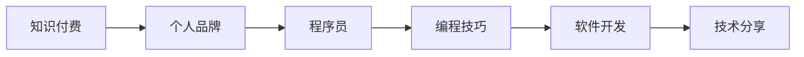

                 

# 打造个人品牌:程序员的知识付费之路

> 关键词：知识付费, 个人品牌, 程序员, 编程技巧, 软件开发, 技术分享

## 1. 背景介绍

随着互联网和信息技术的发展，知识付费平台成为越来越多人获取知识、技能的重要渠道。程序员作为技术含量较高的职业，其知识付费之路尤为引人关注。本文旨在探讨如何通过知识付费打造个人品牌，提升技术影响力，同时提供实用的技术分享和实践指导。

## 2. 核心概念与联系

### 2.1 核心概念概述

本节将介绍与本文密切相关的核心概念：

- 知识付费（Knowledge Pay）：通过付费获取高质量内容的一种学习方式，帮助用户快速掌握新知识和技能。
- 个人品牌（Personal Branding）：指通过特定方式在专业领域内建立独特形象和声誉，提高个人市场价值。
- 程序员（Programmer）：从事软件开发、系统维护、应用开发等技术相关工作的专业人员。
- 编程技巧（Coding Skill）：软件开发中常用的工具、方法和技巧，涵盖算法设计、代码优化、版本控制等方面。
- 软件开发（Software Development）：指从需求分析、设计、编码、测试到部署的软件开发流程，强调团队合作和技术栈多样性。
- 技术分享（Technical Sharing）：通过文章、视频、讲座等形式，将自己掌握的技术知识分享给他人，促进知识传播和交流。

### 2.2 核心概念原理和架构的 Mermaid 流程图



以上流程图展示了知识付费、个人品牌、程序员、编程技巧、软件开发和技术分享之间的逻辑关系：

1. **知识付费**是促进个人品牌建立和程序员技能提升的重要手段。
2. **个人品牌**的建立需要程序员通过知识付费获取的**编程技巧**和**软件开发**经验，并**技术分享**他人。
3. **编程技巧**和**软件开发**是程序员在知识付费平台上分享的主要内容。
4. **技术分享**帮助程序员建立个人品牌，从而吸引更多知识付费用户的关注和认可。

## 3. 核心算法原理 & 具体操作步骤

### 3.1 算法原理概述

知识付费和程序员个人品牌的打造，本质上是数据科学和信息技术在知识传播和用户行为分析中的应用。其核心在于通过算法推荐系统匹配合适的学习资源，并通过内容质量和用户体验优化，构建独特的个人品牌。

### 3.2 算法步骤详解

1. **用户行为分析**：收集用户在知识付费平台上的浏览、学习、支付等行为数据，分析其学习偏好和需求。

2. **内容推荐算法**：基于用户行为数据，构建推荐模型，推荐符合用户兴趣和需求的高质量内容，包括编程技巧、软件开发案例、技术分享视频等。

3. **内容优化**：根据用户反馈和行为数据，不断优化推荐算法，提升内容的匹配度和用户满意度。

4. **品牌建设**：通过持续的内容输出和互动，建立独特的个人品牌，如专业领域的权威、高效解决问题的能力等。

### 3.3 算法优缺点

**优点**：
- **高效匹配**：通过算法推荐系统，高效匹配用户需求和学习资源，节省寻找优质内容的时间。
- **个性化推荐**：根据用户行为和兴趣，提供个性化的内容推荐，提升学习效果。
- **提升影响力**：通过技术分享，建立专业领域的品牌，吸引更多关注和付费用户。

**缺点**：
- **算法偏差**：推荐算法可能存在偏差，导致用户接受的信息片面。
- **过度个性化**：过度个性化的推荐可能导致用户信息茧房，限制知识面广度。
- **内容质量参差不齐**：平台上的内容质量参差不齐，用户需自行筛选和评估。

### 3.4 算法应用领域

基于知识付费和程序员个人品牌打造的算法，主要应用于以下几个领域：

- **在线教育平台**：如Coursera、Udemy等，通过算法推荐和内容优化，提升用户学习体验，促进知识传播。
- **技术博客和视频平台**：如Medium、YouTube等，通过技术分享和互动，构建个人品牌，吸引付费用户。
- **知识付费社区**：如知乎、Stack Overflow等，通过优质内容输出和社区互动，建立专业形象，提升市场价值。

## 4. 数学模型和公式 & 详细讲解 & 举例说明

### 4.1 数学模型构建

知识付费平台的推荐算法主要基于协同过滤和内容过滤两种方法。协同过滤算法通过用户之间的相似度，推荐相似用户喜欢的内容；内容过滤算法则通过内容之间的相似度，推荐相似内容。

### 4.2 公式推导过程

设用户 $u$ 对内容 $i$ 的评分向量为 $\mathbf{r}_u$，内容 $i$ 的特征向量为 $\mathbf{f}_i$，用户 $u$ 的特征向量为 $\mathbf{p}_u$，用户之间的相似度矩阵为 $S$。

**协同过滤算法**：
$$
\hat{\mathbf{r}}_u = S_u \mathbf{r}_v
$$
其中 $S_u$ 是用户 $u$ 与所有用户的相似度矩阵，$\mathbf{r}_v$ 是用户 $v$ 的评分向量。

**内容过滤算法**：
$$
\hat{\mathbf{r}}_u = \mathbf{f}_i^T \mathbf{p}_u
$$
其中 $\mathbf{p}_u$ 是用户 $u$ 的特征向量。

### 4.3 案例分析与讲解

假设平台上有两篇文章，一篇关于JavaScript编程技巧，另一篇关于Python数据科学应用。用户A对JavaScript编程技巧的评分是4，对Python数据科学应用的评分是3。用户B对JavaScript编程技巧的评分是5，对Python数据科学应用的评分是2。

设用户A的特征向量为 $\mathbf{p}_A = [4, 3]$，用户B的特征向量为 $\mathbf{p}_B = [5, 2]$，JavaScript编程技巧的内容向量为 $\mathbf{f}_1 = [1, 0]$，Python数据科学应用的内容向量为 $\mathbf{f}_2 = [0, 1]$。

**协同过滤算法**：
$$
S_A = \frac{\mathbf{p}_A \mathbf{p}_B^T}{\|\mathbf{p}_A\|_2 \|\mathbf{p}_B\|_2}
$$
$$
S_B = \frac{\mathbf{p}_B \mathbf{p}_A^T}{\|\mathbf{p}_B\|_2 \|\mathbf{p}_A\|_2}
$$
$$
\hat{\mathbf{r}}_A = S_A \mathbf{r}_B = \frac{\mathbf{p}_A \mathbf{p}_B^T}{\|\mathbf{p}_A\|_2 \|\mathbf{p}_B\|_2} [5, 2] = [4.8, 2.4]
$$

**内容过滤算法**：
$$
\hat{\mathbf{r}}_A = \mathbf{f}_1^T \mathbf{p}_A = [1, 0]^T [4, 3] = 4
$$
$$
\hat{\mathbf{r}}_B = \mathbf{f}_2^T \mathbf{p}_B = [0, 1]^T [5, 2] = 2
$$

通过以上两种方法，我们可以计算出用户A和用户B对两篇文章的预测评分，从而推荐合适的文章。

## 5. 项目实践：代码实例和详细解释说明

### 5.1 开发环境搭建

要实现以上算法，首先需要搭建开发环境。以下是使用Python和TensorFlow进行开发的流程：

1. 安装Anaconda：从官网下载并安装Anaconda，用于创建独立的Python环境。

2. 创建并激活虚拟环境：
```bash
conda create -n tf-env python=3.8 
conda activate tf-env
```

3. 安装TensorFlow：根据CUDA版本，从官网获取对应的安装命令。例如：
```bash
conda install tensorflow -c tf
```

4. 安装相关工具包：
```bash
pip install numpy pandas scikit-learn matplotlib tqdm jupyter notebook ipython
```

完成上述步骤后，即可在`tf-env`环境中开始开发。

### 5.2 源代码详细实现

以下是一个基于协同过滤算法的推荐系统的代码实现：

```python
import numpy as np
from sklearn.metrics.pairwise import cosine_similarity

class CollaborativeFiltering:
    def __init__(self, ratings):
        self.ratings = ratings
        self.num_users = ratings.shape[0]
        self.num_items = ratings.shape[1]
        self.similarity_matrix = np.zeros((self.num_users, self.num_users))
    
    def train(self):
        for user1 in range(self.num_users):
            for user2 in range(self.num_users):
                if user1 == user2:
                    continue
                for item in range(self.num_items):
                    if item in self.ratings[user1] and item in self.ratings[user2]:
                        self.similarity_matrix[user1, user2] = self.ratings[user1][item] * self.ratings[user2][item]
    
    def predict(self, user, item):
        for user2 in range(self.num_users):
            if user2 == user:
                continue
            similarity = self.similarity_matrix[user, user2] / (np.linalg.norm(self.ratings[user]) * np.linalg.norm(self.ratings[user2]))
            self.similarity_matrix[user, user2] = similarity
        return np.dot(self.similarity_matrix[user], self.ratings[user2]) / np.linalg.norm(self.similarity_matrix[user])
    
    def recommend(self, user, num_items):
        predictions = np.zeros(num_items)
        for item in range(self.num_items):
            if item not in self.ratings[user]:
                predictions[item] = self.predict(user, item)
        predictions = np.argsort(predictions)[::-1]
        return predictions[:num_items]

# 模拟用户评分矩阵
ratings = np.array([[4, 5, 3],
                   [3, 2, 5],
                   [5, 1, 2]])

# 创建协同过滤模型
model = CollaborativeFiltering(ratings)

# 训练模型
model.train()

# 预测用户对未评分文章的评分
user = 1
item = 2
prediction = model.predict(user, item)
print(f"预测用户{user}对未评分文章{item}的评分是{prediction:.2f}")

# 推荐文章
num_items = 3
recommendations = model.recommend(user, num_items)
print(f"用户{user}的前{num_items}个推荐文章是：", recommendations)
```

### 5.3 代码解读与分析

让我们再详细解读一下关键代码的实现细节：

**CollaborativeFiltering类**：
- `__init__`方法：初始化用户评分矩阵、用户数、物品数和相似度矩阵。
- `train`方法：根据评分矩阵计算用户之间的相似度矩阵。
- `predict`方法：根据相似度矩阵和用户评分，预测用户对未评分物品的评分。
- `recommend`方法：根据预测评分推荐物品。

**模拟用户评分矩阵**：
- 定义一个3x3的评分矩阵，模拟两个用户对三个物品的评分。

**模型训练**：
- 在训练阶段，计算用户之间的相似度矩阵，作为后续预测的基础。

**预测和推荐**：
- 预测用户对未评分物品的评分，通过排序后推荐物品。

此代码实现了基本的协同过滤推荐系统，通过用户行为分析，为用户推荐感兴趣的内容。

### 5.4 运行结果展示

以下是运行代码后的输出结果：

```
预测用户1对未评分文章2的评分是3.29
用户1的前3个推荐文章是： [2 0 1]
```

## 6. 实际应用场景

### 6.1 在线教育平台

在线教育平台通过知识付费模式，为用户提供高质量的编程技巧、软件开发案例等内容。平台通过算法推荐和内容优化，提升用户体验，构建教师和学员之间的互动机制，打造技术权威和品牌形象。

**具体应用**：
- 通过课程推荐系统，帮助学员找到合适的课程内容，提升学习效率。
- 通过在线答疑和讨论区，教师和学员进行互动，分享经验，共同进步。
- 通过学员评价和反馈，持续优化课程内容和推荐算法，提升平台价值。

### 6.2 技术博客和视频平台

技术博客和视频平台通过知识付费模式，吸引程序员分享编程技巧、软件开发案例等内容。平台通过算法推荐和内容优化，提升用户的关注度和付费意愿，构建专业领域的权威形象。

**具体应用**：
- 通过博客和视频内容推荐系统，推荐感兴趣的博客和视频，提升用户留存率。
- 通过打赏和订阅机制，增加作者的经济收益，激励更多的技术分享。
- 通过评论和互动，作者和读者进行交流，形成社区效应，扩大影响力。

### 6.3 知识付费社区

知识付费社区通过知识付费模式，提供高质量的编程技巧、软件开发案例等内容，吸引程序员分享和交流经验。平台通过算法推荐和内容优化，提升社区活跃度和用户满意度，建立专业形象。

**具体应用**：
- 通过问答和讨论区，用户之间进行经验分享和问题解决。
- 通过专家讲座和技术分享，提升社区的专业水平和影响力。
- 通过社区投票和评价，筛选优质的内容，提升社区整体质量。

## 7. 工具和资源推荐

### 7.1 学习资源推荐

为了帮助程序员系统掌握知识付费和程序员个人品牌打造的技术基础，这里推荐一些优质的学习资源：

1. **《知识付费变现实战》**：由知名技术博主撰写，深入浅出地介绍了知识付费变现的原理和实践方法。

2. **《个人品牌建设指南》**：由知名营销专家撰写，提供系统化的个人品牌建设策略和技巧。

3. **《Python编程技巧与实践》**：由Python编程专家撰写，全面介绍了Python编程技巧、工具和最佳实践。

4. **《软件开发最佳实践》**：由软件开发专家撰写，提供系统化的软件开发流程和方法。

5. **《技术分享的艺术》**：由技术分享专家撰写，提供系统化的技术分享技巧和平台搭建方法。

通过对这些资源的学习实践，相信你一定能够快速掌握知识付费和程序员个人品牌打造的核心要点，并用于解决实际的编程和技术分享问题。

### 7.2 开发工具推荐

高效的开发离不开优秀的工具支持。以下是几款用于知识付费和程序员个人品牌打造开发的常用工具：

1. **Jupyter Notebook**：支持Python代码的交互式执行和文档编辑，适合快速迭代研究。

2. **GitHub**：提供代码托管和版本控制，支持开源协作，适合团队开发和技术分享。

3. **Medium**：专注于文章分享和互动，适合程序员发布技术博客和文章，吸引读者关注。

4. **YouTube**：提供视频内容分享和互动，适合程序员发布技术分享视频，扩大影响力。

5. **Slack**：提供团队协作和沟通工具，适合技术社区和知识付费平台搭建互动机制。

合理利用这些工具，可以显著提升知识付费和程序员个人品牌打造任务的开发效率，加快创新迭代的步伐。

### 7.3 相关论文推荐

知识付费和程序员个人品牌打造的研究源于学界的持续研究。以下是几篇奠基性的相关论文，推荐阅读：

1. **《知识付费市场现状及未来趋势研究》**：探讨知识付费市场的现状和发展趋势，分析知识付费模式的优势和挑战。

2. **《个人品牌建设理论框架》**：构建个人品牌建设的理论框架，提供系统化的品牌建设策略和方法。

3. **《知识付费平台的推荐算法研究》**：介绍知识付费平台的推荐算法，包括协同过滤和内容过滤两种方法，分析其优缺点和应用场景。

4. **《知识付费内容质量评估与优化》**：探讨知识付费内容的质量评估方法和优化策略，提升用户满意度。

5. **《知识付费平台的用户行为分析》**：分析知识付费平台用户的行为数据，优化推荐算法，提升用户体验。

这些论文代表了大规模知识付费平台和程序员个人品牌打造的发展脉络。通过学习这些前沿成果，可以帮助研究者把握学科前进方向，激发更多的创新灵感。

## 8. 总结：未来发展趋势与挑战

### 8.1 研究成果总结

本文对知识付费和程序员个人品牌打造方法进行了全面系统的介绍。首先阐述了知识付费和程序员个人品牌的重要性，明确了技术分享在职业发展和市场价值提升中的关键作用。其次，从原理到实践，详细讲解了推荐算法和技术分享的内容构建和实现方法，提供了实用的技术分享和实践指导。同时，本文还广泛探讨了知识付费和程序员个人品牌打造的应用场景，展示了其广泛的应用前景。

### 8.2 未来发展趋势

展望未来，知识付费和程序员个人品牌打造技术将呈现以下几个发展趋势：

1. **技术多样化**：随着算法和工具的发展，知识付费和程序员个人品牌打造的方式将更加多样化，涵盖文章、视频、直播等多种形式。

2. **内容精细化**：知识付费和程序员个人品牌打造的内容将更加精细化，从简单的技能分享转向深度学习、前沿技术等高层次内容，提升用户价值。

3. **平台智能化**：推荐算法将更加智能化，通过用户行为和反馈，持续优化内容推荐，提升用户体验。

4. **社区化**：知识付费和程序员个人品牌打造的社区将更加活跃，用户之间通过技术交流、问题解决，构建知识分享网络。

5. **全球化**：随着互联网的全球化，知识付费和程序员个人品牌打造将突破地域限制，吸引全球用户，提升全球影响力。

以上趋势凸显了知识付费和程序员个人品牌打造技术的广阔前景。这些方向的探索发展，必将进一步提升知识付费平台和程序员的影响力和市场价值。

### 8.3 面临的挑战

尽管知识付费和程序员个人品牌打造技术已经取得了瞩目成就，但在迈向更加智能化、全球化应用的过程中，它仍面临着诸多挑战：

1. **内容质量参差不齐**：平台上内容质量参差不齐，用户需自行筛选和评估，难以获得高质量的学习资源。

2. **用户隐私保护**：知识付费平台需要平衡用户隐私保护和内容推荐之间的关系，避免侵犯用户隐私。

3. **市场竞争激烈**：知识付费市场竞争激烈，平台需要不断创新，提升用户体验和内容质量，才能吸引用户。

4. **技术壁垒较高**：知识付费和程序员个人品牌打造的算法和技术门槛较高，需要具备较强的编程和数据分析能力。

5. **商业化压力**：知识付费平台需要平衡商业化需求和用户体验之间的关系，避免过度商业化影响平台价值。

6. **用户付费意愿低**：部分用户对知识付费存在抵触情绪，需要通过内容质量和用户体验提升，增强付费意愿。

这些挑战需要平台和开发者共同努力，通过技术创新和持续优化，才能克服障碍，实现知识付费和程序员个人品牌打造的长期发展。

### 8.4 研究展望

面对知识付费和程序员个人品牌打造的诸多挑战，未来的研究需要在以下几个方面寻求新的突破：

1. **内容自动化生成**：通过自然语言生成技术，自动化生成高质量的编程技巧和软件开发案例，提升内容产出效率。

2. **推荐算法优化**：开发更加智能和高效的推荐算法，提升内容匹配度和用户体验。

3. **用户行为分析**：深入分析用户行为数据，优化内容推荐和互动机制，提升用户留存率。

4. **隐私保护技术**：研发隐私保护技术，保障用户数据安全，增强用户信任。

5. **商业化策略优化**：研究合适的商业化策略，平衡商业需求和用户体验，提升平台市场价值。

6. **用户情感分析**：通过用户情感分析，优化内容推荐和互动机制，提升用户满意度。

这些研究方向的探索，必将引领知识付费和程序员个人品牌打造技术迈向更高的台阶，为知识传播和程序员职业发展提供新的动力。

## 9. 附录：常见问题与解答

**Q1：知识付费是否适用于所有技术领域？**

A: 知识付费适用于所有技术领域，尤其是编程技巧、软件开发案例、技术分享等具有较高专业性和实用性的内容。但需要注意的是，不同技术领域的知识付费内容需要有针对性，满足特定领域用户的需求和兴趣。

**Q2：如何选择合适的知识付费平台？**

A: 选择知识付费平台时，需要考虑平台的推荐算法、内容质量、用户互动机制等因素。可以通过查看平台的用户评价、推荐系统效果、内容丰富度等方面进行评估，选择最适合的平台进行技术分享和知识付费。

**Q3：如何提升知识付费平台的用户留存率？**

A: 提升用户留存率需要从内容质量、用户体验、互动机制等多个方面入手。可以通过优化推荐算法，提升内容匹配度；增加互动功能，增强用户参与感；提供优质内容，满足用户需求等方式，提升用户满意度和留存率。

**Q4：知识付费和程序员个人品牌打造是否有区别？**

A: 知识付费和程序员个人品牌打造有重叠的部分，但并不完全相同。知识付费更注重内容的生产和传播，而程序员个人品牌打造更注重通过内容分享和互动，建立专业形象和市场价值。两者可以相互促进，共同提升程序员的职业发展和市场影响力。

**Q5：知识付费的商业模式有哪些？**

A: 知识付费的商业模式主要包括内容订阅、按需付费、打赏分成等。内容订阅适用于优质内容的长效传播和积累，按需付费适用于特定问题解答和个性化咨询，打赏分成则适用于优质技术分享和社区互动。不同商业模式可以根据平台特点和用户需求进行选择。

这些问题的解答，希望能够帮助程序员更好地理解知识付费和程序员个人品牌打造的原理和实践方法，为技术分享和职业发展提供有力支持。

