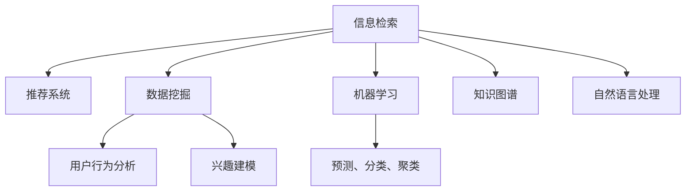

                 

# 打造个人知识发现引擎的技术路径

> 关键词：知识发现引擎、信息检索、推荐系统、数据挖掘、机器学习

## 1. 背景介绍

在信息爆炸的时代，个人如何高效、智能地发现和利用知识，成为了一个亟待解决的问题。知识发现引擎(Knowledge Discovery Engine, KDE)，作为一种智能信息检索和推荐系统，能够帮助用户快速获取所需信息，提高决策效率，成为信息时代不可或缺的技术手段。本文将系统介绍知识发现引擎的核心技术，包括信息检索、推荐系统、数据挖掘和机器学习等方面的原理与实践，以期为读者提供全面的技术指引。

## 2. 核心概念与联系

### 2.1 核心概念概述

为了更好地理解知识发现引擎的工作原理，本节将介绍几个密切相关的核心概念：

- 信息检索：指在数据集中查找与用户查询最相关的信息。包括传统的基于关键词的布尔检索、向量空间模型(VSM)检索，以及基于深度学习的检索模型，如BERT、Transformers等。
- 推荐系统：根据用户历史行为和兴趣，推荐最符合用户需求的物品或内容。推荐算法包括协同过滤、基于内容的推荐、矩阵分解等，以及基于深度学习的推荐模型。
- 数据挖掘：从大量数据中提取知识、模式和洞察的过程，常用于用户行为分析、兴趣建模等。
- 机器学习：通过数据驱动的方法，训练模型进行预测、分类、聚类等任务。
- 知识图谱：由节点和边构成的图结构，用于表示实体之间的关系，常用于信息检索和推荐。
- 自然语言处理：通过机器学习技术，让计算机理解和生成自然语言，用于信息检索和推荐中的文本处理。

这些核心概念之间的逻辑关系可以通过以下Mermaid流程图来展示：



这个流程图展示了这个核心概念之间的关系：

1. 信息检索和推荐系统共同构成知识发现引擎的主体，用户通过信息检索获取所需信息，再通过推荐系统发现更多相关内容。
2. 数据挖掘、机器学习、自然语言处理等技术为信息检索和推荐提供支持。
3. 知识图谱将实体之间的关系整合，提升信息检索和推荐的准确性。

## 3. 核心算法原理 & 具体操作步骤
### 3.1 算法原理概述

知识发现引擎的核心算法原理包括信息检索和推荐系统，这两部分各有侧重但紧密相连，共同构成了一个完整的知识发现流程。信息检索关注如何高效匹配用户查询与文档集合，推荐系统则关注如何在匹配结果中进一步筛选出最符合用户需求的物品。

### 3.2 算法步骤详解

信息检索和推荐系统的核心算法步骤主要包括以下几个方面：

**信息检索步骤**：
1. 用户输入查询，查询处理模块对查询进行标准化、分词、去停用词等预处理。
2. 将查询转换为向量表示，使用VSM或深度学习模型计算查询与文档向量之间的相似度。
3. 对文档集合排序，筛选出最相关的文档，返回给用户。

**推荐系统步骤**：
1. 用户对推荐结果进行反馈，如点击、评分等行为，构建用户行为矩阵。
2. 对物品特征进行建模，得到物品向量表示。
3. 使用协同过滤、基于内容的推荐等方法，计算用户与物品间的相似度，预测用户对物品的兴趣。
4. 对预测结果排序，推荐给用户。

### 3.3 算法优缺点

信息检索和推荐系统的核心算法各有优缺点：

**信息检索算法**：
- **优点**：
  - 能够高效匹配用户查询与文档集合，快速返回结果。
  - 适用于静态数据集合，算法复杂度较低，可扩展性好。
- **缺点**：
  - 对用户查询的表示方式敏感，不同用户对同一查询可能有不同理解。
  - 结果排序算法需要不断优化，提升匹配效果。

**推荐系统算法**：
- **优点**：
  - 能够根据用户历史行为预测用户兴趣，提高推荐相关性。
  - 能够处理动态数据，如用户行为、物品属性等，适合实时推荐场景。
- **缺点**：
  - 需要大量用户行为数据进行训练，难以覆盖长尾用户。
  - 冷启动问题严重，新用户或新物品的推荐效果较差。

### 3.4 算法应用领域

知识发现引擎技术广泛应用在多个领域：

- 搜索引擎：如Google、Bing等，通过信息检索和推荐系统，提供个性化的搜索结果。
- 电商推荐：如淘宝、亚马逊等，根据用户行为推荐商品，提升用户满意度。
- 社交网络：如Facebook、Twitter等，推荐用户感兴趣的内容，增加用户粘性。
- 在线学习：如Coursera、EdX等，推荐相关课程，帮助用户学习新知识。
- 音乐视频：如Spotify、Netflix等，推荐用户喜欢的音乐和视频，丰富用户体验。

## 4. 数学模型和公式 & 详细讲解 & 举例说明
### 4.1 数学模型构建

信息检索和推荐系统的数学模型构建，主要基于向量空间模型(VSM)和矩阵分解等方法。

- **向量空间模型**：将查询和文档表示为向量，通过计算它们之间的余弦相似度来进行匹配。查询向量 $q \in R^d$，文档向量 $d \in R^d$，相似度 $sim(q, d) = \frac{q \cdot d}{\|q\|\|d\|}$。
- **矩阵分解**：将用户-物品矩阵 $U \in R^{N \times M}$ 分解为用户矩阵 $U \in R^{N \times K}$ 和物品矩阵 $V \in R^{K \times M}$，通过低秩矩阵近似，对用户兴趣和物品特征进行建模。矩阵分解模型包括SVD、ALS等。

### 4.2 公式推导过程

**向量空间模型公式推导**：

$$
sim(q, d) = \frac{q \cdot d}{\|q\|\|d\|} = \frac{\sum_{i=1}^d q_i d_i}{\sqrt{\sum_{i=1}^d q_i^2}\sqrt{\sum_{i=1}^d d_i^2}}
$$

**矩阵分解公式推导**：

假设用户-物品矩阵 $U \in R^{N \times M}$ 分解为用户矩阵 $U \in R^{N \times K}$ 和物品矩阵 $V \in R^{K \times M}$，则有：

$$
U = \hat{U}H, V = \hat{V}H^T
$$

其中 $\hat{U} \in R^{N \times K}, \hat{V} \in R^{K \times M}, H \in R^{K \times K}$，$H$ 为正交矩阵。

### 4.3 案例分析与讲解

以信息检索中的向量空间模型为例，假设查询向量 $q = (1, 2, 3)$，文档向量 $d = (4, 5, 6)$，则相似度为：

$$
sim(q, d) = \frac{q \cdot d}{\|q\|\|d\|} = \frac{1 \cdot 4 + 2 \cdot 5 + 3 \cdot 6}{\sqrt{1^2+2^2+3^2}\sqrt{4^2+5^2+6^2}} = 0.97
$$

这个例子展示了向量空间模型的基本原理，即通过计算向量间的余弦相似度，评估查询与文档的相关性。

## 5. 项目实践：代码实例和详细解释说明
### 5.1 开发环境搭建

在进行知识发现引擎开发前，需要先搭建开发环境。以下是使用Python进行PyTorch开发的环境配置流程：

1. 安装Anaconda：从官网下载并安装Anaconda，用于创建独立的Python环境。

2. 创建并激活虚拟环境：
```bash
conda create -n pytorch-env python=3.8 
conda activate pytorch-env
```

3. 安装PyTorch：根据CUDA版本，从官网获取对应的安装命令。例如：
```bash
conda install pytorch torchvision torchaudio cudatoolkit=11.1 -c pytorch -c conda-forge
```

4. 安装TensorFlow：
```bash
pip install tensorflow
```

5. 安装各类工具包：
```bash
pip install numpy pandas scikit-learn matplotlib tqdm jupyter notebook ipython
```

完成上述步骤后，即可在`pytorch-env`环境中开始知识发现引擎的开发。

### 5.2 源代码详细实现

这里我们以推荐系统中的协同过滤算法为例，给出使用PyTorch实现的代码实现。

首先，定义协同过滤的计算函数：

```python
import torch
from torch.nn import nn

class CollaborativeFiltering(nn.Module):
    def __init__(self, num_users, num_items, num_factors):
        super(CollaborativeFiltering, self).__init__()
        self.num_users = num_users
        self.num_items = num_items
        self.num_factors = num_factors
        self.user_matrix = nn.Embedding(num_users, num_factors)
        self.item_matrix = nn.Embedding(num_items, num_factors)
        
    def forward(self, user_ids, item_ids):
        user_embeddings = self.user_matrix(user_ids)
        item_embeddings = self.item_matrix(item_ids)
        rating_pred = torch.matmul(user_embeddings, item_embeddings.t())
        rating_pred = torch.sigmoid(rating_pred)
        return rating_pred
```

然后，定义模型和损失函数：

```python
num_users = 1000
num_items = 5000
num_factors = 20

model = CollaborativeFiltering(num_users, num_items, num_factors)
criterion = nn.BCELoss()

# 准备数据
user_ids = torch.randint(0, num_users, (100,)).numpy()
item_ids = torch.randint(0, num_items, (100,)).numpy()
rating = torch.randint(0, 5, (100,)).numpy().reshape(-1, 1)
rating_pred = model(user_ids, item_ids)
loss = criterion(rating_pred, rating)
print(loss)
```

最后，训练模型：

```python
learning_rate = 0.01
optimizer = torch.optim.SGD(model.parameters(), lr=learning_rate)
num_epochs = 10

for epoch in range(num_epochs):
    user_ids = torch.randint(0, num_users, (100,)).numpy()
    item_ids = torch.randint(0, num_items, (100,)).numpy()
    rating_pred = model(user_ids, item_ids)
    loss = criterion(rating_pred, rating)
    optimizer.zero_grad()
    loss.backward()
    optimizer.step()
    print(f"Epoch {epoch+1}, loss: {loss:.4f}")
```

以上就是使用PyTorch实现协同过滤算法的完整代码实现。可以看到，借助PyTorch的强大计算图功能，协同过滤的实现变得非常简单高效。

### 5.3 代码解读与分析

让我们再详细解读一下关键代码的实现细节：

**CollaborativeFiltering类**：
- `__init__`方法：初始化用户矩阵、物品矩阵等关键组件。
- `forward`方法：定义模型的前向传播过程，计算用户与物品间的相似度，并通过sigmoid函数进行预测。

**模型训练**：
- 定义协同过滤模型和损失函数，设定学习率、优化器等超参数。
- 在每个epoch中，随机生成用户和物品的ID，计算预测评分和真实评分，使用损失函数计算损失。
- 通过反向传播更新模型参数，逐步优化模型性能。

以上代码展示了知识发现引擎中推荐系统的基本实现，借助PyTorch的自动微分和优化器，可以快速迭代模型，优化推荐效果。

## 6. 实际应用场景
### 6.1 智慧图书馆

智慧图书馆通过知识发现引擎，将海量书籍、论文、数据库等资源进行整合和推荐，帮助用户快速找到所需信息，提高阅读和学习效率。用户可以通过查询书名、作者、关键词等方式进行搜索，知识发现引擎根据用户历史行为和兴趣，推荐最相关的书籍和论文。

### 6.2 个性化新闻推荐

基于知识发现引擎的推荐系统，能够根据用户阅读历史和行为偏好，推荐个性化的新闻资讯，帮助用户及时了解最新的时事动态。用户通过浏览、收藏、点赞等行为反馈，知识发现引擎不断优化推荐算法，提升相关性。

### 6.3 医疗知识推荐

医疗领域知识发现引擎通过收集医学文献、临床试验数据等，推荐最符合医生需求的医疗知识，提升诊疗效率和质量。医生可以通过搜索疾病、治疗方案、药品等信息，知识发现引擎根据用户行为推荐相关文献，帮助医生查找最新研究和最佳实践。

### 6.4 未来应用展望

随着知识发现引擎技术的不断发展，未来的应用场景将更加广阔：

- 智能客服：通过知识图谱和自然语言处理技术，构建智能问答系统，提高客户咨询效率。
- 教育培训：通过分析学生学习行为，推荐个性化学习资源和练习题，提升教学效果。
- 企业人力资源管理：通过分析员工职业发展轨迹，推荐培训课程和晋升机会，优化人才结构。
- 智慧旅游：通过分析游客行为，推荐个性化旅游路线和景点，提升旅游体验。
- 电子商务：通过分析用户购物行为，推荐相关商品和促销活动，提升用户满意度。

## 7. 工具和资源推荐
### 7.1 学习资源推荐

为了帮助开发者系统掌握知识发现引擎的理论基础和实践技巧，这里推荐一些优质的学习资源：

1. 《深度学习与信息检索》系列博文：由大模型技术专家撰写，深入浅出地介绍了深度学习在信息检索中的应用，涵盖布尔检索、向量空间模型、深度检索等多个方向。

2. 《推荐系统实战》课程：由知名公司开设的推荐系统课程，讲解了推荐算法、模型训练、系统部署等多个环节，是入门推荐系统的好资源。

3. 《知识图谱导论》书籍：清华大学出版社出版的知识图谱入门书籍，系统介绍了知识图谱的基本概念、构建方法和应用场景，适合初学者和进阶学习者。

4. 《TensorFlow实战》书籍：TensorFlow官方出版物，详细介绍了TensorFlow的使用方法、模型构建和优化技巧，是学习TensorFlow的必备书籍。

5. CLUE开源项目：中文语言理解测评基准，涵盖大量不同类型的中文NLP数据集，并提供了基于深度学习的基线模型，助力中文NLP技术发展。

通过对这些资源的学习实践，相信你一定能够快速掌握知识发现引擎的核心技术，并用于解决实际的NLP问题。

### 7.2 开发工具推荐

高效的开发离不开优秀的工具支持。以下是几款用于知识发现引擎开发的常用工具：

1. PyTorch：基于Python的开源深度学习框架，灵活动态的计算图，适合快速迭代研究。适合实现信息检索和推荐系统的多种算法。

2. TensorFlow：由Google主导开发的开源深度学习框架，生产部署方便，适合大规模工程应用。支持多种推荐系统算法，如协同过滤、基于内容的推荐等。

3. Hadoop和Spark：大数据处理工具，适合处理大规模数据集，支持分布式计算和存储，常用于推荐系统和信息检索中的数据处理。

4. Elasticsearch：开源搜索引擎，支持全文检索、分布式存储、高可用性等特性，适合构建大型的知识发现引擎系统。

5. Redis：开源内存数据库，支持高性能的数据存储和检索，常用于推荐系统中的实时计算和缓存。

6. Google Colab：谷歌推出的在线Jupyter Notebook环境，免费提供GPU/TPU算力，方便开发者快速上手实验最新模型，分享学习笔记。

合理利用这些工具，可以显著提升知识发现引擎的开发效率，加快创新迭代的步伐。

### 7.3 相关论文推荐

知识发现引擎的研究源于学界的持续研究。以下是几篇奠基性的相关论文，推荐阅读：

1. A Survey of Collaborative Filtering Techniques（协同过滤综述论文）：总结了协同过滤算法的基本原理和应用场景，是推荐系统领域的经典之作。

2. Recommender Systems Handbook（推荐系统手册）：由推荐系统领域的权威专家编写，系统介绍了推荐算法、评估指标、应用实例等，是推荐系统的全面指南。

3. Attention is All You Need（Transformer原论文）：提出了Transformer结构，展示了深度学习在信息检索中的应用潜力。

4. Deep Learning for Natural Language Processing（深度学习在NLP中的应用）：NIPS 2017上的综述论文，介绍了深度学习在NLP中的多种应用，包括信息检索、问答系统等。

5. Knowledge-Graph Embedding and Its Application（知识图谱嵌入方法综述）：综述了知识图谱嵌入方法的基本原理和应用场景，是知识图谱领域的经典之作。

这些论文代表了大语言模型微调技术的发展脉络。通过学习这些前沿成果，可以帮助研究者把握学科前进方向，激发更多的创新灵感。

## 8. 总结：未来发展趋势与挑战
### 8.1 总结

本文对知识发现引擎的核心技术进行了全面系统的介绍。首先阐述了知识发现引擎的背景和意义，明确了信息检索、推荐系统、数据挖掘和机器学习等核心技术在知识发现中的作用。其次，从原理到实践，详细讲解了知识发现引擎的数学模型、算法步骤和代码实现，以期为读者提供全面的技术指引。同时，本文还广泛探讨了知识发现引擎在多个领域的应用前景，展示了知识发现引擎的广阔潜力。

通过本文的系统梳理，可以看到，知识发现引擎技术正在成为信息时代不可或缺的重要技术手段，极大地提升了信息检索和推荐的效率和精度。未来，伴随深度学习、自然语言处理、知识图谱等技术的不断进步，知识发现引擎必将在更多领域得到应用，为人类知识发现和利用带来革命性的改变。

### 8.2 未来发展趋势

展望未来，知识发现引擎技术将呈现以下几个发展趋势：

1. 深度学习模型的应用将更加广泛。随着深度学习模型的不断优化，其在大规模数据集上的表现将更加突出，从而提升知识发现引擎的推荐效果。

2. 知识图谱的深度整合将进一步深化。知识图谱不仅用于实体关系表示，还将结合语义理解、图神经网络等技术，提升信息检索和推荐的精度。

3. 多模态信息整合能力将增强。知识发现引擎将融合文本、图像、语音等多种模态信息，构建更加全面和精准的知识表示。

4. 实时计算和分布式处理能力将提升。知识发现引擎将引入流计算、分布式处理等技术，实现对动态数据的实时处理和分析。

5. 基于联邦学习的数据隐私保护将加强。在保障用户隐私的前提下，知识发现引擎将通过联邦学习等技术，实现数据的分布式协同学习，提升推荐系统的公平性和鲁棒性。

6. 解释性和透明性将提升。知识发现引擎将通过可解释性模型和可视化工具，提升算法的透明性，帮助用户理解推荐结果的依据。

以上趋势凸显了知识发现引擎技术的广阔前景。这些方向的探索发展，必将进一步提升信息检索和推荐的精度和效率，为知识发现引擎的产业化应用铺平道路。

### 8.3 面临的挑战

尽管知识发现引擎技术已经取得了显著进展，但在迈向更加智能化、普适化应用的过程中，它仍面临诸多挑战：

1. 数据质量问题。知识发现引擎的性能很大程度上取决于输入数据的质量，如数据噪声、缺失值等问题，需要通过数据清洗、数据增强等技术进行解决。

2. 冷启动问题。对于新用户和新物品，知识发现引擎的推荐效果较差，需要通过更多先验知识进行弥补，如使用知识图谱、用户兴趣建模等。

3. 计算资源消耗。知识发现引擎需要处理大规模数据集，计算资源消耗较大，需要通过优化算法、模型压缩等技术进行资源优化。

4. 算法的公平性和鲁棒性。知识发现引擎需要保证推荐结果的公平性和鲁棒性，避免算法偏见和对抗性攻击。

5. 实时系统的可扩展性。知识发现引擎需要具备高并发、高可用的特性，能够处理大规模的实时请求，需要通过分布式系统设计和技术进行优化。

6. 隐私保护与数据安全。知识发现引擎需要保障用户数据的隐私和安全，避免数据泄露和滥用，需要通过数据加密、隐私保护等技术进行保护。

### 8.4 研究展望

面对知识发现引擎面临的挑战，未来的研究需要在以下几个方面寻求新的突破：

1. 引入更多先验知识。将符号化的先验知识，如知识图谱、逻辑规则等，与神经网络模型进行巧妙融合，引导知识发现引擎的微调过程学习更准确、合理的知识表示。

2. 开发更加高效的推荐算法。开发更加参数高效和计算高效的推荐算法，在固定大部分预训练参数的同时，只更新极少量的任务相关参数，提高推荐系统的实时性和可扩展性。

3. 引入因果推断和对比学习思想。通过引入因果推断和对比学习方法，增强知识发现引擎建立稳定因果关系的能力，学习更加普适、鲁棒的知识表示。

4. 融合多模态信息。将文本、图像、语音等多种模态信息融合，构建更加全面和精准的知识表示，提升知识发现引擎的性能。

5. 引入联邦学习和分布式计算。通过联邦学习等技术，实现数据的分布式协同学习，提升知识发现引擎的公平性和鲁棒性。

6. 提升算法的解释性和透明性。通过可解释性模型和可视化工具，提升算法的透明性，帮助用户理解推荐结果的依据。

这些研究方向的探索，必将引领知识发现引擎技术迈向更高的台阶，为构建安全、可靠、可解释、可控的智能系统铺平道路。面向未来，知识发现引擎需要与其他人工智能技术进行更深入的融合，如知识表示、因果推理、强化学习等，多路径协同发力，共同推动知识发现引擎技术的进步。只有勇于创新、敢于突破，才能不断拓展知识发现引擎的边界，让智能技术更好地造福人类社会。

## 9. 附录：常见问题与解答
### Q1：知识发现引擎在推荐系统中有何优势？

A: 知识发现引擎在推荐系统中的主要优势包括：
1. 能够从大量数据中提取知识、模式和洞察，提升推荐的准确性和相关性。
2. 能够处理动态数据，如用户行为、物品属性等，适合实时推荐场景。
3. 能够融合多模态信息，构建更加全面和精准的知识表示。
4. 能够通过联邦学习等技术，实现数据的分布式协同学习，提升推荐系统的公平性和鲁棒性。

### Q2：如何优化知识发现引擎中的推荐算法？

A: 知识发现引擎中的推荐算法优化可以从以下几个方面入手：
1. 引入先验知识。将符号化的先验知识，如知识图谱、逻辑规则等，与神经网络模型进行巧妙融合，提升推荐的精度和可解释性。
2. 开发更加高效的推荐算法。开发更加参数高效和计算高效的推荐算法，提高推荐系统的实时性和可扩展性。
3. 引入因果推断和对比学习思想。增强知识发现引擎建立稳定因果关系的能力，学习更加普适、鲁棒的知识表示。
4. 融合多模态信息。将文本、图像、语音等多种模态信息融合，构建更加全面和精准的知识表示。

### Q3：知识发现引擎在数据质量问题上如何应对？

A: 知识发现引擎在数据质量问题上可以采取以下应对措施：
1. 数据清洗：通过数据清洗技术，去除噪声和缺失值，提升数据质量。
2. 数据增强：通过数据增强技术，增加数据的多样性和丰富度，减少数据稀疏性。
3. 异常检测：通过异常检测技术，识别和处理异常数据，避免其对模型性能的影响。
4. 数据融合：通过数据融合技术，将不同数据源的数据进行整合，提高数据的完整性和准确性。

### Q4：知识发现引擎在实时系统中如何保证高并发和高可用？

A: 知识发现引擎在实时系统中可以采取以下措施保证高并发和高可用：
1. 分布式系统设计：通过分布式系统设计，将系统拆分为多个节点，提升系统的可扩展性和容错性。
2. 负载均衡：通过负载均衡技术，将请求合理分配到各个节点，避免单节点压力过大。
3. 缓存机制：通过缓存机制，减少对数据库的频繁访问，提高响应速度。
4. 自动扩缩容：通过自动扩缩容技术，根据请求流量动态调整系统资源，保证系统的稳定性和性能。

### Q5：知识发现引擎在隐私保护和数据安全方面如何应对？

A: 知识发现引擎在隐私保护和数据安全方面可以采取以下措施：
1. 数据加密：通过数据加密技术，保护用户数据在传输和存储过程中的安全性。
2. 匿名化处理：通过匿名化处理技术，去除敏感信息，保护用户隐私。
3. 访问控制：通过访问控制技术，限制对数据的访问权限，防止数据滥用。
4. 联邦学习：通过联邦学习技术，实现数据的分布式协同学习，避免数据泄露。

这些措施能够有效提升知识发现引擎的隐私保护和数据安全，保障用户数据的安全性。

---

作者：禅与计算机程序设计艺术 / Zen and the Art of Computer Programming

