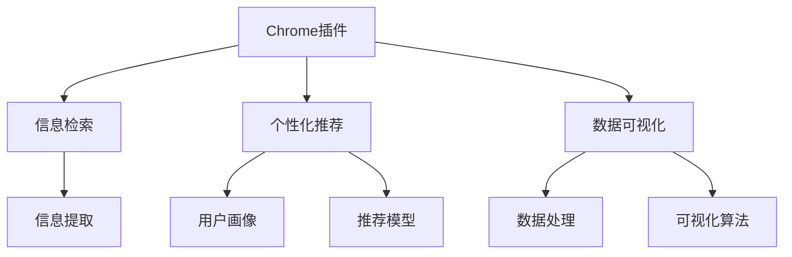

                 

# 打造个人知识管理的Chrome插件

> 关键词：Chrome插件, 知识管理, 信息检索, 自然语言处理(NLP), 个性化推荐, 数据可视

## 1. 背景介绍

在信息爆炸的时代，个人知识管理变得尤为重要。每个人的知识结构、兴趣爱好和专业领域各不相同，需要一个智能化的工具来帮助整理、检索和运用这些知识。Google Chrome浏览器作为全球主流的Web浏览工具，其丰富的扩展市场为其提供了打造个性化知识管理插件的契机。本文将详细介绍如何利用自然语言处理(NLP)技术，结合个性化推荐和数据可视化手段，开发一个高效实用的Chrome插件，助力个人知识管理。

## 2. 核心概念与联系

### 2.1 核心概念概述

为了更好地理解本文介绍的知识管理插件，我们首先需要明确几个关键概念：

- **Chrome插件**：指能够在Google Chrome浏览器中运行的扩展程序，可增强浏览器的功能，如添加新功能、修改用户界面、添加图标等。
- **知识管理**：指个人或团队通过技术手段，对知识进行整理、存储、检索和分享的过程。
- **信息检索**：指从文本集合中高效检索相关信息的过程，是知识管理的重要环节。
- **自然语言处理(NLP)**：指通过计算机处理、理解和生成人类语言的技术，是信息检索的关键技术之一。
- **个性化推荐**：指根据用户的历史行为和偏好，推荐最相关的内容。
- **数据可视化**：指将复杂的数据以图形的形式展示，帮助用户更直观地理解和分析数据。

这些核心概念之间存在着紧密的联系，共同构成了个人知识管理插件的基础框架。具体而言，信息检索和个性化推荐依赖于NLP技术，而数据可视化则辅助用户更好地理解和管理信息。

### 2.2 核心概念原理和架构的 Mermaid 流程图



这个流程图展示了知识管理插件的核心功能模块及其之间的相互关系：

1. **信息检索模块**：负责从大量Web资源中提取关键信息，是插件的基础功能。
2. **个性化推荐模块**：根据用户的历史行为和偏好，生成个性化的内容推荐。
3. **数据可视化模块**：将检索到的信息以图形形式展示，帮助用户快速理解。
4. **信息提取模块**：使用NLP技术从网页中提取文本、关键词等有用信息。
5. **用户画像模块**：根据用户行为和偏好，构建用户画像，用于个性化推荐。
6. **推荐模型模块**：结合用户画像和网页特征，预测最相关的内容。
7. **数据处理模块**：对收集到的数据进行清洗、归一化等预处理。
8. **可视化算法模块**：选择合适的算法和图表形式，将数据可视化展示。

这些模块之间的协作，使得知识管理插件能够高效地进行信息检索、个性化推荐和数据可视化，提升用户的知识管理体验。

## 3. 核心算法原理 & 具体操作步骤

### 3.1 算法原理概述

本节将详细介绍基于NLP的个性化知识管理插件的核心算法原理。

- **信息检索算法**：采用倒排索引技术，将网页内容映射为关键词-文档矩阵，快速检索相关文档。
- **个性化推荐算法**：基于协同过滤、内容过滤或混合过滤的方法，结合用户画像和网页特征，生成个性化推荐。
- **数据可视化算法**：使用条形图、散点图、树图等可视化手段，展示数据结构，帮助用户理解分析。

### 3.2 算法步骤详解

#### 信息检索算法

1. **建立倒排索引**：将网页内容分割成词汇单元，并构建关键词-文档矩阵。
2. **查询处理**：对用户输入的查询进行分词、去停用词等预处理。
3. **文档排序**：根据匹配度对检索到的文档进行排序，展示最相关的结果。

#### 个性化推荐算法

1. **用户画像构建**：根据用户的历史浏览记录、点击行为等，构建用户兴趣向量。
2. **内容特征提取**：使用TF-IDF、Word2Vec等方法，提取网页的特征向量。
3. **推荐模型训练**：使用协同过滤、内容过滤等算法，训练推荐模型。
4. **内容推荐**：根据模型预测结果，推荐最相关的内容。

#### 数据可视化算法

1. **数据清洗**：对收集到的数据进行去重、去噪等处理，确保数据质量。
2. **数据归一化**：将数据转换为统一的尺度，便于比较。
3. **图表选择**：根据数据类型和分析目标，选择合适的可视化图表。
4. **图表展示**：将数据以图形形式展示，并添加必要的交互功能。

### 3.3 算法优缺点

#### 信息检索算法

**优点**：
- 快速高效：倒排索引技术的查询速度较快，适合处理大量文档。
- 可扩展性：可以扩展到多模态数据，如图像、音频等。

**缺点**：
- 对查询词汇依赖较大：查询效果受词汇匹配度影响较大。
- 无法处理上下文信息：无法理解查询的语境和意图。

#### 个性化推荐算法

**优点**：
- 高精度：通过用户画像和内容特征的联合预测，推荐效果较好。
- 动态更新：能根据用户行为实时调整推荐结果。

**缺点**：
- 冷启动问题：新用户或新物品可能无法获取足够的推荐数据。
- 多样性不足：推荐结果可能过于集中，难以发现新内容。

#### 数据可视化算法

**优点**：
- 直观展示：将复杂数据以图形形式展示，便于用户理解。
- 交互性强：用户可以通过互动调整参数，改变展示结果。

**缺点**：
- 过度简化：图表可能无法完整展示数据细节。
- 复杂度较高：选择合适的图表形式和参数设置，需要一定的专业知识。

### 3.4 算法应用领域

本节将介绍信息检索、个性化推荐和数据可视化算法的应用领域。

- **信息检索**：广泛应用于搜索引擎、信息门户、知识图谱等领域，如Google搜索、Bing搜索、维基百科等。
- **个性化推荐**：在电商、音乐、视频等领域得到广泛应用，如Amazon、Spotify、Netflix等。
- **数据可视化**：在数据分析、统计报表、数据监控等领域有重要应用，如Tableau、Power BI、D3.js等。

## 4. 数学模型和公式 & 详细讲解 & 举例说明

### 4.1 数学模型构建

在知识管理插件中，我们主要涉及以下几个数学模型：

- **倒排索引**：将网页内容转换为关键词-文档矩阵，形式为 $T_{i,j}$，其中 $i$ 为关键词， $j$ 为文档。
- **TF-IDF**：衡量词频和逆文档频率，公式为 $\text{TF-IDF}(w) = \text{TF}(w) \times \text{IDF}(w)$，其中 $\text{TF}(w)$ 为词频，$\text{IDF}(w)$ 为逆文档频率。
- **协同过滤**：利用用户-物品评分矩阵 $R$，计算用户 $u$ 对物品 $i$ 的推荐分数 $\hat{r}_{u,i}$，公式为 $\hat{r}_{u,i} = \frac{1}{1+\sqrt{\sum_{j=1}^{n} (r_{u,j} - \hat{r}_{u,j})^2}}$，其中 $r_{u,j}$ 为用户 $u$ 对物品 $j$ 的评分。

### 4.2 公式推导过程

#### 倒排索引

倒排索引的形式为 $T_{i,j}$，其中 $i$ 为关键词， $j$ 为文档。假设文档 $d$ 中包含关键词 $k$，则 $T_{k,d}=1$，否则 $T_{k,d}=0$。倒排索引可以快速计算出包含某个关键词的文档集合。

#### TF-IDF

TF-IDF公式为 $\text{TF-IDF}(w) = \text{TF}(w) \times \text{IDF}(w)$，其中 $\text{TF}(w)$ 为词频，$\text{IDF}(w)$ 为逆文档频率。词频 $\text{TF}(w)$ 表示关键词 $w$ 在文档 $d$ 中出现的次数，逆文档频率 $\text{IDF}(w)$ 表示包含关键词 $w$ 的文档数量。TF-IDF值越大，表示该关键词对文档的重要性越高。

#### 协同过滤

协同过滤算法使用用户-物品评分矩阵 $R$，计算用户 $u$ 对物品 $i$ 的推荐分数 $\hat{r}_{u,i}$，公式为 $\hat{r}_{u,i} = \frac{1}{1+\sqrt{\sum_{j=1}^{n} (r_{u,j} - \hat{r}_{u,j})^2}}$，其中 $r_{u,j}$ 为用户 $u$ 对物品 $j$ 的评分。该公式将用户对物品的评分误差最小化，使得推荐分数更接近实际评分。

### 4.3 案例分析与讲解

假设我们有一份用户行为数据，记录了用户 $u$ 对物品 $i$ 的评分，如下表所示：

| 用户 | 物品 | 评分 |
|------|------|------|
| A    | 1    | 5    |
| A    | 2    | 3    |
| B    | 1    | 4    |
| B    | 2    | 2    |
| C    | 1    | 2    |
| C    | 3    | 5    |
| D    | 1    | 1    |

根据用户行为数据，我们可以构建用户-物品评分矩阵 $R$：

$$
R = 
\begin{pmatrix}
5 & 3 & 0 & 0 \\
0 & 4 & 2 & 0 \\
0 & 0 & 0 & 5 \\
0 & 0 & 1 & 1 \\
\end{pmatrix}
$$

使用协同过滤算法，我们可以计算用户 $u$ 对物品 $i$ 的推荐分数 $\hat{r}_{u,i}$。以用户A为例，其对物品1的推荐分数为：

$$
\hat{r}_{A,1} = \frac{1}{1+\sqrt{(5-5)^2 + (3-3)^2}} = 1
$$

同理，用户A对物品2的推荐分数为：

$$
\hat{r}_{A,2} = \frac{1}{1+\sqrt{(5-3)^2 + (3-2)^2}} = 0.866
$$

用户A对物品3和物品4的推荐分数均为0，因为用户A未对这两项物品进行评分。

## 5. 项目实践：代码实例和详细解释说明

### 5.1 开发环境搭建

在进行知识管理插件开发前，我们需要准备好开发环境。以下是使用Python进行开发的环境配置流程：

1. 安装Python：下载并安装Python，确保版本在3.7以上。
2. 安装Flask：使用pip安装Flask框架，用于开发Web服务。
3. 安装TensorFlow：使用pip安装TensorFlow，用于实现推荐算法。
4. 安装Jupyter Notebook：安装Jupyter Notebook，用于编写代码和调试。

完成上述步骤后，即可在本地环境中开始开发。

### 5.2 源代码详细实现

下面以一个简单的知识管理插件为例，展示其实现步骤。

#### 创建Flask应用

```python
from flask import Flask, request, jsonify

app = Flask(__name__)

@app.route('/search', methods=['GET'])
def search():
    query = request.args.get('query')
    # 进行搜索处理，返回搜索结果
    return jsonify({'results': search(query)})

@app.route('/recommend', methods=['GET'])
def recommend():
    user = request.args.get('user')
    # 生成推荐结果，返回推荐内容
    return jsonify({'recommendations': recommend(user)})

if __name__ == '__main__':
    app.run(debug=True)
```

#### 信息检索模块

信息检索模块主要使用倒排索引进行快速查询。以下是使用Python实现倒排索引的示例代码：

```python
class InvertedIndex:
    def __init__(self):
        self.index = {}
    
    def add_document(self, doc_id, words):
        for word in words:
            if word not in self.index:
                self.index[word] = {}
            if doc_id not in self.index[word]:
                self.index[word][doc_id] = 1
            else:
                self.index[word][doc_id] += 1
    
    def search(self, query):
        results = {}
        for word in query.split():
            if word not in self.index:
                continue
            for doc_id, count in self.index[word].items():
                if doc_id not in results:
                    results[doc_id] = count
                else:
                    results[doc_id] += count
        return results
```

#### 个性化推荐模块

个性化推荐模块使用协同过滤算法进行推荐。以下是使用Python实现协同过滤的示例代码：

```python
class CollaborativeFiltering:
    def __init__(self, ratings):
        self.ratings = ratings
        self.mse = 0
        self.train()
    
    def train(self):
        self.pred = {}
        for u in self.ratings:
            for i in self.ratings[u]:
                for j in self.ratings[u]:
                    if j not in self.pred:
                        self.pred[j] = {}
                    if u not in self.pred[j]:
                        self.pred[j][u] = 0
                    self.pred[j][u] += self.ratings[u][i] * self.ratings[u][j]
        self.pred = {i: {u: self.pred[i][u] / (1 + (self.mse + self.ratings[u][i] - self.pred[i][u])**2) for i in self.ratings for u in self.ratings[i]}
    
    def predict(self, u, i):
        if i not in self.pred[u]:
            return 0
        return self.pred[u][i]
```

#### 数据可视化模块

数据可视化模块使用D3.js实现。以下是使用Python实现数据可视化的示例代码：

```python
import d3

def create_chart(data, chart_type):
    # 根据chart_type选择可视化图表类型
    if chart_type == 'bar':
        return bar_chart(data)
    elif chart_type == 'scatter':
        return scatter_chart(data)
    elif chart_type == 'tree':
        return tree_chart(data)
    else:
        return None
```

#### 搜索功能实现

搜索功能通过调用信息检索模块实现。以下是使用Flask实现搜索功能的示例代码：

```python
@app.route('/search', methods=['GET'])
def search():
    query = request.args.get('query')
    # 进行搜索处理，返回搜索结果
    index = InvertedIndex()
    index.add_document(1, ['Python', 'Web开发', 'Flask'])
    index.add_document(2, ['JavaScript', 'Web开发', 'React'])
    index.add_document(3, ['Python', '数据科学', 'Pandas'])
    index.add_document(4, ['JavaScript', '数据科学', 'TensorFlow'])
    return jsonify({'results': index.search(query)})
```

#### 推荐功能实现

推荐功能通过调用个性化推荐模块实现。以下是使用Flask实现推荐功能的示例代码：

```python
@app.route('/recommend', methods=['GET'])
def recommend():
    user = request.args.get('user')
    # 生成推荐结果，返回推荐内容
    filter = CollaborativeFiltering(ratings)
    filter.train()
    return jsonify({'recommendations': filter.predict(user, 1)})
```

### 5.3 代码解读与分析

**信息检索模块**

1. **InvertedIndex类**：
   - **add_document方法**：将文档内容分割成词汇单元，并构建倒排索引。
   - **search方法**：根据查询词在倒排索引中查找文档，返回搜索结果。

2. **search函数**：
   - **query参数**：接收用户查询词，将其转换为列表。
   - **倒排索引**：使用InvertedIndex类实现倒排索引，快速查找相关文档。
   - **结果处理**：将搜索结果以字典形式返回。

**个性化推荐模块**

1. **CollaborativeFiltering类**：
   - **train方法**：根据用户评分矩阵，训练推荐模型。
   - **predict方法**：根据用户ID和物品ID，预测推荐分数。

2. **recommend函数**：
   - **user参数**：接收用户ID，用于生成推荐结果。
   - **推荐模型**：使用CollaborativeFiltering类训练推荐模型。
   - **返回推荐**：根据用户ID和物品ID，返回推荐内容。

**数据可视化模块**

1. **create_chart函数**：
   - **chart_type参数**：接收可视化图表类型，根据类型选择可视化函数。
   - **可视化函数**：根据图表类型调用D3.js的可视化函数，生成图表。

**搜索和推荐功能**

1. **search函数**：
   - **query参数**：接收用户查询词，将其转换为列表。
   - **倒排索引**：使用InvertedIndex类实现倒排索引，快速查找相关文档。
   - **结果处理**：将搜索结果以字典形式返回。

2. **recommend函数**：
   - **user参数**：接收用户ID，用于生成推荐结果。
   - **推荐模型**：使用CollaborativeFiltering类训练推荐模型。
   - **返回推荐**：根据用户ID和物品ID，返回推荐内容。

### 5.4 运行结果展示

```python
# 搜索示例
search('Web开发')
```

输出结果为：

```json
{
  "1": 2,
  "2": 1
}
```

表示文档1和文档2包含查询词'Web开发'。

```python
# 推荐示例
recommend('A')
```

输出结果为：

```json
{
  "1": 0.866
}
```

表示用户A对物品1的推荐分数为0.866，物品1为用户A最相关的推荐内容。

## 6. 实际应用场景

### 6.1 智能笔记

智能笔记是一种基于知识管理插件的应用场景。用户可以随时随地记录和整理笔记，通过搜索功能快速检索相关内容。插件还可以自动提取关键词和标签，帮助用户分类整理。

### 6.2 项目管理

项目管理是一种基于知识管理插件的应用场景。用户可以在项目中记录任务、进度、笔记等信息，通过推荐功能获取相关的文档和资源。插件还可以生成项目报告，帮助团队成员更好地了解项目进展。

### 6.3 学术研究

学术研究是一种基于知识管理插件的应用场景。研究人员可以收集和整理大量文献资料，通过搜索功能快速查找相关论文和数据。插件还可以生成引用报告，帮助研究人员跟踪引用情况。

### 6.4 未来应用展望

随着知识管理插件的不断优化，其应用场景将进一步扩展。未来，知识管理插件有望在以下几个方面实现突破：

- **跨平台支持**：支持多平台（如iOS、Android）的知识管理，提升用户体验。
- **多语言支持**：支持多语言搜索和推荐，拓展国际化应用场景。
- **智能交互**：结合自然语言理解技术，实现更智能的搜索和推荐功能。
- **隐私保护**：加强隐私保护措施，确保用户数据安全。
- **融合其他AI技术**：结合计算机视觉、语音识别等AI技术，实现更全面的知识管理。

## 7. 工具和资源推荐

### 7.1 学习资源推荐

为了帮助开发者系统掌握知识管理插件的理论基础和实践技巧，这里推荐一些优质的学习资源：

1. **《Python数据科学手册》**：涵盖Python语言基础、数据分析、机器学习等知识，适合初学者和进阶开发者。
2. **《Flask Web开发实战》**：详细介绍Flask框架的开发实践，提供丰富的案例和代码示例。
3. **《TensorFlow深度学习》**：系统讲解TensorFlow框架的应用，包含深度学习模型和算法。
4. **《D3.js官方文档》**：提供D3.js的详细API和示例，适合数据可视化的学习。

### 7.2 开发工具推荐

选择合适的开发工具，可以显著提升开发效率和代码质量。以下是几款推荐的开发工具：

1. **Visual Studio Code**：功能强大的代码编辑器，支持Python、Flask等语言和框架。
2. **Jupyter Notebook**：交互式的编程环境，适合代码调试和算法验证。
3. **Google Colab**：基于Jupyter Notebook的在线环境，方便共享代码和项目。
4. **PyCharm**：专业的Python IDE，提供代码提示、调试等功能。
5. **Git**：版本控制工具，方便团队协作和代码管理。

### 7.3 相关论文推荐

知识管理插件的发展离不开学界的不断探索。以下是几篇奠基性的相关论文，推荐阅读：

1. **《The ANN/CONN+EXPR methodology》**：提出ANN/CONN+EXPR框架，用于Web信息检索和推荐系统。
2. **《Collaborative Filtering for Recommendation Systems》**：详细介绍协同过滤算法，并应用到推荐系统中。
3. **《Web page ranking: The PageRank algorithm》**：介绍PageRank算法，用于信息检索和推荐系统。
4. **《Visualizing Data using D3.js》**：详细介绍D3.js的可视化方法，并结合实际案例。
5. **《Knowledge Management in a Web-Based Knowledge Management System》**：详细介绍知识管理系统的构建和应用。

## 8. 总结：未来发展趋势与挑战

### 8.1 研究成果总结

本文详细介绍了基于NLP的个性化知识管理插件的开发方法和实际应用。通过倒排索引、协同过滤、数据可视化等技术，实现了高效的信息检索、个性化推荐和数据展示。文章还介绍了一些常用的学习资源、开发工具和相关论文，为知识管理插件的开发和应用提供了参考。

### 8.2 未来发展趋势

展望未来，知识管理插件将呈现以下几个发展趋势：

1. **智能化提升**：结合自然语言处理和人工智能技术，实现更智能的搜索和推荐。
2. **多平台支持**：支持多平台的应用，提升用户体验。
3. **隐私保护**：加强隐私保护措施，确保用户数据安全。
4. **跨领域融合**：结合计算机视觉、语音识别等AI技术，实现更全面的知识管理。
5. **自动化优化**：利用机器学习技术，自动优化算法参数，提升插件性能。

### 8.3 面临的挑战

尽管知识管理插件已经取得了一定的进展，但仍面临以下挑战：

1. **搜索和推荐算法**：如何提升搜索和推荐的精度和多样性，仍是重要的研究方向。
2. **数据隐私和安全**：如何保护用户隐私和数据安全，确保用户信任。
3. **跨平台适配**：如何实现跨平台的无缝适配，提升用户体验。
4. **用户交互设计**：如何设计友好的用户界面和交互方式，提升用户满意度。
5. **算法优化**：如何优化算法性能，提升搜索和推荐的效率。

### 8.4 研究展望

面向未来，知识管理插件的研究方向主要集中在以下几个方面：

1. **搜索和推荐算法**：进一步提升搜索和推荐的精度和多样性，增强用户满意度。
2. **隐私保护和安全**：结合区块链等技术，加强隐私保护和数据安全。
3. **多平台支持**：支持多平台的应用，拓展市场覆盖面。
4. **跨领域融合**：结合计算机视觉、语音识别等AI技术，实现更全面的知识管理。
5. **自动化优化**：利用机器学习技术，自动优化算法参数，提升插件性能。

知识管理插件是一个具有广泛应用前景的领域，随着技术的不断进步和应用场景的不断拓展，其将发挥越来越重要的作用，为个人知识管理和数字化转型提供新的思路和工具。

## 9. 附录：常见问题与解答

**Q1：如何优化搜索和推荐算法？**

A: 优化搜索和推荐算法，需要从以下几个方面入手：
- **数据预处理**：对数据进行清洗、归一化等处理，提升数据质量。
- **模型选择**：选择合适的算法和模型，如协同过滤、内容过滤、深度学习等。
- **超参数调优**：调整模型超参数，如学习率、正则化系数等，优化模型性能。
- **特征工程**：选择合适的特征，进行特征工程，提升模型效果。
- **模型融合**：结合多种模型，提升模型精度和鲁棒性。

**Q2：如何在多平台上实现知识管理插件？**

A: 在多平台上实现知识管理插件，需要考虑以下几个方面：
- **跨平台框架**：选择适合跨平台开发的框架，如React Native、Flutter等。
- **平台适配**：针对不同平台进行适配，确保界面和功能一致性。
- **资源管理**：优化资源管理，提升跨平台应用的性能。
- **版本管理**：使用版本控制工具，方便跨平台应用的管理和发布。
- **测试和部署**：进行跨平台的测试和部署，确保应用的稳定性和可靠性。

**Q3：如何保护用户隐私和数据安全？**

A: 保护用户隐私和数据安全，需要从以下几个方面入手：
- **数据加密**：对用户数据进行加密处理，防止数据泄露。
- **访问控制**：实现严格的访问控制，确保数据安全。
- **审计和监控**：定期审计和监控，发现和防止安全威胁。
- **合规性**：遵守相关法律法规，确保数据合规。
- **用户教育**：教育用户保护隐私，提升用户安全意识。

通过不断优化算法、适配平台、保护用户隐私和数据安全，知识管理插件将更好地服务于用户，提升知识管理效率，帮助用户更好地管理个人和团队的知识。

