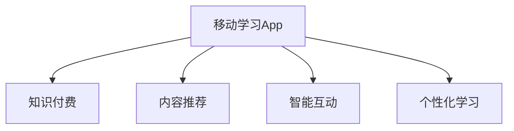

                 

# 打造知识付费的移动学习App

## 1. 背景介绍

随着移动互联网的普及和数字技术的发展，在线教育逐渐成为用户获取知识和技能的重要途径。传统的在线教育平台虽然丰富多样，但往往面临用户学习动机低、互动性差、个性化不足等挑战。知识付费平台以知识为载体，通过付费机制激励优质内容产出，成为在线教育发展的新趋势。

移动学习App作为知识付费平台的核心载体，需要兼顾内容丰富、交互性强、体验优化等多方面需求。本文将深入分析移动学习App的核心概念和技术架构，探讨如何通过高效的算法实现内容推荐、智能互动和个性化学习体验，从而打造一个真正有用的知识付费平台。

## 2. 核心概念与联系

### 2.1 核心概念概述

为更好地理解移动学习App的实现方法，本节将介绍几个关键概念：

- **移动学习App(Mobile Learning App)**：指基于移动终端设备，提供教育内容的App。常见的移动学习App包括Coursera、Udemy、得到等。

- **知识付费(Subscription Learning)**：指用户为获取有价值的内容而付费，激励优质知识内容的生产与传播。知识付费平台能够快速积累高质量教育资源，推动在线教育向高价值转型。

- **内容推荐(Content Recommendation)**：指根据用户的历史行为和兴趣，推荐可能感兴趣的内容。内容推荐系统能够显著提升用户学习体验和留存率。

- **智能互动(Smart Interaction)**：指利用自然语言处理(NLP)、计算机视觉(CV)等技术，实现与用户的智能互动。智能互动能够提高用户学习效率和参与度。

- **个性化学习(Personalized Learning)**：指根据用户的学习行为和反馈，定制个性化的学习路径和内容。个性化学习能够满足用户差异化的学习需求，提升学习效果。

这些核心概念之间的逻辑关系可以通过以下Mermaid流程图来展示：



这个流程图展示出了移动学习App的核心功能模块和它们之间的关联：

1. 移动学习App提供知识付费服务。
2. 内容推荐系统帮助用户发现感兴趣的内容。
3. 智能互动系统增强用户学习体验。
4. 个性化学习系统适配不同用户的学习需求。

## 3. 核心算法原理 & 具体操作步骤

### 3.1 算法原理概述

移动学习App的开发涉及到多个算法和技术模块，包括内容推荐、智能互动和个性化学习等。核心算法原理如下：

- **内容推荐**：利用协同过滤、基于内容的推荐、深度学习推荐等算法，对用户历史行为和兴趣进行建模，预测其可能感兴趣的内容。
- **智能互动**：结合自然语言处理和计算机视觉技术，实现与用户的自然语言对话、图像识别、表情识别等智能交互功能。
- **个性化学习**：通过机器学习、深度学习等技术，根据用户的学习行为和反馈，动态调整学习路径和内容，适配个性化需求。

### 3.2 算法步骤详解

#### 3.2.1 内容推荐算法步骤

1. **数据收集**：收集用户的历史行为数据，如浏览历史、购买记录、评分反馈等。
2. **用户兴趣建模**：通过协同过滤、基于内容的推荐等算法，构建用户兴趣模型。
3. **内容表示**：使用词向量、主题模型等技术，将内容表示为向量形式。
4. **推荐模型训练**：基于用户模型和内容向量，训练推荐模型。
5. **内容推荐**：将新内容向量输入推荐模型，输出推荐结果。

#### 3.2.2 智能互动算法步骤

1. **输入处理**：将用户输入的自然语言或图像转换为机器可理解的形式。
2. **对话生成**：使用聊天机器人或深度学习模型，生成与用户交互的回复。
3. **情绪识别**：利用情感分析技术，识别用户情绪，调整对话策略。
4. **图像识别**：通过计算机视觉技术，对用户上传的图像进行识别和分析。
5. **表情识别**：通过深度学习模型，识别用户表情，增强情感互动。

#### 3.2.3 个性化学习算法步骤

1. **学习行为记录**：记录用户的学习行为数据，如学习时长、测试成绩等。
2. **个性化模型构建**：使用机器学习或深度学习算法，构建个性化学习模型。
3. **学习路径优化**：根据用户学习行为和反馈，动态调整学习路径和内容。
4. **推荐系统集成**：将个性化模型与推荐系统集成，实现动态推荐。
5. **学习效果评估**：定期评估用户学习效果，优化个性化模型。

### 3.3 算法优缺点

#### 3.3.1 内容推荐算法优缺点

**优点**：
1. 能显著提升用户学习体验，增加留存率。
2. 可以通过多样化内容满足不同用户的需求。
3. 算法灵活可扩展，适用于多种推荐场景。

**缺点**：
1. 数据收集和处理成本较高，需要大量标注数据。
2. 算法复杂度高，需要较长的训练时间。
3. 可能出现推荐偏差，影响用户体验。

#### 3.3.2 智能互动算法优缺点

**优点**：
1. 提高用户学习参与度，增强互动体验。
2. 能够实时响应用户需求，提高用户满意度。
3. 结合NLP和CV技术，可以实现多样化的交互方式。

**缺点**：
1. 技术复杂度高，需要较强的技术实力和资源投入。
2. 初期成本较高，需要较长时间的技术积累。
3. 可能存在数据隐私和安全问题。

#### 3.3.3 个性化学习算法优缺点

**优点**：
1. 能够根据用户需求提供个性化内容。
2. 能够动态调整学习路径，提高学习效果。
3. 能够适应不同用户的学习风格和进度。

**缺点**：
1. 数据收集和处理成本较高，需要大量标注数据。
2. 算法复杂度高，需要较长的训练时间。
3. 可能出现个性化推荐偏差，影响用户体验。

## 4. 数学模型和公式 & 详细讲解 & 举例说明

### 4.1 数学模型构建

本节将使用数学语言对内容推荐系统的核心算法进行详细说明。

设用户集合为 $U=\{u_1,u_2,...,u_N\}$，内容集合为 $I=\{i_1,i_2,...,i_M\}$，用户与内容之间的行为矩阵为 $B \in \mathbb{R}^{N\times M}$，其中 $B_{u,i}=b_{u,i}$ 表示用户 $u$ 对内容 $i$ 的评分或行为值。用户与内容的兴趣表示分别为 $\mathbf{U} \in \mathbb{R}^{N\times D_u}$ 和 $\mathbf{I} \in \mathbb{R}^{M\times D_i}$，其中 $D_u$ 和 $D_i$ 为不同用户和内容的嵌入维度。

推荐模型可以表示为 $P_{u,i}=f(\mathbf{U}, \mathbf{I}, b_{u,i})$，其中 $f$ 为推荐函数，$P_{u,i}$ 为推荐结果，表示用户 $u$ 对内容 $i$ 的兴趣程度。

### 4.2 公式推导过程

**协同过滤推荐**：

协同过滤推荐算法基于用户和内容之间的相似度矩阵 $S \in \mathbb{R}^{N\times M}$，其中 $S_{u,i}=s_{u,i}$ 表示用户 $u$ 与内容 $i$ 的相似度。协同过滤推荐算法可以分为基于用户的协同过滤和基于内容的协同过滤：

1. **基于用户的协同过滤**：

$$
P_{u,i} = \sum_{j=1}^M s_{u,j} b_{j,i}
$$

2. **基于内容的协同过滤**：

$$
P_{u,i} = \sum_{j=1}^N s_{u,j} b_{u,j}
$$

**基于内容的推荐**：

基于内容的推荐算法通过对内容进行特征提取，将内容表示为向量形式，并计算用户与内容的相似度：

$$
P_{u,i} = \mathbf{U}_u^\top \mathbf{I}_i
$$

**深度学习推荐**：

深度学习推荐算法通过构建神经网络模型，将用户和内容表示为高维向量，并计算用户与内容的相似度：

$$
P_{u,i} = f(\mathbf{U}_u, \mathbf{I}_i, b_{u,i})
$$

其中 $f$ 为深度学习模型，如多层感知器(MLP)、卷积神经网络(CNN)等。

### 4.3 案例分析与讲解

#### 案例1：基于用户的协同过滤推荐

假设用户 $u_1$ 和 $u_2$ 对内容 $i_1$ 和 $i_2$ 的评分分别为 3 和 4，用户 $u_3$ 和 $u_4$ 对内容 $i_1$ 和 $i_2$ 的评分分别为 4 和 3。设用户与内容的相似度矩阵为：

$$
S = \begin{bmatrix}
1 & 0.5 \\
0.5 & 1 \\
0 & 0.5 \\
0.5 & 0
\end{bmatrix}
$$

则用户 $u_1$ 对内容 $i_2$ 的推荐结果为：

$$
P_{u_1,i_2} = s_{1,2} b_{2,i_2} = 0.5 \times 4 = 2
$$

#### 案例2：基于内容的推荐

假设内容 $i_1$ 和 $i_2$ 的向量表示分别为 $\mathbf{I}_{i_1}=[1,0,1]$ 和 $\mathbf{I}_{i_2}=[1,1,0]$，用户 $u_1$ 的向量表示为 $\mathbf{U}_{u_1}=[0.5,0.5,0.5]$。则用户 $u_1$ 对内容 $i_2$ 的推荐结果为：

$$
P_{u_1,i_2} = \mathbf{U}_{u_1}^\top \mathbf{I}_{i_2} = 0.5 \times 1 + 0.5 \times 1 = 1
$$

## 5. 项目实践：代码实例和详细解释说明

### 5.1 开发环境搭建

要进行移动学习App的开发，需要搭建一个完善的开发环境。以下是使用Python和Flutter开发App的基本环境配置流程：

1. 安装Python：从官网下载并安装Python，创建虚拟环境。
2. 安装Flutter：从官网下载并安装Flutter SDK。
3. 安装Dart：从官网下载并安装Dart SDK。
4. 安装Flutter插件：如Flutter应用开发所需的依赖库。
5. 安装Flutter调试工具：如Android Studio、Visual Studio Code等IDE。

完成上述步骤后，即可在虚拟环境中开始开发。

### 5.2 源代码详细实现

以下是一个简单的移动学习App代码实现，包括用户注册、课程浏览、课程购买等功能：

```dart
import 'package:flutter/material.dart';

void main() {
  runApp(MyApp());
}

class MyApp extends StatelessWidget {
  @override
  Widget build(BuildContext context) {
    return MaterialApp(
      home: HomePage(),
    );
  }
}

class HomePage extends StatefulWidget {
  @override
  HomePageState createState() => HomePageState();
}

class HomePageState extends State<HomePage> {
  List<Course> courses = [
    Course('课程1', '课程简介1', '课程价格1', '课程图片1'),
    Course('课程2', '课程简介2', '课程价格2', '课程图片2'),
    // 省略...
  ];

  @override
  Widget build(BuildContext context) {
    return Scaffold(
      appBar: AppBar(
        title: Text('课程推荐'),
      ),
      body: ListView.builder(
        itemCount: courses.length,
        itemBuilder: (context, index) {
          Course course = courses[index];
          return Card(
            child: Column(
              children: [
                Image.file(File('assets/${course.image}')),
                SizedBox(height: 10),
                Text(course.title),
                SizedBox(height: 10),
                Text(course.description),
                SizedBox(height: 10),
                Text(course.price),
              ],
            ),
          );
        },
      ),
    );
  }
}

class Course {
  final String title;
  final String description;
  final String price;
  final String image;

  Course(this.title, this.description, this.price, this.image);

  @override
  String toString() {
    return title;
  }
}
```

这段代码实现了简单的课程推荐功能，通过列表视图展示课程列表。

### 5.3 代码解读与分析

**HomePage类**：
- `HomePageState`状态管理：管理App的显示和用户交互逻辑。
- `courses`列表：存储推荐的课程信息。
- `ListView.builder`：动态生成列表视图，显示课程信息。
- `Card`组件：用于显示课程的卡片。

**Course类**：
- 存储课程的基本信息，包括标题、简介、价格和图片。
- `toString`方法：用于将课程对象转换为字符串，方便调试和日志输出。

**App布局结构**：
- `MaterialApp`：创建App的入口，包含App的配置信息。
- `Scaffold`：用于布局App的布局。
- `AppBar`：用于显示App的标题。
- `ListView.builder`：用于动态生成列表视图，渲染课程卡片。

## 6. 实际应用场景

### 6.1 课程推荐

课程推荐是移动学习App的核心功能之一，通过对用户历史行为和兴趣进行建模，推荐用户可能感兴趣的内容，增加用户的学习动机和留存率。以下是一个简单的课程推荐案例：

**数据收集**：收集用户的历史浏览记录和评分反馈，如用户浏览过的课程、评分和评论。

**用户兴趣建模**：使用协同过滤或深度学习算法，构建用户兴趣模型，表示为向量形式。

**内容表示**：使用词向量或主题模型，将课程表示为向量形式。

**推荐模型训练**：基于用户模型和内容向量，训练推荐模型，预测用户可能感兴趣的内容。

**推荐结果展示**：将推荐结果展示在课程推荐页面中，供用户选择。

### 6.2 智能互动

智能互动功能通过与用户的自然语言对话和图像识别，增强用户的学习体验。以下是一个简单的智能互动案例：

**输入处理**：将用户输入的自然语言或上传的图像转换为机器可理解的形式。

**对话生成**：使用聊天机器人或深度学习模型，生成与用户交互的回复。

**情绪识别**：利用情感分析技术，识别用户情绪，调整对话策略。

**图像识别**：通过计算机视觉技术，对用户上传的图像进行识别和分析。

**表情识别**：通过深度学习模型，识别用户表情，增强情感互动。

## 7. 工具和资源推荐

### 7.1 学习资源推荐

为帮助开发者掌握移动学习App的开发技术，这里推荐一些优质的学习资源：

1. Flutter官方文档：Flutter官方提供的文档，包含Flutter应用的开发教程、API参考、插件使用等。
2. Dart语言手册：Dart语言官方手册，详细介绍了Dart语言的基础知识和常用技术。
3. Flutter应用开发实战：《Flutter应用开发实战》一书，介绍了Flutter应用的开发流程和技巧。
4. 在线课程平台：如Coursera、Udemy等，提供Flutter和Dart的在线课程，方便学习。
5. Flutter开发者社区：Flutter开发者社区，提供丰富的技术文章、代码示例和交流平台。

### 7.2 开发工具推荐

高效的工具支持是开发成功的重要保障。以下是几款常用的开发工具：

1. Flutter：Google开发的移动应用开发框架，支持跨平台开发，适合移动学习App的快速迭代。
2. Dart IDE：如Android Studio、Visual Studio Code等，提供Flutter应用的开发环境。
3. Flutter插件：如`flutter flutter`命令，用于安装和管理Flutter应用所需的依赖库。
4. Dart语言服务：如Dart Editor，提供Dart语言的代码补全、错误提示等功能。
5. Flutter插件管理工具：如Pub包管理器，方便安装和管理Flutter插件。

### 7.3 相关论文推荐

移动学习App的发展离不开学界的持续研究。以下是几篇奠基性的相关论文，推荐阅读：

1. "Mobile Learning: From Current Practice to Future Direction"：该论文综述了移动学习领域的研究现状和未来方向，为移动学习App的开发提供了理论基础。
2. "Personalized Learning on Smartphones: A Survey"：该论文综述了个性化学习在移动设备上的应用，为移动学习App的开发提供了参考。
3. "Designing Effective Online Learning Apps"：该论文介绍了移动学习App的设计原则和开发方法，为移动学习App的开发提供了指导。
4. "Natural Language Processing in Mobile Learning Apps"：该论文探讨了自然语言处理在移动学习App中的应用，为智能互动功能的开发提供了思路。
5. "Knowledge Recommendation System in Mobile Learning Apps"：该论文介绍了知识推荐系统的算法和实现方法，为内容推荐功能的开发提供了指导。

## 8. 总结：未来发展趋势与挑战

### 8.1 研究成果总结

本文介绍了移动学习App的核心概念和技术架构，探讨了内容推荐、智能互动和个性化学习等核心功能的实现方法。通过这些功能，移动学习App能够提供丰富多样的教育资源，增强用户学习体验，提升学习效果。

### 8.2 未来发展趋势

展望未来，移动学习App的发展将呈现以下几个趋势：

1. **多样化内容**：随着教育资源的不断丰富，移动学习App将提供更多样化的课程和资源，满足用户的多样化需求。
2. **个性化学习**：个性化学习将更加智能化，通过机器学习和深度学习算法，动态调整学习路径和内容，提高学习效果。
3. **智能互动**：智能互动将更加自然和丰富，结合自然语言处理和计算机视觉技术，实现更多的交互方式。
4. **数据隐私和安全**：用户数据的隐私和安全将受到更多关注，移动学习App将采用更严格的数据保护措施。
5. **社交互动**：社交互动将增强用户的学习体验，用户可以通过社交功能分享学习心得和成果，形成学习社区。

### 8.3 面临的挑战

尽管移动学习App的发展前景广阔，但在迈向更加智能化、普适化应用的过程中，它仍面临诸多挑战：

1. **数据隐私和安全**：用户数据的隐私和安全问题将更加突出，移动学习App需要采用更严格的数据保护措施，确保用户数据的安全。
2. **内容质量控制**：内容的质量控制难度较大，需要建立科学合理的内容审核机制，确保教育资源的质量。
3. **个性化推荐**：个性化推荐算法复杂度高，需要大量的标注数据和高效的推荐模型，对技术实力和资源投入要求较高。
4. **智能互动**：智能互动技术复杂度高，需要较强的技术实力和资源投入，初期成本较高。
5. **用户体验优化**：用户体验的优化需要持续的迭代和优化，需要更多用户反馈和数据支持。

### 8.4 研究展望

面对移动学习App面临的挑战，未来的研究需要在以下几个方面寻求新的突破：

1. **数据隐私和安全**：研究如何在大数据环境下保障用户数据的隐私和安全，建立科学合理的数据保护机制。
2. **内容质量控制**：研究如何建立科学合理的内容审核机制，确保教育资源的质量。
3. **个性化推荐**：研究更高效的个性化推荐算法，降低算法复杂度，提高推荐效果。
4. **智能互动**：研究更自然的智能互动技术，降低技术难度和初期成本。
5. **用户体验优化**：研究如何优化用户学习体验，提升用户满意度和留存率。

通过这些研究方向的探索，必将推动移动学习App向更高水平发展，为在线教育注入新的活力。

## 9. 附录：常见问题与解答

**Q1: 移动学习App如何实现个性化学习？**

A: 个性化学习通过机器学习或深度学习算法，根据用户的学习行为和反馈，动态调整学习路径和内容。具体实现步骤如下：

1. 数据收集：收集用户的学习行为数据，如学习时长、测试成绩等。
2. 个性化模型构建：使用机器学习或深度学习算法，构建个性化学习模型。
3. 学习路径优化：根据用户学习行为和反馈，动态调整学习路径和内容。
4. 推荐系统集成：将个性化模型与推荐系统集成，实现动态推荐。
5. 学习效果评估：定期评估用户学习效果，优化个性化模型。

**Q2: 移动学习App如何实现智能互动？**

A: 智能互动功能通过与用户的自然语言对话和图像识别，增强用户的学习体验。具体实现步骤如下：

1. 输入处理：将用户输入的自然语言或上传的图像转换为机器可理解的形式。
2. 对话生成：使用聊天机器人或深度学习模型，生成与用户交互的回复。
3. 情绪识别：利用情感分析技术，识别用户情绪，调整对话策略。
4. 图像识别：通过计算机视觉技术，对用户上传的图像进行识别和分析。
5. 表情识别：通过深度学习模型，识别用户表情，增强情感互动。

**Q3: 移动学习App如何保证用户数据隐私和安全？**

A: 用户数据隐私和安全是移动学习App开发中需要重点考虑的问题。具体实现步骤如下：

1. 数据加密：对用户数据进行加密存储和传输，防止数据泄露。
2. 匿名化处理：对用户数据进行匿名化处理，防止用户身份被识别。
3. 访问控制：设置严格的访问控制机制，防止未经授权的访问。
4. 安全审计：定期进行安全审计，发现并修复潜在的安全漏洞。
5. 合规检查：确保移动学习App符合相关法律法规，如GDPR等。

**Q4: 移动学习App如何提高个性化推荐效果？**

A: 个性化推荐效果可以通过以下方法提高：

1. 数据收集：收集更多用户行为数据，增加数据量。
2. 特征工程：提取更多用户特征，如兴趣标签、学习进度等。
3. 算法优化：优化推荐算法，如改进协同过滤算法、引入深度学习算法等。
4. 模型训练：增加模型训练次数，提升模型效果。
5. 实时更新：根据用户实时反馈，动态调整推荐结果。

通过以上方法，可以显著提高个性化推荐效果，提升用户学习体验。

**Q5: 移动学习App如何实现智能互动功能？**

A: 智能互动功能通过与用户的自然语言对话和图像识别，增强用户的学习体验。具体实现步骤如下：

1. 输入处理：将用户输入的自然语言或上传的图像转换为机器可理解的形式。
2. 对话生成：使用聊天机器人或深度学习模型，生成与用户交互的回复。
3. 情绪识别：利用情感分析技术，识别用户情绪，调整对话策略。
4. 图像识别：通过计算机视觉技术，对用户上传的图像进行识别和分析。
5. 表情识别：通过深度学习模型，识别用户表情，增强情感互动。

通过这些步骤，可以实现高效的智能互动功能，提升用户学习体验。

---

作者：禅与计算机程序设计艺术 / Zen and the Art of Computer Programming

