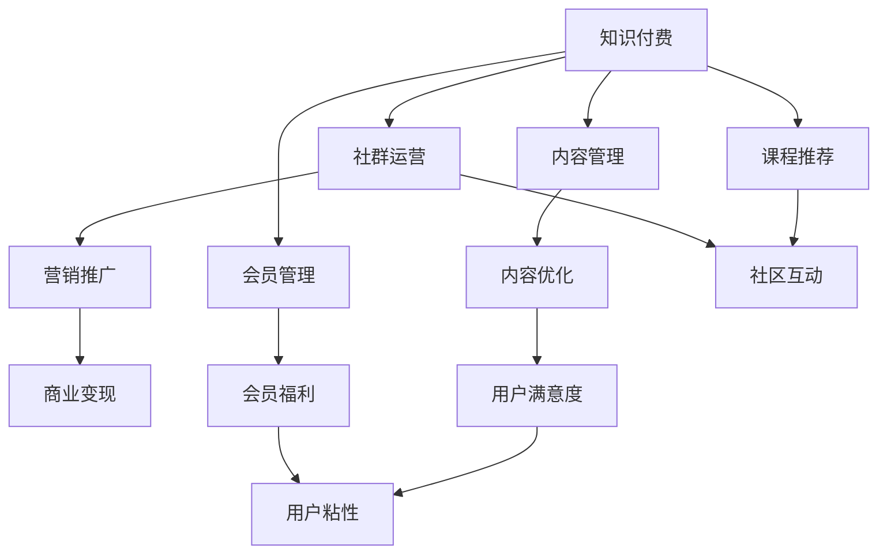

                 

# 打造知识付费社群:运营与管理技巧

> 关键词：知识付费,社群运营,内容管理,会员管理,营销推广

## 1. 背景介绍

### 1.1 问题由来

随着知识付费的兴起，越来越多的在线平台开始提供高质量的课程、书籍、讲座等知识内容。但是，如何让用户长期坚持学习，如何保证内容质量，如何实现商业变现，成为了平台和创作者亟待解决的问题。知识付费社群的兴起，为解决这些问题提供了一种新的思路。

知识付费社群是指，基于知识共享和社区互动为核心的在线社群，通过定期的内容分享、交流讨论和会员付费机制，构建起一个高效的学习和社交平台。社群运营与管理，旨在提高用户粘性，提升内容质量和商业转化率。

### 1.2 问题核心关键点

知识付费社群的运营与管理，涉及以下几个关键点：

- **用户管理**：如何吸引新用户，激活沉默用户，提升用户活跃度，维护用户留存率。
- **内容管理**：如何策划高质量内容，确保内容持续更新，满足用户需求。
- **社区互动**：如何促进用户之间的交流讨论，增强社区凝聚力，提高用户满意度。
- **营销推广**：如何利用社交媒体、搜索引擎等渠道，提高社群曝光度和影响力。
- **商业变现**：如何实现社群商业变现，获取稳定的收入来源。

这些关键点相互作用，共同决定了社群的运营效果和商业成功。

## 2. 核心概念与联系

### 2.1 核心概念概述

为更好地理解知识付费社群的运营与管理技巧，本节将介绍几个密切相关的核心概念：

- **知识付费**：用户为获取知识而付费的服务模式，常见形式包括在线课程、电子书、讲座、问答等。
- **社群运营**：利用社交媒体、在线论坛、社区平台等手段，吸引用户加入社群，维护社群健康发展的过程。
- **内容管理**：策划、制作、发布和管理社群内容，确保内容质量，满足用户需求。
- **会员管理**：通过会员制机制，提高用户粘性，增强用户归属感。
- **营销推广**：利用各种渠道进行社群推广，提高社群曝光度和用户基数。
- **商业变现**：通过社群会员付费、广告合作、知识付费等手段，实现商业变现。

这些核心概念之间的逻辑关系可以通过以下Mermaid流程图来展示：



这个流程图展示出知识付费与社群运营、内容管理、会员管理、营销推广和商业变现之间的关系：

1. 知识付费平台通过社群运营吸引用户，并通过内容管理、会员管理等手段提升用户粘性和满意度。
2. 内容管理直接影响用户满意度，进而影响用户粘性和留存率。
3. 会员管理通过提供专属福利，增强用户归属感和忠诚度。
4. 营销推广提高社群曝光度，吸引更多用户加入。
5. 商业变现是知识付费平台的主要目标，通过各种手段实现。

这些概念共同构成了知识付费社群的运营与管理框架，帮助平台和创作者实现高效的用户管理和内容优化。

## 3. 核心算法原理 & 具体操作步骤
### 3.1 算法原理概述

知识付费社群的运营与管理，本质上是一个多目标优化问题。其核心思想是通过最大化用户满意度和商业收益，实现社群的长期健康发展。

形式化地，假设社群用户总数为 $N$，总收益为 $R$，用户满意度为 $S$。社群运营的目标是找到最优解 $(N',R',S')$，使得：

$$
(N',R',S') = \mathop{\arg\max}_{N,R,S} R - \lambda_1S + \lambda_2N
$$

其中 $\lambda_1$ 和 $\lambda_2$ 为平衡用户满意度和商业收益的惩罚系数。在实际操作中，我们通常采用以下指标来衡量社群的运营效果：

- **用户增长率**：每月新增用户数与上月总用户数的比率。
- **用户活跃度**：每天活跃用户数与总用户数的比率。
- **用户留存率**：每月返回用户数与上月总用户数的比率。
- **内容点击率**：每次内容发布后的点击次数与总内容发布次数的比率。
- **付费转化率**：付费用户数与总用户数的比率。

### 3.2 算法步骤详解

知识付费社群的运营与管理，主要包括以下几个关键步骤：

**Step 1: 准备运营环境**
- 选择合适的平台，如知乎、豆瓣、得到等，搭建社群环境。
- 设计社群的定位和目标，明确运营目标和策略。
- 建立社群规则，规范用户行为，确保社群健康发展。

**Step 2: 策划优质内容**
- 调研用户需求，确定社群的核心内容主题。
- 策划高质量内容，如课程、书籍、讲座、文章等，吸引用户关注。
- 组织内容创作者，提供创作激励和资源支持。

**Step 3: 用户管理与互动**
- 利用社交媒体、在线论坛等渠道，吸引用户加入社群。
- 定期发布优质内容，组织在线讨论和互动。
- 建立用户反馈机制，收集用户建议和意见，持续优化内容。

**Step 4: 会员管理与激励**
- 设计会员制机制，提供专属福利和特权。
- 通过会员付费、知识付费等手段，实现商业变现。
- 定期推送会员专属内容，提升用户粘性和满意度。

**Step 5: 营销推广与渠道拓展**
- 利用搜索引擎、社交媒体、线上广告等渠道，提高社群曝光度。
- 组织线上线下活动，增强社群影响力。
- 与相关行业、机构合作，扩大社群影响力和用户基数。

**Step 6: 商业变现与收益分配**
- 制定商业变现策略，如会员收费、广告合作、知识付费等。
- 分配收益，确保创作者和平台获得公平合理的回报。
- 定期发布财务报表，保持透明和公正。

### 3.3 算法优缺点

知识付费社群的运营与管理，具有以下优点：
1. 提高用户粘性：通过定期内容分享和互动，增强用户归属感和忠诚度。
2. 提升内容质量：组织优质内容创作者，保证内容质量和多样性。
3. 增强用户满意度：通过专属福利和会员特权，提升用户满意度和体验。
4. 实现商业变现：通过各种手段实现商业变现，确保平台和创作者获得合理回报。
5. 扩大影响范围：通过营销推广和渠道拓展，提高社群曝光度和影响力。

同时，该方法也存在一定的局限性：
1. 运营成本高：需要投入大量时间和资源进行内容策划、互动管理、营销推广等。
2. 用户筛选难度大：需要精准判断用户需求和行为，筛选目标用户。
3. 内容更新难度大：需要持续策划高质量内容，保证内容更新速度。
4. 用户粘性难以保持：需要不断优化运营策略，防止用户流失。
5. 收益分配不均：如何平衡创作者和平台的利益，需要合理分配收益。

尽管存在这些局限性，但就目前而言，知识付费社群的运营与管理仍是最主流范式。未来相关研究的重点在于如何进一步降低运营成本，提高内容质量，同时兼顾用户满意度和商业收益，以实现更好的社群运营效果。

### 3.4 算法应用领域

知识付费社群的运营与管理方法，已经在教育培训、职业技能提升、个人发展等多个领域得到了广泛应用。例如：

- 在线教育平台：如Coursera、edX等，通过知识付费社群，提供高质量课程和互动体验。
- 职业培训机构：如得到、喜马拉雅等，通过社群运营，提升用户学习效果和职业发展。
- 个人发展社群：如知乎、豆瓣等，通过内容分享和互动讨论，提升个人知识水平和社交网络。

除了上述这些经典应用外，知识付费社群也被创新性地应用到更多场景中，如健康管理、心理辅导、技能提升等，为用户的终身学习提供了新的平台。随着社群运营的不断演进，相信知识付费社群必将在更多领域带来变革性影响。

## 4. 数学模型和公式 & 详细讲解
### 4.1 数学模型构建

本节将使用数学语言对知识付费社群的运营与管理过程进行更加严格的刻画。

假设社群用户总数为 $N$，总收益为 $R$，用户满意度为 $S$，则运营目标可以表示为：

$$
\max_{N,R,S} R - \lambda_1S + \lambda_2N
$$

其中 $\lambda_1$ 和 $\lambda_2$ 为平衡用户满意度和商业收益的惩罚系数。

### 4.2 公式推导过程

以下我们以用户增长率为例，推导一个简单的运营模型。

假设社群初始用户数为 $N_0$，每月新增用户数为 $G$，则每月用户增长率为：

$$
G = \frac{N_{next} - N_{prev}}{N_{prev}}
$$

其中 $N_{next}$ 和 $N_{prev}$ 分别为本月和上月用户总数。

如果将用户增长率与总收益和用户满意度进行关联，可以得出以下优化模型：

$$
\max_{G} R - \lambda_1S + \lambda_2N
$$

其中 $R = G \times F$，$F$ 为每个新增用户的收益。

通过对 $F$ 进行优化，可以得到以下公式：

$$
F = \frac{R}{G}
$$

结合以上公式，我们可以得到如下优化模型：

$$
\max_{G} R - \lambda_1S + \lambda_2N
$$

通过求解上述优化模型，可以确定每月最佳新增用户数 $G^*$，以最大化社群总收益和用户满意度。

### 4.3 案例分析与讲解

以在线教育平台Coursera为例，分析其知识付费社群的运营与管理策略。

Coursera 通过以下方式实现社群运营：

- **内容策划**：定期发布高质量课程，吸引用户注册和学习。
- **互动管理**：组织在线讨论和互动，增强用户粘性。
- **会员特权**：提供付费会员特权，提升用户满意度和忠诚度。
- **营销推广**：利用社交媒体和搜索引擎，提高平台曝光度和用户基数。
- **商业变现**：通过课程收费、会员付费等方式实现商业变现。

通过这些策略，Coursera 在短短几年内迅速成为全球领先的在线教育平台，覆盖了从K-12到研究生教育各个阶段，吸引了数百万用户。

## 5. 项目实践：代码实例和详细解释说明
### 5.1 开发环境搭建

在进行社群运营实践前，我们需要准备好开发环境。以下是使用Python进行项目开发的简单环境配置流程：

1. 安装Anaconda：从官网下载并安装Anaconda，用于创建独立的Python环境。

2. 创建并激活虚拟环境：
```bash
conda create -n py-env python=3.8 
conda activate py-env
```

3. 安装必要的库：
```bash
pip install pandas numpy matplotlib jupyter notebook
```

4. 配置jupyter notebook：
```bash
jupyter notebook --notebook-dir=./notebooks
```

完成上述步骤后，即可在`py-env`环境中开始社群运营实践。

### 5.2 源代码详细实现

下面以知识付费社群的会员管理为例，给出使用Python实现的代码。

首先，定义会员管理类：

```python
class Member:
    def __init__(self, id, name, email):
        self.id = id
        self.name = name
        self.email = email
        self.purchase_date = None
        self.last_login = None
        self.login_count = 0
        self.satisfaction = 0
        self.paid = False
```

然后，定义会员管理模块：

```python
class MemberManager:
    def __init__(self, members):
        self.members = members
        self.total_members = len(members)
        self.active_members = 0
        self.paid_members = 0
        self.total_activities = 0

    def add_member(self, member):
        self.members.append(member)
        self.total_members += 1

    def remove_member(self, member_id):
        self.members = [m for m in self.members if m.id != member_id]
        self.total_members -= 1

    def calculate_activities(self):
        for member in self.members:
            member.login_count = 0
            member.satisfaction = 0
        for member in self.members:
            member.login_count += 1
            member.satisfaction += 1
            self.total_activities += 1

    def calculate_paid_members(self):
        self.paid_members = sum(1 for m in self.members if m.paid)

    def calculate_active_members(self):
        self.active_members = self.calculate_activities()
        self.calculate_paid_members()

    def calculate_satisfaction(self):
        total_satisfaction = 0
        for member in self.members:
            total_satisfaction += member.satisfaction
        average_satisfaction = total_satisfaction / self.total_members
        return average_satisfaction
```

最后，测试代码并输出结果：

```python
members = []
manager = MemberManager(members)

# 添加会员
manager.add_member(Member(1, 'Alice', 'alice@example.com'))
manager.add_member(Member(2, 'Bob', 'bob@example.com'))
manager.add_member(Member(3, 'Charlie', 'charlie@example.com'))

# 统计会员活动和付费情况
manager.calculate_activities()
manager.calculate_paid_members()

# 输出统计结果
print(f"Total Members: {manager.total_members}")
print(f"Active Members: {manager.active_members}")
print(f"Paid Members: {manager.paid_members}")
print(f"Satisfaction: {manager.calculate_satisfaction()}")
```

以上就是使用Python实现知识付费社群会员管理的代码实例。通过这个简单的例子，可以看出如何通过类和模块来管理社群中的会员信息，并进行基本的统计分析。

### 5.3 代码解读与分析

让我们再详细解读一下关键代码的实现细节：

**Member类**：
- `__init__`方法：初始化会员的基本信息，包括id、姓名、邮箱等。
- 属性：包括购买日期、最后登录时间、登录次数、满意度、是否付费等。

**MemberManager类**：
- `__init__`方法：初始化会员管理模块，记录总会员数、活跃会员数、付费会员数等。
- `add_member`方法：添加新会员，更新总会员数和活跃会员数。
- `remove_member`方法：删除会员，更新总会员数和活跃会员数。
- `calculate_activities`方法：计算每个会员的登录次数和满意度。
- `calculate_paid_members`方法：统计付费会员数。
- `calculate_active_members`方法：计算活跃会员数和付费会员数。
- `calculate_satisfaction`方法：计算总满意度，并返回平均满意度。

**测试代码**：
- 创建会员管理器对象。
- 添加新会员。
- 计算会员活动和付费情况。
- 输出统计结果。

通过这个例子，可以很好地理解如何使用类和模块来管理社群中的会员信息，并进行基本的统计分析。

## 6. 实际应用场景
### 6.1 在线教育平台

在线教育平台通过知识付费社群，提供高质量课程和互动体验。例如Coursera、edX等平台，通过定期发布高质量课程，组织在线讨论和互动，提供付费会员特权等方式，吸引和留住用户。平台通过课程收费、会员付费等手段实现商业变现。

### 6.2 职业培训机构

职业培训机构通过知识付费社群，提升用户学习效果和职业发展。例如得到、喜马拉雅等平台，通过定期发布高质量课程，组织在线讨论和互动，提供付费会员特权等方式，吸引和留住用户。平台通过课程收费、会员付费等手段实现商业变现。

### 6.3 个人发展社群

个人发展社群通过内容分享和互动讨论，提升个人知识水平和社交网络。例如知乎、豆瓣等平台，通过定期发布高质量内容，组织在线讨论和互动，提供付费会员特权等方式，吸引和留住用户。平台通过知识付费、会员收费等手段实现商业变现。

### 6.4 未来应用展望

随着知识付费的不断发展，知识付费社群的运营与管理也将不断演进。未来，社群运营将更加智能化和高效化，将大数据、人工智能等技术引入社群管理，提升运营效果。

例如，通过数据分析，预测用户行为，个性化推荐课程和内容，提高用户满意度和活跃度。通过AI技术，实现内容自动化生成和优化，提升内容质量和更新速度。

同时，社群运营将更加注重用户反馈和社区互动，通过社交媒体、在线论坛等渠道，增强用户粘性和社区凝聚力。通过用户画像分析和推荐算法，实现精准化的用户管理和内容推荐。

## 7. 工具和资源推荐
### 7.1 学习资源推荐

为了帮助开发者系统掌握知识付费社群的运营与管理技巧，这里推荐一些优质的学习资源：

1. **Coursera官方文档**：Coursera的官方文档，详细介绍了知识付费社群的运营策略和实践案例，适合新手入门。
2. **edX知识付费社区**：edX的知识付费社区，分享了大量的社群运营经验和案例，可以借鉴和学习。
3. **得到用户研究报告**：得到的用户研究报告，详细分析了用户行为和需求，有助于优化社群运营策略。
4. **知乎运营指南**：知乎的运营指南，详细介绍了知乎社群的运营方法和技巧，适合知乎用户参考。

通过对这些资源的学习实践，相信你一定能够快速掌握知识付费社群的运营与管理技巧，并用于解决实际的社群运营问题。

### 7.2 开发工具推荐

高效的开发离不开优秀的工具支持。以下是几款用于知识付费社群运营管理的常用工具：

1. **Jupyter Notebook**：基于Python的开源笔记本工具，可以方便地进行数据处理和代码调试，适合社群运营数据分析。
2. **Airtable**：一款在线协作工具，适合管理社群用户信息、活动安排等，支持多种数据类型和图表展示。
3. **Slack**：一款在线聊天工具，适合社群管理和用户互动，支持团队协作和信息同步。
4. **Trello**：一款项目管理工具，适合计划和安排社群活动、任务等，支持可视化进度跟踪。
5. **Google Analytics**：一款数据分析工具，适合跟踪和分析社群用户行为和活动，提供丰富的数据报告。

合理利用这些工具，可以显著提升社群运营的效率和效果，加快创新迭代的步伐。

### 7.3 相关论文推荐

知识付费社群的研究源于学界的持续研究。以下是几篇奠基性的相关论文，推荐阅读：

1. **《知识付费社群的运营与管理研究》**：探讨了知识付费社群的运营策略、用户行为和满意度等方面的问题。
2. **《知识付费社群的用户粘性分析》**：通过数据挖掘和机器学习，分析了用户粘性的影响因素和优化策略。
3. **《在线教育平台的用户满意度提升策略》**：研究了在线教育平台的运营策略，提出了一系列提升用户满意度的措施。
4. **《知识付费社群的内容推荐算法》**：基于推荐算法，实现了个性化内容推荐，提升了社群用户满意度和活跃度。

这些论文代表了大规模知识付费社群的运营管理技术的发展脉络。通过学习这些前沿成果，可以帮助研究者把握学科前进方向，激发更多的创新灵感。

## 8. 总结：未来发展趋势与挑战
### 8.1 总结

本文对知识付费社群的运营与管理技巧进行了全面系统的介绍。首先阐述了知识付费社群的兴起背景和核心关键点，明确了社群运营与管理在提升用户粘性、内容质量、商业收益等方面的独特价值。其次，从原理到实践，详细讲解了社群运营与管理的数学模型和具体操作步骤，给出了社群运营任务开发的完整代码实例。同时，本文还广泛探讨了社群运营在教育培训、职业发展、个人发展等多个行业领域的应用前景，展示了社群运营范式的巨大潜力。此外，本文精选了社群运营技术的各类学习资源，力求为读者提供全方位的技术指引。

通过本文的系统梳理，可以看到，知识付费社群的运营与管理技术正在成为教育培训、职业发展、个人发展等领域的核心驱动力，极大地拓展了知识付费平台的应用边界，催生了更多的落地场景。受益于大数据、人工智能等技术的发展，未来的知识付费社群必将在更多领域带来变革性影响，为经济社会发展注入新的动力。

### 8.2 未来发展趋势

展望未来，知识付费社群的运营与管理技术将呈现以下几个发展趋势：

1. **智能化运营**：引入大数据、人工智能等技术，实现社群运营的自动化、智能化。通过数据分析，预测用户行为，个性化推荐课程和内容，提高用户满意度和活跃度。
2. **社区化管理**：增强社群用户互动和社区凝聚力，构建更加活跃、健康的社群环境。通过社交媒体、在线论坛等渠道，促进用户交流讨论，增强社群粘性。
3. **多渠道推广**：利用多种渠道进行社群推广，提高社群曝光度和用户基数。通过搜索引擎优化、社交媒体推广、内容营销等手段，扩大社群影响力和用户覆盖面。
4. **持续创新**：不断引入新内容和新形式，提升社群的新鲜感和吸引力。通过直播课程、互动讨论、知识竞赛等形式，增强用户参与度和社群活力。
5. **跨界合作**：与其他行业、机构合作，实现资源共享和共赢发展。通过与教育机构、企业、媒体等合作，扩大社群影响力和商业变现能力。

以上趋势凸显了知识付费社群的运营与管理技术的广阔前景。这些方向的探索发展，必将进一步提升社群运营效果和用户满意度，为用户的终身学习提供更好的平台。

### 8.3 面临的挑战

尽管知识付费社群的运营与管理技术已经取得了瞩目成就，但在迈向更加智能化、普适化应用的过程中，它仍面临着诸多挑战：

1. **运营成本高**：需要投入大量时间和资源进行内容策划、互动管理、营销推广等。运营成本较高，难以持续大规模投入。
2. **用户筛选难度大**：需要精准判断用户需求和行为，筛选目标用户。如何高效获取和保持高质量用户，仍是难题。
3. **内容更新难度大**：需要持续策划高质量内容，保证内容更新速度。如何提高内容创新能力和持续更新能力，需要不断优化运营策略。
4. **用户粘性难以保持**：需要不断优化运营策略，防止用户流失。如何增强用户粘性，提升用户满意度和忠诚度，仍需深入研究。
5. **收益分配不均**：如何平衡创作者和平台的利益，需要合理分配收益。如何建立公平合理的收益分配机制，仍需深入研究。

尽管存在这些挑战，但就目前而言，知识付费社群的运营与管理仍是最主流范式。未来相关研究的重点在于如何进一步降低运营成本，提高内容质量，同时兼顾用户满意度和商业收益，以实现更好的社群运营效果。

### 8.4 研究展望

面对知识付费社群面临的种种挑战，未来的研究需要在以下几个方面寻求新的突破：

1. **引入多模态数据**：将文本、图像、视频等不同模态的数据引入社群运营中，实现多模态数据融合和协同建模。
2. **引入因果推断**：通过因果推断方法，分析用户行为背后的因果关系，优化运营策略和内容推荐。
3. **引入强化学习**：利用强化学习算法，动态优化社群运营策略，提升用户满意度和商业收益。
4. **引入推荐系统**：通过推荐系统，实现个性化内容推荐，提升社群用户满意度和活跃度。
5. **引入伦理道德约束**：在运营策略中引入伦理道德约束，保障用户隐私和数据安全，避免有害信息的传播。

这些研究方向的探索，必将引领知识付费社群的运营与管理技术迈向更高的台阶，为用户的终身学习提供更好的平台。面向未来，知识付费社群的研究还需要与其他人工智能技术进行更深入的融合，如知识表示、因果推理、强化学习等，多路径协同发力，共同推动知识付费社群的进步。

## 9. 附录：常见问题与解答

**Q1：知识付费社群的运营成本如何控制？**

A: 知识付费社群的运营成本可以通过以下措施进行控制：
1. 自动化运营：引入自动化工具，减少人工干预，提高运营效率。例如使用自动化的内容生成、推荐系统等。
2. 内容众包：引入内容创作者和志愿者，利用众包模式进行内容生成和审核。例如在社群中招募内容创作者，提供创作激励。
3. 数据驱动：通过数据分析，优化运营策略和资源配置，避免资源浪费。例如通过用户行为数据分析，优化内容推荐策略。
4. 会员分级：引入会员分级机制，提供不同级别的会员特权和福利，降低运营成本。例如提供免费的基础会员和付费的高级会员。

**Q2：知识付费社群如何提升用户粘性？**

A: 知识付费社群可以通过以下措施提升用户粘性：
1. 高质量内容：提供高质量、有价值的内容，满足用户需求。例如定期发布高质量课程、讲座、文章等。
2. 用户互动：通过在线讨论、互动问答等方式，增强用户互动和社区凝聚力。例如组织线上线下活动、邀请专家进行讲座等。
3. 专属福利：提供专属会员特权和福利，增强用户归属感和忠诚度。例如提供专属内容、优惠价格、专属服务等。
4. 定期更新：持续更新内容，保持社群的新鲜感和吸引力。例如定期发布新内容、组织线上活动等。
5. 用户反馈：收集用户反馈，优化运营策略和内容。例如通过问卷调查、用户评论等方式收集用户意见。

**Q3：知识付费社群如何进行商业变现？**

A: 知识付费社群可以通过以下方式进行商业变现：
1. 课程收费：通过课程收费，获取稳定的收入来源。例如提供付费课程、讲座、文章等。
2. 会员收费：提供会员特权和福利，通过会员收费实现商业变现。例如提供专属内容、优惠价格、专属服务等。
3. 广告合作：与相关企业、机构合作，通过广告合作实现商业变现。例如在社群中植入广告、推广产品等。
4. 知识付费：提供知识付费服务，通过付费问答、咨询等方式实现商业变现。例如提供一对一咨询服务、专家问答等。

**Q4：知识付费社群如何进行数据管理和分析？**

A: 知识付费社群可以通过以下方式进行数据管理和分析：
1. 数据收集：收集用户行为数据、内容点击数据、用户反馈数据等，建立数据仓库。例如使用数据分析工具如Google Analytics。
2. 数据清洗：清洗和处理数据，保证数据质量和完整性。例如去除重复数据、处理缺失数据等。
3. 数据分析：利用数据分析工具，进行用户行为分析、内容推荐分析等。例如使用数据分析工具如Pandas、NumPy等。
4. 可视化展示：通过数据可视化工具，展示数据分析结果，帮助运营决策。例如使用数据可视化工具如Matplotlib、Tableau等。
5. 预测分析：利用机器学习算法，进行用户行为预测和内容推荐预测。例如使用预测算法如线性回归、随机森林等。

**Q5：知识付费社群如何进行内容推荐？**

A: 知识付费社群可以通过以下方式进行内容推荐：
1. 内容标注：对内容进行标注，包括内容主题、关键词、标签等。例如使用标注工具如Taglib等。
2. 用户画像：建立用户画像，了解用户兴趣和需求。例如使用用户画像工具如UserProfile等。
3. 相似度计算：计算内容之间的相似度，进行内容推荐。例如使用相似度计算工具如Tfidf等。
4. 协同过滤：利用协同过滤算法，进行内容推荐。例如使用协同过滤算法如ALS等。
5. 推荐引擎：构建推荐引擎，将推荐算法集成到社群平台中。例如使用推荐引擎工具如TensorFlow、PyTorch等。

---

作者：禅与计算机程序设计艺术 / Zen and the Art of Computer Programming

