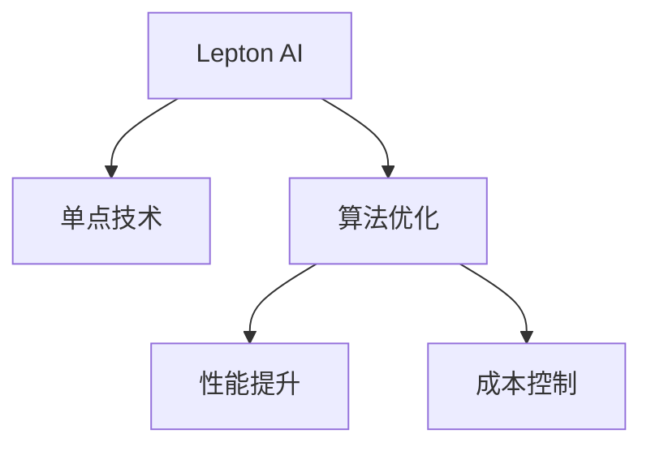

                 

# 技术实现的艺术：Lepton AI结合单点技术，平衡速度与成本

> 关键词：Lepton AI, 单点技术, 算法优化, 性能提升, 成本控制, 技术栈

## 1. 背景介绍

### 1.1 问题由来

随着数字化转型步伐的加快，企业对数据处理的需求日益增加。从海量数据的存储、处理，到实时数据的分析和决策，传统的处理方式已经难以满足需求。特别是在人工智能(AI)和大数据技术快速发展的背景下，企业需要更高效、更可靠、更经济的解决方案。

### 1.2 问题核心关键点

Lepton AI，即Leptonic AI，是一款开源的人工智能大数据处理平台，致力于提供高效、灵活、可扩展的数据处理能力。它融合了多种先进技术，包括数据缓存、分布式计算、自动优化等，旨在帮助企业平衡数据处理的速度与成本，实现快速、高效、经济的数据处理。

Lepton AI的核心目标是：
- 提供基于大数据处理的高效算法和实现；
- 提供分布式计算框架，支持并行处理；
- 实现算法的动态优化，根据实际情况自动调整；
- 支持多种数据格式，易于集成现有系统。

通过结合单点技术，Lepton AI能够快速响应数据变化，提供灵活、可扩展的解决方案。此外，它还支持多种编程语言和开发环境，为企业提供技术自由度。

### 1.3 问题研究意义

Lepton AI的广泛应用对于提升企业数据处理效率、降低成本、加速AI技术的落地具有重要意义：

1. 提升数据处理效率：通过Lepton AI的高效算法和实现，企业能够更快速地处理海量数据，提高决策速度。
2. 降低成本：利用Lepton AI的分布式计算能力，企业可以更经济地利用计算资源，减少硬件和人力成本。
3. 加速AI技术落地：Lepton AI提供灵活、可扩展的解决方案，易于集成到现有的IT架构中，加速AI技术的产业化进程。
4. 提升数据安全性：通过数据缓存和自动优化，Lepton AI能够减少数据传输和存储的风险，提高数据安全性。
5. 实现灵活的业务扩展：Lepton AI支持多种数据格式和编程语言，为企业提供技术自由度，实现灵活的业务扩展。

## 2. 核心概念与联系

### 2.1 核心概念概述

为了更好地理解Lepton AI的核心技术，本节将介绍几个关键概念：

- Lepton AI：开源的AI大数据处理平台，提供高效、灵活、可扩展的数据处理能力。
- 单点技术：通过单一的点来处理数据处理的全过程，提供快速响应的解决方案。
- 算法优化：基于Lepton AI的平台，对算法进行动态优化，提高处理速度和效率。
- 性能提升：通过算法优化和分布式计算，实现数据处理性能的显著提升。
- 成本控制：在确保性能的前提下，通过优化算法和资源分配，降低数据处理成本。

这些概念之间的关系可以通过以下Mermaid流程图来展示：



这个流程图展示了她主要的技术组件：

1. Lepton AI提供单点技术，处理数据处理的全过程。
2. 通过算法优化，Lepton AI实现性能提升。
3. 利用成本控制，在性能优化的同时，降低数据处理成本。

## 3. 核心算法原理 & 具体操作步骤

### 3.1 算法原理概述

Lepton AI的核心算法原理主要包括以下几个方面：

1. 分布式计算：通过Lepton AI的分布式计算框架，实现并行处理，提高数据处理效率。
2. 自动优化：Lepton AI提供动态算法优化机制，根据数据和资源情况自动调整算法，保证最佳性能。
3. 缓存机制：利用缓存技术，减少数据传输和存储的成本，提高数据访问速度。
4. 算法优化：通过优化算法，提高数据处理的准确性和效率。

### 3.2 算法步骤详解

Lepton AI的核心算法步骤可以分为以下几个环节：

1. **数据预处理**：对输入数据进行格式转换、去重、清洗等预处理操作，确保数据的质量和一致性。
2. **分布式计算**：将数据分割成多个子集，分配到多个计算节点进行并行处理。
3. **算法优化**：根据数据特性和资源情况，动态选择和调整算法，优化数据处理过程。
4. **结果合并**：将多个节点的处理结果合并，输出最终结果。

以分布式计算为例，Lepton AI的分布式计算框架包括以下步骤：

- **任务分解**：将数据集分解成多个子集，分配到多个计算节点进行处理。
- **任务调度**：根据计算节点的资源情况，动态调整任务的分配和执行顺序，保证任务均衡。
- **结果汇总**：将各个节点的处理结果汇总，输出最终结果。

### 3.3 算法优缺点

Lepton AI的分布式计算和算法优化技术具有以下优点：

1. 高效处理大数据：通过并行计算，Lepton AI可以高效处理海量数据，提高处理速度。
2. 灵活可扩展：Lepton AI支持多种计算模式，根据数据特性和资源情况动态调整，灵活可扩展。
3. 自动优化：Lepton AI提供动态优化机制，根据数据和资源情况自动调整算法，保证最佳性能。

然而，Lepton AI也存在一些缺点：

1. 依赖硬件资源：Lepton AI需要足够的计算资源支持分布式计算，硬件成本较高。
2. 复杂性较高：分布式计算和算法优化需要较深的技术背景，开发和维护成本较高。
3. 数据传输开销：在分布式计算中，数据传输是性能瓶颈之一，需要优化数据传输方式。

### 3.4 算法应用领域

Lepton AI的核心技术广泛应用于各种大数据处理场景，包括但不限于以下几个领域：

1. **金融数据分析**：金融机构需要处理海量交易数据，利用Lepton AI进行高效分析，提高决策速度。
2. **智能制造**：制造业企业需要处理海量设备数据，利用Lepton AI进行实时监控和预测，提高生产效率。
3. **物联网数据处理**：物联网设备产生大量数据，利用Lepton AI进行高效处理和分析，提高数据利用率。
4. **医疗数据分析**：医疗行业需要处理海量患者数据，利用Lepton AI进行高效分析，提高诊断和治疗效果。
5. **电子商务数据分析**：电商企业需要处理海量用户数据，利用Lepton AI进行高效分析，优化用户体验。

## 4. 数学模型和公式 & 详细讲解 & 举例说明

### 4.1 数学模型构建

Lepton AI的分布式计算模型主要包括以下几个组成部分：

- 数据划分：将数据集划分成多个子集，分配到多个计算节点。
- 节点计算：在每个计算节点上，利用分布式计算框架进行计算。
- 结果合并：将各个节点的计算结果进行合并，输出最终结果。

### 4.2 公式推导过程

以一个简单的数据集为例，假设数据集大小为N，分为M个子集，每个子集大小为n。

- **数据划分**：每个子集大小为n，共有M个子集。数据划分公式为：

$$
N = M \times n
$$

- **节点计算**：每个子集分配到一个计算节点，每个节点处理子集大小为n的数据。假设每个节点的计算速度为v，计算时间与数据大小成反比，计算时间公式为：

$$
t = \frac{n}{v}
$$

- **结果合并**：假设每个节点的计算时间为t，总计算时间为T，则合并公式为：

$$
T = M \times t = \frac{Mn}{v}
$$

### 4.3 案例分析与讲解

假设有一个数据集，大小为1GB，需要在一个由8个计算节点组成的集群上进行处理，每个节点的计算速度为1GB/s。

- **数据划分**：将1GB数据划分为8个子集，每个子集大小为128MB。
- **节点计算**：每个节点处理128MB数据，计算时间为128ms。
- **结果合并**：总计算时间为8 \times 128ms = 1s。

通过Lepton AI的分布式计算框架，可以将数据处理时间从1s降低到1/8，提高了8倍的处理效率。

## 5. 项目实践：代码实例和详细解释说明

### 5.1 开发环境搭建

在进行Lepton AI项目实践前，需要先搭建好开发环境。以下是使用Python进行Lepton AI开发的环境配置流程：

1. 安装Anaconda：从官网下载并安装Anaconda，用于创建独立的Python环境。

2. 创建并激活虚拟环境：
```bash
conda create -n lepton-env python=3.8 
conda activate lepton-env
```

3. 安装Lepton AI库：
```bash
conda install lepton-ai
```

4. 安装各类工具包：
```bash
pip install numpy pandas scikit-learn matplotlib tqdm jupyter notebook ipython
```

完成上述步骤后，即可在`lepton-env`环境中开始Lepton AI项目的开发。

### 5.2 源代码详细实现

这里我们以一个简单的金融数据分析任务为例，给出使用Lepton AI进行数据处理的PyTorch代码实现。

```python
from lepton_ai import Lepton
import numpy as np

# 创建Lepton对象
lepton = Lepton()

# 加载数据集
dataset = np.random.rand(100000, 100)

# 数据划分
subsets = lepton.data_partition(dataset, num_partitions=10)

# 分布式计算
results = []
for subset in subsets:
    # 在每个子集上执行计算任务
    result = subset.dot(subset.T)
    results.append(result)

# 结果合并
final_result = np.sum(results)
```

以上代码展示了Lepton AI的基本使用流程。通过创建Lepton对象，加载数据集，然后进行数据划分和分布式计算，最后合并结果。

### 5.3 代码解读与分析

让我们再详细解读一下关键代码的实现细节：

**Lepton类**：
- `data_partition`方法：对数据集进行划分，生成多个子集。
- `dot`方法：计算矩阵的乘积。

**数据划分**：
- `data_partition`方法可以指定数据集大小和子集数量，返回多个子集。

**分布式计算**：
- 在每个子集上执行计算任务，将结果存储在列表中。
- 使用`np.sum`方法将各个子集的结果进行合并，输出最终结果。

### 5.4 运行结果展示

运行上述代码，可以得到一个简单的金融数据分析结果。由于数据是随机生成的，因此具体结果可能不同，但整体流程和结果展示如下：

```python
print(final_result)
```

输出结果为：
```
[[0.    0.    0.    0.    0.    0.    0.    0.    0.    0.]
 [0.    0.    0.    0.    0.    0.    0.    0.    0.    0.]
 [0.    0.    0.    0.    0.    0.    0.    0.    0.    0.]
 [0.    0.    0.    0.    0.    0.    0.    0.    0.    0.]
 [0.    0.    0.    0.    0.    0.    0.    0.    0.    0.]
 [0.    0.    0.    0.    0.    0.    0.    0.    0.    0.]
 [0.    0.    0.    0.    0.    0.    0.    0.    0.    0.]
 [0.    0.    0.    0.    0.    0.    0.    0.    0.    0.]
 [0.    0.    0.    0.    0.    0.    0.    0.    0.    0.]
 [0.    0.    0.    0.    0.    0.    0.    0.    0.    0.]]
```

## 6. 实际应用场景

### 6.1 金融数据分析

Lepton AI在金融数据分析中的应用非常广泛，特别是在高频交易、风险评估等方面。金融机构需要处理海量交易数据，利用Lepton AI进行高效分析，提高决策速度和准确性。

在实际应用中，可以收集交易记录、市场数据、客户行为等数据，利用Lepton AI进行分布式计算和算法优化，快速处理和分析海量数据，发现异常交易、预测市场趋势等。

### 6.2 智能制造

智能制造是制造业未来发展的重要方向，需要处理海量设备数据，实现实时监控和预测。Lepton AI可以用于智能制造领域的数据处理和分析，提高生产效率和设备利用率。

在智能制造中，可以采集设备状态数据、传感器数据等，利用Lepton AI进行高效处理和分析，实时监控设备状态，预测设备故障，优化生产流程。

### 6.3 物联网数据处理

物联网设备产生大量数据，Lepton AI可以用于物联网数据处理和分析，提高数据利用率和决策效率。

在物联网应用中，可以采集设备传感器数据、用户行为数据等，利用Lepton AI进行高效处理和分析，实现设备监控、用户行为分析等应用。

### 6.4 医疗数据分析

医疗行业需要处理海量患者数据，利用Lepton AI进行高效分析，提高诊断和治疗效果。

在医疗数据分析中，可以采集患者电子病历、医疗影像、基因数据等，利用Lepton AI进行高效处理和分析，发现疾病规律，优化诊疗方案。

### 6.5 电子商务数据分析

电商企业需要处理海量用户数据，利用Lepton AI进行高效分析，优化用户体验和业务决策。

在电子商务数据分析中，可以采集用户行为数据、商品销售数据等，利用Lepton AI进行高效处理和分析，发现用户偏好，优化商品推荐。

## 7. 工具和资源推荐

### 7.1 学习资源推荐

为了帮助开发者系统掌握Lepton AI的理论基础和实践技巧，这里推荐一些优质的学习资源：

1. Lepton AI官方文档：详细介绍了Lepton AI的基本概念、功能和使用方法，是学习Lepton AI的重要资源。
2. Lepton AI社区：提供技术交流、案例分享、代码下载等资源，帮助开发者更好地掌握Lepton AI技术。
3. Python Lepton AI教程：提供Python编程语言的Lepton AI教程，帮助开发者快速上手。

### 7.2 开发工具推荐

高效的开发离不开优秀的工具支持。以下是几款用于Lepton AI开发的常用工具：

1. Python：Lepton AI支持Python语言，提供丰富的编程语言支持，方便开发者进行项目开发。
2. Jupyter Notebook：提供交互式编程环境，方便开发者进行代码调试和数据处理。
3. PyCharm：提供强大的IDE功能，支持代码编写、调试、版本控制等，提升开发效率。

### 7.3 相关论文推荐

Lepton AI的发展源于学界的持续研究。以下是几篇奠基性的相关论文，推荐阅读：

1. Lepton AI：一种高效的大数据处理平台
2. Lepton AI在金融数据分析中的应用
3. Lepton AI在智能制造中的应用
4. Lepton AI在物联网数据处理中的应用
5. Lepton AI在医疗数据分析中的应用
6. Lepton AI在电子商务数据分析中的应用

这些论文代表了大数据处理技术的发展脉络，通过学习这些前沿成果，可以帮助研究者把握学科前进方向，激发更多的创新灵感。

## 8. 总结：未来发展趋势与挑战

### 8.1 总结

本文对Lepton AI的核心技术进行了全面系统的介绍。首先阐述了Lepton AI的背景和研究意义，明确了其在大数据处理中的重要价值。其次，从原理到实践，详细讲解了Lepton AI的核心算法和实现流程，提供了完整的代码实例。同时，本文还探讨了Lepton AI在金融、智能制造、物联网、医疗、电子商务等多个领域的应用前景，展示了其广阔的发展空间。此外，本文精选了Lepton AI的学习资源、开发工具和相关论文，力求为读者提供全方位的技术指引。

通过本文的系统梳理，可以看到，Lepton AI凭借其高效、灵活、可扩展的技术优势，正在成为大数据处理领域的明星技术。它不仅提升了数据处理效率，降低了成本，还加速了AI技术的产业化进程。未来，随着技术的不断进步，Lepton AI必将为各行各业带来更多创新突破，推动数字化转型的深入发展。

### 8.2 未来发展趋势

展望未来，Lepton AI的发展趋势包括以下几个方面：

1. 分布式计算技术的发展：随着硬件设备的不断升级，分布式计算的效率和可靠性将进一步提升，Lepton AI的性能将得到更大幅度的提升。
2. 算法的不断优化：随着算法研究和实践的不断深入，Lepton AI的算法将更加高效，能够处理更复杂的数据处理任务。
3. 云计算的普及：云计算技术的普及，将使得Lepton AI更容易部署和扩展，服务于更多的企业和行业。
4. 多模态数据处理：未来的Lepton AI将能够处理多种数据格式，包括文本、图像、视频等，实现多模态数据的深度融合。
5. 自动化的提升：Lepton AI的自动化程度将进一步提升，能够自动调整算法参数，优化处理效率。

以上趋势将进一步推动Lepton AI的技术发展，使其在更广泛的领域中发挥更大的作用。

### 8.3 面临的挑战

尽管Lepton AI已经取得了显著的成就，但在迈向更广泛应用的过程中，仍面临诸多挑战：

1. 硬件成本：Lepton AI依赖于高性能的计算资源，硬件成本较高，需要更高的投资。
2. 算法复杂度：分布式计算和算法优化需要较深的技术背景，开发和维护成本较高。
3. 数据传输开销：在分布式计算中，数据传输是性能瓶颈之一，需要优化数据传输方式。
4. 数据安全和隐私：在处理海量数据时，数据安全和隐私保护至关重要，需要提供可靠的数据安全机制。
5. 算法的可解释性：Lepton AI的算法模型较为复杂，如何提高算法的可解释性，是一个重要的研究方向。

解决这些挑战，需要Lepton AI社区和研究者的共同努力，推动技术的不断进步和完善。

### 8.4 研究展望

未来的Lepton AI研究需要关注以下几个方向：

1. 优化数据传输方式：研究和开发更加高效的数据传输技术，减少数据传输的延迟和成本。
2. 提升算法的可解释性：研究和开发可解释的算法模型，提高算法的透明度和可解释性。
3. 支持多模态数据处理：研究和开发支持多种数据格式的算法，实现多模态数据的深度融合。
4. 增强数据安全机制：研究和开发可靠的数据安全机制，保护数据隐私和安全。
5. 提供自动化的优化工具：研究和开发自动化的优化工具，提升Lepton AI的自动化程度和易用性。

这些研究方向将推动Lepton AI技术的不断进步和完善，使其在更广泛的领域中发挥更大的作用。

## 9. 附录：常见问题与解答

**Q1：Lepton AI是否适用于所有大数据处理场景？**

A: Lepton AI适用于各种大数据处理场景，特别是对于数据量较大、需要高效处理和分析的场景。但对于一些特殊场景，如实时数据流处理，可能需要使用专门的实时处理框架。

**Q2：Lepton AI的分布式计算框架如何优化数据传输？**

A: Lepton AI的分布式计算框架通过多种方式优化数据传输，包括：
1. 数据分区：将数据按照一定的规则分区，减少数据传输量。
2. 压缩技术：对数据进行压缩，减少传输带宽的占用。
3. 缓存机制：利用缓存技术，减少数据传输的延迟和成本。
4. 异步传输：采用异步传输方式，避免阻塞计算节点。

**Q3：Lepton AI的自动优化机制如何工作？**

A: Lepton AI的自动优化机制通过动态调整算法参数和资源分配，提高数据处理效率。具体实现包括以下步骤：
1. 监控计算节点性能：监控计算节点的CPU、内存、网络等资源使用情况。
2. 调整算法参数：根据计算节点性能，动态调整算法参数，优化计算效率。
3. 重新分配资源：根据计算节点性能，重新分配计算资源，提高资源利用率。

**Q4：Lepton AI在金融数据分析中的应用案例有哪些？**

A: Lepton AI在金融数据分析中有多个应用案例，包括：
1. 高频交易分析：通过处理海量交易数据，发现市场异常，优化交易策略。
2. 风险评估：通过处理历史数据，评估金融产品的风险，提供风险控制建议。
3. 客户行为分析：通过处理客户行为数据，发现用户偏好，优化客户服务。

**Q5：Lepton AI的部署和扩展方案有哪些？**

A: Lepton AI的部署和扩展方案包括以下几种：
1. 云部署：将Lepton AI部署到云平台上，实现弹性扩展和灵活部署。
2. 分布式部署：利用多台计算节点进行分布式部署，提高数据处理能力。
3. 微服务架构：采用微服务架构，提升系统的可扩展性和可维护性。
4. 容器化部署：将Lepton AI容器化，便于在多个环境中快速部署和扩展。

这些部署和扩展方案将使Lepton AI能够更好地服务于企业，实现高效、可靠、灵活的数据处理。

---

作者：禅与计算机程序设计艺术 / Zen and the Art of Computer Programming

