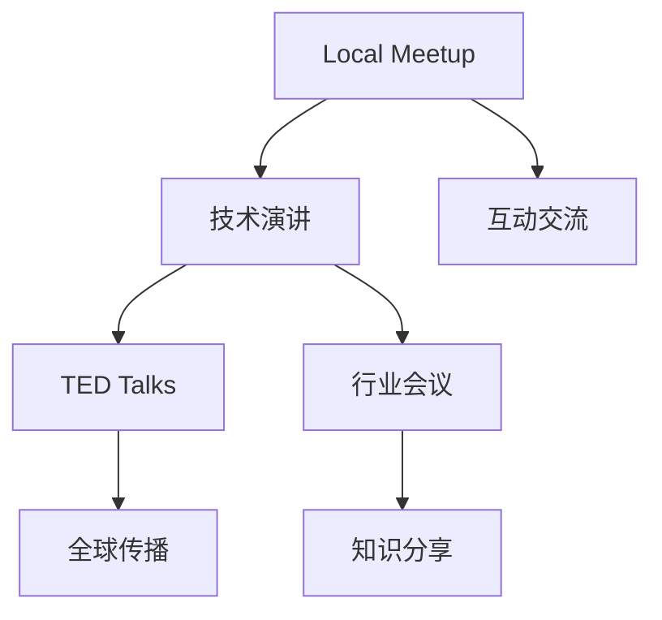

                 

# 技术演讲：从local meetup到TED舞台

在技术圈，演讲不仅仅是分享知识，更是一种艺术。从本地的Meetup小组到全球的TED舞台，每一个舞台都是技术交流和思想碰撞的场所。本文将从技术演讲的角度，探讨从Local Meetup到TED舞台的演进历程，分析演讲背后的核心技术和实践技巧，为技术爱好者提供全方位的指导。

## 1. 背景介绍

### 1.1 技术演讲的历史与演变
技术演讲的起源可以追溯到早期的学术研讨会和工程会议，当时的演讲主要是基于科研论文和工程成果的报告。随着互联网和社交媒体的兴起，技术演讲的形式和内容发生了巨大的变化。

### 1.2 技术演讲的重要性和作用
技术演讲不仅能够传播知识和经验，还能促进技术交流和创新合作，具有深远的影响力。从企业内部的小组讨论到行业的顶级会议，技术演讲已成为技术传播和知识共享的重要方式。

## 2. 核心概念与联系

### 2.1 核心概念概述
技术演讲的核心概念包括：

- **技术演讲**：以技术为内容，通过口头或书面形式传递知识和技术经验的演讲活动。
- **Local Meetup**：地方性技术爱好者组织的非正式聚会，常以小型会议或圆桌讨论的形式进行。
- **TED Talks**：全球知名的思想交流平台，汇聚了各行各业的顶尖演讲者，分享深入见解和独特体验。

### 2.2 核心概念原理和架构的 Mermaid 流程图



- **Local Meetup**：形式上较为随意，但内容深度较高，注重交流和互动。
- **技术演讲**：核心在于传递知识和经验，形式上包括口头和书面。
- **TED Talks**：突出思想性和艺术性，强调传播力和影响力。
- **行业会议**：聚焦于技术和行业动态，强调专业性和前瞻性。

### 2.3 核心概念的联系与差异
技术演讲虽然形式不同，但都具有以下共同点：

- **目标一致**：传递知识、交流经验、促进合作。
- **内容核心**：技术原理、实践技巧、应用案例。
- **演讲效果**：引起共鸣、激发思考、推动创新。

差异主要在于：

- **形式风格**：Local Meetup较为轻松，TED Talks更加艺术，行业会议更正式。
- **传播范围**：Local Meetup影响力较小，TED Talks全球传播，行业会议专业性强。
- **受众对象**：Local Meetup面向技术爱好者，TED Talks面向广泛公众，行业会议面向专业人士。

## 3. 核心算法原理 & 具体操作步骤

### 3.1 算法原理概述
技术演讲的核心算法原理包括以下几个方面：

- **信息传递算法**：通过口头和书面形式，将复杂的技术知识简化并传递给听众。
- **内容组织算法**：对演讲内容进行结构化设计，确保逻辑清晰、层次分明。
- **互动引导算法**：通过提问、讨论等方式，引导听众参与互动，提高演讲效果。

### 3.2 算法步骤详解

#### 3.2.1 准备阶段
1. **确定主题**：选择感兴趣的领域，或根据听众需求确定演讲主题。
2. **收集资料**：搜集相关书籍、论文、案例等资料，深入理解技术细节。
3. **设计结构**：将演讲内容分为引言、主体、结论三部分，明确演讲结构。

#### 3.2.2 演讲准备
1. **编写脚本**：根据演讲结构编写脚本，确保内容连贯、逻辑清晰。
2. **练习讲演**：多次练习讲演，熟悉演讲内容和语言表达。
3. **设计PPT**：使用专业工具设计PPT，确保视觉传达效果。

#### 3.2.3 演讲执行
1. **开场白**：简短介绍自己和演讲主题，引发听众兴趣。
2. **主体内容**：按照脚本逐步讲解，重点突出技术要点和应用场景。
3. **互动环节**：设置互动问题，引导听众参与讨论，增强互动效果。
4. **总结**：回顾演讲要点，强调技术的重要性和应用前景。

### 3.3 算法优缺点

#### 3.3.1 优点
- **易于理解**：简化复杂技术，使听众易于理解和接受。
- **传播广泛**：通过演讲和PPT等形式，快速传播技术知识。
- **互动性强**：通过提问和讨论，增强听众的参与感和思考深度。

#### 3.3.2 缺点
- **内容局限**：难以全面覆盖所有技术细节，可能存在片面或简化。
- **时间限制**：演讲时间有限，难以深入讨论所有技术点。
- **受众差异**：不同受众可能对演讲内容有不同的理解和需求。

### 3.4 算法应用领域

#### 3.4.1 技术交流
技术演讲是技术交流的重要形式，广泛应用于各种场合。从技术团队内部的小组讨论，到跨部门或跨行业的大会，技术演讲都起到了关键作用。

#### 3.4.2 教育培训
技术演讲在教育培训中也具有重要作用。教师可以通过演讲形式，将复杂的知识点传递给学生，帮助他们理解和掌握技术原理。

#### 3.4.3 商业推广
技术演讲在商业推广中也有广泛应用。企业通过技术演讲展示其技术实力和应用前景，吸引投资者和合作伙伴。

#### 3.4.4 学术研究
技术演讲也是学术研究的重要形式之一。研究人员通过演讲分享最新的研究成果，推动学术交流和技术进步。

## 4. 数学模型和公式 & 详细讲解 & 举例说明

### 4.1 数学模型构建
技术演讲的数学模型构建包括以下几个步骤：

1. **输入数据**：演讲主题和受众需求。
2. **处理过程**：将技术知识简化、组织、呈现。
3. **输出结果**：听众对技术知识的理解和应用。

### 4.2 公式推导过程

#### 4.2.1 信息传递算法
设技术知识为 $T$，演讲者为 $S$，听众为 $L$。信息传递算法可表示为：

$$
T_{S\to L} = f(T, S, L)
$$

其中 $f$ 为信息传递函数，将技术知识 $T$ 和演讲者 $S$ 的知识水平，转化为听众 $L$ 能够理解和接受的形式。

#### 4.2.2 内容组织算法
设演讲内容为 $C$，内容组织算法可表示为：

$$
C = g(T, S)
$$

其中 $g$ 为内容组织函数，将技术知识 $T$ 和演讲者 $S$ 的知识水平，组织成结构化的演讲内容 $C$。

#### 4.2.3 互动引导算法
设互动环节为 $I$，互动引导算法可表示为：

$$
I = h(C, L)
$$

其中 $h$ 为互动引导函数，根据演讲内容 $C$ 和听众 $L$ 的需求，设计互动问题，引导听众参与讨论。

### 4.3 案例分析与讲解
假设要进行一次关于深度学习技术介绍的演讲，其数学模型和公式如下：

#### 4.3.1 信息传递算法
设深度学习技术为 $T$，演讲者具有 $S_0$ 水平的深度学习知识。假设演讲时间为 $T_0$，则信息传递算法为：

$$
T_{S_0\to L} = f(T, S_0, L, T_0)
$$

其中 $f$ 为简化和呈现函数，将深度学习技术 $T$ 和演讲者 $S_0$ 的知识水平，转化为听众 $L$ 能够理解的形式，同时考虑演讲时间 $T_0$ 的限制。

#### 4.3.2 内容组织算法
设演讲内容为 $C = \{背景知识, 核心概念, 应用案例\}$，内容组织算法为：

$$
C = g(T, S_0) = (\text{背景知识}, \text{核心概念}, \text{应用案例})
$$

其中 $g$ 为结构化函数，将深度学习技术 $T$ 和演讲者 $S_0$ 的知识水平，组织成背景知识、核心概念和应用案例三部分。

#### 4.3.3 互动引导算法
设互动环节为 $I = \{\问题1, 问题2, 讨论1, 讨论2\}$，互动引导算法为：

$$
I = h(C, L) = (\text{问题1}, \text{问题2}, \text{讨论1}, \text{讨论2})
$$

其中 $h$ 为互动设计函数，根据演讲内容 $C$ 和听众 $L$ 的需求，设计互动问题和讨论环节，引导听众参与。

## 5. 项目实践：代码实例和详细解释说明

### 5.1 开发环境搭建

#### 5.1.1 选择演讲平台
- **本地Meetup**：小规模非正式聚会，可以是小型会议室或咖啡厅。
- **TED Talks**：全球知名平台，需要精心准备和申请。
- **行业会议**：大型专业论坛，需提前注册并提交演讲申请。

#### 5.1.2 选择演讲工具
- **口头演讲**：直接在演讲平台进行现场演讲。
- **书面演讲**：通过博客、视频等方式分享演讲内容。

### 5.2 源代码详细实现

#### 5.2.1 口头演讲脚本编写
```python
def create_lecture_script():
    # 引言部分
    introduction = "大家好，今天我给大家带来的是关于深度学习的介绍。"
    
    # 主体部分
    background = "深度学习是一种基于神经网络的机器学习技术，广泛应用于图像识别、自然语言处理等领域。"
    core_concepts = "核心概念包括神经网络、反向传播、梯度下降等。"
    applications = "应用案例包括自动驾驶、语音识别、推荐系统等。"
    
    # 结论部分
    conclusion = "深度学习具有广阔的应用前景，但也需要不断学习和优化。"
    
    # 返回完整的脚本
    return introduction + background + core_concepts + applications + conclusion
```

#### 5.2.2 PPT设计
使用专业的PPT设计工具，如PowerPoint或Keynote，设计演讲内容。以下是PPT设计的关键步骤：

1. **标题页**：包含演讲主题和演讲者信息。
2. **引言页**：简要介绍演讲内容和目的。
3. **主体页**：分块展示背景知识、核心概念和应用案例。
4. **结论页**：总结演讲要点，提出展望。

### 5.3 代码解读与分析

#### 5.3.1 口头演讲脚本
- **引言**：简要介绍演讲主题，吸引听众兴趣。
- **主体**：详细介绍深度学习背景知识、核心概念和应用案例，突出技术要点。
- **结论**：总结演讲要点，强调技术的重要性和应用前景。

#### 5.3.2 PPT设计
- **标题页**：统一风格，方便听众快速识别。
- **引言页**：简要说明演讲内容和目的，帮助听众理解。
- **主体页**：分块展示技术要点，清晰逻辑结构。
- **结论页**：总结演讲要点，增强印象。

### 5.4 运行结果展示

#### 5.4.1 口头演讲
- **引言**：吸引听众注意力，明确演讲内容。
- **主体**：逐步讲解技术要点，引导听众理解。
- **结论**：总结演讲要点，强调技术的应用前景。

#### 5.4.2 PPT展示
- **标题页**：清晰展示演讲主题和演讲者信息。
- **引言页**：简要说明演讲内容和目的。
- **主体页**：分块展示技术要点，突出重点。
- **结论页**：总结演讲要点，增强印象。

## 6. 实际应用场景

### 6.1 技术交流
技术演讲在技术交流中具有重要作用。以下是几种实际应用场景：

#### 6.1.1 技术团队内部交流
在技术团队内部，可以通过技术演讲分享最新的技术进展和应用案例，促进团队协作和技术提升。

#### 6.1.2 跨部门合作
技术演讲可以帮助不同部门了解其他部门的业务和技术，促进跨部门合作，共同解决复杂问题。

#### 6.1.3 行业会议和大会
行业会议和大会是技术交流的重要平台，通过技术演讲展示最新技术成果，推动行业发展。

### 6.2 教育培训
技术演讲在教育培训中也具有重要作用。以下是几种实际应用场景：

#### 6.2.1 高校课程
高校教师可以通过技术演讲，向学生介绍前沿技术，激发学生的学习兴趣。

#### 6.2.2 企业培训
企业可以通过技术演讲，向员工传递最新技术，提升整体技术水平。

#### 6.2.3 技术工作坊
技术工作坊是互动性较强的培训形式，通过技术演讲和实践操作，帮助学员深入理解技术。

### 6.3 商业推广
技术演讲在商业推广中也有广泛应用。以下是几种实际应用场景：

#### 6.3.1 新产品发布
企业可以通过技术演讲，展示新产品的技术优势和应用场景，吸引用户和投资者。

#### 6.3.2 客户演示
技术演讲可以帮助客户了解产品的技术细节和应用效果，促进销售。

#### 6.3.3 合作伙伴展示
技术演讲可以帮助合作伙伴了解彼此的技术优势和合作前景，促进合作项目。

### 6.4 学术研究
技术演讲在学术研究中具有重要作用。以下是几种实际应用场景：

#### 6.4.1 学术报告
研究人员可以通过技术演讲，向学术界和业界介绍最新的研究成果，推动学术交流和技术进步。

#### 6.4.2 学术会议
学术会议是展示研究成果的重要平台，通过技术演讲分享最新发现，促进学术合作。

#### 6.4.3 学术期刊
学术期刊是研究成果的重要载体，通过技术演讲为期刊投稿提供支持。

## 7. 工具和资源推荐

### 7.1 学习资源推荐

#### 7.1.1 技术演讲指南
- **《TED演讲之道》**：TED官方指南，详细介绍了如何准备和进行TED Talks。
- **《演讲的力量》**：乔舒亚·沃特曼（Joshua Watson）所著，介绍了演讲的艺术和技巧。

#### 7.1.2 技术演讲课程
- **Coursera《公共演讲与沟通技巧》**：由加州大学戴维斯分校开设，讲解公共演讲的基本技巧。
- **Udemy《技术演讲的艺术》**：系统介绍技术演讲的准备工作和实际技巧。

#### 7.1.3 技术演讲书籍
- **《演讲的艺术》**：戴尔·卡耐基（Dale Carnegie）所著，是公共演讲的经典之作。
- **《深度学习入门》**：斋藤康毅所著，讲解深度学习的基础知识和应用。

### 7.2 开发工具推荐

#### 7.2.1 口头演讲工具
- **PowerPoint**：功能强大的PPT设计工具，适用于各类演讲场合。
- **Keynote**：苹果公司的PPT设计工具，适用于Mac平台。

#### 7.2.2 书面演讲工具
- **Medium**：免费的博客平台，方便分享技术文章。
- **YouTube**：免费的视频平台，适合发布技术演讲视频。

### 7.3 相关论文推荐

#### 7.3.1 技术演讲研究
- **《演讲的心理学》**：阿伦森（Arman”Jones）所著，研究演讲中的心理学因素。
- **《技术演讲的创新》**：马库斯·哈格曼（Marcus Hagerman）所著，探讨技术演讲的创新方法。

#### 7.3.2 技术演讲案例
- **《TED Talks: The Official TED Guide to Public Speaking》**：TED官方指南，包含大量优秀演讲案例。
- **《演讲的科学》**：斯坦利·盖茨（Stanley L. Gates Jr.）所著，提供了演讲的科学方法。

## 8. 总结：未来发展趋势与挑战

### 8.1 研究成果总结

技术演讲作为知识传递的重要形式，对技术交流和创新合作具有重要影响。通过不断优化信息传递算法、内容组织算法和互动引导算法，技术演讲将更加高效和广泛地传播技术知识。

### 8.2 未来发展趋势

#### 8.2.1 多样化的演讲形式
随着技术的进步，演讲形式将更加多样化。除了传统的口头和书面演讲，还将出现虚拟现实（VR）、增强现实（AR）等新技术形式的演讲。

#### 8.2.2 跨领域的融合
技术演讲将更加注重跨领域的融合，促进不同领域的技术交流和合作。例如，将深度学习与医疗、教育、金融等领域相结合，推动技术应用的广泛拓展。

#### 8.2.3 数据驱动的优化
通过数据分析和机器学习技术，优化技术演讲的内容和效果。例如，分析听众的需求和反馈，调整演讲内容和互动环节，提高演讲效果。

### 8.3 面临的挑战

#### 8.3.1 内容局限性
技术演讲可能难以全面覆盖所有技术细节，存在内容局限性。如何简化技术内容，使其易于理解，同时又不失技术深度，是一个重要挑战。

#### 8.3.2 互动性不足
传统的技术演讲互动性不足，难以引起听众的深入思考和讨论。如何在演讲中设计更多互动环节，增强听众的参与感，需要进一步探索。

#### 8.3.3 技术门槛
技术演讲对演讲者的技术水平要求较高，需要具备扎实的技术基础和丰富的实践经验。如何降低技术门槛，让更多人能够参与技术演讲，需要进一步推广和普及。

### 8.4 研究展望

#### 8.4.1 跨媒体技术演讲
结合图像、视频等多媒体元素，丰富技术演讲的表现形式，增强听众的理解和兴趣。例如，在演讲中加入演示视频、互动图表等，提升演讲效果。

#### 8.4.2 智能辅助技术
利用人工智能技术，自动化生成技术演讲脚本和PPT，降低演讲者的工作量，提高演讲效率。例如，使用自然语言处理技术自动总结技术要点，生成演讲稿。

#### 8.4.3 个性化技术演讲
根据听众的背景和需求，生成个性化的技术演讲内容。例如，分析听众的兴趣和知识水平，生成针对性的演讲内容，提高演讲效果。

## 9. 附录：常见问题与解答

### 9.1 常见问题
#### 9.1.1 如何选择演讲主题？
- **受众需求**：根据听众的需求和兴趣选择演讲主题，确保演讲内容有价值。
- **前沿性**：选择具有前沿性的技术主题，吸引听众的关注和兴趣。

#### 9.1.2 如何准备演讲内容？
- **搜集资料**：收集相关书籍、论文、案例等资料，深入理解技术细节。
- **设计结构**：将演讲内容分为引言、主体、结论三部分，确保逻辑清晰。

#### 9.1.3 如何进行互动引导？
- **提问**：在演讲中设计互动问题，引导听众思考和讨论。
- **讨论**：设置讨论环节，让听众分享观点和经验，增强互动效果。

### 9.2 解答
#### 9.2.1 如何选择演讲主题？
- **受众需求**：选择与听众需求相关的技术主题，确保演讲内容有价值。
- **前沿性**：选择具有前沿性的技术主题，吸引听众的关注和兴趣。

#### 9.2.2 如何准备演讲内容？
- **搜集资料**：收集相关书籍、论文、案例等资料，深入理解技术细节。
- **设计结构**：将演讲内容分为引言、主体、结论三部分，确保逻辑清晰。

#### 9.2.3 如何进行互动引导？
- **提问**：在演讲中设计互动问题，引导听众思考和讨论。
- **讨论**：设置讨论环节，让听众分享观点和经验，增强互动效果。

总之，技术演讲是技术交流和创新合作的重要形式，通过不断优化演讲内容、提升互动效果，技术演讲将在更多领域发挥更大的作用。未来，技术演讲将结合跨媒体技术和人工智能，进一步提升传播效果和影响力。让我们共同期待，技术演讲能够为技术交流和技术创新带来更多的机遇和挑战。

---

作者：禅与计算机程序设计艺术 / Zen and the Art of Computer Programming

