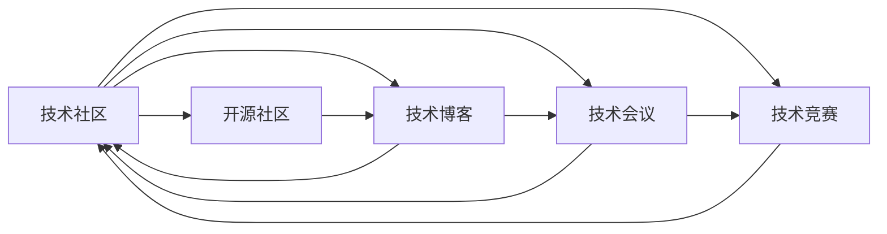

                 

# 技术社区建设：从参与者到组织者

## 1. 背景介绍

在互联网技术发展的初期，程序员通常以一种松散的社群形式存在，通过线上论坛、博客、邮件列表等方式交流。技术社区的萌芽与成型，极大地促进了知识的传播和技术的交流，也催生了许多开源软件项目的诞生，如Linux内核、Apache软件基金会等。这些社区成为技术创新的源泉，推动了全球信息技术产业的飞速发展。

随着时间的推移，技术社区的内涵与外延不断扩展，逐渐从单一的技术交流平台演变为集技术交流、知识共享、资源整合、人才培养、商业合作等多功能于一体的综合性平台。同时，社区的规模与影响力不断扩大，涌现出大批知名的技术社区，如Stack Overflow、GitHub、GitLab、CSDN等，成为了全球IT从业者的必经之路。

然而，随着技术社区的快速壮大，也暴露出一些问题。很多技术社区的管理层逐渐与普通用户脱节，内部运作机制复杂，用户参与度下降，难以适应快速变化的市场环境。如何在竞争激烈的技术市场环境中，保持社区的活跃度和影响力，维持其作为技术交流、创新和合作平台的初心，成为一个亟待解决的问题。

本文将从技术社区建设的角度，探讨从普通社区参与者到社区管理者的转变，分析如何通过建立透明、公平、开放的社区运作机制，最大化利用社区成员的智慧与力量，构建可持续发展的技术社区。

## 2. 核心概念与联系

### 2.1 核心概念概述

为更好地理解技术社区的构建和运作机制，本节将介绍几个关键概念及其相互联系：

- 技术社区（Technical Community）：指由技术爱好者、开发者、行业专家、企业等组成的在线平台，通过技术交流、知识分享、资源整合、人才培养等活动，促进技术创新和产业发展。

- 开源社区（Open Source Community）：指以开源软件项目为核心，提供代码共享、协作开发、问题追踪、社区讨论等服务的平台。

- 技术博客（Technical Blog）：指以分享技术知识和经验为主题的个人或组织博客，通过文章和社区评论等方式与读者互动。

- 技术会议（Technical Conference）：指以技术交流、前沿技术分享、行业动态分析为主题的线下或线上会议，汇聚全球技术精英，推动技术进步。

- 技术竞赛（Technical Contest）：指以技术技能竞赛、编程比赛、技术挑战等为目的的活动，通过设置高难度的任务，激发参与者的创新精神和技术实力。

这些概念之间存在紧密的联系，共同构成了技术社区的基础架构，使得技术社区能够实现技术交流、知识共享、资源整合、人才培养等多重功能。理解这些概念及其关系，是构建一个高效、活跃、可持续发展的技术社区的前提。

### 2.2 核心概念原理和架构的 Mermaid 流程图(Mermaid 流程节点中不要有括号、逗号等特殊字符)



该流程图展示了技术社区内部各个概念之间的关系：

1. 技术社区通过开源社区、技术博客、技术会议、技术竞赛等多种方式，提供丰富多样的内容与活动。
2. 开源社区以代码共享为核心，提供协作开发、问题追踪等平台服务，是技术社区的基础设施。
3. 技术博客通过分享技术知识和经验，推动技术交流与创新，增强社区活力。
4. 技术会议汇聚全球技术精英，展示前沿技术进展，为社区成员提供学习与交流的平台。
5. 技术竞赛激发技术创新，推动技术进步，吸引更多成员加入社区。

这些概念相辅相成，共同构成了一个多维度的技术社区生态系统。

## 3. 核心算法原理 & 具体操作步骤
### 3.1 算法原理概述

技术社区的建设和管理，本质上是一个多维度的系统工程，涉及内容运营、用户管理、技术支撑、平台治理等多个方面。其核心算法原理可以总结如下：

1. 内容运营：通过内容发布、互动交流、活动策划等方式，吸引用户参与，提高社区活跃度。

2. 用户管理：通过用户注册、权限设置、行为规范、积分奖励等机制，提升用户体验，降低用户流失率。

3. 技术支撑：提供代码托管、问题追踪、社区讨论、资源共享等平台服务，为社区成员提供高效便捷的技术交流工具。

4. 平台治理：通过设立社区管理团队、制定社区规则、引入第三方机构监督等手段，确保社区的公平与透明，防止不良行为，维护社区秩序。

### 3.2 算法步骤详解

构建一个高效的技术社区，需要遵循以下步骤：

**Step 1: 确定社区目标与定位**

- 确定社区的核心目标与定位，明确社区的服务对象和价值主张。
- 制定社区的总体发展策略，确定社区的短期和长期目标。

**Step 2: 平台设计**

- 设计社区的基础架构，包括技术选型、功能模块、数据模型等。
- 引入开源工具和框架，提高平台开发效率与技术稳定性。

**Step 3: 内容策划**

- 策划社区的内容发布计划，确保内容的高质量与多样性。
- 定期组织技术分享、线上会议、编程竞赛等活动，吸引用户参与。

**Step 4: 用户管理**

- 设计用户注册与登录机制，提供便捷的用户管理功能。
- 制定社区行为规范，设立用户等级与权限，激励用户贡献。

**Step 5: 技术支撑**

- 提供代码托管、问题追踪、社区讨论等平台服务，增强社区功能。
- 引入社区技术监控与报警机制，保障平台稳定运行。

**Step 6: 平台治理**

- 设立社区管理团队，制定社区规则与行为准则。
- 引入第三方机构监督，确保社区的公平与透明。

**Step 7: 反馈与迭代**

- 收集用户反馈，及时调整社区策略与功能。
- 持续优化社区平台，提升用户体验与满意度。

通过以上步骤，可以实现一个高效、活跃、可持续发展的技术社区。

### 3.3 算法优缺点

技术社区的建设与管理，具有以下优点：

1. 高效促进技术交流：社区平台提供丰富的技术交流工具，为开发者提供高效的技术支持。
2. 激发技术创新：通过技术分享、竞赛等活动，激发成员的创新精神，推动技术进步。
3. 人才与资源整合：社区汇聚全球技术精英，集聚了丰富的技术资源，为技术项目提供有力支持。
4. 降低开发成本：社区成员协同开发，提高代码质量与开发效率，降低项目成本。
5. 提升用户体验：社区提供完善的平台服务，满足开发者多层次的需求，增强用户粘性。

同时，技术社区的建设与管理也存在以下缺点：

1. 内容质量难以控制：社区内容质量参差不齐，需要严格筛选与审核，工作量较大。
2. 社区管理复杂：社区规模不断扩大，管理难度增大，容易出现管理失控等问题。
3. 社区运营成本高：社区平台和活动需要持续投入，运营成本较高，需要稳定的资金支持。

面对这些优缺点，需要综合考虑社区建设的目标与定位，灵活选择适合的平台策略与运营手段。

### 3.4 算法应用领域

技术社区的应用领域十分广泛，涉及软件开发、数据科学、人工智能、区块链、网络安全等多个领域。以下是几个典型的应用场景：

- **软件开发**：社区为开发者提供代码托管、协作开发、问题追踪等服务，促进技术交流与共享。

- **数据科学**：社区汇集数据科学家，分享数据处理、模型训练、数据可视化等技术，推动数据科学发展。

- **人工智能**：社区交流机器学习、深度学习、自然语言处理等前沿技术，推动AI技术的创新与应用。

- **区块链**：社区分享区块链开发、应用案例、技术实践等，推动区块链技术的发展与落地。

- **网络安全**：社区交流网络安全威胁分析、漏洞扫描、安全防护等技术，提高网络安全水平。

## 4. 数学模型和公式 & 详细讲解 & 举例说明（备注：数学公式请使用latex格式，latex嵌入文中独立段落使用 $$，段落内使用 $)
### 4.1 数学模型构建

技术社区的管理与运营，涉及多个维度，可以通过多维度的数学模型进行描述。以下是一个简单的数学模型框架：

- 用户活跃度（$A$）：$A = \alpha \cdot U + \beta \cdot C + \gamma \cdot P$
  - $U$：用户数量
  - $C$：内容质量（包括文章、问题、回答等）
  - $P$：平台稳定性（如故障次数、响应速度等）

- 用户满意度（$S$）：$S = \delta \cdot A + \epsilon \cdot I + \zeta \cdot D$
  - $I$：用户互动（如评论、点赞、分享等）
  - $D$：用户反馈（如投诉、建议等）

- 社区增长率（$G$）：$G = \phi \cdot S + \psi \cdot F + \omega \cdot A$
  - $F$：新增用户（包括注册、邀请等）
  - $A$：现有用户活跃度

### 4.2 公式推导过程

- 用户活跃度模型：$A = \alpha \cdot U + \beta \cdot C + \gamma \cdot P$
  - 用户数量 $U$ 与社区活跃度 $A$ 成正相关关系，$\alpha$ 为正向影响系数。
  - 内容质量 $C$ 与社区活跃度 $A$ 成正相关关系，$\beta$ 为正向影响系数。
  - 平台稳定性 $P$ 与社区活跃度 $A$ 成正相关关系，$\gamma$ 为正向影响系数。

- 用户满意度模型：$S = \delta \cdot A + \epsilon \cdot I + \zeta \cdot D$
  - 用户互动 $I$ 与用户满意度 $S$ 成正相关关系，$\delta$ 为正向影响系数。
  - 用户反馈 $D$ 与用户满意度 $S$ 成正相关关系，$\zeta$ 为正向影响系数。
  - 用户活跃度 $A$ 与用户满意度 $S$ 成正相关关系，$\delta$ 为正向影响系数。

- 社区增长率模型：$G = \phi \cdot S + \psi \cdot F + \omega \cdot A$
  - 用户满意度 $S$ 与社区增长率 $G$ 成正相关关系，$\phi$ 为正向影响系数。
  - 新增用户 $F$ 与社区增长率 $G$ 成正相关关系，$\psi$ 为正向影响系数。
  - 用户活跃度 $A$ 与社区增长率 $G$ 成正相关关系，$\omega$ 为正向影响系数。

通过以上公式，可以建立技术社区的多维度数学模型，用于分析与优化社区管理策略。

### 4.3 案例分析与讲解

以Stack Overflow为例，分析其成功的社区运营策略：

1. **平台设计**：采用简洁的UI/UX设计，提供高效的代码搜索与问答功能。

2. **内容策划**：定期举办编程竞赛、技术分享等活动，激发社区成员的积极参与。

3. **用户管理**：设立严格的审核机制，确保社区内容质量。

4. **技术支撑**：提供完整的代码托管、问题追踪服务，提高开发者工作效率。

5. **平台治理**：设立社区管理员团队，制定社区行为规范，防止不良行为。

6. **反馈与迭代**：定期收集用户反馈，不断优化社区平台，提升用户体验。

Stack Overflow的成功，关键在于其强大的平台支撑、丰富的活动策划、严格的用户管理与高效的运营策略。通过多维度的管理与运营，构建了一个高效、活跃、可持续发展的技术社区。

## 5. 项目实践：代码实例和详细解释说明
### 5.1 开发环境搭建

在进行技术社区开发前，需要先准备好开发环境。以下是使用Python进行Flask框架开发的环境配置流程：

1. 安装Anaconda：从官网下载并安装Anaconda，用于创建独立的Python环境。

2. 创建并激活虚拟环境：
```bash
conda create -n community-env python=3.8 
conda activate community-env
```

3. 安装Flask：根据官方文档下载并安装Flask。

4. 安装SQLAlchemy：用于数据库访问。

5. 安装Flask-SocketIO：用于实时通信功能。

6. 安装Flask-WTF：用于表单处理。

7. 安装Flask-Login：用于用户认证。

8. 安装Flask-Mail：用于发送邮件通知。

完成上述步骤后，即可在`community-env`环境中开始社区开发。

### 5.2 源代码详细实现

这里我们以GitHub社区为例，给出使用Flask框架开发GitHub社区的Python代码实现。

```python
from flask import Flask, render_template, request, redirect, url_for
from flask_sqlalchemy import SQLAlchemy
from flask_login import LoginManager, UserMixin, login_user, logout_user, login_required, current_user
from flask_socketio import SocketIO, emit

app = Flask(__name__)
app.config['SQLALCHEMY_DATABASE_URI'] = 'sqlite:///users.db'
app.config['SECRET_KEY'] = 'secret_key'
db = SQLAlchemy(app)
login_manager = LoginManager()
login_manager.init_app(app)
socketio = SocketIO(app)

class User(UserMixin, db.Model):
    id = db.Column(db.Integer, primary_key=True)
    username = db.Column(db.String(20), unique=True, nullable=False)
    password = db.Column(db.String(80), nullable=False)

@login_manager.user_loader
def load_user(user_id):
    return User.query.get(int(user_id))

@app.route('/')
def index():
    return render_template('index.html')

@app.route('/login', methods=['GET', 'POST'])
def login():
    if request.method == 'POST':
        username = request.form['username']
        password = request.form['password']
        user = User.query.filter_by(username=username, password=password).first()
        if user:
            login_user(user)
            return redirect(url_for('home'))
    return render_template('login.html')

@app.route('/logout')
@login_required
def logout():
    logout_user()
    return redirect(url_for('index'))

@app.route('/home')
@login_required
def home():
    return render_template('home.html')

@app.route('/profile')
@login_required
def profile():
    return render_template('profile.html')

@app.route('/post', methods=['GET', 'POST'])
@login_required
def post():
    if request.method == 'POST':
        title = request.form['title']
        content = request.form['content']
        post = Post(title=title, content=content, user_id=current_user.id)
        db.session.add(post)
        db.session.commit()
        socketio.emit('new_post', {'username': current_user.username, 'title': post.title, 'content': post.content})
        return redirect(url_for('home'))
    return render_template('post.html')

@app.route('/post/<id>')
@login_required
def view_post(id):
    post = Post.query.get(id)
    return render_template('view_post.html', post=post)

if __name__ == '__main__':
    db.create_all()
    socketio.run(app)
```

以上代码实现了GitHub社区的基本功能，包括用户登录、发布文章、查看文章等。

### 5.3 代码解读与分析

让我们再详细解读一下关键代码的实现细节：

**User类**：
- 定义了用户的基本属性，包括用户名和密码。

**login_manager.user_loader**：
- 定义用户加载器，用于根据用户ID获取用户信息，支持用户认证和权限管理。

**index路由**：
- 定义社区首页，展示最新的文章列表。

**login路由**：
- 定义用户登录页面，处理用户提交的登录表单。

**logout路由**：
- 定义用户注销功能，退出当前会话。

**home路由**：
- 定义用户首页，显示用户提交的文章列表。

**profile路由**：
- 定义用户个人主页，展示用户发布的文章列表。

**post路由**：
- 定义用户发布文章功能，处理用户提交的文章内容。

**view_post路由**：
- 定义文章查看页面，展示指定文章的内容。

**Flask-SocketIO模块**：
- 引入SocketIO模块，实现实时通信功能。

通过以上代码，我们可以快速构建一个简单的GitHub社区平台，实现用户登录、发布文章、查看文章等功能。

## 6. 实际应用场景
### 6.1 智能客服系统

基于技术社区的技术交流与知识共享能力，智能客服系统可以通过社区互动与实时问答功能，提升客户服务的智能化水平。

1. **技术交流**：客户可以通过社区平台查询相关问题，获取技术解决方案。
2. **知识共享**：客服团队在社区平台上分享经验，帮助客户快速解决问题。
3. **实时问答**：社区平台实时监控用户提问，自动推送相关答案，提高服务效率。

### 6.2 在线教育平台

在线教育平台可以借鉴技术社区的模式，构建一个集课程分享、教学互动、资源共享于一体的学习社区。

1. **课程分享**：教师在社区平台上分享教学内容，促进知识传播。
2. **教学互动**：学生可以在社区平台上提问，教师实时解答，提高教学质量。
3. **资源共享**：社区平台提供丰富的学习资源，满足不同学生的学习需求。

### 6.3 开源软件开发

开源软件开发社区通过代码托管、问题追踪、社区讨论等功能，为开发者提供高效协作的开发环境。

1. **代码托管**：开发者可以在社区平台上托管代码，进行版本控制。
2. **问题追踪**：开发者可以在社区平台上提交问题，获取解决方案。
3. **社区讨论**：开发者在社区平台上讨论技术问题，促进技术交流。

### 6.4 未来应用展望

随着技术社区的不断发展，未来的应用场景将更加多样和广泛，以下列出了几个可能的未来方向：

- **社交媒体平台**：技术社区可以与社交媒体平台结合，提供技术分享与讨论功能，增强用户互动。
- **智能推荐系统**：技术社区可以基于用户行为数据，提供智能推荐功能，推荐相关的技术文章和资源。
- **虚拟现实平台**：技术社区可以与VR技术结合，提供虚拟实验室、技术沙盘等功能，增强用户沉浸感。
- **区块链技术社区**：技术社区可以与区块链技术结合，提供智能合约、去中心化应用等功能，推动区块链技术的普及和应用。

## 7. 工具和资源推荐
### 7.1 学习资源推荐

为了帮助开发者系统掌握技术社区的构建与运营，以下是一些优质的学习资源：

1. **《Flask Web Development》书籍**：详细的介绍了Flask框架的使用方法，包括模板、表单、认证、静态文件等功能的实现。

2. **Flask官方文档**：提供了Flask框架的详细文档，涵盖从基础到高级的各个方面，包括安装、配置、路由、模板、扩展等内容。

3. **Flask-SocketIO官方文档**：提供了SocketIO模块的详细文档，涵盖实时通信、事件处理、客户端API等内容。

4. **《Python Web Development》书籍**：全面介绍了Web开发的各个方面，包括Flask、Django、SQLAlchemy等框架的使用。

5. **Flask-SQLAlchemy官方文档**：提供了SQLAlchemy模块的详细文档，涵盖数据库连接、模型定义、查询操作等内容。

通过这些学习资源，相信你一定能够系统掌握技术社区的构建与运营，构建一个高效、活跃、可持续发展的技术社区。

### 7.2 开发工具推荐

高效的开发离不开优秀的工具支持。以下是几款用于技术社区开发常用的工具：

1. **Visual Studio Code**：功能强大的代码编辑器，支持多种编程语言和框架，提供了丰富的扩展插件。

2. **Git**：版本控制系统，支持分布式版本管理，广泛用于开源项目的管理和协作。

3. **JIRA**：问题追踪与项目管理工具，支持任务分配、进度跟踪、问题处理等功能，广泛应用于开源社区。

4. **Slack**：即时通讯工具，支持创建多个频道和群组，广泛用于团队协作与沟通。

5. **GitHub/GitLab**：代码托管与版本控制平台，支持代码托管、问题追踪、社区讨论等功能，广泛用于开源社区。

合理利用这些工具，可以显著提升技术社区的开发效率，加快创新迭代的步伐。

### 7.3 相关论文推荐

技术社区的发展源于学界的持续研究。以下是几篇奠基性的相关论文，推荐阅读：

1. **《Social Computing》论文**：介绍了社交计算的基本概念与理论，探讨了社交计算在技术社区中的应用。

2. **《Online Communities and Social Media》论文**：探讨了在线社区的发展历程和未来趋势，分析了社交媒体对技术社区的影响。

3. **《Open Source Development in Software Projects》论文**：研究了开源社区的特点与运作机制，探讨了开源社区对软件项目的影响。

4. **《Crowdsourcing Technology Development》论文**：分析了众包技术在开源社区中的应用，探讨了众包技术对技术发展的推动作用。

5. **《Community Building and Maintenance in Open Source Projects》论文**：探讨了开源社区的建设与维护，分析了社区建设的关键要素。

这些论文代表了大规模技术社区发展的最新研究成果，通过学习这些前沿成果，可以帮助研究者更好地把握技术社区的发展方向，激发更多的创新灵感。

## 8. 总结：未来发展趋势与挑战
### 8.1 研究成果总结

本文从技术社区建设的角度，探讨了从普通社区参与者到社区管理者的转变，分析了如何通过建立透明、公平、开放的社区运作机制，最大化利用社区成员的智慧与力量，构建可持续发展的技术社区。通过多维度的模型建立与案例分析，介绍了技术社区的基本功能与运营策略，给出了技术社区开发的具体代码实现，展示了技术社区在不同领域的应用场景。

通过本文的系统梳理，可以看到，技术社区的构建与管理需要综合考虑平台设计、内容运营、用户管理、技术支撑、平台治理等多个方面，才能构建一个高效、活跃、可持续发展的技术社区。同时，技术社区的应用领域广泛，涵盖了软件开发、在线教育、开源开发等多个领域，展示了技术社区的强大潜力。

### 8.2 未来发展趋势

展望未来，技术社区的发展将呈现以下几个趋势：

1. **社区规模扩大**：技术社区的用户和开发者数量将持续增长，社区规模不断扩大，成为全球技术创新的重要平台。

2. **社区功能丰富**：技术社区将不断引入新的功能模块，涵盖知识共享、资源整合、社区讨论、技术合作等多个方面。

3. **社区治理透明**：技术社区将建立更加透明、公平、开放的治理机制，确保社区的公平与透明。

4. **社区互动增强**：技术社区将加强用户互动与参与，通过活动策划、激励机制等手段，提升社区的活跃度和粘性。

5. **社区技术创新**：技术社区将成为技术创新的重要来源，推动技术进步和产业发展。

### 8.3 面临的挑战

尽管技术社区的发展前景广阔，但也面临诸多挑战：

1. **内容质量控制**：社区内容质量参差不齐，需要严格筛选与审核，工作量较大。

2. **社区管理复杂**：社区规模不断扩大，管理难度增大，容易出现管理失控等问题。

3. **社区运营成本高**：社区平台和活动需要持续投入，运营成本较高，需要稳定的资金支持。

4. **社区用户分化**：社区用户结构复杂，不同用户群体的需求差异较大，难以统一管理。

5. **社区竞争激烈**：技术社区竞争激烈，需要不断创新和优化，才能保持竞争力。

### 8.4 研究展望

面对技术社区发展中的挑战，未来的研究需要在以下几个方面寻求新的突破：

1. **自动化内容审核**：引入自然语言处理和机器学习技术，自动化筛选和审核社区内容，提高审核效率和质量。

2. **社区智能推荐**：通过数据分析和算法优化，实现社区内容的智能推荐，提升用户体验。

3. **社区动态治理**：引入动态治理机制，根据社区发展情况，实时调整社区规则与策略。

4. **社区数据挖掘**：利用数据挖掘技术，分析社区用户行为数据，提升社区运营效率和效果。

5. **社区全球化**：拓展全球化视野，与国际技术社区建立合作关系，推动全球技术交流与合作。

这些研究方向的探索，必将引领技术社区的建设与管理迈向更高的台阶，为全球技术创新提供更有力的支持。面向未来，技术社区需要在保持社区活力与创新的同时，注重社区的可持续发展和良性治理，构建一个更加开放、透明、高效的技术交流与创新平台。

