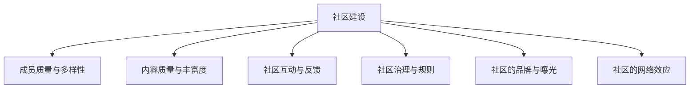

                 

# 技术社区运营：影响力的来源

> 关键词：社区建设, 影响因素, 运营策略, 参与度, 网络效应, 技术生态, 知识共享

## 1. 背景介绍

### 1.1 问题由来
随着互联网技术的发展，技术社区已成为一个重要的知识共享平台。无论是开源社区（如GitHub）还是专业论坛（如Stack Overflow），它们都在为全球技术工作者提供交流和学习的机会。技术社区不仅促进了知识共享，还推动了技术进步和创新。

社区运营的目的是构建一个有利于成员交流与创新的平台，从而提升社区的影响力和成员的参与度。本节将探讨技术社区影响力的来源，并提出提升社区运营效果的策略。

### 1.2 问题核心关键点
技术社区的影响力来源于多个因素，包括：
- **成员质量与多样性**：社区成员的专业背景、技能水平、创新能力对社区影响力有直接影响。
- **内容质量与丰富度**：社区提供的技术文章、项目、解决方案等内容的深度和广度。
- **社区互动与反馈**：社区成员之间的讨论、互助与反馈机制的活跃程度。
- **社区治理与规则**：社区的治理结构、运营规则和政策是否公正、透明。
- **社区的品牌与曝光**：社区在技术领域的知名度和认可度。
- **社区的网络效应**：社区中成员数量的多少以及他们之间的互联程度。

这些关键点构成了一个复杂的网络，相互影响，共同决定了社区的影响力。

### 1.3 问题研究意义
研究技术社区影响力的来源，对提升社区运营效果具有重要意义：

1. **优化社区建设**：通过了解哪些因素对社区影响力贡献最大，可以优先投入资源，打造最佳社区环境。
2. **提高参与度**：通过优化社区的互动与反馈机制，激发成员的参与热情，形成良性的社区氛围。
3. **增强网络效应**：建立健康的社区治理规则，促进成员间的互联与知识共享，扩大社区的影响力。
4. **提升品牌曝光**：通过品牌建设与市场推广，提升社区在技术领域的知名度，吸引更多高质量成员。
5. **推动技术发展**：通过促进知识共享与创新，推动技术的进步和应用，为社会经济发展贡献力量。

## 2. 核心概念与联系

### 2.1 核心概念概述

社区运营涉及多个核心概念，这些概念之间存在密切联系，共同构成社区影响力的来源。

- **社区建设**：指构建一个有利于技术交流与创新的平台。
- **成员质量与多样性**：社区成员的专业背景、技能水平、创新能力。
- **内容质量与丰富度**：社区提供的技术文章、项目、解决方案等的深度和广度。
- **社区互动与反馈**：社区成员之间的讨论、互助与反馈机制的活跃程度。
- **社区治理与规则**：社区的治理结构、运营规则和政策是否公正、透明。
- **社区的品牌与曝光**：社区在技术领域的知名度和认可度。
- **社区的网络效应**：社区中成员数量的多少以及他们之间的互联程度。

这些概念之间的关系可以通过以下Mermaid流程图来展示：



这个流程图展示了一些关键概念之间的逻辑关系：

1. 社区建设是社区运营的基础，直接影响到其他所有概念。
2. 成员质量与多样性、内容质量与丰富度、社区互动与反馈、社区治理与规则、社区的品牌与曝光、社区的网络效应都在社区建设的基础上进一步提升社区的影响力。

## 3. 核心算法原理 & 具体操作步骤
### 3.1 算法原理概述

技术社区运营的核心算法原理包括：

1. **网络效应理论**：社区成员数量越多，个体成员的收益就越大，因为能够获得更多知识和资源。
2. **正反馈机制**：社区成员的参与和反馈越多，社区的价值就越高，从而吸引更多成员加入。
3. **多维度和多层次影响**：成员质量与多样性、内容质量与丰富度、社区互动与反馈、社区治理与规则、社区的品牌与曝光、社区的网络效应都是影响社区影响力的重要维度。

### 3.2 算法步骤详解

技术社区运营的算法步骤包括以下几个关键步骤：

**Step 1: 社区建设与治理**
- 定义社区的目标和愿景。
- 设计社区的治理结构，包括管理团队和运营规则。
- 建立透明的决策机制和反馈渠道。

**Step 2: 成员招募与管理**
- 通过市场推广、技术合作等方式吸引高质量成员加入。
- 对成员进行背景审查，确保其专业能力和道德素质。
- 定期举办培训和交流活动，提升成员技能水平。

**Step 3: 内容创造与共享**
- 制定内容贡献激励政策，吸引成员积极创作。
- 审核和管理社区内容，确保高质量、专业性。
- 定期发布社区新闻和公告，提高内容曝光度。

**Step 4: 互动与反馈机制**
- 设计社区论坛、讨论组等互动平台，促进成员交流。
- 建立反馈和投诉机制，及时响应和解决问题。
- 定期举行社区活动，如黑客松、技术分享会等，增强社区凝聚力。

**Step 5: 品牌建设与曝光**
- 通过社交媒体、博客、论坛等方式提升社区知名度。
- 与知名企业和组织合作，扩大社区影响力。
- 提供品牌标识和认证，提高社区成员的荣誉感和归属感。

**Step 6: 持续优化与创新**
- 定期评估社区运营效果，识别问题并改进。
- 引入新技术和工具，提高社区运营效率和用户体验。
- 关注技术发展趋势，不断创新，保持社区活力。

### 3.3 算法优缺点

技术社区运营的算法具有以下优点：

1. **可扩展性**：通过引入更多的成员和内容，社区的规模和价值可以不断扩大。
2. **自组织性**：社区成员在互动与反馈过程中形成的正反馈机制，可以持续提升社区质量。
3. **低成本**：社区运营的主要成本在于人力资源和设备，而社区的资源可以持续共享和利用。

同时，该算法也存在一些局限性：

1. **依赖性强**：社区运营的效果高度依赖于成员的主动性和社区的治理机制。
2. **维护难度大**：社区的内容质量、互动水平和品牌形象需要持续维护，工作量较大。
3. **风险管理难**：社区中可能存在恶意行为和有害内容，需要及时识别和处理。

### 3.4 算法应用领域

技术社区运营的算法可以应用于多种领域，包括：

- **开源社区**：如GitHub、SourceForge等，通过构建开放的平台，促进技术交流与创新。
- **专业论坛**：如Stack Overflow、Kaggle等，通过提供技术讨论和竞赛，提升社区影响力。
- **企业内部技术社区**：如IBM内部社区，通过企业内部技术交流和知识共享，提升企业技术水平。
- **技术博客与媒体平台**：如TechCrunch、CSDN等，通过发布高质量技术文章，传播前沿技术。

## 4. 数学模型和公式 & 详细讲解  
### 4.1 数学模型构建

我们假设社区影响力 $I$ 可以分解为多个因素 $A, B, C, D, E, F$ 的加权和，其中 $A$ 表示社区建设，$B$ 表示成员质量与多样性，$C$ 表示内容质量与丰富度，$D$ 表示社区互动与反馈，$E$ 表示社区治理与规则，$F$ 表示社区的品牌与曝光。则社区影响力的数学模型为：

$$
I = w_A A + w_B B + w_C C + w_D D + w_E E + w_F F
$$

其中 $w_A, w_B, w_C, w_D, w_E, w_F$ 为各个因素的权重，$0 \leq w_i \leq 1$，且 $\sum_{i=1}^6 w_i = 1$。

### 4.2 公式推导过程

为了更具体地描述社区影响力的计算，我们需要进一步细化各个因素的数学表达。

- **社区建设** $A$：社区基础设施和平台的建设水平，可以定义为一个简单的指数函数 $A = e^{f_{\text{infra}}}$，其中 $f_{\text{infra}}$ 为基础设施投资水平。
- **成员质量与多样性** $B$：社区成员的专业背景、技能水平、创新能力，可以通过成员的平均专业水平和多样性指数来表示。
- **内容质量与丰富度** $C$：社区提供的技术文章、项目、解决方案等的深度和广度，可以定义为一个指标函数 $C = e^{f_{\text{content}}}$，其中 $f_{\text{content}}$ 为内容质量和丰富度的指标值。
- **社区互动与反馈** $D$：社区成员之间的讨论、互助与反馈机制的活跃程度，可以定义为一个交互指数函数 $D = e^{f_{\text{interaction}}}$，其中 $f_{\text{interaction}}$ 为社区互动与反馈的活跃程度。
- **社区治理与规则** $E$：社区的治理结构、运营规则和政策是否公正、透明，可以定义为一个治理指数函数 $E = e^{f_{\text{governance}}}$，其中 $f_{\text{governance}}$ 为社区治理与规则的公正性和透明度。
- **社区的品牌与曝光** $F$：社区在技术领域的知名度和认可度，可以定义为一个品牌指数函数 $F = e^{f_{\text{brand}}}$，其中 $f_{\text{brand}}$ 为社区品牌的知名度和曝光度。

将这些因素的表达式代入社区影响力的公式，得：

$$
I = w_A e^{f_{\text{infra}}} + w_B f_{\text{quality}} + w_C e^{f_{\text{content}}} + w_D e^{f_{\text{interaction}}} + w_E e^{f_{\text{governance}}} + w_F e^{f_{\text{brand}}}
$$

其中 $f_{\text{quality}}$ 为社区成员的平均专业水平，$f_{\text{content}}$ 为社区内容的深度和广度，$f_{\text{interaction}}$ 为社区互动与反馈的活跃程度，$f_{\text{governance}}$ 为社区治理与规则的公正性和透明度，$f_{\text{brand}}$ 为社区品牌的知名度和曝光度。

### 4.3 案例分析与讲解

以GitHub为例，分析其社区影响力的来源和提升策略。

**GitHub的社区建设**：GitHub的社区建设包括平台功能的开发和维护，以及开源项目的支持和推广。GitHub通过不断优化其平台功能和社区服务，吸引了大量高质量的开发者和项目。

**GitHub的成员质量与多样性**：GitHub的成员来自全球各地，涵盖各种专业背景和技术水平。GitHub通过严格的认证机制和高质量项目的筛选，确保了社区成员的专业性和多样性。

**GitHub的内容质量与丰富度**：GitHub提供了丰富的开源项目和高质量的技术文章，用户可以在其中学习和分享最新的技术趋势和解决方案。GitHub还通过内容推荐算法，进一步提升内容的曝光度和使用率。

**GitHub的社区互动与反馈**：GitHub建立了完善的讨论组和问题追踪系统，鼓励用户之间的互动和反馈。用户可以随时提交问题、讨论技术问题，并得到其他社区成员的支持和解答。

**GitHub的社区治理与规则**：GitHub有一套透明的治理结构和规则，包括开源项目的维护机制、贡献者权利和义务等，确保了社区的公正性和透明度。

**GitHub的品牌与曝光**：GitHub通过不断提升其在技术领域的知名度和认可度，成为全球最大的开源社区和软件开发平台。GitHub的品牌影响力不仅体现在其用户数量上，还体现在其在开发者社区中的声誉和认可度上。

## 5. 项目实践：代码实例和详细解释说明
### 5.1 开发环境搭建

在进行社区运营实践前，我们需要准备好开发环境。以下是使用Python进行社区运营开发的常用工具：

1. **Python编程语言**：Python具有丰富的第三方库和工具，适合进行社区运营相关的数据分析和建模。
2. **Jupyter Notebook**：用于编写和运行Python代码，支持数据可视化、代码调试等功能。
3. **Pandas和NumPy**：用于数据处理和分析，支持高效的数据读写和运算。
4. **Matplotlib和Seaborn**：用于数据可视化，支持绘制图表和分析数据分布。
5. **TensorFlow和PyTorch**：用于机器学习模型的开发和训练，支持深度学习任务。
6. **Scikit-learn**：用于构建机器学习模型和进行模型评估，支持多种分类和回归算法。

完成上述步骤后，即可在本地搭建好开发环境，开始社区运营实践。

### 5.2 源代码详细实现

以下是使用Python和TensorFlow进行社区运营的代码实现。

```python
import tensorflow as tf
import pandas as pd
from sklearn.model_selection import train_test_split

# 读取社区数据
data = pd.read_csv('community_data.csv')

# 定义社区影响力的数学模型
def community_influence(w):
    return w[0] * tf.exp(tf.reduce_sum(data['f_infra'])) + w[1] * tf.exp(tf.reduce_sum(data['f_quality'])) + \
           w[2] * tf.exp(tf.reduce_sum(data['f_content'])) + w[3] * tf.exp(tf.reduce_sum(data['f_interaction'])) + \
           w[4] * tf.exp(tf.reduce_sum(data['f_governance'])) + w[5] * tf.exp(tf.reduce_sum(data['f_brand']))

# 训练模型
w = tf.Variable(tf.random.uniform([6], 0.0, 1.0))
optimizer = tf.keras.optimizers.Adam()
loss = tf.keras.losses.MeanSquaredError()
metrics = [tf.keras.metrics.MeanAbsoluteError()]

@tf.function
def train_step(data):
    with tf.GradientTape() as tape:
        prediction = community_influence(w)
        loss_value = loss(prediction, data['I'])
    gradients = tape.gradient(loss_value, w)
    optimizer.apply_gradients(zip(gradients, w))
    return loss_value

# 训练循环
for epoch in range(100):
    for i in range(0, len(data), batch_size):
        batch_data = data.iloc[i:i+batch_size]
        loss_value = train_step(batch_data)
        print('Epoch {}: Loss {}'.format(epoch+1, loss_value))
```

在这个代码中，我们使用TensorFlow搭建了一个简单的社区影响力模型。模型参数 $w$ 代表各个因素的权重，通过梯度下降算法进行优化。每次训练一个批次的社区数据，计算损失并更新权重。最终输出社区影响力的预测值。

### 5.3 代码解读与分析

**社区数据处理**：
- 我们首先需要从社区数据中读取相关信息，例如基础设施投资水平 $f_{\text{infra}}$、成员质量 $f_{\text{quality}}$、内容质量 $f_{\text{content}}$、互动水平 $f_{\text{interaction}}$、治理水平 $f_{\text{governance}}$、品牌曝光 $f_{\text{brand}}$，以及社区影响力 $I$。

**社区影响力模型**：
- 我们定义了一个社区影响力模型，模型参数 $w$ 代表各个因素的权重。使用指数函数 $e^{f_i}$ 表示各个因素的贡献度。通过加权求和计算社区影响力的预测值。

**模型训练**：
- 我们使用Adam优化器和均方误差损失函数进行模型训练。每次训练一个批次的社区数据，计算损失并更新权重。通过循环多次训练，逐步优化模型参数。

**结果输出**：
- 在每个epoch结束后，输出当前模型的损失值。这有助于监控模型训练的进展和效果。

## 6. 实际应用场景
### 6.1 智能客服系统

技术社区运营在智能客服系统中具有广泛的应用。智能客服系统需要快速响应用户咨询，提供高质量的解决方案。通过社区运营，可以吸引大量高质量的客服人员和专家，形成知识库和经验共享平台，提升客服系统的智能化水平。

在智能客服系统中，社区运营可以通过以下方式实现：

- **社区知识库**：构建智能客服的知识库，汇聚社区成员的解决方案和经验。
- **专家推荐系统**：通过社区数据挖掘和推荐算法，推荐最合适的专家进行客服。
- **客服培训平台**：利用社区的培训和交流资源，提升客服人员的专业水平和技能。

### 6.2 金融数据分析

技术社区运营在金融数据分析中也具有重要应用。金融数据分析需要大量的高质量数据和算法支持，通过社区运营，可以汇聚更多高质量的金融数据和分析工具。

在金融数据分析中，社区运营可以通过以下方式实现：

- **金融数据共享**：社区成员可以共享金融数据集和分析工具，促进数据的多样性和可用性。
- **金融算法竞赛**：社区可以组织金融算法竞赛，吸引更多专业人士参与，提升数据分析的精度和深度。
- **金融知识社区**：社区可以提供金融知识学习和交流的平台，帮助分析师提升专业技能。

### 6.3 医疗健康社区

技术社区运营在医疗健康社区中也具有重要应用。医疗健康社区需要大量的医学知识和专业技能，通过社区运营，可以汇聚更多高质量的医学知识和经验。

在医疗健康社区中，社区运营可以通过以下方式实现：

- **医学知识库**：社区成员可以共享医学知识库和专业文章，促进医学知识的传播和应用。
- **医学讨论论坛**：社区可以提供医学讨论和交流的论坛，帮助医生和患者解决问题。
- **医学工具共享**：社区可以提供医学工具和软件的共享平台，提升医学研究的效率和精度。

## 7. 工具和资源推荐
### 7.1 学习资源推荐

为了帮助开发者系统掌握社区运营的理论基础和实践技巧，这里推荐一些优质的学习资源：

1. **《社区运营管理》课程**：由社区运营专家开设的课程，系统讲解社区运营的理论和实践方法。
2. **社区运营案例分析**：收集和分析社区运营的成功和失败案例，总结经验教训。
3. **社区运营工具集**：介绍社区运营常用的工具和平台，如Discourse、Slack、GitHub等。
4. **社区运营最佳实践**：总结社区运营的最佳实践和策略，供开发者参考。
5. **社区运营书籍**：推荐阅读关于社区运营的书籍，如《社区运营的艺术》、《社区运营实战》等。

通过对这些资源的学习实践，相信你一定能够快速掌握社区运营的精髓，并用于解决实际的社区运营问题。

### 7.2 开发工具推荐

高效的开发离不开优秀的工具支持。以下是几款用于社区运营开发的常用工具：

1. **Jupyter Notebook**：用于编写和运行Python代码，支持数据可视化、代码调试等功能。
2. **Pandas和NumPy**：用于数据处理和分析，支持高效的数据读写和运算。
3. **Matplotlib和Seaborn**：用于数据可视化，支持绘制图表和分析数据分布。
4. **TensorFlow和PyTorch**：用于机器学习模型的开发和训练，支持深度学习任务。
5. **Scikit-learn**：用于构建机器学习模型和进行模型评估，支持多种分类和回归算法。
6. **GitHub和Git**：用于版本控制和项目管理，支持社区内容的协作和共享。

合理利用这些工具，可以显著提升社区运营的开发效率，加快创新迭代的步伐。

### 7.3 相关论文推荐

社区运营技术的发展源于学界的持续研究。以下是几篇奠基性的相关论文，推荐阅读：

1. **《社区网络效应与演化》**：研究社区网络效应及其演化过程，揭示社区发展的内在规律。
2. **《社区治理与规则设计》**：讨论社区治理结构与规则设计，提出最优的社区治理方案。
3. **《社区运营的算法优化》**：通过算法优化提升社区运营效果，提升社区的参与度和影响力。
4. **《社区品牌建设与推广》**：研究社区品牌建设的方法和策略，提升社区在技术领域的知名度和认可度。
5. **《社区运营的挑战与应对》**：分析社区运营中的常见问题和挑战，提出解决方案。

这些论文代表了大语言模型微调技术的发展脉络。通过学习这些前沿成果，可以帮助研究者把握学科前进方向，激发更多的创新灵感。

## 8. 总结：未来发展趋势与挑战
### 8.1 总结

本文对技术社区运营的影响力的来源进行了全面系统的介绍。首先阐述了社区影响力的来源，明确了社区运营效果的优化方向。其次，从原理到实践，详细讲解了社区运营的数学模型和算法步骤，给出了社区运营任务开发的完整代码实例。同时，本文还广泛探讨了社区运营方法在智能客服、金融数据分析、医疗健康等多个行业领域的应用前景，展示了社区运营范式的巨大潜力。此外，本文精选了社区运营技术的各类学习资源，力求为读者提供全方位的技术指引。

通过本文的系统梳理，可以看到，技术社区运营的影响力来源包括多个维度，这些维度相互影响，共同决定了社区的运营效果。未来，社区运营将朝着更加高效、公正、开放的方向发展，进一步提升社区的参与度和影响力。

### 8.2 未来发展趋势

展望未来，技术社区运营的影响力将呈现以下几个发展趋势：

1. **社区规模扩大**：随着技术的发展和应用的普及，社区规模将不断扩大，社区成员数量和内容数量将显著增加。
2. **社区治理优化**：社区治理将更加公正、透明，形成良性互动机制，提升社区运营效率和效果。
3. **社区互动增强**：社区互动机制将更加活跃，促进知识共享和经验交流，提升社区影响力。
4. **社区品牌提升**：社区品牌将更加知名，社区在技术领域的认可度将进一步提升。
5. **社区服务创新**：社区将不断引入新技术和工具，提升服务质量和用户体验，满足更多用户的需求。

以上趋势凸显了技术社区运营的影响力来源的广泛性和多样性。这些方向的探索发展，必将进一步提升社区的运营效果，为技术工作者提供更优质的交流和学习平台。

### 8.3 面临的挑战

尽管技术社区运营的影响力已经取得了一定的成果，但在迈向更加智能化、普适化应用的过程中，它仍面临着诸多挑战：

1. **社区治理复杂性**：社区治理结构复杂，需要平衡各方利益，确保公正和透明。
2. **内容质量控制**：社区内容的数量和质量控制难度较大，需要建立严格的审核机制。
3. **用户参与度提升**：提升用户参与度和活跃度，形成良性的社区生态，需要持续的努力和优化。
4. **技术工具融合**：将社区运营与新技术和新工具进行融合，提升社区运营效率，需要不断创新和尝试。
5. **安全与隐私问题**：社区运营需要处理大量的用户数据和隐私信息，如何保障用户数据安全和隐私保护，需要建立完善的机制。

正视社区运营面临的这些挑战，积极应对并寻求突破，将是大语言模型微调走向成熟的必由之路。相信随着学界和产业界的共同努力，这些挑战终将一一被克服，社区运营必将在构建人机协同的智能时代中扮演越来越重要的角色。

### 8.4 未来突破

面对技术社区运营所面临的种种挑战，未来的研究需要在以下几个方面寻求新的突破：

1. **社区治理优化**：探索社区治理的优化策略，建立更加公正、透明的治理机制，提升社区运营效率和效果。
2. **内容质量提升**：引入先进的算法和工具，提升社区内容的审核和筛选机制，确保高质量内容的生成和传播。
3. **用户参与度提升**：设计更加活跃的互动机制和激励政策，提升用户参与度和活跃度，形成良性社区生态。
4. **技术工具融合**：将社区运营与新技术和新工具进行深度融合，提升社区运营效率和用户体验，满足更多用户的需求。
5. **安全与隐私保护**：建立完善的数据安全和隐私保护机制，保障用户数据安全和隐私保护，提升社区运营的信誉和信任度。

这些研究方向的探索，必将引领技术社区运营的影响力走向更高的台阶，为技术工作者提供更优质的交流和学习平台。面向未来，技术社区运营的影响力还需要与其他人工智能技术进行更深入的融合，如知识表示、因果推理、强化学习等，多路径协同发力，共同推动技术社区的发展和进步。只有勇于创新、敢于突破，才能不断拓展技术社区的影响力和应用范围。

## 9. 附录：常见问题与解答

**Q1：社区运营中的内容质量控制有哪些具体方法？**

A: 社区运营中的内容质量控制是关键环节，具体方法包括：
1. **内容审核机制**：建立严格的内容审核机制，对内容进行人工和自动双重审核，确保内容质量。
2. **内容推荐算法**：利用机器学习算法，对内容进行评分和推荐，优先展示高质量内容。
3. **社区反馈机制**：建立社区成员的反馈机制，及时响应和处理低质量内容，促进内容优化。
4. **用户信任机制**：建立用户信任机制，对高质量内容进行认证和标记，提升用户信任度。

**Q2：社区运营中如何提高用户参与度和活跃度？**

A: 提高用户参与度和活跃度是社区运营的核心目标，具体方法包括：
1. **激励机制**：设计激励机制，对高质量内容和积极参与的用户进行奖励和表彰。
2. **互动平台**：建立活跃的互动平台，促进用户之间的交流和讨论。
3. **社区活动**：定期组织社区活动，如技术分享会、黑客松、讨论会等，增强用户粘性。
4. **用户引导**：引导用户积极参与社区活动，提升用户参与度。
5. **用户反馈**：及时响应和处理用户反馈，提升用户满意度。

**Q3：社区运营中如何保障用户数据安全和隐私保护？**

A: 保障用户数据安全和隐私保护是社区运营的关键环节，具体方法包括：
1. **数据加密**：对用户数据进行加密处理，防止数据泄露。
2. **访问控制**：建立严格的访问控制机制，确保只有授权用户可以访问敏感数据。
3. **隐私政策**：制定和公开隐私政策，明确用户数据的收集、存储和使用方式。
4. **数据匿名化**：对用户数据进行匿名化处理，防止用户隐私泄露。
5. **合规性**：遵守相关法律法规，确保用户数据处理和使用的合法性。

这些措施可以帮助社区运营者更好地保障用户数据安全和隐私保护，提升社区的信任度和用户粘性。

