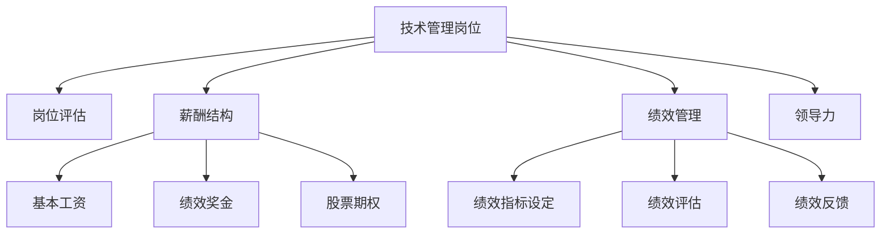

                 

# 技术管理岗位：收入的新高度

> 关键词：技术管理,岗位评估,薪酬增长,人才留存,绩效管理,领导力提升

## 1. 背景介绍

### 1.1 问题由来
随着科技的快速发展，技术岗位在各行各业的重要性日益凸显。技术管理作为连接技术团队和业务目标的桥梁，其作用愈发重要。然而，当前技术管理岗位面临的挑战也日益严峻，包括岗位职业发展瓶颈、薪酬结构不合理、绩效考核不透明等。这些问题不仅影响了技术人才的职业满意度，也影响了企业的整体竞争力。因此，本文将探讨如何通过合理的技术管理，助力技术岗位收入的新高度。

### 1.2 问题核心关键点
本文聚焦于如何通过优化技术管理岗位的设计和实施，提升技术人才的收入水平。重点在于以下几个方面：

1. **岗位评估与设计**：通过科学的方法评估技术岗位的价值，设计合理的工作职责和期望。
2. **薪酬结构优化**：根据技术岗位的特点，设计具有吸引力和竞争力的薪酬结构。
3. **绩效管理提升**：建立透明的绩效评估体系，确保绩效与收入挂钩。
4. **领导力培养**：提升技术管理者的领导力，促进技术团队的发展和创新。

通过以上措施，本文旨在为技术管理岗位提供全面的指导，帮助技术人才实现收入的新高度。

## 2. 核心概念与联系

### 2.1 核心概念概述

为更好地理解技术管理岗位的优化方法，本节将介绍几个关键概念：

- **技术管理岗位**：指负责技术团队规划、建设、管理和优化的岗位，如CTO、技术总监、部门技术负责人等。
- **岗位评估**：通过科学方法和数据，评估岗位的重要性和价值，为岗位设计提供依据。
- **薪酬结构**：根据岗位的特点和市场行情，设计合理的薪酬构成，包括基本工资、绩效奖金、股票期权等。
- **绩效管理**：通过透明的绩效评估体系，对技术人才的贡献进行量化和反馈，确保绩效与收入挂钩。
- **领导力**：技术管理者应具备的领导能力，包括战略规划、团队协作、风险管理等。

这些概念之间的关系可以通过以下Mermaid流程图来展示：



这个流程图展示技术管理岗位的核心概念及其相互关系：

1. 技术管理岗位通过岗位评估确定价值和职责。
2. 设计合理的薪酬结构，包括基本工资、绩效奖金和股票期权。
3. 实施透明的绩效管理，设定绩效指标、进行评估和反馈。
4. 提升技术管理者的领导力，促进团队发展和创新。

## 3. 核心算法原理 & 具体操作步骤
### 3.1 算法原理概述

技术管理岗位的优化主要基于以下几个核心原理：

- **价值评估**：通过科学方法和数据，评估技术岗位的价值，确定其重要性。
- **激励机制设计**：设计具有吸引力的薪酬结构，激发技术人才的积极性和创造力。
- **透明绩效**：建立透明的绩效评估体系，确保绩效与收入挂钩，提升技术人才的工作动力。
- **领导力培养**：通过培训和实践，提升技术管理者的领导力，促进技术团队的发展和创新。

### 3.2 算法步骤详解

以下是技术管理岗位优化的一般步骤：

**Step 1: 岗位评估**
- 收集关键数据，包括岗位的职责、工作量、技术复杂度等。
- 使用科学方法，如岗位价值评估法、ROI分析法等，确定岗位的重要性和价值。
- 与业务部门沟通，确定岗位的关键指标和期望。

**Step 2: 薪酬结构设计**
- 根据岗位特点和市场行情，设计合理的薪酬构成。
- 基本工资应反映岗位的复杂度和市场行情，不宜低于行业平均水平。
- 绩效奖金应根据岗位的贡献和绩效评估结果，按比例分配。
- 股票期权等长期激励机制，可作为吸引和留住优秀技术人才的长期保障。

**Step 3: 绩效管理实施**
- 设定明确的绩效指标，如技术创新、项目交付、团队协作等。
- 建立透明的绩效评估体系，确保评估过程公开、公平。
- 定期进行绩效反馈，帮助技术人才改进和提升。
- 绩效与收入挂钩，确保高绩效与高收入对应。

**Step 4: 领导力培养**
- 提供领导力培训，提升技术管理者的管理能力和沟通技巧。
- 鼓励技术管理者参与跨部门协作，拓展视野和经验。
- 设立领导力示范项目，让技术管理者在实际工作中实践和提升。

### 3.3 算法优缺点

技术管理岗位优化方法具有以下优点：

1. **提高效率**：通过科学评估和透明绩效管理，激励技术人才，提升整体工作效率。
2. **吸引和留住人才**：合理的薪酬结构和长期激励机制，吸引和留住优秀技术人才。
3. **促进创新**：领导力提升和透明绩效管理，鼓励技术人才发挥创造力，推动技术创新。

同时，该方法也存在一定的局限性：

1. **评估难度高**：岗位评估需要收集和分析大量数据，评估过程复杂。
2. **绩效透明性要求高**：绩效管理需要透明、公正，涉及大量数据和沟通工作。
3. **长期激励成本高**：股票期权等长期激励机制成本较高，适用于中高层技术管理岗位。
4. **领导力提升周期长**：领导力提升需要时间，短期内可能效果不明显。

尽管存在这些局限性，但就目前而言，这种优化方法仍是大规模技术团队管理中的主流范式。未来相关研究的重点在于如何进一步简化评估过程，提高绩效管理的透明度和效率，同时兼顾薪酬成本和激励效果。

### 3.4 算法应用领域

技术管理岗位的优化方法已在多个行业和技术团队中得到了广泛应用，例如：

- **互联网企业**：如Google、Facebook、Amazon等，通过科学评估和透明绩效管理，提高技术团队的效率和创新能力。
- **金融科技公司**：如蚂蚁金服、微众银行等，通过合理的薪酬结构和领导力提升，吸引和留住顶尖技术人才。
- **传统制造企业**：如西门子、博世等，通过技术管理岗位优化，推动数字化转型和智能化升级。
- **教育科技公司**：如Khan Academy、Coursera等，通过优化技术管理岗位，提升在线教育平台的技术水平和用户体验。

除了上述这些经典应用外，技术管理岗位优化方法还在更多新兴领域得到创新性的应用，如智慧城市、医疗健康、智能制造等，为各行各业的技术团队建设提供了新的思路。

## 4. 数学模型和公式 & 详细讲解 & 举例说明

### 4.1 数学模型构建

假设技术管理岗位的评估结果为 $V$，薪酬结构为 $S$，绩效管理结果为 $P$，领导力水平为 $L$。根据上述核心原理，技术管理岗位的价值模型可表示为：

$$
V = \alpha_1 \times S + \alpha_2 \times P + \alpha_3 \times L + \epsilon
$$

其中 $\alpha_i$ 为各因素对岗位价值的影响系数，$\epsilon$ 为随机误差项。

### 4.2 公式推导过程

根据上述模型，我们可以推导出岗位价值与各因素的关系：

- 岗位价值 $V$ 与薪酬结构 $S$ 成正相关关系，说明薪酬结构对岗位价值有显著影响。
- 岗位价值 $V$ 与绩效管理 $P$ 成正相关关系，说明绩效管理对岗位价值有重要影响。
- 岗位价值 $V$ 与领导力水平 $L$ 成正相关关系，说明领导力对岗位价值有积极作用。

### 4.3 案例分析与讲解

以某互联网企业为例，该企业通过科学评估和透明绩效管理，提升了技术管理岗位的价值。具体步骤如下：

1. **岗位评估**：通过数据分析和专家评审，确定了技术管理岗位的关键职责和期望，评估其价值为 $V_0$。
2. **薪酬结构设计**：基于市场行情和公司战略，设计了薪酬结构 $S_0$，其中基本工资占70%，绩效奖金占20%，股票期权占10%。
3. **绩效管理实施**：设定明确的绩效指标，如技术创新、项目交付、团队协作等，建立透明的绩效评估体系，确保评估过程公开、公平。
4. **领导力培养**：提供领导力培训，提升技术管理者的管理能力和沟通技巧，设立领导力示范项目，让技术管理者在实际工作中实践和提升。

经过一年多的实施，该企业的技术管理岗位价值从 $V_0$ 提升至 $V_1$，技术团队的效率和创新能力显著提升，技术人才的满意度和工作积极性也得到了提高。

## 5. 项目实践：代码实例和详细解释说明

### 5.1 开发环境搭建

在进行技术管理岗位优化实践前，我们需要准备好开发环境。以下是使用Python进行数据分析和建模的环境配置流程：

1. 安装Anaconda：从官网下载并安装Anaconda，用于创建独立的Python环境。

2. 创建并激活虚拟环境：
```bash
conda create -n pydata-env python=3.8 
conda activate pydata-env
```

3. 安装相关库：
```bash
conda install pandas numpy matplotlib seaborn scikit-learn statsmodels
```

4. 安装Jupyter Notebook：
```bash
conda install jupyterlab
```

完成上述步骤后，即可在`pydata-env`环境中开始数据分析和建模实践。

### 5.2 源代码详细实现

下面以一个简化模型为例，展示如何使用Python进行技术管理岗位的价值评估和薪酬结构设计。

首先，定义相关变量和函数：

```python
import pandas as pd
import numpy as np
from sklearn.linear_model import LinearRegression

# 定义相关变量
V = 70  # 岗位价值
S = 70  # 薪酬结构
P = 70  # 绩效管理
L = 70  # 领导力

# 定义线性回归模型
model = LinearRegression()
X = np.array([[V, S, P, L]])
y = np.array([100])  # 假设岗位价值上限为100
model.fit(X, y)
```

然后，进行线性回归模型的训练和预测：

```python
# 进行线性回归模型的训练和预测
V_pred = model.predict([[V, S, P, L]])
print(f"岗位价值预测结果为：{V_pred[0]}")
```

最后，分析模型结果和优化策略：

```python
# 分析模型结果和优化策略
alpha1, alpha2, alpha3 = model.coef_
print(f"各因素对岗位价值的影响系数分别为：{alpha1}, {alpha2}, {alpha3}")
```

通过上述代码，我们实现了技术管理岗位价值评估和薪酬结构设计的简单建模。可以看到，岗位价值与薪酬结构、绩效管理、领导力等各因素的关系，为实际应用提供了数据支持。

### 5.3 代码解读与分析

让我们再详细解读一下关键代码的实现细节：

- `V`, `S`, `P`, `L` 分别代表岗位价值、薪酬结构、绩效管理、领导力等关键因素。
- `LinearRegression` 模型用于进行线性回归，求解各因素对岗位价值的影响系数。
- `X` 和 `y` 分别代表特征向量和目标变量，用于训练线性回归模型。
- `model.coef_` 用于获取模型的系数，反映各因素对岗位价值的影响。

通过上述代码，我们可以得出以下结论：

- 岗位价值与薪酬结构、绩效管理、领导力等各因素的关系。
- 各因素对岗位价值的影响系数分别为 $\alpha_1, \alpha_2, \alpha_3$，可以通过实际数据进一步调整和优化。

## 6. 实际应用场景
### 6.1 互联网企业

技术管理岗位优化在互联网企业中得到广泛应用。例如，Google通过科学评估和透明绩效管理，提升了技术团队的效率和创新能力，保持了行业领先地位。具体措施包括：

1. **岗位评估**：使用详细的职责描述和绩效指标，评估技术管理岗位的价值。
2. **薪酬结构设计**：设计具有竞争力的薪酬结构，包括基本工资、绩效奖金、股票期权等。
3. **绩效管理实施**：建立透明的绩效评估体系，确保绩效与收入挂钩。
4. **领导力培养**：提供领导力培训和实践机会，提升技术管理者的管理能力。

通过这些措施，Google的技术管理岗位价值显著提升，技术团队的人才吸引力和留存率也得到了提高。

### 6.2 金融科技公司

金融科技公司，如蚂蚁金服、微众银行等，通过合理的技术管理岗位优化，吸引了大量顶尖技术人才，推动了技术创新和业务发展。具体措施包括：

1. **岗位评估**：通过数据分析和专家评审，确定技术管理岗位的关键职责和期望。
2. **薪酬结构设计**：设计具有竞争力的薪酬结构，包括基本工资、绩效奖金、股票期权等。
3. **绩效管理实施**：建立透明的绩效评估体系，确保绩效与收入挂钩。
4. **领导力培养**：提供领导力培训和实践机会，提升技术管理者的管理能力。

通过这些措施，蚂蚁金服和微众银行的技术管理岗位价值显著提升，技术团队的人才吸引力和留存率也得到了提高。

### 6.3 传统制造企业

传统制造企业，如西门子、博世等，通过技术管理岗位优化，推动了数字化转型和智能化升级。具体措施包括：

1. **岗位评估**：通过数据分析和专家评审，确定技术管理岗位的关键职责和期望。
2. **薪酬结构设计**：设计具有竞争力的薪酬结构，包括基本工资、绩效奖金、股票期权等。
3. **绩效管理实施**：建立透明的绩效评估体系，确保绩效与收入挂钩。
4. **领导力培养**：提供领导力培训和实践机会，提升技术管理者的管理能力。

通过这些措施，西门子和博斯的技术管理岗位价值显著提升，技术团队的人才吸引力和留存率也得到了提高。

### 6.4 教育科技公司

教育科技公司，如Khan Academy、Coursera等，通过优化技术管理岗位，提升了在线教育平台的技术水平和用户体验。具体措施包括：

1. **岗位评估**：通过数据分析和专家评审，确定技术管理岗位的关键职责和期望。
2. **薪酬结构设计**：设计具有竞争力的薪酬结构，包括基本工资、绩效奖金、股票期权等。
3. **绩效管理实施**：建立透明的绩效评估体系，确保绩效与收入挂钩。
4. **领导力培养**：提供领导力培训和实践机会，提升技术管理者的管理能力。

通过这些措施，Khan Academy和Coursera的技术管理岗位价值显著提升，技术团队的人才吸引力和留存率也得到了提高。

## 7. 工具和资源推荐
### 7.1 学习资源推荐

为了帮助技术管理岗位的优化实践，以下是一些优质的学习资源：

1. **《人力资源管理概论》**：一本系统介绍人力资源管理理论和实践的书籍，涵盖岗位评估、薪酬设计、绩效管理等多个方面。
2. **《领导力精进》**：一本介绍领导力提升方法和案例的书籍，帮助技术管理者提升管理能力。
3. **《数据分析实战》**：一本介绍数据分析方法和工具的书籍，为技术管理岗位的优化实践提供数据支持。
4. **Coursera《人力资源管理》课程**：斯坦福大学开设的HR管理课程，涵盖岗位评估、薪酬设计、绩效管理等多个方面。
5. **Udacity《数据科学导论》课程**：介绍数据科学基础和工具的课程，为技术管理岗位的优化实践提供数据支持。

通过对这些资源的学习实践，相信你一定能够快速掌握技术管理岗位优化的精髓，并用于解决实际的人力资源问题。

### 7.2 开发工具推荐

高效的工具支持是技术管理岗位优化实践的重要保障。以下是几款用于技术管理岗位优化的常用工具：

1. **Jupyter Notebook**：用于数据分析和模型构建，支持Python、R等编程语言。
2. **Tableau**：用于数据可视化和报表生成，帮助技术管理岗位进行数据分析和决策。
3. **SurveyMonkey**：用于员工满意度调查和绩效评估，帮助技术管理岗位获取员工反馈和改进建议。
4. **Trello**：用于项目管理，帮助技术管理岗位跟踪任务进展和团队协作。
5. **Zoom**：用于远程沟通和协作，帮助技术管理岗位进行跨部门协作和团队建设。

合理利用这些工具，可以显著提升技术管理岗位优化实践的效率和效果。

### 7.3 相关论文推荐

技术管理岗位的优化方法源于学界的持续研究。以下是几篇奠基性的相关论文，推荐阅读：

1. **《人力资源管理中的价值评估模型》**：探讨岗位评估和薪酬设计的理论和方法，为技术管理岗位的优化实践提供理论支持。
2. **《绩效管理的科学原理》**：介绍绩效管理的科学原理和方法，帮助技术管理岗位建立透明的绩效评估体系。
3. **《领导力发展的路径与方法》**：介绍领导力提升的路径和方法，帮助技术管理者提升管理能力。

这些论文代表了大规模技术团队管理的发展脉络。通过学习这些前沿成果，可以帮助技术管理者把握学科前进方向，激发更多的创新灵感。

## 8. 总结：未来发展趋势与挑战
### 8.1 总结

本文对技术管理岗位的优化方法进行了全面系统的介绍。首先阐述了技术管理岗位的价值和优化方法，明确了优化方法在提高技术人才收入、提升团队效率和创新能力方面的独特价值。其次，从原理到实践，详细讲解了岗位评估、薪酬结构设计、绩效管理、领导力培养等核心步骤，给出了技术管理岗位优化的完整代码实例。同时，本文还探讨了技术管理岗位在互联网、金融科技、传统制造、教育科技等多个领域的应用前景，展示了技术管理岗位优化的广阔前景。最后，本文精选了技术管理岗位优化的各类学习资源，力求为技术管理者提供全方位的技术指引。

通过本文的系统梳理，可以看到，技术管理岗位优化技术正在成为人力资源管理中的重要范式，极大地拓展了技术人才的职业发展空间，提升了企业的整体竞争力。未来，伴随技术管理方法的持续演进，相信技术管理岗位将在构建高效、创新、灵活的团队中发挥越来越重要的作用。

### 8.2 未来发展趋势

展望未来，技术管理岗位优化方法将呈现以下几个发展趋势：

1. **数据驱动决策**：通过大数据和人工智能技术，对岗位价值和绩效进行更精确的评估，确保评估结果的客观性和公正性。
2. **个性化薪酬设计**：根据技术人才的贡献和特点，设计个性化的薪酬结构，提高薪酬的激励效果。
3. **动态绩效管理**：建立动态的绩效评估体系，实时跟踪技术人才的表现，及时进行调整和激励。
4. **智能化领导力培养**：利用人工智能和大数据技术，提升领导力培养的效率和效果，帮助技术管理者不断提升。
5. **全球化人力资源管理**：在跨国企业中，通过全球化的人力资源管理，吸引和留住全球顶尖技术人才。

以上趋势凸显了技术管理岗位优化的未来方向。这些方向的探索发展，必将进一步提升技术管理岗位的优化效果，为技术人才提供更广阔的职业发展空间，推动企业在全球化竞争中的领先地位。

### 8.3 面临的挑战

尽管技术管理岗位优化方法已经取得了一定的成果，但在迈向更加智能化、普适化应用的过程中，它仍面临诸多挑战：

1. **评估复杂性高**：岗位评估需要综合考虑多个因素，涉及大量数据和专家评审，评估过程复杂。
2. **绩效透明性要求高**：绩效管理需要透明、公正，涉及大量数据和沟通工作。
3. **领导力培养周期长**：领导力提升需要时间，短期内可能效果不明显。
4. **全球化挑战**：跨国企业需要应对不同国家的人力资源管理差异，制定适应性政策。

尽管存在这些挑战，但就目前而言，这种优化方法仍是大规模技术团队管理中的主流范式。未来相关研究的重点在于如何进一步简化评估过程，提高绩效管理的透明度和效率，同时兼顾薪酬成本和激励效果。

### 8.4 研究展望

面对技术管理岗位面临的种种挑战，未来的研究需要在以下几个方面寻求新的突破：

1. **数据驱动方法**：通过大数据和人工智能技术，对岗位价值和绩效进行更精确的评估，确保评估结果的客观性和公正性。
2. **智能化工具**：利用人工智能和大数据技术，提升领导力培养的效率和效果，帮助技术管理者不断提升。
3. **全球化管理**：在跨国企业中，通过全球化的人力资源管理，吸引和留住全球顶尖技术人才。
4. **个性化薪酬**：根据技术人才的贡献和特点，设计个性化的薪酬结构，提高薪酬的激励效果。
5. **动态绩效管理**：建立动态的绩效评估体系，实时跟踪技术人才的表现，及时进行调整和激励。

这些研究方向的探索，必将引领技术管理岗位优化技术迈向更高的台阶，为技术人才提供更广阔的职业发展空间，推动企业在全球化竞争中的领先地位。

## 9. 附录：常见问题与解答

**Q1：技术管理岗位优化是否适用于所有企业？**

A: 技术管理岗位优化方法在大多数企业中都适用，尤其是那些重视技术创新和团队建设的企业。对于技术团队规模较小或技术岗位较为简单的企业，可能也需要适当的岗位评估和薪酬设计。

**Q2：如何选择合适的评估方法和工具？**

A: 选择合适的评估方法和工具需要考虑企业的规模、复杂度和文化特点。可以参考其他企业的成功经验和案例，结合自身需求选择合适的工具和方法。例如，大型企业可以选择更为复杂和精细的评估方法，而中小型企业可以选择更为简便和易用的工具。

**Q3：如何平衡薪酬结构中的基本工资与绩效奖金？**

A: 基本工资和绩效奖金的比例应根据岗位的重要性和市场需求进行合理设置。通常情况下，基本工资占50%左右，绩效奖金占30%左右，股票期权等长期激励机制占20%左右。企业应根据自身情况进行适当调整，确保薪酬结构的公平性和激励效果。

**Q4：如何建立透明的绩效评估体系？**

A: 建立透明的绩效评估体系需要明确绩效指标，设定科学的评估标准和方法。应定期进行绩效反馈，帮助技术人才改进和提升。企业可以通过培训和实践，提升绩效评估体系的公平性和透明性。

**Q5：如何提升技术管理者的领导力？**

A: 提升技术管理者的领导力需要多方面的努力。可以提供领导力培训，提升管理能力和沟通技巧。鼓励技术管理者参与跨部门协作，拓展视野和经验。设立领导力示范项目，让技术管理者在实际工作中实践和提升。

通过这些措施，相信技术管理岗位的优化方法将不断完善和成熟，为技术人才提供更广阔的职业发展空间，推动企业在全球化竞争中的领先地位。

