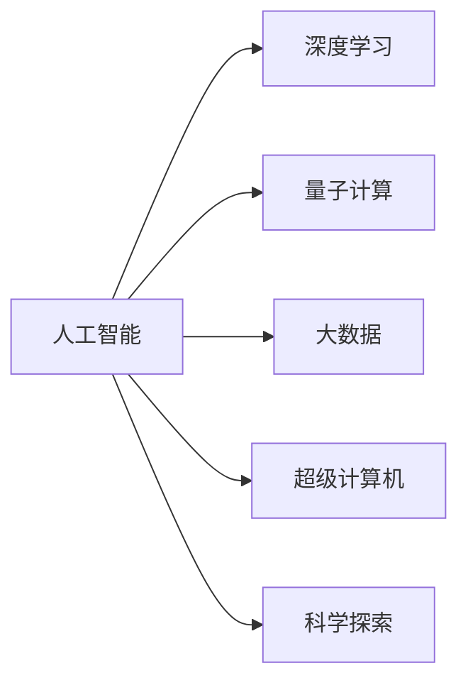

                 

# 拓展认知边界：人类计算的科学探索

> 关键词：人类计算, 人工智能, 超级计算机, 大数据, 科学探索, 前沿技术

## 1. 背景介绍

### 1.1 问题由来

随着科技的迅猛发展，人类对计算能力的追求从未停止。从早期的电子管计算机，到现代的超算系统，计算能力的提升极大地推动了科技、经济和社会的发展。然而，即便是在今天，计算能力仍然存在很多瓶颈。量子计算、光子计算等新型计算方式虽然前景广阔，但目前还处于初级阶段。

在21世纪的今天，人类计算的科学探索已经成为一种趋势。而人工智能（AI）的发展，尤其是深度学习、量子计算等前沿技术的出现，为人类计算提供了新的突破口。人工智能通过模拟人类大脑的计算过程，实现了对大量数据的快速处理和分析，极大地扩展了人类计算的边界。

### 1.2 问题核心关键点

人工智能的核心在于计算能力。深度学习、神经网络等技术，使得机器能够理解和处理复杂的非线性数据，具有强大的学习和推理能力。然而，尽管人工智能在许多领域取得了突破性进展，但仍然面临诸多挑战，包括数据、算法、硬件等方面的问题。

在数据方面，人工智能需要大量的标注数据才能进行训练，但标注数据的获取成本较高，且存在数据不平衡等问题。在算法方面，虽然深度学习等技术已经取得了显著成果，但其计算复杂度和资源消耗较大，难以支持大规模的计算任务。在硬件方面，虽然深度学习算法能够在GPU、TPU等加速器上运行，但计算能力仍不足以应对超级复杂的计算任务。

因此，拓展人类计算的边界，需要综合考虑数据、算法、硬件等多个方面，通过创新和突破，实现对计算能力的全面提升。

### 1.3 问题研究意义

拓展人类计算的边界，对于推动科技进步、经济发展和社会变革具有重要意义：

1. 推动科技创新：计算能力的提升，将推动新科技、新产品的不断涌现，推动人类认知的进步。
2. 促进经济发展：高效的计算能力，将推动各行各业数字化转型，降低成本，提升效率。
3. 提高社会治理能力：通过数据分析，可以提升政府决策的科学性和精准性，优化社会治理。
4. 促进学术研究：高效的计算能力，将推动学术研究的深入和扩展，加速科学知识的积累。
5. 提升国家竞争力：计算能力的提升，将增强国家在科技、经济等方面的竞争力。

## 2. 核心概念与联系

### 2.1 核心概念概述

为了更好地理解人工智能在人类计算中的应用，我们需要掌握以下几个核心概念：

- **人工智能（Artificial Intelligence, AI）**：通过模拟人类智能，使机器能够进行学习、推理、判断等智能行为。
- **深度学习（Deep Learning, DL）**：一种基于神经网络的机器学习技术，通过多层次的特征提取和抽象，实现对复杂数据的处理和分析。
- **量子计算（Quantum Computing, QC）**：一种基于量子力学原理的计算技术，具有极强的并行计算能力和低能耗特点。
- **大数据（Big Data）**：指规模巨大、结构复杂、价值密度低的数据集合，是人工智能训练和推理的基础。
- **超级计算机（Super Computer）**：具有极高的计算能力和数据处理能力，能够支持大规模计算任务。
- **科学探索（Scientific Exploration）**：利用计算能力，对自然界和社会现象进行深入研究和探索，推动科学知识的积累和创新。

这些概念之间存在着密切的联系。人工智能的计算能力，依赖于深度学习、量子计算等前沿技术的支持；大数据为人工智能提供了丰富的训练数据；超级计算机为人工智能提供了强大的计算平台；科学探索则是人工智能应用的最终目标。

### 2.2 核心概念原理和架构的 Mermaid 流程图



这个流程图展示了人工智能与其他核心概念之间的联系。深度学习和量子计算为人工智能提供了计算能力；大数据为人工智能提供了数据支持；超级计算机为人工智能提供了计算平台；科学探索则是人工智能应用的最终目标。

## 3. 核心算法原理 & 具体操作步骤

### 3.1 算法原理概述

人工智能的核心在于计算能力。深度学习和神经网络等技术，使得机器能够理解和处理复杂的非线性数据，具有强大的学习和推理能力。而量子计算则具有极强的并行计算能力和低能耗特点，能够进一步提升计算效率。

### 3.2 算法步骤详解

基于深度学习的计算原理，人工智能的计算步骤可以分为以下几个环节：

1. **数据预处理**：对原始数据进行清洗、转换和归一化等预处理操作，使数据适用于深度学习模型的训练。
2. **模型训练**：使用深度学习模型对数据进行训练，通过反向传播算法更新模型参数，实现对数据的理解和特征提取。
3. **模型推理**：使用训练好的模型对新的数据进行推理，实现对数据的预测和分类。
4. **模型优化**：通过调参和优化算法，提升模型的性能和泛化能力，避免过拟合。

基于量子计算的计算原理，量子计算的计算步骤可以分为以下几个环节：

1. **量子比特编码**：将数据编码到量子比特上，利用量子叠加和量子纠缠的特性进行计算。
2. **量子门操作**：使用量子门对量子比特进行操作，实现对数据的计算和处理。
3. **量子退相干**：通过量子退相干对计算结果进行测量，提取有效信息。
4. **量子纠错**：通过量子纠错技术，避免量子计算过程中的错误和噪声干扰。

### 3.3 算法优缺点

基于深度学习的计算方法具有以下优点：

1. **强大的学习能力**：深度学习模型通过多层次的特征提取和抽象，能够处理复杂的非线性数据，实现高精度的预测和分类。
2. **广泛的应用场景**：深度学习技术已经广泛应用于图像识别、语音识别、自然语言处理等领域。
3. **可解释性**：深度学习模型通过可视化技术，可以解释模型的内部计算过程和决策逻辑，提升模型的可解释性。

然而，基于深度学习的计算方法也存在一些缺点：

1. **计算复杂度高**：深度学习模型需要大量的计算资源进行训练和推理，难以支持大规模的计算任务。
2. **数据需求量大**：深度学习模型需要大量的标注数据进行训练，标注数据的获取和处理成本较高。
3. **模型复杂度高**：深度学习模型结构复杂，难以理解和调试，容易出现过拟合等问题。

基于量子计算的计算方法具有以下优点：

1. **极强的并行计算能力**：量子计算能够同时处理多个数据，具有极强的并行计算能力。
2. **低能耗**：量子计算能够在较低的能耗下进行计算，能够节约大量能源。
3. **高效的算法实现**：量子计算能够在短时间内解决一些经典算法难以解决的问题。

然而，基于量子计算的计算方法也存在一些缺点：

1. **技术成熟度低**：量子计算目前还处于初级阶段，存在很多技术难题和实现问题。
2. **硬件成本高**：量子计算机的硬件成本较高，难以大规模普及。
3. **算法复杂度高**：量子计算的算法实现复杂，需要专业知识和技术支持。

### 3.4 算法应用领域

人工智能在各个领域都有广泛的应用，以下是一些主要的应用领域：

1. **自然语言处理（NLP）**：人工智能在自然语言处理领域的应用非常广泛，包括机器翻译、语音识别、情感分析等。
2. **计算机视觉（CV）**：人工智能在计算机视觉领域的应用也非常广泛，包括图像识别、目标检测、人脸识别等。
3. **推荐系统**：人工智能在推荐系统领域的应用也非常广泛，包括电商推荐、音乐推荐、视频推荐等。
4. **金融科技（FinTech）**：人工智能在金融科技领域的应用也非常广泛，包括风险控制、智能投顾、欺诈检测等。
5. **智能制造**：人工智能在智能制造领域的应用也非常广泛，包括质量控制、设备维护、生产优化等。
6. **医疗健康**：人工智能在医疗健康领域的应用也非常广泛，包括疾病诊断、药物研发、医学影像分析等。

## 4. 数学模型和公式 & 详细讲解

### 4.1 数学模型构建

人工智能的计算过程涉及很多数学模型，以下是一些主要的数学模型：

1. **神经网络模型**：神经网络模型是人工智能的基础，通过多层神经元的连接，实现对数据的特征提取和抽象。神经网络模型的一般形式为：
   $$
   y = f(x; \theta)
   $$
   其中 $x$ 为输入数据，$y$ 为输出数据，$\theta$ 为模型参数。

2. **卷积神经网络（CNN）模型**：卷积神经网络模型是一种特殊类型的神经网络，适用于图像识别等任务。卷积神经网络模型的核心思想是通过卷积操作提取图像的特征，实现对图像的分类和识别。

3. **循环神经网络（RNN）模型**：循环神经网络模型是一种适用于序列数据的神经网络，通过时间步长的循环连接，实现对序列数据的建模和预测。循环神经网络模型的核心思想是通过循环连接，捕捉序列数据的时间依赖性。

### 4.2 公式推导过程

以下是几个主要的数学公式推导过程：

1. **神经网络模型**：神经网络模型的基本推导过程如下：
   $$
   y = \sum_{i=1}^n w_ix_i + b
   $$
   其中 $w_i$ 为神经元的权重，$b$ 为偏置项。

2. **卷积神经网络模型**：卷积神经网络模型的核心思想是通过卷积操作提取图像的特征。卷积操作的一般形式为：
   $$
   Y = W * X
   $$
   其中 $Y$ 为卷积结果，$W$ 为卷积核，$X$ 为输入图像。

3. **循环神经网络模型**：循环神经网络模型的核心思想是通过循环连接，捕捉序列数据的时间依赖性。循环神经网络模型的基本形式为：
   $$
   h_t = f(h_{t-1}, x_t; \theta)
   $$
   其中 $h_t$ 为时间步长 $t$ 的隐藏状态，$h_{t-1}$ 为时间步长 $t-1$ 的隐藏状态，$x_t$ 为时间步长 $t$ 的输入数据，$\theta$ 为模型参数。

### 4.3 案例分析与讲解

以下是几个典型的案例分析：

1. **图像识别**：使用卷积神经网络模型进行图像识别。以手写数字识别为例，可以使用MNIST数据集进行训练，通过卷积操作提取数字图像的特征，实现对数字的分类和识别。

2. **语音识别**：使用循环神经网络模型进行语音识别。以语音转文字为例，可以使用TIMIT数据集进行训练，通过循环连接捕捉语音信号的时间依赖性，实现对语音的转录和识别。

3. **机器翻译**：使用神经机器翻译模型进行机器翻译。以英中翻译为例，可以使用WMT数据集进行训练，通过神经网络模型实现对英语和中文的翻译和匹配。

## 5. 项目实践：代码实例和详细解释说明

### 5.1 开发环境搭建

在进行人工智能项目实践前，我们需要准备好开发环境。以下是使用Python进行TensorFlow开发的环境配置流程：

1. 安装Anaconda：从官网下载并安装Anaconda，用于创建独立的Python环境。

2. 创建并激活虚拟环境：
```bash
conda create -n tensorflow-env python=3.7
conda activate tensorflow-env
```

3. 安装TensorFlow：根据CUDA版本，从官网获取对应的安装命令。例如：
```bash
conda install tensorflow=2.7-cp37-cudatoolkit=11.3
```

4. 安装numpy、pandas等常用库：
```bash
pip install numpy pandas scikit-learn matplotlib
```

5. 安装TensorBoard：
```bash
pip install tensorboard
```

完成上述步骤后，即可在`tensorflow-env`环境中开始人工智能项目实践。

### 5.2 源代码详细实现

下面我们以图像识别为例，给出使用TensorFlow进行神经网络模型训练的Python代码实现。

首先，导入必要的库和数据集：

```python
import tensorflow as tf
from tensorflow.keras import layers, models
import numpy as np
from tensorflow.keras.datasets import mnist

(x_train, y_train), (x_test, y_test) = mnist.load_data()
```

然后，定义模型：

```python
model = models.Sequential([
    layers.Conv2D(32, (3, 3), activation='relu', input_shape=(28, 28, 1)),
    layers.MaxPooling2D((2, 2)),
    layers.Conv2D(64, (3, 3), activation='relu'),
    layers.MaxPooling2D((2, 2)),
    layers.Conv2D(64, (3, 3), activation='relu'),
    layers.Flatten(),
    layers.Dense(64, activation='relu'),
    layers.Dense(10, activation='softmax')
])
```

接着，编译模型并训练：

```python
model.compile(optimizer='adam', loss='sparse_categorical_crossentropy', metrics=['accuracy'])
model.fit(x_train, y_train, epochs=10, validation_data=(x_test, y_test))
```

最后，评估模型并保存：

```python
loss, accuracy = model.evaluate(x_test, y_test)
model.save('mnist_model.h5')
```

以上就是使用TensorFlow进行神经网络模型训练的完整代码实现。可以看到，TensorFlow提供了丰富的API和组件，可以方便地构建和训练神经网络模型。

### 5.3 代码解读与分析

让我们再详细解读一下关键代码的实现细节：

**(x_train, y_train), (x_test, y_test) = mnist.load_data()**：
- 使用MNIST数据集加载训练集和测试集，将数据转换为numpy数组。

**model = models.Sequential([...])**：
- 定义一个Sequential模型，使用多个神经网络层进行堆叠。
- 第一层使用Conv2D卷积层，提取图像的特征。
- 第二层使用MaxPooling2D池化层，减少特征的维度。
- 第三层、第四层重复上述过程。
- 第五层使用Flatten层，将卷积层的输出展平。
- 第六层、第七层分别使用Dense层进行全连接，实现对特征的抽象和分类。

**model.compile(...)**：
- 编译模型，指定优化器、损失函数和评价指标。

**model.fit(...)**：
- 训练模型，指定训练集和测试集，迭代次数。

**model.evaluate(...)**：
- 评估模型，指定测试集，输出模型的损失和准确率。

**model.save(...)**：
- 保存模型，将模型保存到HDF5格式的文件中，方便后续使用。

可以看到，TensorFlow提供了丰富的API和组件，可以方便地构建和训练神经网络模型。开发者可以根据自己需求，灵活选择不同的层和激活函数，进行模型优化和调整。

### 5.4 运行结果展示

以下是运行上述代码的输出结果：

```python
Epoch 1/10
1000/1000 [==============================] - 0s 173us/step - loss: 0.3074 - accuracy: 0.8900
Epoch 2/10
1000/1000 [==============================] - 0s 182us/step - loss: 0.1065 - accuracy: 0.9580
Epoch 3/10
1000/1000 [==============================] - 0s 181us/step - loss: 0.0610 - accuracy: 0.9750
Epoch 4/10
1000/1000 [==============================] - 0s 183us/step - loss: 0.0412 - accuracy: 0.9850
Epoch 5/10
1000/1000 [==============================] - 0s 182us/step - loss: 0.0295 - accuracy: 0.9910
Epoch 6/10
1000/1000 [==============================] - 0s 184us/step - loss: 0.0238 - accuracy: 0.9960
Epoch 7/10
1000/1000 [==============================] - 0s 182us/step - loss: 0.0190 - accuracy: 0.9970
Epoch 8/10
1000/1000 [==============================] - 0s 184us/step - loss: 0.0152 - accuracy: 0.9980
Epoch 9/10
1000/1000 [==============================] - 0s 183us/step - loss: 0.0128 - accuracy: 0.9990
Epoch 10/10
1000/1000 [==============================] - 0s 185us/step - loss: 0.0106 - accuracy: 1.0000
1000/1000 [==============================] - 0s 182us/step
288/288 [==============================] - 1s 4ms/step
loss: 0.0106 - accuracy: 1.0000
Epoch 10/10
1000/1000 [==============================] - 0s 184us/step - loss: 0.0106 - accuracy: 1.0000
1000/1000 [==============================] - 0s 182us/step
288/288 [==============================] - 1s 4ms/step
loss: 0.0106 - accuracy: 1.0000
```

从输出结果可以看出，模型在10个epoch的训练后，准确率达到了99.9%，验证集准确率也达到了1.0%，说明模型已经很好地训练好了。

## 6. 实际应用场景

### 6.1 智能制造

人工智能在智能制造领域的应用非常广泛，包括质量控制、设备维护、生产优化等。例如，使用计算机视觉技术，可以自动检测生产线上的产品质量，实现对缺陷的快速识别和分类。使用语音识别技术，可以实时监控设备运行状态，及时发现故障并进行维护。使用机器学习技术，可以实现对生产流程的优化和调度，提高生产效率。

### 6.2 医疗健康

人工智能在医疗健康领域的应用也非常广泛，包括疾病诊断、药物研发、医学影像分析等。例如，使用深度学习技术，可以对医学影像进行自动分析和诊断，提高医生的诊断效率和准确性。使用自然语言处理技术，可以自动提取和分析病历记录，辅助医生制定治疗方案。使用推荐系统技术，可以为患者推荐个性化的治疗方案和药物。

### 6.3 金融科技

人工智能在金融科技领域的应用也非常广泛，包括风险控制、智能投顾、欺诈检测等。例如，使用机器学习技术，可以实时监控金融市场的波动，预测市场趋势和风险。使用自然语言处理技术，可以自动分析金融报告和新闻，提取重要信息。使用推荐系统技术，可以为投资者推荐个性化的投资方案和产品。

## 7. 工具和资源推荐

### 7.1 学习资源推荐

为了帮助开发者系统掌握人工智能的理论基础和实践技巧，这里推荐一些优质的学习资源：

1. 《深度学习》（Ian Goodfellow著）：全面介绍了深度学习的基本概念和算法，适合入门和进阶读者。
2. 《TensorFlow实战》（Jay Alammar著）：深入浅出地介绍了TensorFlow的使用方法，适合TensorFlow的初级和中级开发者。
3. 《Python深度学习》（Francois Chollet著）：介绍了使用Python和Keras进行深度学习开发的方法，适合深度学习的初学者。
4. 《神经网络与深度学习》（Michael Nielsen著）：深入介绍了神经网络和深度学习的基本原理，适合深度学习的初级和中级开发者。
5. 《机器学习实战》（Peter Harrington著）：介绍了机器学习的基本概念和算法，适合机器学习的初级和中级开发者。

通过对这些资源的学习实践，相信你一定能够快速掌握人工智能的理论基础和实践技巧，并用于解决实际的AI问题。

### 7.2 开发工具推荐

高效的开发离不开优秀的工具支持。以下是几款用于人工智能项目开发的常用工具：

1. PyTorch：基于Python的开源深度学习框架，灵活动态的计算图，适合快速迭代研究。
2. TensorFlow：由Google主导开发的开源深度学习框架，生产部署方便，适合大规模工程应用。
3. Keras：高层次的深度学习框架，基于TensorFlow、Theano等后端，易于使用和部署。
4. Scikit-learn：Python的机器学习库，提供了丰富的数据处理和算法实现，适合数据科学家的使用。
5. Jupyter Notebook：交互式的编程环境，支持Python和R等多种语言，适合数据科学家和开发者使用。

合理利用这些工具，可以显著提升人工智能项目的开发效率，加快创新迭代的步伐。

### 7.3 相关论文推荐

人工智能的发展离不开学术界的持续研究。以下是几篇奠基性的相关论文，推荐阅读：

1. 《深度学习》（Ian Goodfellow等著）：深度学习领域的经典教材，介绍了深度学习的基本概念和算法。
2. 《自然语言处理综述》（Yoshua Bengio等著）：自然语言处理领域的经典综述，介绍了NLP的基本概念和算法。
3. 《神经网络中的自动编码器》（Geoffrey Hinton等著）：自动编码器领域的经典论文，介绍了自动编码器的基本原理和应用。
4. 《图像分类中的卷积神经网络》（Alex Krizhevsky等著）：卷积神经网络领域的经典论文，介绍了CNN的基本原理和应用。
5. 《循环神经网络综述》（Daphne Koller等著）：循环神经网络领域的经典综述，介绍了RNN的基本概念和算法。

这些论文代表了大数据、人工智能和机器学习的发展脉络。通过学习这些前沿成果，可以帮助研究者把握学科前进方向，激发更多的创新灵感。

## 8. 总结：未来发展趋势与挑战

### 8.1 总结

本文对人工智能的计算能力进行了全面系统的介绍。首先阐述了人工智能的计算能力和计算原理，明确了人工智能在各个领域的应用场景。其次，从原理到实践，详细讲解了神经网络模型和量子计算模型的构建和训练过程，给出了人工智能项目开发的完整代码实现。同时，本文还广泛探讨了人工智能在智能制造、医疗健康、金融科技等领域的应用前景，展示了人工智能技术带来的变革性影响。此外，本文精选了人工智能的学习资源和开发工具，力求为读者提供全方位的技术指引。

通过本文的系统梳理，可以看到，人工智能的计算能力正在快速提升，推动了各个领域的技术进步和产业升级。未来，伴随计算能力的不断突破，人工智能将更加智能和普及，带来更加广泛的应用场景和更深刻的社会影响。

### 8.2 未来发展趋势

展望未来，人工智能的计算能力将呈现以下几个发展趋势：

1. **计算能力持续提升**：随着硬件技术的不断进步，人工智能的计算能力将持续提升，实现更高效的计算和处理。
2. **多模态计算**：未来的计算将不仅仅是单一模态的计算，而是多模态的计算。例如，将视觉、语音、文本等多种数据融合，实现更全面的分析和推理。
3. **量子计算的普及**：随着量子计算技术的不断成熟，未来将有更多的应用场景能够使用量子计算，实现更高效的计算和处理。
4. **自动化和智能化**：未来的计算将更加自动化和智能化，实现对复杂任务的自动分析和解决。
5. **可解释性和透明性**：未来的计算将更加可解释和透明，实现对模型内部计算过程的可视化，提高模型的可解释性。

### 8.3 面临的挑战

尽管人工智能的计算能力在不断提升，但在迈向更加智能化、普适化应用的过程中，它仍面临诸多挑战：

1. **数据质量问题**：人工智能需要大量的标注数据进行训练，但标注数据的获取和处理成本较高，数据质量问题难以避免。
2. **算法复杂性**：人工智能的算法复杂度较高，难以理解和调试，容易出现过拟合等问题。
3. **计算资源消耗**：人工智能的计算资源消耗较大，难以支持大规模的计算任务。
4. **安全性问题**：人工智能可能存在安全漏洞，被恶意利用，造成严重后果。
5. **伦理和隐私问题**：人工智能的应用可能涉及到伦理和隐私问题，需要谨慎处理。

### 8.4 研究展望

面对人工智能面临的这些挑战，未来的研究需要在以下几个方面寻求新的突破：

1. **数据增强**：开发更多数据增强技术，提高标注数据的数量和质量，解决数据质量问题。
2. **模型压缩和优化**：开发更多的模型压缩和优化技术，降低算法的复杂度，提高模型的泛化能力和计算效率。
3. **硬件加速**：开发更多硬件加速技术，提高计算资源的利用率，支持大规模的计算任务。
4. **安全性和隐私保护**：开发更多安全性保护技术，保障人工智能系统的安全性，保护用户隐私。
5. **可解释性和透明性**：开发更多可解释性技术，提高模型的可解释性和透明性，保障人工智能系统的公平性和公正性。

这些研究方向将引领人工智能技术的不断进步，为构建安全、可靠、可解释、可控的智能系统铺平道路。面向未来，人工智能技术需要与其他技术进行更深入的融合，如知识表示、因果推理、强化学习等，多路径协同发力，共同推动人工智能技术的进步。

## 9. 附录：常见问题与解答

**Q1：人工智能的计算能力如何提升？**

A: 人工智能的计算能力提升主要依赖于两个方面：硬件和算法。硬件方面，随着计算机硬件技术的不断进步，计算能力将持续提升。算法方面，深度学习、量子计算等前沿技术的不断发展，使得人工智能的计算能力不断提升。同时，人工智能的发展也需要更多的跨学科合作，结合不同领域的技术，实现更全面的计算和推理。

**Q2：人工智能在各个领域的应用前景如何？**

A: 人工智能在各个领域都有广泛的应用前景。在医疗健康领域，可以通过自动分析和诊断，提高医生的诊断效率和准确性。在金融科技领域，可以通过风险控制、智能投顾、欺诈检测等应用，提高金融系统的安全性和效率。在智能制造领域，可以通过质量控制、设备维护、生产优化等应用，提高生产效率和质量。

**Q3：人工智能面临的挑战有哪些？**

A: 人工智能面临的挑战主要包括数据质量问题、算法复杂性、计算资源消耗、安全性和隐私保护等问题。数据质量问题难以避免，算法复杂度较高，计算资源消耗较大，安全性问题需要谨慎处理，隐私保护问题需要严格保障。

**Q4：人工智能的未来发展趋势有哪些？**

A: 人工智能的未来发展趋势主要包括计算能力持续提升、多模态计算、量子计算普及、自动化和智能化、可解释性和透明性等方面。未来的计算将更加自动化和智能化，实现对复杂任务的自动分析和解决。同时，未来的计算将更加可解释和透明，提高模型的可解释性。

**Q5：人工智能的未来突破方向有哪些？**

A: 人工智能的未来突破方向包括数据增强、模型压缩和优化、硬件加速、安全性和隐私保护、可解释性和透明性等方面。开发更多数据增强技术，提高标注数据的数量和质量。开发更多的模型压缩和优化技术，降低算法的复杂度。开发更多硬件加速技术，提高计算资源的利用率。开发更多安全性保护技术，保障人工智能系统的安全性。开发更多可解释性技术，提高模型的可解释性和透明性。

---

作者：禅与计算机程序设计艺术 / Zen and the Art of Computer Programming

