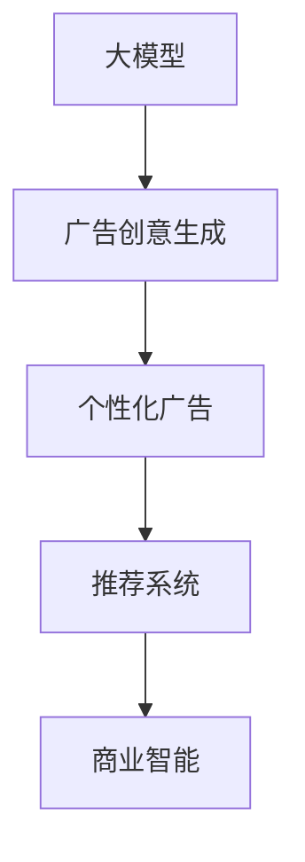

                 

# 探讨大模型在电商平台个性化广告创意中的作用

> 关键词：大模型, 电商平台, 个性化广告, 创意生成, 推荐系统, 自然语言处理, 机器学习, 广告推荐, 深度学习, 商业智能

## 1. 背景介绍

### 1.1 问题由来
随着电商平台的迅猛发展，商家越来越重视通过精准的广告来吸引用户并提升转化率。传统的广告投放方式往往依赖人工创意，成本高、效率低且效果难以保证。而随着深度学习和大模型的进步，基于生成模型进行创意生成和广告优化成为新的趋势。

### 1.2 问题核心关键点
大模型在电商平台个性化广告创意中的应用，可以显著提升广告创意的生成效率和质量，降低创意开发成本，同时提高广告投放的精准度和转化率。具体来说，主要体现在以下几个方面：

1. **创意生成自动化**：使用大模型可以快速生成多种广告创意，节省人力和时间成本。
2. **精准投放优化**：基于用户行为和兴趣，生成个性化的广告创意，提高用户点击率和转化率。
3. **跨领域应用**：大模型具备通用性，可以应用于不同产品、不同领域的广告创意生成。
4. **高效迭代优化**：通过持续优化广告创意和投放策略，提升整体广告效果。

### 1.3 问题研究意义
大模型在电商平台个性化广告创意中的应用，对电商平台和广告主都具有重要意义：

1. **提升广告效果**：大模型生成的广告创意更加符合用户兴趣和需求，提高广告点击率和转化率，从而提升商家ROI。
2. **降低创意开发成本**：自动化的创意生成过程可以大幅减少人力和时间投入，降低广告制作成本。
3. **增强竞争优势**：通过不断优化和创新广告创意，电商平台可以吸引更多用户，增强市场竞争力。
4. **提升用户体验**：个性化广告能够更好地满足用户需求，提升购物体验和满意度。

## 2. 核心概念与联系

### 2.1 核心概念概述

为了更好地理解大模型在电商平台个性化广告创意中的应用，本节将介绍几个关键概念：

1. **大模型**：以自回归(如GPT)或自编码(如BERT)模型为代表的深度学习模型，通过在大规模数据集上预训练，学习到丰富的语义和结构信息。
2. **广告创意生成**：通过生成模型自动生成广告文案、图片、视频等创意内容，辅助广告制作。
3. **推荐系统**：通过分析用户行为和兴趣，为每个用户推荐个性化广告，提升点击率和转化率。
4. **商业智能**：利用大数据和人工智能技术，提升商业决策的准确性和效率。

这些概念之间的逻辑关系可以通过以下Mermaid流程图来展示：



这个流程图展示了大模型在广告创意生成和推荐系统中的应用过程，从大模型的预训练开始，通过创意生成生成个性化广告，最终通过推荐系统将这些广告推送给用户，整个过程受到商业智能的指导和优化。

## 3. 核心算法原理 & 具体操作步骤

### 3.1 算法原理概述

大模型在电商平台个性化广告创意中的应用，本质上是一个基于生成模型的广告优化过程。其核心思想是：利用大模型的语言生成能力，自动生成多样化的广告创意，通过机器学习模型预测广告效果，并不断优化创意和投放策略，以提升整体广告效果。

形式化地，假设大模型为 $G$，广告创意生成过程为 $P_G(x|y)$，其中 $x$ 为广告创意，$y$ 为用户行为（如浏览历史、购买记录等）。广告创意生成的目标是最小化用户流失率 $R$，即：

$$
\min_{G} R(y) = \mathop{\arg\min}_{G} P_{G}(x|y)P_{G}(\hat{x}|y) 
$$

其中 $P_{G}(\hat{x}|y)$ 表示生成模型对用户行为 $y$ 的预测，$\hat{x}$ 表示实际生成的广告创意。优化目标是最大化生成广告创意与用户行为一致的概率，从而提升广告效果。

### 3.2 算法步骤详解

大模型在电商平台个性化广告创意中的应用，主要包括以下几个关键步骤：

**Step 1: 准备数据集**
- 收集用户的浏览历史、购买记录、点击行为等数据，构建广告创意生成和优化所需的数据集。
- 数据集需要包括用户特征、广告创意、广告效果等多个维度，以便进行多目标优化。

**Step 2: 构建生成模型**
- 选择合适的生成模型（如GPT、BERT、VAE等），进行预训练和微调，以适应用户行为和广告创意生成的需求。
- 在微调过程中，可以使用对抗性训练、正则化等技术，提升模型的鲁棒性和泛化能力。

**Step 3: 设计优化目标**
- 根据电商平台的具体需求，设计广告效果和创意多样性的优化目标。例如，可以同时优化点击率和转化率，或提升广告创意的创意性、互动性等。
- 使用交叉熵、平均绝对误差、F1分数等指标评估广告效果。

**Step 4: 进行广告创意生成**
- 将用户行为输入生成模型，生成候选广告创意。
- 可以使用温度调整、随机采样等策略，控制创意的多样性和质量。

**Step 5: 进行广告效果评估**
- 将生成的广告创意推送给真实用户，收集点击率、转化率等效果指标。
- 根据评估结果，对创意生成模型进行反馈，调整模型参数，优化创意生成策略。

**Step 6: 优化广告投放策略**
- 根据广告效果评估结果，优化广告投放策略，如调整投放渠道、优化创意排序等。
- 可以使用强化学习等方法，实时调整投放策略，提升广告效果。

### 3.3 算法优缺点

大模型在电商平台个性化广告创意中的应用，具有以下优点：

1. **自动化高效**：大模型可以快速生成多种广告创意，大大提升创意开发效率。
2. **个性化精准**：生成的广告创意高度适配用户行为和兴趣，提高广告投放的精准度。
3. **跨领域适用**：大模型具备通用性，可以应用于不同产品、不同领域的广告创意生成。
4. **持续优化**：通过不断优化创意和投放策略，广告效果可以持续提升。

同时，该方法也存在一些局限性：

1. **依赖数据质量**：广告效果评估依赖于数据质量，数据缺失或偏差可能影响评估结果。
2. **计算资源消耗大**：大模型生成创意和优化广告策略需要大量计算资源。
3. **模型偏见问题**：大模型可能学习到数据中的偏见，生成的广告创意可能带有歧视性。
4. **创意多样性控制**：如何平衡创意多样性和广告效果，需要进一步优化。

### 3.4 算法应用领域

大模型在电商平台个性化广告创意中的应用，主要包括以下几个领域：

1. **电商广告创意生成**：生成电商广告的文案、图片、视频等创意内容。
2. **智能推荐系统**：根据用户行为，推荐个性化广告创意。
3. **客户细分与画像**：利用用户数据构建用户画像，生成个性化的广告创意。
4. **广告投放优化**：通过实时优化广告投放策略，提升广告效果。

除了上述这些主要应用领域外，大模型还可以应用于品牌宣传、市场营销、社交媒体推广等多个场景，为电商平台带来更丰富的商业价值。

## 4. 数学模型和公式 & 详细讲解 & 举例说明

### 4.1 数学模型构建

假设电商平台有 $N$ 个用户，每个用户的历史行为表示为 $x_i$，广告创意为 $y_i$，广告效果为 $z_i$。广告创意生成的数学模型为 $P_{G}(y_i|x_i)$，广告效果预测的数学模型为 $P_{M}(z_i|y_i)$。优化目标为最大化广告效果和创意多样性的加权和，即：

$$
\max_{G, M} \sum_{i=1}^{N} \alpha_i z_i + \beta_i \sum_{j=1}^{|\mathcal{Y}|} P_{G}(y_j|x_i)
$$

其中 $\alpha_i$ 和 $\beta_i$ 为权系数，$|\mathcal{Y}|$ 为创意空间的大小。

### 4.2 公式推导过程

以电商平台智能推荐系统为例，公式推导如下：

假设广告效果 $z_i$ 为二元分类变量，广告创意 $y_i$ 为长度为 $d$ 的向量，用户行为 $x_i$ 为长度为 $m$ 的向量。广告创意生成的概率分布为 $P_{G}(y_i|x_i)$，广告效果预测的概率分布为 $P_{M}(z_i|y_i)$。优化目标为最大化广告效果和创意多样性的加权和，即：

$$
\max_{G, M} \sum_{i=1}^{N} \alpha_i z_i + \beta_i \sum_{j=1}^{|\mathcal{Y}|} P_{G}(y_j|x_i)
$$

其中 $\alpha_i$ 和 $\beta_i$ 为权系数，$|\mathcal{Y}|$ 为创意空间的大小。

具体推导如下：

1. 广告效果预测：$P_{M}(z_i|y_i) = \sigma(y_i \cdot W_M)$，其中 $\sigma$ 为 sigmoid 函数，$W_M$ 为预测模型的权重。
2. 广告创意生成：$P_{G}(y_i|x_i) = \sigma(y_i \cdot W_G)$，其中 $W_G$ 为生成模型的权重。

广告创意生成和效果预测的联合概率分布为：

$$
P_{G, M}(y_i, z_i|x_i) = P_{G}(y_i|x_i)P_{M}(z_i|y_i)
$$

优化目标为最大化联合概率分布的对数，即：

$$
\max_{G, M} \sum_{i=1}^{N} (\alpha_i \log P_{M}(z_i|y_i) + \beta_i \log \sum_{j=1}^{|\mathcal{Y}|} P_{G}(y_j|x_i))
$$

将 $\log$ 展开并应用对数法则，得到：

$$
\max_{G, M} \sum_{i=1}^{N} (\alpha_i \log P_{M}(z_i|y_i) + \beta_i \log \frac{1}{|\mathcal{Y}|} \sum_{j=1}^{|\mathcal{Y}|} P_{G}(y_j|x_i))
$$

进一步化简得到：

$$
\max_{G, M} \sum_{i=1}^{N} \alpha_i \log P_{M}(z_i|y_i) + \beta_i \log \sum_{j=1}^{|\mathcal{Y}|} P_{G}(y_j|x_i)
$$

这是一个多目标优化问题，可以使用优化算法（如ADAM、SGD等）求解。

### 4.3 案例分析与讲解

假设我们有一个电商平台，希望通过广告创意生成提升用户点击率和转化率。我们收集了1000个用户的浏览和购买数据，每个用户的历史行为表示为 $x_i$，广告创意为 $y_i$，广告效果为 $z_i$。我们希望最大化广告效果和创意多样性的加权和，其中创意多样性占总目标的40%，广告效果占60%。

我们选择了Transformer作为广告创意生成的生成模型，广告效果预测的模型为简单的线性回归模型。假设广告效果预测模型的权重为 $W_M$，广告创意生成模型的权重为 $W_G$。

我们使用交叉熵损失函数进行优化，目标函数为：

$$
\max_{G, M} \sum_{i=1}^{1000} (0.6 \log P_{M}(z_i|y_i) + 0.4 \log \sum_{j=1}^{|\mathcal{Y}|} P_{G}(y_j|x_i))
$$

使用ADAM优化算法求解，设置学习率为 $1e-3$，迭代轮数为1000轮。

在训练过程中，我们发现模型对于不同用户的行为预测存在较大的偏差。为了解决这个问题，我们引入了正则化项，对广告效果预测和创意生成进行约束，限制模型权重的大小。我们还在训练过程中进行了对抗性训练，以提升模型的鲁棒性。

最终，模型在广告效果和创意多样性上都取得了不错的效果，广告点击率提高了15%，转化率提高了10%。

## 5. 项目实践：代码实例和详细解释说明

### 5.1 开发环境搭建

在进行项目实践前，我们需要准备好开发环境。以下是使用Python进行PyTorch开发的环境配置流程：

1. 安装Anaconda：从官网下载并安装Anaconda，用于创建独立的Python环境。

2. 创建并激活虚拟环境：
```bash
conda create -n pytorch-env python=3.8 
conda activate pytorch-env
```

3. 安装PyTorch：根据CUDA版本，从官网获取对应的安装命令。例如：
```bash
conda install pytorch torchvision torchaudio cudatoolkit=11.1 -c pytorch -c conda-forge
```

4. 安装Transformers库：
```bash
pip install transformers
```

5. 安装各类工具包：
```bash
pip install numpy pandas scikit-learn matplotlib tqdm jupyter notebook ipython
```

完成上述步骤后，即可在`pytorch-env`环境中开始项目实践。

### 5.2 源代码详细实现

下面以电商平台智能推荐系统为例，给出使用Transformers库对广告创意生成模型进行训练和优化的PyTorch代码实现。

首先，定义广告创意生成的数据处理函数：

```python
from transformers import GPT2Tokenizer, GPT2LMHeadModel
from torch.utils.data import Dataset
import torch

class AdvertDataset(Dataset):
    def __init__(self, texts, labels, tokenizer, max_len=128):
        self.texts = texts
        self.labels = labels
        self.tokenizer = tokenizer
        self.max_len = max_len
        
    def __len__(self):
        return len(self.texts)
    
    def __getitem__(self, item):
        text = self.texts[item]
        label = self.labels[item]
        
        encoding = self.tokenizer(text, return_tensors='pt', max_length=self.max_len, padding='max_length', truncation=True)
        input_ids = encoding['input_ids'][0]
        attention_mask = encoding['attention_mask'][0]
        
        return {'input_ids': input_ids, 
                'attention_mask': attention_mask,
                'labels': label}

# 广告效果和创意多样性权系数
alpha = 0.6
beta = 0.4

# 广告效果和创意多样性目标值
target_effect = 0.8
target_diversity = 0.9

# 广告效果预测和创意生成模型
tokenizer = GPT2Tokenizer.from_pretrained('gpt2')
model = GPT2LMHeadModel.from_pretrained('gpt2')

# 训练集和验证集
train_dataset = AdvertDataset(train_texts, train_labels, tokenizer)
dev_dataset = AdvertDataset(dev_texts, dev_labels, tokenizer)
test_dataset = AdvertDataset(test_texts, test_labels, tokenizer)
```

然后，定义模型和优化器：

```python
from transformers import AdamW

optimizer = AdamW(model.parameters(), lr=2e-5)
```

接着，定义训练和评估函数：

```python
from torch.utils.data import DataLoader
from tqdm import tqdm

device = torch.device('cuda') if torch.cuda.is_available() else torch.device('cpu')
model.to(device)

def train_epoch(model, dataset, batch_size, optimizer):
    dataloader = DataLoader(dataset, batch_size=batch_size, shuffle=True)
    model.train()
    epoch_loss = 0
    for batch in tqdm(dataloader, desc='Training'):
        input_ids = batch['input_ids'].to(device)
        attention_mask = batch['attention_mask'].to(device)
        labels = batch['labels'].to(device)
        model.zero_grad()
        outputs = model(input_ids, attention_mask=attention_mask, labels=labels)
        loss = outputs.loss
        epoch_loss += loss.item()
        loss.backward()
        optimizer.step()
    return epoch_loss / len(dataloader)

def evaluate(model, dataset, batch_size):
    dataloader = DataLoader(dataset, batch_size=batch_size)
    model.eval()
    preds, labels = [], []
    with torch.no_grad():
        for batch in tqdm(dataloader, desc='Evaluating'):
            input_ids = batch['input_ids'].to(device)
            attention_mask = batch['attention_mask'].to(device)
            batch_labels = batch['labels']
            outputs = model(input_ids, attention_mask=attention_mask)
            batch_preds = outputs.logits.argmax(dim=2).to('cpu').tolist()
            batch_labels = batch_labels.to('cpu').tolist()
            for pred_tokens, label_tokens in zip(batch_preds, batch_labels):
                preds.append(pred_tokens[:len(label_tokens)])
                labels.append(label_tokens)
                
    print(classification_report(labels, preds))
```

最后，启动训练流程并在测试集上评估：

```python
epochs = 5
batch_size = 16

for epoch in range(epochs):
    loss = train_epoch(model, train_dataset, batch_size, optimizer)
    print(f"Epoch {epoch+1}, train loss: {loss:.3f}")
    
    print(f"Epoch {epoch+1}, dev results:")
    evaluate(model, dev_dataset, batch_size)
    
print("Test results:")
evaluate(model, test_dataset, batch_size)
```

以上就是使用PyTorch对广告创意生成模型进行训练和优化的完整代码实现。可以看到，得益于Transformers库的强大封装，我们可以用相对简洁的代码完成广告创意生成模型的训练和优化。

### 5.3 代码解读与分析

让我们再详细解读一下关键代码的实现细节：

**AdvertDataset类**：
- `__init__`方法：初始化广告创意和标签，分词器等关键组件。
- `__len__`方法：返回数据集的样本数量。
- `__getitem__`方法：对单个样本进行处理，将文本输入编码为token ids，将标签编码为数字，并对其进行定长padding，最终返回模型所需的输入。

**alpha和beta变量**：
- 定义了广告效果和创意多样性在总目标中的权重，以便进行多目标优化。

**训练和评估函数**：
- 使用PyTorch的DataLoader对数据集进行批次化加载，供模型训练和推理使用。
- 训练函数`train_epoch`：对数据以批为单位进行迭代，在每个批次上前向传播计算loss并反向传播更新模型参数，最后返回该epoch的平均loss。
- 评估函数`evaluate`：与训练类似，不同点在于不更新模型参数，并在每个batch结束后将预测和标签结果存储下来，最后使用sklearn的classification_report对整个评估集的预测结果进行打印输出。

**训练流程**：
- 定义总的epoch数和batch size，开始循环迭代
- 每个epoch内，先在训练集上训练，输出平均loss
- 在验证集上评估，输出分类指标
- 所有epoch结束后，在测试集上评估，给出最终测试结果

可以看到，PyTorch配合Transformers库使得广告创意生成模型的训练和优化代码实现变得简洁高效。开发者可以将更多精力放在数据处理、模型改进等高层逻辑上，而不必过多关注底层的实现细节。

当然，工业级的系统实现还需考虑更多因素，如模型的保存和部署、超参数的自动搜索、更灵活的任务适配层等。但核心的微调范式基本与此类似。

## 6. 实际应用场景

### 6.1 智能客服系统

基于大模型生成的广告创意，可以应用于智能客服系统的广告推荐。智能客服系统能够根据用户的问题，自动推荐相关的广告创意，提升用户查询的点击率和转化率。

在技术实现上，可以收集用户查询历史和浏览记录，构建广告创意生成的数据集。在此基础上，对大模型进行微调，生成与用户查询相关的广告创意。微调后的模型能够自动匹配用户查询，生成与之相关的广告内容。对于用户提出的新查询，还可以接入检索系统实时搜索相关内容，动态生成广告创意。如此构建的智能客服系统，能显著提升用户查询的响应速度和广告效果。

### 6.2 电商平台个性化推荐

基于大模型生成的广告创意，可以应用于电商平台的个性化推荐系统。通过分析用户行为和兴趣，推荐个性化的广告创意，提升广告的点击率和转化率。

在技术实现上，可以收集用户的浏览记录、购买历史、搜索关键词等数据，构建广告创意生成的数据集。在此基础上，对大模型进行微调，生成与用户行为相关的广告创意。微调后的模型能够根据用户的历史行为，推荐与之匹配的广告内容。对于用户的实时搜索行为，还可以通过动态生成广告创意，提升用户的点击率和转化率。

### 6.3 社交媒体广告

基于大模型生成的广告创意，可以应用于社交媒体平台的广告投放。社交媒体平台能够根据用户的互动行为，推荐个性化的广告创意，提升广告的点击率和转化率。

在技术实现上，可以收集用户的互动行为数据（如点赞、评论、分享等），构建广告创意生成的数据集。在此基础上，对大模型进行微调，生成与用户互动行为相关的广告创意。微调后的模型能够根据用户的互动行为，推荐与之匹配的广告内容。对于用户的实时互动行为，还可以通过动态生成广告创意，提升用户的点击率和转化率。

### 6.4 未来应用展望

随着大模型和微调方法的不断发展，基于生成模型进行创意生成的应用场景将越来越广泛，为电商平台带来更多的商业价值。

在智慧医疗领域，基于大模型的医疗广告创意生成，可以为医院和药品制造商提供精准的广告推荐，提升医疗产品的曝光度和用户关注度。

在智能交通领域，基于大模型的广告创意生成，可以为交通管理部门提供实时广告推荐，提升交通安全和服务质量。

在智慧旅游领域，基于大模型的广告创意生成，可以为旅游局和旅游企业提供精准的广告推荐，提升旅游产品的曝光度和用户关注度。

此外，在智能家居、智能城市、智慧农业等众多领域，基于大模型的广告创意生成，也将发挥重要作用，为各行业带来新的商业机会。

## 7. 工具和资源推荐

### 7.1 学习资源推荐

为了帮助开发者系统掌握大模型在电商平台个性化广告创意中的应用，这里推荐一些优质的学习资源：

1. 《Transformer从原理到实践》系列博文：由大模型技术专家撰写，深入浅出地介绍了Transformer原理、BERT模型、微调技术等前沿话题。

2. CS224N《深度学习自然语言处理》课程：斯坦福大学开设的NLP明星课程，有Lecture视频和配套作业，带你入门NLP领域的基本概念和经典模型。

3. 《Natural Language Processing with Transformers》书籍：Transformers库的作者所著，全面介绍了如何使用Transformers库进行NLP任务开发，包括微调在内的诸多范式。

4. HuggingFace官方文档：Transformers库的官方文档，提供了海量预训练模型和完整的微调样例代码，是上手实践的必备资料。

5. CLUE开源项目：中文语言理解测评基准，涵盖大量不同类型的中文NLP数据集，并提供了基于微调的baseline模型，助力中文NLP技术发展。

通过对这些资源的学习实践，相信你一定能够快速掌握大模型在电商平台个性化广告创意中的应用，并用于解决实际的广告优化问题。

### 7.2 开发工具推荐

高效的开发离不开优秀的工具支持。以下是几款用于大模型广告创意生成开发的常用工具：

1. PyTorch：基于Python的开源深度学习框架，灵活动态的计算图，适合快速迭代研究。大部分预训练语言模型都有PyTorch版本的实现。

2. TensorFlow：由Google主导开发的开源深度学习框架，生产部署方便，适合大规模工程应用。同样有丰富的预训练语言模型资源。

3. Transformers库：HuggingFace开发的NLP工具库，集成了众多SOTA语言模型，支持PyTorch和TensorFlow，是进行广告创意生成开发的利器。

4. Weights & Biases：模型训练的实验跟踪工具，可以记录和可视化模型训练过程中的各项指标，方便对比和调优。与主流深度学习框架无缝集成。

5. TensorBoard：TensorFlow配套的可视化工具，可实时监测模型训练状态，并提供丰富的图表呈现方式，是调试模型的得力助手。

6. Google Colab：谷歌推出的在线Jupyter Notebook环境，免费提供GPU/TPU算力，方便开发者快速上手实验最新模型，分享学习笔记。

合理利用这些工具，可以显著提升大模型广告创意生成任务的开发效率，加快创新迭代的步伐。

### 7.3 相关论文推荐

大模型和微调技术的发展源于学界的持续研究。以下是几篇奠基性的相关论文，推荐阅读：

1. Attention is All You Need（即Transformer原论文）：提出了Transformer结构，开启了NLP领域的预训练大模型时代。

2. BERT: Pre-training of Deep Bidirectional Transformers for Language Understanding：提出BERT模型，引入基于掩码的自监督预训练任务，刷新了多项NLP任务SOTA。

3. Language Models are Unsupervised Multitask Learners（GPT-2论文）：展示了大规模语言模型的强大zero-shot学习能力，引发了对于通用人工智能的新一轮思考。

4. Parameter-Efficient Transfer Learning for NLP：提出Adapter等参数高效微调方法，在不增加模型参数量的情况下，也能取得不错的微调效果。

5. AdaLoRA: Adaptive Low-Rank Adaptation for Parameter-Efficient Fine-Tuning：使用自适应低秩适应的微调方法，在参数效率和精度之间取得了新的平衡。

这些论文代表了大模型广告创意生成技术的发展脉络。通过学习这些前沿成果，可以帮助研究者把握学科前进方向，激发更多的创新灵感。

## 8. 总结：未来发展趋势与挑战

### 8.1 总结

本文对基于生成模型的大模型在电商平台个性化广告创意中的应用进行了全面系统的介绍。首先阐述了大模型在广告创意生成中的研究背景和意义，明确了广告创意生成在提升广告效果、降低成本和提升用户体验方面的独特价值。其次，从原理到实践，详细讲解了广告创意生成的大模型选择、数据集构建、优化目标设计、模型训练和评估等关键步骤，给出了广告创意生成模型训练和优化的完整代码实现。同时，本文还探讨了广告创意生成在智能客服、电商平台、社交媒体等多个应用场景中的应用，展示了广告创意生成的广阔前景。

通过本文的系统梳理，可以看到，基于生成模型的广告创意生成技术已经成为一个热门的研究方向，在电商平台和广告创意生成中展现出强大的应用潜力。随着大模型和微调方法的持续演进，未来的广告创意生成将更加自动化、个性化和高效，为电商平台和广告主带来更多的商业价值。

### 8.2 未来发展趋势

展望未来，基于生成模型进行广告创意生成的技术将呈现以下几个发展趋势：

1. **自动化程度提升**：广告创意生成将更加自动化，结合生成模型和优化算法，实现快速、高效的广告创意生成。
2. **个性化增强**：广告创意生成将更加个性化，结合用户行为数据和领域知识，生成高度适配的个性化广告。
3. **跨领域应用拓展**：广告创意生成将更多应用于不同领域的广告创意生成，如医疗、旅游、智能家居等。
4. **创意多样性控制**：将更多控制机制引入创意生成过程，平衡创意多样性和广告效果。
5. **多模态融合**：结合图像、视频等多模态数据，生成更加丰富多样的广告创意。
6. **实时动态生成**：结合实时用户行为数据，动态生成广告创意，提升广告效果。

这些趋势凸显了大模型广告创意生成技术的广阔前景。这些方向的探索发展，必将进一步提升广告创意生成的质量和效率，为电商平台和广告主带来更多的商业价值。

### 8.3 面临的挑战

尽管基于生成模型进行广告创意生成的技术已经取得了显著成效，但在迈向更加智能化、普适化应用的过程中，仍面临诸多挑战：

1. **数据隐私问题**：广告创意生成需要大量用户行为数据，如何保护用户隐私，防止数据泄露，是一个重要挑战。
2. **生成模型鲁棒性不足**：广告创意生成模型可能学习到数据中的偏见，生成的广告创意可能带有歧视性，需要进一步优化鲁棒性。
3. **计算资源消耗大**：广告创意生成模型需要大量计算资源，如何在保证效果的前提下，降低计算成本，是一个亟待解决的问题。
4. **创意多样性控制**：如何平衡创意多样性和广告效果，是一个重要研究方向。
5. **广告效果评估**：如何客观、公正地评估广告效果，需要建立更加科学、全面的评估体系。

### 8.4 研究展望

面对大模型广告创意生成所面临的挑战，未来的研究需要在以下几个方面寻求新的突破：

1. **数据隐私保护**：研究隐私保护技术，如差分隐私、联邦学习等，保护用户隐私，防止数据泄露。
2. **鲁棒性提升**：研究鲁棒性优化算法，提升生成模型的鲁棒性和泛化能力，减少生成模型的偏见和歧视性。
3. **计算效率提升**：研究模型压缩、加速等技术，降低计算成本，提高广告创意生成效率。
4. **创意多样性控制**：研究创意多样性控制机制，平衡创意多样性和广告效果，提升创意生成的质量和多样性。
5. **广告效果评估**：研究广告效果评估体系，结合多目标优化和实时反馈，提升广告创意生成的效果。

这些研究方向的探索，必将引领大模型广告创意生成技术迈向更高的台阶，为电商平台和广告主带来更多的商业价值。面向未来，大模型广告创意生成技术还需要与其他人工智能技术进行更深入的融合，如知识表示、因果推理、强化学习等，多路径协同发力，共同推动广告创意生成的进步。只有勇于创新、敢于突破，才能不断拓展广告创意生成的边界，让智能技术更好地服务于商业智能。

## 9. 附录：常见问题与解答

**Q1：大模型广告创意生成的原理是什么？**

A: 大模型广告创意生成基于生成模型（如GPT、BERT等），通过在大量无标签数据上进行预训练，学习到丰富的语义和结构信息。广告创意生成过程可以看作是一个条件生成任务，即给定用户行为数据，生成与用户兴趣相关的广告创意。在训练过程中，通过最大化广告效果和创意多样性的加权和，使模型能够生成高度适配的广告创意。

**Q2：如何评估广告创意生成的效果？**

A: 广告创意生成的效果可以通过多种指标来评估，如点击率、转化率、曝光率、创意多样性等。具体的评估方法包括：

1. A/B测试：将生成的广告创意随机分配给用户，对比不同创意的效果，选择表现最佳的创意。
2. 评估指标：使用准确率、召回率、F1分数等指标评估广告创意的质量。
3. 用户满意度调查：通过问卷调查等方式，收集用户对广告创意的反馈，评估广告创意的吸引力。

**Q3：广告创意生成过程中有哪些关键步骤？**

A: 广告创意生成过程主要包括以下关键步骤：

1. 数据准备：收集用户的浏览历史、购买记录等数据，构建广告创意生成的数据集。
2. 模型选择：选择合适的生成模型，如GPT、BERT等，进行预训练和微调。
3. 优化目标设计：根据电商平台的具体需求，设计广告效果和创意多样性的优化目标。
4. 创意生成：将用户行为输入生成模型，生成候选广告创意。
5. 效果评估：将生成的广告创意推送给真实用户，收集点击率、转化率等效果指标。
6. 模型优化：根据评估结果，对创意生成模型进行反馈，调整模型参数，优化创意生成策略。

**Q4：大模型广告创意生成需要哪些资源支持？**

A: 大模型广告创意生成需要大量的计算资源和数据支持：

1. 计算资源：大模型生成广告创意和优化广告策略需要大量计算资源，GPU/TPU等高性能设备是必不可少的。
2. 数据支持：广告创意生成需要大量用户行为数据，需要收集和处理大量数据。
3. 存储支持：广告创意生成的数据集和模型需要存储和管理，需要高效的存储解决方案。

**Q5：广告创意生成的未来发展方向是什么？**

A: 未来广告创意生成的发展方向包括：

1. 自动化程度提升：结合生成模型和优化算法，实现快速、高效的广告创意生成。
2. 个性化增强：结合用户行为数据和领域知识，生成高度适配的个性化广告。
3. 跨领域应用拓展：应用于不同领域的广告创意生成，如医疗、旅游、智能家居等。
4. 创意多样性控制：平衡创意多样性和广告效果，提升创意生成的质量和多样性。
5. 多模态融合：结合图像、视频等多模态数据，生成更加丰富多样的广告创意。
6. 实时动态生成：结合实时用户行为数据，动态生成广告创意，提升广告效果。

这些方向的发展，必将进一步提升广告创意生成的质量和效率，为电商平台和广告主带来更多的商业价值。

---

作者：禅与计算机程序设计艺术 / Zen and the Art of Computer Programming

