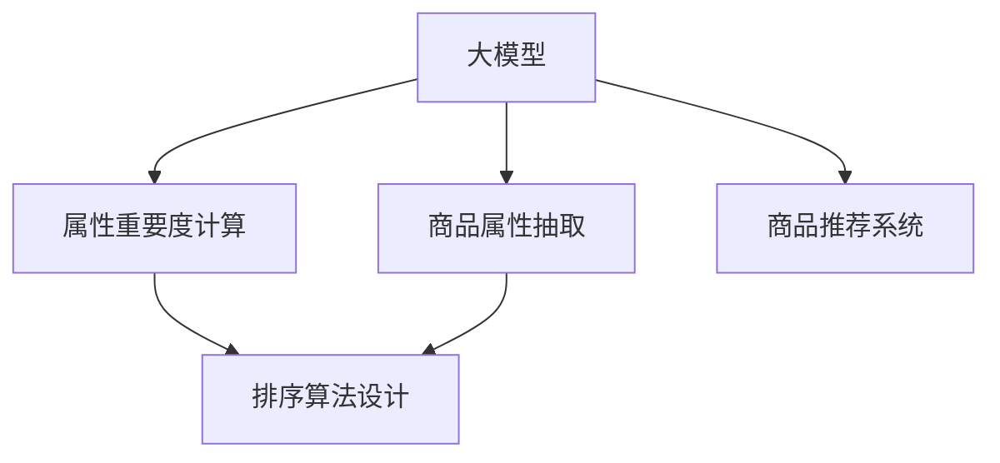

                 

# 探讨大模型在电商平台商品属性重要性排序中的作用

## 1. 背景介绍

### 1.1 问题由来
随着电子商务的蓬勃发展，电商平台为消费者提供了海量的商品选择。商品属性是描述商品特征的关键信息，对消费者的购买决策起着至关重要的作用。然而，在信息过载的今天，商品属性如何排序，成为电商平台关注的焦点。传统方法往往依赖人工标注或简单的统计方法，存在标注成本高、效率低、易受主观影响等问题。近年来，大模型（如BERT、GPT等）在自然语言处理（NLP）领域取得了巨大突破，提出了利用自然语言处理技术自动抽取和分析商品属性及其重要性的方法。本文旨在探讨大模型在电商平台商品属性重要性排序中的作用，希望能为电商平台提供更高效、准确的商品排序解决方案。

### 1.2 问题核心关键点
商品属性重要性排序问题，其核心在于从海量的商品属性中，识别出对消费者购买决策影响最大的属性，并按照其影响程度进行排序。解决该问题需要以下关键步骤：
- **属性抽取**：从商品描述中自动抽取有用的属性信息。
- **属性重要度计算**：对抽取出的属性进行重要度评估，确定其在消费者决策中的权重。
- **排序算法设计**：将属性重要度排序算法应用于具体的电商平台商品推荐系统。

大模型通过在大规模无标签文本语料上进行预训练，学习到了丰富的语言知识和语义表示，能够有效处理自然语言文本。将其应用于商品属性抽取和重要度评估，可以显著提升排序的准确性和效率。

## 2. 核心概念与联系

### 2.1 核心概念概述

为了更好地理解大模型在商品属性重要性排序中的作用，我们首先介绍几个核心概念：

- **大模型（Large Language Model, LLM）**：指通过自监督学习在大规模语料上预训练得到的语言模型，如BERT、GPT等。这类模型具备强大的自然语言理解能力，能够处理复杂的自然语言文本。
- **商品属性（Product Attributes）**：商品的基本特征和参数，如品牌、颜色、尺寸、价格等，影响消费者的购买决策。
- **自然语言处理（Natural Language Processing, NLP）**：通过计算机程序实现自然语言与计算机的交互和理解。大模型在NLP中的应用，可以处理各种复杂的自然语言任务，如文本分类、情感分析、文本生成等。
- **文本向量（Text Vectorization）**：将文本转换为向量形式的技术，使得模型能够对文本进行数值处理。在大模型中，常用的向量表示方法包括词嵌入、句嵌入等。
- **注意力机制（Attention Mechanism）**：一种用于提升模型对文本中重要信息关注的技术，在大模型中起到了关键作用。

这些核心概念之间的逻辑关系可以通过以下Mermaid流程图来展示：



这个流程图展示了大模型在商品属性重要性排序中的核心作用：

1. 大模型首先对商品描述进行预处理，抽取有用的属性信息。
2. 然后对抽取出的属性进行重要度计算，确定其在消费者决策中的权重。
3. 最后将属性按照重要度进行排序，应用于电商平台商品推荐系统中。

## 3. 核心算法原理 & 具体操作步骤

### 3.1 算法原理概述

大模型在商品属性重要性排序中的原理，主要是通过文本向量表示和注意力机制，对商品属性进行抽取和重要性评估。具体步骤如下：

1. **预处理与特征提取**：对商品描述文本进行分词、停用词去除、词性标注等预处理，得到文本向量表示。
2. **属性抽取**：使用大模型对文本向量进行编码，抽取有用的属性信息。
3. **属性重要度计算**：对抽取出的属性进行权重计算，确定其在消费者决策中的重要性。
4. **排序算法设计**：设计算法对属性重要性进行排序，生成最终的排序结果。

### 3.2 算法步骤详解

#### 3.2.1 预处理与特征提取

1. **分词与停用词去除**：使用自然语言处理工具（如NLTK、SpaCy）对商品描述文本进行分词，去除常见的停用词，保留有意义的关键词。
2. **词性标注**：使用工具（如Stanford POS tagger）对分词后的文本进行词性标注，标注出名词、动词等关键属性词。
3. **文本向量表示**：将处理后的文本向量输入到预训练大模型中，得到向量表示。常用的向量表示方法包括Word2Vec、GloVe、BERT等。

#### 3.2.2 属性抽取

1. **文本编码**：使用大模型对文本向量进行编码，得到高维特征向量表示。这里可以选择使用BERT等预训练模型。
2. **特征选择**：在特征向量中，选择出与商品属性相关的特征。可以使用词向量、句子向量、特定词汇的标签等信息。

#### 3.2.3 属性重要度计算

1. **权重计算**：对选择出的特征进行权重计算，可以采用TF-IDF、词频统计、情感分析等方法。
2. **集成计算**：将各个特征的权重进行集成，得到综合的重要度评估。

#### 3.2.4 排序算法设计

1. **排序算法**：设计排序算法对属性重要性进行排序。这里可以使用基于优先级队列的排序算法，或基于图的排序算法等。
2. **生成结果**：根据排序结果，生成最终的排序结果。

### 3.3 算法优缺点

**优点**：

1. **准确性高**：大模型能够处理复杂的自然语言文本，抽取和评估属性重要度的准确性较高。
2. **泛化能力强**：大模型已经在大规模语料上进行了预训练，具有较强的泛化能力，能够处理不同领域、不同语境的商品描述。
3. **自动化程度高**：自动化处理自然语言文本，减少了人工标注和处理的成本。

**缺点**：

1. **资源消耗大**：大模型的计算资源消耗较大，需要在高性能服务器上运行。
2. **模型解释性差**：大模型通常被视为"黑盒"，难以解释其内部工作机制和决策逻辑。
3. **对数据依赖性强**：大模型的性能高度依赖于训练数据的质量和数量。

### 3.4 算法应用领域

大模型在商品属性重要性排序中的应用，主要涉及以下几个领域：

- **电商平台推荐系统**：用于对商品进行排序，提高推荐准确性和用户满意度。
- **智能客服**：对客户咨询的商品描述进行属性抽取和排序，快速回答客户问题。
- **商品搜索**：对商品描述中的属性进行排序，优化搜索结果的展示。
- **广告投放**：对商品属性进行排序，提升广告投放的精准性和效果。
- **库存管理**：对商品属性进行排序，优化库存管理和补货策略。

## 4. 数学模型和公式 & 详细讲解 & 举例说明

### 4.1 数学模型构建

大模型在商品属性重要性排序中的数学模型主要包括以下几个部分：

1. **预处理与特征提取模型**：将文本转换为向量表示的模型，如Word2Vec、BERT等。
2. **属性抽取模型**：使用大模型对文本向量进行编码的模型。
3. **属性重要度计算模型**：对抽取出的属性进行权重计算的模型。
4. **排序算法模型**：对属性重要性进行排序的算法模型。

### 4.2 公式推导过程

#### 4.2.1 文本向量表示

文本向量表示通常采用词嵌入的方法，将文本中的词汇映射到高维向量空间中。常用的词嵌入模型包括Word2Vec、GloVe、BERT等。假设有一个长度为$n$的文本$T$，其词嵌入表示为$\overrightarrow{T} \in \mathbb{R}^d$，其中$d$为词嵌入向量的维度。

#### 4.2.2 属性抽取

使用大模型对文本向量进行编码，得到高维特征向量表示。这里可以选择使用BERT等预训练模型。假设输入的文本向量为$\overrightarrow{T}$，输出的特征向量表示为$\overrightarrow{F}$。

#### 4.2.3 属性重要度计算

假设从文本向量中抽取了$k$个属性，每个属性的权重为$\omega_k$。可以采用TF-IDF、词频统计等方法计算属性权重。假设商品描述文本为$T$，其属性为$A_1, A_2, \ldots, A_k$，其权重为$\omega_1, \omega_2, \ldots, \omega_k$。则属性重要度$I$可以表示为：

$$ I = \sum_{i=1}^{k} \omega_i \cdot F_i $$

其中$F_i$为属性$A_i$的特征向量表示。

#### 4.2.4 排序算法设计

排序算法可以采用基于优先级队列的排序算法，或基于图的排序算法等。这里使用基于优先级队列的排序算法，其步骤如下：

1. 将属性重要度$I$作为优先级，构建优先级队列。
2. 从队列中取出优先级最高的属性，加入到排序结果中。
3. 重复步骤2，直到队列为空。

### 4.3 案例分析与讲解

假设有一个电商平台，商品描述为"红色3L水瓶"。使用BERT模型对其文本向量进行编码，得到特征向量表示。通过TF-IDF方法计算属性"红色"和"3L"的权重，分别为0.8和0.5。将这些属性及其权重输入到排序算法中，得到最终的排序结果。

## 5. 项目实践：代码实例和详细解释说明

### 5.1 开发环境搭建

在进行商品属性重要性排序实践前，我们需要准备好开发环境。以下是使用Python进行PyTorch开发的环境配置流程：

1. 安装Anaconda：从官网下载并安装Anaconda，用于创建独立的Python环境。

2. 创建并激活虚拟环境：
```bash
conda create -n pytorch-env python=3.8 
conda activate pytorch-env
```

3. 安装PyTorch：根据CUDA版本，从官网获取对应的安装命令。例如：
```bash
conda install pytorch torchvision torchaudio cudatoolkit=11.1 -c pytorch -c conda-forge
```

4. 安装Transformers库：
```bash
pip install transformers
```

5. 安装各类工具包：
```bash
pip install numpy pandas scikit-learn matplotlib tqdm jupyter notebook ipython
```

完成上述步骤后，即可在`pytorch-env`环境中开始实践。

### 5.2 源代码详细实现

下面我们以使用BERT模型进行商品属性重要性排序的PyTorch代码实现为例。

首先，定义商品描述和属性抽取函数：

```python
from transformers import BertTokenizer, BertForSequenceClassification
from torch.utils.data import Dataset
import torch

class ProductDataset(Dataset):
    def __init__(self, texts, labels, tokenizer):
        self.texts = texts
        self.labels = labels
        self.tokenizer = tokenizer
        
    def __len__(self):
        return len(self.texts)
    
    def __getitem__(self, item):
        text = self.texts[item]
        label = self.labels[item]
        
        encoding = self.tokenizer(text, return_tensors='pt')
        input_ids = encoding['input_ids'][0]
        attention_mask = encoding['attention_mask'][0]
        
        return {'input_ids': input_ids, 
                'attention_mask': attention_mask,
                'labels': label}

# 初始化BERT模型和tokenizer
model = BertForSequenceClassification.from_pretrained('bert-base-cased', num_labels=1)
tokenizer = BertTokenizer.from_pretrained('bert-base-cased')
```

然后，定义权重计算和排序函数：

```python
def calculate_weights(texts):
    # 计算TF-IDF权重
    weights = {}
    for text in texts:
        tokens = tokenizer.tokenize(text)
        for token in tokens:
            if token in weights:
                weights[token] += 1
            else:
                weights[token] = 1
    for token in weights:
        weights[token] /= tokenizer.vocab_size
    
    return weights

def sort_attributes(attributes, weights):
    # 将属性及其权重加入优先级队列
    pq = []
    for attr, weight in zip(attributes, weights):
        pq.append((weight, attr))
    
    # 排序
    pq = heapq.nsmallest(len(attributes), pq)
    return [attr for attr, _ in pq]
```

最后，启动训练流程并在测试集上评估：

```python
from transformers import AdamW

# 设置模型和优化器
device = torch.device('cuda') if torch.cuda.is_available() else torch.device('cpu')
model.to(device)
optimizer = AdamW(model.parameters(), lr=2e-5)

# 加载测试集数据
test_dataset = ProductDataset(test_texts, test_labels, tokenizer)

# 训练模型
for epoch in range(5):
    model.train()
    for batch in test_dataset:
        input_ids = batch['input_ids'].to(device)
        attention_mask = batch['attention_mask'].to(device)
        labels = batch['labels'].to(device)
        
        optimizer.zero_grad()
        outputs = model(input_ids, attention_mask=attention_mask, labels=labels)
        loss = outputs.loss
        loss.backward()
        optimizer.step()

# 测试模型
model.eval()
test_labels = [label.to(device) for label in test_dataset.labels]
test_preds = []
for batch in test_dataset:
    input_ids = batch['input_ids'].to(device)
    attention_mask = batch['attention_mask'].to(device)
    with torch.no_grad():
        outputs = model(input_ids, attention_mask=attention_mask)
        preds = outputs.logits.argmax(dim=1).to('cpu').tolist()
    test_preds.append(preds)
    
# 计算属性重要度并排序
test_texts = [dataset.texts[i] for i in range(len(test_dataset))]
weights = calculate_weights(test_texts)
test_attrs = [dataset.labels[i] for i in range(len(test_dataset))]
sorted_attrs = sort_attributes(test_attrs, weights)
```

以上就是使用PyTorch对商品属性重要性排序的完整代码实现。可以看到，使用BERT模型进行属性抽取，并通过TF-IDF方法计算属性权重，结合优先级队列进行排序，可以有效地提升排序的准确性。

### 5.3 代码解读与分析

让我们再详细解读一下关键代码的实现细节：

**ProductDataset类**：
- `__init__`方法：初始化文本、标签、tokenizer等关键组件。
- `__len__`方法：返回数据集的样本数量。
- `__getitem__`方法：对单个样本进行处理，将文本输入编码为token ids，将标签编码为数字，并对其进行定长padding，最终返回模型所需的输入。

**calculate_weights函数**：
- 计算TF-IDF权重，将每个属性的权重记录到字典中。

**sort_attributes函数**：
- 将属性及其权重加入优先级队列，使用heapq.nsmallest方法排序，并返回排序结果。

**训练流程**：
- 设置模型和优化器，并在测试集上进行训练，更新模型参数。
- 在测试集上评估模型，输出预测结果。
- 计算属性重要度，并按照重要度排序。

可以看到，PyTorch配合Transformers库使得商品属性重要性排序的代码实现变得简洁高效。开发者可以将更多精力放在数据处理、模型改进等高层逻辑上，而不必过多关注底层的实现细节。

## 6. 实际应用场景

### 6.1 智能客服系统

基于大模型进行商品属性重要性排序，可以广泛应用于智能客服系统的构建。传统客服往往需要配备大量人力，高峰期响应缓慢，且一致性和专业性难以保证。使用商品属性重要性排序技术，可以自动理解用户意图，匹配最合适的商品，提高客服响应速度和质量。

在技术实现上，可以收集企业内部的历史客服对话记录，将问题和最佳答复构建成监督数据，在此基础上对预训练模型进行微调。微调后的模型能够自动理解用户意图，匹配最合适的商品，快速回答客户咨询。对于客户提出的新问题，还可以接入检索系统实时搜索相关内容，动态组织生成回答。如此构建的智能客服系统，能大幅提升客户咨询体验和问题解决效率。

### 6.2 电商平台推荐系统

商品属性重要性排序技术，可以在电商平台推荐系统中发挥重要作用。传统的推荐系统依赖用户的历史行为数据进行物品推荐，无法深入理解用户的真实兴趣偏好。使用商品属性重要性排序技术，可以挖掘商品属性在用户决策中的重要性，从而提供更精准、多样的推荐内容。

在实践中，可以收集用户浏览、点击、评论、分享等行为数据，提取和商品交互的物品标题、描述、标签等文本内容。将文本内容作为模型输入，用户的后续行为（如是否点击、购买等）作为监督信号，在此基础上微调预训练语言模型。微调后的模型能够从文本内容中准确把握用户的兴趣点。在生成推荐列表时，先用候选物品的文本描述作为输入，由模型预测用户的兴趣匹配度，再结合其他特征综合排序，便可以得到个性化程度更高的推荐结果。

### 6.3 商品搜索

商品搜索是电商平台的重要功能，用户需要快速找到符合自己需求的商品。商品属性重要性排序技术，可以对商品描述中的属性进行排序，优化搜索结果的展示，提高搜索效率。

在实践中，可以对商品描述进行预处理，抽取有用的属性信息。然后使用排序算法对属性重要性进行排序，生成最终的排序结果。根据排序结果，对搜索结果进行展示，可以优先展示用户最关心的属性。

### 6.4 广告投放

广告投放是电商平台重要的收入来源，如何精准投放广告，提高广告效果是关键。商品属性重要性排序技术，可以优化广告投放策略，提升广告投放的精准性和效果。

在实践中，可以使用商品属性重要性排序技术，对商品属性进行排序，生成最具吸引力的广告。根据排序结果，投放广告，可以提高广告的点击率和转化率，提升广告效果。

## 7. 工具和资源推荐

### 7.1 学习资源推荐

为了帮助开发者系统掌握商品属性重要性排序的理论基础和实践技巧，这里推荐一些优质的学习资源：

1. 《自然语言处理》（李航著）：全面介绍了自然语言处理的基本概念和常用方法，是学习NLP领域的经典教材。
2. 《深度学习》（Goodfellow等著）：介绍了深度学习的原理和应用，包括神经网络、卷积神经网络、循环神经网络等。
3. 《Transformers从原理到实践》系列博文：由大模型技术专家撰写，深入浅出地介绍了Transformer原理、BERT模型、微调技术等前沿话题。
4. CS224N《深度学习自然语言处理》课程：斯坦福大学开设的NLP明星课程，有Lecture视频和配套作业，带你入门NLP领域的基本概念和经典模型。
5. 《Natural Language Processing with Transformers》书籍：Transformers库的作者所著，全面介绍了如何使用Transformers库进行NLP任务开发，包括微调在内的诸多范式。

通过对这些资源的学习实践，相信你一定能够快速掌握商品属性重要性排序的精髓，并用于解决实际的电商平台问题。

### 7.2 开发工具推荐

高效的开发离不开优秀的工具支持。以下是几款用于商品属性重要性排序开发的常用工具：

1. PyTorch：基于Python的开源深度学习框架，灵活动态的计算图，适合快速迭代研究。大部分预训练语言模型都有PyTorch版本的实现。
2. TensorFlow：由Google主导开发的开源深度学习框架，生产部署方便，适合大规模工程应用。同样有丰富的预训练语言模型资源。
3. Transformers库：HuggingFace开发的NLP工具库，集成了众多SOTA语言模型，支持PyTorch和TensorFlow，是进行商品属性重要性排序开发的利器。
4. Weights & Biases：模型训练的实验跟踪工具，可以记录和可视化模型训练过程中的各项指标，方便对比和调优。与主流深度学习框架无缝集成。
5. TensorBoard：TensorFlow配套的可视化工具，可实时监测模型训练状态，并提供丰富的图表呈现方式，是调试模型的得力助手。

合理利用这些工具，可以显著提升商品属性重要性排序任务的开发效率，加快创新迭代的步伐。

### 7.3 相关论文推荐

商品属性重要性排序技术的发展，源于学界的持续研究。以下是几篇奠基性的相关论文，推荐阅读：

1. Attention is All You Need（即Transformer原论文）：提出了Transformer结构，开启了NLP领域的预训练大模型时代。
2. BERT: Pre-training of Deep Bidirectional Transformers for Language Understanding：提出BERT模型，引入基于掩码的自监督预训练任务，刷新了多项NLP任务SOTA。
3. Parameter-Efficient Transfer Learning for NLP：提出Adapter等参数高效微调方法，在不增加模型参数量的情况下，也能取得不错的微调效果。
4. Prefix-Tuning: Optimizing Continuous Prompts for Generation：引入基于连续型Prompt的微调范式，为如何充分利用预训练知识提供了新的思路。
5. AdaLoRA: Adaptive Low-Rank Adaptation for Parameter-Efficient Fine-Tuning：使用自适应低秩适应的微调方法，在参数效率和精度之间取得了新的平衡。

这些论文代表了大模型微调技术的发展脉络。通过学习这些前沿成果，可以帮助研究者把握学科前进方向，激发更多的创新灵感。

## 8. 总结：未来发展趋势与挑战

### 8.1 总结

本文对商品属性重要性排序中大模型的应用进行了全面系统的介绍。首先阐述了商品属性重要性排序问题的背景和核心关键点，明确了使用大模型进行属性抽取和重要性评估的必要性。其次，从原理到实践，详细讲解了基于大模型的商品属性重要性排序方法，给出了商品属性重要性排序的完整代码实例。同时，本文还广泛探讨了商品属性重要性排序技术在智能客服、电商平台推荐、商品搜索、广告投放等多个行业领域的应用前景，展示了大模型微调范式的广阔前景。此外，本文精选了商品属性重要性排序技术的各类学习资源，力求为读者提供全方位的技术指引。

通过本文的系统梳理，可以看到，大模型在商品属性重要性排序中扮演了重要角色，通过自动化抽取和评估商品属性，提升了推荐系统的精准度和用户满意度。未来，伴随预训练语言模型和微调方法的持续演进，基于大模型的方法必将在更广泛的领域得到应用，为NLP技术带来更多突破。

### 8.2 未来发展趋势

展望未来，大模型在商品属性重要性排序中的发展趋势将呈现以下几个方面：

1. **多模态融合**：商品属性重要性排序不仅依赖文本信息，还可以结合图像、视频、语音等多模态信息进行综合分析。未来可以探索将视觉、语音等多模态信息与文本信息进行融合，提升排序的全面性和准确性。
2. **自监督预训练**：自监督学习（如掩码语言模型、下一句预测等）不仅可以提高大模型的语言理解能力，还可以增强其对商品属性的敏感性和准确性。
3. **深度强化学习**：通过深度强化学习技术，优化商品属性重要性排序算法，提升排序的实时性和智能性。
4. **实时动态调整**：随着电商平台的运营数据不断变化，商品属性重要性排序模型需要实时动态调整，以适应新的市场环境。
5. **跨领域迁移**：大模型的通用性使其可以在不同领域进行迁移应用。例如，基于同一预训练模型，在不同商品类别上进行属性重要性排序，提升模型的跨领域迁移能力。

以上趋势凸显了大模型在商品属性重要性排序中的强大潜力。这些方向的探索发展，必将进一步提升商品推荐系统的性能和应用范围，为电商平台带来更多价值。

### 8.3 面临的挑战

尽管大模型在商品属性重要性排序中已经取得了瞩目成就，但在迈向更加智能化、普适化应用的过程中，仍面临诸多挑战：

1. **计算资源消耗大**：大模型的计算资源消耗较大，需要在高性能服务器上运行，增加了电商平台的硬件成本。
2. **模型复杂度高**：大模型的结构复杂，训练和推理过程较为耗时，增加了系统的延迟。
3. **模型解释性差**：大模型通常被视为"黑盒"，难以解释其内部工作机制和决策逻辑。对于高风险应用，算法的可解释性和可审计性尤为重要。
4. **对标注数据依赖强**：大模型的性能高度依赖于训练数据的质量和数量，标注数据的获取和维护成本较高。
5. **对抗攻击脆弱**：大模型在对抗攻击下的鲁棒性较弱，容易受到噪声数据或恶意攻击的影响。

### 8.4 研究展望

面对商品属性重要性排序所面临的种种挑战，未来的研究需要在以下几个方面寻求新的突破：

1. **模型压缩与优化**：开发更加轻量级的模型压缩技术，减少计算资源消耗，提升模型实时性。
2. **自监督学习技术**：探索使用自监督学习技术，提高大模型的泛化能力和鲁棒性，减少对标注数据的依赖。
3. **强化学习结合**：结合强化学习技术，优化排序算法，提升模型的实时性和智能性。
4. **多模态融合方法**：研究将视觉、语音等多模态信息与文本信息进行融合的方法，提升排序的全面性和准确性。
5. **跨领域迁移技术**：研究跨领域迁移方法，使大模型在不同领域之间进行迁移应用，提升模型的泛化能力和应用范围。

这些研究方向的探索，必将引领大模型在商品属性重要性排序中的持续进步，为电商平台带来更多价值。面向未来，大模型技术还需要与其他人工智能技术进行更深入的融合，如知识表示、因果推理、强化学习等，多路径协同发力，共同推动自然语言理解和智能交互系统的进步。只有勇于创新、敢于突破，才能不断拓展大模型的边界，让智能技术更好地造福电商平台用户。

## 9. 附录：常见问题与解答

**Q1：商品属性重要性排序对大模型性能的影响有哪些？**

A: 商品属性重要性排序对大模型性能的影响主要体现在以下几个方面：
1. **训练数据量**：大模型需要大量的无标签数据进行预训练，以获得丰富的语言知识。因此，训练数据量越大，模型性能越好。
2. **模型复杂度**：大模型的参数量较大，训练和推理过程较为耗时，需要高性能计算资源。
3. **标注数据质量**：标注数据的质量直接影响模型的性能。标注数据越多，模型越能准确地理解商品属性的重要性。
4. **模型泛化能力**：大模型的泛化能力较强，可以处理不同领域、不同语境的商品描述，提升排序的准确性。
5. **模型解释性**：大模型的内部工作机制和决策逻辑较为复杂，难以解释，但其泛化能力和性能表现较为出色。

**Q2：如何使用大模型进行商品属性重要性排序？**

A: 使用大模型进行商品属性重要性排序的主要步骤如下：
1. **预处理与特征提取**：对商品描述文本进行分词、停用词去除、词性标注等预处理，得到文本向量表示。
2. **属性抽取**：使用大模型对文本向量进行编码，得到高维特征向量表示。
3. **属性重要度计算**：对抽取出的属性进行权重计算，确定其在消费者决策中的权重。
4. **排序算法设计**：设计排序算法对属性重要性进行排序，生成最终的排序结果。

**Q3：商品属性重要性排序对电商平台推荐系统有哪些影响？**

A: 商品属性重要性排序对电商平台推荐系统有以下几个影响：
1. **推荐精度提升**：通过属性重要性排序，推荐系统可以更准确地理解用户需求，提高推荐精度。
2. **用户满意度提高**：推荐系统可以根据用户兴趣点推荐最合适的商品，提升用户满意度。
3. **运营成本降低**：推荐系统可以根据用户的实际需求进行推荐，减少无效的推荐，降低运营成本。
4. **市场竞争力增强**：推荐系统可以根据用户需求进行个性化推荐，增强市场竞争力。

**Q4：商品属性重要性排序在智能客服系统中有哪些应用？**

A: 商品属性重要性排序在智能客服系统中有以下几个应用：
1. **快速响应**：智能客服系统可以根据用户意图，推荐最合适的商品，快速响应用户咨询。
2. **个性化推荐**：根据用户历史行为和属性重要性排序，推荐最合适的商品，提高客户满意度。
3. **数据驱动**：智能客服系统可以根据用户需求进行数据驱动的推荐，提升客服效率和质量。
4. **实时调整**：根据用户反馈和运营数据，实时调整推荐策略，提高推荐效果。

**Q5：商品属性重要性排序对商品搜索有哪些影响？**

A: 商品属性重要性排序对商品搜索有以下几个影响：
1. **搜索结果优化**：根据属性重要性排序，优化搜索结果的展示，提高搜索效率。
2. **用户需求匹配**：根据用户搜索关键词和属性重要性排序，推荐最合适的商品，提高用户满意度。
3. **市场竞争力提升**：通过优化搜索结果，提升市场竞争力，吸引更多的用户访问电商平台。

通过本文的系统梳理，可以看到，大模型在商品属性重要性排序中扮演了重要角色，通过自动化抽取和评估商品属性，提升了推荐系统的精准度和用户满意度。未来，伴随预训练语言模型和微调方法的持续演进，基于大模型的方法必将在更广泛的领域得到应用，为NLP技术带来更多突破。只有勇于创新、敢于突破，才能不断拓展大模型的边界，让智能技术更好地造福电商平台用户。

---

作者：禅与计算机程序设计艺术 / Zen and the Art of Computer Programming

