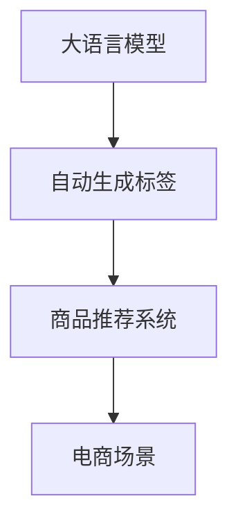

                 

# 探讨大模型在电商平台商品标签自动生成中的作用

> 关键词：大语言模型, 自动生成标签, 商品推荐系统, 电商场景, 文本生成, 监督学习

## 1. 背景介绍

随着电子商务的蓬勃发展，电商平台日益增长的商品种类和交易量给商家带来了严峻的挑战。其中，商品标签的自动生成是一个重要且复杂的问题。有效的商品标签能够帮助用户快速定位商品、提高商品曝光率、优化搜索算法、增强用户购物体验。传统的商品标签生成方法依赖于人工标注或规则引擎，不仅成本高、效率低，而且难以适应多样化的电商场景和用户需求。

近年来，随着深度学习和大模型的兴起，自动生成商品标签的方法得到了显著提升。本文将深入探讨大语言模型在电商平台商品标签自动生成中的应用，通过系统的理论分析和工程实践，为电商平台的商品标签生成提供新的解决方案。

## 2. 核心概念与联系

### 2.1 核心概念概述

为更好地理解大语言模型在电商平台商品标签自动生成中的作用，我们需要先了解几个关键概念：

- **大语言模型**：以自回归(如GPT)或自编码(如BERT)模型为代表的大规模预训练语言模型。通过在大规模无标签文本语料上进行预训练，学习通用的语言表示，具备强大的语言理解和生成能力。

- **自动生成标签**：指根据商品的描述、属性、用户行为等数据，自动生成有意义的标签。生成的标签应具备准确性、唯一性、相关性等特征。

- **商品推荐系统**：通过分析用户的浏览、购买行为，推荐可能感兴趣的商品。商品标签自动生成是推荐系统优化的一个关键环节。

- **电商场景**：电商平台上的商品推荐、搜索、广告投放等场景。电商场景具有数据多样性、用户行为复杂性等特点。

这些概念之间的逻辑关系可以通过以下Mermaid流程图来展示：



这个流程图展示了自动生成商品标签、商品推荐系统与电商场景之间的关系：

1. 大语言模型学习通用语言表示，用于自动生成商品标签。
2. 生成的标签通过推荐系统推荐给用户。
3. 标签提升了用户搜索和推荐体验，增强电商平台的商业价值。

## 3. 核心算法原理 & 具体操作步骤
### 3.1 算法原理概述

基于大语言模型的商品标签自动生成方法，主要依赖于预训练语言模型在电商数据上的微调。其核心思想是：将预训练语言模型作为特征提取器，通过在电商商品描述、用户行为等数据上微调，使得模型能够自动生成有意义的商品标签。具体步骤如下：

1. **准备数据集**：收集电商平台的商品描述、用户行为等数据，准备训练集和验证集。
2. **设计任务**：定义生成标签的任务，如分类任务、序列生成任务等。
3. **微调模型**：使用预训练语言模型，通过监督学习微调，生成标签。
4. **评估与优化**：在验证集上评估模型性能，根据评估结果优化模型参数，提升标签生成效果。

### 3.2 算法步骤详解

#### 数据准备

在电商平台上，商品标签生成的数据主要来自商品描述和用户行为。商品描述通常包含商品的详细信息，如规格、尺寸、材质等，是生成标签的重要依据。用户行为数据包括浏览、点击、购买等行为，反映了用户对商品的真实需求。

数据预处理包括清洗、分词、编码等步骤。以商品描述数据为例，我们需要进行以下操作：

- 清洗：去除无关内容，如价格、评分等，只保留商品的详细信息。
- 分词：将商品描述转化为分词序列，便于后续处理。
- 编码：将分词序列转化为模型所需的数值表示。

#### 任务设计

商品标签生成任务可以设计为分类任务或序列生成任务。分类任务将商品标签分类到多个预定义的类别中。序列生成任务则是生成特定的标签序列。

以分类任务为例，任务可以设计为将商品标签分类到以下类别：

- 服饰
- 美妆
- 电子产品
- 家居
- 食品
- 汽车

标签生成模型需要预测每个商品描述对应哪个类别，从而自动生成商品标签。

#### 模型微调

选择预训练语言模型，如BERT、GPT等，作为特征提取器。在电商商品描述数据上微调模型，使其能够自动生成商品标签。

1. **选择模型**：从HuggingFace等开源库中选择合适的预训练模型。
2. **准备数据**：将商品描述数据转化为模型所需的格式。
3. **定义损失函数**：根据任务类型定义损失函数，如交叉熵损失等。
4. **微调模型**：在训练集上微调模型，通过反向传播更新模型参数。

#### 评估与优化

在验证集上评估模型性能，根据评估结果优化模型参数，提升标签生成效果。

1. **评估指标**：根据任务类型选择合适的评估指标，如准确率、F1值、BLEU等。
2. **调参**：根据评估指标调整模型超参数，如学习率、批大小等。
3. **优化**：重复微调和评估过程，直至达到最优性能。

### 3.3 算法优缺点

#### 优点

1. **高泛化能力**：大语言模型具备强大的泛化能力，能够在不同的电商场景和用户需求下生成高质量的标签。
2. **自动生成**：自动化程度高，减少人工标注和维护成本，提升效率。
3. **灵活性**：适用于多种标签生成任务，如分类、序列生成等。
4. **可解释性**：通过分析模型生成的标签，可以理解模型的内部工作机制，提供更好的业务指导。

#### 缺点

1. **依赖标注数据**：生成标签的效果很大程度上取决于标注数据的质量和数量，标注数据的获取成本较高。
2. **模型复杂度高**：大语言模型参数量较大，训练和推理速度较慢。
3. **模型鲁棒性不足**：面对域外数据时，模型泛化性能可能不足。
4. **计算资源需求高**：大语言模型需要强大的计算资源支持，成本较高。

### 3.4 算法应用领域

基于大语言模型的商品标签生成方法，主要应用于电商推荐系统、广告投放、搜索引擎等场景。

#### 电商推荐系统

在电商推荐系统中，商品标签生成用于优化推荐算法。通过分析用户的浏览、购买行为，生成商品标签，可以更准确地推荐相关商品，提升用户体验。

#### 广告投放

广告投放是电商平台的另一个重要环节。通过生成商品标签，可以为广告投放提供精准的目标人群，提高广告转化率。

#### 搜索引擎

在搜索引擎中，商品标签生成用于优化搜索结果。通过分析用户搜索意图，生成相关标签，可以提升搜索结果的相关性和用户满意度。

## 4. 数学模型和公式 & 详细讲解  
### 4.1 数学模型构建

假设商品描述序列为 $x_1, x_2, ..., x_n$，标签序列为 $y_1, y_2, ..., y_n$。模型通过微调，使得在给定商品描述 $x_i$ 的情况下，预测对应的标签 $y_i$。

#### 分类任务

对于分类任务，可以采用序列到序列的框架，使用编码器-解码器结构。编码器将商品描述 $x_i$ 编码为向量 $h$，解码器根据 $h$ 预测标签 $y_i$。

$$
h = \text{Encoder}(x_i)
$$
$$
y_i = \text{Decoder}(h)
$$

其中，$\text{Encoder}$ 和 $\text{Decoder}$ 可以采用Transformer等模型。

#### 序列生成任务

对于序列生成任务，可以采用语言模型进行生成。语言模型在给定商品描述 $x_i$ 的情况下，预测每个位置上的标签 $y_t$。

$$
p(y_i|x_i) = \prod_{t=1}^n p(y_t|y_{<t}, x_i)
$$

其中，$y_{<t}$ 表示在位置 $t$ 之前生成的标签。

### 4.2 公式推导过程

以分类任务为例，推导微调的损失函数和梯度计算公式。

1. **损失函数**：
$$
\mathcal{L}(\theta) = -\frac{1}{N} \sum_{i=1}^N \log p(y_i|x_i)
$$
其中，$p(y_i|x_i)$ 表示模型在给定商品描述 $x_i$ 的情况下，预测标签 $y_i$ 的概率。

2. **梯度计算**：
$$
\frac{\partial \mathcal{L}(\theta)}{\partial \theta} = -\frac{1}{N} \sum_{i=1}^N \frac{\partial \log p(y_i|x_i)}{\partial \theta}
$$
其中，$\frac{\partial \log p(y_i|x_i)}{\partial \theta}$ 为模型的梯度，可以通过反向传播计算。

### 4.3 案例分析与讲解

以电商平台的商品推荐系统为例，分析大语言模型在商品标签生成中的作用。

1. **数据准备**：
   - 商品描述数据：从电商平台收集商品描述，包括产品名称、规格、尺寸、材质等。
   - 用户行为数据：从电商平台收集用户的浏览、点击、购买等行为数据。

2. **任务设计**：
   - 分类任务：将商品标签分为多个类别，如服饰、美妆、电子产品等。
   - 序列生成任务：生成特定的标签序列，如“连衣裙”、“口红”、“手机”等。

3. **模型微调**：
   - 选择BERT模型，加载预训练模型。
   - 将商品描述数据转化为模型所需的格式，如分词编码。
   - 定义损失函数，如交叉熵损失。
   - 微调模型，生成商品标签。

4. **评估与优化**：
   - 在验证集上评估模型性能，如准确率、F1值等。
   - 根据评估结果调整模型超参数，如学习率、批大小等。
   - 重复微调和评估过程，直至达到最优性能。

## 5. 项目实践：代码实例和详细解释说明
### 5.1 开发环境搭建

在项目实践前，我们需要准备好开发环境。以下是使用Python进行PyTorch开发的环境配置流程：

1. 安装Anaconda：从官网下载并安装Anaconda，用于创建独立的Python环境。

2. 创建并激活虚拟环境：
```bash
conda create -n pytorch-env python=3.8 
conda activate pytorch-env
```

3. 安装PyTorch：根据CUDA版本，从官网获取对应的安装命令。例如：
```bash
conda install pytorch torchvision torchaudio cudatoolkit=11.1 -c pytorch -c conda-forge
```

4. 安装Transformers库：
```bash
pip install transformers
```

5. 安装各类工具包：
```bash
pip install numpy pandas scikit-learn matplotlib tqdm jupyter notebook ipython
```

完成上述步骤后，即可在`pytorch-env`环境中开始项目实践。

### 5.2 源代码详细实现

这里我们以电商商品推荐系统为例，使用BERT模型进行商品标签生成。

```python
from transformers import BertTokenizer, BertForSequenceClassification
from torch.utils.data import Dataset, DataLoader
from torch.nn import CrossEntropyLoss
from sklearn.metrics import accuracy_score, f1_score
from torch.optim import AdamW

class E-commerceDataset(Dataset):
    def __init__(self, texts, labels):
        self.texts = texts
        self.labels = labels
        self.tokenizer = BertTokenizer.from_pretrained('bert-base-uncased')

    def __len__(self):
        return len(self.texts)

    def __getitem__(self, idx):
        text = self.texts[idx]
        label = self.labels[idx]
        
        encoding = self.tokenizer(text, return_tensors='pt', truncation=True)
        input_ids = encoding['input_ids']
        attention_mask = encoding['attention_mask']
        return {'input_ids': input_ids, 
                'attention_mask': attention_mask,
                'labels': torch.tensor(label, dtype=torch.long)}

def train_epoch(model, dataset, optimizer):
    dataloader = DataLoader(dataset, batch_size=16)
    model.train()
    loss_sum = 0
    for batch in dataloader:
        input_ids = batch['input_ids'].to(device)
        attention_mask = batch['attention_mask'].to(device)
        labels = batch['labels'].to(device)
        model.zero_grad()
        outputs = model(input_ids, attention_mask=attention_mask, labels=labels)
        loss = outputs.loss
        loss_sum += loss.item()
        loss.backward()
        optimizer.step()
    return loss_sum / len(dataloader)

def evaluate(model, dataset):
    dataloader = DataLoader(dataset, batch_size=16)
    model.eval()
    preds, labels = [], []
    with torch.no_grad():
        for batch in dataloader:
            input_ids = batch['input_ids'].to(device)
            attention_mask = batch['attention_mask'].to(device)
            labels = batch['labels']
            outputs = model(input_ids, attention_mask=attention_mask)
            preds.append(outputs.logits.argmax(dim=2).to('cpu').tolist())
            labels.append(labels.to('cpu').tolist())
    return accuracy_score(labels, preds), f1_score(labels, preds)

def main():
    device = torch.device('cuda') if torch.cuda.is_available() else torch.device('cpu')
    model = BertForSequenceClassification.from_pretrained('bert-base-uncased', num_labels=6).to(device)
    optimizer = AdamW(model.parameters(), lr=2e-5)
    
    train_dataset = E-commerceDataset(train_texts, train_labels)
    dev_dataset = E-commerceDataset(dev_texts, dev_labels)
    
    for epoch in range(10):
        train_loss = train_epoch(model, train_dataset, optimizer)
        print(f'Epoch {epoch+1}, train loss: {train_loss:.3f}')
        
        dev_accuracy, dev_f1 = evaluate(model, dev_dataset)
        print(f'Epoch {epoch+1}, dev accuracy: {dev_accuracy:.2f}, f1 score: {dev_f1:.2f}')
    
    test_dataset = E-commerceDataset(test_texts, test_labels)
    test_accuracy, test_f1 = evaluate(model, test_dataset)
    print(f'Test accuracy: {test_accuracy:.2f}, f1 score: {test_f1:.2f}')

if __name__ == '__main__':
    main()
```

### 5.3 代码解读与分析

让我们再详细解读一下关键代码的实现细节：

**E-commerceDataset类**：
- `__init__`方法：初始化商品描述和标签，加载BERT分词器。
- `__len__`方法：返回数据集的样本数量。
- `__getitem__`方法：对单个样本进行处理，将商品描述编码成BERT模型所需的输入，将标签编码为模型可接受的格式。

**模型微调**：
- 选择BERT模型，加载预训练模型。
- 将商品描述数据转化为模型所需的格式，如分词编码。
- 定义损失函数，如交叉熵损失。
- 微调模型，生成商品标签。

**评估函数**：
- 在验证集上评估模型性能，如准确率和F1值。
- 根据评估结果调整模型超参数，如学习率、批大小等。
- 重复微调和评估过程，直至达到最优性能。

## 6. 实际应用场景
### 6.1 智能客服系统

基于大语言模型的商品标签生成技术，可以应用于智能客服系统的商品推荐和查询。智能客服系统通过分析用户的语言输入，自动生成商品标签，推荐相关商品，或快速查询商品信息，提升客服体验。

### 6.2 推荐系统

在推荐系统中，商品标签生成用于优化推荐算法。通过分析用户的浏览、购买行为，生成商品标签，可以更准确地推荐相关商品，提升用户体验。

### 6.3 搜索系统

在搜索系统中，商品标签生成用于优化搜索结果。通过分析用户搜索意图，生成相关标签，可以提升搜索结果的相关性和用户满意度。

### 6.4 未来应用展望

随着大语言模型和商品标签生成技术的发展，未来的电商推荐系统将更加智能、精准。通过生成高质量的商品标签，可以提升用户满意度，提高销售转化率。

## 7. 工具和资源推荐
### 7.1 学习资源推荐

为了帮助开发者系统掌握大语言模型在电商平台商品标签自动生成中的应用，这里推荐一些优质的学习资源：

1. 《自然语言处理综述》：涵盖了NLP领域的各个方面，适合初学者和进阶者。
2. 《深度学习基础》：介绍深度学习的基本概念和模型，适合对深度学习感兴趣的学习者。
3. 《Python深度学习》：讲解深度学习在Python中的实现，适合动手实践的学习者。
4. 《PyTorch官方文档》：全面介绍PyTorch框架，适合深度学习开发者。
5. 《Transformer简明教程》：介绍Transformer模型的工作原理和实现细节，适合对Transformer感兴趣的开发者。

通过对这些资源的学习实践，相信你一定能够快速掌握大语言模型在电商平台商品标签自动生成中的应用，并用于解决实际的电商问题。

### 7.2 开发工具推荐

高效的开发离不开优秀的工具支持。以下是几款用于大语言模型商品标签生成开发的常用工具：

1. PyTorch：基于Python的开源深度学习框架，灵活动态的计算图，适合快速迭代研究。
2. TensorFlow：由Google主导开发的开源深度学习框架，生产部署方便，适合大规模工程应用。
3. Transformers库：HuggingFace开发的NLP工具库，集成了众多SOTA语言模型，支持PyTorch和TensorFlow，是进行商品标签生成任务的开发的利器。
4. Weights & Biases：模型训练的实验跟踪工具，可以记录和可视化模型训练过程中的各项指标，方便对比和调优。
5. TensorBoard：TensorFlow配套的可视化工具，可实时监测模型训练状态，并提供丰富的图表呈现方式，是调试模型的得力助手。
6. Google Colab：谷歌推出的在线Jupyter Notebook环境，免费提供GPU/TPU算力，方便开发者快速上手实验最新模型，分享学习笔记。

合理利用这些工具，可以显著提升大语言模型商品标签生成的开发效率，加快创新迭代的步伐。

### 7.3 相关论文推荐

大语言模型和商品标签生成技术的发展源于学界的持续研究。以下是几篇奠基性的相关论文，推荐阅读：

1. Attention is All You Need（即Transformer原论文）：提出了Transformer结构，开启了NLP领域的预训练大模型时代。
2. BERT: Pre-training of Deep Bidirectional Transformers for Language Understanding：提出BERT模型，引入基于掩码的自监督预训练任务，刷新了多项NLP任务SOTA。
3. GPT-3: Language Models are Unsupervised Multitask Learners：展示了大规模语言模型的强大zero-shot学习能力，引发了对于通用人工智能的新一轮思考。
4. Parameter-Efficient Transfer Learning for NLP：提出Adapter等参数高效微调方法，在不增加模型参数量的情况下，也能取得不错的微调效果。
5. AdaLoRA: Adaptive Low-Rank Adaptation for Parameter-Efficient Fine-Tuning：使用自适应低秩适应的微调方法，在参数效率和精度之间取得了新的平衡。

这些论文代表了大语言模型商品标签生成技术的发展脉络。通过学习这些前沿成果，可以帮助研究者把握学科前进方向，激发更多的创新灵感。

## 8. 总结：未来发展趋势与挑战

### 8.1 总结

本文对大语言模型在电商平台商品标签自动生成中的应用进行了全面系统的介绍。首先阐述了大语言模型和商品标签生成技术的研究背景和意义，明确了商品标签生成在提升电商推荐系统性能方面的独特价值。其次，从原理到实践，详细讲解了基于大语言模型的商品标签生成过程，给出了商品标签生成任务的完整代码实例。同时，本文还广泛探讨了商品标签生成在智能客服、推荐系统、搜索系统等多个场景中的应用前景，展示了商品标签生成技术的巨大潜力。此外，本文精选了商品标签生成的各类学习资源，力求为读者提供全方位的技术指引。

通过本文的系统梳理，可以看到，大语言模型商品标签生成技术正在成为电商推荐系统的重要组成部分，极大地提升了电商推荐系统的精准度和用户体验。未来，伴随大语言模型和商品标签生成方法的不断演进，相信NLP技术将在电商领域发挥更大的作用，进一步提升电商平台的商业价值。

### 8.2 未来发展趋势

展望未来，大语言模型商品标签生成技术将呈现以下几个发展趋势：

1. 模型规模持续增大。随着算力成本的下降和数据规模的扩张，大语言模型的参数量还将持续增长。超大语言模型蕴含的丰富语言知识，将进一步提升商品标签生成的质量和多样性。
2. 微调方法日趋多样。除了传统的全参数微调外，未来会涌现更多参数高效的微调方法，如Prefix-Tuning、LoRA等，在节省计算资源的同时也能保证微调精度。
3. 模型通用性增强。经过海量数据的预训练和多领域任务的微调，大语言模型将具备更强的跨领域迁移能力，逐步迈向通用人工智能(AGI)的目标。
4. 持续学习成为常态。随着数据分布的不断变化，商品标签生成模型也需要持续学习新知识以保持性能。如何在不遗忘原有知识的同时，高效吸收新样本信息，将成为重要的研究课题。
5. 标注样本需求降低。受启发于提示学习(Prompt-based Learning)的思路，未来的商品标签生成方法将更好地利用大模型的语言理解能力，通过更加巧妙的任务描述，在更少的标注样本上也能实现理想的商品标签生成效果。

以上趋势凸显了大语言模型商品标签生成技术的广阔前景。这些方向的探索发展，必将进一步提升NLP系统的性能和应用范围，为电商平台的商业价值注入新的动力。

### 8.3 面临的挑战

尽管大语言模型商品标签生成技术已经取得了瞩目成就，但在迈向更加智能化、普适化应用的过程中，它仍面临着诸多挑战：

1. 标注成本瓶颈。尽管商品标签生成的效果很大程度上取决于标注数据的质量和数量，但对于长尾应用场景，难以获得充足的高质量标注数据，成为制约商品标签生成性能的瓶颈。如何进一步降低商品标签生成对标注样本的依赖，将是一大难题。
2. 模型鲁棒性不足。面对域外数据时，商品标签生成模型泛化性能可能不足。对于测试样本的微小扰动，商品标签生成模型容易发生波动。如何提高商品标签生成模型的鲁棒性，避免灾难性遗忘，还需要更多理论和实践的积累。
3. 推理效率有待提高。大语言模型商品标签生成虽然精度高，但在实际部署时往往面临推理速度慢、内存占用大等效率问题。如何在保证性能的同时，简化模型结构，提升推理速度，优化资源占用，将是重要的优化方向。
4. 可解释性亟需加强。商品标签生成模型通常缺乏可解释性，难以解释其内部工作机制和决策逻辑。对于医疗、金融等高风险应用，算法的可解释性和可审计性尤为重要。如何赋予商品标签生成模型更强的可解释性，将是亟待攻克的难题。
5. 安全性有待保障。大语言模型商品标签生成模型难免会学习到有偏见、有害的信息，通过生成标签传递到电商平台上，产生误导性、歧视性的输出，给实际应用带来安全隐患。如何从数据和算法层面消除模型偏见，避免恶意用途，确保输出的安全性，也将是重要的研究课题。

### 8.4 研究展望

面对大语言模型商品标签生成所面临的挑战，未来的研究需要在以下几个方面寻求新的突破：

1. 探索无监督和半监督商品标签生成方法。摆脱对大规模标注数据的依赖，利用自监督学习、主动学习等无监督和半监督范式，最大限度利用非结构化数据，实现更加灵活高效的商品标签生成。
2. 研究参数高效和计算高效的商品标签生成范式。开发更加参数高效的生成方法，在固定大部分预训练参数的同时，只更新极少量的任务相关参数。同时优化商品标签生成模型的计算图，减少前向传播和反向传播的资源消耗，实现更加轻量级、实时性的部署。
3. 融合因果和对比学习范式。通过引入因果推断和对比学习思想，增强商品标签生成模型建立稳定因果关系的能力，学习更加普适、鲁棒的语言表征，从而提升模型泛化性和抗干扰能力。
4. 引入更多先验知识。将符号化的先验知识，如知识图谱、逻辑规则等，与神经网络模型进行巧妙融合，引导商品标签生成过程学习更准确、合理的商品标签。同时加强不同模态数据的整合，实现视觉、语音等多模态信息与文本信息的协同建模。
5. 结合因果分析和博弈论工具。将因果分析方法引入商品标签生成模型，识别出模型决策的关键特征，增强输出解释的因果性和逻辑性。借助博弈论工具刻画人机交互过程，主动探索并规避模型的脆弱点，提高系统稳定性。
6. 纳入伦理道德约束。在商品标签生成模型的训练目标中引入伦理导向的评估指标，过滤和惩罚有偏见、有害的输出倾向。同时加强人工干预和审核，建立模型行为的监管机制，确保输出符合人类价值观和伦理道德。

这些研究方向的探索，必将引领大语言模型商品标签生成技术迈向更高的台阶，为构建安全、可靠、可解释、可控的智能系统铺平道路。面向未来，大语言模型商品标签生成技术还需要与其他人工智能技术进行更深入的融合，如知识表示、因果推理、强化学习等，多路径协同发力，共同推动自然语言理解和智能交互系统的进步。只有勇于创新、敢于突破，才能不断拓展语言模型的边界，让智能技术更好地造福人类社会。

## 9. 附录：常见问题与解答

**Q1：大语言模型商品标签生成是否适用于所有电商商品？**

A: 大语言模型商品标签生成在大多数电商商品上都能取得不错的效果，特别是对于数据量较大的商品。但对于一些特殊领域的商品，如高价值商品、定制化商品等，由于缺乏足够的标注数据，生成效果可能较差。此时需要结合专家知识和规则，优化商品标签生成过程。

**Q2：生成商品标签时如何选择合适的超参数？**

A: 生成商品标签的效果很大程度上取决于超参数的选择。一般而言，可以通过交叉验证等方法，逐步调整超参数，如学习率、批大小、隐藏层维度等。常用的超参数搜索方法包括网格搜索、随机搜索、贝叶斯优化等。

**Q3：商品标签生成模型的计算资源需求高吗？**

A: 大语言模型商品标签生成模型的计算资源需求较高，特别是在大规模商品标签生成时。为了降低计算成本，可以采用分布式训练、模型剪枝、参数量化等技术，优化模型结构，提高计算效率。

**Q4：商品标签生成模型是否易于解释？**

A: 商品标签生成模型通常缺乏可解释性，难以解释其内部工作机制和决策逻辑。为了增强模型的可解释性，可以引入可解释性技术，如模型可视化、注意力机制等，帮助理解模型的决策过程。

**Q5：如何应对商品标签生成中的偏见问题？**

A: 商品标签生成模型可能学习到有偏见的数据，导致输出偏向某些商品类别。为了减少偏见，可以在数据预处理阶段，去除有偏见的标注数据，或通过数据增强等技术，增加少数类别的标注样本。同时，在模型训练目标中引入伦理导向的评估指标，过滤和惩罚有偏见、有害的输出倾向。

通过对这些常见问题的解答，相信你一定能够更好地理解大语言模型在电商平台商品标签自动生成中的应用，并有效地应用于实际的电商场景。

