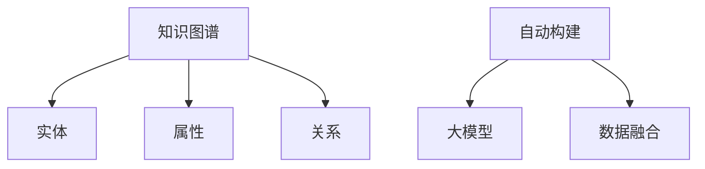

                 

# 探讨大模型在电商平台商品知识图谱自动构建与更新中的作用

> 关键词：电商平台,商品知识图谱,自动构建,大模型,商品标签,实体关系,数据融合

## 1. 背景介绍

### 1.1 问题由来
随着电子商务的迅猛发展，电商平台的商品数量已达到亿级，传统的商品管理方式已难以适应快速增长的业务需求。如何高效、准确地管理海量商品信息，提升用户体验和运营效率，成为电商平台亟需解决的关键问题。

为此，知识图谱（Knowledge Graph）技术应运而生。知识图谱是一种语义化的数据组织方式，通过描述实体和实体之间的关系，为自然语言处理（NLP）和计算机视觉（CV）等技术提供数据支撑。电商平台中的商品知识图谱可以包括商品信息、商品类别、属性、品牌、用户评价等多维数据，帮助电商平台实现商品推荐、搜索排序、库存管理、市场分析等功能。

然而，构建和维护一个准确、全面、实时更新的商品知识图谱是一个极其复杂的过程。传统的方法依赖于人工标注，不仅耗时耗力，且容易出错。同时，随着商品信息的变化，知识图谱也需要不断更新，以保持其时效性和准确性。

### 1.2 问题核心关键点
大模型（Large Model）在商品知识图谱自动构建与更新中的应用，可以帮助我们解决上述问题。通过预训练模型和微调技术，可以自动抽取商品信息，识别商品实体和属性，建立实体之间的关系，并在商品信息变化时快速更新图谱。

大模型在知识图谱中的应用主要体现在以下几个方面：
- 商品信息抽取：通过预训练模型自动从电商网页中提取商品信息，如名称、价格、描述等。
- 商品实体识别：识别商品实体（如商品、品牌、类别）及其属性。
- 实体关系抽取：从电商网页中抽取商品之间的各种关系（如销售关系、类别关系等）。
- 图谱更新与优化：在商品信息发生变化时，自动更新商品知识图谱。

大模型的核心优势在于其强大的语言理解和生成能力，能够自动处理自然语言文本，抽取有价值的信息。同时，大模型还可以在少量标注数据的情况下进行微调，提升模型对特定任务的适应能力。

## 2. 核心概念与联系

### 2.1 核心概念概述

为更好地理解大模型在电商平台商品知识图谱自动构建与更新中的应用，本节将介绍几个密切相关的核心概念：

- 知识图谱（Knowledge Graph, KG）：一种语义化的数据组织方式，通过描述实体和实体之间的关系，为自然语言处理（NLP）和计算机视觉（CV）等技术提供数据支撑。
- 实体（Entity）：知识图谱中的基本单元，可以是商品、品牌、类别、用户等。
- 属性（Attribute）：实体所具有的特征或属性，如商品的价格、颜色、尺寸等。
- 关系（Relation）：实体之间的联系，如销售关系、类别关系等。
- 自动构建（Automatic Construction）：利用算法自动构建商品知识图谱的过程。
- 数据融合（Data Fusion）：将多种数据源的信息融合在一起，构建更加全面、准确的商品知识图谱。
- 大模型（Large Model）：以自回归（如GPT）或自编码（如BERT）模型为代表的大规模预训练模型，具备强大的语言理解和生成能力。

这些核心概念之间的逻辑关系可以通过以下Mermaid流程图来展示：



这个流程图展示了大模型在知识图谱中的应用过程：

1. 知识图谱通过描述实体、属性、关系等信息，为自然语言处理和计算机视觉等技术提供数据支撑。
2. 自动构建过程利用算法和大模型，自动从电商网页中抽取商品信息，构建商品知识图谱。
3. 数据融合将多种数据源的信息整合在一起，构建更加全面、准确的商品知识图谱。

这些概念共同构成了商品知识图谱的构建与更新框架，使得大模型能够在电商场景下发挥强大的信息抽取和关系识别能力。

## 3. 核心算法原理 & 具体操作步骤
### 3.1 算法原理概述

大模型在商品知识图谱自动构建与更新中的应用，主要依赖于自然语言处理（NLP）和信息抽取（Information Extraction, IE）技术。通过预训练模型和微调技术，可以自动抽取商品信息，识别商品实体和属性，建立实体之间的关系，并在商品信息发生变化时快速更新图谱。

具体来说，大模型通过预训练学习到语言的通用表示，在微调时针对具体的电商商品信息抽取任务进行优化，使其能够准确地理解电商网页中的文本内容，并提取出有价值的信息。

### 3.2 算法步骤详解

基于大模型的商品知识图谱自动构建与更新一般包括以下几个关键步骤：

**Step 1: 准备数据和模型**
- 收集电商网页数据，划分为训练集、验证集和测试集。数据应包含商品名称、价格、描述等关键信息。
- 选择合适的预训练模型，如BERT、GPT等，作为初始化参数。

**Step 2: 构建实体关系图谱**
- 使用大模型对电商网页进行预处理，得到文本表示。
- 通过语言模型或关系抽取模型识别电商网页中的实体和关系。
- 使用实体关系抽取模型对提取出的实体关系进行验证和整合。

**Step 3: 数据融合与图谱更新**
- 将多种数据源的信息进行融合，构建全面的商品知识图谱。
- 在商品信息发生变化时，使用大模型自动更新图谱，并验证新数据的一致性和完整性。

**Step 4: 评估与优化**
- 在测试集上评估模型性能，包括准确率、召回率、F1分数等指标。
- 根据评估结果调整模型参数和超参数，优化模型性能。

### 3.3 算法优缺点

基于大模型的商品知识图谱自动构建与更新方法具有以下优点：
1. 高效性：大模型可以快速处理大量电商网页，抽取商品信息，构建和更新商品知识图谱。
2. 准确性：大模型通过预训练学习到语言的通用表示，能够在电商场景下准确理解文本内容，抽取有价值的信息。
3. 可扩展性：大模型可以通过微调技术，适应不同电商平台的商品信息抽取需求。

同时，该方法也存在一定的局限性：
1. 依赖电商网页数据：知识图谱的构建和更新依赖于电商网页数据的质量和完整性。
2. 模型复杂度高：大模型需要大量的计算资源和存储空间，可能面临硬件瓶颈。
3. 数据融合难度大：电商商品数据来源多样，数据融合复杂，可能出现数据不一致性。

尽管存在这些局限性，但就目前而言，基于大模型的商品知识图谱构建与更新方法仍是大规模电商平台的理想选择。未来相关研究的重点在于如何进一步降低大模型的计算和存储需求，提高数据融合的准确性，并探索更多数据源的融合方式，以进一步提升商品知识图谱的全面性和准确性。

### 3.4 算法应用领域

基于大模型的商品知识图谱构建与更新方法，已经在电商平台的商品推荐、搜索排序、库存管理、市场分析等多个场景中得到了广泛应用，取得了显著的效果：

- 商品推荐：通过构建商品知识图谱，精准识别用户偏好，提供个性化推荐。
- 搜索排序：根据商品关系和属性，实现高效的搜索排序，提升用户体验。
- 库存管理：实时更新商品库存信息，优化库存管理。
- 市场分析：通过分析商品知识图谱中的数据，进行市场趋势分析和竞争情报。

除了上述这些典型应用外，大模型在电商平台的创新应用还包括基于知识图谱的情感分析、商品溯源、用户画像等，为电商平台带来了新的发展机遇。

## 4. 数学模型和公式 & 详细讲解 & 举例说明

### 4.1 数学模型构建

基于大模型的商品知识图谱自动构建与更新，本质上是一个有监督的实体关系抽取（Entity Relation Extraction, ERE）问题。假设电商网页中的实体为 $E=\{e_i\}$，属性为 $A=\{a_j\}$，关系为 $R=\{r_k\}$，商品知识图谱表示为 $KG=(E, R)$。

定义实体抽取模型为 $M_E$，属性抽取模型为 $M_A$，关系抽取模型为 $M_R$，则模型在电商网页 $D$ 上的损失函数为：

$$
\mathcal{L}(M_E, M_A, M_R, D) = \sum_{(x,y)} \ell(M_E(x), y_E) + \sum_{(x,y)} \ell(M_A(x), y_A) + \sum_{(x,y)} \ell(M_R(x), y_R)
$$

其中 $(x,y)$ 表示电商网页中的文本实例及其对应的标注实体、属性和关系，$\ell$ 为损失函数，如交叉熵损失。

### 4.2 公式推导过程

以关系抽取为例，设电商网页中某实体的关系抽取结果为 $(r_1, r_2, ..., r_n)$，关系标签为 $(r_1, r_2, ..., r_n)$，则关系抽取模型 $M_R$ 的损失函数可以表示为：

$$
\ell(M_R(x), y_R) = -\frac{1}{n} \sum_{i=1}^n \sum_{j=1}^k \log P(y_{ij} | M_R(x))
$$

其中 $P(y_{ij} | M_R(x))$ 为关系 $y_{ij}$ 的条件概率，$M_R(x)$ 为模型在电商网页 $x$ 上的输出，$y_R$ 为标注关系。

在得到关系抽取模型的损失函数后，即可带入参数更新公式，完成模型的迭代优化。重复上述过程直至收敛，最终得到适应电商商品信息抽取的最优模型参数 $\theta$。

### 4.3 案例分析与讲解

以下是一个简单的关系抽取案例，假设电商网页中某实体的关系抽取结果为 $(r_1, r_2, ..., r_n)$，关系标签为 $(r_1, r_2, ..., r_n)$。

电商网页：“iPhone 12 Pro 256GB 紫色，价格为¥12999.00，描述：高端智能手机，摄像头分辨率为1200万像素，支持人脸识别”。

关系抽取结果：$(r_1, r_2, ..., r_n) = (\text{品牌}, \text{型号}, \text{颜色}, \text{价格}, \text{摄像头}, \text{分辨率}, \text{功能})$。

关系标签：$(r_1, r_2, ..., r_n) = (\text{Apple}, \text{iPhone 12 Pro}, \text{紫色}, ¥12999.00, \text{1200万像素}, \text{支持人脸识别})$。

通过关系抽取模型，将电商网页中的实体和关系抽取出来，并验证其正确性。如果抽取结果与标注标签一致，则认为模型抽取成功；否则需要进行调整和优化。

## 5. 项目实践：代码实例和详细解释说明

### 5.1 开发环境搭建

在进行商品知识图谱构建与更新实践前，我们需要准备好开发环境。以下是使用Python进行PyTorch开发的环境配置流程：

1. 安装Anaconda：从官网下载并安装Anaconda，用于创建独立的Python环境。

2. 创建并激活虚拟环境：
```bash
conda create -n pytorch-env python=3.8 
conda activate pytorch-env
```

3. 安装PyTorch：根据CUDA版本，从官网获取对应的安装命令。例如：
```bash
conda install pytorch torchvision torchaudio cudatoolkit=11.1 -c pytorch -c conda-forge
```

4. 安装Transformers库：
```bash
pip install transformers
```

5. 安装各类工具包：
```bash
pip install numpy pandas scikit-learn matplotlib tqdm jupyter notebook ipython
```

完成上述步骤后，即可在`pytorch-env`环境中开始商品知识图谱构建与更新实践。

### 5.2 源代码详细实现

下面我们以商品关系抽取任务为例，给出使用Transformers库对BERT模型进行微调的PyTorch代码实现。

首先，定义关系抽取任务的数据处理函数：

```python
from transformers import BertTokenizer
from torch.utils.data import Dataset
import torch

class RelationDataset(Dataset):
    def __init__(self, texts, relations, tokenizer, max_len=128):
        self.texts = texts
        self.relations = relations
        self.tokenizer = tokenizer
        self.max_len = max_len
        
    def __len__(self):
        return len(self.texts)
    
    def __getitem__(self, item):
        text = self.texts[item]
        relation = self.relations[item]
        
        encoding = self.tokenizer(text, return_tensors='pt', max_length=self.max_len, padding='max_length', truncation=True)
        input_ids = encoding['input_ids'][0]
        attention_mask = encoding['attention_mask'][0]
        
        # 对relation-wise的标签进行编码
        encoded_relations = [tag2id[tag] for tag in relation] 
        encoded_relations.extend([tag2id['O']] * (self.max_len - len(encoded_relations)))
        labels = torch.tensor(encoded_relations, dtype=torch.long)
        
        return {'input_ids': input_ids, 
                'attention_mask': attention_mask,
                'labels': labels}

# 标签与id的映射
tag2id = {'O': 0, 'B-Brand': 1, 'I-Brand': 2, 'B-Model': 3, 'I-Model': 4, 'B-Color': 5, 'I-Color': 6, 'B-Price': 7, 'I-Price': 8, 'B-Camera': 9, 'I-Camera': 10, 'B-Resolution': 11, 'I-Resolution': 12, 'B-Feature': 13, 'I-Feature': 14}
id2tag = {v: k for k, v in tag2id.items()}

# 创建dataset
tokenizer = BertTokenizer.from_pretrained('bert-base-cased')

train_dataset = RelationDataset(train_texts, train_relations, tokenizer)
dev_dataset = RelationDataset(dev_texts, dev_relations, tokenizer)
test_dataset = RelationDataset(test_texts, test_relations, tokenizer)
```

然后，定义模型和优化器：

```python
from transformers import BertForTokenClassification, AdamW

model = BertForTokenClassification.from_pretrained('bert-base-cased', num_labels=len(tag2id))

optimizer = AdamW(model.parameters(), lr=2e-5)
```

接着，定义训练和评估函数：

```python
from torch.utils.data import DataLoader
from tqdm import tqdm
from sklearn.metrics import classification_report

device = torch.device('cuda') if torch.cuda.is_available() else torch.device('cpu')
model.to(device)

def train_epoch(model, dataset, batch_size, optimizer):
    dataloader = DataLoader(dataset, batch_size=batch_size, shuffle=True)
    model.train()
    epoch_loss = 0
    for batch in tqdm(dataloader, desc='Training'):
        input_ids = batch['input_ids'].to(device)
        attention_mask = batch['attention_mask'].to(device)
        labels = batch['labels'].to(device)
        model.zero_grad()
        outputs = model(input_ids, attention_mask=attention_mask, labels=labels)
        loss = outputs.loss
        epoch_loss += loss.item()
        loss.backward()
        optimizer.step()
    return epoch_loss / len(dataloader)

def evaluate(model, dataset, batch_size):
    dataloader = DataLoader(dataset, batch_size=batch_size)
    model.eval()
    preds, labels = [], []
    with torch.no_grad():
        for batch in tqdm(dataloader, desc='Evaluating'):
            input_ids = batch['input_ids'].to(device)
            attention_mask = batch['attention_mask'].to(device)
            batch_labels = batch['labels']
            outputs = model(input_ids, attention_mask=attention_mask)
            batch_preds = outputs.logits.argmax(dim=2).to('cpu').tolist()
            batch_labels = batch_labels.to('cpu').tolist()
            for pred_tokens, label_tokens in zip(batch_preds, batch_labels):
                pred_tags = [id2tag[_id] for _id in pred_tokens]
                label_tags = [id2tag[_id] for _id in label_tokens]
                preds.append(pred_tags[:len(label_tags)])
                labels.append(label_tags)
                
    print(classification_report(labels, preds))
```

最后，启动训练流程并在测试集上评估：

```python
epochs = 5
batch_size = 16

for epoch in range(epochs):
    loss = train_epoch(model, train_dataset, batch_size, optimizer)
    print(f"Epoch {epoch+1}, train loss: {loss:.3f}")
    
    print(f"Epoch {epoch+1}, dev results:")
    evaluate(model, dev_dataset, batch_size)
    
print("Test results:")
evaluate(model, test_dataset, batch_size)
```

以上就是使用PyTorch对BERT进行商品关系抽取任务微调的完整代码实现。可以看到，得益于Transformers库的强大封装，我们可以用相对简洁的代码完成BERT模型的加载和微调。

### 5.3 代码解读与分析

让我们再详细解读一下关键代码的实现细节：

**RelationDataset类**：
- `__init__`方法：初始化文本、关系、分词器等关键组件。
- `__len__`方法：返回数据集的样本数量。
- `__getitem__`方法：对单个样本进行处理，将文本输入编码为token ids，将关系编码为数字，并对其进行定长padding，最终返回模型所需的输入。

**tag2id和id2tag字典**：
- 定义了关系与数字id之间的映射关系，用于将token-wise的预测结果解码回真实的标签。

**训练和评估函数**：
- 使用PyTorch的DataLoader对数据集进行批次化加载，供模型训练和推理使用。
- 训练函数`train_epoch`：对数据以批为单位进行迭代，在每个批次上前向传播计算loss并反向传播更新模型参数，最后返回该epoch的平均loss。
- 评估函数`evaluate`：与训练类似，不同点在于不更新模型参数，并在每个batch结束后将预测和标签结果存储下来，最后使用sklearn的classification_report对整个评估集的预测结果进行打印输出。

**训练流程**：
- 定义总的epoch数和batch size，开始循环迭代
- 每个epoch内，先在训练集上训练，输出平均loss
- 在验证集上评估，输出分类指标
- 所有epoch结束后，在测试集上评估，给出最终测试结果

可以看到，PyTorch配合Transformers库使得BERT微调的代码实现变得简洁高效。开发者可以将更多精力放在数据处理、模型改进等高层逻辑上，而不必过多关注底层的实现细节。

当然，工业级的系统实现还需考虑更多因素，如模型的保存和部署、超参数的自动搜索、更灵活的任务适配层等。但核心的微调范式基本与此类似。

## 6. 实际应用场景
### 6.1 智能客服系统

基于大模型在电商平台商品知识图谱自动构建与更新中的作用，智能客服系统可以显著提升用户体验和运营效率。传统客服往往需要配备大量人力，高峰期响应缓慢，且一致性和专业性难以保证。而使用商品知识图谱构建的智能客服系统，可以7x24小时不间断服务，快速响应客户咨询，用自然流畅的语言解答各类常见问题。

在技术实现上，可以收集企业内部的历史客服对话记录，将问题和最佳答复构建成监督数据，在此基础上对预训练模型进行微调。微调后的对话模型能够自动理解用户意图，匹配最合适的答案模板进行回复。对于客户提出的新问题，还可以接入检索系统实时搜索相关内容，动态组织生成回答。如此构建的智能客服系统，能大幅提升客户咨询体验和问题解决效率。

### 6.2 商品推荐系统

商品推荐系统是电商平台的核心功能之一，通过构建商品知识图谱，可以更加精准地进行商品推荐。商品知识图谱中包含了商品的名称、价格、描述、类别、属性等详细信息，可以帮助推荐系统更好地理解商品之间的关系和属性，从而生成更个性化的推荐结果。

在实际应用中，可以通过微调后的关系抽取模型，自动抽取电商网页中的商品关系，并将其存储到知识图谱中。然后，通过图谱查询算法，从知识图谱中提取用户最感兴趣的商品，并生成推荐结果。

### 6.3 个性化推荐系统

除了传统的商品推荐系统，基于大模型的个性化推荐系统也能带来更好的用户体验。个性化推荐系统需要考虑用户的历史行为、偏好、兴趣等多样化因素，通过构建商品知识图谱，可以更全面地了解用户需求，生成更精准的推荐结果。

在技术实现上，可以通过微调后的实体属性抽取模型，自动抽取电商网页中的商品属性信息，并将其存储到知识图谱中。然后，通过图谱查询算法，从知识图谱中提取与用户兴趣相匹配的商品属性，生成个性化推荐结果。

### 6.4 未来应用展望

随着大模型在电商平台商品知识图谱构建与更新中的应用日益成熟，其潜在的市场价值将逐步显现。未来，基于大模型的商品知识图谱将广泛应用于更多场景中，为电商平台带来新的发展机遇。

在智慧物流领域，基于商品知识图谱的库存管理和供应链优化将变得更加高效和智能。在市场分析领域，通过分析商品知识图谱中的数据，可以进行市场趋势分析和竞争情报，帮助电商平台制定更加科学的经营策略。

此外，在企业生产、社会治理、文娱传媒等众多领域，基于大模型的商品知识图谱也将带来新的突破，为人类认知智能的进化带来新的契机。相信随着技术的不断发展，大模型在电商平台商品知识图谱构建与更新中的应用将更加广泛，为电商平台的智能化转型提供强有力的技术支撑。

## 7. 工具和资源推荐
### 7.1 学习资源推荐

为了帮助开发者系统掌握大模型在电商平台商品知识图谱自动构建与更新中的应用，这里推荐一些优质的学习资源：

1. 《自然语言处理与深度学习》系列博文：由大模型技术专家撰写，深入浅出地介绍了自然语言处理和深度学习的原理与实践，涵盖实体关系抽取等内容。

2. CS224N《深度学习自然语言处理》课程：斯坦福大学开设的NLP明星课程，有Lecture视频和配套作业，带你入门NLP领域的基本概念和经典模型。

3. 《自然语言处理与深度学习》书籍：知名学者撰写的NLP领域经典教材，详细介绍了NLP技术的发展历程和前沿应用，包括实体关系抽取等内容。

4. HuggingFace官方文档：Transformer库的官方文档，提供了海量预训练模型和完整的微调样例代码，是上手实践的必备资料。

5. KG360开源项目：中文语义知识图谱，涵盖大量不同类型的中文NLP数据集，并提供了基于微调的baseline模型，助力中文NLP技术发展。

通过对这些资源的学习实践，相信你一定能够快速掌握大模型在电商平台商品知识图谱自动构建与更新中的精髓，并用于解决实际的NLP问题。

### 7.2 开发工具推荐

高效的开发离不开优秀的工具支持。以下是几款用于大模型在电商平台商品知识图谱构建与更新开发的常用工具：

1. PyTorch：基于Python的开源深度学习框架，灵活动态的计算图，适合快速迭代研究。大部分预训练语言模型都有PyTorch版本的实现。

2. TensorFlow：由Google主导开发的开源深度学习框架，生产部署方便，适合大规模工程应用。同样有丰富的预训练语言模型资源。

3. Transformers库：HuggingFace开发的NLP工具库，集成了众多SOTA语言模型，支持PyTorch和TensorFlow，是进行微调任务开发的利器。

4. Weights & Biases：模型训练的实验跟踪工具，可以记录和可视化模型训练过程中的各项指标，方便对比和调优。与主流深度学习框架无缝集成。

5. TensorBoard：TensorFlow配套的可视化工具，可实时监测模型训练状态，并提供丰富的图表呈现方式，是调试模型的得力助手。

6. Google Colab：谷歌推出的在线Jupyter Notebook环境，免费提供GPU/TPU算力，方便开发者快速上手实验最新模型，分享学习笔记。

合理利用这些工具，可以显著提升大模型在电商平台商品知识图谱构建与更新任务的开发效率，加快创新迭代的步伐。

### 7.3 相关论文推荐

大模型在电商平台商品知识图谱构建与更新中的应用源于学界的持续研究。以下是几篇奠基性的相关论文，推荐阅读：

1. Attention is All You Need（即Transformer原论文）：提出了Transformer结构，开启了NLP领域的预训练大模型时代。

2. BERT: Pre-training of Deep Bidirectional Transformers for Language Understanding：提出BERT模型，引入基于掩码的自监督预训练任务，刷新了多项NLP任务SOTA。

3. Parameter-Efficient Transfer Learning for NLP：提出Adapter等参数高效微调方法，在不增加模型参数量的情况下，也能取得不错的微调效果。

4. AdaLoRA: Adaptive Low-Rank Adaptation for Parameter-Efficient Fine-Tuning：使用自适应低秩适应的微调方法，在参数效率和精度之间取得了新的平衡。

5. Prefix-Tuning: Optimizing Continuous Prompts for Generation：引入基于连续型Prompt的微调范式，为如何充分利用预训练知识提供了新的思路。

这些论文代表了大模型在电商平台商品知识图谱构建与更新技术的发展脉络。通过学习这些前沿成果，可以帮助研究者把握学科前进方向，激发更多的创新灵感。

## 8. 总结：未来发展趋势与挑战

### 8.1 总结

本文对基于大模型的电商平台商品知识图谱自动构建与更新方法进行了全面系统的介绍。首先阐述了大模型在商品信息抽取、实体关系抽取等方面的核心优势，明确了其在电商平台中的重要应用场景。其次，从原理到实践，详细讲解了大模型在商品知识图谱构建与更新中的数学模型和关键步骤，给出了微调任务开发的完整代码实例。同时，本文还探讨了大模型在电商平台的多个应用场景，展示了其在电商领域中的巨大潜力。

通过本文的系统梳理，可以看到，大模型在电商平台商品知识图谱构建与更新中的高效性、准确性和可扩展性，使其成为电商平台的理想选择。未来，伴随大模型的不断演进和算法优化，基于大模型的商品知识图谱将实现更全面、更实时的构建与更新，为电商平台的智能化发展提供强有力的技术支撑。

### 8.2 未来发展趋势

展望未来，大模型在电商平台商品知识图谱构建与更新中的应用将呈现以下几个发展趋势：

1. 模型规模持续增大。随着算力成本的下降和数据规模的扩张，大模型的参数量还将持续增长。超大规模语言模型蕴含的丰富语言知识，将使得商品知识图谱的构建更加全面和准确。

2. 微调方法日趋多样。未来将涌现更多参数高效的微调方法，如Prefix-Tuning、LoRA等，在保证模型性能的同时，进一步减小微调过程中对计算资源的依赖。

3. 数据融合难度降低。随着更多电商平台的商品数据被整合到统一的知识图谱中，数据融合的难度将进一步降低，商品知识图谱的全面性和准确性将进一步提升。

4. 实时更新成为常态。随着电商商品信息的快速变化，商品知识图谱的实时更新将变得更加重要，大模型将帮助电商平台实现更加高效、准确的图谱更新。

5. 跨模态融合提升。大模型不仅能够处理文本信息，还能够处理图像、视频等非文本信息，未来将通过跨模态融合，进一步提升商品知识图谱的全面性和准确性。

6. 更多应用场景涌现。基于大模型的商品知识图谱将在更多场景中得到应用，如智能客服、商品推荐、个性化推荐等，为电商平台带来新的发展机遇。

以上趋势凸显了大模型在电商平台商品知识图谱构建与更新中的广阔前景。这些方向的探索发展，必将进一步提升商品知识图谱的全面性和准确性，为电商平台带来更大的价值。

### 8.3 面临的挑战

尽管大模型在电商平台商品知识图谱构建与更新中的应用已经取得了显著成果，但在迈向更加智能化、普适化应用的过程中，它仍面临着诸多挑战：

1. 依赖电商网页数据：知识图谱的构建和更新依赖于电商网页数据的质量和完整性，如果数据来源多样、质量参差不齐，将影响图谱的全面性和准确性。

2. 模型复杂度高：大模型需要大量的计算资源和存储空间，可能面临硬件瓶颈，如何在保持高性能的同时，降低资源消耗，仍然是一个重要的问题。

3. 数据融合难度大：电商商品数据来源多样，数据融合复杂，可能出现数据不一致性，影响图谱的全面性和准确性。

4. 实时更新难度大：电商商品信息快速变化，实时更新图谱的难度较大，如何在保证实时性的同时，确保图谱的一致性和完整性，仍是一个挑战。

5. 跨模态融合困难：大模型在处理图像、视频等非文本信息时，面临更高的复杂度，如何在保证准确性的同时，提高处理效率，仍是一个难题。

尽管存在这些挑战，但就目前而言，基于大模型的电商平台商品知识图谱构建与更新方法仍是大规模电商平台的理想选择。未来相关研究的重点在于如何进一步降低大模型的计算和存储需求，提高数据融合的准确性，并探索更多数据源的融合方式，以进一步提升商品知识图谱的全面性和准确性。

### 8.4 研究展望

面对大模型在电商平台商品知识图谱构建与更新所面临的挑战，未来的研究需要在以下几个方面寻求新的突破：

1. 探索无监督和半监督微调方法。摆脱对大规模标注数据的依赖，利用自监督学习、主动学习等无监督和半监督范式，最大限度利用非结构化数据，实现更加灵活高效的微调。

2. 研究参数高效和计算高效的微调范式。开发更加参数高效的微调方法，在固定大部分预训练参数的同时，只更新极少量的任务相关参数。同时优化微调模型的计算图，减少前向传播和反向传播的资源消耗，实现更加轻量级、实时性的部署。

3. 融合因果和对比学习范式。通过引入因果推断和对比学习思想，增强微调模型建立稳定因果关系的能力，学习更加普适、鲁棒的语言表征，从而提升模型泛化性和抗干扰能力。

4. 引入更多先验知识。将符号化的先验知识，如知识图谱、逻辑规则等，与神经网络模型进行巧妙融合，引导微调过程学习更准确、合理的语言模型。同时加强不同模态数据的整合，实现视觉、语音等多模态信息与文本信息的协同建模。

5. 结合因果分析和博弈论工具。将因果分析方法引入微调模型，识别出模型决策的关键特征，增强输出解释的因果性和逻辑性。借助博弈论工具刻画人机交互过程，主动探索并规避模型的脆弱点，提高系统稳定性。

6. 纳入伦理道德约束。在模型训练目标中引入伦理导向的评估指标，过滤和惩罚有偏见、有害的输出倾向。同时加强人工干预和审核，建立模型行为的监管机制，确保输出符合人类价值观和伦理道德。

这些研究方向的探索，必将引领大模型在电商平台商品知识图谱构建与更新技术迈向更高的台阶，为电商平台智能化发展提供强有力的技术支撑。面向未来，大模型在电商平台商品知识图谱构建与更新技术还需要与其他人工智能技术进行更深入的融合，如知识表示、因果推理、强化学习等，多路径协同发力，共同推动自然语言理解和智能交互系统的进步。只有勇于创新、敢于突破，才能不断拓展语言模型的边界，让智能技术更好地造福人类社会。

## 9. 附录：常见问题与解答

**Q1：大模型在电商平台上能否实现商品的自动化信息抽取和分类？**

A: 是的，大模型可以通过微调实现商品的自动化信息抽取和分类。通过在电商网页上进行预训练和微调，大模型可以自动从电商网页中提取商品名称、价格、描述等关键信息，并进行分类和标注。

**Q2：商品知识图谱的构建和更新需要多少标注数据？**

A: 商品知识图谱的构建和更新需要大量标注数据，但具体所需的数据量取决于应用场景和任务难度。一般而言，标注数据越多，知识图谱的准确性和全面性越高。如果标注数据不足，可以使用半监督或无监督学习方法，利用未标注数据进行微调，以提高知识图谱的性能。

**Q3：大模型在商品关系抽取任务中面临的主要挑战是什么？**

A: 大模型在商品关系抽取任务中面临的主要挑战包括：
1. 标注数据的获取和处理：需要大量标注数据，但标注数据获取难度大、成本高。
2. 模型的泛化能力：大模型在标注数据较少的场景下，泛化能力有限，容易出现过拟合现象。
3. 实体关系的多样性：商品关系多样，需要构建不同的抽取模型，以适应不同的关系类型。
4. 模型的推理能力：大模型需要具备较好的推理能力，能够从电商网页中抽取准确的实体关系。

**Q4：大模型在电商平台上的应用场景有哪些？**

A: 大模型在电商平台上的应用场景包括：
1. 智能客服系统：通过构建商品知识图谱，实现智能客服系统，提升用户咨询体验和问题解决效率。
2. 商品推荐系统：利用商品知识图谱进行商品推荐，提升用户购物体验。
3. 个性化推荐系统：通过构建商品知识图谱，实现个性化推荐，提高用户满意度。
4. 商品搜索排序：利用商品知识图谱进行搜索排序，提升搜索准确性和用户体验。
5. 库存管理：利用商品知识图谱进行库存管理，优化库存结构，提高库存周转率。

**Q5：如何评估商品知识图谱的构建效果？**

A: 评估商品知识图谱的构建效果可以从以下几个方面进行：
1. 准确率：比较模型抽取的实体、属性、关系与标注数据的匹配度。
2. 召回率：比较模型抽取的实体、属性、关系与标注数据的覆盖度。
3. F1分数：综合考虑准确率和召回率，评估模型的整体性能。
4. 用户满意度：通过用户反馈，评估商品推荐、搜索排序等应用效果。
5. 业务指标：如交易量、销售额等，评估知识图谱在电商平台上的实际应用效果。

---

作者：禅与计算机程序设计艺术 / Zen and the Art of Computer Programming

