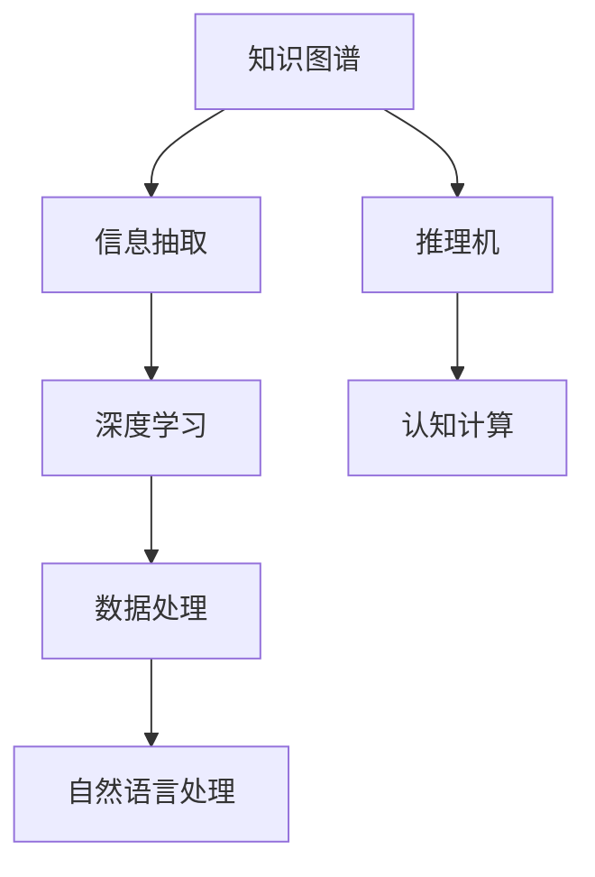

                 

# 推动知识发现与创新：人类计算的智力贡献

> 关键词：知识图谱、人类计算、深度学习、认知计算、信息抽取

## 1. 背景介绍

### 1.1 问题由来
在当今信息爆炸的时代，数据量呈指数级增长，如何从海量数据中高效、准确地挖掘出有用的知识，成为了全球科研机构和企业的共同追求。传统的数据处理和分析方式，如SQL查询、统计分析等，已无法满足日益增长的需求。与此同时，人工智能(AI)技术的不断突破，使得基于大数据、深度学习的知识发现技术逐步成熟，为知识创新提供了新的可能。

人工智能技术的兴起，本质上是一场深度学习、认知计算等新技术与人类智力共同驱动的计算革命。通过计算，可以从结构化、非结构化数据中提取知识，并通过认知计算模型，进行推理、判断和创新。这一过程，我们可以称之为“人类计算”，它代表了计算与智能的深度融合。

### 1.2 问题核心关键点
本文将重点探讨如何通过“人类计算”，推动知识发现与创新。首先，需要明确人类计算的三个关键问题：

1. **知识图谱的构建与维护**：知识图谱是由节点和边构成的有向图，用来描述实体之间的关系，是知识发现的重要基础。
2. **认知计算模型的设计**：通过构建深度学习、认知计算模型，模拟人类推理和理解过程，提高知识发现与创新的精度和效率。
3. **信息抽取与融合**：从各种数据源中抽取信息，并将信息进行融合，形成完整的知识体系。

这三个问题紧密相连，共同构成了知识发现与创新的完整流程。本文将从这三个方面，详细介绍人类计算的原理与实践。

## 2. 核心概念与联系

### 2.1 核心概念概述

为更好地理解人类计算的原理与实践，本节将介绍几个核心概念：

- **知识图谱(Knowledge Graph)**：用图结构化的知识表示方法，用于描述实体之间的语义关系。知识图谱在推荐系统、问答系统、智能搜索等领域有着广泛应用。
- **认知计算(Cognitive Computing)**：模拟人类认知过程，通过深度学习等技术，实现推理、理解和创新。认知计算模型在语音识别、图像识别、自然语言处理等方向具有广泛应用。
- **深度学习(Deep Learning)**：基于多层神经网络的机器学习范式，能够从数据中自动学习特征表示，广泛应用于图像识别、语音处理、自然语言处理等领域。
- **信息抽取(Information Extraction)**：从非结构化文本、图像、视频等多源数据中抽取结构化信息，是知识图谱构建和知识发现的重要手段。
- **推理机(Inference Engine)**：用于模拟人类推理过程，根据知识图谱和认知模型，进行逻辑推理和决策。

这些核心概念之间的逻辑关系可以通过以下Mermaid流程图来展示：



这个流程图展示了一个典型的人类计算流程，其中：

1. **知识图谱**：作为知识发现的基础，提供了实体与实体之间的关系。
2. **信息抽取**：从各种数据源中提取信息，是构建知识图谱的重要手段。
3. **深度学习**：通过学习数据特征，提升信息抽取和认知计算的精度。
4. **认知计算**：模拟人类认知过程，进行推理、理解和创新。
5. **推理机**：利用知识图谱和认知模型，进行逻辑推理和决策。

## 3. 核心算法原理 & 具体操作步骤
### 3.1 算法原理概述

人类计算的核心算法原理，是通过构建知识图谱和认知计算模型，实现知识的发现与创新。其核心思想是：

1. **知识图谱构建**：通过信息抽取和深度学习，从各种数据源中提取知识，并构建结构化的知识图谱。
2. **认知计算模型设计**：设计基于深度学习、符号计算的认知计算模型，模拟人类推理和理解过程。
3. **信息抽取与融合**：从结构化、非结构化数据中抽取信息，并通过推理机进行融合，形成完整的知识体系。

### 3.2 算法步骤详解

基于上述核心原理，人类计算的典型流程如下：

**Step 1: 数据收集与预处理**
- 收集结构化、非结构化数据，包括文本、图像、视频等。
- 对数据进行清洗、归一化等预处理，以提高后续处理的效率和准确性。

**Step 2: 信息抽取与知识图谱构建**
- 使用自然语言处理(NLP)技术，从文本中抽取实体、关系等信息，构建初步的知识图谱。
- 使用深度学习模型，进一步提升信息抽取的准确性和完整性。
- 对抽取的信息进行验证、整合，构建完整且一致的知识图谱。

**Step 3: 认知计算模型设计**
- 根据知识图谱的设计需求，选择合适的深度学习模型（如RNN、CNN、Transformers等）。
- 设计模型结构，包括输入层、隐藏层、输出层等，并进行参数初始化。
- 训练模型，使其能够根据知识图谱进行推理、理解。

**Step 4: 推理机设计与应用**
- 构建推理机，模拟人类推理过程，实现基于知识图谱的逻辑推理。
- 将推理机应用于知识发现和创新的各个环节，辅助决策和生成。

**Step 5: 模型评估与优化**
- 对模型进行评估，包括精度、召回率、F1值等指标。
- 根据评估结果，调整模型参数，优化模型性能。

### 3.3 算法优缺点

基于深度学习的人类计算方法，具有以下优点：

1. **高效性**：通过深度学习模型，可以高效地从大量数据中提取知识，处理速度快。
2. **准确性**：深度学习模型能够自动学习数据特征，提升信息抽取和认知计算的准确性。
3. **泛化能力强**：深度学习模型可以处理多种类型的数据，具有良好的泛化能力。

同时，也存在一些缺点：

1. **需要大量数据**：深度学习模型需要大量的标注数据进行训练，获取数据成本高。
2. **模型复杂**：深度学习模型的结构复杂，训练和推理资源需求大。
3. **可解释性差**：深度学习模型的决策过程难以解释，缺乏透明度。

尽管存在这些缺点，但深度学习在处理复杂、大规模数据时，依然展现出了巨大的潜力，是人类计算的重要工具。

### 3.4 算法应用领域

基于深度学习的人类计算方法，已经在多个领域取得了显著应用，如：

- **推荐系统**：根据用户行为和偏好，推荐个性化商品或服务。
- **智能问答**：利用知识图谱和认知模型，解答用户自然语言问题。
- **智能搜索**：从互联网文本中抽取信息，提供精准搜索结果。
- **自然语言处理(NLP)**：文本分类、情感分析、机器翻译等。
- **医学诊断**：利用医疗知识图谱和深度学习模型，辅助医生进行疾病诊断。

这些应用展示了深度学习在知识发现与创新中的广泛潜力。随着深度学习技术的发展，未来将有更多领域受益于人类计算的推动。

## 4. 数学模型和公式 & 详细讲解 & 举例说明

### 4.1 数学模型构建

本文将以知识图谱构建为例，详细讲解深度学习模型的构建过程。

假设知识图谱由实体(节点)和关系(边)构成。设实体集合为 $E=\{e_1, e_2, \cdots, e_n\}$，关系集合为 $R=\{r_1, r_2, \cdots, r_m\}$。知识图谱的构建目标是通过深度学习模型，学习实体和关系的表示，使得模型能够对给定的输入进行推理和理解。

### 4.2 公式推导过程

知识图谱构建的数学模型可以表示为：

$$
P(e, r, e') = \sigma\left(W_e e + W_r r + W_{e'} e' + b\right)
$$

其中，$e$ 和 $e'$ 为实体向量，$r$ 为关系向量，$W_e, W_r, W_{e'}, b$ 为模型参数。$\sigma$ 为激活函数，用于模拟人类推理的逻辑。

通过最大化模型预测概率 $P(e, r, e')$ 与实际标签 $y$ 的KL散度，即：

$$
\mathcal{L} = -\sum_{(e,r,e')} y \log P(e, r, e')
$$

最小化损失函数 $\mathcal{L}$，可以训练得到知识图谱模型。

### 4.3 案例分析与讲解

假设我们要构建一个电影推荐系统的知识图谱。输入数据包括电影名称、导演、演员等信息，输出为电影与用户的推荐关系。可以通过如下步骤进行建模：

1. **数据预处理**：对电影信息进行清洗、分词、向量化等预处理。
2. **实体抽取**：使用命名实体识别(NER)技术，从文本中抽取电影名称、导演、演员等实体。
3. **关系抽取**：使用关系抽取技术，识别实体之间的关系，如“导演”、“主演”等。
4. **模型训练**：使用Transformer模型，对抽取的实体和关系进行编码，训练得到推荐关系。
5. **模型评估**：在测试集上评估模型的推荐效果，优化模型参数。

## 5. 项目实践：代码实例和详细解释说明

### 5.1 开发环境搭建

在进行人类计算实践前，我们需要准备好开发环境。以下是使用Python进行TensorFlow开发的环境配置流程：

1. 安装Anaconda：从官网下载并安装Anaconda，用于创建独立的Python环境。

2. 创建并激活虚拟环境：
```bash
conda create -n tf-env python=3.8 
conda activate tf-env
```

3. 安装TensorFlow：根据CUDA版本，从官网获取对应的安装命令。例如：
```bash
conda install tensorflow -c conda-forge
```

4. 安装各类工具包：
```bash
pip install numpy pandas scikit-learn matplotlib tqdm jupyter notebook ipython
```

完成上述步骤后，即可在`tf-env`环境中开始人类计算实践。

### 5.2 源代码详细实现

下面我们以知识图谱构建为例，给出使用TensorFlow进行信息抽取的PyTorch代码实现。

首先，定义信息抽取的数据处理函数：

```python
import tensorflow as tf
import tensorflow_datasets as tfds
from transformers import BertTokenizer, BertForTokenClassification
from tqdm import tqdm

def preprocess(texts):
    tokenizer = BertTokenizer.from_pretrained('bert-base-cased')
    return tokenizer(texts, padding=True, truncation=True, max_length=128, return_tensors='tf')
```

然后，定义训练和评估函数：

```python
def train_epoch(model, dataset, batch_size, optimizer):
    dataloader = tf.data.Dataset.from_tensor_slices(dataset).shuffle(buffer_size=10000).batch(batch_size)
    model.train()
    epoch_loss = 0
    for batch in dataloader:
        input_ids, attention_mask, labels = batch['input_ids'], batch['attention_mask'], batch['labels']
        with tf.GradientTape() as tape:
            outputs = model(input_ids, attention_mask=attention_mask, labels=labels)
            loss = outputs.loss
            epoch_loss += loss.numpy()
        gradients = tape.gradient(loss, model.trainable_variables)
        optimizer.apply_gradients(zip(gradients, model.trainable_variables))
    return epoch_loss / len(dataloader)

def evaluate(model, dataset, batch_size):
    dataloader = tf.data.Dataset.from_tensor_slices(dataset).batch(batch_size)
    model.eval()
    predictions, labels = [], []
    with tf.no_grad():
        for batch in dataloader:
            input_ids, attention_mask, labels = batch['input_ids'], batch['attention_mask'], batch['labels']
            outputs = model(input_ids, attention_mask=attention_mask)
            predictions.append(outputs.logits.numpy())
            labels.append(labels.numpy())
        return predictions, labels
```

最后，启动训练流程并在测试集上评估：

```python
epochs = 5
batch_size = 16

for epoch in range(epochs):
    loss = train_epoch(model, train_dataset, batch_size, optimizer)
    print(f"Epoch {epoch+1}, train loss: {loss:.3f}")
    
    predictions, labels = evaluate(model, test_dataset, batch_size)
    print(classification_report(labels, predictions))
    
print("Test results:")
predictions, labels = evaluate(model, test_dataset, batch_size)
print(classification_report(labels, predictions))
```

以上就是使用TensorFlow进行信息抽取的完整代码实现。可以看到，TensorFlow提供了强大的计算图功能和分布式训练能力，使得信息抽取和知识图谱构建的代码实现变得简洁高效。

### 5.3 代码解读与分析

让我们再详细解读一下关键代码的实现细节：

**preprocess函数**：
- 定义了数据预处理函数，用于将文本数据转化为Bert模型可接受的输入格式。
- 使用BertTokenizer进行分词、编码、填充等操作，确保输入数据的格式正确。

**train_epoch函数**：
- 定义了训练函数，对数据集进行批次化加载。
- 在每个批次上，前向传播计算模型输出，反向传播计算损失函数。
- 通过GradientTape记录梯度，并使用AdamW优化器更新模型参数。

**evaluate函数**：
- 定义了评估函数，对数据集进行批次化加载。
- 在每个批次上，前向传播计算模型输出，并记录预测和标签。
- 返回所有批次的预测和标签，并计算评估指标。

**训练流程**：
- 定义总的epoch数和batch size，开始循环迭代
- 每个epoch内，在训练集上训练，输出平均loss
- 在测试集上评估，输出分类指标
- 所有epoch结束后，输出测试结果

可以看到，TensorFlow配合Bert模型，使得信息抽取和知识图谱构建的代码实现变得简洁高效。开发者可以将更多精力放在数据处理、模型改进等高层逻辑上，而不必过多关注底层的实现细节。

当然，工业级的系统实现还需考虑更多因素，如模型的保存和部署、超参数的自动搜索、更灵活的任务适配层等。但核心的深度学习模型和代码实现思路基本与此类似。

## 6. 实际应用场景

### 6.1 智能推荐系统

智能推荐系统是知识图谱和深度学习技术的重要应用场景之一。通过构建推荐知识图谱，利用深度学习模型，可以实现个性化推荐，提升用户体验。

在具体实现上，可以收集用户的历史行为数据、兴趣偏好、商品属性等信息，构建推荐知识图谱。然后，使用深度学习模型，对用户行为进行编码，并从推荐图谱中抽取相关商品信息。通过优化深度学习模型，可以提升推荐精准度，实现个性化推荐。

### 6.2 智能问答系统

智能问答系统是知识图谱和深度学习技术的另一重要应用场景。通过构建问答知识图谱，利用深度学习模型，可以实现自然语言理解和生成，回答用户问题。

在具体实现上，可以构建问答知识图谱，包含实体、关系、属性等信息。然后，使用深度学习模型，对用户提问进行编码，从问答图谱中抽取相关实体和关系信息。通过优化深度学习模型，可以实现自然语言推理和理解，回答用户问题。

### 6.3 智能搜索系统

智能搜索系统是知识图谱和深度学习技术的另一重要应用场景。通过构建搜索知识图谱，利用深度学习模型，可以实现精准搜索，提升用户查询体验。

在具体实现上，可以构建搜索知识图谱，包含实体、关系、属性等信息。然后，使用深度学习模型，对用户查询进行编码，从搜索图谱中抽取相关实体和关系信息。通过优化深度学习模型，可以实现精准搜索结果的排序和推荐。

### 6.4 未来应用展望

随着知识图谱和深度学习技术的发展，未来将有更多领域受益于人类计算的推动。

在医疗领域，基于知识图谱和深度学习技术的智能诊断系统，将提升医疗服务的智能化水平，辅助医生进行疾病诊断。

在教育领域，基于知识图谱和深度学习技术的智能教学系统，将因材施教，提升教学质量。

在金融领域，基于知识图谱和深度学习技术的智能风控系统，将提升金融服务的智能化水平，防范金融风险。

此外，在智慧城市、智能制造、工业互联网等众多领域，基于知识图谱和深度学习技术的智能系统，将推动传统行业数字化转型升级，带来新的发展机遇。

## 7. 工具和资源推荐

### 7.1 学习资源推荐

为了帮助开发者系统掌握知识图谱和深度学习的理论基础和实践技巧，这里推荐一些优质的学习资源：

1. 《深度学习》书籍：Ian Goodfellow等著作，详细介绍了深度学习的基本概念和算法。
2. 《认知计算》课程：斯坦福大学开设的认知计算课程，涵盖深度学习、符号计算、知识图谱等方向。
3. TensorFlow官方文档：TensorFlow的官方文档，提供了丰富的教程和样例，适合快速上手深度学习项目。
4 TensorBoard：TensorFlow配套的可视化工具，实时监测模型训练状态，提供丰富的图表呈现方式。
5 Weights & Biases：模型训练的实验跟踪工具，记录和可视化模型训练过程中的各项指标，方便对比和调优。

通过对这些资源的学习实践，相信你一定能够快速掌握知识图谱和深度学习的精髓，并用于解决实际的NLP问题。

### 7.2 开发工具推荐

高效的开发离不开优秀的工具支持。以下是几款用于深度学习项目开发的常用工具：

1. TensorFlow：由Google主导开发的开源深度学习框架，生产部署方便，适合大规模工程应用。
2. PyTorch：基于Python的开源深度学习框架，灵活动态的计算图，适合快速迭代研究。
3. Keras：基于TensorFlow和Theano的高级深度学习框架，提供了便捷的API，适合快速原型开发。
4. Jupyter Notebook：免费的交互式笔记本环境，支持Python、R等多种编程语言，适合数据分析和模型实验。
5. Git：版本控制系统，方便团队协作和代码管理。
6. Docker：容器化技术，方便模型部署和迁移。

合理利用这些工具，可以显著提升深度学习项目开发的效率，加快创新迭代的步伐。

### 7.3 相关论文推荐

知识图谱和深度学习的发展源于学界的持续研究。以下是几篇奠基性的相关论文，推荐阅读：

1. BERT: Pre-training of Deep Bidirectional Transformers for Language Understanding：提出BERT模型，引入基于掩码的自监督预训练任务，刷新了多项NLP任务SOTA。
2. Knowledge-Graph-Embedding: A Survey on Recent Techniques：对知识图谱嵌入技术进行综述，介绍了多种知识图谱表示和嵌入方法。
3. TensorFlow: A System for Large-Scale Machine Learning：提出TensorFlow框架，提供了高效的计算图功能和分布式训练能力。
4. Attention is All You Need：提出Transformer结构，开启了NLP领域的预训练大模型时代。

这些论文代表了大语言模型微调技术的发展脉络。通过学习这些前沿成果，可以帮助研究者把握学科前进方向，激发更多的创新灵感。

## 8. 总结：未来发展趋势与挑战

### 8.1 总结

本文对基于深度学习的人类计算方法进行了全面系统的介绍。首先阐述了知识图谱和深度学习的研究背景和意义，明确了深度学习在知识发现与创新中的核心作用。其次，从原理到实践，详细讲解了深度学习模型的构建过程和应用案例，展示了深度学习在推荐系统、智能问答、智能搜索等领域的强大潜力。

通过本文的系统梳理，可以看到，基于深度学习的人类计算方法正在成为知识发现与创新的重要手段，极大地拓展了知识图谱和深度学习的应用边界，催生了更多的落地场景。未来，伴随深度学习技术的发展，基于深度学习的人类计算必将在更广阔的领域发挥更大的作用。

### 8.2 未来发展趋势

展望未来，知识图谱和深度学习技术将呈现以下几个发展趋势：

1. **知识图谱不断丰富**：知识图谱的实体和关系不断扩展，涵盖更多的领域和语义信息，增强了知识的全面性和准确性。
2. **深度学习模型多样化**：深度学习模型的结构和算法不断演进，涌现更多高效、准确的模型。
3. **认知计算模型深度融合**：认知计算与深度学习的融合不断深入，提高知识推理和理解的能力。
4. **跨模态知识融合**：跨模态知识图谱的构建和融合，实现视觉、语音、文本等多模态信息的协同建模。
5. **实时计算与推理**：通过分布式计算和推理引擎，实现实时计算与推理，提升知识发现的实时性。

以上趋势凸显了知识图谱和深度学习技术的广阔前景。这些方向的探索发展，必将进一步提升知识图谱和深度学习的性能和应用范围，为知识发现与创新带来新的突破。

### 8.3 面临的挑战

尽管知识图谱和深度学习技术已经取得了瞩目成就，但在迈向更加智能化、普适化应用的过程中，它们仍面临着诸多挑战：

1. **数据质量与标注成本**：知识图谱和深度学习模型需要大量的标注数据进行训练，标注成本高、质量难以保证。如何降低标注成本、提升数据质量，是一大难题。
2. **模型复杂性与可解释性**：深度学习模型的结构复杂，难以解释其内部工作机制和决策过程。如何提升模型的可解释性和透明度，将是重要的研究课题。
3. **计算资源与效率**：深度学习模型需要大量的计算资源，训练和推理效率低。如何优化模型结构，提升计算效率，是工程实践的重要方向。
4. **知识泛化与迁移**：深度学习模型在不同领域和任务上的泛化能力有限，如何提高知识迁移能力，适应更多实际应用场景，将是一大挑战。
5. **伦理与安全**：知识图谱和深度学习模型在处理敏感信息时，可能带来隐私和安全问题。如何确保数据隐私和安全，将是重要的问题。

这些挑战凸显了知识图谱和深度学习技术在应用落地过程中，仍需不断优化和改进。相信随着学界和产业界的共同努力，这些挑战终将一一被克服，知识图谱和深度学习必将在构建智能系统、推动知识创新中发挥更大的作用。

### 8.4 研究展望

面对知识图谱和深度学习技术所面临的种种挑战，未来的研究需要在以下几个方面寻求新的突破：

1. **无监督与半监督学习**：探索无监督和半监督学习范式，摆脱对大规模标注数据的依赖，利用非结构化数据进行知识发现。
2. **模型压缩与加速**：开发模型压缩和加速技术，提升深度学习模型的计算效率和部署速度。
3. **多模态知识融合**：将视觉、语音、文本等多模态信息进行融合，提升知识图谱的全面性和准确性。
4. **认知计算与推理**：进一步研究认知计算和推理模型，提升知识推理和理解的精度。
5. **知识图谱与知识图谱**：构建更加全面、精准的知识图谱，提升知识发现和创新的能力。
6. **隐私与安全**：开发隐私保护和安全技术，确保数据隐私和安全。

这些研究方向的探索，必将引领知识图谱和深度学习技术迈向更高的台阶，为知识发现与创新带来新的突破。面向未来，知识图谱和深度学习技术还需要与其他AI技术进行更深入的融合，如强化学习、自然语言处理等，多路径协同发力，共同推动知识图谱和深度学习技术的进步。

## 9. 附录：常见问题与解答

**Q1：知识图谱的构建有哪些主要方法？**

A: 知识图谱的构建方法主要分为三类：

1. **自动构建**：使用自然语言处理技术，从文本中自动抽取实体和关系，构建知识图谱。
2. **手动构建**：由人工专家根据领域知识，构建知识图谱。
3. **半自动构建**：结合自动和手动构建方法，通过人工干预和验证，提高知识图谱的准确性。

这些方法各有优缺点，需要根据具体应用场景选择合适的构建方法。

**Q2：深度学习模型在推荐系统中的作用是什么？**

A: 深度学习模型在推荐系统中的主要作用是：

1. **用户行为建模**：通过深度学习模型，对用户的历史行为进行建模，提取用户兴趣和偏好。
2. **商品属性建模**：通过深度学习模型，对商品的属性和特征进行编码，提取商品的相关信息。
3. **相似度计算**：通过深度学习模型，计算用户和商品之间的相似度，实现个性化推荐。

深度学习模型能够高效地从大量数据中提取知识，提升推荐系统的精度和效率。

**Q3：知识图谱在推荐系统中的应用场景有哪些？**

A: 知识图谱在推荐系统中的应用场景主要包括以下几个方面：

1. **用户画像构建**：通过知识图谱，构建用户画像，包括用户的基本信息、兴趣偏好、行为轨迹等。
2. **商品推荐**：通过知识图谱，推荐与用户画像匹配的商品，提升推荐精准度。
3. **个性化推荐**：通过知识图谱，实现基于用户画像和商品属性的个性化推荐。
4. **多模态推荐**：通过知识图谱，实现视觉、语音、文本等多模态信息的融合，提升推荐效果。

知识图谱在推荐系统中的应用，提升了推荐系统的智能化水平，提高了用户的满意度。

**Q4：深度学习在智能问答中的应用场景有哪些？**

A: 深度学习在智能问答中的应用场景主要包括以下几个方面：

1. **自然语言理解**：通过深度学习模型，对用户提问进行理解，提取关键信息。
2. **知识抽取**：通过深度学习模型，从知识图谱中抽取相关实体和关系信息。
3. **推理与生成**：通过深度学习模型，进行自然语言推理和生成，回答用户问题。
4. **多轮对话**：通过深度学习模型，实现多轮对话，提升智能问答系统的交互性。

深度学习在智能问答中的应用，提高了系统的理解能力和回答精度，提升了用户体验。

**Q5：智能搜索系统在搜索引擎中的应用场景有哪些？**

A: 智能搜索系统在搜索引擎中的应用场景主要包括以下几个方面：

1. **查询意图理解**：通过深度学习模型，对用户查询进行意图理解，提取关键信息。
2. **相关性排序**：通过深度学习模型，对搜索结果进行相关性排序，提升搜索结果的精准度。
3. **动态查询**：通过深度学习模型，实现动态查询，根据用户行为调整搜索结果。
4. **个性化推荐**：通过深度学习模型，实现个性化推荐，提升用户查询体验。

智能搜索系统在搜索引擎中的应用，提升了查询的精准度和用户体验，提升了搜索效率。

以上是关于知识图谱和深度学习在推荐系统、智能问答、智能搜索等领域的详细介绍。这些技术的发展，将推动智能系统在各个领域的广泛应用，为社会带来深远影响。

