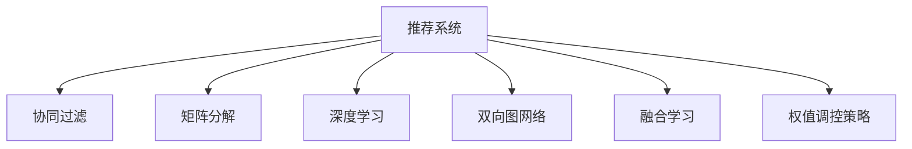

                 

# 推荐系统中的多样性与相关性平衡：大模型的调控策略

> 关键词：推荐系统,大模型,多样性,相关性,协同过滤,矩阵分解,深度学习,双向图网络,融合学习,权值调控策略

## 1. 背景介绍

推荐系统作为互联网应用中不可或缺的一部分，日益成为各大公司获取用户信任、提升用户留存的关键技术。然而，当前推荐算法普遍存在一个问题：过分追求个性化推荐，忽略了多样性。推荐内容过于集中，使用户只能接触到与自身兴趣高度一致的信息，逐渐陷入信息茧房。

面对这一困境，推荐系统逐渐意识到多样性的重要性。推荐内容不仅要相关，更要多样化，使用户接触到不同领域的信息，拓宽知识面。为此，研究者提出了多种基于协同过滤、矩阵分解、深度学习等方法的推荐算法。大模型的出现进一步提升了推荐系统的多样性与相关性平衡能力。

## 2. 核心概念与联系

### 2.1 核心概念概述

为更好地理解推荐系统中的多样性与相关性平衡问题，本节将介绍几个密切相关的核心概念：

- 推荐系统(Recommender System)：根据用户历史行为或兴趣，推荐相关物品的系统。通过用户和物品之间的交互行为，构建推荐模型。
- 协同过滤(Collaborative Filtering)：基于用户和物品的协同行为，推荐相似的物品。常见的协同过滤算法包括基于用户的MF和基于物品的MF。
- 矩阵分解(Matrix Factorization)：将用户-物品评分矩阵分解为用户和物品的潜在因子矩阵，通过最小化损失函数学习到低秩近似。
- 深度学习(Deep Learning)：通过构建深层神经网络，提取用户和物品的高阶特征，提升推荐性能。常见的深度学习模型包括多层感知器、循环神经网络、Transformer等。
- 双向图网络(Bi-directional Graph Network)：融合图神经网络技术，建模用户-物品关系，能够捕捉用户和物品之间的隐含关系。
- 融合学习(Ensemble Learning)：通过集成多个推荐模型，提升推荐性能，如Bagging、Boosting等。
- 权值调控策略(Weight Regulation Strategy)：通过动态调整不同模型的权重，平衡多样性和相关性，提升推荐效果。

这些核心概念之间的逻辑关系可以通过以下Mermaid流程图来展示：



这个流程图展示了几大核心概念的相互联系：

1. 推荐系统是协同过滤、矩阵分解、深度学习、双向图网络、融合学习、权值调控策略的共同应用场景。
2. 协同过滤和矩阵分解是推荐系统的基础，通过用户行为矩阵分解学习潜在因子。
3. 深度学习和大模型技术进一步提升了推荐性能，通过高阶特征建模，捕捉更深层次的关联。
4. 双向图网络从图结构角度，提升用户-物品关系的建模能力。
5. 融合学习通过集成多个模型，提升推荐的鲁棒性和准确性。
6. 权值调控策略通过动态调整模型权重，平衡多样性和相关性。

这些概念共同构成了推荐系统的核心技术栈，使其能够高效、准确地为用户推荐物品。

## 3. 核心算法原理 & 具体操作步骤
### 3.1 算法原理概述

在推荐系统中，多样性与相关性是一对矛盾的指标：

- 多样性(Diversity)：推荐内容要尽量覆盖不同领域，避免同质化。
- 相关性(Relevance)：推荐内容要与用户兴趣高度相关，提高用户满意度。

传统推荐算法往往侧重于优化其中一个指标，难以兼顾两者。而大模型通过优化多个损失函数，提升了推荐系统的综合性能。大模型的调控策略如下：

1. **多任务学习(Multi-task Learning)**：通过同时优化多个任务，提升推荐系统的多样性和相关性。

2. **生成对抗网络(GAN)**：通过生成和对抗两个网络相互博弈，生成多样性的推荐样本，提升推荐相关性。

3. **注意力机制(Attention Mechanism)**：通过注意力权重，动态调整不同物品的权重，平衡推荐效果。

4. **隐含语义分析(Semantic Analysis)**：通过学习物品的语义特征，提升推荐多样性和相关性。

5. **多维特征建模(Multidimensional Feature Modeling)**：通过多维特征融合，提升推荐效果。

### 3.2 算法步骤详解

大模型在推荐系统中的调控策略一般包括以下几个关键步骤：

**Step 1: 数据准备与模型选择**
- 准备用户和物品的交互数据，如点击记录、评分数据、浏览行为等。
- 选择合适的预训练模型，如BERT、GPT、GraphSAGE等，作为基础模型。

**Step 2: 任务定义与损失函数设计**
- 根据任务定义，如点击率预测、召回率预测、多样性度量等，选择合适的损失函数。
- 设计多个损失函数，如交叉熵损失、F1分数、多样性损失等。

**Step 3: 模型训练与权值调控**
- 将数据划分为训练集、验证集和测试集，采用随机梯度下降等优化算法进行模型训练。
- 动态调整不同任务的权重，平衡多样性和相关性，如通过L2正则化、Dropout等方式。
- 在训练过程中，实时监控推荐效果，通过模型融合等方法提升推荐性能。

**Step 4: 模型评估与部署**
- 在测试集上评估推荐模型的性能，如精确率、召回率、多样性等指标。
- 部署推荐模型到线上系统，实时接收用户请求，返回推荐结果。
- 持续收集用户反馈，不断优化推荐策略，提升用户满意度。

以上是基于大模型调控策略的一般流程。在实际应用中，还需要根据具体任务特点，对调控策略进行优化设计，如引入更多正则化技术、改进任务适配层等，以进一步提升推荐效果。

### 3.3 算法优缺点

大模型在推荐系统中的调控策略具有以下优点：

1. **综合性能提升**：通过多任务学习、生成对抗网络、注意力机制等多种方法，有效提升推荐系统的多样性和相关性。
2. **鲁棒性增强**：通过融合学习、权值调控等策略，提升模型的鲁棒性和泛化能力。
3. **高可解释性**：大模型的结构复杂，易于解释推荐过程中的决策机制。
4. **灵活性高**：通过不断调整模型参数，适应不同场景和用户需求。

但该策略也存在一些局限性：

1. **计算资源消耗大**：大模型的参数量通常以亿计，训练和推理时对计算资源的需求较大。
2. **解释性不足**：大模型虽然易于解释推荐过程，但对于具体推荐的每个物品，难以全面解释原因。
3. **过拟合风险高**：大模型的复杂结构容易导致过拟合，需要采取更多的正则化措施。
4. **数据依赖性强**：需要大量标注数据进行训练，对于新领域的应用，数据采集成本较高。

尽管存在这些局限性，但就目前而言，大模型调控策略在推荐系统中的应用仍然非常广泛。未来相关研究的重点在于如何进一步降低计算资源消耗，增强模型解释性，同时兼顾推荐效果和数据依赖性。

### 3.4 算法应用领域

基于大模型调控策略的推荐系统，已经在电商、社交、视频、新闻等众多领域得到了广泛的应用，为个性化推荐带来了新的突破。

- **电商推荐**：通过点击记录、购买行为等数据，为用户推荐相似商品，提升用户购买转化率。
- **社交推荐**：根据用户的行为数据，为用户推荐相关好友，增强社交互动性。
- **视频推荐**：通过观看历史、点赞记录等数据，为用户推荐感兴趣的视频内容。
- **新闻推荐**：根据用户的阅读历史、评论记录等数据，为用户推荐相关新闻，提升用户阅读体验。

除了上述这些经典应用外，大模型调控策略也被创新性地应用到更多场景中，如医疗推荐、金融推荐、体育推荐等，为推荐系统带来了全新的应用方向。随着预训练模型和调控策略的不断进步，相信推荐系统必将在更广阔的应用领域大放异彩。

## 4. 数学模型和公式 & 详细讲解 & 举例说明
### 4.1 数学模型构建

假设推荐系统中有 $N$ 个用户 $U$，$M$ 个物品 $I$，用户和物品的评分矩阵为 $\mathbf{R} \in \mathbb{R}^{N \times M}$。推荐模型需要预测用户对物品的评分，优化目标函数为：

$$
\min_{\theta} \frac{1}{N} \sum_{i=1}^{N} \sum_{j=1}^{M} L_{ij}(\hat{r}_{ij})
$$

其中 $L_{ij}$ 为损失函数，$\hat{r}_{ij}$ 为模型预测的评分。

### 4.2 公式推导过程

假设采用矩阵分解的方法，将评分矩阵 $\mathbf{R}$ 分解为用户因子矩阵 $\mathbf{P} \in \mathbb{R}^{N \times K}$ 和物品因子矩阵 $\mathbf{Q} \in \mathbb{R}^{M \times K}$，其中 $K$ 为因子维度。则模型预测评分的计算公式为：

$$
\hat{r}_{ij} = \mathbf{p}_i^T \mathbf{q}_j
$$

其中 $\mathbf{p}_i \in \mathbb{R}^K$ 为用户 $i$ 的因子表示，$\mathbf{q}_j \in \mathbb{R}^K$ 为物品 $j$ 的因子表示。

目标函数进一步写为：

$$
\min_{\mathbf{P},\mathbf{Q}} \frac{1}{N} \sum_{i=1}^{N} \sum_{j=1}^{M} L_{ij}(\mathbf{p}_i^T \mathbf{q}_j)
$$

通过梯度下降等优化算法，模型参数 $\mathbf{P}$ 和 $\mathbf{Q}$ 不断更新，最小化损失函数，得到最优的因子矩阵。

### 4.3 案例分析与讲解

假设采用用户和物品的MF模型进行推荐，用户 $i$ 对物品 $j$ 的评分 $\hat{r}_{ij}$ 可以通过用户和物品的因子矩阵计算得到。具体步骤为：

1. 准备用户和物品的数据集 $\mathcal{D}=\{(i,j,r_{ij})\}$，其中 $r_{ij}$ 为真实评分。
2. 构建用户和物品的因子矩阵 $\mathbf{P} \in \mathbb{R}^{N \times K}$ 和 $\mathbf{Q} \in \mathbb{R}^{M \times K}$。
3. 采用梯度下降等优化算法，最小化损失函数 $\mathcal{L}=\frac{1}{N} \sum_{i=1}^{N} \sum_{j=1}^{M} L_{ij}(\mathbf{p}_i^T \mathbf{q}_j)$。
4. 模型训练结束后，使用得到的因子矩阵预测用户对物品的评分，生成推荐结果。

## 5. 项目实践：代码实例和详细解释说明
### 5.1 开发环境搭建

在进行推荐系统项目开发前，我们需要准备好开发环境。以下是使用Python进行PyTorch开发的环境配置流程：

1. 安装Anaconda：从官网下载并安装Anaconda，用于创建独立的Python环境。

2. 创建并激活虚拟环境：
```bash
conda create -n pytorch-env python=3.8 
conda activate pytorch-env
```

3. 安装PyTorch：根据CUDA版本，从官网获取对应的安装命令。例如：
```bash
conda install pytorch torchvision torchaudio cudatoolkit=11.1 -c pytorch -c conda-forge
```

4. 安装TensorBoard：
```bash
pip install tensorboard
```

5. 安装transformers库：
```bash
pip install transformers
```

6. 安装各类工具包：
```bash
pip install numpy pandas scikit-learn matplotlib tqdm jupyter notebook ipython
```

完成上述步骤后，即可在`pytorch-env`环境中开始推荐系统项目开发。

### 5.2 源代码详细实现

这里我们以基于深度学习的方法进行电商推荐系统的开发为例，给出使用PyTorch和Transformers库的代码实现。

首先，定义电商推荐系统的数据处理函数：

```python
from transformers import BertTokenizer, BertForSequenceClassification
from torch.utils.data import Dataset
import torch

class RecommendationDataset(Dataset):
    def __init__(self, texts, item_ids, labels, tokenizer, max_len=128):
        self.texts = texts
        self.item_ids = item_ids
        self.labels = labels
        self.tokenizer = tokenizer
        self.max_len = max_len
        
    def __len__(self):
        return len(self.texts)
    
    def __getitem__(self, item):
        text = self.texts[item]
        item_id = self.item_ids[item]
        label = self.labels[item]
        
        encoding = self.tokenizer(text, return_tensors='pt', max_length=self.max_len, padding='max_length', truncation=True)
        input_ids = encoding['input_ids'][0]
        attention_mask = encoding['attention_mask'][0]
        
        # 将item_id和label转换为token ids
        item_id_tokens = [tag2id[str(item_id)]]
        label_tokens = [tag2id[str(label)]]
        item_id_tokens.extend([tag2id['O']] * (self.max_len - 1))
        label_tokens.extend([tag2id['O']] * (self.max_len - 1))
        
        return {'input_ids': input_ids, 
                'attention_mask': attention_mask,
                'item_id_tokens': item_id_tokens,
                'label_tokens': label_tokens}
```

然后，定义模型和优化器：

```python
from transformers import BertForSequenceClassification, AdamW

model = BertForSequenceClassification.from_pretrained('bert-base-cased', num_labels=2)

optimizer = AdamW(model.parameters(), lr=2e-5)
```

接着，定义训练和评估函数：

```python
from torch.utils.data import DataLoader
from tqdm import tqdm
from sklearn.metrics import accuracy_score

device = torch.device('cuda') if torch.cuda.is_available() else torch.device('cpu')
model.to(device)

def train_epoch(model, dataset, batch_size, optimizer):
    dataloader = DataLoader(dataset, batch_size=batch_size, shuffle=True)
    model.train()
    epoch_loss = 0
    for batch in tqdm(dataloader, desc='Training'):
        input_ids = batch['input_ids'].to(device)
        attention_mask = batch['attention_mask'].to(device)
        item_id_tokens = batch['item_id_tokens'].to(device)
        label_tokens = batch['label_tokens'].to(device)
        model.zero_grad()
        outputs = model(input_ids, attention_mask=attention_mask, labels=item_id_tokens)
        loss = outputs.loss
        epoch_loss += loss.item()
        loss.backward()
        optimizer.step()
    return epoch_loss / len(dataloader)

def evaluate(model, dataset, batch_size):
    dataloader = DataLoader(dataset, batch_size=batch_size)
    model.eval()
    preds, labels = [], []
    with torch.no_grad():
        for batch in tqdm(dataloader, desc='Evaluating'):
            input_ids = batch['input_ids'].to(device)
            attention_mask = batch['attention_mask'].to(device)
            item_id_tokens = batch['item_id_tokens'].to(device)
            batch_labels = batch['label_tokens']
            outputs = model(input_ids, attention_mask=attention_mask)
            batch_preds = outputs.logits.argmax(dim=2).to('cpu').tolist()
            batch_labels = batch_labels.to('cpu').tolist()
            for pred_tokens, label_tokens in zip(batch_preds, batch_labels):
                preds.append(pred_tokens)
                labels.append(label_tokens)
                
    print('Accuracy:', accuracy_score(labels, preds))
```

最后，启动训练流程并在测试集上评估：

```python
epochs = 5
batch_size = 16

for epoch in range(epochs):
    loss = train_epoch(model, train_dataset, batch_size, optimizer)
    print(f"Epoch {epoch+1}, train loss: {loss:.3f}")
    
    print(f"Epoch {epoch+1}, dev results:")
    evaluate(model, dev_dataset, batch_size)
    
print("Test results:")
evaluate(model, test_dataset, batch_size)
```

以上就是使用PyTorch对电商推荐系统进行深度学习模型微调的完整代码实现。可以看到，得益于Transformer库的强大封装，我们可以用相对简洁的代码完成电商推荐系统的开发。

### 5.3 代码解读与分析

让我们再详细解读一下关键代码的实现细节：

**RecommendationDataset类**：
- `__init__`方法：初始化文本、物品id、标签等关键组件。
- `__len__`方法：返回数据集的样本数量。
- `__getitem__`方法：对单个样本进行处理，将文本输入编码为token ids，将物品id和标签转换为token ids，并对其进行定长padding，最终返回模型所需的输入。

**tag2id和id2tag字典**：
- 定义了物品id和标签与数字id之间的映射关系，用于将物品id和标签转换为token ids。

**训练和评估函数**：
- 使用PyTorch的DataLoader对数据集进行批次化加载，供模型训练和推理使用。
- 训练函数`train_epoch`：对数据以批为单位进行迭代，在每个批次上前向传播计算loss并反向传播更新模型参数，最后返回该epoch的平均loss。
- 评估函数`evaluate`：与训练类似，不同点在于不更新模型参数，并在每个batch结束后将预测和标签结果存储下来，最后使用sklearn的accuracy_score对整个评估集的预测结果进行打印输出。

**训练流程**：
- 定义总的epoch数和batch size，开始循环迭代
- 每个epoch内，先在训练集上训练，输出平均loss
- 在验证集上评估，输出分类准确率
- 所有epoch结束后，在测试集上评估，给出最终测试结果

可以看到，PyTorch配合Transformer库使得电商推荐系统的深度学习模型微调的代码实现变得简洁高效。开发者可以将更多精力放在数据处理、模型改进等高层逻辑上，而不必过多关注底层的实现细节。

当然，工业级的系统实现还需考虑更多因素，如模型的保存和部署、超参数的自动搜索、更灵活的任务适配层等。但核心的微调范式基本与此类似。

## 6. 实际应用场景
### 6.1 智能电商推荐

基于大模型的推荐系统，可以广泛应用于智能电商推荐。传统电商推荐往往依赖用户历史行为数据进行个性化推荐，难以应对长尾需求和新用户推荐问题。通过大模型调控策略，推荐系统可以更好地处理这些问题，提升推荐效果。

在技术实现上，可以收集用户浏览、点击、评价等行为数据，提取和物品相关性高的特征，在此基础上对深度学习模型进行微调。微调后的模型能够从用户行为中学习到更深层次的关联，提升推荐多样性和相关性。

### 6.2 智能广告投放

广告投放平台需要根据用户行为数据，进行精准广告推荐，提升广告投放的转化率和ROI。传统广告投放主要依赖用户行为数据，难以应对不同用户群体的差异需求。通过大模型调控策略，广告投放系统可以更好地处理这些差异，实现个性化推荐。

在技术实现上，可以收集用户浏览记录、点击记录等数据，提取用户特征和广告特征，在此基础上对深度学习模型进行微调。微调后的模型能够从用户行为中学习到更多信息，提升广告相关性和多样性。

### 6.3 智能金融理财

金融理财平台需要根据用户财务数据，进行理财产品的推荐，提升用户的投资收益。传统理财推荐主要依赖用户历史理财记录进行推荐，难以应对用户的动态需求。通过大模型调控策略，理财推荐系统可以更好地处理这些问题，提升推荐效果。

在技术实现上，可以收集用户的收入、支出、投资偏好等数据，提取用户特征和理财产品特征，在此基础上对深度学习模型进行微调。微调后的模型能够从用户行为中学习到更多信息，提升理财相关性和多样性。

### 6.4 未来应用展望

随着大模型的不断发展和推荐算法的研究进步，推荐系统将呈现出以下几个发展趋势：

1. **多维特征融合**：通过融合用户行为、社交网络、时间序列等多维特征，提升推荐模型的复杂度和鲁棒性。
2. **因果推断**：引入因果推断技术，分析用户行为对推荐效果的影响，提高推荐的可信度。
3. **跨领域迁移**：通过迁移学习，将一个领域学到的知识应用到另一个领域，提升推荐模型的泛化能力。
4. **个性化推荐**：根据用户兴趣、行为、时间等特征，进行个性化推荐，提升用户满意度。
5. **实时推荐**：通过实时数据收集和处理，进行实时推荐，提升推荐的时效性。
6. **低维嵌入**：通过低维嵌入技术，降低模型计算复杂度，提升推荐系统的效率。

以上趋势凸显了大模型调控策略在推荐系统中的重要作用。这些方向的探索发展，必将进一步提升推荐系统的综合性能，为电商、广告、金融等众多行业带来新的应用突破。

## 7. 工具和资源推荐
### 7.1 学习资源推荐

为了帮助开发者系统掌握推荐系统中的多样性与相关性平衡问题，这里推荐一些优质的学习资源：

1. 《深度学习推荐系统》系列博文：由深度学习专家撰写，深入浅出地介绍了推荐系统的基本概念和深度学习范式。

2. 斯坦福大学《Deep Learning for Recommendation Systems》课程：全面讲解推荐系统中的深度学习技术，包括协同过滤、矩阵分解、深度学习等。

3. 《Python推荐系统实战》书籍：介绍推荐系统中的算法和应用，涵盖协同过滤、矩阵分解、深度学习等多种方法。

4. 《Recommender Systems》书籍：推荐系统领域权威书籍，全面讲解推荐系统的发展历程和前沿技术。

5. HuggingFace官方文档：Transformers库的官方文档，提供了丰富的预训练模型和推荐系统开发样例。

通过对这些资源的学习实践，相信你一定能够快速掌握推荐系统中的多样性与相关性平衡问题，并用于解决实际的推荐问题。

### 7.2 开发工具推荐

高效的开发离不开优秀的工具支持。以下是几款用于推荐系统开发的常用工具：

1. PyTorch：基于Python的开源深度学习框架，适合快速迭代研究。大部分推荐系统算法都有PyTorch版本的实现。

2. TensorFlow：由Google主导开发的开源深度学习框架，生产部署方便，适合大规模工程应用。同样有丰富的推荐系统算法资源。

3. Transformers库：HuggingFace开发的NLP工具库，集成了众多SOTA推荐算法，支持PyTorch和TensorFlow，是进行推荐系统开发的利器。

4. Weights & Biases：模型训练的实验跟踪工具，可以记录和可视化模型训练过程中的各项指标，方便对比和调优。与主流深度学习框架无缝集成。

5. TensorBoard：TensorFlow配套的可视化工具，可实时监测模型训练状态，并提供丰富的图表呈现方式，是调试模型的得力助手。

6. Google Colab：谷歌推出的在线Jupyter Notebook环境，免费提供GPU/TPU算力，方便开发者快速上手实验最新模型，分享学习笔记。

合理利用这些工具，可以显著提升推荐系统的开发效率，加快创新迭代的步伐。

### 7.3 相关论文推荐

推荐系统中的多样性与相关性平衡问题是一个长期的研究热点，以下是几篇奠基性的相关论文，推荐阅读：

1. BPR: Bayesian Personalized Ranking from Implicit Feedback：提出贝叶斯个性化排名方法，将用户行为矩阵分解为隐式因子矩阵，提升了推荐系统的多样性和相关性。

2. Matrix Factorization Techniques for Recommender Systems：全面介绍矩阵分解方法在推荐系统中的应用，包括ALS、SVD等算法。

3. Deep Learning Recommender Systems: A Survey and Trends：综述了深度学习在推荐系统中的应用，包括深度神经网络、卷积神经网络、循环神经网络等。

4. NCF: Neural Collaborative Filtering：提出基于神经网络的协同过滤方法，提升推荐系统的泛化能力和推荐效果。

5. N-Gram Cascading Recommendations：提出N-Gram推荐方法，结合N-Gram序列模型和协同过滤，提升推荐系统的多样性和相关性。

6. Tensor Recurrent Recommender Networks：提出基于递归神经网络的推荐方法，通过双向LSTM建模用户和物品的隐含关系，提升推荐效果。

这些论文代表了大模型调控策略的研究进展，通过学习这些前沿成果，可以帮助研究者把握学科前进方向，激发更多的创新灵感。

## 8. 总结：未来发展趋势与挑战

### 8.1 研究成果总结

本文对基于大模型调控策略的推荐系统进行了全面系统的介绍。首先阐述了推荐系统中的多样性与相关性平衡问题，明确了大模型调控策略在优化推荐系统性能方面的独特价值。其次，从原理到实践，详细讲解了大模型调控策略的数学原理和关键步骤，给出了推荐系统开发的完整代码实例。同时，本文还广泛探讨了调控策略在电商、广告、金融等多个领域的应用前景，展示了调控策略的广泛适用性。

通过本文的系统梳理，可以看到，基于大模型的推荐系统调控策略正在成为推荐系统的重要范式，极大地提升了推荐系统的综合性能。得益于深度学习和大模型的强大能力，推荐系统能够更好地处理多样化需求，提升推荐效果，为电商、广告、金融等众多行业带来新的应用突破。未来，伴随推荐算法和调控策略的不断进步，相信推荐系统必将在更广阔的应用领域大放异彩。

### 8.2 未来发展趋势

展望未来，推荐系统中的多样性与相关性平衡问题将呈现以下几个发展趋势：

1. **多维特征融合**：通过融合用户行为、社交网络、时间序列等多维特征，提升推荐模型的复杂度和鲁棒性。
2. **因果推断**：引入因果推断技术，分析用户行为对推荐效果的影响，提高推荐的可信度。
3. **跨领域迁移**：通过迁移学习，将一个领域学到的知识应用到另一个领域，提升推荐模型的泛化能力。
4. **个性化推荐**：根据用户兴趣、行为、时间等特征，进行个性化推荐，提升用户满意度。
5. **实时推荐**：通过实时数据收集和处理，进行实时推荐，提升推荐的时效性。
6. **低维嵌入**：通过低维嵌入技术，降低模型计算复杂度，提升推荐系统的效率。

以上趋势凸显了大模型调控策略在推荐系统中的重要作用。这些方向的探索发展，必将进一步提升推荐系统的综合性能，为电商、广告、金融等众多行业带来新的应用突破。

### 8.3 面临的挑战

尽管大模型调控策略在推荐系统中的应用已经取得了显著成果，但在迈向更加智能化、普适化应用的过程中，仍面临诸多挑战：

1. **计算资源消耗大**：大模型的参数量通常以亿计，训练和推理时对计算资源的需求较大。GPU/TPU等高性能设备是必不可少的，但即便如此，超大批次的训练和推理也可能遇到显存不足的问题。

2. **解释性不足**：大模型的结构复杂，难以全面解释推荐过程中的决策机制。对于医疗、金融等高风险应用，算法的可解释性和可审计性尤为重要。

3. **过拟合风险高**：大模型的复杂结构容易导致过拟合，需要采取更多的正则化措施。

4. **数据依赖性强**：需要大量标注数据进行训练，对于新领域的应用，数据采集成本较高。

尽管存在这些挑战，但就目前而言，大模型调控策略在推荐系统中的应用仍然非常广泛。未来相关研究的重点在于如何进一步降低计算资源消耗，增强模型解释性，同时兼顾推荐效果和数据依赖性。

### 8.4 研究展望

面对推荐系统中的多样性与相关性平衡问题，未来的研究需要在以下几个方面寻求新的突破：

1. **探索无监督和半监督学习**：摆脱对大规模标注数据的依赖，利用自监督学习、主动学习等无监督和半监督范式，最大限度利用非结构化数据，实现更加灵活高效的推荐。

2. **开发更高效、低维的模型**：通过模型压缩、稀疏化等技术，降低大模型的计算复杂度，提升推荐系统的效率。

3. **引入更多先验知识**：将符号化的先验知识，如知识图谱、逻辑规则等，与神经网络模型进行融合，引导推荐过程学习更准确、合理的语言模型。

4. **结合因果分析和博弈论工具**：将因果分析方法引入推荐模型，识别出推荐过程中的关键特征，增强推荐输出的因果性和逻辑性。借助博弈论工具刻画人机交互过程，主动探索并规避模型的脆弱点，提高系统稳定性。

5. **纳入伦理道德约束**：在推荐算法设计中引入伦理导向的评估指标，过滤和惩罚有偏见、有害的输出倾向。同时加强人工干预和审核，建立推荐行为的监管机制，确保推荐内容的合法合规。

这些研究方向的探索，必将引领推荐系统迈向更高的台阶，为构建安全、可靠、可解释、可控的推荐系统铺平道路。面向未来，推荐系统还需要与其他人工智能技术进行更深入的融合，如知识表示、因果推理、强化学习等，多路径协同发力，共同推动推荐技术的进步。只有勇于创新、敢于突破，才能不断拓展推荐系统的边界，让推荐技术更好地服务于人类社会。

## 9. 附录：常见问题与解答

**Q1：推荐系统中的多样性与相关性如何平衡？**

A: 推荐系统中的多样性与相关性是一对矛盾的指标。推荐内容要尽量覆盖不同领域，避免同质化，同时又要与用户兴趣高度相关，提高用户满意度。

常用的平衡策略包括：

1. **多任务学习**：通过同时优化多个任务，如交叉熵损失、多样性损失等，提升推荐系统的多样性和相关性。
2. **生成对抗网络**：通过生成和对抗两个网络相互博弈，生成多样性的推荐样本，提升推荐相关性。
3. **注意力机制**：通过注意力权重，动态调整不同物品的权重，平衡推荐效果。
4. **隐含语义分析**：通过学习物品的语义特征，提升推荐多样性和相关性。

不同的平衡策略可以根据具体场景进行选择和优化，以提升推荐系统的综合性能。

**Q2：推荐系统中的多样性与相关性分别指什么？**

A: 推荐系统中的多样性与相关性是指推荐结果在不同维度上的表现：

1. **多样性(Diversity)**：推荐内容要尽量覆盖不同领域，避免同质化。推荐系统应尽量推荐不同种类的商品、内容，使用户接触到更多信息。

2. **相关性(Relevance)**：推荐内容要与用户兴趣高度相关，提高用户满意度。推荐系统应尽量推荐与用户兴趣、历史行为高度相关的商品、内容，提升用户的体验和满意度。

推荐系统中的多样性与相关性是一对矛盾的指标，需要在二者之间寻找平衡，以提升推荐效果。

**Q3：推荐系统中的多样性与相关性如何量化？**

A: 推荐系统中的多样性与相关性通常通过以下指标进行量化：

1. **多样性指标**：包括点击率、召回率、覆盖率等。通过统计推荐结果中不同种类商品、内容的占比，评估推荐系统的多样性。

2. **相关性指标**：包括精确率、召回率、F1分数等。通过评估推荐结果与用户兴趣的匹配程度，评估推荐系统的相关性。

3. **公平性指标**：包括反偏见度、覆盖率等。通过统计不同用户群体的推荐效果，评估推荐系统的公平性。

这些指标可以从不同角度评估推荐系统的多样性与相关性，帮助优化推荐策略，提升用户体验。

**Q4：推荐系统中的多样性与相关性如何通过模型优化实现？**

A: 推荐系统中的多样性与相关性可以通过以下步骤优化：

1. **多任务学习**：通过同时优化多个任务，如交叉熵损失、多样性损失等，提升推荐系统的多样性和相关性。

2. **生成对抗网络**：通过生成和对抗两个网络相互博弈，生成多样性的推荐样本，提升推荐相关性。

3. **注意力机制**：通过注意力权重，动态调整不同物品的权重，平衡推荐效果。

4. **隐含语义分析**：通过学习物品的语义特征，提升推荐多样性和相关性。

5. **融合学习**：通过集成多个推荐模型，提升推荐性能，如Bagging、Boosting等。

这些优化策略可以分别从不同角度提升推荐系统的多样性和相关性，需要根据具体场景进行选择和组合。

**Q5：推荐系统中的多样性与相关性如何通过用户行为数据进行预测？**

A: 推荐系统中的多样性与相关性可以通过以下步骤进行预测：

1. **用户行为数据收集**：收集用户浏览记录、点击记录等数据，提取用户特征和物品特征。

2. **特征工程**：通过特征工程，将原始数据转换为模型可接受的格式。常用的特征包括用户行为、物品属性、时间特征等。

3. **模型训练**：选择合适的推荐模型，如协同过滤、矩阵分解、深度学习等，通过用户行为数据进行模型训练。

4. **模型评估**：在测试集上评估推荐模型的性能，如精确率、召回率、多样性等指标。

5. **推荐优化**：根据评估结果，调整模型参数和优化策略，提升推荐系统的多样性与相关性。

6. **实时推荐**：通过实时数据收集和处理，进行实时推荐，提升推荐的时效性。

以上步骤可以通过深度学习模型实现，通过优化推荐策略，提升推荐系统的多样性和相关性，满足用户需求。

---

作者：禅与计算机程序设计艺术 / Zen and the Art of Computer Programming

