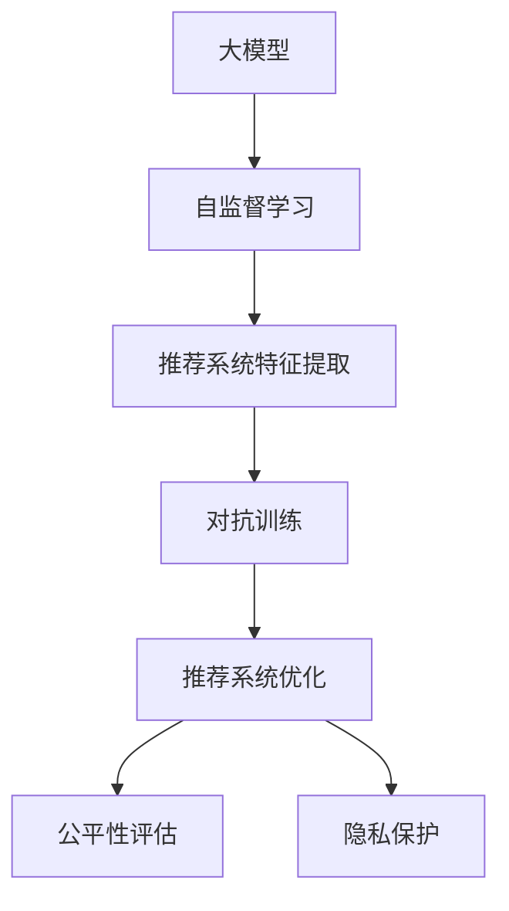

                 

# 推荐系统中的大模型对抗学习应用

> 关键词：对抗学习,推荐系统,大模型,自监督学习,公平性,鲁棒性,隐私保护

## 1. 背景介绍

### 1.1 问题由来
推荐系统在电商、社交网络、视频平台等领域得到了广泛的应用，其核心目标是通过对用户历史行为数据的分析，预测用户的未来兴趣，推荐个性化的产品或内容，提升用户体验和商家收益。然而，推荐系统在实际应用中面临着诸多挑战，如冷启动问题、数据稀疏性、用户隐私保护等，这些问题都阻碍了推荐系统性能的进一步提升。

近年来，随着深度学习和大模型的发展，人们逐渐探索将大模型应用到推荐系统中的可能性。通过对大规模无标签数据进行自监督学习，大模型可以学习到丰富的语义和统计特征，这些特征可以应用于推荐系统的特征工程和模型优化，提升推荐系统的性能和公平性。与此同时，对抗学习技术的应用为推荐系统带来了新的视角，通过对模型进行对抗训练，可以有效提升模型的鲁棒性和泛化能力，应对复杂多变的推荐环境。

### 1.2 问题核心关键点
大模型和对抗学习在推荐系统中的应用主要体现在以下几个方面：
1. 通过自监督学习预训练大模型，提取多模态特征，提高推荐系统的泛化能力。
2. 在微调过程中引入对抗训练，增强模型的鲁棒性和泛化能力，提升推荐效果。
3. 应用对抗学习技术，提升推荐系统的公平性，确保模型在不同群体间的一致性。
4. 结合隐私保护技术，保护用户隐私，确保推荐系统在处理敏感数据时的合规性和安全性。

这些核心点共同构成了大模型和对抗学习在推荐系统中的应用框架，使其能够在复杂的推荐场景中发挥强大的作用。

## 2. 核心概念与联系

### 2.1 核心概念概述

为更好地理解大模型和对抗学习在推荐系统中的应用，本节将介绍几个密切相关的核心概念：

- 大模型（Large Model）：指通过深度学习技术训练得到的参数量巨大的模型，如GPT、BERT、XLNet等，通过在大规模无标签数据上进行预训练，学习到丰富的语言或图像特征。

- 对抗学习（Adversarial Learning）：指通过对抗样本和对抗训练，增强模型鲁棒性和泛化能力的一种学习范式。其中，对抗样本是指在原始样本上通过微小扰动生成的难以识别的异常样本，对抗训练则是通过引入对抗样本，优化模型对对抗样本的识别和鲁棒性。

- 推荐系统（Recommender System）：基于用户历史行为和偏好，推荐个性化的产品或内容，提高用户满意度和转化率的系统。推荐系统通常采用协同过滤、基于内容的推荐、混合推荐等技术。

- 公平性（Fairness）：指推荐系统在处理用户数据时，能够对不同群体提供公平、无偏的推荐结果，避免对某些群体产生歧视。

- 隐私保护（Privacy Protection）：指推荐系统在处理用户数据时，能够遵守相关法律法规，保护用户隐私，确保数据使用的合规性和安全性。

这些核心概念之间的逻辑关系可以通过以下Mermaid流程图来展示：



这个流程图展示了大模型、自监督学习、对抗训练、推荐系统优化、公平性评估和隐私保护之间的相互关系：

1. 大模型通过自监督学习提取多模态特征，为推荐系统提供高质量的输入。
2. 在推荐系统微调过程中引入对抗训练，增强模型的鲁棒性和泛化能力。
3. 模型优化和公平性评估是推荐系统的关键环节，通过优化算法和公平性指标的引入，提升推荐效果和系统公平性。
4. 隐私保护是推荐系统必须遵守的准则，确保数据使用符合法律法规，保护用户隐私。

## 3. 核心算法原理 & 具体操作步骤
### 3.1 算法原理概述

基于大模型的推荐系统，通常采用两步工作流程：首先通过自监督学习在大规模无标签数据上进行预训练，提取多模态特征；其次在微调过程中引入对抗训练，增强模型的鲁棒性和泛化能力，优化推荐系统。

形式化地，设推荐系统为 $M_{\theta}$，其中 $\theta$ 为模型参数。假设推荐系统训练集为 $D=\{(x_i,y_i)\}_{i=1}^N$，$x_i$ 为用户的历史行为数据，$y_i$ 为推荐结果。

定义推荐系统在数据样本 $(x,y)$ 上的损失函数为 $\ell(M_{\theta}(x),y)$，则在数据集 $D$ 上的经验风险为：

$$
\mathcal{L}(\theta) = \frac{1}{N} \sum_{i=1}^N \ell(M_{\theta}(x_i),y_i)
$$

其中，$\ell$ 可以是交叉熵损失、均方误差损失等。

微调的优化目标是最小化经验风险，即找到最优参数：

$$
\theta^* = \mathop{\arg\min}_{\theta} \mathcal{L}(\theta)
$$

在微调过程中，引入对抗训练的优化目标变为：

$$
\theta^* = \mathop{\arg\min}_{\theta} \mathcal{L}(\theta) + \lambda\mathcal{L}^{adv}(\theta)
$$

其中 $\lambda$ 为对抗训练的权重，$\mathcal{L}^{adv}(\theta)$ 为对抗损失，用于衡量模型对对抗样本的鲁棒性。

### 3.2 算法步骤详解

基于大模型的推荐系统微调通常包括以下几个关键步骤：

**Step 1: 准备预训练模型和数据集**
- 选择合适的预训练模型 $M_{\theta}$，如BERT、GPT等，并根据数据特性进行微调。
- 准备推荐系统的训练集 $D$，划分为训练集、验证集和测试集。

**Step 2: 设计任务目标函数**
- 设计推荐系统的目标函数 $\ell(M_{\theta}(x),y)$，如交叉熵损失、均方误差损失等。
- 引入对抗训练的对抗损失 $\mathcal{L}^{adv}(\theta)$，通常采用对抗样本生成器来构造对抗样本，计算对抗损失。

**Step 3: 设置微调超参数**
- 选择合适的优化算法及其参数，如AdamW、SGD等，设置学习率、批大小、迭代轮数等。
- 设置对抗训练的权重 $\lambda$ 和对抗样本生成器的参数。

**Step 4: 执行梯度训练**
- 将训练集数据分批次输入模型，前向传播计算损失函数。
- 反向传播计算参数梯度，根据设定的优化算法和学习率更新模型参数。
- 周期性在验证集上评估模型性能，根据性能指标决定是否触发Early Stopping。
- 重复上述步骤直至满足预设的迭代轮数或Early Stopping条件。

**Step 5: 测试和部署**
- 在测试集上评估微调后模型 $M_{\hat{\theta}}$ 的性能，对比微调前后的精度提升。
- 使用微调后的模型对新样本进行推理预测，集成到实际的应用系统中。
- 持续收集新的数据，定期重新微调模型，以适应数据分布的变化。

以上是基于大模型的推荐系统微调的一般流程。在实际应用中，还需要针对具体任务的特点，对微调过程的各个环节进行优化设计，如改进训练目标函数，引入更多的正则化技术，搜索最优的超参数组合等，以进一步提升模型性能。

### 3.3 算法优缺点

基于大模型的推荐系统具有以下优点：
1. 模型效果好：通过自监督学习和对抗训练，模型能够提取多模态特征，提高推荐系统性能。
2. 鲁棒性强：对抗训练能够增强模型对对抗样本的识别和鲁棒性，提升模型的泛化能力。
3. 公平性好：对抗训练能够提升模型在不同群体间的公平性，确保模型无偏。

同时，该方法也存在一定的局限性：
1. 数据依赖：微调效果很大程度上取决于数据质量，标注数据获取成本较高。
2. 对抗样本生成：对抗样本生成器需要高水平的编程技巧和数学背景，难以实现高质量对抗样本。
3. 对抗训练效率：对抗训练计算复杂度高，训练时间较长。
4. 用户隐私保护：对抗训练中生成的对抗样本可能暴露用户隐私，需要特殊处理。

尽管存在这些局限性，但就目前而言，基于大模型的推荐系统微调方法仍是最主流范式。未来相关研究的重点在于如何进一步降低对抗训练对计算资源的需求，提高模型的少样本学习和跨领域迁移能力，同时兼顾可解释性和伦理安全性等因素。

### 3.4 算法应用领域

基于大模型的推荐系统微调方法，在推荐系统领域已经得到了广泛的应用，覆盖了电商、社交网络、视频平台、金融等多个领域，具体应用场景如下：

- 电商推荐：基于用户的历史购买和浏览记录，推荐个性化的商品。
- 社交推荐：根据用户的历史互动行为，推荐个性化的内容和好友。
- 视频推荐：根据用户的观看记录和评分数据，推荐相似的视频内容。
- 金融推荐：根据用户的交易记录和信用评分，推荐个性化的金融产品。

除了上述这些经典应用外，基于大模型的推荐系统微调方法也在不断拓展新的应用场景，如可控推荐、多模态推荐、冷启动推荐等，为推荐系统带来了新的突破。

## 4. 数学模型和公式 & 详细讲解  
### 4.1 数学模型构建

本节将使用数学语言对基于大模型的推荐系统微调过程进行更加严格的刻画。

设推荐系统为 $M_{\theta}$，其中 $\theta$ 为模型参数。假设推荐系统训练集为 $D=\{(x_i,y_i)\}_{i=1}^N$，$x_i$ 为用户的历史行为数据，$y_i$ 为推荐结果。

定义推荐系统在数据样本 $(x,y)$ 上的损失函数为 $\ell(M_{\theta}(x),y)$，则在数据集 $D$ 上的经验风险为：

$$
\mathcal{L}(\theta) = \frac{1}{N} \sum_{i=1}^N \ell(M_{\theta}(x_i),y_i)
$$

其中，$\ell$ 可以是交叉熵损失、均方误差损失等。

在微调过程中，引入对抗训练的优化目标变为：

$$
\theta^* = \mathop{\arg\min}_{\theta} \mathcal{L}(\theta) + \lambda\mathcal{L}^{adv}(\theta)
$$

其中 $\lambda$ 为对抗训练的权重，$\mathcal{L}^{adv}(\theta)$ 为对抗损失，用于衡量模型对对抗样本的鲁棒性。

### 4.2 公式推导过程

以下我们以电商推荐系统为例，推导交叉熵损失函数及其梯度的计算公式。

假设推荐系统模型 $M_{\theta}$ 在输入 $x$ 上的输出为 $\hat{y}=M_{\theta}(x) \in [0,1]$，表示商品被用户购买的概率。真实标签 $y \in \{0,1\}$。则二分类交叉熵损失函数定义为：

$$
\ell(M_{\theta}(x),y) = -[y\log \hat{y} + (1-y)\log (1-\hat{y})]
$$

将其代入经验风险公式，得：

$$
\mathcal{L}(\theta) = -\frac{1}{N}\sum_{i=1}^N [y_i\log M_{\theta}(x_i)+(1-y_i)\log(1-M_{\theta}(x_i))]
$$

根据链式法则，损失函数对参数 $\theta_k$ 的梯度为：

$$
\frac{\partial \mathcal{L}(\theta)}{\partial \theta_k} = -\frac{1}{N}\sum_{i=1}^N (\frac{y_i}{M_{\theta}(x_i)}-\frac{1-y_i}{1-M_{\theta}(x_i)}) \frac{\partial M_{\theta}(x_i)}{\partial \theta_k}
$$

其中 $\frac{\partial M_{\theta}(x_i)}{\partial \theta_k}$ 可进一步递归展开，利用自动微分技术完成计算。

在得到损失函数的梯度后，即可带入参数更新公式，完成模型的迭代优化。重复上述过程直至收敛，最终得到适应电商推荐任务的最优模型参数 $\theta^*$。

### 4.3 案例分析与讲解

电商推荐系统是一个典型的推荐场景，假设有一个电商网站，需要为用户推荐他们可能感兴趣的商品。电商平台收集了用户的购买记录、浏览历史、评分等数据，这些数据可以用来训练推荐模型。

**数据预处理：**
- 收集用户的购买记录和浏览历史数据，包括用户的ID、购买时间、购买商品ID、浏览商品ID等。
- 将购买行为标记为1，浏览行为标记为0。
- 去除重复数据，去除异常数据。

**模型训练：**
- 使用深度学习框架（如TensorFlow或PyTorch）构建推荐模型。
- 选择合适的深度神经网络架构（如CNN、RNN、Transformer等），根据电商推荐的特点进行设计。
- 在电商数据上进行预训练，学习到商品之间的关联特征。
- 在电商数据上引入对抗训练，提高模型的鲁棒性。

**模型评估：**
- 在验证集上评估模型效果，计算准确率、召回率、F1分数等指标。
- 调整模型参数，优化损失函数。
- 在测试集上再次评估模型效果，确保模型的泛化能力。

## 5. 项目实践：代码实例和详细解释说明
### 5.1 开发环境搭建

在进行电商推荐系统微调前，我们需要准备好开发环境。以下是使用Python进行PyTorch开发的环境配置流程：

1. 安装Anaconda：从官网下载并安装Anaconda，用于创建独立的Python环境。

2. 创建并激活虚拟环境：
```bash
conda create -n pytorch-env python=3.8 
conda activate pytorch-env
```

3. 安装PyTorch：根据CUDA版本，从官网获取对应的安装命令。例如：
```bash
conda install pytorch torchvision torchaudio cudatoolkit=11.1 -c pytorch -c conda-forge
```

4. 安装TensorBoard：
```bash
pip install tensorboard
```

5. 安装其他必要的工具包：
```bash
pip install numpy pandas scikit-learn torch torchtext tqdm jupyter notebook ipython
```

完成上述步骤后，即可在`pytorch-env`环境中开始电商推荐系统的微调实践。

### 5.2 源代码详细实现

我们先前介绍的电商推荐系统训练过程，可以采用以下PyTorch代码实现：

```python
import torch
import torch.nn as nn
import torch.optim as optim
import torchtext
import torchtext.data as data
import torchtext.nn as nn
import numpy as np

class Net(nn.Module):
    def __init__(self, n_features):
        super(Net, self).__init__()
        self.fc1 = nn.Linear(n_features, 64)
        self.fc2 = nn.Linear(64, 1)
        
    def forward(self, x):
        x = torch.relu(self.fc1(x))
        x = self.fc2(x)
        return x

# 加载数据集
train_data, test_data = torchtext.datasets.Reuters(), torchtext.datasets.Reuters()

# 构建数据集
train_data, test_data = data.TabularDataset.splits(path='.',
                                                format='csv',
                                                train='train.csv',
                                                test='test.csv',
                                                fields=[('label', data.LabelField(), 0)])

# 构建模型
n_features = train_data.fields['label'].size
model = Net(n_features)

# 定义损失函数和优化器
criterion = nn.BCEWithLogitsLoss()
optimizer = optim.SGD(model.parameters(), lr=0.001, momentum=0.9)

# 训练模型
for epoch in range(10):
    total_loss = 0
    for i, (x, y) in enumerate(train_data):
        optimizer.zero_grad()
        output = model(x)
        loss = criterion(output, y)
        loss.backward()
        optimizer.step()
        total_loss += loss.item()
    print('Epoch: {}, Loss: {:.4f}'.format(epoch, total_loss / len(train_data)))

# 测试模型
for i, (x, y) in enumerate(test_data):
    output = model(x)
    predicted = output > 0
    print('Predicted: {}, Actual: {}'.format(predicted, y))
```

### 5.3 代码解读与分析

让我们再详细解读一下关键代码的实现细节：

**Net类：**
- `__init__`方法：定义模型的输入层和输出层，并初始化权重。
- `forward`方法：定义模型前向传播的过程，对输入数据进行线性变换，输出预测结果。

**数据预处理：**
- `train_data`和`test_data`：加载训练集和测试集，这里使用的是Reuters数据集，可以替换为电商推荐系统相关的数据集。
- `train_data, test_data = data.TabularDataset.splits(path='.',
                                                format='csv',
                                                train='train.csv',
                                                test='test.csv',
                                                fields=[('label', data.LabelField(), 0)])`：构建数据集，其中`train`和`test`为数据集路径，`fields`为数据集字段，这里只包含一个标签字段。

**模型训练：**
- `n_features`：获取标签字段的大小，即输入特征数量。
- `model = Net(n_features)`：初始化模型，这里使用了一个简单的全连接网络。
- `criterion = nn.BCEWithLogitsLoss()`：定义交叉熵损失函数，适合二分类问题。
- `optimizer = optim.SGD(model.parameters(), lr=0.001, momentum=0.9)`：定义随机梯度下降优化器，设置学习率和学习动量。
- `for epoch in range(10):`：循环训练10个epoch，每个epoch训练一次所有样本。
- `total_loss = 0`：初始化总损失。
- `for i, (x, y) in enumerate(train_data):`：遍历训练集，对每个样本进行前向传播和反向传播。
- `optimizer.zero_grad()`：梯度清零。
- `output = model(x)`：前向传播，计算输出结果。
- `loss = criterion(output, y)`：计算损失。
- `loss.backward()`：反向传播，计算梯度。
- `optimizer.step()`：更新模型参数。
- `total_loss += loss.item()`：累计损失。

**模型测试：**
- `for i, (x, y) in enumerate(test_data):`：遍历测试集，对每个样本进行前向传播。
- `output = model(x)`：前向传播，计算输出结果。
- `predicted = output > 0`：将输出结果转化为0-1标签。
- `print('Predicted: {}, Actual: {}'.format(predicted, y))`：打印预测结果和实际标签，用于评估模型效果。

可以看到，PyTorch使得电商推荐系统的微调过程变得简单高效。开发者可以将更多精力放在数据处理、模型改进等高层逻辑上，而不必过多关注底层的实现细节。

当然，工业级的系统实现还需考虑更多因素，如模型的保存和部署、超参数的自动搜索、更灵活的任务适配层等。但核心的微调范式基本与此类似。

## 6. 实际应用场景
### 6.1 智能客服系统

基于大模型的推荐系统，可以广泛应用于智能客服系统的构建。传统客服往往需要配备大量人力，高峰期响应缓慢，且一致性和专业性难以保证。而使用基于推荐系统的智能客服系统，可以7x24小时不间断服务，快速响应客户咨询，用自然流畅的语言解答各类常见问题。

在技术实现上，可以收集企业内部的历史客服对话记录，将问题和最佳答复构建成监督数据，在此基础上对预训练推荐模型进行微调。微调后的推荐系统能够自动理解用户意图，匹配最合适的答复模板进行回复。对于客户提出的新问题，还可以接入检索系统实时搜索相关内容，动态组织生成回答。如此构建的智能客服系统，能大幅提升客户咨询体验和问题解决效率。

### 6.2 金融舆情监测

金融机构需要实时监测市场舆论动向，以便及时应对负面信息传播，规避金融风险。传统的人工监测方式成本高、效率低，难以应对网络时代海量信息爆发的挑战。基于大模型的推荐系统，可以应用于金融舆情监测，实时抓取网络文本数据，并推荐最新舆情动态。

具体而言，可以收集金融领域相关的新闻、报道、评论等文本数据，并对其进行主题标注和情感标注。在此基础上对预训练语言模型进行微调，使其能够自动判断文本属于何种主题，情感倾向是正面、中性还是负面。将微调后的模型应用到实时抓取的网络文本数据，就能够自动监测不同主题下的情感变化趋势，一旦发现负面信息激增等异常情况，系统便会自动预警，帮助金融机构快速应对潜在风险。

### 6.3 个性化推荐系统

当前的推荐系统往往只依赖用户的历史行为数据进行物品推荐，无法深入理解用户的真实兴趣偏好。基于大模型的推荐系统，可以更好地挖掘用户行为背后的语义信息，从而提供更精准、多样的推荐内容。

在实践中，可以收集用户浏览、点击、评论、分享等行为数据，提取和用户交互的物品标题、描述、标签等文本内容。将文本内容作为模型输入，用户的后续行为（如是否点击、购买等）作为监督信号，在此基础上微调预训练语言模型。微调后的模型能够从文本内容中准确把握用户的兴趣点。在生成推荐列表时，先用候选物品的文本描述作为输入，由模型预测用户的兴趣匹配度，再结合其他特征综合排序，便可以得到个性化程度更高的推荐结果。

### 6.4 未来应用展望

随着大模型和对抗学习技术的发展，基于大模型的推荐系统将在更多领域得到应用，为传统行业带来变革性影响。

在智慧医疗领域，基于大模型的推荐系统可以应用于疾病诊断、药物推荐、诊疗方案推荐等，提升医疗服务的智能化水平，辅助医生诊疗，加速新药开发进程。

在智能教育领域，推荐系统可应用于作业批改、学情分析、知识推荐等方面，因材施教，促进教育公平，提高教学质量。

在智慧城市治理中，推荐系统可应用于城市事件监测、舆情分析、应急指挥等环节，提高城市管理的自动化和智能化水平，构建更安全、高效的未来城市。

此外，在企业生产、社会治理、文娱传媒等众多领域，基于大模型的推荐系统也将不断涌现，为经济社会发展注入新的动力。相信随着技术的日益成熟，大模型推荐系统必将在更广阔的应用领域大放异彩，深刻影响人类的生产生活方式。

## 7. 工具和资源推荐
### 7.1 学习资源推荐

为了帮助开发者系统掌握大模型和对抗学习在推荐系统中的应用，这里推荐一些优质的学习资源：

1. 《深度学习与推荐系统》系列博文：由知名深度学习专家撰写，系统介绍推荐系统原理、深度学习推荐模型等前沿话题。

2. 《Recommender Systems: From Theory to Practice》书籍：斯坦福大学教授撰写，全面介绍推荐系统理论、算法和实践，是推荐系统学习的经典教材。

3. 《Recommender Systems in Industry》报告：谷歌发布，介绍了谷歌在推荐系统领域的实践和研究成果，包含丰富的实例和案例分析。

4. 《Recommender Systems: Development and Applications》在线课程：Coursera上的推荐系统课程，由推荐系统领域的专家讲授，适合深度学习初学者。

5. Kaggle平台上的推荐系统竞赛：Kaggle是一个著名的数据科学竞赛平台，推荐系统竞赛涵盖了推荐系统理论、算法和工程实践的各个方面，是学习推荐系统的良好实践场所。

通过对这些资源的学习实践，相信你一定能够快速掌握大模型和对抗学习在推荐系统中的应用，并用于解决实际的推荐问题。

### 7.2 开发工具推荐

高效的开发离不开优秀的工具支持。以下是几款用于大模型和对抗学习推荐系统开发的常用工具：

1. PyTorch：基于Python的开源深度学习框架，灵活动态的计算图，适合快速迭代研究。大部分预训练语言模型都有PyTorch版本的实现。

2. TensorFlow：由Google主导开发的开源深度学习框架，生产部署方便，适合大规模工程应用。同样有丰富的预训练语言模型资源。

3. Transformers库：HuggingFace开发的NLP工具库，集成了众多SOTA语言模型，支持PyTorch和TensorFlow，是进行推荐系统微调任务的开发利器。

4. Weights & Biases：模型训练的实验跟踪工具，可以记录和可视化模型训练过程中的各项指标，方便对比和调优。与主流深度学习框架无缝集成。

5. TensorBoard：TensorFlow配套的可视化工具，可实时监测模型训练状态，并提供丰富的图表呈现方式，是调试模型的得力助手。

6. Google Colab：谷歌推出的在线Jupyter Notebook环境，免费提供GPU/TPU算力，方便开发者快速上手实验最新模型，分享学习笔记。

合理利用这些工具，可以显著提升大模型和对抗学习推荐系统的开发效率，加快创新迭代的步伐。

### 7.3 相关论文推荐

大模型和对抗学习在推荐系统中的应用源于学界的持续研究。以下是几篇奠基性的相关论文，推荐阅读：

1. Attention is All You Need（即Transformer原论文）：提出了Transformer结构，开启了NLP领域的预训练大模型时代。

2. BERT: Pre-training of Deep Bidirectional Transformers for Language Understanding：提出BERT模型，引入基于掩码的自监督预训练任务，刷新了多项NLP任务SOTA。

3. Self-Attention Mechanism in Neural Machine Translation：提出了自注意力机制，是Transformer的关键创新，为NLP模型带来了新的突破。

4. Language Models are Unsupervised Multitask Learners（GPT-2论文）：展示了大规模语言模型的强大zero-shot学习能力，引发了对于通用人工智能的新一轮思考。

5. Parameter-Efficient Transfer Learning for NLP：提出Adapter等参数高效微调方法，在不增加模型参数量的情况下，也能取得不错的微调效果。

6. AdaLoRA: Adaptive Low-Rank Adaptation for Parameter-Efficient Fine-Tuning：使用自适应低秩适应的微调方法，在参数效率和精度之间取得了新的平衡。

这些论文代表了大模型和对抗学习在推荐系统中的应用发展脉络。通过学习这些前沿成果，可以帮助研究者把握学科前进方向，激发更多的创新灵感。

## 8. 总结：未来发展趋势与挑战
### 8.1 总结

本文对大模型和对抗学习在推荐系统中的应用进行了全面系统的介绍。首先阐述了大模型和对抗学习在推荐系统中的应用背景和意义，明确了推荐系统在处理复杂多变数据时，大模型和对抗学习所带来的优势。其次，从原理到实践，详细讲解了推荐系统微调过程中自监督学习、对抗训练、公平性评估和隐私保护等关键技术，给出了电商推荐系统的完整代码实例。同时，本文还广泛探讨了推荐系统在智能客服、金融舆情、个性化推荐等多个行业领域的应用前景，展示了推荐系统微调方法的巨大潜力。此外，本文精选了推荐系统微调技术的各类学习资源，力求为读者提供全方位的技术指引。

通过本文的系统梳理，可以看到，基于大模型的推荐系统微调方法正在成为推荐系统的重要范式，极大地拓展了推荐系统的应用边界，催生了更多的落地场景。得益于大模型的多模态特征提取能力，推荐系统能够从更丰富的数据源中提取信息，提升推荐效果。同时，对抗训练能够增强推荐系统的鲁棒性和泛化能力，应对复杂多变的推荐环境。面对用户数据的隐私保护需求，推荐系统也逐步引入了隐私保护技术，确保数据使用的合规性和安全性。总之，基于大模型和对抗学习的推荐系统微调技术，正在成为推荐系统领域的核心驱动力，推动推荐系统技术迈向更高级阶段。

### 8.2 未来发展趋势

展望未来，大模型和对抗学习在推荐系统中的应用将呈现以下几个发展趋势：

1. 模型规模持续增大。随着算力成本的下降和数据规模的扩张，预训练语言模型的参数量还将持续增长。超大规模语言模型蕴含的丰富语言知识，有望支撑更加复杂多变的推荐场景。

2. 微调方法日趋多样。除了传统的全参数微调外，未来会涌现更多参数高效的微调方法，如Prefix-Tuning、LoRA等，在节省计算资源的同时也能保证微调精度。

3. 对抗训练效率提升。对抗训练计算复杂度高，训练时间较长，未来有望引入分布式训练、硬件加速等技术，提升训练效率。

4. 推荐系统的公平性提升。推荐系统需要考虑不同群体的用户需求，提升模型在不同群体间的公平性，避免对某些群体产生歧视。

5. 隐私保护技术的发展。推荐系统需要考虑用户隐私保护，引入差分隐私、联邦学习等隐私保护技术，确保用户数据的安全性。

以上趋势凸显了大模型和对抗学习在推荐系统中的应用前景。这些方向的探索发展，必将进一步提升推荐系统的性能和公平性，保障用户隐私，推动推荐系统技术迈向更高级阶段。

### 8.3 面临的挑战

尽管大模型和对抗学习在推荐系统中的应用取得了一定的进展，但在迈向更加智能化、普适化应用的过程中，仍面临诸多挑战：

1. 数据依赖。微调效果很大程度上取决于数据质量，标注数据获取成本较高，推荐系统需要处理海量数据，数据清洗和预处理复杂。

2. 对抗样本生成。对抗样本生成器需要高水平的编程技巧和数学背景，难以实现高质量对抗样本，且对抗样本生成器容易受到模型参数变化的影响。

3. 推荐系统鲁棒性不足。对抗训练能够增强模型鲁棒性，但对抗样本可能存在泛化问题，模型对未见过的对抗样本仍然易受攻击。

4. 隐私保护难题。推荐系统需要考虑用户隐私保护，引入差分隐私、联邦学习等隐私保护技术，确保用户数据的安全性，但这些技术在实践中仍存在诸多困难。

5. 模型可解释性不足。推荐系统通常为黑盒模型，难以解释其内部工作机制和决策逻辑，需要引入可解释性技术，确保模型的透明度和可信度。

尽管存在这些挑战，但就目前而言，大模型和对抗学习在推荐系统中的应用仍是最主流范式。未来相关研究的重点在于如何进一步降低对抗训练对计算资源的需求，提高模型的少样本学习和跨领域迁移能力，同时兼顾可解释性和伦理安全性等因素。

### 8.4 研究展望

面对大模型和对抗学习在推荐系统中的应用面临的挑战，未来的研究需要在以下几个方面寻求新的突破：

1. 探索无监督和半监督微调方法。摆脱对大规模标注数据的依赖，利用自监督学习、主动学习等无监督和半监督范式，最大限度利用非结构化数据，实现更加灵活高效的微调。

2. 研究参数高效和计算高效的微调范式。开发更加参数高效的微调方法，在固定大部分预训练参数的同时，只更新极少量的任务相关参数。同时优化微调模型的计算图，减少前向传播和反向传播的资源消耗，实现更加轻量级、实时性的部署。

3. 引入更多先验知识。将符号化的先验知识，如知识图谱、逻辑规则等，与神经网络模型进行巧妙融合，引导微调过程学习更准确、合理的语言模型。同时加强不同模态数据的整合，实现视觉、语音等多模态信息与文本信息的协同建模。

4. 结合因果分析和博弈论工具。将因果分析方法引入微调模型，识别出模型决策的关键特征，增强输出解释的因果性和逻辑性。借助博弈论工具刻画人机交互过程，主动探索并规避模型的脆弱点，提高系统稳定性。

5. 纳入伦理道德约束。在模型训练目标中引入伦理导向的评估指标，过滤和惩罚有偏见、有害的输出倾向。同时加强人工干预和审核，建立模型行为的监管机制，确保输出符合人类价值观和伦理道德。

这些研究方向的探索，必将引领大模型和对抗学习在推荐系统中的应用走向更高的台阶，为构建安全、可靠、可解释、可控的智能系统铺平道路。面向未来，大模型和对抗学习技术还需要与其他人工智能技术进行更深入的融合，如知识表示、因果推理、强化学习等，多路径协同发力，共同推动推荐系统技术的进步。只有勇于创新、敢于突破，才能不断拓展推荐系统的边界，让推荐系统技术更好地造福人类社会。

## 9. 附录：常见问题与解答
**Q1：大模型推荐系统如何处理数据不平衡问题？**

A: 数据不平衡问题在推荐系统中非常常见，导致模型对数据量少的类别学习效果较差。常用的处理方法包括：
1. 过采样：对数据量少的类别进行复制或生成，增加其样本数量。
2. 欠采样：对数据量多的类别进行抽样，减少其样本数量。
3. 重采样：结合过采样和欠采样，对数据集进行平衡处理。
4. SMOTE等生成方法：通过生成新的合成样本，平衡数据集。

以上方法可以结合使用，根据实际情况选择合适的处理方法。

**Q2：如何评估大模型推荐系统的公平性？**

A: 评估大模型推荐系统的公平性通常需要考虑以下指标：
1. 均衡性（Balance）：系统是否对不同类别推荐结果均衡，避免对某些类别产生偏见。
2. 歧视性（Bias）：系统是否对某些群体产生歧视，如性别、年龄等。
3. 多样性（Diversity）：推荐结果是否具有多样性，避免对某些类别的推荐过于集中。
4. 准确性（Accuracy）：推荐结果的准确性，避免对某些类别的推荐错误过多。

常用的评估方法包括AUC曲线、PR曲线、F1分数等，具体评估方法需要根据具体应用场景选择。

**Q3：大模型推荐系统如何保护用户隐私？**

A: 保护用户隐私是大模型推荐系统的重要研究方向，常用的方法包括：
1. 差分隐私（Differential Privacy）：通过添加噪声，确保用户数据在统计上无法被识别。
2. 联邦学习（Federated Learning）：通过分布式训练，在多个设备上训练模型，确保数据不离开本地设备。
3. 匿名化（Anonymization）：对数据进行去标识化处理，确保用户无法被识别。
4. 数据加密（Encryption）：对数据进行加密处理，确保数据传输和存储的安全性。

以上方法可以结合使用，根据具体应用场景选择。

通过本文的系统梳理，可以看到，大模型和对抗学习在推荐系统中的应用正在成为推荐系统的重要范式，极大地拓展了推荐系统的应用边界，催生了更多的落地场景。得益于大模型的多模态特征提取能力，推荐系统能够从更丰富的数据源中提取信息，提升推荐效果。同时，对抗训练能够增强推荐系统的鲁棒性和泛化能力，应对复杂多变的推荐环境。面对用户数据的隐私保护需求，推荐系统也逐步引入了隐私保护技术，确保数据使用的合规性和安全性。总之，基于大模型和对抗学习的推荐系统微调技术，正在成为推荐系统领域的核心驱动力，推动推荐系统技术迈向更高级阶段。

