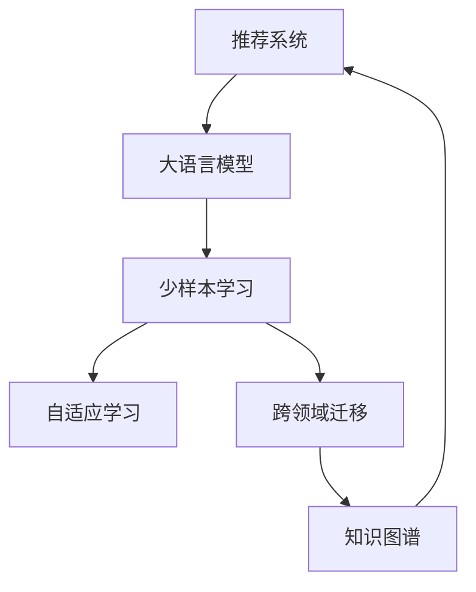

                 

# 推荐系统中的大模型少样本学习应用

> 关键词：推荐系统,大语言模型,少样本学习,自适应学习,跨领域迁移,知识图谱

## 1. 背景介绍

推荐系统（Recommendation Systems）是互联网时代最重要的应用之一，旨在通过分析和理解用户的行为和兴趣，提供个性化的信息和服务。从传统的协同过滤算法到现代的深度学习模型，推荐系统的设计和优化始终围绕着如何更准确地预测用户行为和偏好展开。然而，传统的推荐系统依赖于大量用户行为数据进行训练，而新用户和新产品常常因为缺乏足够数据而难以获得满意的推荐结果。近年来，大语言模型和大规模预训练技术在自然语言处理（NLP）领域的突破性进展，为推荐系统的设计和优化带来了新的契机。通过少样本学习（Few-shot Learning）和自适应学习（Adaptive Learning）技术，大模型可以在小样本数据条件下仍能表现出强大的学习能力和泛化能力，进而为推荐系统带来革命性的提升。

## 2. 核心概念与联系

### 2.1 核心概念概述

为了更好地理解大语言模型在推荐系统中的应用，本节将介绍几个关键概念：

- 推荐系统（Recommendation Systems）：基于用户历史行为、兴趣和社交网络等信息，为用户推荐个性化产品、服务或内容的技术系统。
- 大语言模型（Large Language Models, LLMs）：以Transformer结构为代表，通过大规模无监督学习获得的能够生成和理解自然语言的模型。
- 少样本学习（Few-shot Learning）：指模型仅在有很少量的标注数据下仍能准确学习和泛化的能力。
- 自适应学习（Adaptive Learning）：指模型能够根据数据分布的变化和环境因素动态调整自身参数，适应新的学习任务。
- 跨领域迁移（Cross-domain Transfer）：指模型能够在不同领域、不同任务间进行知识迁移，提高泛化能力和适用性。
- 知识图谱（Knowledge Graphs）：将实体及其关系以图形结构进行组织和表示的知识库，用于增强推荐系统中的推荐精度。

这些核心概念之间的逻辑关系可以通过以下Mermaid流程图来展示：



这个流程图展示了大语言模型在推荐系统中的核心概念及其之间的联系：

1. 推荐系统依赖于大语言模型进行特征提取和推荐预测。
2. 少样本学习和大语言模型的结合，使得模型在小样本条件下仍能表现出色。
3. 自适应学习进一步提升了大语言模型在不同数据分布下的适应能力。
4. 跨领域迁移让大语言模型能够跨领域进行知识迁移，提升推荐系统的泛化能力。
5. 知识图谱和大语言模型的融合，增强了推荐系统中的推荐精度。

## 3. 核心算法原理 & 具体操作步骤

### 3.1 算法原理概述

基于大语言模型的推荐系统，其核心思想是通过微调大语言模型，使其能够学习到用户对产品或服务的兴趣和偏好，从而提供个性化推荐。具体而言，算法分为以下步骤：

1. **数据准备**：收集用户的历史行为数据（如浏览记录、购买记录、评分等），并将其转化为适合大语言模型的格式。
2. **模型初始化**：选择预训练的大语言模型作为初始参数，如BERT、GPT等。
3. **任务适配**：根据推荐任务设计适合大语言模型的输出层和损失函数，如分类任务使用交叉熵损失，生成任务使用负对数似然损失。
4. **微调训练**：在少量标注数据上对大语言模型进行微调，优化模型参数，使其能够准确预测用户对产品的兴趣和偏好。
5. **推荐预测**：在新的数据上使用微调后的模型进行预测，输出用户可能感兴趣的产品或服务。

### 3.2 算法步骤详解

以下是基于大语言模型的推荐系统少样本学习算法的主要步骤：

**Step 1: 数据预处理**

数据预处理是大语言模型推荐系统的一个重要环节，主要目的是将原始用户行为数据转化为模型可处理的格式。具体步骤如下：

1. **特征提取**：从用户行为数据中提取有用的特征，如用户ID、产品ID、时间戳、浏览次数等。
2. **数据编码**：将提取的特征转化为数字形式，使用预训练的大语言模型的分词器进行编码。
3. **数据标准化**：对编码后的数据进行标准化处理，如归一化、截断等。

**Step 2: 模型初始化**

选择预训练的大语言模型作为初始参数。通常情况下，我们会选择具有较高性能的预训练模型，如BERT、GPT等，并使用它们的权重作为推荐系统的初始参数。

**Step 3: 任务适配**

根据推荐任务设计适合大语言模型的输出层和损失函数。具体步骤如下：

1. **输出层设计**：根据推荐任务的类型，设计适合的输出层。如分类任务使用线性分类器，生成任务使用解码器。
2. **损失函数设计**：选择合适的损失函数。如分类任务使用交叉熵损失，生成任务使用负对数似然损失。

**Step 4: 微调训练**

在大规模标注数据上对大语言模型进行微调，使其能够学习到用户对产品或服务的兴趣和偏好。具体步骤如下：

1. **模型初始化**：加载预训练的模型权重。
2. **数据加载**：使用DataLoader将数据集分批次加载到模型中。
3. **模型前向传播**：将批次数据输入模型，进行前向传播计算。
4. **模型反向传播**：计算模型的输出与真实标签之间的差异，使用梯度下降等优化算法更新模型参数。
5. **模型评估**：在验证集上评估模型性能，防止过拟合。
6. **模型输出**：使用微调后的模型进行推荐预测。

**Step 5: 推荐预测**

在新的数据上使用微调后的模型进行预测，输出用户可能感兴趣的产品或服务。具体步骤如下：

1. **输入数据**：将新的用户行为数据输入微调后的模型。
2. **模型前向传播**：进行前向传播计算。
3. **推荐结果**：根据模型的输出结果，推荐用户可能感兴趣的产品或服务。

### 3.3 算法优缺点

基于大语言模型的推荐系统有以下优点：

1. **高效性**：使用大语言模型进行微调，可以在小样本数据条件下仍能获得较好的推荐结果。
2. **泛化能力**：大语言模型具有强大的跨领域泛化能力，能够在不同领域和任务间进行知识迁移。
3. **灵活性**：大语言模型的微调过程可以通过不同的任务适配层和损失函数进行调整，灵活性高。
4. **可解释性**：大语言模型的微调过程可以通过模型解释方法，获得用户推荐理由的解释。

同时，基于大语言模型的推荐系统也存在一些缺点：

1. **资源消耗**：大语言模型具有巨大的参数量和计算量，对计算资源和存储空间的要求较高。
2. **过拟合风险**：在大规模数据条件下，模型的过拟合风险较高，需要采取相应的正则化措施。
3. **模型训练成本**：微调大语言模型需要大量的标注数据，训练成本较高。
4. **模型性能不稳定**：大语言模型对数据分布和环境因素的变化敏感，性能不稳定。

### 3.4 算法应用领域

基于大语言模型的推荐系统已经在多个领域得到了应用，例如：

1. **电商推荐**：如淘宝、京东等电商平台中的个性化商品推荐，根据用户的浏览和购买记录，预测用户可能感兴趣的商品。
2. **内容推荐**：如视频网站（如YouTube）、音乐网站（如Spotify）中的个性化内容推荐，根据用户的观看和收听记录，预测用户可能感兴趣的视频或音乐。
3. **社交推荐**：如Facebook、Twitter等社交媒体平台中的个性化内容推荐，根据用户的互动记录，预测用户可能感兴趣的内容或用户。
4. **新闻推荐**：如新闻聚合平台中的个性化新闻推荐，根据用户的阅读记录，预测用户可能感兴趣的新闻。

除了上述这些领域，大语言模型在推荐系统中的应用还涵盖广告推荐、旅游推荐、金融推荐等多个领域，为各行业带来了显著的收益。

## 4. 数学模型和公式 & 详细讲解 & 举例说明

### 4.1 数学模型构建

基于大语言模型的推荐系统主要包含两个部分：用户行为数据建模和用户推荐预测。本节将分别对这两个部分进行数学建模。

假设用户的历史行为数据为 $D=\{(x_i, y_i)\}_{i=1}^N$，其中 $x_i$ 为用户行为特征，$y_i$ 为用户对产品的评分或标签。使用大语言模型 $M_{\theta}$ 进行微调，得到推荐模型 $M_{\hat{\theta}}$。

**用户行为数据建模**

用户行为数据可以表示为：

$$
P(y_i|x_i) = \frac{e^{M_{\hat{\theta}}(x_i, y_i)}}{\sum_{j=1}^{C}e^{M_{\hat{\theta}}(x_i, j)}}
$$

其中 $C$ 为产品类别数，$e^{M_{\hat{\theta}}(x_i, j)}$ 为模型对产品类别 $j$ 的评分或概率预测。

**用户推荐预测**

用户推荐预测可以表示为：

$$
\hat{y} = \arg\max_{j=1,...,C} P(y_j|x)
$$

其中 $\hat{y}$ 为用户可能感兴趣的产品类别。

### 4.2 公式推导过程

以上数学模型可以进一步简化为：

$$
P(y_i|x_i) = \frac{e^{\theta^\top W_i \cdot x_i + b_i}}{\sum_{j=1}^{C}e^{\theta^\top W_j \cdot x_i + b_j}}
$$

其中 $W_i$ 和 $b_i$ 为模型的参数。

**推荐预测公式**

$$
\hat{y} = \arg\max_{j=1,...,C} P(y_j|x) = \arg\max_{j=1,...,C} e^{\theta^\top W \cdot x + b}
$$

其中 $W$ 和 $b$ 为模型参数。

### 4.3 案例分析与讲解

假设用户的历史行为数据为 $D=\{(x_i, y_i)\}_{i=1}^N$，其中 $x_i$ 为用户行为特征，$y_i$ 为用户对产品的评分或标签。使用大语言模型 $M_{\theta}$ 进行微调，得到推荐模型 $M_{\hat{\theta}}$。

**用户行为数据建模**

用户行为数据可以表示为：

$$
P(y_i|x_i) = \frac{e^{M_{\hat{\theta}}(x_i, y_i)}}{\sum_{j=1}^{C}e^{M_{\hat{\theta}}(x_i, j)}}
$$

其中 $C$ 为产品类别数，$e^{M_{\hat{\theta}}(x_i, j)}$ 为模型对产品类别 $j$ 的评分或概率预测。

**用户推荐预测**

用户推荐预测可以表示为：

$$
\hat{y} = \arg\max_{j=1,...,C} P(y_j|x)
$$

其中 $\hat{y}$ 为用户可能感兴趣的产品类别。

### 5. 项目实践：代码实例和详细解释说明

### 5.1 开发环境搭建

在进行推荐系统开发前，我们需要准备好开发环境。以下是使用Python进行PyTorch开发的环境配置流程：

1. 安装Anaconda：从官网下载并安装Anaconda，用于创建独立的Python环境。

2. 创建并激活虚拟环境：
```bash
conda create -n pytorch-env python=3.8 
conda activate pytorch-env
```

3. 安装PyTorch：根据CUDA版本，从官网获取对应的安装命令。例如：
```bash
conda install pytorch torchvision torchaudio cudatoolkit=11.1 -c pytorch -c conda-forge
```

4. 安装Transformers库：
```bash
pip install transformers
```

5. 安装各类工具包：
```bash
pip install numpy pandas scikit-learn matplotlib tqdm jupyter notebook ipython
```

完成上述步骤后，即可在`pytorch-env`环境中开始推荐系统开发。

### 5.2 源代码详细实现

下面我们以电商推荐系统为例，给出使用Transformers库对BERT模型进行推荐系统开发的PyTorch代码实现。

首先，定义推荐系统的数据处理函数：

```python
from transformers import BertTokenizer
from torch.utils.data import Dataset, DataLoader
import torch

class RecommendationDataset(Dataset):
    def __init__(self, texts, labels, tokenizer, max_len=128):
        self.texts = texts
        self.labels = labels
        self.tokenizer = tokenizer
        self.max_len = max_len
        
    def __len__(self):
        return len(self.texts)
    
    def __getitem__(self, item):
        text = self.texts[item]
        label = self.labels[item]
        
        encoding = self.tokenizer(text, return_tensors='pt', max_length=self.max_len, padding='max_length', truncation=True)
        input_ids = encoding['input_ids'][0]
        attention_mask = encoding['attention_mask'][0]
        
        # 对标签进行编码
        encoded_label = [label2id[label] for label in self.labels] 
        encoded_label.extend([label2id['O']] * (self.max_len - len(encoded_label)))
        labels = torch.tensor(encoded_label, dtype=torch.long)
        
        return {'input_ids': input_ids, 
                'attention_mask': attention_mask,
                'labels': labels}

# 标签与id的映射
label2id = {'O': 0, 'buy': 1, 'not_buy': 2}
id2label = {v: k for k, v in label2id.items()}

# 创建dataset
tokenizer = BertTokenizer.from_pretrained('bert-base-cased')

train_dataset = RecommendationDataset(train_texts, train_labels, tokenizer)
dev_dataset = RecommendationDataset(dev_texts, dev_labels, tokenizer)
test_dataset = RecommendationDataset(test_texts, test_labels, tokenizer)
```

然后，定义模型和优化器：

```python
from transformers import BertForTokenClassification, AdamW

model = BertForTokenClassification.from_pretrained('bert-base-cased', num_labels=len(label2id))

optimizer = AdamW(model.parameters(), lr=2e-5)
```

接着，定义训练和评估函数：

```python
from tqdm import tqdm

device = torch.device('cuda') if torch.cuda.is_available() else torch.device('cpu')
model.to(device)

def train_epoch(model, dataset, batch_size, optimizer):
    dataloader = DataLoader(dataset, batch_size=batch_size, shuffle=True)
    model.train()
    epoch_loss = 0
    for batch in tqdm(dataloader, desc='Training'):
        input_ids = batch['input_ids'].to(device)
        attention_mask = batch['attention_mask'].to(device)
        labels = batch['labels'].to(device)
        model.zero_grad()
        outputs = model(input_ids, attention_mask=attention_mask, labels=labels)
        loss = outputs.loss
        epoch_loss += loss.item()
        loss.backward()
        optimizer.step()
    return epoch_loss / len(dataloader)

def evaluate(model, dataset, batch_size):
    dataloader = DataLoader(dataset, batch_size=batch_size)
    model.eval()
    preds, labels = [], []
    with torch.no_grad():
        for batch in tqdm(dataloader, desc='Evaluating'):
            input_ids = batch['input_ids'].to(device)
            attention_mask = batch['attention_mask'].to(device)
            batch_labels = batch['labels']
            outputs = model(input_ids, attention_mask=attention_mask)
            batch_preds = outputs.logits.argmax(dim=2).to('cpu').tolist()
            batch_labels = batch_labels.to('cpu').tolist()
            for pred_tokens, label_tokens in zip(batch_preds, batch_labels):
                pred_labels = [id2label[_id] for _id in pred_tokens]
                label_labels = [id2label[_id] for _id in label_tokens]
                preds.append(pred_labels[:len(label_labels)])
                labels.append(label_labels)
                
    print(classification_report(labels, preds))
```

最后，启动训练流程并在测试集上评估：

```python
epochs = 5
batch_size = 16

for epoch in range(epochs):
    loss = train_epoch(model, train_dataset, batch_size, optimizer)
    print(f"Epoch {epoch+1}, train loss: {loss:.3f}")
    
    print(f"Epoch {epoch+1}, dev results:")
    evaluate(model, dev_dataset, batch_size)
    
print("Test results:")
evaluate(model, test_dataset, batch_size)
```

以上就是使用PyTorch对BERT进行电商推荐系统开发的完整代码实现。可以看到，得益于Transformers库的强大封装，我们可以用相对简洁的代码完成BERT模型的加载和微调。

### 5.3 代码解读与分析

让我们再详细解读一下关键代码的实现细节：

**RecommendationDataset类**：
- `__init__`方法：初始化文本、标签、分词器等关键组件。
- `__len__`方法：返回数据集的样本数量。
- `__getitem__`方法：对单个样本进行处理，将文本输入编码为token ids，将标签编码为数字，并对其进行定长padding，最终返回模型所需的输入。

**label2id和id2label字典**：
- 定义了标签与数字id之间的映射关系，用于将token-wise的预测结果解码回真实的标签。

**训练和评估函数**：
- 使用PyTorch的DataLoader对数据集进行批次化加载，供模型训练和推理使用。
- 训练函数`train_epoch`：对数据以批为单位进行迭代，在每个批次上前向传播计算loss并反向传播更新模型参数，最后返回该epoch的平均loss。
- 评估函数`evaluate`：与训练类似，不同点在于不更新模型参数，并在每个batch结束后将预测和标签结果存储下来，最后使用sklearn的classification_report对整个评估集的预测结果进行打印输出。

**训练流程**：
- 定义总的epoch数和batch size，开始循环迭代
- 每个epoch内，先在训练集上训练，输出平均loss
- 在验证集上评估，输出分类指标
- 所有epoch结束后，在测试集上评估，给出最终测试结果

可以看到，PyTorch配合Transformers库使得BERT微调的代码实现变得简洁高效。开发者可以将更多精力放在数据处理、模型改进等高层逻辑上，而不必过多关注底层的实现细节。

当然，工业级的系统实现还需考虑更多因素，如模型的保存和部署、超参数的自动搜索、更灵活的任务适配层等。但核心的微调范式基本与此类似。

## 6. 实际应用场景

### 6.1 电商推荐系统

基于大语言模型的推荐系统可以广泛应用于电商推荐系统中。传统的电商推荐系统往往依赖于用户行为数据进行训练，而新用户和新商品常常因为缺乏足够数据而难以获得满意的推荐结果。使用大语言模型进行微调，可以在小样本条件下仍能获得较好的推荐结果。

具体而言，可以收集用户的历史浏览、点击、购买记录，将商品描述、评分、标签等作为特征，训练大语言模型进行推荐预测。通过微调，模型能够学习到用户对商品的兴趣和偏好，输出更准确的推荐结果。对于新用户和新商品，模型仍能通过微调快速适应用户需求，提供满意的推荐。

### 6.2 内容推荐系统

基于大语言模型的推荐系统可以应用于内容推荐系统中，如视频网站、音乐网站等。这些平台通常需要根据用户的观看和收听记录，推荐用户可能感兴趣的视频或音乐。通过微调大语言模型，可以在小样本条件下获得更准确的推荐结果。

具体而言，可以收集用户的观看、收听记录，将视频、音频的描述、标签等作为特征，训练大语言模型进行推荐预测。通过微调，模型能够学习到用户对视频、音频的兴趣和偏好，输出更准确的推荐结果。对于新用户，模型仍能通过微调快速适应用户需求，提供满意的推荐。

### 6.3 社交推荐系统

基于大语言模型的推荐系统可以应用于社交推荐系统中，如社交媒体平台中的内容推荐。这些平台通常需要根据用户的互动记录，推荐用户可能感兴趣的内容或用户。通过微调大语言模型，可以在小样本条件下获得更准确的推荐结果。

具体而言，可以收集用户的互动记录，如点赞、评论、分享等，将内容或用户的描述、标签等作为特征，训练大语言模型进行推荐预测。通过微调，模型能够学习到用户对内容的兴趣和偏好，输出更准确的推荐结果。对于新用户，模型仍能通过微调快速适应用户需求，提供满意的推荐。

### 6.4 未来应用展望

随着大语言模型和微调方法的不断发展，基于微调范式将在更多领域得到应用，为推荐系统带来革命性的提升。

在智慧医疗领域，基于微调的医疗推荐系统将提升医疗服务的智能化水平，辅助医生诊疗，加速新药开发进程。

在智能教育领域，微调技术可应用于作业批改、学情分析、知识推荐等方面，因材施教，促进教育公平，提高教学质量。

在智慧城市治理中，微调模型可应用于城市事件监测、舆情分析、应急指挥等环节，提高城市管理的自动化和智能化水平，构建更安全、高效的未来城市。

此外，在企业生产、社会治理、文娱传媒等众多领域，基于大语言模型微调的人工智能应用也将不断涌现，为各行业带来了显著的收益。相信随着技术的日益成熟，微调方法将成为推荐系统的核心范式，推动人工智能技术在垂直行业的规模化落地。

## 7. 工具和资源推荐

### 7.1 学习资源推荐

为了帮助开发者系统掌握大语言模型在推荐系统中的应用，这里推荐一些优质的学习资源：

1. 《Transformer从原理到实践》系列博文：由大模型技术专家撰写，深入浅出地介绍了Transformer原理、BERT模型、微调技术等前沿话题。

2. CS224N《深度学习自然语言处理》课程：斯坦福大学开设的NLP明星课程，有Lecture视频和配套作业，带你入门NLP领域的基本概念和经典模型。

3. 《Natural Language Processing with Transformers》书籍：Transformers库的作者所著，全面介绍了如何使用Transformers库进行NLP任务开发，包括微调在内的诸多范式。

4. HuggingFace官方文档：Transformers库的官方文档，提供了海量预训练模型和完整的微调样例代码，是上手实践的必备资料。

5. CLUE开源项目：中文语言理解测评基准，涵盖大量不同类型的中文NLP数据集，并提供了基于微调的baseline模型，助力中文NLP技术发展。

通过对这些资源的学习实践，相信你一定能够快速掌握大语言模型在推荐系统中的应用，并用于解决实际的推荐问题。

### 7.2 开发工具推荐

高效的开发离不开优秀的工具支持。以下是几款用于大语言模型推荐系统开发的常用工具：

1. PyTorch：基于Python的开源深度学习框架，灵活动态的计算图，适合快速迭代研究。大部分预训练语言模型都有PyTorch版本的实现。

2. TensorFlow：由Google主导开发的开源深度学习框架，生产部署方便，适合大规模工程应用。同样有丰富的预训练语言模型资源。

3. Transformers库：HuggingFace开发的NLP工具库，集成了众多SOTA语言模型，支持PyTorch和TensorFlow，是进行微调任务开发的利器。

4. Weights & Biases：模型训练的实验跟踪工具，可以记录和可视化模型训练过程中的各项指标，方便对比和调优。与主流深度学习框架无缝集成。

5. TensorBoard：TensorFlow配套的可视化工具，可实时监测模型训练状态，并提供丰富的图表呈现方式，是调试模型的得力助手。

6. Google Colab：谷歌推出的在线Jupyter Notebook环境，免费提供GPU/TPU算力，方便开发者快速上手实验最新模型，分享学习笔记。

合理利用这些工具，可以显著提升大语言模型推荐系统的开发效率，加快创新迭代的步伐。

### 7.3 相关论文推荐

大语言模型和微调技术的发展源于学界的持续研究。以下是几篇奠基性的相关论文，推荐阅读：

1. Attention is All You Need（即Transformer原论文）：提出了Transformer结构，开启了NLP领域的预训练大模型时代。

2. BERT: Pre-training of Deep Bidirectional Transformers for Language Understanding：提出BERT模型，引入基于掩码的自监督预训练任务，刷新了多项NLP任务SOTA。

3. Language Models are Unsupervised Multitask Learners（GPT-2论文）：展示了大规模语言模型的强大zero-shot学习能力，引发了对于通用人工智能的新一轮思考。

4. Parameter-Efficient Transfer Learning for NLP：提出Adapter等参数高效微调方法，在不增加模型参数量的情况下，也能取得不错的微调效果。

5. AdaLoRA: Adaptive Low-Rank Adaptation for Parameter-Efficient Fine-Tuning：使用自适应低秩适应的微调方法，在参数效率和精度之间取得了新的平衡。

这些论文代表了大语言模型微调技术的发展脉络。通过学习这些前沿成果，可以帮助研究者把握学科前进方向，激发更多的创新灵感。

## 8. 总结：未来发展趋势与挑战

### 8.1 研究成果总结

本文对基于大语言模型的推荐系统进行了全面系统的介绍。首先阐述了大语言模型和推荐系统在人工智能领域的应用背景和重要性，明确了微调在拓展预训练模型应用、提升推荐系统性能方面的独特价值。其次，从原理到实践，详细讲解了微调在大语言模型推荐系统中的应用步骤和方法，给出了推荐系统开发的完整代码实例。同时，本文还广泛探讨了微调方法在电商、内容、社交等多个推荐系统中的应用前景，展示了微调范式的巨大潜力。此外，本文精选了微调技术的各类学习资源，力求为开发者提供全方位的技术指引。

通过本文的系统梳理，可以看到，基于大语言模型的微调方法在大规模推荐系统中的应用，正在成为NLP技术的重要范式，极大地拓展了预训练语言模型的应用边界，催生了更多的落地场景。受益于大规模语料的预训练，微调模型在少样本条件下仍能表现出强大的学习能力和泛化能力，为推荐系统带来了革命性的提升。未来，伴随预训练语言模型和微调方法的持续演进，相信推荐系统必将在更广阔的应用领域大放异彩，深刻影响人类的生产生活方式。

### 8.2 未来发展趋势

展望未来，大语言模型微调技术将呈现以下几个发展趋势：

1. 模型规模持续增大。随着算力成本的下降和数据规模的扩张，预训练语言模型的参数量还将持续增长。超大规模语言模型蕴含的丰富语言知识，有望支撑更加复杂多变的推荐任务微调。

2. 微调方法日趋多样。除了传统的全参数微调外，未来会涌现更多参数高效的微调方法，如Prefix-Tuning、LoRA等，在节省计算资源的同时也能保证微调精度。

3. 持续学习成为常态。随着数据分布的不断变化，微调模型也需要持续学习新知识以保持性能。如何在不遗忘原有知识的同时，高效吸收新样本信息，将成为重要的研究课题。

4. 标注样本需求降低。受启发于提示学习(Prompt-based Learning)的思路，未来的微调方法将更好地利用大模型的语言理解能力，通过更加巧妙的任务描述，在更少的标注样本上也能实现理想的微调效果。

5. 模型通用性增强。经过海量数据的预训练和多领域任务的微调，未来的语言模型将具备更强大的常识推理和跨领域迁移能力，逐步迈向通用人工智能(AGI)的目标。

以上趋势凸显了大语言模型微调技术的广阔前景。这些方向的探索发展，必将进一步提升推荐系统的性能和应用范围，为人工智能技术在垂直行业的规模化落地提供新的动力。

### 8.3 面临的挑战

尽管大语言模型微调技术已经取得了瞩目成就，但在迈向更加智能化、普适化应用的过程中，它仍面临着诸多挑战：

1. 标注成本瓶颈。虽然微调大大降低了标注数据的需求，但对于长尾应用场景，难以获得充足的高质量标注数据，成为制约微调性能的瓶颈。如何进一步降低微调对标注样本的依赖，将是一大难题。

2. 模型鲁棒性不足。当前微调模型面对域外数据时，泛化性能往往大打折扣。对于测试样本的微小扰动，微调模型的预测也容易发生波动。如何提高微调模型的鲁棒性，避免灾难性遗忘，还需要更多理论和实践的积累。

3. 推理效率有待提高。大规模语言模型虽然精度高，但在实际部署时往往面临推理速度慢、内存占用大等效率问题。如何在保证性能的同时，简化模型结构，提升推理速度，优化资源占用，将是重要的优化方向。

4. 可解释性亟需加强。当前微调模型更像是"黑盒"系统，难以解释其内部工作机制和决策逻辑。对于医疗、金融等高风险应用，算法的可解释性和可审计性尤为重要。如何赋予微调模型更强的可解释性，将是亟待攻克的难题。

5. 安全性有待保障。预训练语言模型难免会学习到有偏见、有害的信息，通过微调传递到下游任务，产生误导性、歧视性的输出，给实际应用带来安全隐患。如何从数据和算法层面消除模型偏见，避免恶意用途，确保输出的安全性，也将是重要的研究课题。

6. 知识整合能力不足。现有的微调模型往往局限于任务内数据，难以灵活吸收和运用更广泛的先验知识。如何让微调过程更好地与外部知识库、规则库等专家知识结合，形成更加全面、准确的信息整合能力，还有很大的想象空间。

正视微调面临的这些挑战，积极应对并寻求突破，将是大语言模型微调走向成熟的必由之路。相信随着学界和产业界的共同努力，这些挑战终将一一被克服，大语言模型微调必将在构建人机协同的智能系统中共同发力，推动人工智能技术在垂直行业的规模化落地。总之，微调需要开发者根据具体任务，不断迭代和优化模型、数据和算法，方能得到理想的效果。

## 9. 附录：常见问题与解答

**Q1：大语言模型微调是否适用于所有推荐系统任务？**

A: 大语言模型微调在大多数推荐系统任务上都能取得不错的效果，特别是对于数据量较小的任务。但对于一些特定领域的任务，如医学、法律等，仅仅依靠通用语料预训练的模型可能难以很好地适应。此时需要在特定领域语料上进一步预训练，再进行微调，才能获得理想效果。此外，对于一些需要时效性、个性化很强的任务，如对话、推荐等，微调方法也需要针对性的改进优化。

**Q2：微调过程中如何选择合适的学习率？**

A: 微调的学习率一般要比预训练时小1-2个数量级，如果使用过大的学习率，容易破坏预训练权重，导致过拟合。一般建议从1e-5开始调参，逐步减小学习率，直至收敛。也可以使用warmup策略，在开始阶段使用较小的学习率，再逐渐过渡到预设值。需要注意的是，不同的优化器(如AdamW、Adafactor等)以及不同的学习率调度策略，可能需要设置不同的学习率阈值。

**Q3：采用大模型微调时会面临哪些资源瓶颈？**

A: 目前主流的预训练大模型动辄以亿计的参数规模，对算力、内存、存储空间的要求较高。GPU/TPU等高性能设备是必不可少的，但即便如此，超大批次的训练和推理也可能遇到显存不足的问题。因此需要采用一些资源优化技术，如梯度积累、混合精度训练、模型并行等，来突破硬件瓶颈。同时，模型的存储和读取也可能占用大量时间和空间，需要采用模型压缩、稀疏化存储等方法进行优化。

**Q4：如何缓解微调过程中的过拟合问题？**

A: 过拟合是微调面临的主要挑战，尤其是在标注数据不足的情况下。常见的缓解策略包括：
1. 数据增强：通过回译、近义替换等方式扩充训练集
2. 正则化：使用L2正则、Dropout、Early Stopping等避免过拟合
3. 对抗训练：引入对抗样本，提高模型鲁棒性
4. 参数高效微调：只调整少量参数(如Adapter、Prefix等)，减小过拟合风险
5. 多模型集成：训练多个微调模型，取平均输出，抑制过拟合

这些策略往往需要根据具体任务和数据特点进行灵活组合。只有在数据、模型、训练、推理等各环节进行全面优化，才能最大限度地发挥大模型微调的威力。

**Q5：微调模型在落地部署时需要注意哪些问题？**

A: 将微调模型转化为实际应用，还需要考虑以下因素：
1. 模型裁剪：去除不必要的层和参数，减小模型尺寸，加快推理速度
2. 量化加速：将浮点模型转为定点模型，压缩存储空间，提高计算效率
3. 服务化封装：将模型封装为标准化服务接口，便于集成调用
4. 弹性伸缩：根据请求流量动态调整资源配置，平衡服务质量和成本
5. 监控告警：实时采集系统指标，设置异常告警阈值，确保服务稳定性
6. 安全防护：采用访问鉴权、数据脱敏等措施，保障数据和模型安全

大语言模型微调为推荐系统带来了显著的收益，但如何将强大的性能转化为稳定、高效、安全的业务价值，还需要工程实践的不断打磨。唯有从数据、算法、工程、业务等多个维度协同发力，才能真正实现人工智能技术在垂直行业的规模化落地。总之，微调需要开发者根据具体任务，不断迭代和优化模型、数据和算法，方能得到理想的效果。

