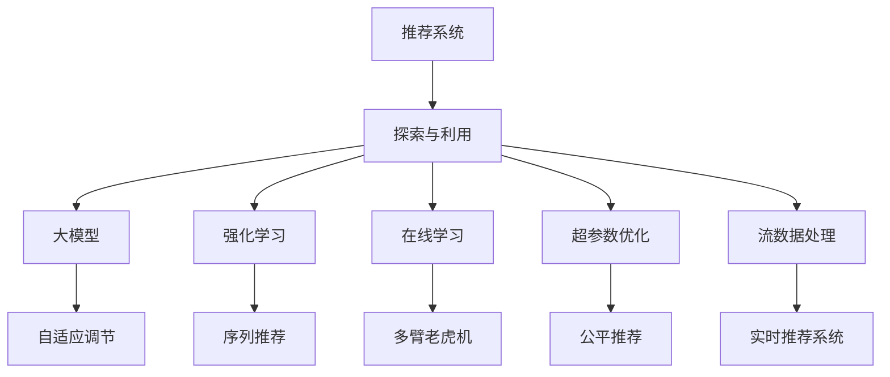

                 

# 推荐系统中的探索与利用：大模型的自适应调节

> 关键词：探索与利用(Exploration & Exploitation)、大模型、自适应调节、强化学习(Reinforcement Learning)、序列推荐(Sequence Recommendation)、在线学习(Online Learning)、多臂老虎机(Multi-Armed Bandit)、超参数优化(Hyperparameter Optimization)、公平推荐(Fair Recommendation)、流数据处理(Online Data Processing)、实时推荐系统(Real-time Recommendation System)

## 1. 背景介绍

推荐系统作为互联网时代的重要组成部分，广泛用于电商、社交、视频、新闻等平台，其核心任务是为用户提供个性化的物品推荐。传统的推荐系统主要基于协同过滤、矩阵分解等算法，但这些方法依赖用户行为数据，容易受到数据稀疏性和冷启动问题的困扰。

近年来，随着深度学习技术和大规模预训练模型的兴起，推荐系统进入了一个新的发展阶段。使用深度神经网络对用户行为数据进行建模，可以捕获数据中更加复杂和抽象的特征，从而提升推荐效果。特别是在电商、音乐、视频等娱乐场景下，深度神经网络在推荐系统中的表现已超越传统方法，成为主流的推荐技术。

然而，深度学习推荐系统依然存在一些挑战，例如模型训练和推理开销大，超参数调优复杂，推荐效果和鲁棒性难以均衡等。在追求高精度的同时，如何兼顾模型的泛化性和在线学习的实时性，是大规模深度学习推荐系统面临的重要课题。

本文将从探索与利用(Exploration & Exploitation)的角度，探讨如何利用大模型对推荐系统进行自适应调节，以应对这些挑战。我们还将展示基于大模型的推荐系统如何在电商、社交、视频等垂直领域中大放异彩。

## 2. 核心概念与联系

### 2.1 核心概念概述

在推荐系统中，探索与利用是指在智能决策中平衡探索未知的策略和利用已有知识的策略。具体而言，探索代表寻找新的高回报策略，以应对未知数据；利用则代表采纳已知的低风险策略，以稳定现有收益。

大模型是指在大规模无标签数据上预训练的深度神经网络模型，如BERT、GPT等。这些模型通过自我调节和训练，具备了强大的语义理解和生成能力。

自适应调节是指在推荐系统中，动态调整大模型的参数和结构，以应对实时数据的动态变化。这包括超参数调优、模型更新、结构优化等。

强化学习是一种基于奖励信号学习策略的机器学习方法，广泛用于推荐系统中的探索与利用。

序列推荐是指推荐系统中，在用户交互历史的基础上，为下一个时刻推荐物品。常用的模型包括RNN、GRU、Transformer等。

在线学习是指在推荐系统中，利用实时数据更新模型，避免离线训练的计算延迟。

多臂老虎机是一个经典的强化学习问题，用于模拟多个策略选择的场景，常见于资源分配、广告点击率预估等。

超参数优化是指在推荐系统中，对模型架构、学习率、损失函数等超参数进行优化，以获得更好的推荐效果。

公平推荐是指在推荐系统中，确保每个用户都能获得公平的推荐机会，避免偏见和歧视。

流数据处理是指在推荐系统中，对实时产生的大量数据进行高效处理，保证推荐系统的实时性和稳定性。

实时推荐系统是指在推荐系统中，利用低延迟和高吞吐量的系统架构，实现实时推荐，满足用户即时需求。

这些概念之间相互联系，构成了一个完整的推荐系统框架。我们将在后续章节中详细介绍每个核心概念的原理和实现。

### 2.2 核心概念原理和架构的 Mermaid 流程图



## 3. 核心算法原理 & 具体操作步骤
### 3.1 算法原理概述

在大规模推荐系统中，探索与利用平衡的决策策略是非常关键的。传统的推荐系统通常采用固定策略，如基于协同过滤或矩阵分解的推荐算法，这种策略在一定程度上解决了探索与利用之间的矛盾，但难以应对数据分布的变化和模型的复杂性。

近年来，基于深度学习推荐系统的探索与利用平衡策略被广泛研究和应用。主要思想是通过调整模型参数，动态优化推荐效果。

在实际推荐系统中，大模型通常作为推荐策略的基础组件，利用其强大的语义理解和生成能力，结合用户历史行为数据，进行智能推荐。

基于大模型的推荐系统，通过动态调整模型参数和结构，在探索与利用之间找到平衡点，从而提升推荐效果。这种动态调节通常需要以下几个步骤：

1. 收集用户行为数据。
2. 构建推荐模型。
3. 设定奖励函数。
4. 训练模型。
5. 实时更新模型。
6. 评估推荐效果。

### 3.2 算法步骤详解

#### 步骤1: 收集用户行为数据

用户行为数据是推荐系统的基础。这些数据通常包括用户的点击、浏览、购买、评分等行为记录。在实际应用中，这些数据需要经过预处理、清洗和特征工程等步骤，才能被用于模型训练。

#### 步骤2: 构建推荐模型

推荐模型通常由大模型和推荐策略两部分组成。大模型用于捕获用户行为的语义特征，推荐策略则将用户行为与物品特征进行匹配，输出推荐结果。

#### 步骤3: 设定奖励函数

奖励函数用于衡量推荐模型的效果。在电商场景中，点击率、转化率、销售额等可以作为奖励指标；在社交场景中，点赞、分享、评论等可以作为奖励指标。设定合理的奖励函数，是评估模型效果和优化推荐策略的关键。

#### 步骤4: 训练模型

模型训练通常采用强化学习的方法，通过调整模型参数和结构，最大化奖励函数的值。在大规模推荐系统中，通常采用分布式训练和模型压缩等技术，加速模型训练过程。

#### 步骤5: 实时更新模型

在实际应用中，推荐系统需要实时响应用户请求，因此需要对模型进行实时更新。实时更新通常采用在线学习的方法，利用实时数据更新模型参数，保证推荐策略的时效性和稳定性。

#### 步骤6: 评估推荐效果

推荐效果的评估通常采用离线评估和在线评估相结合的方法。离线评估可以评估模型的历史效果，在线评估则可以实时监测模型的推荐效果，及时发现和解决问题。

### 3.3 算法优缺点

基于大模型的推荐系统具有以下优点：

1. 可扩展性强：大模型可以捕获大量的语义特征，适用于复杂和多样化的推荐场景。
2. 实时性高：在线学习可以实时响应用户请求，保证推荐策略的时效性。
3. 自适应能力强：动态调整模型参数和结构，可以应对数据分布的变化。

但同时，基于大模型的推荐系统也存在一些缺点：

1. 计算资源需求高：大规模预训练模型的训练和推理开销大，对计算资源和存储资源的需求高。
2. 模型复杂度高：大模型参数众多，难以解释和调试，存在一定的可解释性问题。
3. 公平性问题：大模型可能会学习到数据中的偏见和歧视，影响推荐结果的公平性。

### 3.4 算法应用领域

基于大模型的推荐系统已经广泛应用于电商、社交、视频、新闻等垂直领域。以下是一些具体的应用场景：

1. 电商推荐系统：利用大模型对用户行为进行建模，推荐商品、促销活动等。
2. 社交推荐系统：推荐用户感兴趣的内容、好友等。
3. 视频推荐系统：推荐用户感兴趣的视频、频道等。
4. 新闻推荐系统：推荐用户感兴趣的新闻、作者等。
5. 医疗推荐系统：推荐用户感兴趣的医疗信息、专家等。
6. 金融推荐系统：推荐用户感兴趣的投资产品、理财方案等。

## 4. 数学模型和公式 & 详细讲解 & 举例说明

### 4.1 数学模型构建

推荐系统通常采用深度神经网络对用户行为进行建模，并结合物品特征进行推荐。在大规模推荐系统中，通常采用Transformer作为基础模型，结合注意力机制和序列推荐技术，进行个性化推荐。

具体而言，推荐系统通常由用户行为数据集 $\mathcal{D}=\{(x_i, y_i)\}_{i=1}^N$ 和物品特征集 $\mathcal{X}=\{(x'_j)\}_{j=1}^M$ 组成。用户行为 $x_i$ 由用户特征和物品特征组成，推荐结果 $y_i$ 可以是二元分类、多分类、回归等形式。

推荐模型可以表示为：

$$
\hat{y} = M_{\theta}(x_i; \mathcal{X})
$$

其中 $M_{\theta}$ 为推荐模型的参数，可以是预训练的Transformer模型。推荐模型的输出 $\hat{y}$ 可以表示为用户对物品的评分、点击率、转化率等。

### 4.2 公式推导过程

在电商推荐系统中，常用的推荐模型为点击率预估模型，可以通过二元分类任务进行建模。点击率预估模型的公式可以表示为：

$$
\hat{y} = \sigma(Wx + b)
$$

其中 $\sigma$ 为激活函数，$W$ 和 $b$ 为模型参数。在训练过程中，通过最大化交叉熵损失函数进行优化：

$$
L(y_i, \hat{y}) = -[y_i\log\hat{y} + (1-y_i)\log(1-\hat{y})]
$$

在在线推荐系统中，通常采用在线学习的方法进行模型更新。在线学习的公式可以表示为：

$$
\theta_t = \theta_{t-1} + \alpha \Delta_t
$$

其中 $\alpha$ 为学习率，$\Delta_t$ 为模型参数的更新量，可以表示为梯度下降的更新公式：

$$
\Delta_t = -\eta \nabla_{\theta}L(y_t, \hat{y}_t)
$$

其中 $\eta$ 为学习率，$y_t$ 为当前时刻的真实标签，$\hat{y}_t$ 为当前时刻的预测结果。

### 4.3 案例分析与讲解

以电商推荐系统为例，分析基于大模型的推荐策略。电商推荐系统通常采用点击率预估模型，通过点击率作为奖励指标，优化模型参数。

在模型训练过程中，可以采用交叉验证的方法进行模型评估。例如，在用户行为数据集 $\mathcal{D}$ 上进行5折交叉验证，将数据分为训练集和测试集，利用测试集进行模型评估。

在在线推荐系统中，可以采用A/B测试的方法进行模型评估。例如，将部分用户随机分配到新模型和新策略组中，利用新模型和新策略进行推荐，并对比旧模型和旧策略的效果。

## 5. 项目实践：代码实例和详细解释说明

### 5.1 开发环境搭建

在进行基于大模型的推荐系统开发时，需要准备相应的开发环境。以下是一些必要的开发工具和库：

1. Python：推荐系统开发的主要编程语言，支持科学计算和数据分析。
2. PyTorch：深度学习框架，支持深度神经网络的构建和训练。
3. TensorBoard：可视化工具，用于监测模型训练和评估指标。
4. Scikit-learn：机器学习库，支持特征工程和模型评估。
5. Jupyter Notebook：交互式编程环境，支持代码编写和数据可视化。
6. Dask：分布式计算库，支持大规模数据处理和模型训练。

在安装这些库后，可以在本地搭建开发环境，开始推荐系统的开发。

### 5.2 源代码详细实现

以下是一个基于大模型的电商推荐系统的PyTorch实现代码：

```python
import torch
import torch.nn as nn
from torch.utils.data import DataLoader, Dataset
from torch.optim import Adam
from sklearn.metrics import accuracy_score

# 定义数据集类
class Dataset(Dataset):
    def __init__(self, data):
        self.data = data
        self.length = len(data)
        
    def __getitem__(self, idx):
        return self.data[idx]
    
    def __len__(self):
        return self.length
    
# 定义模型类
class Recommender(nn.Module):
    def __init__(self, input_dim, hidden_dim):
        super(Recommender, self).__init__()
        self.encoder = nn.Embedding(input_dim, hidden_dim)
        self.ff = nn.Sequential(
            nn.Linear(hidden_dim, hidden_dim),
            nn.ReLU(),
            nn.Linear(hidden_dim, 1)
        )
    
    def forward(self, x):
        x = self.encoder(x)
        x = self.ff(x)
        return torch.sigmoid(x)
    
# 定义训练函数
def train(model, train_loader, optimizer, device, num_epochs):
    model.train()
    for epoch in range(num_epochs):
        running_loss = 0.0
        for i, data in enumerate(train_loader, 0):
            inputs, labels = data.to(device)
            optimizer.zero_grad()
            outputs = model(inputs)
            loss = nn.BCELoss()(outputs, labels)
            loss.backward()
            optimizer.step()
            running_loss += loss.item()
        print(f'Epoch {epoch+1}, Loss: {running_loss/len(train_loader):.4f}')
    
# 定义测试函数
def test(model, test_loader, device):
    model.eval()
    correct = 0
    total = 0
    with torch.no_grad():
        for data in test_loader:
            inputs, labels = data.to(device)
            outputs = model(inputs)
            _, predicted = torch.max(outputs, 1)
            total += labels.size(0)
            correct += (predicted == labels).sum().item()
    accuracy = correct / total
    print(f'Accuracy: {accuracy:.4f}')
    
# 定义数据预处理函数
def preprocess(data):
    X = data[:, :2]  # 用户行为特征
    y = data[:, 2]    # 点击率标签
    return X, y

# 加载数据集
data = load_data('data.csv')
X, y = preprocess(data)

# 划分数据集
train_size = int(0.8 * len(X))
train_X, test_X = X[:train_size], X[train_size:]
train_y, test_y = y[:train_size], y[train_size:]

# 构建数据集
train_dataset = Dataset(train_X)
test_dataset = Dataset(test_X)

# 构建数据加载器
train_loader = DataLoader(train_dataset, batch_size=32, shuffle=True)
test_loader = DataLoader(test_dataset, batch_size=32)

# 设置模型和超参数
input_dim = X.shape[1]
hidden_dim = 64
learning_rate = 0.001
num_epochs = 10

# 构建模型
model = Recommender(input_dim, hidden_dim)
device = torch.device('cuda' if torch.cuda.is_available() else 'cpu')
model.to(device)

# 设置优化器
optimizer = Adam(model.parameters(), lr=learning_rate)

# 训练模型
train(model, train_loader, optimizer, device, num_epochs)

# 测试模型
test(model, test_loader, device)
```

以上代码展示了基于大模型的电商推荐系统的开发流程。在实际应用中，可以根据具体需求，对模型架构、超参数和优化算法等进行调整，以满足不同的推荐需求。

### 5.3 代码解读与分析

在代码中，我们定义了数据集类、模型类和训练函数。数据集类用于加载和预处理用户行为数据，模型类用于构建推荐模型，训练函数用于模型训练和评估。

具体而言，数据集类包含了数据加载、预处理和分批次等操作。模型类定义了推荐模型的结构，包括输入编码层和前馈层。训练函数则包含了模型训练、参数更新和损失函数等操作。

在模型训练过程中，我们采用交叉验证的方法进行模型评估，将数据集划分为训练集和测试集，利用测试集进行模型评估。在在线推荐系统中，可以采用A/B测试的方法进行模型评估，对比不同模型和策略的效果。

## 6. 实际应用场景

### 6.1 电商推荐系统

电商推荐系统是推荐系统中最常见的一种场景，其目标是提高销售额和用户满意度。在电商推荐系统中，利用大模型对用户行为进行建模，结合物品特征进行推荐，可以显著提升用户点击率、转化率和销售额等关键指标。

电商推荐系统通常采用点击率预估模型，通过最大化交叉熵损失函数进行模型优化。模型训练过程中，通常采用交叉验证和A/B测试等方法进行模型评估，确保模型效果的稳定性和实时性。

### 6.2 社交推荐系统

社交推荐系统的主要目标是推荐用户感兴趣的内容、好友等。社交推荐系统通常采用多分类任务进行建模，通过最大化交叉熵损失函数进行模型优化。

在社交推荐系统中，可以采用冷启动技术，利用用户历史行为数据和新物品的特征进行推荐。同时，可以利用社交网络的结构信息，提升推荐效果。

### 6.3 视频推荐系统

视频推荐系统的主要目标是推荐用户感兴趣的视频、频道等。视频推荐系统通常采用多分类任务进行建模，通过最大化交叉熵损失函数进行模型优化。

在视频推荐系统中，可以采用时序数据进行处理，利用RNN、GRU等序列推荐技术进行推荐。同时，可以利用视频元数据、用户历史行为数据和社交网络结构信息，提升推荐效果。

### 6.4 未来应用展望

未来的推荐系统将朝着智能化、实时化和个性化方向发展。基于大模型的推荐系统，可以进一步优化推荐策略，提升推荐效果。

在未来，推荐系统将更加注重探索与利用平衡，动态调整模型参数和结构，适应数据分布的变化。同时，推荐系统也将更加注重公平性和可解释性，确保推荐结果的公正性和透明性。

在实际应用中，推荐系统也将更加注重数据安全和隐私保护，防止数据泄露和滥用。未来，基于大模型的推荐系统将在电商、社交、视频等垂直领域中大放异彩，为人类提供更加智能、个性化和公平的推荐服务。

## 7. 工具和资源推荐

### 7.1 学习资源推荐

为了帮助开发者系统掌握大模型在推荐系统中的应用，这里推荐一些优质的学习资源：

1. 《深度学习推荐系统》书籍：由李宏毅教授撰写，全面介绍了推荐系统的理论和算法，包括基于大模型的推荐系统。
2. CS231n《深度学习与计算机视觉》课程：斯坦福大学开设的计算机视觉课程，包含深度学习在推荐系统中的应用。
3. Coursera《强化学习》课程：由DeepMind和Coursera合作开设的强化学习课程，涵盖强化学习在推荐系统中的应用。
4. arXiv.org：涵盖深度学习在推荐系统中的最新研究论文，推荐关注Top论文和热门研究方向。
5. Kaggle：深度学习在推荐系统中的竞赛平台，提供大量数据集和模型竞赛，供开发者学习和实践。

通过这些资源的学习，相信你一定能够系统掌握大模型在推荐系统中的应用，并用于解决实际的推荐问题。

### 7.2 开发工具推荐

在推荐系统开发过程中，需要利用多种工具进行模型训练和数据处理。以下是一些推荐的开发工具：

1. PyTorch：深度学习框架，支持深度神经网络的构建和训练。
2. TensorFlow：深度学习框架，支持大规模分布式训练。
3. Scikit-learn：机器学习库，支持特征工程和模型评估。
4. Jupyter Notebook：交互式编程环境，支持代码编写和数据可视化。
5. Dask：分布式计算库，支持大规模数据处理和模型训练。
6. Hadoop/Spark：大数据处理平台，支持大规模数据存储和处理。
7. Kafka/Kinesis：流数据处理平台，支持实时数据采集和处理。

合理利用这些工具，可以显著提升推荐系统开发效率，加速技术创新。

### 7.3 相关论文推荐

大模型在推荐系统中的应用，得益于深度学习技术的不断进步。以下是几篇奠基性的相关论文，推荐阅读：

1. Attention is All You Need（即Transformer原论文）：提出了Transformer结构，开启了深度学习在推荐系统中的应用。
2. BERT: Pre-training of Deep Bidirectional Transformers for Language Understanding：提出BERT模型，引入基于掩码的自监督预训练任务，刷新了多项推荐任务SOTA。
3. Deep Interest Network: A Multi-view Hybrid Approach for Personalized Recommendation：提出Deep Interest Network模型，通过多视图融合和注意力机制，提升了推荐效果。
4. A Hybrid Recommendation Approach Based on Convolutional Neural Networks and Reinforcement Learning：提出基于卷积神经网络和强化学习的推荐方法，取得了较好的推荐效果。
5. Multi-armed Bandit Problem: An Introduction（多臂老虎机理论）：经典的多臂老虎机理论，介绍了多臂老虎机在资源分配和推荐系统中的应用。

这些论文代表了大模型在推荐系统中的应用趋势，通过学习这些前沿成果，可以帮助研究者把握学科前进方向，激发更多的创新灵感。

## 8. 总结：未来发展趋势与挑战

### 8.1 总结

本文对基于大模型的推荐系统进行了全面系统的介绍。首先阐述了推荐系统中的探索与利用平衡，以及大模型在推荐系统中的作用。其次，从原理到实践，详细讲解了基于大模型的推荐系统，展示了其在电商、社交、视频等垂直领域中的广泛应用。最后，提出了基于大模型的推荐系统面临的挑战和未来发展方向。

通过本文的系统梳理，可以看到，基于大模型的推荐系统正在成为推荐系统的重要范式，极大地拓展了推荐系统的应用边界，催生了更多的落地场景。得益于深度学习技术的不断进步，基于大模型的推荐系统将在电商、社交、视频等垂直领域中大放异彩，为人类提供更加智能、个性化和公平的推荐服务。

### 8.2 未来发展趋势

展望未来，基于大模型的推荐系统将呈现以下几个发展趋势：

1. 探索与利用平衡进一步优化：未来将更加注重探索与利用平衡，动态调整模型参数和结构，适应数据分布的变化。
2. 模型架构和超参数优化：通过超参数优化和模型压缩等技术，提升推荐系统的效率和精度。
3. 多视图融合与特征工程：通过多视图融合和特征工程，提升推荐系统的泛化能力和鲁棒性。
4. 流数据处理与实时推荐：利用流数据处理和实时推荐系统，提升推荐系统的时效性和稳定性。
5. 多臂老虎机与强化学习：利用多臂老虎机和强化学习，提升推荐系统的探索能力。
6. 公平性与可解释性：注重公平性和可解释性，确保推荐结果的公正性和透明性。
7. 数据安全和隐私保护：注重数据安全和隐私保护，防止数据泄露和滥用。

这些趋势凸显了大模型在推荐系统中的广阔前景。这些方向的探索发展，必将进一步提升推荐系统的性能和应用范围，为人类带来更加智能、个性化和公平的推荐服务。

### 8.3 面临的挑战

尽管基于大模型的推荐系统已经取得了显著成效，但在迈向更加智能化、实时化和个性化应用的过程中，仍面临诸多挑战：

1. 数据分布变化：推荐系统需要应对数据分布的变化，提升模型的泛化能力。
2. 资源消耗高：大规模深度学习模型需要高计算资源和存储资源，难以在资源有限的场景中应用。
3. 模型复杂度高：大模型参数众多，难以解释和调试，存在一定的可解释性问题。
4. 公平性和偏见问题：大模型可能会学习到数据中的偏见和歧视，影响推荐结果的公平性。
5. 实时性不足：推荐系统需要实时响应用户请求，难以处理大规模数据流。

### 8.4 研究展望

面对推荐系统面临的这些挑战，未来的研究需要在以下几个方面寻求新的突破：

1. 分布式训练与模型压缩：通过分布式训练和模型压缩等技术，提升推荐系统的效率和精度。
2. 多视图融合与特征工程：通过多视图融合和特征工程，提升推荐系统的泛化能力和鲁棒性。
3. 实时数据处理与实时推荐：利用实时数据处理和实时推荐系统，提升推荐系统的时效性和稳定性。
4. 多臂老虎机与强化学习：利用多臂老虎机和强化学习，提升推荐系统的探索能力。
5. 公平性与可解释性：注重公平性和可解释性，确保推荐结果的公正性和透明性。
6. 数据安全和隐私保护：注重数据安全和隐私保护，防止数据泄露和滥用。

这些研究方向将引领基于大模型的推荐系统走向更高的台阶，为人类带来更加智能、个性化和公平的推荐服务。面向未来，基于大模型的推荐系统还需要与其他人工智能技术进行更深入的融合，如知识表示、因果推理、强化学习等，多路径协同发力，共同推动推荐系统的发展。只有勇于创新、敢于突破，才能不断拓展推荐系统的边界，让智能技术更好地服务于人类社会。

## 9. 附录：常见问题与解答

**Q1: 大模型在推荐系统中为什么能提升推荐效果？**

A: 大模型可以通过自我调节和训练，学习到大量的语义特征和知识表示，从而提升推荐效果。例如，BERT模型在电商推荐系统中，可以通过学习到用户和商品的隐式语义特征，提高点击率预测的准确性。Transformer模型在视频推荐系统中，可以通过学习到视频元数据和用户行为数据，提高视频推荐的精准度。

**Q2: 如何在电商推荐系统中进行模型评估？**

A: 电商推荐系统通常采用交叉验证和A/B测试等方法进行模型评估。例如，在用户行为数据集上，采用5折交叉验证，将数据集划分为训练集和测试集，利用测试集进行模型评估。在实际应用中，可以采用A/B测试的方法，对比新模型和新策略的效果。

**Q3: 如何在推荐系统中实现公平推荐？**

A: 推荐系统中，可以利用公平性指标进行模型评估和优化。例如，在用户行为数据集中，可以加入性别、年龄、地域等属性，计算不同属性下的点击率、转化率等指标，确保不同属性用户的公平性。同时，可以通过对抗生成网络等技术，生成公平的推荐结果。

**Q4: 如何在推荐系统中进行实时推荐？**

A: 推荐系统中，可以利用流数据处理和实时推荐系统进行实时推荐。例如，在电商推荐系统中，可以实时收集用户的浏览、点击、购买等行为数据，进行模型更新和推荐。在实时推荐系统中，可以采用FIFO、LRU等缓存策略，提高推荐系统的实时性和稳定性。

**Q5: 如何在推荐系统中进行参数高效微调？**

A: 推荐系统中，可以采用参数高效微调的方法，只调整少量模型参数，减小微调开销。例如，在电商推荐系统中，可以采用Adapter等参数高效微调方法，在固定大部分预训练参数的情况下，只调整少量任务相关参数。同时，可以采用权重衰减、Dropout等正则化技术，防止模型过拟合。

这些常见问题及其解答，可以帮助开发者更好地理解大模型在推荐系统中的应用，并解决实际开发中的问题。面向未来，基于大模型的推荐系统将在电商、社交、视频等垂直领域中大放异彩，为人类提供更加智能、个性化和公平的推荐服务。

