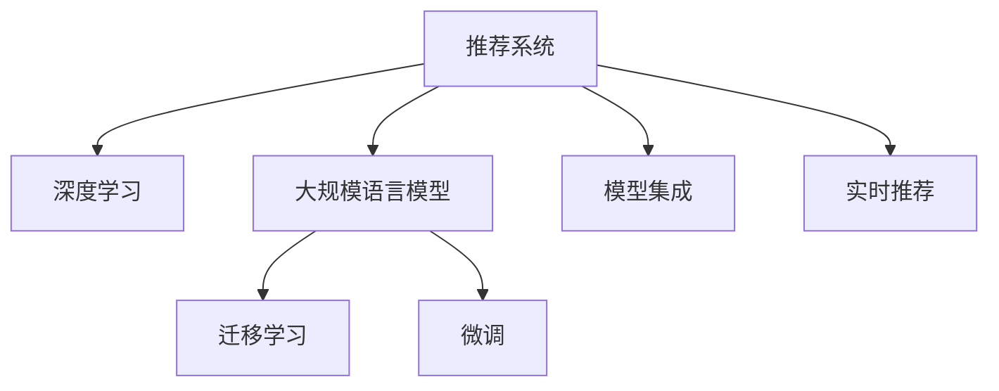

                 

# 推荐系统的未来发展方向：大模型的主流化

## 1. 背景介绍

推荐系统（Recommender System）是指根据用户历史行为、兴趣偏好等信息，为用户推荐个性化物品或内容的技术。推荐系统广泛应用于电子商务、社交网络、视频平台、音乐服务等众多领域，通过精准推荐提升用户满意度和商业价值。近年来，随着大数据、深度学习和自然语言处理（NLP）技术的快速发展，推荐系统的算法和模型也在不断进步，尤其是在大规模语言模型的驱动下，推荐系统呈现出智能化、个性化、实时化的发展趋势。

然而，当前推荐系统仍然面临着诸多挑战。如何在大规模数据和复杂场景下，实现高效、准确、稳定的推荐效果，一直是学术界和工业界共同关注的问题。而大语言模型的出现，为推荐系统提供了新的突破口，有望在现有技术基础上，进一步提升推荐系统的性能和应用范围。

## 2. 核心概念与联系

### 2.1 核心概念概述

为更好地理解基于大模型的主流化推荐系统，本节将介绍几个密切相关的核心概念：

- 推荐系统（Recommender System）：指根据用户历史行为、兴趣偏好等信息，为用户推荐个性化物品或内容的技术。
- 深度学习（Deep Learning）：指利用多层神经网络模型，通过学习大量数据，实现复杂模式识别和智能决策的技术。
- 大规模语言模型（Large Language Model）：指通过预训练，具备强大语言理解和生成能力的大规模神经网络模型，如BERT、GPT-3等。
- 迁移学习（Transfer Learning）：指将一个领域学到的知识，迁移应用到另一个不同但相关的领域的学习范式。
- 微调（Fine-Tuning）：指在预训练模型的基础上，使用下游任务的少量标注数据，通过有监督学习优化模型在该任务上的性能。
- 模型集成（Model Ensemble）：指通过多个模型的组合，提升推荐系统的准确性和鲁棒性。
- 实时推荐（Real-time Recommendation）：指根据用户实时行为数据，动态更新推荐结果，满足个性化推荐需求。

这些核心概念之间的逻辑关系可以通过以下Mermaid流程图来展示：



这个流程图展示了大模型推荐系统的核心概念及其之间的关系：

1. 推荐系统通过深度学习模型学习用户特征，从而进行个性化推荐。
2. 大规模语言模型通过预训练学习通用语言知识，用于提升推荐系统的理解和生成能力。
3. 迁移学习将大规模语言模型的通用知识迁移到推荐系统中，提升推荐效果。
4. 微调对大规模语言模型进行任务适配，使其在推荐系统场景下表现更佳。
5. 模型集成结合多个模型，提升推荐系统的准确性和鲁棒性。
6. 实时推荐根据用户实时行为数据动态更新推荐结果，满足个性化需求。

## 3. 核心算法原理 & 具体操作步骤
### 3.1 算法原理概述

基于大模型的推荐系统，主要利用大规模语言模型在预训练过程中学习到的广泛语言知识和常识，通过迁移学习和微调，提升推荐系统的个性化和智能化水平。其核心思想是：将大规模语言模型视作一个强大的"特征提取器"，通过在推荐任务上进行微调，使得模型能够自动理解用户偏好，生成精准的推荐结果。

形式化地，假设推荐系统中的用户集合为 $U$，物品集合为 $I$，用户与物品之间的交互矩阵为 $R \in \mathbb{R}^{N \times M}$，其中 $N$ 为用户数，$M$ 为物品数，$R_{ui} = 1$ 表示用户 $u$ 对物品 $i$ 的评分，$R_{ui} = 0$ 表示未评分。推荐目标是通过模型预测用户 $u$ 对物品 $i$ 的评分 $R_{ui}$。

### 3.2 算法步骤详解

基于大模型的推荐系统一般包括以下几个关键步骤：

**Step 1: 准备预训练模型和数据集**
- 选择合适的预训练语言模型 $M_{\theta}$ 作为初始化参数，如 BERT、GPT-3 等。
- 准备推荐任务的数据集，一般包括用户行为记录、物品描述、用户-物品交互矩阵等。

**Step 2: 设计推荐目标函数**
- 根据推荐任务类型，设计合适的目标函数，如均方误差损失、交叉熵损失等。
- 将用户行为数据和物品描述作为输入，通过预训练语言模型得到用户对物品的评分预测。

**Step 3: 添加推荐适配层**
- 根据推荐任务类型，在预训练模型顶层设计合适的输出层和损失函数。
- 对于评分预测任务，通常在顶层添加线性分类器或回归器。
- 对于推荐列表任务，通常使用排名损失函数，如Top-K排序损失。

**Step 4: 设置微调超参数**
- 选择合适的优化算法及其参数，如 AdamW、SGD 等，设置学习率、批大小、迭代轮数等。
- 设置正则化技术及强度，包括权重衰减、Dropout、Early Stopping 等。
- 确定冻结预训练参数的策略，如仅微调顶层，或全部参数都参与微调。

**Step 5: 执行梯度训练**
- 将训练集数据分批次输入模型，前向传播计算损失函数。
- 反向传播计算参数梯度，根据设定的优化算法和学习率更新模型参数。
- 周期性在验证集上评估模型性能，根据性能指标决定是否触发 Early Stopping。
- 重复上述步骤直到满足预设的迭代轮数或 Early Stopping 条件。

**Step 6: 测试和部署**
- 在测试集上评估微调后模型 $M_{\hat{\theta}}$ 的性能，对比微调前后的精度提升。
- 使用微调后的模型对新用户进行推荐，集成到实际的应用系统中。
- 持续收集新的用户行为数据，定期重新微调模型，以适应数据分布的变化。

以上是基于大模型的推荐系统的一般流程。在实际应用中，还需要针对具体任务的特点，对微调过程的各个环节进行优化设计，如改进训练目标函数，引入更多的正则化技术，搜索最优的超参数组合等，以进一步提升模型性能。

### 3.3 算法优缺点

基于大模型的推荐系统具有以下优点：
1. 简单高效。只需准备少量标注数据，即可对预训练模型进行快速适配，获得较大的性能提升。
2. 通用适用。适用于各种推荐任务，包括评分预测、推荐列表、热门商品等，设计简单的任务适配层即可实现微调。
3. 参数高效。利用参数高效微调技术，在固定大部分预训练参数的情况下，仍可取得不错的提升。
4. 效果显著。在学术界和工业界的诸多推荐任务上，基于微调的方法已经刷新了最先进的性能指标。

同时，该方法也存在一定的局限性：
1. 依赖标注数据。推荐任务通常需要标注数据进行微调，获取高质量标注数据的成本较高。
2. 迁移能力有限。当目标任务与预训练数据的分布差异较大时，微调的性能提升有限。
3. 可解释性不足。微调模型的决策过程通常缺乏可解释性，难以对其推理逻辑进行分析和调试。
4. 实时性问题。大规模语言模型推理速度较慢，实时推荐场景中可能存在延迟问题。

尽管存在这些局限性，但就目前而言，基于大模型的微调方法仍是目前推荐系统的主流范式。未来相关研究的重点在于如何进一步降低微调对标注数据的依赖，提高模型的少样本学习和跨领域迁移能力，同时兼顾可解释性和实时性等因素。

### 3.4 算法应用领域

基于大模型的推荐系统已经在电子商务、社交网络、视频平台、音乐服务等众多领域得到应用，取得了显著的效果：

- 电子商务：电商平台的商品推荐系统，通过微调用户评价、浏览记录等数据，为用户推荐个性化商品，提升购物体验和转化率。
- 社交网络：社交平台的朋友推荐、内容推荐系统，通过微调用户的点赞、评论等行为数据，为用户推荐相关朋友和内容，提升用户粘性和平台活跃度。
- 视频平台：视频网站的影片推荐系统，通过微调用户评分、观看历史等数据，为用户推荐感兴趣的视频，提升观看时长和满意度。
- 音乐服务：音乐平台的歌手推荐、歌曲推荐系统，通过微调用户听歌记录和评分，为用户推荐个性化音乐，提升用户体验和留存率。

除了上述这些经典任务外，基于大模型的推荐系统也被创新性地应用到更多场景中，如广告定向、新闻订阅、游戏推荐等，为推荐技术带来了全新的突破。随着预训练模型和微调方法的不断进步，相信推荐技术将在更广阔的应用领域大放异彩。

## 4. 数学模型和公式 & 详细讲解  
### 4.1 数学模型构建

本节将使用数学语言对基于大模型的推荐系统进行更加严格的刻画。

记推荐系统中的用户集合为 $U$，物品集合为 $I$，用户与物品之间的交互矩阵为 $R \in \mathbb{R}^{N \times M}$，其中 $N$ 为用户数，$M$ 为物品数，$R_{ui} = 1$ 表示用户 $u$ 对物品 $i$ 的评分，$R_{ui} = 0$ 表示未评分。定义模型 $M_{\theta}$ 在输入 $x$ 上的输出为 $\hat{R}_{ui}=M_{\theta}(x) \in [0,1]$，表示模型预测用户 $u$ 对物品 $i$ 的评分。则推荐系统的目标是最小化预测评分与实际评分之间的差异，即：

$$
\mathcal{L}(\theta) = \frac{1}{N \times M} \sum_{u,i} L(\hat{R}_{ui},R_{ui})
$$

其中 $L$ 为合适的损失函数，如均方误差损失函数：

$$
L(\hat{R}_{ui},R_{ui}) = (\hat{R}_{ui} - R_{ui})^2
$$

在得到损失函数后，模型通过梯度下降等优化算法，不断更新模型参数 $\theta$，最小化损失函数 $\mathcal{L}$。

### 4.2 公式推导过程

以下是均方误差损失函数的详细推导过程：

1. 将评分预测 $\hat{R}_{ui}$ 与实际评分 $R_{ui}$ 的差异表示为：
$$
E_u = \frac{1}{M} \sum_i (\hat{R}_{ui} - R_{ui})^2
$$

2. 对每个用户 $u$ 的误差 $E_u$ 求平均，得到总误差 $L$：
$$
L = \frac{1}{N} \sum_u E_u = \frac{1}{N \times M} \sum_{u,i} (\hat{R}_{ui} - R_{ui})^2
$$

3. 将 $E_u$ 代入损失函数，得到均方误差损失：
$$
L = \frac{1}{N \times M} \sum_{u,i} (\hat{R}_{ui} - R_{ui})^2
$$

通过上述推导，可以看到，基于大模型的推荐系统的目标是最小化预测评分与实际评分之间的平方误差。在微调过程中，可以通过反向传播算法高效计算模型参数的梯度，从而不断优化模型，提升推荐准确性。

### 4.3 案例分析与讲解

以电商平台的商品推荐系统为例，展示基于大模型的推荐系统的工作原理。假设电商平台的推荐任务是通过用户浏览记录、评价数据等，为用户推荐相关商品。具体实现步骤如下：

1. 准备数据：将用户浏览记录、商品描述、用户评分等数据作为预训练语言模型的输入。
2. 微调模型：使用用户行为数据对预训练语言模型进行微调，使其能够自动学习用户偏好，生成评分预测。
3. 生成推荐：根据评分预测结果，对商品进行排序，生成个性化推荐列表。

下面展示一个简单的微调代码实例：

```python
import torch
import torch.nn as nn
from transformers import BertForSequenceClassification

# 定义模型结构
class BERTRecommender(nn.Module):
    def __init__(self, num_classes):
        super(BERTRecommender, self).__init__()
        self.bert = BertForSequenceClassification.from_pretrained('bert-base-uncased', num_labels=num_classes)
        self.dropout = nn.Dropout(0.5)
        self.fc = nn.Linear(self.bert.config.hidden_size, num_classes)

    def forward(self, input_ids, attention_mask, labels=None):
        output = self.bert(input_ids=input_ids, attention_mask=attention_mask)
        output = self.dropout(output[0])
        logits = self.fc(output)
        if labels is not None:
            loss = nn.CrossEntropyLoss()(logits.view(-1, self.fc.out_features), labels.view(-1))
            return loss
        else:
            return logits

# 加载数据集
from torch.utils.data import TensorDataset, DataLoader
train_dataset = TensorDataset(train_input_ids, train_attention_masks, train_labels)
train_dataloader = DataLoader(train_dataset, batch_size=32, shuffle=True)

# 初始化模型和优化器
model = BERTRecommender(num_classes)
optimizer = torch.optim.Adam(model.parameters(), lr=2e-5)

# 微调过程
num_epochs = 5
for epoch in range(num_epochs):
    model.train()
    total_loss = 0
    for batch in train_dataloader:
        input_ids, attention_mask, labels = batch
        optimizer.zero_grad()
        loss = model(input_ids, attention_mask, labels)
        loss.backward()
        optimizer.step()
        total_loss += loss.item()
    print(f'Epoch {epoch+1}, train loss: {total_loss/len(train_dataloader):.4f}')

# 测试过程
test_dataset = TensorDataset(test_input_ids, test_attention_masks, test_labels)
test_dataloader = DataLoader(test_dataset, batch_size=32, shuffle=False)
total_loss = 0
for batch in test_dataloader:
    input_ids, attention_mask, labels = batch
    with torch.no_grad():
        logits = model(input_ids, attention_mask, labels)
    total_loss += nn.CrossEntropyLoss()(logits.view(-1, logits.size(-1)), labels.view(-1)).item()
print(f'Test loss: {total_loss/len(test_dataloader):.4f}')
```

以上代码实现了基于BERT模型和交叉熵损失的推荐系统微调过程。在实际应用中，开发者可以根据具体任务特点，调整模型结构、优化器参数、学习率等超参数，以优化微调效果。

## 5. 项目实践：代码实例和详细解释说明
### 5.1 开发环境搭建

在进行推荐系统微调实践前，我们需要准备好开发环境。以下是使用Python进行PyTorch开发的环境配置流程：

1. 安装Anaconda：从官网下载并安装Anaconda，用于创建独立的Python环境。

2. 创建并激活虚拟环境：
```bash
conda create -n pytorch-env python=3.8 
conda activate pytorch-env
```

3. 安装PyTorch：根据CUDA版本，从官网获取对应的安装命令。例如：
```bash
conda install pytorch torchvision torchaudio cudatoolkit=11.1 -c pytorch -c conda-forge
```

4. 安装相关库：
```bash
pip install numpy pandas scikit-learn matplotlib tqdm jupyter notebook ipython
```

5. 安装Transformers库：
```bash
pip install transformers
```

完成上述步骤后，即可在`pytorch-env`环境中开始推荐系统微调实践。

### 5.2 源代码详细实现

这里我们以电商平台的商品推荐系统为例，展示使用Transformers库对BERT模型进行推荐系统微调的PyTorch代码实现。

首先，定义推荐系统任务的数据处理函数：

```python
from transformers import BertTokenizer
from torch.utils.data import Dataset
import torch

class RecommendationDataset(Dataset):
    def __init__(self, items, user_features, user_ratings, tokenizer, max_len=128):
        self.items = items
        self.user_features = user_features
        self.user_ratings = user_ratings
        self.tokenizer = tokenizer
        self.max_len = max_len
        
    def __len__(self):
        return len(self.items)
    
    def __getitem__(self, item):
        item_id = self.items[item]
        user_features = self.user_features[item]
        user_ratings = self.user_ratings[item]
        
        encoding = self.tokenizer(user_features, return_tensors='pt', max_length=self.max_len, padding='max_length', truncation=True)
        input_ids = encoding['input_ids'][0]
        attention_mask = encoding['attention_mask'][0]
        
        # 对评分预测进行编码
        encoded_ratings = [rating2id[rating] for rating in user_ratings] 
        encoded_ratings.extend([rating2id['O']] * (self.max_len - len(encoded_ratings)))
        labels = torch.tensor(encoded_ratings, dtype=torch.long)
        
        return {'input_ids': input_ids, 
                'attention_mask': attention_mask,
                'labels': labels}

# 评分与id的映射
rating2id = {'O': 0, '1': 1, '2': 2, '3': 3, '4': 4, '5': 5}
id2rating = {v: k for k, v in rating2id.items()}

# 创建dataset
tokenizer = BertTokenizer.from_pretrained('bert-base-cased')

train_dataset = RecommendationDataset(train_items, train_user_features, train_user_ratings, tokenizer)
dev_dataset = RecommendationDataset(dev_items, dev_user_features, dev_user_ratings, tokenizer)
test_dataset = RecommendationDataset(test_items, test_user_features, test_user_ratings, tokenizer)
```

然后，定义模型和优化器：

```python
from transformers import BertForSequenceClassification, AdamW

model = BertForSequenceClassification.from_pretrained('bert-base-cased', num_labels=len(rating2id))

optimizer = AdamW(model.parameters(), lr=2e-5)
```

接着，定义训练和评估函数：

```python
from torch.utils.data import DataLoader
from tqdm import tqdm
from sklearn.metrics import classification_report

device = torch.device('cuda') if torch.cuda.is_available() else torch.device('cpu')
model.to(device)

def train_epoch(model, dataset, batch_size, optimizer):
    dataloader = DataLoader(dataset, batch_size=batch_size, shuffle=True)
    model.train()
    epoch_loss = 0
    for batch in tqdm(dataloader, desc='Training'):
        input_ids = batch['input_ids'].to(device)
        attention_mask = batch['attention_mask'].to(device)
        labels = batch['labels'].to(device)
        model.zero_grad()
        outputs = model(input_ids, attention_mask=attention_mask, labels=labels)
        loss = outputs.loss
        epoch_loss += loss.item()
        loss.backward()
        optimizer.step()
    return epoch_loss / len(dataloader)

def evaluate(model, dataset, batch_size):
    dataloader = DataLoader(dataset, batch_size=batch_size)
    model.eval()
    preds, labels = [], []
    with torch.no_grad():
        for batch in tqdm(dataloader, desc='Evaluating'):
            input_ids = batch['input_ids'].to(device)
            attention_mask = batch['attention_mask'].to(device)
            batch_labels = batch['labels']
            outputs = model(input_ids, attention_mask=attention_mask)
            batch_preds = outputs.logits.argmax(dim=2).to('cpu').tolist()
            batch_labels = batch_labels.to('cpu').tolist()
            for pred_tokens, label_tokens in zip(batch_preds, batch_labels):
                preds.append(pred_tokens[:len(label_tokens)])
                labels.append(label_tokens)
                
    print(classification_report(labels, preds))
```

最后，启动训练流程并在测试集上评估：

```python
epochs = 5
batch_size = 16

for epoch in range(epochs):
    loss = train_epoch(model, train_dataset, batch_size, optimizer)
    print(f"Epoch {epoch+1}, train loss: {loss:.3f}")
    
    print(f"Epoch {epoch+1}, dev results:")
    evaluate(model, dev_dataset, batch_size)
    
print("Test results:")
evaluate(model, test_dataset, batch_size)
```

以上就是使用PyTorch对BERT进行推荐系统微调的完整代码实现。可以看到，得益于Transformers库的强大封装，我们可以用相对简洁的代码完成BERT模型的加载和微调。

### 5.3 代码解读与分析

让我们再详细解读一下关键代码的实现细节：

**RecommendationDataset类**：
- `__init__`方法：初始化物品、用户特征、评分等关键组件。
- `__len__`方法：返回数据集的样本数量。
- `__getitem__`方法：对单个样本进行处理，将物品特征、评分预测进行编码，并对其进行定长padding，最终返回模型所需的输入。

**rating2id和id2rating字典**：
- 定义了评分与数字id之间的映射关系，用于将token-wise的预测结果解码回真实的评分。

**训练和评估函数**：
- 使用PyTorch的DataLoader对数据集进行批次化加载，供模型训练和推理使用。
- 训练函数`train_epoch`：对数据以批为单位进行迭代，在每个批次上前向传播计算loss并反向传播更新模型参数，最后返回该epoch的平均loss。
- 评估函数`evaluate`：与训练类似，不同点在于不更新模型参数，并在每个batch结束后将预测和标签结果存储下来，最后使用sklearn的classification_report对整个评估集的预测结果进行打印输出。

**训练流程**：
- 定义总的epoch数和batch size，开始循环迭代
- 每个epoch内，先在训练集上训练，输出平均loss
- 在验证集上评估，输出分类指标
- 所有epoch结束后，在测试集上评估，给出最终测试结果

可以看到，PyTorch配合Transformers库使得BERT微调的代码实现变得简洁高效。开发者可以将更多精力放在数据处理、模型改进等高层逻辑上，而不必过多关注底层的实现细节。

当然，工业级的系统实现还需考虑更多因素，如模型的保存和部署、超参数的自动搜索、更灵活的任务适配层等。但核心的微调范式基本与此类似。

## 6. 实际应用场景
### 6.1 电商推荐系统

基于大模型的电商推荐系统，可以通过微调用户行为数据，生成个性化的商品推荐。电商平台的商品推荐系统，通过微调用户浏览记录、评价数据等，为用户推荐个性化商品，提升购物体验和转化率。具体实现步骤如下：

1. 准备数据：将用户浏览记录、商品描述、用户评分等数据作为预训练语言模型的输入。
2. 微调模型：使用用户行为数据对预训练语言模型进行微调，使其能够自动学习用户偏好，生成评分预测。
3. 生成推荐：根据评分预测结果，对商品进行排序，生成个性化推荐列表。

在实际应用中，推荐系统还可以结合用户实时行为数据，动态更新推荐结果，满足个性化推荐需求。

### 6.2 社交平台推荐

基于大模型的社交平台推荐系统，可以通过微调用户互动数据，为用户推荐相关朋友和内容。社交平台的朋友推荐、内容推荐系统，通过微调用户的点赞、评论等行为数据，为用户推荐相关朋友和内容，提升用户粘性和平台活跃度。具体实现步骤如下：

1. 准备数据：将用户点赞、评论、关注等数据作为预训练语言模型的输入。
2. 微调模型：使用用户互动数据对预训练语言模型进行微调，使其能够自动学习用户偏好，生成评分预测。
3. 生成推荐：根据评分预测结果，对好友和内容进行排序，生成个性化推荐列表。

在实际应用中，推荐系统还可以结合实时互动数据，动态更新推荐结果，提升用户满意度。

### 6.3 视频平台推荐

基于大模型的视频平台推荐系统，可以通过微调用户观看历史数据，为用户推荐感兴趣的视频。视频网站的影片推荐系统，通过微调用户评分、观看历史等数据，为用户推荐感兴趣的视频，提升观看时长和满意度。具体实现步骤如下：

1. 准备数据：将用户评分、观看历史、评价等数据作为预训练语言模型的输入。
2. 微调模型：使用用户观看历史数据对预训练语言模型进行微调，使其能够自动学习用户偏好，生成评分预测。
3. 生成推荐：根据评分预测结果，对影片进行排序，生成个性化推荐列表。

在实际应用中，推荐系统还可以结合实时观看数据，动态更新推荐结果，满足个性化需求。

### 6.4 音乐服务推荐

基于大模型的音乐服务推荐系统，可以通过微调用户听歌记录和评分，为用户推荐个性化音乐。音乐平台的歌手推荐、歌曲推荐系统，通过微调用户听歌记录和评分，为用户推荐个性化音乐，提升用户体验和留存率。具体实现步骤如下：

1. 准备数据：将用户听歌记录、评分、评论等数据作为预训练语言模型的输入。
2. 微调模型：使用用户听歌记录和评分对预训练语言模型进行微调，使其能够自动学习用户偏好，生成评分预测。
3. 生成推荐：根据评分预测结果，对歌手和歌曲进行排序，生成个性化推荐列表。

在实际应用中，推荐系统还可以结合实时听歌数据，动态更新推荐结果，提升用户满意度。

### 6.5 游戏推荐

基于大模型的游戏推荐系统，可以通过微调用户游戏行为数据，为用户推荐适合的游戏。游戏平台的推荐系统，通过微调用户游戏行为数据，为用户推荐适合的游戏，提升游戏体验和用户留存率。具体实现步骤如下：

1. 准备数据：将用户游戏行为数据、评分、评价等数据作为预训练语言模型的输入。
2. 微调模型：使用用户游戏行为数据对预训练语言模型进行微调，使其能够自动学习用户偏好，生成评分预测。
3. 生成推荐：根据评分预测结果，对游戏进行排序，生成个性化推荐列表。

在实际应用中，推荐系统还可以结合实时游戏数据，动态更新推荐结果，满足个性化需求。

## 7. 工具和资源推荐
### 7.1 学习资源推荐

为了帮助开发者系统掌握大模型在推荐系统中的应用，这里推荐一些优质的学习资源：

1. 《推荐系统》系列博文：由大模型技术专家撰写，深入浅出地介绍了推荐系统的原理、算法和模型，涵盖多个前沿方向。

2. CS448《Recommender Systems》课程：斯坦福大学开设的推荐系统课程，系统讲解推荐系统的基本概念和经典模型，包括深度学习和大模型的应用。

3. 《Recommender Systems Handbook》书籍：推荐系统领域的经典书籍，系统总结了推荐系统的各个方面，从理论到实践，全面覆盖了推荐系统的各个环节。

4. RecSys开源项目：推荐系统评测基准，涵盖多种推荐系统任务和算法，并提供了基于大模型的基线模型，助力推荐系统研究。

通过对这些资源的学习实践，相信你一定能够快速掌握大模型在推荐系统中的应用，并用于解决实际的推荐问题。

### 7.2 开发工具推荐

高效的开发离不开优秀的工具支持。以下是几款用于大模型推荐系统开发的常用工具：

1. PyTorch：基于Python的开源深度学习框架，灵活动态的计算图，适合快速迭代研究。大部分预训练语言模型都有PyTorch版本的实现。

2. TensorFlow：由Google主导开发的开源深度学习框架，生产部署方便，适合大规模工程应用。同样有丰富的预训练语言模型资源。

3. Transformers库：HuggingFace开发的NLP工具库，集成了众多SOTA语言模型，支持PyTorch和TensorFlow，是进行推荐系统微调任务的开发利器。

4. Weights & Biases：模型训练的实验跟踪工具，可以记录和可视化模型训练过程中的各项指标，方便对比和调优。与主流深度学习框架无缝集成。

5. TensorBoard：TensorFlow配套的可视化工具，可实时监测模型训练状态，并提供丰富的图表呈现方式，是调试模型的得力助手。

6. Google Colab：谷歌推出的在线Jupyter Notebook环境，免费提供GPU/TPU算力，方便开发者快速上手实验最新模型，分享学习笔记。

合理利用这些工具，可以显著提升大模型推荐系统的开发效率，加快创新迭代的步伐。

### 7.3 相关论文推荐

大模型在推荐系统中的应用，得益于学界的持续研究。以下是几篇奠基性的相关论文，推荐阅读：

1. Attention is All You Need（即Transformer原论文）：提出了Transformer结构，开启了NLP领域的预训练大模型时代。

2. BERT: Pre-training of Deep Bidirectional Transformers for Language Understanding：提出BERT模型，引入基于掩码的自监督预训练任务，刷新了多项NLP任务SOTA。

3. Deep Neural Networks for Recommendation Systems：介绍了深度学习在推荐系统中的应用，包括基于神经网络的协同过滤和矩阵分解模型。

4. Matrix Factorization Techniques for Recommender Systems：系统总结了矩阵分解类推荐算法的原理和应用，包括奇异值分解和梯度下降等优化方法。

5. Knowledge-Aware Recommendation with Diverse Statistical Knowledge Graphs：提出基于知识图谱的推荐算法，利用领域知识提升推荐效果。

这些论文代表了大模型在推荐系统中的应用和发展脉络。通过学习这些前沿成果，可以帮助研究者把握学科前进方向，激发更多的创新灵感。

## 8. 总结：未来发展趋势与挑战

### 8.1 总结

本文对基于大模型的推荐系统进行了全面系统的介绍。首先阐述了大模型在推荐系统中的应用背景和意义，明确了微调在提升推荐系统性能和个性化程度方面的独特价值。其次，从原理到实践，详细讲解了基于大模型的推荐系统数学模型和关键步骤，给出了推荐系统微调任务开发的完整代码实例。同时，本文还广泛探讨了大模型在电商、社交、视频、音乐等领域的应用前景，展示了其广阔的应用潜力。

通过本文的系统梳理，可以看到，基于大模型的推荐系统在推荐精度、个性化和实时性等方面均有显著提升。得益于大规模语言模型的强大语言理解和生成能力，推荐系统能够自动学习用户偏好，生成精准的推荐结果。未来，随着预训练语言模型和微调方法的不断进步，推荐系统的智能化、个性化、实时化水平将进一步提升，推动推荐技术在更多领域的应用和落地。

### 8.2 未来发展趋势

展望未来，大模型推荐系统将呈现以下几个发展趋势：

1. 模型规模持续增大。随着算力成本的下降和数据规模的扩张，预训练语言模型的参数量还将持续增长。超大规模语言模型蕴含的丰富语言知识，有望支撑更加复杂多变的推荐任务。

2. 推荐算法日趋多样。除了传统的深度学习推荐算法外，未来会涌现更多基于大模型的推荐算法，如基于大模型的序列推荐模型、图神经网络推荐模型等，提升推荐系统的多样性和灵活性。

3. 实时推荐成为常态。随着GPU/TPU等高性能计算设备的普及，实时推荐系统将逐渐成为推荐系统的主流范式，能够满足用户实时需求，提升用户体验。

4. 跨模态推荐崛起。未来的推荐系统将越来越多地融合多种数据模态，如文本、图像、视频、声音等，构建多模态融合的推荐模型，提升推荐效果。

5. 推荐系统智能化水平提升。大语言模型不仅能处理语言文本，还可以直接处理语音、图像等多模态数据，使得推荐系统具备更强的智能化和自动化水平。

以上趋势凸显了大模型推荐系统的广阔前景。这些方向的探索发展，必将进一步提升推荐系统的性能和应用范围，为推荐技术带来新的突破。

### 8.3 面临的挑战

尽管大模型推荐系统已经取得了显著成就，但在迈向更加智能化、普适化应用的过程中，它仍面临着诸多挑战：

1. 数据隐私问题。推荐系统需要收集大量用户行为数据，如何保护用户隐私，防止数据滥用，是推荐系统面临的重要挑战。

2. 实时性问题。虽然大模型推理速度较慢，但推荐系统需要实时响应用户请求，如何解决推荐延迟，提升系统响应速度，是一个亟待解决的难题。

3. 可解释性不足。大模型推荐系统缺乏可解释性，用户难以理解模型的推荐逻辑，可能会对推荐结果产生怀疑，降低用户体验。

4. 数据质量问题。推荐系统依赖大量数据进行训练，如何保证数据的质量和多样性，是推荐系统持续优化和改进的基础。

5. 模型泛化能力不足。大规模语言模型往往面临过拟合问题，如何提高模型的泛化能力，适应不同领域和用户群体，是推荐系统面临的重要挑战。

6. 知识库集成问题。推荐系统需要与外部知识库、规则库等专家知识结合，形成更加全面、准确的信息整合能力，如何实现知识库与模型的有效融合，是推荐系统的重要研究方向。

这些挑战需要通过技术创新和算法优化，逐步解决，才能实现大模型推荐系统的广泛应用和落地。

### 8.4 研究展望

面对大模型推荐系统所面临的挑战，未来的研究需要在以下几个方面寻求新的突破：

1. 探索无监督和半监督推荐方法。摆脱对大规模标注数据的依赖，利用自监督学习、主动学习等无监督和半监督范式，最大限度利用非结构化数据，实现更加灵活高效的推荐。

2. 研究参数高效和计算高效的推荐范式。开发更加参数高效的推荐方法，在固定大部分预训练参数的同时，只更新极少量的任务相关参数。同时优化推荐模型的计算图，减少前向传播和反向传播的资源消耗，实现更加轻量级、实时性的部署。

3. 融合因果和对比学习范式。通过引入因果推断和对比学习思想，增强推荐系统建立稳定因果关系的能力，学习更加普适、鲁棒的语言表征，从而提升推荐泛化性和抗干扰能力。

4. 引入更多先验知识。将符号化的先验知识，如知识图谱、逻辑规则等，与神经网络模型进行巧妙融合，引导推荐过程学习更准确、合理的语言模型。同时加强不同模态数据的整合，实现视觉、语音等多模态信息与文本信息的协同建模。

5. 结合因果分析和博弈论工具。将因果分析方法引入推荐系统，识别出推荐决策的关键特征，增强输出解释的因果性和逻辑性。借助博弈论工具刻画人机交互过程，主动探索并规避推荐系统的脆弱点，提高系统稳定性。

6. 纳入伦理道德约束。在推荐系统训练目标中引入伦理导向的评估指标，过滤和惩罚有偏见、有害的输出倾向。同时加强人工干预和审核，建立推荐系统的监管机制，确保推荐内容符合人类价值观和伦理道德。

这些研究方向的探索，必将引领大模型推荐系统迈向更高的台阶，为构建智能推荐系统铺平道路。面向未来，大模型推荐系统还需要与其他人工智能技术进行更深入的融合，如知识表示、因果推理、强化学习等，多路径协同发力，共同推动推荐技术的发展。只有勇于创新、敢于突破，才能不断拓展推荐系统的边界，让智能技术更好地造福用户。

## 9. 附录：常见问题与解答

**Q1：大模型推荐系统是否适用于所有推荐任务？**

A: 大模型推荐系统在大多数推荐任务上都能取得不错的效果，特别是对于数据量较小的任务。但对于一些特定领域的任务，如医学、法律等，仅仅依靠通用语料预训练的模型可能难以很好地适应。此时需要在特定领域语料上进一步预训练，再进行微调，才能获得理想效果。此外，对于一些需要时效性、个性化很强的任务，如对话、推荐等，微调方法也需要针对性的改进优化。

**Q2：推荐系统中如何选择合适的学习率？**

A: 推荐系统中的学习率一般要比预训练时小1-2个数量级，如果使用过大的学习率，容易破坏预训练权重，导致过拟合。一般建议从1e-5开始调参，逐步减小学习率，直至收敛。也可以使用warmup策略，在开始阶段使用较小的学习率，再逐渐过渡到预设值。需要注意的是，不同的优化器(如AdamW、Adafactor等)以及不同的学习率调度策略，可能需要设置不同的学习率阈值。

**Q3：推荐系统在落地部署时需要注意哪些问题？**

A: 将推荐系统转化为实际应用，还需要考虑以下因素：
1. 模型裁剪：去除不必要的层和参数，减小模型尺寸，加快推理速度
2. 量化加速：将浮点模型转为定点模型，压缩存储空间，提高计算效率
3. 服务化封装：将模型封装为标准化服务接口，便于集成调用
4. 弹性伸缩：根据请求流量动态调整资源配置，平衡服务质量和成本
5. 监控告警：实时采集系统指标，设置异常告警阈值，确保服务稳定性
6. 安全防护：采用访问鉴权、数据脱敏等措施，保障数据和模型安全

大语言模型推荐系统为推荐技术带来了新的突破口，但如何将强大的性能转化为稳定、高效、安全的业务价值，还需要工程实践的不断打磨。唯有从数据、算法、工程、业务等多个维度协同发力，才能真正实现人工智能技术在推荐领域的应用落地。总之，推荐系统需要开发者根据具体任务，不断迭代和优化模型、数据和算法，方能得到理想的效果。

---

作者：禅与计算机程序设计艺术 / Zen and the Art of Computer Programming

