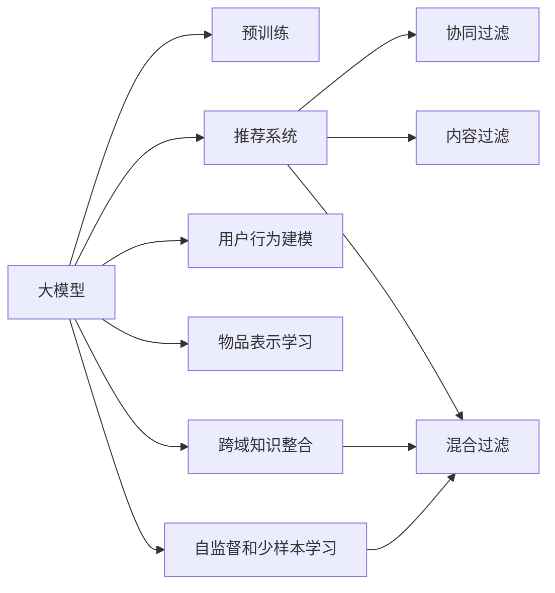

                 

# 推荐系统的未来：大模型的主导作用与创新

## 1. 背景介绍

### 1.1 问题由来
推荐系统（Recommendation System）作为互联网时代的重要技术，在电商、社交网络、流媒体、新闻媒体等众多领域得到了广泛应用。然而，传统的推荐系统往往基于基于协同过滤、内容过滤等方法，其性能很大程度上依赖于用户历史行为数据和物品属性信息。这种数据驱动的方法在数据丰富时效果显著，但当数据稀疏或特征缺失时，推荐效果将大打折扣。

近年来，随着深度学习和大模型的兴起，推荐系统领域也迎来了新的发展契机。其中，大模型在推荐系统中的应用，更是成为当前研究的热点。基于大模型的推荐系统不仅能够学习用户行为的复杂模式，还能整合海量数据，优化推荐效果，为推荐系统带来了革命性的变化。本文将从大模型在推荐系统中的主导作用和创新两方面，系统梳理和探讨推荐系统的发展方向。

### 1.2 问题核心关键点
大模型在推荐系统中的应用，主要体现在以下几个方面：

- **用户行为建模**：通过预训练模型学习用户行为的复杂模式，能够更准确地预测用户偏好。
- **物品表示学习**：利用大模型对物品进行多维表示学习，提升推荐系统的精度和鲁棒性。
- **跨域知识整合**：融合多种数据源（如用户行为、物品属性、社交网络等）的知识，丰富推荐系统的内涵。
- **自监督和少样本学习**：通过自监督和少样本学习，提升推荐系统的泛化能力和鲁棒性。
- **跨领域迁移**：大模型能够通过微调快速适应新任务，在不同领域间进行迁移学习。

这些关键点揭示了基于大模型的推荐系统在推荐精准度、泛化能力、效率等方面的显著优势。下面，我们将从这些关键点出发，详细探讨大模型在推荐系统中的主导作用和创新。

## 2. 核心概念与联系

### 2.1 核心概念概述

为更好地理解大模型在推荐系统中的应用，本节将介绍几个关键概念：

- **大模型**：指具有大量参数和复杂结构的深度神经网络模型，如BERT、GPT、DALL·E等。通过在大规模数据上进行预训练，能够学习到丰富的语言、视觉等知识，具备强大的表征学习能力。

- **预训练**：指在大规模无标签数据上，通过自监督学习任务训练通用模型的过程。常见的预训练任务包括语言模型、图像分类等。

- **推荐系统**：指基于用户历史行为数据，为用户推荐感兴趣物品的系统。推荐系统分为基于协同过滤、内容过滤、混合过滤等多种方法。

- **推荐精度**：指推荐系统为用户推荐的物品与用户真实偏好的匹配程度。推荐精度越高，推荐效果越好。

- **跨域知识整合**：指将不同数据源（如用户行为、物品属性、社交网络等）的知识整合到推荐系统，提升推荐效果。

- **自监督和少样本学习**：指在仅有少量标注样本或无标注数据的情况下，通过模型自身的特点，学习到合适的表征。

这些概念之间的关系可以通过以下Mermaid流程图来展示：



这个流程图展示了大模型的核心概念及其与推荐系统的联系：

1. 大模型通过预训练获得基础能力。
2. 推荐系统利用大模型进行用户行为建模、物品表示学习、跨域知识整合等优化。
3. 自监督和少样本学习使得大模型能够高效利用数据，提升推荐系统泛化能力。

## 3. 核心算法原理 & 具体操作步骤
### 3.1 算法原理概述

基于大模型的推荐系统，本质上是一种混合推荐方法。其核心思想是：将预训练的大模型视作一个强大的"知识库"，通过在下游推荐任务上进行微调，使得模型能够学习到适合特定场景的推荐策略。

形式化地，假设预训练模型为 $M_{\theta}$，其中 $\theta$ 为预训练得到的模型参数。给定推荐任务 $T$ 的训练集 $D=\{(x_i, y_i)\}_{i=1}^N$，推荐系统的优化目标是最大化用户对推荐物品的满意度，即：

$$
\hat{\theta}=\mathop{\arg\max}_{\theta} \mathcal{L}(M_{\theta},D)
$$

其中 $\mathcal{L}$ 为推荐系统设计的满意度损失函数，用于衡量用户对推荐物品的满意度。常见的满意度损失函数包括平均绝对误差损失、均方根误差损失等。

通过梯度下降等优化算法，推荐系统不断更新模型参数 $\theta$，最大化损失函数 $\mathcal{L}$，使得推荐系统输出的物品能够获得用户的最大满意度。由于 $\theta$ 已经通过预训练获得了较好的初始化，因此即便在有限的标注数据上，也能较快收敛到理想的模型参数 $\hat{\theta}$。

### 3.2 算法步骤详解

基于大模型的推荐系统一般包括以下几个关键步骤：

**Step 1: 准备预训练模型和数据集**
- 选择合适的预训练模型 $M_{\theta}$ 作为初始化参数，如 BERT、GPT、DALL·E等。
- 准备推荐任务 $T$ 的训练集 $D$，划分为训练集、验证集和测试集。一般要求推荐数据的分布与预训练数据的分布不要差异过大。

**Step 2: 定义推荐模型**
- 根据推荐任务类型，设计合适的推荐模型架构，如多层感知机、Transformer、Causal-LM等。
- 将预训练模型作为推荐模型的输入层，添加推荐策略层，如注意力机制、交叉熵损失等。

**Step 3: 设置推荐超参数**
- 选择合适的优化算法及其参数，如 Adam、SGD 等，设置学习率、批大小、迭代轮数等。
- 设置正则化技术及强度，包括权重衰减、Dropout、Early Stopping等。
- 确定冻结预训练参数的策略，如仅微调顶层，或全部参数都参与微调。

**Step 4: 执行梯度训练**
- 将训练集数据分批次输入模型，前向传播计算满意度损失。
- 反向传播计算参数梯度，根据设定的优化算法和学习率更新模型参数。
- 周期性在验证集上评估模型性能，根据性能指标决定是否触发 Early Stopping。
- 重复上述步骤直到满足预设的迭代轮数或 Early Stopping 条件。

**Step 5: 测试和部署**
- 在测试集上评估推荐系统 $M_{\hat{\theta}}$ 的性能，对比微调前后的推荐精度提升。
- 使用推荐系统对新物品进行推荐，集成到实际的应用系统中。
- 持续收集新的数据，定期重新微调模型，以适应数据分布的变化。

以上是基于大模型的推荐系统的一般流程。在实际应用中，还需要针对具体任务的特点，对推荐过程的各个环节进行优化设计，如改进训练目标函数，引入更多的正则化技术，搜索最优的超参数组合等，以进一步提升推荐系统性能。

### 3.3 算法优缺点

基于大模型的推荐系统具有以下优点：
1. 能够学习用户行为的复杂模式，推荐精度高。
2. 利用大模型的丰富知识，提升推荐系统的泛化能力和鲁棒性。
3. 数据需求低，在少量标注数据情况下也能取得不错的效果。
4. 支持自监督和少样本学习，利用更少数据提升性能。
5. 跨领域迁移能力强，能够适应不同领域和场景。

同时，该方法也存在一定的局限性：
1. 计算成本高，对硬件资源需求大。
2. 模型复杂度大，推理速度慢。
3. 模型可解释性不足，难以理解推荐逻辑。
4. 偏见和有害信息可能传递到推荐结果，影响用户体验。
5. 模型训练时间长，需较长时间调整超参数。

尽管存在这些局限性，但就目前而言，基于大模型的推荐系统仍是最主流的推荐方法。未来相关研究的重点在于如何进一步降低计算成本，提高推理速度，提升模型可解释性，以及避免偏见和有害信息。

### 3.4 算法应用领域

基于大模型的推荐系统已经在电商、社交网络、流媒体、新闻媒体等众多领域得到了广泛应用，具体包括：

- **电商推荐**：根据用户历史浏览、点击、购买记录，推荐感兴趣的商品。
- **社交网络**：推荐朋友、关注内容、参与讨论等。
- **流媒体**：推荐电影、电视剧、音乐、视频等。
- **新闻媒体**：推荐新闻、文章、视频等。
- **广告推荐**：推荐广告、内容、产品等。

除了上述这些经典应用外，大模型推荐技术也被创新性地应用到更多场景中，如可控推荐、个性化广告、智能家居、智能交通等，为推荐系统带来了新的突破。随着预训练模型和推荐方法的不断进步，相信推荐系统将在更广阔的应用领域大放异彩。

## 4. 数学模型和公式 & 详细讲解 & 举例说明
### 4.1 数学模型构建

本节将使用数学语言对基于大模型的推荐系统进行更加严格的刻画。

记预训练模型为 $M_{\theta}:\mathcal{X} \rightarrow \mathcal{Y}$，其中 $\mathcal{X}$ 为用户历史行为数据，$\mathcal{Y}$ 为用户可能感兴趣物品的集合。假设推荐任务 $T$ 的训练集为 $D=\{(x_i, y_i)\}_{i=1}^N$，其中 $x_i$ 为第 $i$ 个用户的推荐数据，$y_i$ 为用户可能感兴趣物品的集合。

定义推荐系统在数据样本 $(x,y)$ 上的满意度损失函数为 $\ell(M_{\theta}(x),y)$，则在数据集 $D$ 上的满意度损失为：

$$
\mathcal{L}(\theta) = -\frac{1}{N}\sum_{i=1}^N \ell(M_{\theta}(x_i),y_i)
$$

推荐系统的优化目标是最大化满意度损失，即找到最优参数：

$$
\theta^* = \mathop{\arg\max}_{\theta} \mathcal{L}(\theta)
$$

在实践中，我们通常使用基于梯度的优化算法（如SGD、Adam等）来近似求解上述最优化问题。设 $\eta$ 为学习率，$\lambda$ 为正则化系数，则参数的更新公式为：

$$
\theta \leftarrow \theta - \eta \nabla_{\theta}\mathcal{L}(\theta) - \eta\lambda\theta
$$

其中 $\nabla_{\theta}\mathcal{L}(\theta)$ 为损失函数对参数 $\theta$ 的梯度，可通过反向传播算法高效计算。

### 4.2 公式推导过程

以下我们以电商推荐任务为例，推导满意度损失函数及其梯度的计算公式。

假设模型 $M_{\theta}$ 在输入 $x$ 上的输出为 $\hat{y}=M_{\theta}(x) \in \mathbb{R}^n$，表示用户对 $n$ 个物品的兴趣程度预测。真实标签 $y \in \{0,1\}^n$，其中 $y_i=1$ 表示用户对第 $i$ 个物品感兴趣，$y_i=0$ 表示用户对第 $i$ 个物品不感兴趣。则满意度损失函数定义为：

$$
\ell(M_{\theta}(x),y) = -\sum_{i=1}^n \ell_i(M_{\theta}(x_i),y_i)
$$

其中 $\ell_i$ 为单物品的满意度损失函数，可以是平均绝对误差损失：

$$
\ell_i(M_{\theta}(x),y) = |M_{\theta}(x_i) - y_i|
$$

将 $\ell_i$ 代入总体满意度损失函数，得：

$$
\mathcal{L}(\theta) = -\frac{1}{N}\sum_{i=1}^N \sum_{j=1}^n |M_{\theta}(x_i) - y_{ij}|
$$

根据链式法则，损失函数对参数 $\theta_k$ 的梯度为：

$$
\frac{\partial \mathcal{L}(\theta)}{\partial \theta_k} = -\frac{1}{N}\sum_{i=1}^N \sum_{j=1}^n \frac{\partial M_{\theta}(x_i)}{\partial \theta_k} \cdot \text{sgn}(M_{\theta}(x_i) - y_{ij})
$$

其中 $\text{sgn}(x)$ 为符号函数，$\frac{\partial M_{\theta}(x_i)}{\partial \theta_k}$ 为模型的导数，可通过自动微分技术完成计算。

在得到损失函数的梯度后，即可带入参数更新公式，完成模型的迭代优化。重复上述过程直至收敛，最终得到适应下游任务的最优模型参数 $\theta^*$。

## 5. 项目实践：代码实例和详细解释说明
### 5.1 开发环境搭建

在进行推荐系统开发前，我们需要准备好开发环境。以下是使用Python进行PyTorch开发的环境配置流程：

1. 安装Anaconda：从官网下载并安装Anaconda，用于创建独立的Python环境。

2. 创建并激活虚拟环境：
```bash
conda create -n pytorch-env python=3.8 
conda activate pytorch-env
```

3. 安装PyTorch：根据CUDA版本，从官网获取对应的安装命令。例如：
```bash
conda install pytorch torchvision torchaudio cudatoolkit=11.1 -c pytorch -c conda-forge
```

4. 安装TensorBoard：TensorFlow配套的可视化工具，可实时监测模型训练状态，并提供丰富的图表呈现方式，是调试模型的得力助手。

5. 安装TensorFlow：由Google主导开发的开源深度学习框架，生产部署方便，适合大规模工程应用。

6. 安装Weights & Biases：模型训练的实验跟踪工具，可以记录和可视化模型训练过程中的各项指标，方便对比和调优。

完成上述步骤后，即可在`pytorch-env`环境中开始推荐系统开发。

### 5.2 源代码详细实现

这里我们以电商平台推荐系统为例，给出使用PyTorch进行电商推荐任务的代码实现。

首先，定义电商推荐系统的数据处理函数：

```python
from torch.utils.data import Dataset
import torch

class EcommerceDataset(Dataset):
    def __init__(self, user_data, item_data):
        self.user_data = user_data
        self.item_data = item_data
        self.n_items = len(item_data)
    
    def __len__(self):
        return len(self.user_data)
    
    def __getitem__(self, index):
        user_data = self.user_data[index]
        item_data = self.item_data[index]
        return {'user_data': user_data, 'item_data': item_data}
```

然后，定义模型和优化器：

```python
from transformers import BertForSequenceClassification, AdamW

model = BertForSequenceClassification.from_pretrained('bert-base-cased', num_labels=self.n_items)
optimizer = AdamW(model.parameters(), lr=2e-5)
```

接着，定义训练和评估函数：

```python
from torch.utils.data import DataLoader
from tqdm import tqdm

device = torch.device('cuda') if torch.cuda.is_available() else torch.device('cpu')
model.to(device)

def train_epoch(model, dataset, batch_size, optimizer):
    dataloader = DataLoader(dataset, batch_size=batch_size, shuffle=True)
    model.train()
    epoch_loss = 0
    for batch in tqdm(dataloader, desc='Training'):
        user_data = batch['user_data'].to(device)
        item_data = batch['item_data'].to(device)
        model.zero_grad()
        outputs = model(user_data, labels=item_data)
        loss = outputs.loss
        epoch_loss += loss.item()
        loss.backward()
        optimizer.step()
    return epoch_loss / len(dataloader)

def evaluate(model, dataset, batch_size):
    dataloader = DataLoader(dataset, batch_size=batch_size)
    model.eval()
    preds, labels = [], []
    with torch.no_grad():
        for batch in tqdm(dataloader, desc='Evaluating'):
            user_data = batch['user_data'].to(device)
            item_data = batch['item_data'].to(device)
            batch_labels = item_data
            outputs = model(user_data, labels=item_data)
            batch_preds = outputs.logits.argmax(dim=1).to('cpu').tolist()
            batch_labels = batch_labels.to('cpu').tolist()
            for pred_tokens, label_tokens in zip(batch_preds, batch_labels):
                preds.append(pred_tokens)
                labels.append(label_tokens)
                
    print(classification_report(labels, preds))
```

最后，启动训练流程并在测试集上评估：

```python
epochs = 5
batch_size = 16

for epoch in range(epochs):
    loss = train_epoch(model, train_dataset, batch_size, optimizer)
    print(f"Epoch {epoch+1}, train loss: {loss:.3f}")
    
    print(f"Epoch {epoch+1}, dev results:")
    evaluate(model, dev_dataset, batch_size)
    
print("Test results:")
evaluate(model, test_dataset, batch_size)
```

以上就是使用PyTorch对BERT进行电商推荐任务的完整代码实现。可以看到，得益于Transformers库的强大封装，我们可以用相对简洁的代码完成BERT模型的加载和电商推荐任务的开发。

### 5.3 代码解读与分析

让我们再详细解读一下关键代码的实现细节：

**EcommerceDataset类**：
- `__init__`方法：初始化用户行为数据和物品数据，并计算物品数。
- `__len__`方法：返回数据集的样本数量。
- `__getitem__`方法：对单个样本进行处理，返回用户行为数据和物品数据。

**train_epoch函数**：
- 对数据以批为单位进行迭代，在每个批次上前向传播计算损失并反向传播更新模型参数。

**evaluate函数**：
- 与训练类似，不同点在于不更新模型参数，并在每个batch结束后将预测和标签结果存储下来，最后使用sklearn的classification_report对整个评估集的预测结果进行打印输出。

**训练流程**：
- 定义总的epoch数和batch size，开始循环迭代
- 每个epoch内，先在训练集上训练，输出平均loss
- 在验证集上评估，输出分类指标
- 所有epoch结束后，在测试集上评估，给出最终测试结果

可以看到，PyTorch配合Transformers库使得BERT微调的代码实现变得简洁高效。开发者可以将更多精力放在数据处理、模型改进等高层逻辑上，而不必过多关注底层的实现细节。

当然，工业级的系统实现还需考虑更多因素，如模型的保存和部署、超参数的自动搜索、更灵活的任务适配层等。但核心的微调范式基本与此类似。

## 6. 实际应用场景
### 6.1 电商推荐

基于大模型推荐系统的推荐技术，在电商推荐中表现优异。传统电商推荐往往基于用户历史行为数据，存在冷启动问题。而使用微调后的推荐模型，能够通过预训练学习到用户行为的全局模式，解决冷启动问题，推荐效果更好。

在技术实现上，可以收集用户浏览、点击、购买等历史行为数据，将数据输入到预训练模型中，微调模型学习用户行为的模式。对于新用户，可以通过生成式模型进行推荐，不断收集用户反馈数据，进一步微调模型，实现精准推荐。

### 6.2 社交网络

社交网络推荐系统通常基于用户的历史行为数据，但面对新用户的冷启动问题，推荐效果不佳。利用大模型的知识表示能力，社交网络推荐系统可以通过用户和物品的向量表示，快速计算相似度，进行推荐。

在实践过程中，可以收集用户发布的内容、点赞、评论等数据，将这些数据输入到预训练模型中，微调模型学习用户行为的模式。对于新用户，通过生成式模型进行推荐，并在用户互动中收集反馈数据，持续优化模型。

### 6.3 流媒体推荐

流媒体推荐系统需要根据用户的历史播放记录、评分、收藏等数据，推荐用户可能感兴趣的影视、音乐、视频等内容。使用大模型的推荐系统，能够根据用户的行为模式和兴趣偏好，推荐更加多样化和个性化的内容。

在实践中，可以收集用户的历史播放、评分、收藏等数据，将数据输入到预训练模型中，微调模型学习用户行为的模式。对于新用户，通过生成式模型进行推荐，并在用户互动中收集反馈数据，不断优化模型。

### 6.4 新闻媒体推荐

新闻媒体推荐系统需要根据用户的历史浏览记录、点赞、分享等数据，推荐用户可能感兴趣的新闻、文章、视频等内容。利用大模型的推荐系统，能够根据用户的行为模式和兴趣偏好，推荐更加精准和多样化的内容。

在实践中，可以收集用户的历史浏览、点赞、分享等数据，将数据输入到预训练模型中，微调模型学习用户行为的模式。对于新用户，通过生成式模型进行推荐，并在用户互动中收集反馈数据，不断优化模型。

### 6.5 未来应用展望

随着大模型和推荐方法的不断发展，基于大模型的推荐系统将在更多领域得到应用，为推荐系统带来新的突破。

在智慧医疗领域，基于大模型的推荐系统可以推荐个性化的医疗信息，如诊疗方案、药物推荐等，提升医疗服务的智能化水平。

在智能教育领域，推荐系统可以根据学生的学习行为，推荐适合的教学内容和学习资源，因材施教，促进教育公平，提高教学质量。

在智慧城市治理中，推荐系统可以推荐智能交通方案、公共安全预警等信息，提高城市管理的自动化和智能化水平，构建更安全、高效的未来城市。

此外，在企业生产、社会治理、文娱传媒等众多领域，基于大模型的推荐技术也将不断涌现，为经济社会发展注入新的动力。相信随着技术的日益成熟，大模型推荐系统必将在更广阔的应用领域大放异彩。

## 7. 工具和资源推荐
### 7.1 学习资源推荐

为了帮助开发者系统掌握大模型推荐系统理论基础和实践技巧，这里推荐一些优质的学习资源：

1. 《深度学习推荐系统》课程：斯坦福大学开设的深度学习推荐系统课程，涵盖了推荐系统的基本原理和多种方法，适合初学者入门。

2. 《Recommender Systems: Algorithms and Applications》书籍：推荐系统领域的经典教材，全面介绍了推荐系统的发展历程、方法和应用。

3. 《Recommender Systems in Practice》书籍：推荐系统领域的实战指南，介绍了推荐系统的工程化实现方法，适合动手实践。

4. Udacity深度学习推荐系统专业课程：由工业界专家授课，深入浅出地讲解推荐系统的各个环节，包括模型构建、评估、部署等。

5. HuggingFace官方文档：Transformer库的官方文档，提供了丰富的预训练模型和推荐系统的样例代码，是上手实践的必备资料。

通过对这些资源的学习实践，相信你一定能够快速掌握大模型推荐系统的精髓，并用于解决实际的推荐问题。

### 7.2 开发工具推荐

高效的开发离不开优秀的工具支持。以下是几款用于大模型推荐系统开发的常用工具：

1. PyTorch：基于Python的开源深度学习框架，灵活动态的计算图，适合快速迭代研究。

2. TensorFlow：由Google主导开发的开源深度学习框架，生产部署方便，适合大规模工程应用。

3. Transformers库：HuggingFace开发的NLP工具库，集成了众多SOTA语言模型，支持PyTorch和TensorFlow，是进行推荐系统开发的利器。

4. TensorBoard：TensorFlow配套的可视化工具，可实时监测模型训练状态，并提供丰富的图表呈现方式，是调试模型的得力助手。

5. Weights & Biases：模型训练的实验跟踪工具，可以记录和可视化模型训练过程中的各项指标，方便对比和调优。

6. Amazon SageMaker：AWS提供的云端机器学习服务，支持分布式训练、模型部署、A/B测试等，适合大规模工业级推荐系统开发。

合理利用这些工具，可以显著提升大模型推荐系统的开发效率，加快创新迭代的步伐。

### 7.3 相关论文推荐

大模型推荐技术的发展源于学界的持续研究。以下是几篇奠基性的相关论文，推荐阅读：

1. Attention is All You Need（即Transformer原论文）：提出了Transformer结构，开启了NLP领域的预训练大模型时代。

2. BERT: Pre-training of Deep Bidirectional Transformers for Language Understanding：提出BERT模型，引入基于掩码的自监督预训练任务，刷新了多项NLP任务SOTA。

3. Advances in Pre-trained Representations：综述了预训练语言模型的发展，介绍了多种预训练任务和推荐系统。

4. Large-scale Text Matching with Attentive RNNs：提出Attention-based RNNs，用于推荐系统中的文本匹配任务，提升了推荐效果。

5. Multi-Task Deep Learning：提出多任务学习的方法，用于推荐系统中的多任务推荐，提升了模型的泛化能力。

这些论文代表了大模型推荐技术的发展脉络。通过学习这些前沿成果，可以帮助研究者把握学科前进方向，激发更多的创新灵感。

## 8. 总结：未来发展趋势与挑战
### 8.1 总结

本文对基于大模型的推荐系统进行了全面系统的介绍。首先阐述了大模型在推荐系统中的主导作用，明确了推荐系统在大模型微调技术驱动下的性能提升和应用拓展。其次，从原理到实践，详细讲解了推荐系统的数学模型和关键步骤，给出了推荐系统开发的完整代码实例。同时，本文还广泛探讨了推荐系统在大模型驱动下的未来应用前景，展示了其在电商、社交、流媒体、新闻媒体等领域的新突破。

通过本文的系统梳理，可以看到，大模型推荐系统在推荐精准度、泛化能力、效率等方面的显著优势，有望成为未来推荐系统的主流范式。得益于大模型的知识表示能力和自监督学习，推荐系统能够更好地适应不同场景和领域，提升了推荐效果和用户体验。未来，随着大模型的不断演进，推荐系统将迎来更多的应用场景和更广阔的发展前景。

### 8.2 未来发展趋势

展望未来，大模型推荐系统将呈现以下几个发展趋势：

1. **推荐精度提升**：利用大模型的预训练知识和自监督学习，推荐系统将能够更准确地预测用户兴趣，提升推荐精度。

2. **泛化能力增强**：通过跨域知识整合和多任务学习，推荐系统将能够适应更多领域和场景，提升泛化能力。

3. **实时性优化**：通过优化模型结构和推理过程，推荐系统将能够实现实时推荐，提升用户体验。

4. **可解释性提升**：通过引入因果推断和生成对抗网络等技术，推荐系统将能够提升推荐过程的可解释性和可信任度。

5. **个性化定制**：通过生成式模型和个性化推荐策略，推荐系统将能够提供更加精准和多样化的推荐内容。

6. **跨模态融合**：通过融合视觉、语音等多模态数据，推荐系统将能够提升推荐效果和用户体验。

以上趋势凸显了大模型推荐系统的广阔前景。这些方向的探索发展，必将进一步提升推荐系统的性能和应用范围，为推荐系统带来新的突破。

### 8.3 面临的挑战

尽管大模型推荐系统已经取得了显著成就，但在迈向更加智能化、普适化应用的过程中，它仍面临着诸多挑战：

1. **计算成本高**：大模型推荐系统往往需要大规模的计算资源，这对硬件资源提出了高要求。如何降低计算成本，提高推理效率，是一个亟待解决的问题。

2. **模型复杂度大**：大模型推荐系统的模型复杂度高，推理速度慢，难以满足实时推荐的需求。如何简化模型结构，提高推理效率，是一个重要的研究方向。

3. **可解释性不足**：大模型推荐系统缺乏足够的可解释性，难以理解推荐逻辑和决策依据。如何提升推荐过程的可解释性，增强用户信任，是一个重要的挑战。

4. **偏见和有害信息**：大模型推荐系统可能学习到有偏见和有害的信息，影响推荐结果。如何消除偏见和有害信息，提升推荐系统的公平性和安全性，是一个亟待解决的课题。

5. **数据隐私和安全**：在收集和处理用户数据时，如何保护用户隐私和数据安全，是一个重要的研究方向。

6. **用户行为复杂性**：用户行为模式复杂多样，如何准确捕捉和建模用户行为，是一个重要的研究方向。

这些挑战需要我们在模型设计、算法优化、数据处理、隐私保护等多个方面协同发力，才能真正实现大模型推荐系统的广泛应用和长期发展。

### 8.4 研究展望

面对大模型推荐系统面临的诸多挑战，未来的研究需要在以下几个方面寻求新的突破：

1. **模型压缩与加速**：开发更加轻量级的模型压缩和加速技术，如知识蒸馏、量化加速等，以降低计算成本，提升推理速度。

2. **跨模态融合**：将视觉、语音等多模态信息与文本信息进行融合，提升推荐系统的表达能力和泛化能力。

3. **自监督和少样本学习**：引入自监督和少样本学习方法，利用更少数据提升推荐系统的性能。

4. **可解释性和公平性**：引入可解释性技术，如因果推断、生成对抗网络等，提升推荐系统的可解释性和公平性。

5. **用户行为建模**：引入更先进的用户行为建模方法，如深度强化学习等，提升推荐系统的性能和用户体验。

6. **隐私保护**：引入隐私保护技术，如差分隐私、联邦学习等，保护用户数据隐私和数据安全。

这些研究方向将为推荐系统的发展提供新的思路和方向，相信随着技术的不断演进，大模型推荐系统将迎来更多的突破和创新。

## 9. 附录：常见问题与解答

**Q1：大模型推荐系统是否适用于所有推荐任务？**

A: 大模型推荐系统在大多数推荐任务上都能取得不错的效果，特别是对于数据量较小的任务。但对于一些特定领域的任务，如医学、法律等，仅仅依靠通用语料预训练的模型可能难以很好地适应。此时需要在特定领域语料上进一步预训练，再进行微调，才能获得理想效果。

**Q2：推荐精度如何提升？**

A: 推荐精度的提升可以通过以下方式实现：

1. 数据质量：确保训练数据的准确性和代表性，数据量越大，推荐精度越高。

2. 模型选择：选择合适的预训练模型，如BERT、GPT等，能够提升推荐精度。

3. 超参数调优：调整模型和学习率等超参数，寻找最优组合，提升推荐精度。

4. 多任务学习：通过多任务学习，提升模型的泛化能力，提升推荐精度。

5. 集成学习：通过模型集成，提升推荐的稳定性和准确性，提升推荐精度。

**Q3：推荐系统如何处理冷启动问题？**

A: 推荐系统可以通过以下方式处理冷启动问题：

1. 生成式模型：通过生成式模型，根据用户的历史行为和预训练模型，生成初始推荐结果。

2. 用户行为建模：利用预训练模型，学习用户行为的规律，进行推荐。

3. 数据增强：通过数据增强，丰富推荐系统的训练数据，提升推荐精度。

4. 跨域知识整合：利用预训练模型的知识，整合多源数据，提升推荐精度。

5. 推荐反馈机制：通过推荐反馈机制，收集用户反馈数据，不断优化推荐系统。

**Q4：推荐系统如何处理偏见和有害信息？**

A: 推荐系统可以通过以下方式处理偏见和有害信息：

1. 数据预处理：通过数据预处理，过滤掉有害信息和偏见数据，提升推荐系统的公平性。

2. 模型公平性：通过公平性约束，限制模型对某些类别的歧视性，提升推荐系统的公平性。

3. 数据隐私保护：通过隐私保护技术，如差分隐私、联邦学习等，保护用户数据隐私。

4. 偏见检测：通过偏见检测技术，识别和纠正模型中的偏见，提升推荐系统的公平性。

5. 透明性：通过透明性，增强推荐系统的可解释性，避免不透明性带来的偏见和有害信息。

**Q5：推荐系统如何处理用户行为复杂性？**

A: 推荐系统可以通过以下方式处理用户行为复杂性：

1. 用户行为建模：通过预训练模型，学习用户行为的规律，进行推荐。

2. 多源数据融合：通过融合多种数据源，如用户行为数据、物品属性数据、社交网络数据等，提升推荐系统的性能。

3. 深度学习：通过深度学习模型，如深度神经网络、卷积神经网络等，提升推荐系统的性能。

4. 强化学习：通过强化学习，学习推荐策略，提升推荐系统的性能。

5. 自监督学习：通过自监督学习，利用未标注数据进行模型训练，提升推荐系统的性能。

---

作者：禅与计算机程序设计艺术 / Zen and the Art of Computer Programming

