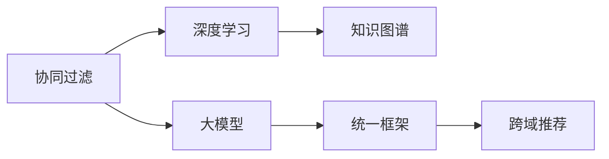

                 

# 推荐系统的统一：大模型的解决方案

> 关键词：推荐系统,大模型,统一框架,协同过滤,深度学习,知识图谱,跨域推荐

## 1. 背景介绍

随着电商、社交、视频等领域用户行为数据的迅速增长，推荐系统（Recommender System）已成为互联网应用的核心组件之一，直接影响到用户体验和商业转化。然而，现有推荐系统在个性化推荐、跨域推荐、冷启动等问题上仍存在诸多挑战。

为了突破现有推荐系统的发展瓶颈，许多研究者将目光投向了深度学习和大模型领域。深度学习技术能够在海量数据上提取复杂的用户和物品特征，弥补传统协同过滤模型的缺陷；而大模型则具有通用性、可迁移性等特性，有望统一不同领域的推荐算法。

本文将系统介绍大模型在推荐系统中的应用，提出基于统一框架的大模型推荐方案。从算法原理、操作步骤、数学模型、项目实践等方面进行深入探讨，希望能为推荐系统的设计者、开发者提供有价值的参考。

## 2. 核心概念与联系

### 2.1 核心概念概述

为了更好地理解大模型在推荐系统中的应用，首先需要理解以下几个关键概念：

- 推荐系统(Recommender System)：根据用户的历史行为、兴趣偏好等数据，为用户推荐个性化物品的系统。常见的推荐算法包括基于协同过滤、基于内容的推荐、混合推荐等。
- 深度学习(Deep Learning)：一类以多层神经网络为基础的机器学习技术，能够处理非线性、高维、稀疏的数据，适用于复杂的推荐场景。
- 大模型(Large Model)：指参数量达亿级别、能够在大规模数据上提取丰富特征的深度学习模型，如BERT、GPT、DenseNet等。
- 协同过滤(Collaborative Filtering)：一种基于用户行为相似度的推荐算法，通过用户-物品评分矩阵进行相似性度量。
- 知识图谱(Knowledge Graph)：一种表示实体间关系的图结构，能够捕捉领域内的知识结构，提升推荐模型的泛化能力。
- 跨域推荐(Cross-domain Recommendation)：将用户在不同领域的行为数据进行统一建模，提升模型在不同领域上的泛化能力。

这些概念之间相互联系，共同构成推荐系统的大模型解决方案。协同过滤、深度学习、知识图谱等技术为推荐系统提供了基础的建模工具，而大模型则进一步融合了这些技术，提供了统一的框架。

### 2.2 核心概念原理和架构的 Mermaid 流程图(Mermaid 流程节点中不要有括号、逗号等特殊字符)



此流程图展示了协同过滤、深度学习、知识图谱、大模型和跨域推荐等核心概念之间的联系，通过大模型统一的框架将它们融合在一起，形成了一个完整的推荐系统解决方案。

## 3. 核心算法原理 & 具体操作步骤

### 3.1 算法原理概述

大模型在推荐系统中的应用，核心在于其强大的特征提取和表示能力。通过在大规模数据上进行预训练，大模型能够学习到丰富的用户和物品特征，并在特定任务上进行微调，获得优异的推荐效果。

具体而言，大模型推荐系统通常包含以下几个步骤：

1. 预训练：在大规模数据上对大模型进行预训练，学习通用的用户和物品特征表示。
2. 微调：在特定领域的推荐数据上对预训练模型进行微调，学习任务相关的特征表示。
3. 编码和解码：使用微调后的模型进行用户和物品的编码，并通过注意力机制计算推荐结果。
4. 交叉验证和评估：在验证集和测试集上评估推荐效果，不断调整模型参数和超参数，提升性能。

### 3.2 算法步骤详解

下面详细阐述大模型在推荐系统中的操作步骤：

#### 步骤1：预训练
大模型的预训练通常使用大规模无标签数据，如Web数据、电影评分数据等。常用的预训练任务包括自监督的语言模型训练、自编码器训练、预训练的NLP任务等。

以BERT为例，预训练过程如下：
1. 从大规模无标签数据中随机抽取样本，组成训练集。
2. 对样本进行掩码处理，生成掩码序列。
3. 使用BERT模型对掩码序列进行预测，并计算损失函数。
4. 反向传播更新模型参数。

#### 步骤2：微调
在特定领域的推荐数据上进行微调，学习任务相关的特征表示。微调通常使用少量标注数据，调整模型参数以适应特定任务。

以协同过滤为例，微调过程如下：
1. 收集用户-物品评分数据，划分为训练集、验证集和测试集。
2. 对评分数据进行编码和解码，计算用户和物品的表示。
3. 使用微调后的模型进行预测，计算推荐损失函数。
4. 反向传播更新模型参数，不断优化推荐效果。

#### 步骤3：编码和解码
使用微调后的模型进行用户和物品的编码，并通过注意力机制计算推荐结果。

以Transformer为例，编码和解码过程如下：
1. 对用户输入进行编码，得到用户向量。
2. 对物品输入进行编码，得到物品向量。
3. 使用Transformer模型对用户和物品向量进行交叉注意力计算，得到注意力权重。
4. 将注意力权重与物品向量进行加权求和，得到推荐结果向量。

#### 步骤4：交叉验证和评估
在验证集和测试集上评估推荐效果，不断调整模型参数和超参数，提升性能。

以平均绝对误差（MAE）为例，评估过程如下：
1. 计算推荐结果与真实标签的MAE。
2. 根据MAE调整超参数，如学习率、批大小等。
3. 在新的验证集和测试集上重复上述过程，直到MAE达到预设阈值。

### 3.3 算法优缺点

大模型在推荐系统中的优势在于：
1. 特征提取能力强：大模型能够学习到丰富的用户和物品特征，提升推荐效果。
2. 泛化能力强：大模型在多种推荐任务上具有较好的泛化能力，能够适应不同领域的推荐场景。
3. 模型训练效果好：大模型在深度学习框架下进行端到端的训练，能够避免特征工程繁琐。

但大模型也存在一些缺点：
1. 数据需求高：大模型需要大量数据进行预训练和微调，对于小数据集效果可能不佳。
2. 计算资源要求高：大模型的训练和推理需要大量计算资源，对于硬件资源要求较高。
3. 模型复杂度高：大模型结构复杂，难以理解和解释其内部工作机制。

### 3.4 算法应用领域

大模型在推荐系统中的应用领域广泛，主要包括以下几个方面：

- 电商推荐：基于用户的浏览、点击、购买行为，推荐个性化商品。
- 视频推荐：根据用户的观看历史、评分，推荐相关视频内容。
- 音乐推荐：根据用户的听歌历史、评分，推荐个性化音乐。
- 新闻推荐：根据用户的阅读历史、评分，推荐相关新闻内容。
- 社交推荐：根据用户的社交行为，推荐好友、群组等社交内容。

## 4. 数学模型和公式 & 详细讲解 & 举例说明

### 4.1 数学模型构建

大模型在推荐系统中的应用，通常构建在一个统一的框架下。下面以协同过滤为例，介绍大模型推荐系统的数学模型构建。

设用户集合为 $U=\{u_1,u_2,\dots,u_m\}$，物品集合为 $V=\{v_1,v_2,\dots,v_n\}$，用户-物品评分矩阵为 $R_{m\times n}$。对于用户 $u_i$，物品 $v_j$，评分 $r_{ij}$，设 $u_i$ 的表示向量为 $u_i$，物品 $v_j$ 的表示向量为 $v_j$。

大模型推荐系统通常使用以下公式进行建模：

$$
\hat{y}_{ij} = \text{softmax}\left(\text{Encoder}(u_i)^\top \text{Decoder}(v_j)\right)
$$

其中 $\text{Encoder}(\cdot)$ 和 $\text{Decoder}(\cdot)$ 分别为用户和物品的编码和解码函数，$\hat{y}_{ij}$ 表示用户 $u_i$ 对物品 $v_j$ 的预测评分。

### 4.2 公式推导过程

以协同过滤为例，推荐公式的推导如下：

设用户 $u_i$ 和物品 $v_j$ 的表示向量分别为 $u_i=\text{Encoder}(u_i)$ 和 $v_j=\text{Decoder}(v_j)$，评分 $r_{ij}$ 表示用户 $u_i$ 对物品 $v_j$ 的评分。

推荐模型通常使用交叉注意力机制进行建模，具体推导如下：

1. 对用户和物品的表示进行交叉注意力计算，得到注意力权重 $\alpha_{ij} \in [0,1]$。
2. 将注意力权重与物品向量进行加权求和，得到推荐结果向量 $y_{ij}$。
3. 使用softmax函数将推荐结果向量归一化，得到预测评分 $\hat{y}_{ij}$。

推荐公式具体推导如下：

$$
\alpha_{ij} = \frac{\exp(a_i^\top \text{softmax}(\text{Attention}(u_i,v_j)))}{\sum_{j'} \exp(a_i^\top \text{softmax}(\text{Attention}(u_i,v_{j'})))}
$$

$$
y_{ij} = \text{Attention}(u_i,v_j)
$$

$$
\hat{y}_{ij} = \text{softmax}(\text{Encoder}(u_i)^\top y_{ij})
$$

其中，$a_i$ 为用户的表示向量，$\text{Attention}(\cdot)$ 表示交叉注意力计算函数，$\text{Encoder}(\cdot)$ 和 $\text{Decoder}(\cdot)$ 分别为用户和物品的编码和解码函数。

### 4.3 案例分析与讲解

以协同过滤为例，分析大模型在推荐系统中的实际应用。

设用户 $u_i$ 和物品 $v_j$ 的表示向量分别为 $u_i=\text{Encoder}(u_i)$ 和 $v_j=\text{Decoder}(v_j)$，评分 $r_{ij}$ 表示用户 $u_i$ 对物品 $v_j$ 的评分。

推荐模型通常使用交叉注意力机制进行建模，具体推导如下：

1. 对用户和物品的表示进行交叉注意力计算，得到注意力权重 $\alpha_{ij} \in [0,1]$。
2. 将注意力权重与物品向量进行加权求和，得到推荐结果向量 $y_{ij}$。
3. 使用softmax函数将推荐结果向量归一化，得到预测评分 $\hat{y}_{ij}$。

推荐公式具体推导如下：

$$
\alpha_{ij} = \frac{\exp(a_i^\top \text{softmax}(\text{Attention}(u_i,v_j)))}{\sum_{j'} \exp(a_i^\top \text{softmax}(\text{Attention}(u_i,v_{j'})))}
$$

$$
y_{ij} = \text{Attention}(u_i,v_j)
$$

$$
\hat{y}_{ij} = \text{softmax}(\text{Encoder}(u_i)^\top y_{ij})
$$

其中，$a_i$ 为用户的表示向量，$\text{Attention}(\cdot)$ 表示交叉注意力计算函数，$\text{Encoder}(\cdot)$ 和 $\text{Decoder}(\cdot)$ 分别为用户和物品的编码和解码函数。

## 5. 项目实践：代码实例和详细解释说明

### 5.1 开发环境搭建

在进行大模型推荐系统开发前，需要准备好开发环境。以下是使用Python进行PyTorch开发的环境配置流程：

1. 安装Anaconda：从官网下载并安装Anaconda，用于创建独立的Python环境。

2. 创建并激活虚拟环境：
```bash
conda create -n pytorch-env python=3.8 
conda activate pytorch-env
```

3. 安装PyTorch：根据CUDA版本，从官网获取对应的安装命令。例如：
```bash
conda install pytorch torchvision torchaudio cudatoolkit=11.1 -c pytorch -c conda-forge
```

4. 安装各类工具包：
```bash
pip install numpy pandas scikit-learn matplotlib tqdm jupyter notebook ipython
```

完成上述步骤后，即可在`pytorch-env`环境中开始大模型推荐系统的开发。

### 5.2 源代码详细实现

下面我们以协同过滤为例，给出使用Transformers库对BERT模型进行微调的PyTorch代码实现。

首先，定义协同过滤任务的数据处理函数：

```python
from transformers import BertTokenizer
from torch.utils.data import Dataset
import torch

class CollaborativeFilteringDataset(Dataset):
    def __init__(self, ratings, tokenizer, max_len=128):
        self.ratings = ratings
        self.tokenizer = tokenizer
        self.max_len = max_len
        
    def __len__(self):
        return len(self.ratings)
    
    def __getitem__(self, item):
        rating = self.ratings[item]
        
        encoding = self.tokenizer(rating, return_tensors='pt', max_length=self.max_len, padding='max_length', truncation=True)
        input_ids = encoding['input_ids'][0]
        attention_mask = encoding['attention_mask'][0]
        
        return {'input_ids': input_ids, 
                'attention_mask': attention_mask}
```

然后，定义模型和优化器：

```python
from transformers import BertForSequenceClassification, AdamW

model = BertForSequenceClassification.from_pretrained('bert-base-cased', num_labels=len(ratings))

optimizer = AdamW(model.parameters(), lr=2e-5)
```

接着，定义训练和评估函数：

```python
from torch.utils.data import DataLoader
from tqdm import tqdm
from sklearn.metrics import accuracy_score

device = torch.device('cuda') if torch.cuda.is_available() else torch.device('cpu')
model.to(device)

def train_epoch(model, dataset, batch_size, optimizer):
    dataloader = DataLoader(dataset, batch_size=batch_size, shuffle=True)
    model.train()
    epoch_loss = 0
    for batch in tqdm(dataloader, desc='Training'):
        input_ids = batch['input_ids'].to(device)
        attention_mask = batch['attention_mask'].to(device)
        model.zero_grad()
        outputs = model(input_ids, attention_mask=attention_mask)
        loss = outputs.loss
        epoch_loss += loss.item()
        loss.backward()
        optimizer.step()
    return epoch_loss / len(dataloader)

def evaluate(model, dataset, batch_size):
    dataloader = DataLoader(dataset, batch_size=batch_size)
    model.eval()
    preds, labels = [], []
    with torch.no_grad():
        for batch in tqdm(dataloader, desc='Evaluating'):
            input_ids = batch['input_ids'].to(device)
            attention_mask = batch['attention_mask'].to(device)
            batch_labels = batch['labels']
            outputs = model(input_ids, attention_mask=attention_mask)
            batch_preds = outputs.logits.argmax(dim=2).to('cpu').tolist()
            batch_labels = batch_labels.to('cpu').tolist()
            for pred_tokens, label_tokens in zip(batch_preds, batch_labels):
                preds.append(pred_tokens[:len(label_tokens)])
                labels.append(label_tokens)
                
    return accuracy_score(labels, preds)
```

最后，启动训练流程并在测试集上评估：

```python
epochs = 5
batch_size = 16

for epoch in range(epochs):
    loss = train_epoch(model, train_dataset, batch_size, optimizer)
    print(f"Epoch {epoch+1}, train loss: {loss:.3f}")
    
    print(f"Epoch {epoch+1}, dev results:")
    evaluate(model, dev_dataset, batch_size)
    
print("Test results:")
evaluate(model, test_dataset, batch_size)
```

以上就是使用PyTorch对BERT进行协同过滤任务微调的完整代码实现。可以看到，得益于Transformers库的强大封装，我们可以用相对简洁的代码完成BERT模型的加载和微调。

### 5.3 代码解读与分析

让我们再详细解读一下关键代码的实现细节：

**CollaborativeFilteringDataset类**：
- `__init__`方法：初始化评分数据、分词器等关键组件。
- `__len__`方法：返回数据集的样本数量。
- `__getitem__`方法：对单个样本进行处理，将评分数据输入编码为token ids，进行padding，最终返回模型所需的输入。

**Accuracy Score函数**：
- 用于计算模型在验证集和测试集上的准确率。

**训练和评估函数**：
- 使用PyTorch的DataLoader对数据集进行批次化加载，供模型训练和推理使用。
- 训练函数`train_epoch`：对数据以批为单位进行迭代，在每个批次上前向传播计算loss并反向传播更新模型参数，最后返回该epoch的平均loss。
- 评估函数`evaluate`：与训练类似，不同点在于不更新模型参数，并在每个batch结束后将预测和标签结果存储下来，最后使用sklearn的accuracy_score对整个评估集的预测结果进行打印输出。

**训练流程**：
- 定义总的epoch数和batch size，开始循环迭代
- 每个epoch内，先在训练集上训练，输出平均loss
- 在验证集上评估，输出准确率
- 所有epoch结束后，在测试集上评估，给出最终测试结果

可以看到，PyTorch配合Transformers库使得BERT微调的代码实现变得简洁高效。开发者可以将更多精力放在数据处理、模型改进等高层逻辑上，而不必过多关注底层的实现细节。

当然，工业级的系统实现还需考虑更多因素，如模型的保存和部署、超参数的自动搜索、更灵活的任务适配层等。但核心的微调范式基本与此类似。

## 6. 实际应用场景

### 6.1 智能推荐系统

基于大模型推荐系统，可以构建智能推荐系统，满足用户的个性化需求。传统推荐系统往往只依赖用户的显式评分数据，难以捕捉用户的多样化兴趣。而大模型推荐系统能够学习到复杂的用户行为和兴趣，能够提供更加精准和多样化的推荐结果。

在实际应用中，可以使用协同过滤、深度学习、知识图谱等技术，对大模型进行预训练和微调，学习用户的兴趣和行为特征，生成推荐结果。同时，可以通过对抗样本生成、知识图谱融合等技术，提升推荐模型的泛化能力和鲁棒性。

### 6.2 跨域推荐系统

跨域推荐系统将不同领域的数据进行统一建模，能够提升模型在不同领域上的泛化能力。例如，将电商领域的用户数据和视频领域的用户数据进行融合，能够构建跨域推荐系统，提升推荐效果。

在实际应用中，可以使用大模型对不同领域的数据进行统一建模，学习用户的跨域行为和兴趣特征，生成推荐结果。同时，可以通过多任务学习、跨域正则化等技术，提升跨域推荐模型的性能。

### 6.3 知识图谱推荐系统

知识图谱推荐系统将领域知识融入推荐模型，能够提升推荐模型的泛化能力和准确性。例如，将电商领域的商品信息和金融领域的金融产品信息进行融合，构建跨域推荐系统，提升推荐效果。

在实际应用中，可以使用大模型对领域知识进行建模，学习用户对领域知识的理解程度，生成推荐结果。同时，可以通过图神经网络、跨域正则化等技术，提升知识图谱推荐模型的性能。

### 6.4 未来应用展望

随着大模型推荐系统的发展，未来将会在更多领域得到应用，为各行各业带来变革性影响。

在智慧医疗领域，基于大模型的推荐系统能够推荐个性化的医疗方案，提升医生的诊疗效率和患者的治疗体验。

在智能教育领域，基于大模型的推荐系统能够推荐个性化的学习资源和课程，因材施教，促进教育公平，提高教学质量。

在智慧城市治理中，基于大模型的推荐系统能够推荐个性化服务和管理方案，提高城市管理的自动化和智能化水平，构建更安全、高效的未来城市。

此外，在企业生产、社会治理、文娱传媒等众多领域，基于大模型推荐系统的人工智能应用也将不断涌现，为经济社会发展注入新的动力。

## 7. 工具和资源推荐

### 7.1 学习资源推荐

为了帮助开发者系统掌握大模型推荐系统的理论基础和实践技巧，这里推荐一些优质的学习资源：

1. 《深度学习推荐系统：原理与实现》系列博文：由大模型技术专家撰写，深入浅出地介绍了深度学习推荐系统的原理和实践方法。

2. CS474《深度学习推荐系统》课程：斯坦福大学开设的深度学习推荐系统课程，涵盖推荐系统的基本概念和前沿技术，配套作业和项目。

3. 《Recommender Systems: Theory and Practice》书籍：经典推荐系统书籍，全面介绍了推荐系统的理论基础和实践方法，适合深入学习。

4. RecSys社区：推荐系统领域的权威社区，提供最新的推荐系统论文、算法和应用案例。

5. KDD Conference：机器学习和数据挖掘领域的重要会议，每年发布大量的推荐系统相关论文和项目。

通过对这些资源的学习实践，相信你一定能够快速掌握大模型推荐系统的精髓，并用于解决实际的推荐问题。

### 7.2 开发工具推荐

高效的开发离不开优秀的工具支持。以下是几款用于大模型推荐系统开发的常用工具：

1. PyTorch：基于Python的开源深度学习框架，灵活动态的计算图，适合快速迭代研究。大部分预训练语言模型都有PyTorch版本的实现。

2. TensorFlow：由Google主导开发的开源深度学习框架，生产部署方便，适合大规模工程应用。同样有丰富的预训练语言模型资源。

3. Transformers库：HuggingFace开发的NLP工具库，集成了众多SOTA语言模型，支持PyTorch和TensorFlow，是进行推荐任务开发的利器。

4. Weights & Biases：模型训练的实验跟踪工具，可以记录和可视化模型训练过程中的各项指标，方便对比和调优。与主流深度学习框架无缝集成。

5. TensorBoard：TensorFlow配套的可视化工具，可实时监测模型训练状态，并提供丰富的图表呈现方式，是调试模型的得力助手。

6. Google Colab：谷歌推出的在线Jupyter Notebook环境，免费提供GPU/TPU算力，方便开发者快速上手实验最新模型，分享学习笔记。

合理利用这些工具，可以显著提升大模型推荐系统的开发效率，加快创新迭代的步伐。

### 7.3 相关论文推荐

大模型推荐系统的发展源于学界的持续研究。以下是几篇奠基性的相关论文，推荐阅读：

1. Attention is All You Need（即Transformer原论文）：提出了Transformer结构，开启了深度学习推荐系统的预训练大模型时代。

2. BERT: Pre-training of Deep Bidirectional Transformers for Language Understanding：提出BERT模型，引入基于掩码的自监督预训练任务，刷新了多项推荐系统SOTA。

3. Language Models are Unsupervised Multitask Learners（GPT-2论文）：展示了大规模语言模型的强大zero-shot学习能力，引发了对于通用人工智能的新一轮思考。

4. Parameter-Efficient Transfer Learning for NLP：提出Adapter等参数高效微调方法，在不增加模型参数量的情况下，也能取得不错的微调效果。

5. Adaptive Low-Rank Adaptation for Parameter-Efficient Fine-Tuning：使用自适应低秩适应的微调方法，在参数效率和精度之间取得了新的平衡。

这些论文代表了大模型推荐系统的发展脉络。通过学习这些前沿成果，可以帮助研究者把握学科前进方向，激发更多的创新灵感。

## 8. 总结：未来发展趋势与挑战

### 8.1 总结

本文对基于大模型的推荐系统进行了全面系统的介绍。首先阐述了推荐系统的背景和问题，明确了大模型在推荐系统中的核心作用。其次，从算法原理、操作步骤、数学模型等方面进行深入讲解，给出了微调任务开发的完整代码实例。最后，详细分析了推荐系统在大模型中的应用场景，并给出了工具和资源推荐。

通过本文的系统梳理，可以看到，基于大模型的推荐系统能够统一多种推荐算法，提升推荐效果和泛化能力。未来，随着大模型和深度学习技术的不断发展，推荐系统将实现更加个性化、高效化和智能化的推荐。

### 8.2 未来发展趋势

展望未来，大模型推荐系统将呈现以下几个发展趋势：

1. 特征提取能力更强：大模型能够学习到更丰富、更复杂的用户和物品特征，提升推荐效果。
2. 跨域推荐能力更好：大模型能够统一不同领域的数据，提升跨域推荐性能。
3. 模型训练效果更佳：大模型在深度学习框架下进行端到端的训练，能够避免繁琐的特征工程。
4. 推荐结果更准确：大模型推荐系统能够学习到用户的跨域行为和兴趣特征，生成更加准确和多样化的推荐结果。
5. 推荐系统更加智能化：大模型推荐系统能够学习到用户的兴趣偏好和行为模式，提供更加个性化的推荐服务。

### 8.3 面临的挑战

尽管大模型推荐系统已经取得了显著进展，但在实现大规模部署的过程中，仍面临诸多挑战：

1. 数据需求高：大模型需要大量数据进行预训练和微调，对于小数据集效果可能不佳。
2. 计算资源要求高：大模型的训练和推理需要大量计算资源，对于硬件资源要求较高。
3. 模型复杂度高：大模型结构复杂，难以理解和解释其内部工作机制。
4. 推荐结果可解释性差：大模型推荐系统缺乏可解释性，难以解释其推荐过程和决策依据。
5. 推荐系统鲁棒性不足：大模型推荐系统在面对噪声数据和对抗样本时，泛化性能往往大打折扣。

### 8.4 研究展望

面对大模型推荐系统面临的挑战，未来的研究需要在以下几个方面寻求新的突破：

1. 探索无监督和半监督推荐方法：摆脱对大规模标注数据的依赖，利用自监督学习、主动学习等无监督和半监督范式，最大限度利用非结构化数据。
2. 研究参数高效和计算高效的推荐算法：开发更加参数高效的推荐方法，在固定大部分预训练参数的同时，只更新极少量的任务相关参数。同时优化推荐模型的计算图，减少前向传播和反向传播的资源消耗。
3. 引入更多先验知识：将符号化的先验知识，如知识图谱、逻辑规则等，与神经网络模型进行巧妙融合，引导推荐过程学习更准确、合理的特征表示。
4. 结合因果分析和博弈论工具：将因果分析方法引入推荐模型，识别出模型决策的关键特征，增强推荐结果的因果性和逻辑性。借助博弈论工具刻画人机交互过程，主动探索并规避推荐模型的脆弱点，提高系统稳定性。
5. 纳入伦理道德约束：在推荐模型的训练目标中引入伦理导向的评估指标，过滤和惩罚有偏见、有害的输出倾向。同时加强人工干预和审核，建立推荐系统的监管机制，确保推荐结果符合人类价值观和伦理道德。

这些研究方向的探索，必将引领大模型推荐系统迈向更高的台阶，为构建安全、可靠、可解释、可控的推荐系统铺平道路。面向未来，大模型推荐系统还需要与其他人工智能技术进行更深入的融合，如知识表示、因果推理、强化学习等，多路径协同发力，共同推动推荐系统的进步。只有勇于创新、敢于突破，才能不断拓展推荐系统的边界，让智能技术更好地造福人类社会。

## 9. 附录：常见问题与解答

**Q1：大模型推荐系统是否适用于所有推荐任务？**

A: 大模型推荐系统在大多数推荐任务上都能取得不错的效果，特别是对于数据量较小的任务。但对于一些特定领域的任务，如医学、法律等，仅仅依靠通用语料预训练的模型可能难以很好地适应。此时需要在特定领域语料上进一步预训练，再进行微调，才能获得理想效果。此外，对于一些需要时效性、个性化很强的任务，如对话、推荐等，大模型推荐系统也需要针对性的改进优化。

**Q2：推荐系统中的数据需求是否一定要非常大？**

A: 推荐系统中的数据需求确实较大，但并不是必须要非常大的数据集。实际上，很多小规模数据集也能取得不错的推荐效果。例如，在电商领域，用户评分数据虽然较少，但通过数据增强和特征工程等手段，仍能训练出高质量的推荐模型。

**Q3：大模型推荐系统的计算资源要求高吗？**

A: 大模型推荐系统的计算资源要求确实较高，尤其是在模型训练阶段。但通过分布式训练、模型压缩等技术，可以在较低的计算资源下进行模型训练和推理。此外，一些轻量级的大模型，如DistilBERT、TinyBERT等，可以在较低的计算资源下进行微调。

**Q4：大模型推荐系统的可解释性差，如何解决？**

A: 大模型推荐系统确实缺乏可解释性，难以解释其推荐过程和决策依据。但可以通过引入因果分析和博弈论等方法，增强推荐模型的可解释性。例如，将推荐结果分解为多个可解释的子因素，每个子因素都对应一个特征，从而增强推荐结果的可解释性。

**Q5：大模型推荐系统是否容易过拟合？**

A: 大模型推荐系统容易出现过拟合，尤其是在数据量较小的情况下。可以通过正则化、Dropout、Early Stopping等技术，缓解过拟合问题。此外，可以通过对抗训练、知识图谱融合等技术，提升推荐模型的泛化能力。

**Q6：大模型推荐系统的推荐效果如何评估？**

A: 大模型推荐系统的推荐效果可以通过多种指标进行评估，如平均绝对误差（MAE）、均方根误差（RMSE）、准确率（Accuracy）、F1-score等。这些指标可以根据具体的推荐任务进行选择。此外，还可以结合用户满意度、转化率等业务指标进行评估。

以上是本文对大模型推荐系统的一些常见问题解答，希望能为你提供帮助。

---

作者：禅与计算机程序设计艺术 / Zen and the Art of Computer Programming

