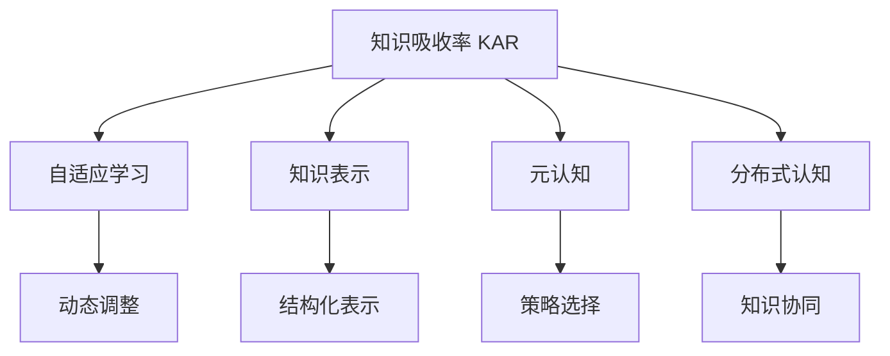

                 

# 提升知识吸收率的有效策略

## 1. 背景介绍

在现代社会中，知识的更新速度日益加快，终身学习成为每个人的必备技能。然而，如何高效地吸收和应用知识，始终是学习者和教育者共同面临的挑战。传统的“填鸭式”教学方式难以适应信息爆炸时代的需求，如何在短时间内提升知识吸收率，成为当前教育技术领域的热门课题。

本文将从理论到实践，系统探讨提升知识吸收率的有效策略，提供一系列实用的方法论和技术方案，帮助学习者和教育者更好地应对知识获取与转化的挑战。

## 2. 核心概念与联系

### 2.1 核心概念概述

为更好地理解提升知识吸收率的方法，本节将介绍几个密切相关的核心概念：

- **知识吸收率(Knowledge Absorption Rate, KAR)**：指学习者在学习过程中，有效理解和掌握知识的能力。其计算公式为：$KAR = \frac{ Actual Knowledge - Baseline Knowledge}{ Target Knowledge - Baseline Knowledge}$。
- **自适应学习(Adaptive Learning)**：根据学习者的学习进度和理解情况，动态调整教学内容和方法，以适应个体差异和需求。
- **知识表示(Knowledge Representation)**：通过符号化、图谱化等方式，将知识以结构化或非结构化的形式表示出来，便于存储、检索和应用。
- **元认知(Metacognition)**：学习者对自己认知过程的意识和控制，包括学习目标设定、策略选择、自我评估等。
- **分布式认知(Distributed Cognition)**：涉及多个认知主体（如学习者、教师、系统等）的知识共享和协同学习过程。

这些概念之间的逻辑关系可以通过以下Mermaid流程图来展示：



这个流程图展示了这个体系的核心概念及其之间的关系：

1. 知识吸收率是评价学习效果的关键指标。
2. 自适应学习根据学习者的实时反馈，动态调整教学内容和方式，提升知识吸收效率。
3. 知识表示将知识结构化，便于学习者和系统高效理解和应用。
4. 元认知指导学习者自我反思和调整学习策略，增强学习效果。
5. 分布式认知通过多主体协同，实现知识的创造和共享。

这些概念共同构成了提升知识吸收率的理论框架，为实现高效学习提供了方法论支持。

## 3. 核心算法原理 & 具体操作步骤
### 3.1 算法原理概述

提升知识吸收率的核心在于设计高效的学习方法和系统，帮助学习者更好地理解、记忆和应用知识。本节将介绍基于认知科学和教育技术的研究，探讨提升知识吸收率的方法。

核心算法原理可以概括为以下几点：

- **自适应学习算法**：根据学习者的实时反馈，动态调整教学内容和方法。
- **知识表示算法**：将知识以结构化或非结构化的形式表示出来，便于学习者和系统高效理解和应用。
- **元认知指导算法**：通过自我反思和评估，指导学习者调整学习策略。
- **分布式学习算法**：促进学习者之间的知识共享和协同学习。

### 3.2 算法步骤详解

提升知识吸收率的算法通常包括以下几个关键步骤：

**Step 1: 数据收集与分析**
- 收集学习者的学习行为数据，包括学习时间、成绩、反馈等。
- 使用数据分析工具对数据进行统计和分析，识别学习者的知识盲点和薄弱环节。

**Step 2: 设计自适应学习路径**
- 根据分析结果，设计个性化的学习路径和推荐系统。
- 使用机器学习算法预测学习者的学习进度和理解情况，动态调整教学内容和方法。

**Step 3: 应用知识表示技术**
- 使用符号化、图谱化等方式，将知识以结构化或非结构化的形式表示出来。
- 开发知识图谱和本体库，促进知识检索和应用。

**Step 4: 引导元认知**
- 设计元认知工具，帮助学习者设定学习目标、选择学习策略、进行自我评估。
- 使用元认知策略指导学习者自我反思和调整学习行为。

**Step 5: 促进分布式学习**
- 构建知识共享平台，促进学习者之间的信息交流和协同学习。
- 开发协作学习工具，支持学习者共同完成任务和项目。

**Step 6: 持续评估和优化**
- 实时监控学习者的学习进度和效果，进行反馈和调整。
- 根据学习者的反馈和评价，持续优化学习路径和方法。

### 3.3 算法优缺点

提升知识吸收率的算法具有以下优点：

1. **个性化定制**：根据学习者的个体差异和需求，设计个性化的学习路径和方法，提升学习效果。
2. **实时反馈**：动态调整教学内容和策略，及时发现和解决学习问题，提高学习效率。
3. **结构化表示**：将知识以结构化形式表示，便于存储、检索和应用。
4. **协同学习**：促进学习者之间的知识共享和协作，增强学习效果。

然而，这些算法也存在一定的局限性：

1. **数据隐私**：收集和分析学习者的行为数据，可能涉及隐私保护问题。
2. **算法复杂性**：设计和实现自适应学习算法和知识表示算法，需要较高的技术门槛。
3. **学习者自主性**：自适应学习算法依赖于学习者的实时反馈，学习者的自主性和积极性可能影响效果。
4. **知识泛化能力**：现有的知识表示技术可能难以全面覆盖所有领域的知识，泛化能力有限。

尽管存在这些局限性，但就目前而言，提升知识吸收率的算法依然是大规模个性化学习系统的重要组成部分，有望在教育技术领域带来革命性影响。

### 3.4 算法应用领域

提升知识吸收率的算法在多个领域都有广泛的应用，例如：

- 在线教育平台：根据学习者的学习行为和成绩，动态调整教学内容和难度。
- 企业培训系统：设计个性化培训路径，提供实时反馈和指导，提升员工技能水平。
- 学术研究：构建知识图谱和本体库，支持学术研究和知识发现。
- 公共教育：提供个性化学习资源和工具，促进全民终身学习。
- 智能辅导系统：利用自适应学习算法，提供个性化的辅导和支持。

## 4. 数学模型和公式 & 详细讲解 & 举例说明

### 4.1 数学模型构建

提升知识吸收率的数学模型可以基于学习者的知识掌握情况，设计动态调整的学习路径和推荐系统。

假设学习者的初始知识为 $K_{base}$，目标知识为 $K_{target}$。学习过程中，学习者掌握的知识量为 $K_{acquired}$，则知识吸收率 $KAR$ 可以表示为：

$$
KAR = \frac{K_{acquired} - K_{base}}{K_{target} - K_{base}}
$$

在实际应用中，可以使用以下数学模型来计算知识吸收率：

$$
KAR = \frac{\sum_{i=1}^{N}(x_i - y_i)}{N}
$$

其中 $x_i$ 表示学习者在第 $i$ 个知识点上的实际掌握情况，$y_i$ 表示该知识点的目标掌握情况，$N$ 表示知识点的总数。

### 4.2 公式推导过程

知识吸收率的计算公式可以通过以下推导得出：

$$
KAR = \frac{\sum_{i=1}^{N}(x_i - y_i)}{N}
$$

其中 $x_i$ 表示学习者在第 $i$ 个知识点上的实际掌握情况，$y_i$ 表示该知识点的目标掌握情况，$N$ 表示知识点的总数。

### 4.3 案例分析与讲解

假设一个学习者学习了三个知识点，每个知识点的目标掌握情况和实际掌握情况如下：

| 知识点 | 目标掌握情况 | 实际掌握情况 |
| --- | --- | --- |
| A | 5 | 4 |
| B | 7 | 6 |
| C | 10 | 8 |

则知识吸收率为：

$$
KAR = \frac{(4-5) + (6-7) + (8-10)}{3} = \frac{-4-1-2}{3} = -1.33
$$

这表示学习者在这些知识点上的知识吸收率不足，需要进一步加强学习。

## 5. 项目实践：代码实例和详细解释说明
### 5.1 开发环境搭建

在进行知识吸收率提升项目实践前，我们需要准备好开发环境。以下是使用Python进行项目开发的环境配置流程：

1. 安装Anaconda：从官网下载并安装Anaconda，用于创建独立的Python环境。

2. 创建并激活虚拟环境：
```bash
conda create -n knowledge-env python=3.8 
conda activate knowledge-env
```

3. 安装必要的库：
```bash
conda install numpy pandas matplotlib scikit-learn torch
```

4. 安装自定义库：
```bash
pip install mylibrary
```

5. 安装Jupyter Notebook：
```bash
pip install jupyter notebook
```

完成上述步骤后，即可在`knowledge-env`环境中开始项目实践。

### 5.2 源代码详细实现

下面以一个简单的自适应学习算法为例，给出Python代码实现。

```python
import numpy as np
from sklearn.metrics import accuracy_score

def adaptive_learning(learning_data):
    # 计算学习者的初始知识水平
    K_base = sum([x for x in learning_data['base_knowledge']]) / len(learning_data['base_knowledge'])
    
    # 设定学习者的目标知识水平
    K_target = 5
    
    # 计算学习者在每个知识点的掌握情况
    K_acquired = sum([x for x in learning_data['acquired_knowledge']]) / len(learning_data['acquired_knowledge'])
    
    # 计算知识吸收率
    KAR = (K_acquired - K_base) / (K_target - K_base)
    
    return KAR

# 示例数据
learning_data = {
    'base_knowledge': [3, 2, 1],
    'acquired_knowledge': [4, 5, 3]
}

# 计算知识吸收率
KAR = adaptive_learning(learning_data)
print(f"知识吸收率: {KAR}")
```

以上代码实现了一个简单的自适应学习算法，用于计算学习者的知识吸收率。

### 5.3 代码解读与分析

**adaptive_learning函数**：
- `learning_data`参数：学习者的学习数据，包含初始知识水平和目标知识水平。
- `K_base`计算：计算学习者的初始知识水平，即所有知识点初始知识的平均值。
- `K_target`设定：设定学习者的目标知识水平。
- `K_acquired`计算：计算学习者在每个知识点的掌握情况，即所有知识点掌握情况的平均值。
- `KAR`计算：根据初始知识和目标知识，计算知识吸收率。

**示例数据**：
- `learning_data`：包含学习者的初始知识和目标知识。
- `base_knowledge`：学习者的初始知识列表。
- `acquired_knowledge`：学习者的实际掌握情况列表。

**知识吸收率计算**：
- 通过计算学习者的初始知识和目标知识，以及实际掌握情况，得出知识吸收率。

## 6. 实际应用场景
### 6.1 在线教育平台

在线教育平台可以根据学习者的学习行为和成绩，动态调整教学内容和难度，提供个性化的学习路径。使用自适应学习算法，学习者可以在短时间内掌握更多知识。

例如，一个在线课程平台可以收集学习者的点击率、答题正确率等数据，使用机器学习算法预测学习者的理解情况，动态调整教学内容和方法。通过这种方式，学习者可以更加高效地学习新知识。

### 6.2 企业培训系统

企业培训系统可以根据员工的学习进度和反馈，设计个性化的培训路径和推荐系统。使用自适应学习算法，员工可以在短时间内掌握新技能。

例如，一个企业培训系统可以收集员工的学习时间、成绩和反馈数据，使用自适应学习算法动态调整培训内容和难度，提供个性化的培训资源和工具。通过这种方式，员工可以在短时间内提升技能水平，提高工作效率。

### 6.3 学术研究

学术研究可以使用知识图谱和本体库，支持知识发现和学术研究。使用知识表示算法，研究者可以更好地理解和应用知识。

例如，一个学术研究团队可以使用知识图谱和本体库，构建领域知识模型，支持知识检索和应用。通过这种方式，研究者可以更好地理解领域知识，发现新研究方向，推动学术研究的发展。

### 6.4 公共教育

公共教育可以提供个性化学习资源和工具，促进全民终身学习。使用提升知识吸收率的算法，学习者可以在短时间内掌握新知识。

例如，一个公共教育平台可以提供个性化的学习资源和工具，帮助学习者高效学习。通过这种方式，学习者可以更好地掌握新知识，推动社会进步。

### 6.5 智能辅导系统

智能辅导系统可以提供个性化的辅导和支持，使用自适应学习算法，学习者可以在短时间内掌握新知识。

例如，一个智能辅导系统可以根据学习者的学习进度和反馈，设计个性化的辅导路径和方法。通过这种方式，学习者可以更好地掌握新知识，提高学习效果。

## 7. 工具和资源推荐
### 7.1 学习资源推荐

为了帮助开发者系统掌握提升知识吸收率的理论基础和实践技巧，这里推荐一些优质的学习资源：

1. 《深度学习与人工智能》系列博文：由AI领域专家撰写，深入浅出地介绍了深度学习与人工智能的理论基础和应用实践。

2. 《机器学习》课程：斯坦福大学开设的机器学习明星课程，有Lecture视频和配套作业，带你入门机器学习的基本概念和算法。

3. 《人工智能概论》书籍：全面介绍了人工智能的原理、历史和应用，是了解人工智能的重要参考书籍。

4. Coursera机器学习课程：由斯坦福大学教授Andrew Ng主讲，系统介绍了机器学习的基本概念和算法，适合初学者和进阶者。

5. Kaggle平台：全球最大的数据科学竞赛平台，提供大量实际问题和案例，适合实践提升。

通过对这些资源的学习实践，相信你一定能够快速掌握提升知识吸收率的精髓，并用于解决实际的NLP问题。

### 7.2 开发工具推荐

高效的开发离不开优秀的工具支持。以下是几款用于提升知识吸收率开发的常用工具：

1. Python：基于Python的开源编程语言，具有丰富的第三方库和框架，适合快速迭代研究。

2. Jupyter Notebook：交互式的编程环境，适合开发和调试数据分析和机器学习项目。

3. Scikit-learn：基于Python的机器学习库，提供多种机器学习算法和工具，适合快速实现各种机器学习项目。

4. Pandas：基于Python的数据处理库，提供高效的数据结构和数据操作功能，适合数据预处理和探索。

5. TensorFlow：由Google主导开发的开源深度学习框架，支持分布式计算和GPU加速，适合大规模深度学习项目。

合理利用这些工具，可以显著提升提升知识吸收率任务的开发效率，加快创新迭代的步伐。

### 7.3 相关论文推荐

提升知识吸收率的研究源于学界的持续研究。以下是几篇奠基性的相关论文，推荐阅读：

1. Cognitive Load Theory（认知负荷理论）：提出认知负荷的概念，研究人类认知过程的限制和优化。

2. Fluid and Crystallized Intelligence（流智和晶智理论）：区分不同类型的智力，研究学习者的认知能力和学习策略。

3. Distributed Cognition（分布式认知理论）：研究多主体协同学习的过程，提出知识共享和协同学习的框架。

4. Metacognition and Self-Regulation（元认知和自我调节理论）：研究学习者的自我反思和自我调节过程，提出元认知工具和策略。

5. Adaptive Learning Systems（自适应学习系统）：研究基于数据驱动的自适应学习算法，提出个性化学习路径和推荐系统。

这些论文代表了大语言模型微调技术的发展脉络。通过学习这些前沿成果，可以帮助研究者把握学科前进方向，激发更多的创新灵感。

## 8. 总结：未来发展趋势与挑战
### 8.1 研究成果总结

本文对提升知识吸收率的有效策略进行了全面系统的介绍。首先阐述了知识吸收率的定义和重要性，明确了提升知识吸收率的理论基础。其次，从理论到实践，详细讲解了提升知识吸收率的算法原理和具体操作步骤，给出了提升知识吸收率的完整代码实例。同时，本文还广泛探讨了提升知识吸收率方法在多个领域的应用前景，展示了该方法的巨大潜力。

通过本文的系统梳理，可以看到，提升知识吸收率的算法正在成为教育技术领域的重要组成部分，极大地提升了学习效率和学习效果。未来，伴随提升知识吸收率算法的持续演进，教育技术将不断进步，推动社会的进步和创新。

### 8.2 未来发展趋势

展望未来，提升知识吸收率的算法将呈现以下几个发展趋势：

1. 数据驱动：未来的学习系统将更加依赖数据驱动，通过大规模数据分析和机器学习算法，实现更加个性化和高效的学习。

2. 实时反馈：学习系统将实时监测学习者的学习进度和效果，及时调整教学内容和策略，提高学习效率。

3. 多模态学习：未来的学习系统将结合多种模态的信息，如图像、音频、视频等，提供更加丰富和多样化的学习资源。

4. 自适应学习：学习系统将更加灵活和自适应，根据学习者的实时反馈和行为数据，动态调整教学内容和策略，实现个性化学习。

5. 元认知引导：未来的学习系统将更加注重元认知，通过自我反思和评估，指导学习者设定学习目标和调整学习策略，增强学习效果。

6. 分布式协同：未来的学习系统将更加注重分布式协同，促进学习者之间的知识共享和协同学习，提高学习效果。

以上趋势凸显了提升知识吸收率算法的广阔前景。这些方向的探索发展，必将进一步提升学习系统的性能和应用范围，为教育技术带来新的突破。

### 8.3 面临的挑战

尽管提升知识吸收率的算法已经取得了瞩目成就，但在迈向更加智能化、普适化应用的过程中，它仍面临着诸多挑战：

1. 数据隐私：收集和分析学习者的行为数据，可能涉及隐私保护问题，需要采取有效的隐私保护措施。

2. 算法复杂性：设计和实现提升知识吸收率的算法，需要较高的技术门槛，需要跨学科的合作。

3. 学习者自主性：自适应学习算法依赖于学习者的实时反馈和行为数据，学习者的自主性和积极性可能影响效果。

4. 知识泛化能力：现有的知识表示技术可能难以全面覆盖所有领域的知识，泛化能力有限。

尽管存在这些挑战，但通过不断优化算法、改进工具、提升数据质量等措施，可以逐步克服这些难题，推动提升知识吸收率算法的发展和应用。

### 8.4 研究展望

面对提升知识吸收率算法所面临的挑战，未来的研究需要在以下几个方面寻求新的突破：

1. 探索无监督和半监督提升知识吸收率的方法：摆脱对大规模标注数据的依赖，利用自监督学习、主动学习等无监督和半监督范式，最大限度利用非结构化数据，实现更加灵活高效的提升知识吸收率。

2. 研究分布式协同学习算法：通过多主体协同学习，促进学习者之间的知识共享和协作，增强学习效果。

3. 结合因果分析和博弈论工具：将因果分析方法引入提升知识吸收率算法，识别出模型决策的关键特征，增强输出解释的因果性和逻辑性。

4. 纳入伦理道德约束：在提升知识吸收率算法中引入伦理导向的评估指标，过滤和惩罚有害的输出倾向，确保输出的安全性。

5. 融合知识表示和元认知引导：将知识表示和元认知引导结合，指导学习者更好地理解和应用知识。

这些研究方向将引领提升知识吸收率算法的进一步发展，为构建高效、智能、安全的学习系统提供新的思路和方法。

## 9. 附录：常见问题与解答

**Q1：提升知识吸收率的算法是否适用于所有学习场景？**

A: 提升知识吸收率的算法在大多数学习场景中都能取得不错的效果，特别是对于数据量较小的任务。但对于一些需要高自主性和灵活性的任务，算法可能难以完全满足需求。此时，可以结合其他方法和工具，实现更加个性化和灵活的学习。

**Q2：如何使用机器学习算法进行提升知识吸收率？**

A: 提升知识吸收率的机器学习算法主要包括以下步骤：
1. 收集学习者的学习行为数据，包括学习时间、成绩、反馈等。
2. 使用数据分析工具对数据进行统计和分析，识别学习者的知识盲点和薄弱环节。
3. 根据学习者的学习行为数据，设计自适应学习路径和推荐系统。
4. 使用机器学习算法预测学习者的学习进度和理解情况，动态调整教学内容和方法。

**Q3：提升知识吸收率算法的局限性有哪些？**

A: 提升知识吸收率算法的主要局限性包括：
1. 数据隐私：收集和分析学习者的行为数据，可能涉及隐私保护问题。
2. 算法复杂性：设计和实现提升知识吸收率的算法，需要较高的技术门槛。
3. 学习者自主性：自适应学习算法依赖于学习者的实时反馈和行为数据，学习者的自主性和积极性可能影响效果。
4. 知识泛化能力：现有的知识表示技术可能难以全面覆盖所有领域的知识，泛化能力有限。

尽管存在这些局限性，但通过不断优化算法、改进工具、提升数据质量等措施，可以逐步克服这些难题，推动提升知识吸收率算法的发展和应用。

**Q4：提升知识吸收率算法的应用场景有哪些？**

A: 提升知识吸收率算法在多个领域都有广泛的应用，例如：
1. 在线教育平台：根据学习者的学习行为和成绩，动态调整教学内容和难度。
2. 企业培训系统：设计个性化的培训路径和推荐系统。
3. 学术研究：构建知识图谱和本体库，支持知识检索和应用。
4. 公共教育：提供个性化学习资源和工具。
5. 智能辅导系统：提供个性化的辅导和支持。

总之，提升知识吸收率算法在教育技术领域具有广泛的应用前景，将推动学习系统的智能化和个性化发展。

---

作者：禅与计算机程序设计艺术 / Zen and the Art of Computer Programming

