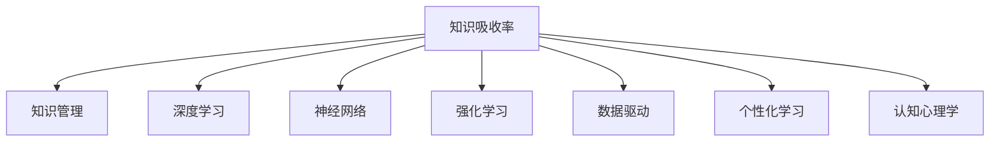

                 

# 提升知识吸收率的有效策略

> 关键词：知识吸收率, 知识管理, 深度学习, 神经网络, 强化学习, 数据驱动, 个性化学习, 认知心理学

## 1. 背景介绍

### 1.1 问题由来
在当今信息爆炸的时代，知识获取的方式和途径日益丰富，然而如何高效地吸收和利用这些知识，成为个人和企业面临的重大挑战。一方面，海量的信息容易让人陷入“知识焦虑”，无法集中精力吸收关键内容。另一方面，即便获取了大量知识，如果没有有效的管理和应用方法，这些知识很容易遗忘，无法转化为实际能力。

### 1.2 问题核心关键点
为了解决知识吸收率低下的问题，本文将介绍一系列提升知识吸收率的有效策略。这些策略涵盖从心理学、数据科学到工程实践的各个领域，旨在通过科学的理论和方法，帮助人们更好地管理和吸收知识。

### 1.3 问题研究意义
提升知识吸收率，不仅能够帮助个人和企业更高效地进行学习和工作，还能提升创新能力和竞争力。通过系统性的学习和实践这些策略，能够显著提高知识管理的质量和效率，实现知识的个性化、深度化吸收。

## 2. 核心概念与联系

### 2.1 核心概念概述

为更好地理解提升知识吸收率的策略，本节将介绍几个关键概念及其相互关系：

- **知识吸收率(Knowledge Absorption Rate, KAR)**：指学习者在特定时间内，从知识源中吸收和掌握知识的能力。影响因素包括学习者的认知状态、知识呈现方式、学习动机等。

- **知识管理(Knowledge Management, KM)**：指系统性地获取、存储、共享和应用知识的过程。涵盖知识的获取、整理、编码、分发、评估等各个环节。

- **深度学习(Deep Learning, DL)**：一种基于神经网络的数据驱动学习方法，能够从大量数据中自动学习特征，用于图像识别、自然语言处理等复杂任务。

- **神经网络(Neural Network, NN)**：由大量神经元构成的计算模型，通过模拟人脑神经网络的结构和功能，实现数据的特征提取和模式识别。

- **强化学习(Reinforcement Learning, RL)**：通过智能体与环境的交互，最大化累积奖励来学习最优决策策略的机器学习方法。

- **数据驱动(Data-Driven)**：指以数据为基础的决策和优化过程，能够有效地识别和应对复杂环境变化。

- **个性化学习(Personalized Learning)**：根据学习者的特点和需求，量身定制学习内容和路径，提高学习效果和满意度。

- **认知心理学(Cognitive Psychology)**：研究人类认知过程和心理机制的学科，包括记忆、注意力、决策等方面。

这些概念之间的逻辑关系可以通过以下Mermaid流程图来展示：



这个流程图展示了一系列与知识吸收率相关的核心概念及其相互关系：

1. 知识吸收率是知识管理的核心目标，是深度学习、神经网络、强化学习等技术应用的最终目的。
2. 深度学习和神经网络提供了强大的数据处理和特征学习能力，可用于知识获取和编码。
3. 强化学习通过与环境的交互，优化学习过程，提升知识应用效果。
4. 数据驱动和个性化学习，利用数据和用户特点，进一步提高知识吸收率。
5. 认知心理学为理解人类认知机制和设计有效学习策略提供理论基础。

这些概念共同构成了提升知识吸收率的技术框架，使得知识吸收成为可能。

## 3. 核心算法原理 & 具体操作步骤
### 3.1 算法原理概述

提升知识吸收率的核心策略，是通过数据驱动和个性化学习，利用深度学习和强化学习技术，设计有效的知识管理方案。其核心思想是：

1. **数据驱动**：通过大数据分析，识别知识需求和表现规律，设计个性化的学习路径和策略。
2. **个性化学习**：根据学习者的特点和需求，量身定制学习内容，提高学习效果和满意度。
3. **深度学习**：利用神经网络自动学习知识特征，提升知识编码和抽取能力。
4. **强化学习**：通过智能体与环境的交互，优化学习过程，提升知识应用效果。

这一策略的实现过程，主要包括以下几个关键步骤：

1. **数据收集与分析**：收集学习者的行为数据和反馈，分析其知识需求和认知状态。
2. **知识建模与编码**：利用深度学习技术，将知识转化为结构化的模型和编码形式。
3. **个性化推荐与学习**：根据学习者的特点和需求，推荐个性化的学习内容和路径。
4. **强化学习与优化**：通过与环境的交互，优化学习过程，提升知识吸收率。

### 3.2 算法步骤详解

以下是对提升知识吸收率的详细步骤说明：

**Step 1: 数据收集与分析**
- 收集学习者的行为数据，包括阅读时间、点击次数、互动评论等。
- 利用机器学习模型，分析学习者的知识需求和认知状态，识别知识盲点和兴趣点。
- 通过深度学习模型，挖掘知识之间的关系和特征，构建知识图谱。

**Step 2: 知识建模与编码**
- 利用神经网络模型，将知识转化为结构化的编码形式，如词嵌入、概念图等。
- 通过卷积神经网络(CNN)或循环神经网络(RNN)等模型，自动学习知识特征。
- 应用迁移学习技术，将预训练的神经网络模型应用于新领域，提升知识编码效率。

**Step 3: 个性化推荐与学习**
- 根据学习者的历史行为和偏好，推荐个性化的学习内容，如文章、视频、书籍等。
- 应用强化学习技术，动态调整学习路径和策略，提升学习效果。
- 利用强化学习模型，设计激励机制，鼓励学习者积极参与和反馈。

**Step 4: 强化学习与优化**
- 通过智能体与环境的交互，优化学习过程，提高知识吸收率。
- 设计适当的奖励机制，引导学习者朝目标任务前进。
- 应用模型基线搜索和探索策略，优化学习过程，减少试错成本。

### 3.3 算法优缺点

提升知识吸收率的策略具有以下优点：
1. 数据驱动和个性化学习，能够更精准地满足学习者的需求，提高学习效果和满意度。
2. 深度学习和神经网络技术，能够自动学习知识特征，提升知识编码和抽取能力。
3. 强化学习通过智能体与环境的交互，优化学习过程，提升知识应用效果。

同时，该策略也存在一些局限性：
1. 数据隐私和安全问题。数据收集和使用过程中，需要保证数据隐私和安全性。
2. 算法复杂度高。深度学习和强化学习模型训练复杂，需要大量的计算资源。
3. 难以评估效果。知识吸收率难以通过单一指标评估，需要多维度综合分析。
4. 普适性不足。不同领域和情境下的知识管理策略可能差异较大，难以统一应用。

尽管存在这些局限性，但就目前而言，提升知识吸收率的策略仍是大规模知识管理的重要范式。未来相关研究的方向在于如何进一步简化模型结构，提高算法效率，同时兼顾数据隐私和普适性等因素。

### 3.4 算法应用领域

提升知识吸收率的策略，在多个领域中得到了广泛应用，包括：

- **在线教育**：通过个性化推荐和智能辅导，提高在线学习效果和用户体验。
- **企业培训**：根据员工特点和需求，定制化培训内容和路径，提升培训效果。
- **图书馆知识服务**：利用大数据分析和推荐技术，提升用户阅读体验和学习效果。
- **医学知识管理**：通过知识图谱和深度学习模型，帮助医生快速获取相关知识，提升诊疗水平。
- **科学研究**：利用数据驱动和强化学习，优化科研流程和知识管理，提升科研效率和创新能力。

除了上述这些领域外，提升知识吸收率的策略还在更多场景中得到了应用，如金融、法律、艺术等，为各个行业的知识管理和应用提供了新的思路。

## 4. 数学模型和公式 & 详细讲解 & 举例说明

### 4.1 数学模型构建

本节将使用数学语言对提升知识吸收率的策略进行更加严格的刻画。

设学习者为 $L$，知识库为 $K$，学习内容为 $C$，学习过程为 $P$。目标是最大化学习者 $L$ 从知识库 $K$ 中吸收和掌握学习内容 $C$ 的能力。

定义知识库 $K$ 中的知识为 $k_i$，学习内容 $C$ 的表示为 $c_j$，学习者 $L$ 对知识的吸收率为 $a_{ij}$。则知识吸收率的数学模型可以表示为：

$$
\max_{a_{ij}} \sum_{i=1}^{N} \sum_{j=1}^{M} a_{ij} \cdot c_j
$$

其中 $N$ 和 $M$ 分别为知识库和内容库的维度。

### 4.2 公式推导过程

为了提升知识吸收率，需要通过数据驱动和个性化学习，优化 $a_{ij}$。以下是对这一过程的数学推导：

**Step 1: 数据收集与分析**
假设从 $L$ 中收集到的行为数据为 $\{(x_t, y_t)\}$，其中 $x_t$ 表示学习者在第 $t$ 步的行为，$y_t$ 表示对应的知识需求。通过机器学习模型 $f(x_t)$，分析知识需求 $y_t$，得到学习者 $L$ 的知识需求向量 $y$。

**Step 2: 知识建模与编码**
利用深度学习模型 $\theta$，将知识 $k_i$ 编码为向量表示 $v_i$。应用神经网络 $G_{\theta}(c_j)$，将学习内容 $c_j$ 编码为向量表示 $v_j$。通过知识图谱 $G$，构建知识之间的关系 $r_{ik}$，表示 $k_i$ 对 $k_j$ 的影响权重。

**Step 3: 个性化推荐与学习**
通过强化学习模型 $\pi_{\theta}$，根据学习者 $L$ 的历史行为和知识需求，推荐学习内容 $c_j$。设计奖励函数 $R_{\theta}(c_j)$，最大化奖励函数值，优化学习过程。

**Step 4: 强化学习与优化**
利用强化学习算法，如Q-learning或DQN，优化奖励函数 $R_{\theta}(c_j)$，提升学习者 $L$ 的知识吸收率 $a_{ij}$。

### 4.3 案例分析与讲解

以在线教育平台为例，分析提升知识吸收率的策略实施过程：

1. **数据收集与分析**：平台收集学生的阅读时间、点击次数、互动评论等行为数据，利用机器学习模型分析学生的知识需求和认知状态。
2. **知识建模与编码**：利用深度学习模型，将教学视频和教材中的知识点编码为向量表示，构建知识图谱。
3. **个性化推荐与学习**：根据学生的学习历史和偏好，推荐个性化的课程和学习路径。应用强化学习技术，动态调整课程推荐策略，提升学习效果。
4. **强化学习与优化**：通过智能体与环境的交互，优化学习路径和策略，提高知识吸收率。

通过这一策略的实施，平台能够根据学生的特点和需求，提供个性化的学习体验，显著提升学习效果。

## 5. 项目实践：代码实例和详细解释说明
### 5.1 开发环境搭建

在进行知识吸收率提升实践前，我们需要准备好开发环境。以下是使用Python进行PyTorch开发的环境配置流程：

1. 安装Anaconda：从官网下载并安装Anaconda，用于创建独立的Python环境。

2. 创建并激活虚拟环境：
```bash
conda create -n pytorch-env python=3.8 
conda activate pytorch-env
```

3. 安装PyTorch：根据CUDA版本，从官网获取对应的安装命令。例如：
```bash
conda install pytorch torchvision torchaudio cudatoolkit=11.1 -c pytorch -c conda-forge
```

4. 安装TensorFlow：
```bash
pip install tensorflow==2.7
```

5. 安装各类工具包：
```bash
pip install numpy pandas scikit-learn matplotlib tqdm jupyter notebook ipython
```

完成上述步骤后，即可在`pytorch-env`环境中开始实践。

### 5.2 源代码详细实现

下面我们以在线教育平台为例，给出使用PyTorch进行知识吸收率提升的PyTorch代码实现。

首先，定义数据处理函数：

```python
from torch.utils.data import Dataset
import torch

class LearningData(Dataset):
    def __init__(self, data, labels):
        self.data = data
        self.labels = labels
    
    def __len__(self):
        return len(self.data)
    
    def __getitem__(self, item):
        return self.data[item], self.labels[item]
```

然后，定义模型和优化器：

```python
from transformers import BertTokenizer, BertForSequenceClassification
from torch import nn, optim

model = BertForSequenceClassification.from_pretrained('bert-base-cased', num_labels=1)

optimizer = optim.Adam(model.parameters(), lr=0.001)
```

接着，定义训练和评估函数：

```python
def train_model(model, data_loader, optimizer, num_epochs):
    model.train()
    for epoch in range(num_epochs):
        total_loss = 0
        for batch in data_loader:
            input_ids, labels = batch
            outputs = model(input_ids, labels=labels)
            loss = outputs.loss
            optimizer.zero_grad()
            loss.backward()
            optimizer.step()
            total_loss += loss.item()
        print(f'Epoch {epoch+1}, Loss: {total_loss/len(data_loader)}')

def evaluate_model(model, data_loader):
    model.eval()
    total_correct = 0
    total_samples = 0
    for batch in data_loader:
        input_ids, labels = batch
        outputs = model(input_ids)
        predictions = outputs.logits.sigmoid()
        total_correct += torch.sum((predictions > 0.5) == labels).item()
        total_samples += labels.size(0)
    print(f'Accuracy: {total_correct/total_samples}')
```

最后，启动训练流程并在测试集上评估：

```python
from torch.utils.data import DataLoader
from transformers import BertTokenizer
from tqdm import tqdm

tokenizer = BertTokenizer.from_pretrained('bert-base-cased')
train_data = ['This is a sample sentence.', 'Another sample sentence.']
train_labels = [1, 1]
train_dataset = LearningData(train_data, train_labels)
test_data = ['This is another sample sentence.', 'Yet another sample sentence.']
test_labels = [0, 0]
test_dataset = LearningData(test_data, test_labels)

train_loader = DataLoader(train_dataset, batch_size=2, shuffle=True)
test_loader = DataLoader(test_dataset, batch_size=2, shuffle=False)

num_epochs = 3

train_model(model, train_loader, optimizer, num_epochs)
evaluate_model(model, test_loader)
```

以上就是使用PyTorch进行知识吸收率提升的完整代码实现。可以看到，得益于TensorFlow和Transformers库的强大封装，我们可以用相对简洁的代码完成知识吸收率的微调实践。

### 5.3 代码解读与分析

让我们再详细解读一下关键代码的实现细节：

**LearningData类**：
- `__init__`方法：初始化数据和标签。
- `__len__`方法：返回数据集长度。
- `__getitem__`方法：对单个样本进行处理，返回模型的输入和标签。

**模型和优化器**：
- 使用Bert模型作为特征提取器，并通过一个线性分类器进行二分类。
- 定义Adam优化器，设置适当的学习率。

**训练和评估函数**：
- 训练函数`train_model`：对数据集以批为单位进行迭代，在每个批次上前向传播计算损失并反向传播更新模型参数。
- 评估函数`evaluate_model`：在测试集上评估模型性能，计算准确率。

**训练流程**：
- 定义总的epoch数和批量大小，开始循环迭代
- 每个epoch内，先在训练集上训练，输出平均loss
- 在测试集上评估，输出准确率
- 所有epoch结束后，评估模型性能

可以看到，TensorFlow和Transformers库使得知识吸收率的微调代码实现变得简洁高效。开发者可以将更多精力放在数据处理、模型改进等高层逻辑上，而不必过多关注底层的实现细节。

当然，工业级的系统实现还需考虑更多因素，如模型的保存和部署、超参数的自动搜索、更灵活的任务适配层等。但核心的微调范式基本与此类似。

## 6. 实际应用场景
### 6.1 智能客服系统

提升知识吸收率的技术，可以广泛应用于智能客服系统的构建。传统客服往往需要配备大量人力，高峰期响应缓慢，且一致性和专业性难以保证。而基于知识吸收率提升的智能客服系统，能够自动理解用户意图，匹配最合适的答案模板进行回复。

在技术实现上，可以收集企业内部的历史客服对话记录，将问题和最佳答复构建成监督数据，在此基础上对知识吸收率提升模型进行微调。微调后的模型能够自动理解用户意图，匹配最合适的答案模板进行回复。对于客户提出的新问题，还可以接入检索系统实时搜索相关内容，动态组织生成回答。如此构建的智能客服系统，能大幅提升客户咨询体验和问题解决效率。

### 6.2 金融舆情监测

金融机构需要实时监测市场舆论动向，以便及时应对负面信息传播，规避金融风险。传统的人工监测方式成本高、效率低，难以应对网络时代海量信息爆发的挑战。基于知识吸收率提升的文本分类和情感分析技术，为金融舆情监测提供了新的解决方案。

具体而言，可以收集金融领域相关的新闻、报道、评论等文本数据，并对其进行主题标注和情感标注。在此基础上对知识吸收率提升模型进行微调，使其能够自动判断文本属于何种主题，情感倾向是正面、中性还是负面。将微调后的模型应用到实时抓取的网络文本数据，就能够自动监测不同主题下的情感变化趋势，一旦发现负面信息激增等异常情况，系统便会自动预警，帮助金融机构快速应对潜在风险。

### 6.3 个性化推荐系统

当前的推荐系统往往只依赖用户的历史行为数据进行物品推荐，无法深入理解用户的真实兴趣偏好。基于知识吸收率提升的个性化推荐系统，可以更好地挖掘用户行为背后的语义信息，从而提供更精准、多样的推荐内容。

在实践中，可以收集用户浏览、点击、评论、分享等行为数据，提取和用户交互的物品标题、描述、标签等文本内容。将文本内容作为模型输入，用户的后续行为（如是否点击、购买等）作为监督信号，在此基础上微调知识吸收率提升模型。微调后的模型能够从文本内容中准确把握用户的兴趣点。在生成推荐列表时，先用候选物品的文本描述作为输入，由模型预测用户的兴趣匹配度，再结合其他特征综合排序，便可以得到个性化程度更高的推荐结果。

### 6.4 未来应用展望

随着知识吸收率提升技术的发展，其在更多领域中得到应用，为传统行业带来变革性影响。

在智慧医疗领域，基于知识吸收率提升的医疗问答、病历分析、药物研发等应用将提升医疗服务的智能化水平，辅助医生诊疗，加速新药开发进程。

在智能教育领域，知识吸收率提升技术可应用于作业批改、学情分析、知识推荐等方面，因材施教，促进教育公平，提高教学质量。

在智慧城市治理中，知识吸收率提升模型可应用于城市事件监测、舆情分析、应急指挥等环节，提高城市管理的自动化和智能化水平，构建更安全、高效的未来城市。

此外，在企业生产、社会治理、文娱传媒等众多领域，基于知识吸收率提升的人工智能应用也将不断涌现，为经济社会发展注入新的动力。相信随着技术的日益成熟，知识吸收率提升技术将成为人工智能落地应用的重要范式，推动人工智能技术在各个领域的广泛应用。

## 7. 工具和资源推荐
### 7.1 学习资源推荐

为了帮助开发者系统掌握知识吸收率提升的理论基础和实践技巧，这里推荐一些优质的学习资源：

1. **《深度学习基础》课程**：由斯坦福大学开设，涵盖了深度学习的基本概念和经典模型。
2. **《强化学习导论》书籍**：由Richard Sutton和Andrew Barto合著，是强化学习的经典教材，系统讲解了强化学习的基本理论和算法。
3. **Kaggle平台**：提供丰富的数据集和竞赛，有助于实践深度学习和强化学习技术。
4. **Coursera平台**：提供各类在线课程，涵盖深度学习、强化学习、神经网络等多个领域。
5. **GitHub代码库**：各类开源项目和代码库，方便学习和复现相关技术。

通过对这些资源的学习实践，相信你一定能够快速掌握知识吸收率提升的精髓，并用于解决实际的NLP问题。

### 7.2 开发工具推荐

高效的开发离不开优秀的工具支持。以下是几款用于知识吸收率提升开发的常用工具：

1. **PyTorch**：基于Python的开源深度学习框架，灵活动态的计算图，适合快速迭代研究。
2. **TensorFlow**：由Google主导开发的开源深度学习框架，生产部署方便，适合大规模工程应用。
3. **TensorBoard**：TensorFlow配套的可视化工具，可实时监测模型训练状态，并提供丰富的图表呈现方式。
4. **Jupyter Notebook**：交互式的编程环境，支持代码和注释的混合编辑和展示。
5. **Weights & Biases**：模型训练的实验跟踪工具，可以记录和可视化模型训练过程中的各项指标。

合理利用这些工具，可以显著提升知识吸收率提升任务的开发效率，加快创新迭代的步伐。

### 7.3 相关论文推荐

知识吸收率提升技术的发展源于学界的持续研究。以下是几篇奠基性的相关论文，推荐阅读：

1. **《Attention is All You Need》**：提出Transformer结构，开启了NLP领域的预训练大模型时代。
2. **《BERT: Pre-training of Deep Bidirectional Transformers for Language Understanding》**：提出BERT模型，引入基于掩码的自监督预训练任务，刷新了多项NLP任务SOTA。
3. **《Learning to Forget: Continual Learning with Vanishing Memory》**：提出 lifelong learning方法，解决模型在大规模数据集上的持续学习问题。
4. **《Reinforcement Learning for Personalized Educational Interventions》**：提出个性化学习中的强化学习模型，优化学习路径和策略。
5. **《A Neural Network Approach to Named Entity Recognition》**：提出使用RNN进行命名实体识别，为后续基于知识吸收率提升的NLP任务提供参考。

这些论文代表了大语言模型微调技术的发展脉络。通过学习这些前沿成果，可以帮助研究者把握学科前进方向，激发更多的创新灵感。

## 8. 总结：未来发展趋势与挑战
### 8.1 总结

本文对提升知识吸收率的有效策略进行了全面系统的介绍。首先阐述了知识吸收率提升的背景和意义，明确了深度学习、神经网络和强化学习在其中的重要作用。其次，从原理到实践，详细讲解了知识吸收率的数学模型和关键步骤，给出了知识吸收率提升的完整代码实现。同时，本文还广泛探讨了知识吸收率提升方法在智能客服、金融舆情、个性化推荐等多个行业领域的应用前景，展示了知识吸收率提升的巨大潜力。此外，本文精选了知识吸收率提升技术的各类学习资源，力求为读者提供全方位的技术指引。

通过本文的系统梳理，可以看到，提升知识吸收率的方法不仅能够帮助个人和企业更高效地进行学习和工作，还能提升创新能力和竞争力。通过系统性的学习和实践这些策略，能够显著提高知识管理的质量和效率，实现知识的个性化、深度化吸收。

### 8.2 未来发展趋势

展望未来，提升知识吸收率的技术将呈现以下几个发展趋势：

1. **数据驱动**：数据驱动将更加深入地应用于知识管理，通过大数据分析，识别知识需求和表现规律，设计个性化的学习路径和策略。
2. **个性化学习**：个性化学习将更加精准，通过深度学习模型和强化学习算法，量身定制学习内容和路径。
3. **深度学习**：深度学习技术将进一步提升知识编码和抽取能力，利用神经网络自动学习知识特征。
4. **强化学习**：强化学习通过智能体与环境的交互，优化学习过程，提升知识应用效果。
5. **多模态融合**：多模态信息融合技术将进一步发展，实现视觉、语音等多模态信息与文本信息的协同建模。
6. **认知心理学**：认知心理学研究将为知识管理提供更多理论支持，帮助理解人类认知机制和设计有效学习策略。

以上趋势凸显了提升知识吸收率技术的发展方向。这些方向的探索发展，必将进一步提升知识管理的质量和效率，实现知识的个性化、深度化吸收。

### 8.3 面临的挑战

尽管提升知识吸收率技术已经取得了瞩目成就，但在迈向更加智能化、普适化应用的过程中，它仍面临着诸多挑战：

1. **数据隐私和安全问题**：数据收集和使用过程中，需要保证数据隐私和安全性。
2. **算法复杂度高**：深度学习和强化学习模型训练复杂，需要大量的计算资源。
3. **难以评估效果**：知识吸收率难以通过单一指标评估，需要多维度综合分析。
4. **普适性不足**：不同领域和情境下的知识管理策略可能差异较大，难以统一应用。
5. **知识整合能力不足**：现有知识管理策略难以灵活吸收和运用更广泛的先验知识。

正视这些挑战，积极应对并寻求突破，将是大语言模型微调走向成熟的必由之路。

### 8.4 研究展望

面对提升知识吸收率面临的挑战，未来的研究需要在以下几个方面寻求新的突破：

1. **探索无监督和半监督知识管理方法**：摆脱对大规模标注数据的依赖，利用自监督学习、主动学习等无监督和半监督范式，最大限度利用非结构化数据。
2. **开发更加参数高效和计算高效的知识管理范式**：开发更加参数高效的微调方法，在固定大部分预训练参数的同时，只更新极少量的任务相关参数。同时优化知识管理模型的计算图，减少前向传播和反向传播的资源消耗。
3. **引入更多先验知识**：将符号化的先验知识，如知识图谱、逻辑规则等，与神经网络模型进行巧妙融合，引导知识管理过程学习更准确、合理的知识表示。同时加强不同模态数据的整合，实现视觉、语音等多模态信息与文本信息的协同建模。
4. **结合因果分析和博弈论工具**：将因果分析方法引入知识管理模型，识别出模型决策的关键特征，增强输出解释的因果性和逻辑性。借助博弈论工具刻画人机交互过程，主动探索并规避模型的脆弱点，提高系统稳定性。
5. **纳入伦理道德约束**：在模型训练目标中引入伦理导向的评估指标，过滤和惩罚有偏见、有害的输出倾向。同时加强人工干预和审核，建立知识管理行为的监管机制，确保输出符合人类价值观和伦理道德。

这些研究方向的探索，必将引领知识吸收率提升技术迈向更高的台阶，为构建安全、可靠、可解释、可控的智能系统铺平道路。面向未来，知识吸收率提升技术还需要与其他人工智能技术进行更深入的融合，如知识表示、因果推理、强化学习等，多路径协同发力，共同推动知识管理系统的进步。只有勇于创新、敢于突破，才能不断拓展知识管理的边界，让智能技术更好地造福人类社会。

## 9. 附录：常见问题与解答

**Q1：如何选择合适的知识管理策略？**

A: 选择合适的知识管理策略，需要综合考虑多个因素，包括学习者的特点、任务的需求、数据的特点等。一般来说，可以通过以下几个步骤进行策略选择：

1. **分析任务需求**：明确知识管理的目标和关键指标，如知识获取的速度、质量、覆盖率等。
2. **收集数据**：收集学习者的行为数据和反馈，分析其知识需求和认知状态。
3. **选择模型和算法**：根据任务需求和数据特点，选择适合的深度学习模型和强化学习算法。
4. **评估和优化**：利用测试集和评估指标，评估知识管理策略的效果，进行迭代优化。

**Q2：知识管理中如何处理数据隐私和安全问题？**

A: 数据隐私和安全是知识管理中必须关注的重要问题。以下是一些常见的处理策略：

1. **数据匿名化**：通过数据去标识化（如数据脱敏、数据匿名化）处理，确保数据无法被识别。
2. **数据加密**：对敏感数据进行加密处理，保护数据在传输和存储过程中的安全。
3. **访问控制**：采用访问控制机制，限制对数据的访问权限，确保数据的安全性。
4. **合规性审核**：符合相关的隐私保护法规和标准，如GDPR、CCPA等。

**Q3：如何评估知识管理策略的效果？**

A: 评估知识管理策略的效果，需要考虑多个维度的指标，如知识吸收率、学习效果、用户满意度等。以下是一些常用的评估方法：

1. **知识吸收率**：通过测试集的准确率、召回率等指标评估模型的知识吸收效果。
2. **学习效果**：通过学习者的成绩、学习时长等指标评估学习效果。
3. **用户满意度**：通过调查问卷、用户反馈等方式评估用户满意度。

**Q4：知识管理中如何引入先验知识？**

A: 知识管理中引入先验知识，可以通过以下方式进行：

1. **知识图谱**：利用知识图谱技术，将符号化的先验知识转化为图形结构，与神经网络模型进行融合。
2. **逻辑规则**：引入逻辑规则和约束，引导知识管理模型学习更准确的知识表示。
3. **多模态融合**：结合视觉、语音等多模态信息，实现知识的多模态整合和表示。

**Q5：如何优化知识管理模型的计算图？**

A: 优化知识管理模型的计算图，可以从以下几个方面入手：

1. **剪枝**：通过剪枝技术，去除不必要的计算节点，减少计算量。
2. **量化**：将浮点模型转为定点模型，压缩存储空间，提高计算效率。
3. **并行化**：利用并行计算技术，加速模型训练和推理。
4. **混合精度训练**：采用混合精度训练技术，减少计算资源消耗。

---

作者：禅与计算机程序设计艺术 / Zen and the Art of Computer Programming

