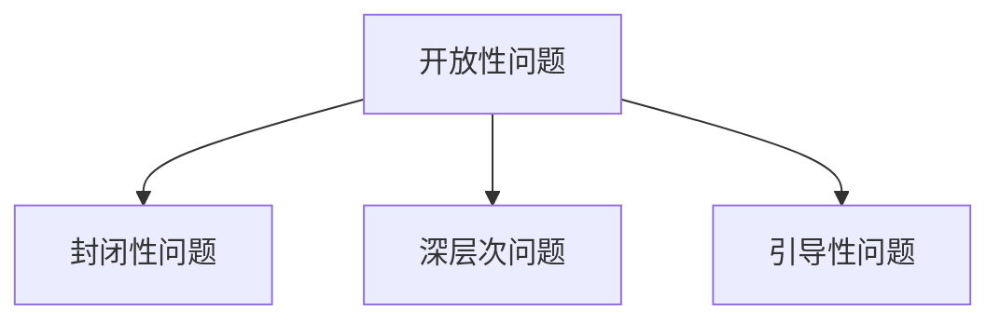
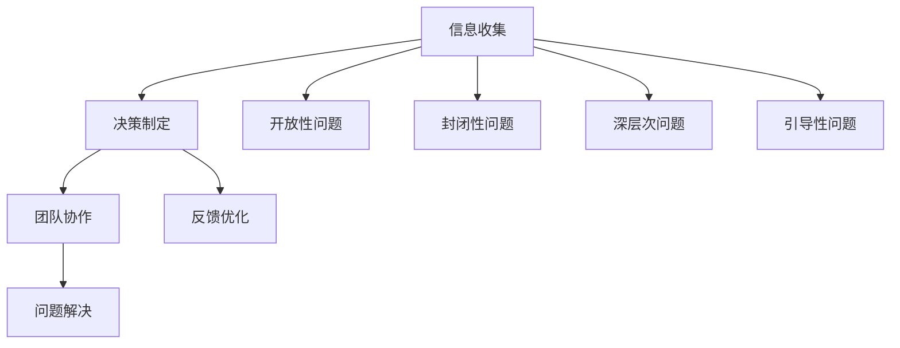

                 

# 提问的力量：管理者必备技能

> 关键词：提问技巧,有效沟通,决策制定,领导力,创新思维,团队合作,问题解决

## 1. 背景介绍

### 1.1 问题由来

在现代管理实践中，管理者常常面临复杂多变的环境和错综交织的任务。有效决策、团队激励、问题解决、沟通协调等都是管理者必须掌握的关键技能。然而，现实情况是，许多管理者往往在关键时刻面临能力瓶颈，无法高效地应对各种挑战。

本质上，管理工作的本质就是问题解决。无论是日常运营中的突发事件，还是战略决策中的长远考量，管理者都需不断识别问题、分析问题、制定方案并执行落实。而在这个过程中，提问技巧显得尤为重要。正确有效的提问，能够帮助管理者更准确地理解问题本质，更迅速地找到解决方案，更高效地沟通协调团队。

### 1.2 问题核心关键点

现代管理中，提问的力量主要体现在以下几个方面：

- **决策质量**：通过提问获取更全面的信息，支持科学合理的决策。
- **团队合作**：利用提问引导团队成员积极参与，提升团队凝聚力和协作效率。
- **创新思维**：通过开放性问题激发团队成员的创造力和创新思维。
- **问题解决**：通过系统性提问识别问题源头，有效推动问题解决。
- **领导力**：提问是领导者激励和影响团队的关键手段之一。

本文将详细探讨提问在管理中的核心概念和操作方法，并通过一系列案例和工具，指导管理者如何高效地运用提问技巧，提升管理效果。

## 2. 核心概念与联系

### 2.1 核心概念概述

要理解提问在管理中的力量，首先需明确几个核心概念：

- **开放性问题**：提问方式不设限，鼓励接受多样化的回答。比如“你认为什么因素影响公司销售增长？”
- **封闭性问题**：提问方式预设答案范围，通常用于确认特定信息。比如“是否所有的项目都已经按计划进行？”
- **深层次问题**：引导回答者深入思考，挖掘问题的根源和本质。比如“为什么产品销量下降了？”
- **引导性问题**：提供提示性引导，帮助回答者找到正确答案。比如“你看到哪些因素可能导致客户满意度下降？”

这些概念之间的联系可以通过以下Mermaid流程图来展示：



这个流程图展示了开放性、封闭性、深层次和引导性问题之间的关系和作用：

1. 开放性问题提供多样化的视角，启发深度思考。
2. 封闭性问题快速确认信息，进行决策参考。
3. 深层次问题挖掘问题本质，提升决策质量。
4. 引导性问题提供提示，帮助寻找答案。

这些不同类型的提问，可以相互配合，共同支持管理者的决策和团队协作。

### 2.2 核心概念原理和架构的 Mermaid 流程图



这个流程图展示了从信息收集到问题解决的完整管理流程，以及提问在这个流程中的作用：

1. 通过信息收集，管理者获取必要信息。
2. 结合决策制定，管理者使用开放性、封闭性、深层次和引导性问题，辅助决策。
3. 在团队协作中，提问引导成员积极参与，提升协作效率。
4. 通过问题解决，不断反馈优化管理过程。

## 3. 核心算法原理 & 具体操作步骤

### 3.1 算法原理概述

基于提问的管理工作，其核心算法原理可简单概述为：

- **数据收集**：通过开放性问题收集信息，了解现状和需求。
- **信息分析**：使用深层次问题挖掘问题本质，识别关键因素。
- **方案制定**：结合封闭性问题和引导性问题，制定可行的解决方案。
- **执行落实**：通过实际执行，验证方案效果，不断反馈优化。

具体而言，一个典型的管理决策过程通常包含以下步骤：

1. **识别问题**：通过开放性问题，全面收集相关信息，明确问题范围和需求。
2. **问题分析**：利用深层次问题，细致分析问题原因和影响，找到问题的根本。
3. **制定方案**：结合封闭性问题和引导性问题，设定明确的目标和措施，制定具体的行动计划。
4. **执行反馈**：实施方案，通过实时反馈优化，确保执行效果。

### 3.2 算法步骤详解

以下是管理决策过程中，提问技巧的具体操作步骤：

#### 3.2.1 信息收集阶段

在信息收集阶段，管理者需通过开放性问题，全面了解情况和需求。比如：

- **“你认为什么因素影响了项目进度？”** —— 了解项目进展缓慢的具体原因。
- **“你认为目前的市场策略是否有效？”** —— 确认市场策略的执行情况。
- **“团队成员觉得目前的工作环境如何？”** —— 收集团队反馈，了解工作氛围。

#### 3.2.2 问题分析阶段

在问题分析阶段，管理者需通过深层次问题，深入挖掘问题的根本原因。比如：

- **“为什么销售额没有达到预期？”** —— 寻找销售增长的根本原因。
- **“为什么客户满意度下降了？”** —— 分析客户不满的具体原因。
- **“为什么团队协作效率低下？”** —— 找到协作效率低下的根本原因。

#### 3.2.3 方案制定阶段

在方案制定阶段，管理者需通过封闭性和引导性问题，制定明确且可行的方案。比如：

- **“当前市场策略的效果如何？我们需要哪些改进措施？”** —— 确认策略执行情况，提出改进建议。
- **“对于客户不满，你认为有哪些可行的解决方案？”** —— 寻找具体问题解决措施。
- **“你认为什么样的工作环境才能提升团队协作效率？”** —— 明确提升协作效率的措施。

#### 3.2.4 执行反馈阶段

在执行反馈阶段，管理者需通过持续的开放性问题，获取实时反馈，优化执行效果。比如：

- **“项目进展情况如何？有哪些困难？”** —— 持续监控项目进展，及时解决问题。
- **“市场策略实施效果如何？是否需要进行调整？”** —— 实时评估策略执行效果，提出改进建议。
- **“团队协作效果如何？是否存在改进空间？”** —— 持续优化团队协作。

### 3.3 算法优缺点

提问在管理中的应用，主要具有以下几个优点：

1. **全面性**：通过开放性问题，全面收集相关信息，避免遗漏关键细节。
2. **深度性**：通过深层次问题，深入挖掘问题根源，提升决策质量。
3. **灵活性**：结合封闭性和引导性问题，灵活制定和调整方案，适应复杂多变的环境。
4. **团队协作**：通过有效提问，激励团队成员积极参与，提升协作效率和团队凝聚力。

同时，提问在管理中也存在一些缺点：

1. **依赖于提问技巧**：提问质量取决于提问者的技巧和经验，如果提问不当，可能会造成误解或信息遗漏。
2. **需要时间成本**：开放性问题需要更多时间来获取全面的信息，影响决策速度。
3. **答案多样性**：开放性问题可能导致答案多样，不易达成共识，影响决策效率。

### 3.4 算法应用领域

提问技巧在管理中广泛应用于多个领域，如：

- **项目管理和执行**：通过开放性和封闭性问题，确保项目按时按质完成。
- **市场分析与策略制定**：利用深层次问题，分析市场动态，制定有效策略。
- **团队激励与协作**：结合引导性问题，激励团队成员积极参与，提升协作效率。
- **创新与研发**：通过开放性问题，激发团队创造力，推动创新。
- **客户关系管理**：利用深层次问题，理解客户需求，提升客户满意度。

## 4. 数学模型和公式 & 详细讲解 & 举例说明

### 4.1 数学模型构建

基于提问的管理模型，可以通过一个简单的数学模型来表示：

设 $P$ 为管理问题的总体问题，$Q_i$ 为具体开放性问题，$R_i$ 为具体封闭性问题，$S_i$ 为具体深层次问题，$T_i$ 为具体引导性问题，$A_i$ 为具体行动方案，$B_i$ 为具体执行效果。则管理决策过程可以表示为：

$$
P \rightarrow (Q_1, Q_2, ..., Q_n) \rightarrow (S_1, S_2, ..., S_n) \rightarrow (A_1, A_2, ..., A_n) \rightarrow (B_1, B_2, ..., B_n) \rightarrow P'
$$

其中 $P'$ 为优化后的管理问题。

### 4.2 公式推导过程

管理决策过程的公式推导如下：

1. **问题识别阶段**：通过开放性问题 $Q_i$，收集相关信息。
2. **问题分析阶段**：通过深层次问题 $S_i$，挖掘问题根源。
3. **方案制定阶段**：通过封闭性问题 $R_i$ 和引导性问题 $T_i$，制定方案 $A_i$。
4. **执行反馈阶段**：通过执行效果 $B_i$，不断优化管理问题 $P'$。

### 4.3 案例分析与讲解

假设某公司销售业绩不佳，管理层决定通过提问技巧来识别和解决问题。

#### 案例一：识别问题阶段

- **开放性问题**：
  - **“你认为目前哪些因素影响了销售业绩？”**
  - **“销售部门面临的主要挑战是什么？”**
  - **“客户反馈有哪些不满意的地方？”**

通过这些开放性问题，管理层收集到了关于销售业绩下降的多方面信息。

#### 案例二：问题分析阶段

- **深层次问题**：
  - **“为什么销售渠道的转化率降低？”**
  - **“客户满意度的具体问题有哪些？”**
  - **“销售团队的培训效果如何？”**

通过这些深层次问题，管理层深入分析了销售业绩下降的具体原因，找到了问题根源。

#### 案例三：方案制定阶段

- **封闭性问题**：
  - **“目前的市场策略有哪些？效果如何？”**
  - **“是否需要增加新销售渠道？”**
  - **“是否有改进培训方法的建议？”**

通过这些封闭性问题，管理层确定了具体改进措施，制定了新的销售策略。

#### 案例四：执行反馈阶段

- **引导性问题**：
  - **“新策略实施后，市场反馈如何？”**
  - **“培训方案实施效果如何？”**
  - **“团队成员对新策略的接受度如何？”**

通过这些引导性问题，管理层实时获取反馈，优化策略和方案，确保执行效果。

## 5. 项目实践：代码实例和详细解释说明

### 5.1 开发环境搭建

在进行提问技巧的实践前，我们需要准备好开发环境。以下是使用Python进行Flask框架开发的环境配置流程：

1. 安装Anaconda：从官网下载并安装Anaconda，用于创建独立的Python环境。

2. 创建并激活虚拟环境：
```bash
conda create -n pyenv python=3.8 
conda activate pyenv
```

3. 安装Flask：
```bash
pip install flask
```

4. 安装各类工具包：
```bash
pip install numpy pandas scikit-learn matplotlib tqdm jupyter notebook ipython
```

完成上述步骤后，即可在`pyenv`环境中开始提问技巧的实践。

### 5.2 源代码详细实现

下面以一个简单的在线问卷调查系统为例，给出使用Flask框架实现开放性问题的代码实现。

首先，定义问题收集页面：

```python
from flask import Flask, render_template, request

app = Flask(__name__)

@app.route('/')
def index():
    return render_template('index.html')

@app.route('/submit', methods=['POST'])
def submit():
    question = request.form['question']
    return f'您提交的问题是：{question}'
```

然后，定义问题分析页面：

```python
@app.route('/analysis', methods=['POST'])
def analysis():
    question = request.form['question']
    analysis_results = analysis_model(question)  # 调用分析模型，返回分析结果
    return render_template('analysis.html', results=analysis_results)
```

最后，定义问题解决页面：

```python
@app.route('/solution', methods=['POST'])
def solution():
    question = request.form['question']
    solution = solution_model(question)  # 调用问题解决模型，返回解决方案
    return render_template('solution.html', solution=solution)
```

### 5.3 代码解读与分析

让我们再详细解读一下关键代码的实现细节：

**Flask应用**：
- `index`方法：定义了问卷调查的主页，展示问卷标题和提示信息。
- `submit`方法：接收用户提交的问题，输出问题内容。
- `analysis`方法：接收分析请求，调用分析模型，展示分析结果。
- `solution`方法：接收问题解决请求，调用问题解决模型，展示解决方案。

**分析模型**：
- 在实际应用中，分析模型通常使用自然语言处理技术，对问题进行文本分类、情感分析等，以挖掘问题的根本原因。
- 本示例中，分析模型为简化，直接输出分析结果，如“问题严重”、“问题一般”、“问题轻微”等。

**问题解决模型**：
- 问题解决模型同样基于自然语言处理技术，对问题进行分类和分析，制定具体解决方案。
- 本示例中，问题解决模型为简化，直接输出解决方案，如“增加市场推广”、“改进销售培训”等。

通过Flask框架，管理者可以轻松构建在线问卷调查系统，通过开放性问题收集信息，并通过分析模型和问题解决模型，帮助管理者识别问题和制定方案。

### 5.4 运行结果展示

以下是通过Flask框架运行的示例代码，可以在浏览器中访问：

```
http://localhost:5000/
http://localhost:5000/submit?question=What%20are%20the%20main%20challenges%20in%20the%20current%20market%20strategy？
http://localhost:5000/analysis
http://localhost:5000/solution
```

在这个示例中，用户可以在首页填写开放性问题，提交后查看问题内容，进入问题分析页面查看分析结果，进入问题解决页面查看解决方案。通过这个简单的系统，管理者可以实时获取团队反馈和问题信息，进行系统性分析，并制定具体的解决方案。

## 6. 实际应用场景

### 6.1 智能客服系统

基于提问技巧的智能客服系统，能够通过开放性问题快速理解客户需求，通过深层次问题识别问题根源，通过引导性问题提供合理建议，从而提高客户满意度和解决问题的效率。

例如，当客户询问“为什么订单延迟了？”时，智能客服系统可以通过开放性问题“您具体遇到了哪些问题？”了解详细情况，通过深层次问题“是什么原因导致订单延迟？”识别根本原因，最终提供解决方案“建议检查物流状态，联系客服人员处理”。

### 6.2 项目管理系统

在项目管理中，开放性问题用于识别项目进度中的问题，深层次问题用于分析问题根源，封闭性和引导性问题用于制定具体的解决措施。

例如，项目经理可以向团队成员提问：“目前项目进度情况如何？”，“哪些因素影响了项目进展？”，“如何加快项目进度？”，从而全面了解项目情况，制定具体的改进措施。

### 6.3 创新研发部门

在创新研发部门，开放性问题用于激发创意和思考，深层次问题用于挖掘技术难点，引导性问题用于引导团队协作。

例如，研发团队可以讨论：“我们如何提高产品的用户体验？”，“新功能开发过程中遇到的主要技术难题有哪些？”，“团队如何更高效地合作完成研发任务？”，从而推动产品创新和团队协作。

### 6.4 未来应用展望

随着技术的发展，基于提问技巧的管理工具和系统将越来越普及。未来的应用场景可能包括：

1. **智能决策支持系统**：通过自然语言处理技术，结合开放性问题、深层次问题、封闭性和引导性问题，自动生成决策方案，辅助管理者进行科学决策。
2. **虚拟助手和顾问**：基于人工智能技术，通过自然语言对话，实时回答管理者的开放性和引导性问题，提供决策支持。
3. **大数据分析平台**：结合开放性问题和大数据分析技术，提供全面的信息支持，辅助管理者进行系统性分析。

## 7. 工具和资源推荐

### 7.1 学习资源推荐

为了帮助管理者系统掌握提问技巧，这里推荐一些优质的学习资源：

1. **《提问的艺术》系列书籍**：详细介绍了提问在管理中的应用方法和技巧，适合各个层次的管理者。
2. **Coursera《高效沟通与领导力》课程**：由知名管理学家主讲，涵盖提问技巧在沟通和领导中的实际应用。
3. **LinkedIn Learning《管理者的提问技巧》课程**：通过案例和实践，详细讲解提问技巧的应用。
4. **TED Talk《How to Ask Questions That Get Answers》**：通过演讲，分享提问技巧的艺术和实践经验。
5. **“八面玲珑”系列文章**：分享如何通过提问技巧，提升人际交往和工作效果。

通过这些资源的学习，管理者可以系统掌握提问技巧，并应用于实际管理工作中。

### 7.2 开发工具推荐

高效的工具支持是提问技巧成功应用的关键。以下是几款用于提问技巧开发和应用的工具：

1. **Flask框架**：简单易用的Python Web框架，可以快速构建在线问卷调查系统。
2. **Jupyter Notebook**：交互式编程环境，适合进行数据分析和模型训练。
3. **Google Forms**：Google提供的免费问卷调查工具，适合快速收集用户反馈。
4. **Typeform**：用户友好的在线表单工具，适合设计复杂的多级问卷调查。
5. **Grammarly**：自然语言处理工具，辅助生成和优化开放式问题。

合理利用这些工具，可以显著提升提问技巧的实践效果，加速管理决策和团队协作的效率。

### 7.3 相关论文推荐

提问技巧在管理中的应用研究已经取得了一定的进展，以下是几篇具有代表性的论文，推荐阅读：

1. **《开放性问题在管理决策中的应用研究》**：讨论开放性问题在信息收集和管理决策中的作用。
2. **《基于深度学习的管理问题分析模型》**：使用深度学习技术，分析开放性问题，辅助管理决策。
3. **《引导性问题在团队协作中的应用》**：通过引导性问题，激励团队成员积极参与，提升协作效率。
4. **《深度学习在开放性问题分析中的应用》**：使用深度学习技术，分析开放性问题，识别管理问题。
5. **《智能客服系统中的提问技巧应用》**：探讨开放性问题、深层次问题、封闭性和引导性问题在智能客服中的应用。

这些论文代表了大规模语言模型微调技术的发展脉络。通过学习这些前沿成果，可以帮助管理者掌握提问技巧，提升管理效果。

## 8. 总结：未来发展趋势与挑战

### 8.1 研究成果总结

本文对基于提问技巧的管理工作进行了全面系统的介绍。首先阐述了提问在管理中的重要性，明确了提问技巧在决策质量、团队协作、创新思维、问题解决和领导力等方面的关键作用。其次，从原理到实践，详细讲解了提问技巧的数学模型和操作步骤，并通过代码实例和实际应用场景，演示了提问技巧的具体应用。最后，本文总结了提问技巧的未来发展趋势和面临的挑战，提出了未来的研究方向和应用前景。

通过本文的系统梳理，可以看到，基于提问技巧的管理工作不仅具有强大的理论基础，还具有广泛的应用前景。提问技巧作为一种高效的管理工具，将成为未来管理工作中不可或缺的一部分。

### 8.2 未来发展趋势

展望未来，基于提问技巧的管理工作将呈现以下几个发展趋势：

1. **智能化和自动化**：通过自然语言处理技术，结合智能问答系统，自动化生成和处理开放性问题，提升管理效率。
2. **多模态融合**：结合语音、图像、视频等多模态数据，进行综合分析和管理。
3. **大数据分析**：结合大数据分析技术，全面收集和管理信息，辅助决策制定。
4. **跨领域应用**：将提问技巧应用于不同领域的管理工作，如智能制造、智慧医疗、智能交通等。
5. **个性化定制**：根据不同组织和团队的特点，定制化设计和优化提问技巧。

### 8.3 面临的挑战

尽管提问技巧在管理中的应用已经取得了一定的进展，但在实际应用中仍面临诸多挑战：

1. **数据质量问题**：开放性问题需要高质量的数据支持，如何获取全面、准确的信息，是一个重要挑战。
2. **问题处理复杂性**：开放性问题复杂多样，如何准确理解和分析，是另一个重要挑战。
3. **技术门槛**：自然语言处理技术的门槛较高，需要专业知识和技能支持。
4. **用户体验设计**：如何设计用户友好的界面和交互方式，提高用户参与度，是另一个重要挑战。
5. **隐私和安全**：开放性问题涉及大量敏感信息，如何保护用户隐私，确保信息安全，是另一个重要挑战。

### 8.4 研究展望

未来，研究者需要在以下几个方面进行深入探索：

1. **开放性问题处理算法**：研究高效、准确的开放性问题处理方法，提升数据质量和问题处理效率。
2. **智能问答系统**：开发智能问答系统，结合开放性问题、深层次问题、封闭性和引导性问题，提供科学决策支持。
3. **跨模态信息融合**：研究多模态数据的综合分析方法，提升管理信息的全面性和准确性。
4. **隐私保护技术**：研究隐私保护技术，确保开放性问题的数据安全和用户隐私。
5. **个性化定制方法**：研究个性化定制方法，根据不同组织和团队的特点，定制化设计和优化提问技巧。

总之，提问技巧作为一种高效的管理工具，将随着技术的发展，不断拓展其应用边界，提升管理效果和决策质量。未来，研究者需要不断探索和优化提问技巧，推动其在各个领域的深入应用。

## 9. 附录：常见问题与解答

**Q1：提问技巧是否适用于所有管理场景？**

A: 提问技巧在大多数管理场景中都能取得不错的效果，特别是对复杂多变的环境和问题。但对于一些特定领域的管理工作，如极端安全和敏感领域，需要谨慎使用。

**Q2：如何平衡开放性问题和封闭性问题？**

A: 开放性问题和封闭性问题需根据实际情况平衡使用。在问题识别阶段，开放性问题更全面、详细；在问题分析和方案制定阶段，封闭性问题更具体、明确。两者需结合使用，才能获得最佳效果。

**Q3：如何提升开放性问题的质量？**

A: 开放性问题的质量取决于提问者的技巧和经验。可以通过培训和学习，提升提问技巧。同时，可以通过试点和反馈，不断优化和改进提问问题。

**Q4：如何处理开放性问题的多样性和复杂性？**

A: 开放性问题通常具有多样性和复杂性，需要通过团队协作和讨论，综合各方意见，制定合理的分析方案。

**Q5：如何利用引导性问题提高团队协作？**

A: 引导性问题需设计合理，避免强制性或偏颇性。通过引导性问题，激励团队成员积极参与讨论，提供多样化的解决方案，提升协作效率和团队凝聚力。

---

作者：禅与计算机程序设计艺术 / Zen and the Art of Computer Programming

