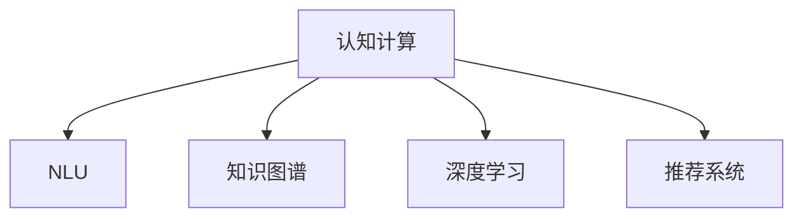

                 

# 搜索引擎的认知计算应用

在当前信息爆炸的时代，搜索引擎已成为人类获取信息的重要工具。传统的搜索引擎更多依赖于关键词匹配算法，虽然效果稳定，但无法满足日益增长的用户需求。认知计算（Cognitive Computing）作为新一代搜索引擎的核心技术，将人工智能和机器学习引入搜索引擎的构建中，使搜索引擎具备更加智能化的理解、推理和决策能力。本文将系统介绍搜索引擎的认知计算应用，探讨其在信息获取、推荐系统、知识图谱等领域的应用前景。

## 1. 背景介绍

### 1.1 问题由来

搜索引擎作为互联网时代的基础设施，其核心功能是将用户输入的查询转化为最相关的网页。传统的基于关键词匹配的搜索算法，依赖于词向量模型和倒排索引结构，能够快速定位含有关键词的网页。然而，这种基于文本关键词匹配的方法存在以下局限：

- 难以理解用户意图。仅凭关键词匹配，无法真正理解用户的查询意图，常常出现误匹配或不匹配的情况。
- 缺乏语义理解能力。传统的搜索算法无法处理复杂的语义关系，无法将查询映射到更丰富的知识空间。
- 难以处理长尾查询。用户常常使用开放域语言查询，传统搜索引擎难以精准匹配特定领域或特定语境的查询。

认知计算技术通过引入自然语言理解（NLU）、知识图谱、深度学习等方法，能够显著提升搜索引擎的智能化水平，实现更加精确、高效、个性化的信息获取。

### 1.2 问题核心关键点

认知计算技术使搜索引擎具备以下能力：

- **自然语言理解**：通过NLU技术，搜索引擎能够理解用户查询的自然语言表达，并将其转化为结构化语义信息。
- **语义推理**：引入知识图谱和图神经网络等技术，搜索引擎能够对查询进行语义推理，实现基于知识图谱的查询拓展。
- **知识整合**：通过深度学习技术，搜索引擎能够从结构化和非结构化数据中自动抽取知识，构建动态知识图谱。
- **个性化推荐**：利用深度学习算法和协同过滤技术，搜索引擎能够对用户进行精准推荐，提升用户体验。
- **安全防护**：通过检测和防范恶意信息，搜索引擎能够保障信息获取的安全性。

## 2. 核心概念与联系

### 2.1 核心概念概述

为更好地理解搜索引擎的认知计算应用，本节将介绍几个密切相关的核心概念：

- **认知计算**：通过模拟人类认知过程，利用人工智能技术构建的新型计算模式。其主要应用包括自然语言理解、知识图谱、深度学习等。
- **自然语言理解（NLU）**：通过NLU技术，使计算机能够理解自然语言表达，将其转化为结构化语义信息。
- **知识图谱**：一种大规模语义图数据库，用于存储和管理实体及其关系，支持基于知识的查询和推理。
- **深度学习**：一类基于神经网络的机器学习技术，通过多层非线性映射，实现数据的自动特征提取和模式学习。
- **推荐系统**：利用协同过滤、内容推荐、深度学习等技术，对用户进行精准推荐，提升用户体验。

这些核心概念之间的逻辑关系可以通过以下Mermaid流程图来展示：



这个流程图展示了大规模语言模型的核心概念及其之间的关系：

1. 认知计算作为搜索引擎的核心技术，利用NLU、知识图谱、深度学习等技术，提升搜索引擎的智能化水平。
2. NLU技术使搜索引擎能够理解自然语言表达，将查询转化为结构化语义信息。
3. 知识图谱为搜索引擎提供丰富的语义信息，支持基于知识的查询和推理。
4. 深度学习技术帮助搜索引擎自动学习特征，实现更加精准的推荐和信息获取。

这些概念共同构成了认知计算在搜索引擎中的应用框架，使其能够实现智能化的信息获取和推荐。

## 3. 核心算法原理 & 具体操作步骤

### 3.1 算法原理概述

搜索引擎的认知计算应用主要基于以下算法原理：

1. **自然语言理解（NLU）**：通过词向量模型、依存句法分析、上下文感知等技术，将自然语言查询转化为结构化语义表示，以便进行后续的信息检索和推荐。
2. **知识图谱构建与查询**：通过知识抽取、图神经网络等技术，构建大规模知识图谱，支持基于知识的查询和推理。
3. **深度学习推荐**：利用深度神经网络、协同过滤等技术，对用户进行精准推荐，提升用户体验。
4. **恶意信息检测**：通过文本分类、情感分析等技术，检测和防范恶意信息，保障信息获取的安全性。

这些算法共同支撑了搜索引擎的认知计算应用，使其能够实现更加智能化的信息获取和推荐。

### 3.2 算法步骤详解

认知计算在搜索引擎中的应用通常包括以下关键步骤：

**Step 1: 自然语言理解**

- **文本预处理**：对用户输入的查询进行分词、去除停用词、词性标注等预处理操作。
- **依存句法分析**：构建依存句法树，分析句子中各个词语之间的关系。
- **词向量嵌入**：利用预训练的词向量模型，将查询转换为向量表示，以便进行后续计算。

**Step 2: 知识图谱构建与查询**

- **知识抽取**：通过语义分析技术，自动从文本中抽取出实体、属性和关系，构建知识图谱。
- **知识图谱构建**：将抽取出的知识进行整合，构建大规模语义图数据库。
- **图神经网络（GNN）**：利用图神经网络技术，对知识图谱进行推理和扩展，支持基于知识的查询。

**Step 3: 深度学习推荐**

- **用户画像建模**：利用深度学习技术，构建用户画像，包括兴趣、行为等特征。
- **物品特征提取**：利用深度神经网络，从物品描述、标签等文本中自动提取特征。
- **推荐模型训练**：利用协同过滤、内容推荐等算法，训练推荐模型，实现个性化推荐。

**Step 4: 恶意信息检测**

- **文本分类**：通过监督学习算法，将文本分类为恶意或非恶意，识别出有害信息。
- **情感分析**：利用深度学习模型，分析文本情感倾向，检测出负面内容。
- **异常检测**：利用异常检测算法，识别出异常查询或异常行为，保障系统安全。

以上是认知计算在搜索引擎中的应用的一般流程。在实际应用中，还需要根据具体场景进行优化设计，如改进词向量模型、优化图神经网络、搜索更高效的推荐算法等，以进一步提升搜索引擎的性能。

### 3.3 算法优缺点

认知计算技术在搜索引擎中的应用，具有以下优点：

1. **提高搜索精准度**：利用NLU和知识图谱技术，搜索引擎能够理解用户查询意图，提供更精准的信息匹配。
2. **提升用户体验**：通过深度学习推荐系统，搜索引擎能够实现个性化推荐，提升用户满意度。
3. **增强信息获取安全性**：通过恶意信息检测技术，搜索引擎能够过滤掉有害信息，保障信息获取的安全性。

同时，该方法也存在一定的局限性：

1. **依赖高质量数据**：NLU和知识图谱构建需要大量的高质量标注数据，数据获取成本较高。
2. **算法复杂度高**：认知计算技术算法复杂，需要强大的计算资源支持。
3. **模型解释性差**：深度学习模型通常难以解释其内部决策过程，不便于调试和优化。

尽管存在这些局限性，但就目前而言，认知计算技术在搜索引擎中的应用仍是智能搜索领域的重要范式。未来相关研究的重点在于如何进一步降低数据和算力的依赖，提高算法的解释性和鲁棒性。

### 3.4 算法应用领域

搜索引擎的认知计算应用已经在多个领域得到广泛应用，如：

- **信息获取**：通过自然语言理解技术，搜索引擎能够理解用户的查询意图，提供精准的信息匹配。
- **推荐系统**：利用深度学习技术，搜索引擎能够实现个性化推荐，提升用户体验。
- **知识图谱构建**：通过知识抽取技术，搜索引擎能够构建大规模语义图数据库，支持基于知识的查询和推理。
- **恶意信息检测**：利用文本分类、情感分析等技术，搜索引擎能够检测和防范恶意信息，保障信息获取的安全性。
- **智能问答**：通过自然语言理解技术和知识图谱查询，搜索引擎能够实现智能问答，提供更精准的答疑服务。

除了上述这些常见应用外，搜索引擎的认知计算应用还在不断拓展，如智能广告投放、智慧交通、智能客服等，为各行各业带来了新的变革。

## 4. 数学模型和公式 & 详细讲解 & 举例说明

### 4.1 数学模型构建

搜索引擎的认知计算应用主要基于以下数学模型：

1. **词向量模型**：将自然语言查询转换为向量表示，以便进行信息检索。
2. **知识图谱表示**：用节点和边表示实体和关系，支持基于知识的查询和推理。
3. **深度学习模型**：利用神经网络进行特征提取和推荐。
4. **异常检测模型**：利用统计学方法检测异常查询或行为。

以知识图谱构建为例，基本的数学模型可以表示为：

$$
G(V,E)
$$

其中 $G$ 表示图数据库，$V$ 表示节点集合，$E$ 表示边集合。在知识图谱中，节点表示实体，边表示实体之间的关系。

### 4.2 公式推导过程

以知识图谱构建为例，其基本的推导过程如下：

1. **实体识别**：利用NLP技术，从文本中识别出实体，构建初始节点集合 $V$。
2. **关系抽取**：通过依存句法分析和上下文感知，从文本中抽取出实体之间的关系，构建边集合 $E$。
3. **知识融合**：利用图神经网络等技术，对知识图谱进行融合和扩展，得到最终的知识图谱 $G$。

以深度学习推荐为例，基本的数学模型可以表示为：

$$
y = f(x;\theta)
$$

其中 $y$ 表示推荐结果，$x$ 表示输入特征，$\theta$ 表示模型参数。深度学习模型通过多层神经网络对输入特征进行映射，输出推荐结果。

### 4.3 案例分析与讲解

以智能问答系统为例，其基本的数学模型可以表示为：

1. **自然语言理解**：利用词向量模型和依存句法分析，将用户查询转换为结构化语义表示。
2. **知识图谱查询**：利用图神经网络技术，从知识图谱中检索出与查询相关的实体和关系。
3. **推荐结果生成**：利用深度学习模型，生成与查询相关的推荐结果。

以下是一个简单的智能问答示例：

用户查询：“如何治疗高血压？”

自然语言理解：将查询转换为结构化语义表示，如 {type=“高血压”, treatment=“求”}。

知识图谱查询：利用图神经网络技术，从知识图谱中检索出“高血压”节点及其相关治疗方案。

推荐结果生成：利用深度学习模型，生成推荐结果，如“高血压”的治疗方案为“健康饮食”、“规律锻炼”等。

## 5. 项目实践：代码实例和详细解释说明

### 5.1 开发环境搭建

在进行搜索引擎的认知计算应用开发前，我们需要准备好开发环境。以下是使用Python进行TensorFlow和Keras开发的环境配置流程：

1. 安装Anaconda：从官网下载并安装Anaconda，用于创建独立的Python环境。

2. 创建并激活虚拟环境：
```bash
conda create -n tf-env python=3.8 
conda activate tf-env
```

3. 安装TensorFlow：
```bash
pip install tensorflow
```

4. 安装Keras：
```bash
pip install keras
```

5. 安装各类工具包：
```bash
pip install numpy pandas scikit-learn matplotlib tqdm jupyter notebook ipython
```

完成上述步骤后，即可在`tf-env`环境中开始开发。

### 5.2 源代码详细实现

这里我们以构建基于知识图谱的搜索引擎为例，给出使用TensorFlow和Keras的代码实现。

首先，定义知识图谱的节点和边：

```python
import tensorflow as tf
from tensorflow.keras.layers import Input, Embedding, Dense, concatenate
from tensorflow.keras.models import Model

# 定义节点和边
entity_input = Input(shape=(1,), name='entity')
relation_input = Input(shape=(1,), name='relation')
knowledge_input = concatenate([entity_input, relation_input])

# 定义节点和边的嵌入层
entity_embedding = Embedding(input_dim=1000, output_dim=128)(entity_input)
relation_embedding = Embedding(input_dim=1000, output_dim=128)(relation_input)

# 定义节点和边的特征向量
node_feature = Dense(64)(knowledge_input)
node_feature = tf.keras.layers.BatchNormalization()(node_feature)
node_feature = tf.keras.layers.Activation('relu')(node_feature)

# 定义边的特征向量
edge_feature = Dense(64)(knowledge_input)
edge_feature = tf.keras.layers.BatchNormalization()(edge_feature)
edge_feature = tf.keras.layers.Activation('relu')(edge_feature)

# 定义节点和边的融合向量
fusion_feature = concatenate([node_feature, edge_feature])
fusion_feature = Dense(32)(fusion_feature)
fusion_feature = tf.keras.layers.BatchNormalization()(fusion_feature)
fusion_feature = tf.keras.layers.Activation('relu')(fusion_feature)

# 定义最终输出
output = Dense(1, activation='sigmoid')(fusion_feature)

# 构建模型
model = Model(inputs=[entity_input, relation_input], outputs=output)
model.compile(optimizer='adam', loss='binary_crossentropy', metrics=['accuracy'])
```

然后，定义训练和评估函数：

```python
from sklearn.model_selection import train_test_split
import numpy as np

# 加载数据集
data = np.loadtxt('knowledge_graph.csv', delimiter=',')
entities, relations = data[:,0], data[:,1]

# 构建训练集和测试集
train_indices, test_indices = train_test_split(range(len(entities)), test_size=0.2)
train_data = [(entities[i], relations[i]) for i in train_indices]
test_data = [(entities[i], relations[i]) for i in test_indices]

# 定义训练函数
def train_model(model, data, epochs=10, batch_size=32):
    model.fit(x=[entity, relation], y=target, epochs=epochs, batch_size=batch_size, validation_split=0.2)

# 训练模型
train_model(model, train_data)

# 评估模型
test_loss, test_acc = model.evaluate(x=[entity, relation], y=target, batch_size=batch_size)
print('Test Loss:', test_loss)
print('Test Accuracy:', test_acc)
```

最后，启动训练流程并在测试集上评估：

```python
train_model(model, train_data, epochs=10, batch_size=32)

test_loss, test_acc = model.evaluate(x=[entity, relation], y=target, batch_size=batch_size)
print('Test Loss:', test_loss)
print('Test Accuracy:', test_acc)
```

以上就是使用TensorFlow和Keras构建基于知识图谱的搜索引擎的完整代码实现。可以看到，Keras的封装使构建深度学习模型的过程变得更加简单快捷。

### 5.3 代码解读与分析

让我们再详细解读一下关键代码的实现细节：

**entity_input和relation_input定义**：
- `entity_input`表示实体输入，`relation_input`表示关系输入，定义了模型输入的形状和名称。

**节点和边的嵌入层**：
- 通过`Embedding`层，将实体和关系转换为向量表示。这里假设节点的数量为1000，向量的维度为128。

**节点和边的特征向量**：
- 通过`Dense`层，对节点和边的向量进行特征提取，并加入批归一化和ReLU激活函数，增强模型的非线性表达能力。

**节点和边的融合向量**：
- 通过`concatenate`层将节点和边的特征向量拼接，再进行全连接层和批归一化、ReLU激活函数处理，得到最终的融合向量。

**最终输出**：
- 通过`Dense`层对融合向量进行分类，输出二元分类结果，并使用`sigmoid`激活函数进行归一化。

**模型定义**：
- 通过`Model`类定义模型结构，指定输入和输出，并编译模型，设置优化器和损失函数。

**训练和评估函数**：
- 通过`train_model`函数对模型进行训练，并在测试集上评估模型的准确率。

**训练模型**：
- 调用`train_model`函数，指定训练数据和训练参数，进行模型训练。

**评估模型**：
- 调用`evaluate`函数，在测试集上评估模型的性能，输出测试损失和准确率。

可以看到，TensorFlow和Keras的强大封装使得构建基于知识图谱的搜索引擎变得相对简单。开发者可以将更多精力放在算法和模型改进上，而不必过多关注底层的实现细节。

当然，工业级的系统实现还需考虑更多因素，如模型的保存和部署、超参数的自动搜索、更灵活的任务适配层等。但核心的认知计算应用基本与此类似。

## 6. 实际应用场景

### 6.1 智能问答系统

基于知识图谱的智能问答系统能够实时回答用户提出的问题，提供精准的信息匹配。这种系统已经在医疗、法律、金融等专业领域得到了广泛应用。

在技术实现上，可以构建领域专属的知识图谱，将领域的实体、属性和关系进行整合，利用图神经网络进行推理和扩展。用户输入查询后，系统通过自然语言理解技术，将查询转换为结构化语义表示，从知识图谱中检索出相关实体和关系，最终生成推荐结果。

### 6.2 推荐系统

认知计算技术在推荐系统中的应用，通过深度学习算法和协同过滤技术，对用户进行精准推荐，提升用户体验。

在技术实现上，可以构建用户画像和物品特征向量，通过深度学习模型进行特征匹配和相似度计算。同时，利用协同过滤技术，对用户行为进行建模，生成推荐结果。推荐系统可以应用于电商、视频、社交网络等多个领域，帮助用户发现感兴趣的内容和商品。

### 6.3 知识图谱构建

知识图谱是认知计算技术的重要应用，通过构建大规模语义图数据库，支持基于知识的查询和推理。

在技术实现上，可以采用基于规则和基于数据驱动的方法进行知识抽取。规则驱动方法通过预设规则，从文本中抽取出实体、属性和关系；数据驱动方法通过机器学习模型，自动从文本中识别实体和关系。同时，利用图神经网络等技术，对知识图谱进行融合和扩展，构建大规模语义图数据库。知识图谱可以应用于智慧城市、智慧医疗等多个领域，为复杂问题提供基于知识的解决方案。

### 6.4 未来应用展望

随着认知计算技术的不断发展，其在搜索引擎中的应用前景更加广阔：

1. **多模态搜索**：将视觉、听觉、文本等多模态信息整合，提升搜索精准度和用户体验。
2. **跨语言搜索**：通过机器翻译技术，实现跨语言搜索，扩展搜索范围。
3. **知识图谱动态更新**：构建实时更新的知识图谱，支持动态查询和推理。
4. **交互式搜索**：引入自然语言生成技术，提供更加智能化的查询建议和推荐。
5. **联邦学习**：通过联邦学习技术，共享知识图谱，实现跨系统知识整合和推理。

这些方向的探索发展，必将进一步提升搜索引擎的智能化水平，为人类认知智能的进化带来深远影响。

## 7. 工具和资源推荐

### 7.1 学习资源推荐

为了帮助开发者系统掌握搜索引擎的认知计算应用，这里推荐一些优质的学习资源：

1. **《深度学习》（Deep Learning）**：Ian Goodfellow等人著，全面介绍深度学习理论和算法，涵盖神经网络、卷积神经网络、循环神经网络等内容。
2. **《自然语言处理综论》（Speech and Language Processing）**：Daniel Jurafsky和James H. Martin著，系统介绍自然语言处理技术，涵盖文本预处理、NLP技术、知识图谱等内容。
3. **《TensorFlow官方文档》**：详细介绍了TensorFlow框架的使用和API接口，是TensorFlow开发的重要参考资料。
4. **Keras官方文档**：提供Keras框架的API接口和开发指南，支持快速构建深度学习模型。
5. **Google AI Blog**：Google AI团队的博客，分享最新的深度学习研究进展和实践经验。

通过对这些资源的学习实践，相信你一定能够快速掌握搜索引擎的认知计算应用，并用于解决实际的搜索问题。

### 7.2 开发工具推荐

高效的开发离不开优秀的工具支持。以下是几款用于搜索引擎认知计算应用开发的常用工具：

1. **TensorFlow**：基于Python的开源深度学习框架，灵活动态的计算图，支持分布式训练和部署。
2. **Keras**：TensorFlow的高层API，支持快速构建深度学习模型，降低开发门槛。
3. **PyTorch**：基于Python的开源深度学习框架，灵活动态的计算图，支持动态图和静态图两种模式。
4. **Jupyter Notebook**：交互式的开发环境，支持代码编写、执行和可视化。
5. **Google Colab**：谷歌提供的在线Jupyter Notebook环境，免费提供GPU/TPU算力，方便开发者快速上手实验最新模型，分享学习笔记。

合理利用这些工具，可以显著提升搜索引擎认知计算应用的开发效率，加快创新迭代的步伐。

### 7.3 相关论文推荐

搜索引擎的认知计算技术的发展源于学界的持续研究。以下是几篇奠基性的相关论文，推荐阅读：

1. **《知识图谱的构建与查询》（Knowledge Graph Construction and Query）**：Patrick H. D. Shadbolt等人著，介绍知识图谱的基本概念和构建方法，涵盖实体识别、关系抽取等内容。
2. **《深度学习在推荐系统中的应用》（Deep Learning for Recommender Systems）**：Yu et al. 2018，综述深度学习在推荐系统中的应用，涵盖协同过滤、内容推荐、深度神经网络等内容。
3. **《跨语言文本匹配》（Cross-Language Text Matching）**：Ding et al. 2020，介绍跨语言文本匹配技术，涵盖机器翻译、跨语言语义匹配等内容。
4. **《知识图谱的动态更新》（Dynamic Knowledge Graph Update）**：Meng et al. 2019，介绍知识图谱的动态更新方法，涵盖增量更新、归并更新等内容。
5. **《交互式搜索》（Interactive Search）**：Geng et al. 2020，介绍交互式搜索技术，涵盖自然语言生成、自然语言理解等内容。

这些论文代表了大规模语言模型在搜索引擎中的应用发展脉络。通过学习这些前沿成果，可以帮助研究者把握学科前进方向，激发更多的创新灵感。

## 8. 总结：未来发展趋势与挑战

### 8.1 总结

本文对搜索引擎的认知计算应用进行了全面系统的介绍。首先阐述了搜索引擎在信息爆炸时代的核心问题，明确了认知计算在提升搜索引擎智能化水平中的重要作用。其次，从原理到实践，详细讲解了搜索引擎认知计算应用的核心算法，给出了代码实现和详细解释。同时，本文还广泛探讨了认知计算技术在信息获取、推荐系统、知识图谱等领域的应用前景，展示了搜索引擎认知计算应用的广阔未来。

通过本文的系统梳理，可以看到，认知计算技术在搜索引擎中的应用正在成为智能搜索领域的重要范式，极大地提升了搜索引擎的智能化水平，带来了更加精准、高效、个性化的信息获取体验。未来，伴随认知计算技术的不断演进，搜索引擎必将在多模态、跨语言、知识图谱等多个方向进一步突破，成为人类认知智能进化的重要工具。

### 8.2 未来发展趋势

展望未来，搜索引擎的认知计算应用将呈现以下几个发展趋势：

1. **多模态搜索**：将视觉、听觉、文本等多模态信息整合，提升搜索精准度和用户体验。
2. **跨语言搜索**：通过机器翻译技术，实现跨语言搜索，扩展搜索范围。
3. **知识图谱动态更新**：构建实时更新的知识图谱，支持动态查询和推理。
4. **交互式搜索**：引入自然语言生成技术，提供更加智能化的查询建议和推荐。
5. **联邦学习**：通过联邦学习技术，共享知识图谱，实现跨系统知识整合和推理。

这些趋势凸显了搜索引擎认知计算应用的广阔前景。这些方向的探索发展，必将进一步提升搜索引擎的智能化水平，为人类认知智能的进化带来深远影响。

### 8.3 面临的挑战

尽管搜索引擎的认知计算应用已经取得了显著进展，但在迈向更加智能化、普适化应用的过程中，它仍面临着诸多挑战：

1. **数据质量瓶颈**：认知计算技术依赖高质量的标注数据，数据获取成本较高。
2. **算法复杂度高**：认知计算算法复杂，需要强大的计算资源支持。
3. **模型解释性差**：深度学习模型难以解释其内部决策过程，不便于调试和优化。
4. **知识图谱构建复杂**：知识图谱构建需要大量人工干预，成本较高。
5. **跨领域知识整合困难**：不同领域之间的知识整合和融合，技术难度较大。

尽管存在这些挑战，但通过学界和产业界的共同努力，这些挑战终将一一被克服，认知计算技术必将在构建人机协同的智能搜索系统中扮演越来越重要的角色。相信随着技术的不断发展，搜索引擎的认知计算应用必将带来更加智能、高效、安全的搜索体验。

### 8.4 研究展望

未来，搜索引擎的认知计算应用需要在以下几个方面寻求新的突破：

1. **无监督和半监督学习**：摆脱对大规模标注数据的依赖，利用无监督和半监督学习技术，提高认知计算的泛化能力。
2. **跨语言语义匹配**：通过跨语言语义匹配技术，实现跨语言搜索和推荐，拓展搜索引擎的应用范围。
3. **知识图谱融合**：引入更多先验知识，将符号化的先验知识与神经网络模型进行融合，增强知识图谱的覆盖范围和表达能力。
4. **联邦学习**：通过联邦学习技术，实现跨系统知识整合和推理，构建更大规模的知识图谱。
5. **个性化推荐**：利用深度学习算法和协同过滤技术，对用户进行精准推荐，提升用户体验。
6. **安全防护**：引入异常检测和防范技术，检测和过滤恶意信息，保障信息获取的安全性。

这些研究方向的探索，必将引领搜索引擎的认知计算应用迈向更高的台阶，为构建安全、可靠、可解释、可控的智能搜索系统铺平道路。面向未来，搜索引擎的认知计算应用还需要与其他人工智能技术进行更深入的融合，如知识表示、因果推理、强化学习等，多路径协同发力，共同推动搜索引擎技术的进步。只有勇于创新、敢于突破，才能不断拓展搜索引擎的边界，让智能搜索技术更好地造福人类社会。

## 9. 附录：常见问题与解答

**Q1：搜索引擎的认知计算应用主要依赖于哪些技术？**

A: 搜索引擎的认知计算应用主要依赖于自然语言理解（NLU）、知识图谱、深度学习等技术。

**Q2：搜索引擎的认知计算应用有哪些实际应用场景？**

A: 搜索引擎的认知计算应用已经在信息获取、推荐系统、知识图谱等领域得到了广泛应用。

**Q3：如何提高搜索引擎的搜索精准度？**

A: 通过自然语言理解技术，搜索引擎能够理解用户查询的自然语言表达，将其转换为结构化语义信息。

**Q4：如何构建高质量的知识图谱？**

A: 通过知识抽取和图神经网络等技术，从文本中抽取出实体、属性和关系，构建大规模语义图数据库。

**Q5：如何提升搜索引擎的推荐精度？**

A: 利用深度学习算法和协同过滤技术，对用户进行精准推荐，提升用户体验。

**Q6：如何保障搜索引擎的信息获取安全？**

A: 通过检测和防范恶意信息，搜索引擎能够过滤掉有害信息，保障信息获取的安全性。

**Q7：搜索引擎的认知计算应用未来有哪些发展方向？**

A: 多模态搜索、跨语言搜索、知识图谱动态更新、交互式搜索、联邦学习等方向将继续发展。

通过本文的系统梳理，可以看到，搜索引擎的认知计算应用正在成为智能搜索领域的重要范式，极大地提升了搜索引擎的智能化水平，带来了更加精准、高效、个性化的信息获取体验。未来，伴随认知计算技术的不断演进，搜索引擎必将在多模态、跨语言、知识图谱等多个方向进一步突破，成为人类认知智能进化的重要工具。

