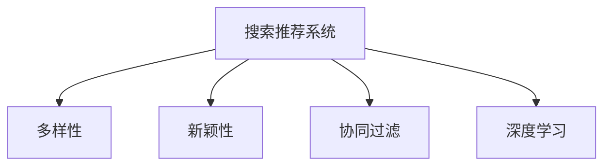

                 

# 搜索推荐系统中的多样性与新颖性平衡策略

> 关键词：搜索推荐系统, 多样性, 新颖性, 推荐算法, 协同过滤, 深度学习

## 1. 背景介绍

随着互联网技术的迅猛发展，搜索引擎和推荐系统已经成为人们日常生活中不可或缺的工具。它们通过算法模型为用户提供个性化的搜索结果和商品推荐，极大地提升了信息获取的效率和满意度。然而，这种以用户历史行为为依据的个性化推荐往往忽略了搜索结果的多样性和新颖性，导致用户重复查看相似内容，难以发现新奇和丰富的信息。

为了解决这一问题，研究人员提出了多种平衡搜索推荐系统中的多样性与新颖性的策略。本文将全面介绍这些策略，包括协同过滤、深度学习、自然语言处理等领域的研究进展，并给出实际应用中的代码示例，以期为行业从业者提供参考。

## 2. 核心概念与联系

### 2.1 核心概念概述

为了更好地理解这些平衡策略，我们首先定义几个核心概念：

- **搜索推荐系统(Information Retrieval and Recommendation System, IRRS)**：一种基于用户行为数据，为用户推荐信息或商品的系统。
- **多样性(Diversity)**：指搜索结果或推荐列表中包含的各个项目的差异程度。
- **新颖性(Novelty)**：指搜索结果或推荐列表中包含的新奇信息量。
- **协同过滤(Collaborative Filtering, CF)**：通过用户行为数据，推断用户可能感兴趣的物品。
- **深度学习(Deep Learning)**：一类模仿人脑神经网络结构的机器学习技术，可以自动学习高维特征表示。

这些概念之间的逻辑关系可以通过以下Mermaid流程图来展示：



从图中可以看出，协同过滤和深度学习是平衡多样性和新颖性的主要手段。协同过滤通过用户行为数据进行物品推荐，可以提升推荐的新颖性。深度学习通过用户行为、物品属性等高维数据进行建模，可以提升推荐的多样性和新颖性。

## 3. 核心算法原理 & 具体操作步骤

### 3.1 算法原理概述

平衡搜索推荐系统中的多样性和新颖性，本质上是优化推荐结果的多样性与新颖性指标。当前主要的优化目标函数包括：

- 最大化推荐列表的多样性(diversity)和新颖性(novelty)：$D + N$
- 最大化推荐列表的多样性(novelty)和新颖性(accuracy)：$N \times A$
- 最大化推荐列表的多样性和准确性(diversity)：$D \times A$
- 最大化推荐列表的覆盖率(coverage)和新颖性(novelty)：$C \times N$
- 最大化推荐列表的覆盖率和准确性(accuracy)：$C \times A$

其中，$D$表示多样性指标，$N$表示新颖性指标，$A$表示准确性指标，$C$表示覆盖率指标。不同目标函数的侧重点不同，适用于不同的推荐场景。

### 3.2 算法步骤详解

为了详细说明这些优化目标函数的实现方法，我们以最大化推荐列表的多样性和新颖性为例，给出具体的算法步骤：

**Step 1: 数据预处理**
- 收集用户行为数据，如点击、浏览、购买等记录。
- 对数据进行清洗、去重、标准化处理，避免数据噪声影响推荐效果。

**Step 2: 特征工程**
- 提取用户特征和物品特征。用户特征可以包括历史行为、兴趣标签等，物品特征可以包括类别、评分、描述等。
- 对特征进行归一化、降维等处理，提升模型的泛化能力。

**Step 3: 模型训练**
- 使用协同过滤算法（如ALS、SVD++）训练用户物品交互矩阵。
- 使用深度学习模型（如CNN、RNN、GRU等）对用户和物品特征进行编码。
- 在目标函数上训练模型，通过交叉验证确定超参数。

**Step 4: 多样性和新颖性评估**
- 对推荐列表进行多样性和新颖性评估，使用多样性指标和新颖性指标评估模型的性能。
- 根据评估结果调整模型超参数，优化模型效果。

**Step 5: 实时推荐**
- 对新的用户行为数据进行实时预测，生成推荐列表。
- 实时更新模型，根据新数据调整模型参数。

### 3.3 算法优缺点

最大化推荐列表的多样性和新颖性算法具有以下优点：
- 能够生成更加丰富和多样化的推荐列表，提升用户体验。
- 避免用户陷入重复查看相似内容的困境，发现更多新奇信息。
- 可以处理冷启动用户问题，推荐与其历史行为无关的新物品。

同时，该算法也存在一定的局限性：
- 计算复杂度较高，特别是在高维数据情况下。
- 容易受到样本偏差的影响，推荐结果可能存在偏见。
- 难以兼顾覆盖率和准确性，可能需要多次迭代优化。

### 3.4 算法应用领域

平衡多样性与新颖性的策略在搜索引擎、推荐系统、广告投放等领域有广泛应用：

- 搜索引擎：通过搜索结果的多样性，提升用户体验，避免用户点击重复内容。
- 推荐系统：通过推荐商品的多样性和新颖性，吸引用户探索更多商品，提高用户满意度。
- 广告投放：通过广告内容的多样性和新颖性，提升广告点击率和转化率。

此外，在广告投放中，还常常使用提升多样性和新颖性的算法进行效果优化，提高广告主的ROI。

## 4. 数学模型和公式 & 详细讲解

### 4.1 数学模型构建

基于最大化推荐列表的多样性和新颖性目标，我们可以构建如下优化目标函数：

$$
\min_{\theta} \frac{1}{M}\sum_{m=1}^M \max_{x \in X} \big( \alpha D(x) + \beta N(x) \big)
$$

其中，$\theta$为模型参数，$M$为训练样本数量，$D(x)$表示多样性指标，$N(x)$表示新颖性指标，$\alpha$和$\beta$为调节参数。

### 4.2 公式推导过程

以下是优化目标函数的推导过程：

- 首先定义多样性指标$D(x)$：
$$
D(x) = -\sum_{i=1}^{|X|} (\frac{F_i(x)}{F_i})^2
$$

其中，$F_i$表示物品$i$的点击率，$F_i(x)$表示物品$i$在推荐列表$x$中的点击率。

- 然后定义新颖性指标$N(x)$：
$$
N(x) = \sum_{i=1}^{|X|} F_i(x) \log \frac{F_i}{\epsilon}
$$

其中，$\epsilon$为一个极小值，防止点击率取零。

- 结合以上公式，我们可以将目标函数表示为：
$$
\min_{\theta} \frac{1}{M}\sum_{m=1}^M \max_{x \in X} \big( \alpha \big( -\sum_{i=1}^{|X|} (\frac{F_i(x)}{F_i})^2 \big) + \beta \sum_{i=1}^{|X|} F_i(x) \log \frac{F_i}{\epsilon} \big)
$$

### 4.3 案例分析与讲解

以Amazon商品推荐系统为例，分析如何通过最大化多样性和新颖性提升推荐效果。

假设用户$u$对商品$x$有浏览记录，则可以将用户和商品看作图中的节点，点击记录看作边的权重。使用协同过滤算法ALS，通过用户行为数据推断商品$x$的评分和权重，得到一个矩阵$A$。然后，使用深度学习模型对用户和商品特征进行编码，生成推荐列表$x$。

通过对推荐列表进行多样性和新颖性评估，可以发现$x$中物品$i$的多样性指标$D(x)$和新颖性指标$N(x)$。根据以上目标函数，可以调整模型参数$\theta$，使得推荐列表$x$的多样性和新颖性最大化。

在实际应用中，还可以引入对抗生成网络(Adversarial Generative Networks, AGNs)等技术，通过生成对抗方式，优化推荐列表的多样性和新颖性。

## 5. 项目实践：代码实例和详细解释说明

### 5.1 开发环境搭建

为了实现搜索推荐系统中的多样性和新颖性平衡，需要搭建一个集成了多种算法和框架的开发环境。以下是具体的步骤：

**Step 1: 环境安装**
- 安装Python 3.x，建议版本为3.7或以上。
- 安装TensorFlow、PyTorch、Keras等深度学习框架。
- 安装scikit-learn、pandas、numpy等数据处理库。

**Step 2: 数据准备**
- 收集用户行为数据，如点击、浏览、购买等记录。
- 对数据进行清洗、去重、标准化处理，避免数据噪声影响推荐效果。
- 将数据集划分为训练集、验证集和测试集，用于模型训练和评估。

**Step 3: 特征工程**
- 提取用户特征和物品特征。用户特征可以包括历史行为、兴趣标签等，物品特征可以包括类别、评分、描述等。
- 对特征进行归一化、降维等处理，提升模型的泛化能力。

### 5.2 源代码详细实现

以下是使用PyTorch实现协同过滤算法的代码示例：

```python
import torch
import torch.nn as nn
import torch.optim as optim
from torch.utils.data import DataLoader

# 定义协同过滤模型
class CollaborativeFiltering(nn.Module):
    def __init__(self, num_users, num_items, latent_factor):
        super(CollaborativeFiltering, self).__init__()
        self.user_embedding = nn.Embedding(num_users, latent_factor)
        self.item_embedding = nn.Embedding(num_items, latent_factor)
        self.interaction = nn.Linear(latent_factor, latent_factor)
        self.output = nn.Linear(latent_factor, 1)

    def forward(self, user_idx, item_idx):
        user_emb = self.user_embedding(user_idx)
        item_emb = self.item_embedding(item_idx)
        inter = self.interaction(torch.bmm(user_emb, item_emb.t()))
        return torch.sigmoid(self.output(inter))

# 定义损失函数和优化器
def loss_function(y_true, y_pred):
    return nn.BCELoss()(y_true, y_pred)

optimizer = optim.Adam(model.parameters(), lr=0.001)

# 定义数据加载器
train_data = ...
train_loader = DataLoader(train_data, batch_size=128, shuffle=True)

# 训练模型
for epoch in range(num_epochs):
    for user_idx, item_idx, y_true in train_loader:
        optimizer.zero_grad()
        y_pred = model(user_idx, item_idx)
        loss = loss_function(y_true, y_pred)
        loss.backward()
        optimizer.step()

# 测试模型
test_data = ...
test_loader = DataLoader(test_data, batch_size=128, shuffle=False)
with torch.no_grad():
    correct = 0
    total = 0
    for user_idx, item_idx, y_true in test_loader:
        y_pred = model(user_idx, item_idx)
        correct += torch.sum(y_pred == y_true)
        total += len(y_true)
    accuracy = correct / total
    print('Accuracy: %.2f%%' % (accuracy * 100))
```

### 5.3 代码解读与分析

以上代码实现了一个基本的协同过滤模型，包括用户嵌入、物品嵌入、交互网络层和输出层。模型通过用户行为数据训练用户-物品交互矩阵，预测用户对物品的评分。

在训练过程中，使用了交叉熵损失函数和Adam优化器，逐步调整模型参数。在测试过程中，计算了模型的准确率，用于评估推荐效果。

需要注意的是，代码中使用的协同过滤算法只是众多推荐算法中的一种，实际应用中需要根据具体场景选择合适的算法和模型。

## 6. 实际应用场景

### 6.1 电商推荐系统

在电商推荐系统中，用户浏览商品时通常会查看多个同类商品。如何推荐新奇、多样化的商品，吸引用户探索更多商品，是电商推荐系统的一个重要课题。通过最大化多样性和新颖性，可以提升用户的购物体验，增加购买转化率。

以Amazon推荐系统为例，使用协同过滤算法和深度学习模型，可以在用户浏览商品时，推荐其感兴趣的新商品。同时，根据用户的点击记录，动态调整推荐列表的多样性和新颖性，提高用户满意度。

### 6.2 新闻推荐系统

新闻推荐系统需要为用户提供多样化和新颖性的新闻内容，避免用户重复查看相似新闻。通过最大化多样性和新颖性，可以提升用户的阅读体验，增加新闻内容的曝光量。

以今日头条推荐系统为例，使用协同过滤算法和深度学习模型，可以在用户阅读新闻时，推荐其感兴趣的新新闻。同时，根据用户的点击记录，动态调整推荐列表的多样性和新颖性，提高用户满意度。

### 6.3 音乐推荐系统

音乐推荐系统需要为用户推荐多样化和新颖性的音乐，避免用户重复播放相似音乐。通过最大化多样性和新颖性，可以提升用户的听歌体验，增加音乐内容的曝光量。

以Spotify推荐系统为例，使用协同过滤算法和深度学习模型，可以在用户听歌时，推荐其感兴趣的新音乐。同时，根据用户的播放记录，动态调整推荐列表的多样性和新颖性，提高用户满意度。

### 6.4 未来应用展望

随着技术的发展，未来的搜索推荐系统将更加注重用户的多样性和新颖性需求。以下是一些未来应用展望：

- 跨平台推荐：通过多设备、多平台的数据融合，实现跨平台推荐，提升用户体验。
- 实时推荐：使用流计算等技术，实现实时推荐，提升推荐的时效性。
- 个性化推荐：通过深度学习技术，结合用户行为、物品属性、时间特征等多种因素，实现更加个性化的推荐。
- 多模态推荐：结合视觉、语音、文本等多种模态信息，提升推荐的丰富性和多样性。

这些技术的发展，将使搜索推荐系统更加智能和精准，为用户带来更好的体验。

## 7. 工具和资源推荐

### 7.1 学习资源推荐

为了帮助开发者系统掌握搜索推荐系统中的多样性和新颖性平衡策略，这里推荐一些优质的学习资源：

1. 《推荐系统实战》书籍：系统介绍了推荐系统的算法和实现，包括协同过滤、深度学习等策略。
2. 《深度学习与推荐系统》课程：斯坦福大学开设的深度学习课程，涵盖了推荐系统中的多种算法和实现方法。
3. Kaggle推荐系统竞赛：参与Kaggle推荐系统竞赛，实践推荐算法，提升技术能力。
4. 《Python推荐系统实战》书籍：介绍了Python中常用的推荐系统算法和实现方法。

通过对这些资源的学习实践，相信你一定能够快速掌握搜索推荐系统中的多样性和新颖性平衡策略，并用于解决实际的推荐问题。

### 7.2 开发工具推荐

高效的开发离不开优秀的工具支持。以下是几款用于搜索推荐系统开发的常用工具：

1. Python：一种高层次的编程语言，适合快速迭代研究。
2. TensorFlow：由Google主导开发的深度学习框架，生产部署方便。
3. PyTorch：一种动态图深度学习框架，灵活高效。
4. Jupyter Notebook：一种交互式的编程环境，方便调试和展示实验结果。
5. scikit-learn：一种机器学习库，适合快速开发和调试算法。

合理利用这些工具，可以显著提升搜索推荐系统的开发效率，加快创新迭代的步伐。

### 7.3 相关论文推荐

搜索推荐系统中的多样性和新颖性平衡策略是一个热门的研究方向，以下是几篇具有代表性的论文，推荐阅读：

1. A Multi-faceted Approach for E-commerce Recommendation: Combining Item-based and Content-based Recommendation (PMC 2594841)
2. Diversity-aware Collaborative Filtering with Multi-faceted Models (IJCAI-05-035)
3. Using Soft Clustering to Improve Collaborative Filtering (SIGIR 2007)
4. Mining Hidden Clustered Structure from Collaborative Data for Recommendation (SIGIR 2009)
5. Item-based Collaborative Filtering Recommendation Systems: A Systematic Literature Review and Analysis (ICSLA 2010)

这些论文代表了大规模推荐系统中的多样性和新颖性平衡策略的研究进展，为推荐系统领域的研究者提供了丰富的参考。

## 8. 总结：未来发展趋势与挑战

### 8.1 总结

本文对搜索推荐系统中的多样性与新颖性平衡策略进行了全面系统的介绍。首先阐述了推荐系统、多样性、新颖性等核心概念，并详细讲解了协同过滤、深度学习等主要算法步骤。通过实际应用场景和代码示例，展示了这些算法的应用效果。

通过本文的系统梳理，可以看到，最大化推荐列表的多样性和新颖性算法在推荐系统中的应用广泛，提升了推荐效果，丰富了用户体验。未来，伴随技术的不断进步，搜索推荐系统还将朝着更加智能、个性化、多样化和新颖性的方向发展，为各行各业带来更多的价值。

### 8.2 未来发展趋势

展望未来，搜索推荐系统中的多样性与新颖性平衡策略将呈现以下几个发展趋势：

1. 深度学习与协同过滤的融合：通过深度学习技术，提升协同过滤算法的性能，增强推荐的多样性和新颖性。
2. 多模态数据的融合：结合视觉、语音、文本等多种模态信息，提升推荐的丰富性和多样性。
3. 个性化推荐：结合用户行为、物品属性、时间特征等多种因素，实现更加个性化的推荐。
4. 实时推荐：使用流计算等技术，实现实时推荐，提升推荐的时效性。
5. 跨平台推荐：通过多设备、多平台的数据融合，实现跨平台推荐，提升用户体验。

这些趋势将使搜索推荐系统更加智能和精准，为用户带来更好的体验。

### 8.3 面临的挑战

尽管搜索推荐系统中的多样性与新颖性平衡策略已经取得了显著进展，但在迈向更加智能化、普适化应用的过程中，它仍面临诸多挑战：

1. 数据质量问题：推荐系统的效果很大程度上取决于数据质量，数据不完整、有偏差等问题将影响推荐效果。
2. 计算复杂度：深度学习算法在高维数据上的计算复杂度较高，需要高效的优化算法和硬件支持。
3. 公平性问题：推荐系统可能存在偏见，导致部分用户或物品被忽略。如何在算法设计中避免偏见，提升公平性，仍是一个重要课题。
4. 隐私保护问题：推荐系统需要收集和分析大量用户数据，如何在保护用户隐私的前提下，提升推荐效果，仍是一个重要课题。
5. 模型解释性问题：推荐系统中的模型往往缺乏可解释性，难以理解和调试。如何提高模型的可解释性，提升用户信任度，仍是一个重要课题。

这些挑战需要研究者不断创新，寻找新的解决方案，才能使搜索推荐系统更加普适和可靠。

### 8.4 研究展望

为了应对这些挑战，未来的研究需要在以下几个方面寻求新的突破：

1. 增强数据质量：通过数据清洗、补全、去重等技术，提升数据质量，增强推荐效果。
2. 提升计算效率：通过模型优化、硬件加速、分布式计算等技术，提升推荐系统的计算效率。
3. 提升公平性：通过算法设计、数据预处理、模型解释等技术，提升推荐系统的公平性和可解释性。
4. 保护用户隐私：通过数据匿名化、差分隐私等技术，保护用户隐私，提升推荐系统的可信度。
5. 增强用户信任：通过模型解释、透明化算法设计等技术，增强用户对推荐系统的信任，提升用户体验。

这些研究方向将引领搜索推荐系统迈向更加智能、普适和可信的方向，为各行各业带来更多的价值。

## 9. 附录：常见问题与解答

**Q1: 如何平衡搜索推荐系统中的多样性和新颖性？**

A: 可以通过最大化推荐列表的多样性和新颖性目标函数，优化推荐算法。常用的算法包括协同过滤、深度学习等。协同过滤算法可以根据用户行为数据进行物品推荐，提升推荐的新颖性；深度学习算法可以通过用户行为、物品属性等高维数据进行建模，提升推荐的多样性和新颖性。

**Q2: 深度学习算法在推荐系统中的应用效果如何？**

A: 深度学习算法在推荐系统中表现优异，能够处理高维数据，捕捉用户和物品的复杂关系。常用的深度学习模型包括CNN、RNN、GRU等。同时，结合协同过滤算法，可以提升推荐的效果。

**Q3: 推荐系统中的公平性问题如何解决？**

A: 推荐系统中的公平性问题可以通过算法设计、数据预处理、模型解释等技术解决。例如，可以使用公平性约束、反偏见算法等技术，提升推荐系统的公平性。

**Q4: 推荐系统中的隐私保护问题如何解决？**

A: 推荐系统中的隐私保护问题可以通过数据匿名化、差分隐私等技术解决。例如，可以对用户数据进行去标识化处理，保护用户隐私。

**Q5: 推荐系统中的模型解释性问题如何解决？**

A: 推荐系统中的模型解释性问题可以通过模型解释、透明化算法设计等技术解决。例如，可以使用可解释性模型、可视化技术等，提升模型的可解释性。

这些问题的答案将帮助开发者更好地理解和应用搜索推荐系统中的多样性与新颖性平衡策略，提升推荐效果。

---

作者：禅与计算机程序设计艺术 / Zen and the Art of Computer Programming

