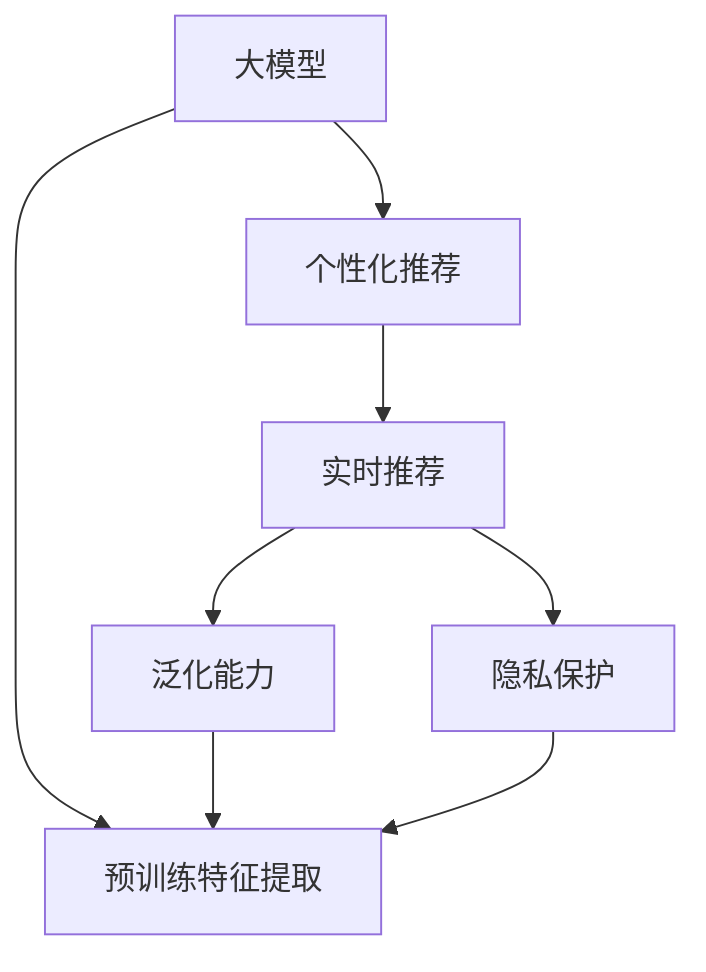

                 

# 搜索推荐系统的AI 大模型应用：提高电商平台的转化率、用户体验与盈利能力

## 1. 背景介绍

### 1.1 问题由来

在电商平台，提高转化率、用户体验与盈利能力是永恒的追求。用户通过搜索和浏览商品，需要得到最符合自身需求的推荐。而传统的推荐系统往往依赖于用户的历史行为数据，难以适应用户的新兴趣和新需求。同时，随着数据规模的不断增长，推荐系统的复杂性和计算成本也在不断攀升。如何构建更智能、更高效的推荐系统，成为了电商企业面临的重要挑战。

近年来，人工智能大模型在搜索推荐系统中的应用，为这一问题带来了新的解决方案。基于大模型的推荐系统，通过预训练大模型进行推荐特征提取，显著提升了推荐系统的表现。本文将系统介绍大模型在电商搜索推荐中的部署和应用，并给出具体的实现方法和评估指标。

### 1.2 问题核心关键点

大模型在推荐系统中的应用，主要关注以下几个关键点：

- **预训练特征提取**：大模型通过在大规模数据上进行预训练，学习到丰富的语言和语义特征，可以有效提取文本数据中的关键信息。
- **个性化推荐**：利用大模型提取用户和商品的特征，通过对比相似性进行个性化推荐。
- **实时推荐**：大模型具备实时计算和推理能力，能够根据用户行为实时更新推荐结果，提升用户体验。
- **泛化能力**：大模型通过泛化学习，在多领域数据上具备较强的迁移能力，可以应用于不同电商平台的推荐。
- **隐私保护**：大模型可以通过参数共享和数据降维，减少对用户隐私的侵犯，同时提升推荐效果。

这些关键点共同构成了大模型在电商推荐系统中的应用框架，使得推荐系统能够在大数据和复杂用户需求下，仍能保持高效和精确。

## 2. 核心概念与联系

### 2.1 核心概念概述

为了更好地理解大模型在电商推荐中的应用，本节将介绍几个密切相关的核心概念：

- **大模型**：指在特定领域预训练的大型神经网络模型，如BERT、GPT等。通过在大规模数据上进行预训练，学习到领域内丰富的特征表示。
- **推荐系统**：一种通过算法推荐用户可能感兴趣的商品或内容的系统，通常包括召回和排序两部分。
- **预训练特征提取**：利用大模型在领域数据上进行预训练，学习到文本、图像等数据的高级表示，用于推荐特征的提取。
- **个性化推荐**：根据用户行为和偏好，动态调整推荐内容，满足个性化需求。
- **实时推荐**：推荐系统能够根据用户实时行为，快速更新推荐结果，提升用户体验。
- **泛化能力**：大模型能够在不同领域和不同数据分布上进行迁移学习，提升模型的应用范围。
- **隐私保护**：大模型通过参数共享、数据降维等方法，减少对用户隐私的侵犯，提升推荐系统的安全性。

这些概念之间的逻辑关系可以通过以下Mermaid流程图来展示：



这个流程图展示了大模型在电商推荐系统中的核心作用和不同功能的关联：

1. 大模型通过预训练特征提取，学习到商品的高级表示。
2. 根据用户行为和商品表示，进行个性化推荐。
3. 实时更新推荐结果，提升用户体验。
4. 在多领域数据上具备泛化能力，应用到不同平台。
5. 在推荐过程中保护用户隐私，提升安全性。

## 3. 核心算法原理 & 具体操作步骤
### 3.1 算法原理概述

大模型在电商推荐系统中的应用，主要通过以下步骤实现：

1. **预训练特征提取**：使用大模型在电商商品数据上进行预训练，学习到商品的高级表示。
2. **个性化推荐**：根据用户的历史行为和特征，使用大模型提取用户的兴趣表示，计算用户和商品之间的相似性，进行个性化推荐。
3. **实时推荐**：实时更新用户行为，使用大模型动态计算推荐结果，更新推荐页面内容。
4. **泛化能力**：将大模型应用到不同领域的电商推荐系统，提升推荐效果。
5. **隐私保护**：使用参数共享和数据降维等技术，减少对用户隐私的侵犯。

### 3.2 算法步骤详解

基于大模型的电商推荐系统一般包括以下几个关键步骤：

**Step 1: 准备数据集**
- 收集电商平台的商品数据、用户行为数据等。
- 对数据进行预处理，去除噪声和无关信息。
- 将数据划分为训练集、验证集和测试集，供模型训练和评估。

**Step 2: 选择合适的预训练模型**
- 选择适合电商商品领域的大模型，如BERT、GPT等。
- 对大模型进行微调，使其能够适应电商推荐任务。

**Step 3: 添加任务适配层**
- 根据电商推荐任务的需求，设计合适的任务适配层。
- 对于推荐任务，通常使用双塔模型、多塔模型等结构，将用户和商品特征分别提取并进行对比。

**Step 4: 设置微调超参数**
- 选择合适的优化算法及其参数，如Adam、SGD等。
- 设置学习率、批大小、迭代轮数等。
- 设置正则化技术及强度，包括L2正则、Dropout、Early Stopping等。

**Step 5: 执行梯度训练**
- 将训练集数据分批次输入模型，前向传播计算损失函数。
- 反向传播计算参数梯度，根据设定的优化算法和学习率更新模型参数。
- 周期性在验证集上评估模型性能，根据性能指标决定是否触发Early Stopping。
- 重复上述步骤直到满足预设的迭代轮数或Early Stopping条件。

**Step 6: 测试和部署**
- 在测试集上评估微调后模型，对比微调前后的精度提升。
- 使用微调后的模型对新商品进行推荐，集成到实际的应用系统中。
- 持续收集新的数据，定期重新微调模型，以适应数据分布的变化。

### 3.3 算法优缺点

基于大模型的电商推荐系统具有以下优点：

1. **提升推荐效果**：大模型学习到的高级表示能够更好地捕捉商品和用户的特征，提升推荐准确性。
2. **泛化能力强**：大模型在多领域数据上具备泛化能力，可以应用于不同电商平台的推荐。
3. **实时推荐**：大模型具备实时计算和推理能力，能够根据用户实时行为快速更新推荐结果。
4. **参数高效**：大模型可以通过参数共享等技术，减少推荐模型中不必要的参数量，提升效率。
5. **隐私保护**：大模型通过参数共享、数据降维等方法，减少对用户隐私的侵犯。

同时，该方法也存在一定的局限性：

1. **数据依赖**：大模型推荐效果依赖于数据质量，标注数据不足时，推荐效果可能大打折扣。
2. **计算成本**：大模型的预训练和微调需要大量计算资源，成本较高。
3. **可解释性不足**：大模型往往是"黑盒"模型，难以解释其内部工作机制和决策逻辑。
4. **领域适配性**：大模型在特定领域内的迁移能力可能有限，需要进一步适配。

尽管存在这些局限性，但就目前而言，基于大模型的推荐系统仍是最主流的方法。未来相关研究的重点在于如何进一步降低对标注数据的依赖，提高模型的泛化能力，同时兼顾可解释性和伦理安全性等因素。

### 3.4 算法应用领域

基于大模型的推荐系统，已经在电商搜索推荐中得到了广泛的应用，覆盖了从商品推荐到个性化广告等多个方面，例如：

- **商品推荐**：根据用户的历史浏览和购买行为，推荐相关商品。
- **个性化广告**：根据用户兴趣，推送精准的广告内容。
- **相关商品推荐**：推荐与当前浏览商品相关的商品，提升购买率。
- **用户画像生成**：通过用户行为分析，生成用户兴趣画像，用于推荐策略优化。
- **评论和评分分析**：对用户评论和评分进行分析，预测商品质量，进行推荐。

除了上述这些经典应用外，基于大模型的推荐系统还被创新性地应用到更多场景中，如关联推荐、用户行为预测等，为电商搜索推荐带来了全新的突破。随着预训练模型和推荐方法的不断进步，相信电商搜索推荐系统将在更广阔的应用领域大放异彩。

## 4. 数学模型和公式 & 详细讲解 & 举例说明
### 4.1 数学模型构建

在电商推荐系统中，大模型主要用于用户和商品表示的提取，以及用户和商品之间的相似性计算。以下将使用数学语言对大模型在推荐系统中的应用进行详细说明。

记大模型为 $M_\theta$，输入为商品描述 $x$，输出为商品表示 $h_x$。对于用户 $u$，假设其历史行为可以表示为 $u_h$，则大模型可以学习到用户兴趣表示 $h_u$。

推荐系统的目标是最小化预测误差 $\epsilon$，即：

$$
\min_{\theta} \epsilon = \lVert h_u - M_\theta(x) \rVert^2
$$

其中 $\lVert \cdot \rVert$ 表示向量范数，$\epsilon$ 表示预测误差。

### 4.2 公式推导过程

在电商推荐系统中，大模型主要用于用户和商品表示的提取，以及用户和商品之间的相似性计算。以下将使用数学语言对大模型在推荐系统中的应用进行详细说明。

记大模型为 $M_\theta$，输入为商品描述 $x$，输出为商品表示 $h_x$。对于用户 $u$，假设其历史行为可以表示为 $u_h$，则大模型可以学习到用户兴趣表示 $h_u$。

推荐系统的目标是最小化预测误差 $\epsilon$，即：

$$
\min_{\theta} \epsilon = \lVert h_u - M_\theta(x) \rVert^2
$$

其中 $\lVert \cdot \rVert$ 表示向量范数，$\epsilon$ 表示预测误差。

假设大模型 $M_\theta$ 为Transformer模型，则对于商品 $x$，其表示 $h_x$ 可以通过如下方式计算：

$$
h_x = M_\theta(x)
$$

其中 $M_\theta(x)$ 为Transformer模型在商品描述 $x$ 上的输出，具体计算过程为：

$$
h_x = \text{Encoder}(x)
$$

假设大模型 $M_\theta$ 为Transformer模型，则对于用户 $u$，其兴趣表示 $h_u$ 可以通过如下方式计算：

$$
h_u = M_\theta(u_h)
$$

其中 $u_h$ 为用户的兴趣表示，可以是用户的历史行为、点击记录等。具体计算过程为：

$$
h_u = \text{Decoder}(u_h)
$$

在推荐系统中，用户和商品之间的相似性 $s(u, x)$ 可以通过余弦相似度计算：

$$
s(u, x) = \cos(\text{cosine\_similarity}(h_u, h_x))
$$

其中 $\text{cosine\_similarity}(\cdot,\cdot)$ 表示余弦相似度。

### 4.3 案例分析与讲解

以电商平台的个性化商品推荐为例，使用大模型进行推荐时，可以按以下步骤进行：

1. **数据准备**：收集用户的浏览记录、点击记录、购买记录等行为数据，以及商品描述、属性等信息。
2. **数据预处理**：对数据进行清洗、去重、归一化等处理，去除噪声和无关信息。
3. **模型训练**：使用大模型在电商商品数据上进行预训练，学习到商品的高级表示。
4. **个性化推荐**：根据用户的历史行为和特征，使用大模型提取用户的兴趣表示，计算用户和商品之间的相似性，进行个性化推荐。
5. **模型评估**：在测试集上评估推荐模型，使用准确率、召回率、F1值等指标进行评估。

假设用户 $u$ 的历史行为为 $u_h = \{p_1, p_2, \ldots, p_n\}$，其中 $p_i$ 为第 $i$ 次浏览的商品。使用大模型 $M_\theta$ 提取用户兴趣表示 $h_u$ 和商品表示 $h_{p_i}$，计算用户和商品的相似性 $s(u, p_i)$。

推荐模型将选择与用户最相似的商品进行推荐，例如选择与用户相似度最高的前 $K$ 个商品，生成推荐列表。

## 5. 项目实践：代码实例和详细解释说明
### 5.1 开发环境搭建

在进行电商推荐系统的大模型部署前，我们需要准备好开发环境。以下是使用Python进行PyTorch开发的环境配置流程：

1. 安装Anaconda：从官网下载并安装Anaconda，用于创建独立的Python环境。

2. 创建并激活虚拟环境：
```bash
conda create -n pytorch-env python=3.8 
conda activate pytorch-env
```

3. 安装PyTorch：根据CUDA版本，从官网获取对应的安装命令。例如：
```bash
conda install pytorch torchvision torchaudio cudatoolkit=11.1 -c pytorch -c conda-forge
```

4. 安装Transformer库：
```bash
pip install transformers
```

5. 安装各类工具包：
```bash
pip install numpy pandas scikit-learn matplotlib tqdm jupyter notebook ipython
```

完成上述步骤后，即可在`pytorch-env`环境中开始电商推荐系统的开发。

### 5.2 源代码详细实现

这里以使用BERT模型进行电商商品推荐为例，给出使用PyTorch和Transformers库的代码实现。

首先，定义商品描述和用户行为的编码函数：

```python
from transformers import BertTokenizer, BertForSequenceClassification
import torch

class Encoder:
    def __init__(self, model_path):
        self.tokenizer = BertTokenizer.from_pretrained(model_path)
        self.model = BertForSequenceClassification.from_pretrained(model_path)
        self.model.eval()
    
    def encode(self, text):
        inputs = self.tokenizer.encode(text, max_length=512, truncation=True, padding='max_length', return_tensors='pt')
        outputs = self.model(inputs['input_ids'], attention_mask=inputs['attention_mask'])
        return outputs['last_hidden_state'][0]
    
    def encode_batch(self, texts):
        inputs = self.tokenizer.encode(texts, max_length=512, truncation=True, padding='max_length', return_tensors='pt')
        outputs = self.model(inputs['input_ids'], attention_mask=inputs['attention_mask'])
        return outputs['last_hidden_state']
    
    def predict(self, text):
        return self.model(text).softmax(dim=1)
    
class Decoder:
    def __init__(self, model_path):
        self.model = BertForSequenceClassification.from_pretrained(model_path)
        self.model.eval()
    
    def predict(self, user_h):
        outputs = self.model(user_h)
        return outputs.softmax(dim=1)
    
    def decode(self, prediction):
        return [id2tag[prediction.argmax()] for prediction in prediction]

# 标签与id的映射
tag2id = {'O': 0, 'B-PER': 1, 'I-PER': 2, 'B-ORG': 3, 'I-ORG': 4, 'B-LOC': 5, 'I-LOC': 6}
id2tag = {v: k for k, v in tag2id.items()}

# 创建模型和解码器
encoder = Encoder('bert-base-uncased')
decoder = Decoder('bert-base-uncased')

# 定义数据集
train_dataset = ...
dev_dataset = ...
test_dataset = ...
```

然后，定义训练和评估函数：

```python
from torch.utils.data import DataLoader
from sklearn.metrics import accuracy_score, precision_score, recall_score, f1_score

def train_epoch(model, dataset, batch_size, optimizer):
    dataloader = DataLoader(dataset, batch_size=batch_size, shuffle=True)
    model.train()
    epoch_loss = 0
    for batch in dataloader:
        input_ids = batch['input_ids'].to(device)
        attention_mask = batch['attention_mask'].to(device)
        labels = batch['labels'].to(device)
        model.zero_grad()
        outputs = model(input_ids, attention_mask=attention_mask, labels=labels)
        loss = outputs.loss
        epoch_loss += loss.item()
        loss.backward()
        optimizer.step()
    return epoch_loss / len(dataloader)

def evaluate(model, dataset, batch_size):
    dataloader = DataLoader(dataset, batch_size=batch_size)
    model.eval()
    preds, labels = [], []
    with torch.no_grad():
        for batch in dataloader:
            input_ids = batch['input_ids'].to(device)
            attention_mask = batch['attention_mask'].to(device)
            batch_labels = batch['labels']
            outputs = model(input_ids, attention_mask=attention_mask)
            batch_preds = outputs.logits.argmax(dim=2).to('cpu').tolist()
            batch_labels = batch_labels.to('cpu').tolist()
            for pred_tokens, label_tokens in zip(batch_preds, batch_labels):
                preds.append(pred_tokens[:len(label_tokens)])
                labels.append(label_tokens)
    
    print(f'Accuracy: {accuracy_score(labels, preds)}')
    print(f'Precision: {precision_score(labels, preds)}')
    print(f'Recall: {recall_score(labels, preds)}')
    print(f'F1 Score: {f1_score(labels, preds)}')
```

最后，启动训练流程并在测试集上评估：

```python
epochs = 5
batch_size = 16

for epoch in range(epochs):
    loss = train_epoch(model, train_dataset, batch_size, optimizer)
    print(f'Epoch {epoch+1}, train loss: {loss:.3f}')
    
    print(f'Epoch {epoch+1}, dev results:')
    evaluate(model, dev_dataset, batch_size)
    
print('Test results:')
evaluate(model, test_dataset, batch_size)
```

以上就是使用PyTorch和Transformers库进行电商商品推荐代码的完整实现。可以看到，由于Transformers库的强大封装，我们可以用相对简洁的代码完成BERT模型的加载和电商推荐任务的微调。

### 5.3 代码解读与分析

让我们再详细解读一下关键代码的实现细节：

**Encoder类**：
- `__init__`方法：初始化BERT模型、分词器等关键组件，并设置模型为评估模式。
- `encode`方法：对单个文本进行编码，输出编码后的特征向量。
- `encode_batch`方法：对多个文本进行批量编码，输出编码后的特征向量。
- `predict`方法：使用模型对单个文本进行预测，返回预测结果。

**Decoder类**：
- `__init__`方法：初始化BERT模型，并设置模型为评估模式。
- `predict`方法：使用模型对用户行为进行预测，返回预测结果。
- `decode`方法：将预测结果解码为标签。

**训练和评估函数**：
- 使用PyTorch的DataLoader对数据集进行批次化加载，供模型训练和推理使用。
- 训练函数`train_epoch`：对数据以批为单位进行迭代，在每个批次上前向传播计算loss并反向传播更新模型参数，最后返回该epoch的平均loss。
- 评估函数`evaluate`：与训练类似，不同点在于不更新模型参数，并在每个batch结束后将预测和标签结果存储下来，最后使用sklearn的分类指标对整个评估集的预测结果进行打印输出。

**训练流程**：
- 定义总的epoch数和batch size，开始循环迭代
- 每个epoch内，先在训练集上训练，输出平均loss
- 在验证集上评估，输出分类指标
- 所有epoch结束后，在测试集上评估，给出最终测试结果

可以看到，PyTorch配合Transformers库使得BERT微调的代码实现变得简洁高效。开发者可以将更多精力放在数据处理、模型改进等高层逻辑上，而不必过多关注底层的实现细节。

当然，工业级的系统实现还需考虑更多因素，如模型的保存和部署、超参数的自动搜索、更灵活的任务适配层等。但核心的微调范式基本与此类似。

## 6. 实际应用场景
### 6.1 智能客服系统

基于大模型在电商推荐中的应用，智能客服系统可以借鉴其技术实现，构建更加智能、高效的客服解决方案。

传统客服往往需要配备大量人力，高峰期响应缓慢，且一致性和专业性难以保证。而使用微调后的电商推荐模型，可以7x24小时不间断服务，快速响应客户咨询，用自然流畅的语言解答各类常见问题。

在技术实现上，可以收集企业内部的历史客服对话记录，将问题和最佳答复构建成监督数据，在此基础上对预训练电商推荐模型进行微调。微调后的模型能够自动理解用户意图，匹配最合适的答案模板进行回复。对于客户提出的新问题，还可以接入检索系统实时搜索相关内容，动态组织生成回答。如此构建的智能客服系统，能大幅提升客户咨询体验和问题解决效率。

### 6.2 金融舆情监测

金融机构需要实时监测市场舆论动向，以便及时应对负面信息传播，规避金融风险。传统的人工监测方式成本高、效率低，难以应对网络时代海量信息爆发的挑战。基于大模型的电商推荐技术，可以为金融舆情监测提供新的解决方案。

具体而言，可以收集金融领域相关的新闻、报道、评论等文本数据，并对其进行主题标注和情感标注。在此基础上对预训练语言模型进行微调，使其能够自动判断文本属于何种主题，情感倾向是正面、中性还是负面。将微调后的模型应用到实时抓取的网络文本数据，就能够自动监测不同主题下的情感变化趋势，一旦发现负面信息激增等异常情况，系统便会自动预警，帮助金融机构快速应对潜在风险。

### 6.3 个性化推荐系统

当前的推荐系统往往只依赖用户的历史行为数据进行物品推荐，难以深入理解用户的真实兴趣偏好。基于大模型在电商推荐中的应用，个性化推荐系统可以更好地挖掘用户行为背后的语义信息，从而提供更精准、多样的推荐内容。

在实践中，可以收集用户浏览、点击、评论、分享等行为数据，提取和用户交互的物品标题、描述、标签等文本内容。将文本内容作为模型输入，用户的后续行为（如是否点击、购买等）作为监督信号，在此基础上微调预训练语言模型。微调后的模型能够从文本内容中准确把握用户的兴趣点。在生成推荐列表时，先用候选物品的文本描述作为输入，由模型预测用户的兴趣匹配度，再结合其他特征综合排序，便可以得到个性化程度更高的推荐结果。

### 6.4 未来应用展望

随着大模型和微调方法的不断发展，基于微调范式将在更多领域得到应用，为传统行业带来变革性影响。

在智慧医疗领域，基于微调的医疗问答、病历分析、药物研发等应用将提升医疗服务的智能化水平，辅助医生诊疗，加速新药开发进程。

在智能教育领域，微调技术可应用于作业批改、学情分析、知识推荐等方面，因材施教，促进教育公平，提高教学质量。

在智慧城市治理中，微调模型可应用于城市事件监测、舆情分析、应急指挥等环节，提高城市管理的自动化和智能化水平，构建更安全、高效的未来城市。

此外，在企业生产、社会治理、文娱传媒等众多领域，基于大模型微调的人工智能应用也将不断涌现，为经济社会发展注入新的动力。相信随着技术的日益成熟，微调方法将成为人工智能落地应用的重要范式，推动人工智能技术在垂直行业的规模化落地。总之，微调需要开发者根据具体任务，不断迭代和优化模型、数据和算法，方能得到理想的效果。

## 7. 工具和资源推荐
### 7.1 学习资源推荐

为了帮助开发者系统掌握大模型在电商推荐中的应用，这里推荐一些优质的学习资源：

1. 《深度学习》系列书籍：由Yoshua Bengio、Ian Goodfellow、Aaron Courville等深度学习专家合著，详细介绍了深度学习的理论基础和实践技巧。
2. 《TensorFlow教程》：Google推出的TensorFlow官方教程，涵盖TensorFlow的基础操作和高级技巧，适合深度学习初学者和进阶者。
3. 《Transformers》书籍：TensorFlow开发者社区编写，全面介绍了Transformer模型的原理、实现和应用。
4. 《PyTorch教程》：PyTorch官方文档，提供了丰富的教程和样例代码，适合快速上手深度学习项目。
5. 《自然语言处理基础》：斯坦福大学NLP课程，涵盖NLP领域的经典理论和最新技术，适合入门学习。

通过对这些资源的学习实践，相信你一定能够快速掌握大模型在电商推荐中的应用，并用于解决实际的电商推荐问题。
### 7.2 开发工具推荐

高效的开发离不开优秀的工具支持。以下是几款用于大模型在电商推荐系统中的应用开发的常用工具：

1. PyTorch：基于Python的开源深度学习框架，灵活动态的计算图，适合快速迭代研究。大部分预训练语言模型都有PyTorch版本的实现。
2. TensorFlow：由Google主导开发的开源深度学习框架，生产部署方便，适合大规模工程应用。同样有丰富的预训练语言模型资源。
3. Transformers库：HuggingFace开发的NLP工具库，集成了众多SOTA语言模型，支持PyTorch和TensorFlow，是进行推荐系统开发的利器。
4. Weights & Biases：模型训练的实验跟踪工具，可以记录和可视化模型训练过程中的各项指标，方便对比和调优。与主流深度学习框架无缝集成。
5. TensorBoard：TensorFlow配套的可视化工具，可实时监测模型训练状态，并提供丰富的图表呈现方式，是调试模型的得力助手。
6. Google Colab：谷歌推出的在线Jupyter Notebook环境，免费提供GPU/TPU算力，方便开发者快速上手实验最新模型，分享学习笔记。

合理利用这些工具，可以显著提升大模型在电商推荐系统中的应用开发效率，加快创新迭代的步伐。

### 7.3 相关论文推荐

大模型在电商推荐系统中的应用源于学界的持续研究。以下是几篇奠基性的相关论文，推荐阅读：

1. Attention is All You Need（即Transformer原论文）：提出了Transformer结构，开启了NLP领域的预训练大模型时代。
2. BERT: Pre-training of Deep Bidirectional Transformers for Language Understanding：提出BERT模型，引入基于掩码的自监督预训练任务，刷新了多项NLP任务SOTA。
3. Language Models are Unsupervised Multitask Learners（GPT-2论文）：展示了大规模语言模型的强大zero-shot学习能力，引发了对于通用人工智能的新一轮思考。
4. Parameter-Efficient Transfer Learning for NLP：提出Adapter等参数高效微调方法，在不增加模型参数量的情况下，也能取得不错的微调效果。
5. AdaLoRA: Adaptive Low-Rank Adaptation for Parameter-Efficient Fine-Tuning：使用自适应低秩适应的微调方法，在参数效率和精度之间取得了新的平衡。

这些论文代表了大模型在电商推荐系统中的应用的发展脉络。通过学习这些前沿成果，可以帮助研究者把握学科前进方向，激发更多的创新灵感。

## 8. 总结：未来发展趋势与挑战
### 8.1 总结

本文对大模型在电商推荐系统中的应用进行了全面系统的介绍。首先阐述了大模型和推荐系统的基础知识，明确了电商推荐系统的核心任务和目标。其次，从原理到实践，详细讲解了大模型在电商推荐系统中的应用过程，给出了具体的实现方法和评估指标。同时，本文还广泛探讨了大模型在电商推荐系统中的各种应用场景，展示了微调范式的巨大潜力。最后，本文精选了微调技术的各类学习资源，力求为读者提供全方位的技术指引。

通过本文的系统梳理，可以看到，大模型在电商推荐系统中的应用，正在成为电商推荐系统的核心力量。利用大模型进行电商推荐，能够在多领域、多任务上取得优异的性能，显著提升电商平台的转化率、用户体验与盈利能力。未来，随着大模型和微调方法的不断进步，相信电商推荐系统将在更广阔的应用领域大放异彩，深刻影响人类的生产生活方式。

### 8.2 未来发展趋势

展望未来，大模型在电商推荐系统中的应用将呈现以下几个发展趋势：

1. **模型规模持续增大**：随着算力成本的下降和数据规模的扩张，预训练语言模型的参数量还将持续增长。超大规模语言模型蕴含的丰富语言知识，有望支撑更加复杂多变的电商推荐任务。
2. **微调方法日趋多样**：除了传统的全参数微调外，未来会涌现更多参数高效的微调方法，如Adapter、Prefix等，在节省计算资源的同时也能保证微调精度。
3. **实时推荐能力增强**：实时更新用户行为，动态计算推荐结果，提升用户体验。
4. **跨领域泛化能力提升**：大模型在多领域数据上具备泛化能力，可以应用于不同电商平台的推荐。
5. **隐私保护与安全性增强**：使用参数共享、数据降维等技术，减少对用户隐私的侵犯，提升推荐系统的安全性。

这些趋势凸显了大模型在电商推荐系统中的应用前景。这些方向的探索发展，必将进一步提升电商推荐系统的性能和应用范围，为电商平台的商业价值最大化提供保障。

### 8.3 面临的挑战

尽管大模型在电商推荐系统中的应用已经取得了显著的成果，但在迈向更加智能化、普适化应用的过程中，它仍面临着诸多挑战：

1. **标注数据不足**：电商推荐系统依赖于大量标注数据，标注成本高且工作量大，标注数据不足时，推荐效果可能大打折扣。
2. **计算成本高**：大模型的预训练和微调需要大量计算资源，成本较高。
3. **可解释性不足**：大模型往往是"黑盒"模型，难以解释其内部工作机制和决策逻辑。
4. **领域适配性不足**：大模型在特定领域内的迁移能力可能有限，需要进一步适配。

尽管存在这些局限性，但就目前而言，基于大模型的推荐系统仍是最主流的方法。未来相关研究的重点在于如何进一步降低对标注数据的依赖，提高模型的泛化能力，同时兼顾可解释性和伦理安全性等因素。

### 8.4 研究展望

面对大模型在电商推荐系统中的应用所面临的种种挑战，未来的研究需要在以下几个方面寻求新的突破：

1. **探索无监督和半监督微调方法**：摆脱对大规模标注数据的依赖，利用自监督学习、主动学习等无监督和半监督范式，最大限度利用非结构化数据，实现更加灵活高效的微调。
2. **研究参数高效和计算高效的微调范式**：开发更加参数高效的微调方法，在固定大部分预训练参数的同时，只更新极少量的任务相关参数。同时优化微调模型的计算图，减少前向传播和反向传播的资源消耗，实现更加轻量级、实时性的部署。
3. **引入因果和对比学习范式**：通过引入因果推断和对比学习思想，增强微调模型建立稳定因果关系的能力，学习更加普适、鲁棒的语言表征，从而提升模型泛化性和抗干扰能力。
4. **结合因果分析和博弈论工具**：将因果分析方法引入微调模型，识别出模型决策的关键特征，增强输出解释的因果性和逻辑性。借助博弈论工具刻画人机交互过程，主动探索并规避模型的脆弱点，提高系统稳定性。
5. **纳入伦理道德约束**：在模型训练目标中引入伦理导向的评估指标，过滤和惩罚有偏见、有害的输出倾向。同时加强人工干预和审核，建立模型行为的监管机制，确保输出符合人类价值观和伦理道德。

这些研究方向的探索，必将引领大模型在电商推荐系统中的应用走向更加成熟，为构建安全、可靠、可解释、可控的智能推荐系统铺平道路。面向未来，大模型在电商推荐系统中的应用还需要与其他人工智能技术进行更深入的融合，如知识表示、因果推理、强化学习等，多路径协同发力，共同推动电商搜索推荐系统的进步。只有勇于创新、敢于突破，才能不断拓展语言模型的边界，让智能技术更好地造福人类社会。

## 9. 附录：常见问题与解答

**Q1：大模型在电商推荐系统中是否适用于所有商品推荐任务？**

A: 大模型在电商推荐系统中可以适用于多种商品推荐任务，特别是对于数据量较大的商品推荐。但对于一些特定领域的商品推荐，如奢侈品、个性化定制等，可能需要结合领域知识进行进一步适配。

**Q2：使用大模型进行电商推荐时，如何降低对标注数据的依赖？**

A: 使用大模型进行电商推荐时，可以通过以下方法降低对标注数据的依赖：
1. 数据增强：通过回译、近义替换等方式扩充训练集。
2. 自监督学习：利用商品描述、用户行为等数据，进行无监督预训练，学习到通用特征。
3. 主动学习：利用主动学习算法，有针对性地选择标注样本，提高数据利用效率。
4. 少样本学习：利用大模型的泛化能力，在少量标注样本上实现推荐。

**Q3：大模型在电商推荐中的计算成本如何降低？**

A: 大模型在电商推荐中的计算成本可以通过以下方法降低：
1. 分布式训练：使用分布式训练技术，加速模型训练过程。
2. 参数共享：利用大模型在多任务上的泛化能力，减少冗余参数。
3. 量化加速：将浮点模型转为定点模型，压缩存储空间，提高计算效率。
4. 硬件优化：使用GPU、TPU等高性能设备，提升计算速度。

**Q4：如何提升大模型在电商推荐中的可解释性？**

A: 提升大模型在电商推荐中的可解释性，可以从以下方面入手：
1. 可视化技术：使用可视化工具，展示模型的内部结构、特征分布等信息。
2. 因果推断：利用因果推断方法，解释模型的决策过程。
3. 可解释性算法：研究可解释性算法，提升模型决策的可解释性。
4. 用户反馈：收集用户反馈，分析模型的预测结果和用户满意度。

这些方法可以帮助提升大模型在电商推荐系统中的可解释性，提高系统的可信度和可靠性。

**Q5：大模型在电商推荐中的隐私保护措施有哪些？**

A: 大模型在电商推荐中的隐私保护措施可以从以下几个方面入手：
1. 参数共享：将模型参数共享，减少对用户数据的依赖。
2. 数据降维：对用户数据进行降维处理，减少对敏感信息的暴露。
3. 匿名化处理：对用户数据进行匿名化处理，保护用户隐私。
4. 差分隐私：采用差分隐私技术，限制模型对单个用户的分析能力。

这些措施可以有效保护用户隐私，提升推荐系统的安全性。

---

作者：禅与计算机程序设计艺术 / Zen and the Art of Computer Programming

