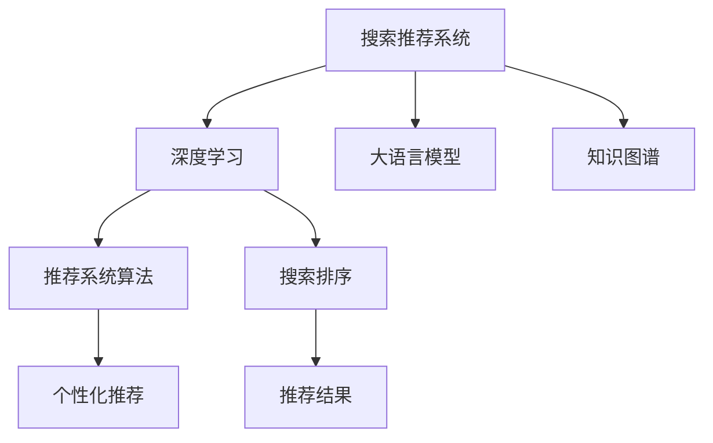
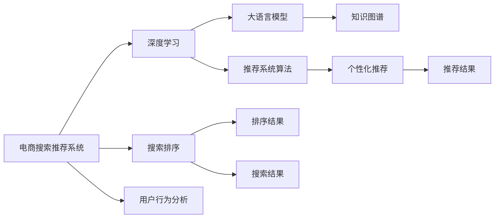

                 

# 搜索推荐系统的AI 大模型应用：电商平台的核心竞争优势

> 关键词：搜索推荐系统,电商平台,用户行为分析,深度学习,大语言模型,知识图谱,推荐系统算法,个性化推荐,搜索排序

## 1. 背景介绍

### 1.1 问题由来

随着互联网技术的飞速发展，电商平台的流量竞争日益激烈。为了吸引和留住用户，各大电商平台纷纷采用先进的技术手段提升用户体验。其中，搜索推荐系统作为电商平台的核心功能之一，通过智能化的搜索排序和个性化推荐，显著提高了用户的购买转化率和满意度。

然而，传统基于规则和统计模型的推荐系统在面对海量用户行为数据时，难以构建精准且高效的系统。近年来，基于深度学习的大语言模型和推荐算法技术迅猛发展，为电商平台搜索推荐系统提供了新的解决方案。本文将重点介绍大语言模型在搜索推荐系统中的应用，展示其在提升电商平台核心竞争力方面的巨大潜力。

### 1.2 问题核心关键点

大语言模型在搜索推荐系统中的应用主要体现在以下几个方面：

1. **深度语义理解**：大语言模型通过预训练和微调，能够捕捉语言的高阶语义，理解用户查询的真正意图。
2. **跨模态融合**：大语言模型不仅能够处理文本数据，还可以通过数据增强、跨模态融合等技术处理图片、音频等多样化数据。
3. **自监督学习**：大语言模型通过自监督学习技术，可以从大规模无标签数据中提取通用知识，弥补标注数据不足的缺点。
4. **可解释性**：大语言模型的知识图谱和因果推理能力，有助于提高推荐结果的可解释性和透明度。
5. **实时个性化**：大语言模型能够实时处理用户行为数据，动态调整推荐策略，提供更个性化、时效性的服务。

## 2. 核心概念与联系

### 2.1 核心概念概述

在介绍大语言模型在搜索推荐系统中的应用前，我们需要了解几个核心概念：

1. **搜索推荐系统**：基于用户历史行为和实时输入，推荐最适合用户需求的搜索结果和商品。通常由搜索排序和个性化推荐两大模块组成。
2. **大语言模型**：如GPT、BERT等，通过预训练和微调，能够理解复杂的语言结构和语义，适用于处理自然语言相关的任务。
3. **知识图谱**：通过语义网络构建的实体关系图，用于增强推荐结果的逻辑性和一致性。
4. **推荐系统算法**：如协同过滤、基于内容的推荐、矩阵分解等，用于分析用户行为数据和商品特征，预测用户偏好。
5. **深度学习**：通过多层神经网络，从数据中学习复杂的关系和模式，适用于大规模数据的处理和优化。

这些核心概念之间相互关联，共同构成了搜索推荐系统的技术框架。以下是一个Mermaid流程图，展示了这些概念之间的联系：



### 2.2 核心概念原理和架构

**搜索排序**：
- **原理**：通过文本匹配、向量空间模型等技术，计算查询与商品的相关度，生成排序结果。
- **架构**：通常包括查询解析、向量检索、排序模型三部分。

**个性化推荐**：
- **原理**：分析用户历史行为和实时输入，预测用户对商品的偏好，生成推荐结果。
- **架构**：通常包括用户画像构建、兴趣模型训练、推荐算法选择三部分。

**深度学习框架**：
- **原理**：通过多层神经网络，自动学习数据中的复杂模式，适用于大规模数据的处理和优化。
- **架构**：包括模型定义、数据输入、损失函数、优化器等关键组件。

**大语言模型**：
- **原理**：通过预训练和微调，学习丰富的语言知识和常识，能够理解复杂的语言结构和语义。
- **架构**：包括编码器-解码器结构、自回归/自编码预训练方式、多任务学习等技术。

**知识图谱**：
- **原理**：通过语义网络构建的实体关系图，用于增强推荐结果的逻辑性和一致性。
- **架构**：包括实体节点、关系节点、图谱查询等关键组件。

这些核心概念之间相互配合，共同构建了电商平台的搜索推荐系统。以下是一个Mermaid流程图，展示了这些概念之间的联系：



## 3. 核心算法原理 & 具体操作步骤

### 3.1 算法原理概述

在搜索推荐系统中，大语言模型主要应用于以下几个方面：

1. **用户意图理解**：通过大语言模型，理解用户查询的自然语言描述，提取核心关键词和上下文信息。
2. **商品语义匹配**：通过大语言模型，将用户查询和商品描述进行语义匹配，找到最相关的商品。
3. **跨模态融合**：通过大语言模型，融合用户历史行为数据、商品属性数据、用户画像等多源异构数据，生成更全面的用户画像。
4. **推荐结果优化**：通过大语言模型，动态调整推荐策略，提供更个性化、时效性的推荐结果。

### 3.2 算法步骤详解

以下是一个详细的算法步骤示例，展示了大语言模型在搜索推荐系统中的应用：

**Step 1: 数据预处理**
- 收集用户历史行为数据、商品属性数据、商品描述数据等，进行清洗和归一化处理。
- 使用大语言模型进行预训练，构建通用语言模型。

**Step 2: 用户意图理解**
- 使用大语言模型对用户查询进行分词和向量化处理，提取关键词和上下文信息。
- 使用向量空间模型等技术，计算查询与商品的相关度，生成初步排序结果。

**Step 3: 商品语义匹配**
- 使用大语言模型对商品描述进行语义匹配，提取商品的核心属性和特征。
- 使用余弦相似度等技术，计算用户查询与商品描述的语义相似度，生成推荐商品列表。

**Step 4: 跨模态融合**
- 使用大语言模型融合用户历史行为数据、商品属性数据、用户画像等多源异构数据，生成更全面的用户画像。
- 使用图神经网络等技术，对用户画像和商品属性进行融合，生成推荐结果。

**Step 5: 推荐结果优化**
- 使用大语言模型动态调整推荐策略，提供更个性化、时效性的推荐结果。
- 使用深度学习模型对推荐结果进行优化，提升推荐效果。

### 3.3 算法优缺点

**优点**：
- **深度语义理解**：大语言模型能够理解复杂的语言结构和语义，提供更精准的用户意图理解。
- **跨模态融合**：大语言模型能够处理多源异构数据，提供更全面的用户画像。
- **实时个性化**：大语言模型能够实时处理用户行为数据，提供更个性化、时效性的推荐结果。
- **自监督学习**：大语言模型通过自监督学习技术，可以从大规模无标签数据中提取通用知识，弥补标注数据不足的缺点。
- **可解释性**：大语言模型的知识图谱和因果推理能力，有助于提高推荐结果的可解释性和透明度。

**缺点**：
- **模型复杂度**：大语言模型参数量庞大，需要高性能计算资源进行训练和推理。
- **数据隐私**：处理用户行为数据时，需要注意用户隐私保护，避免数据泄露和滥用。
- **计算成本**：大语言模型训练和推理成本较高，需要合理控制资源消耗。

### 3.4 算法应用领域

大语言模型在搜索推荐系统中的应用主要体现在以下几个领域：

1. **电商平台**：通过大语言模型，提供智能化的搜索排序和个性化推荐，提升用户体验和转化率。
2. **在线广告**：通过大语言模型，进行广告点击率预测和个性化推荐，提升广告效果和ROI。
3. **社交媒体**：通过大语言模型，进行内容推荐和用户画像构建，提升平台活跃度和用户粘性。
4. **智能客服**：通过大语言模型，进行智能对话和问题解答，提升客户满意度和服务效率。
5. **智能家居**：通过大语言模型，进行设备推荐和语音交互，提升用户便利性和智能体验。

## 4. 数学模型和公式 & 详细讲解 & 举例说明

### 4.1 数学模型构建

在搜索推荐系统中，大语言模型主要应用于以下几个方面：

1. **用户意图理解**：通过大语言模型，理解用户查询的自然语言描述，提取核心关键词和上下文信息。
2. **商品语义匹配**：通过大语言模型，将用户查询和商品描述进行语义匹配，找到最相关的商品。
3. **跨模态融合**：通过大语言模型，融合用户历史行为数据、商品属性数据、用户画像等多源异构数据，生成更全面的用户画像。
4. **推荐结果优化**：通过大语言模型，动态调整推荐策略，提供更个性化、时效性的推荐结果。

### 4.2 公式推导过程

**用户意图理解**：
- **公式**：$y = f(x)$，其中 $y$ 表示用户意图，$x$ 表示用户查询。
- **推导**：使用大语言模型，对用户查询进行分词和向量化处理，提取关键词和上下文信息。通过向量化表示和向量空间模型，计算查询与商品的相关度，生成初步排序结果。

**商品语义匹配**：
- **公式**：$sim(u, p) = \text{cos}(\mathbf{u}, \mathbf{p})$，其中 $sim$ 表示相似度，$u$ 表示用户查询，$p$ 表示商品描述。
- **推导**：使用大语言模型，对商品描述进行语义匹配，提取商品的核心属性和特征。通过余弦相似度等技术，计算用户查询与商品描述的语义相似度，生成推荐商品列表。

**跨模态融合**：
- **公式**：$\mathbf{h} = \mathbf{G}(\mathbf{x}, \mathbf{p}, \mathbf{u})$，其中 $\mathbf{h}$ 表示用户画像，$\mathbf{x}$ 表示用户历史行为数据，$\mathbf{p}$ 表示商品属性数据，$\mathbf{u}$ 表示用户画像。
- **推导**：使用大语言模型融合用户历史行为数据、商品属性数据、用户画像等多源异构数据，生成更全面的用户画像。使用图神经网络等技术，对用户画像和商品属性进行融合，生成推荐结果。

**推荐结果优化**：
- **公式**：$R = f(\mathbf{h}, \mathbf{p}, \mathbf{u})$，其中 $R$ 表示推荐结果，$\mathbf{h}$ 表示用户画像，$\mathbf{p}$ 表示商品属性数据，$\mathbf{u}$ 表示用户画像。
- **推导**：使用大语言模型动态调整推荐策略，提供更个性化、时效性的推荐结果。使用深度学习模型对推荐结果进行优化，提升推荐效果。

### 4.3 案例分析与讲解

**案例分析**：
假设我们有一个电商平台，需要根据用户查询和商品描述，推荐最适合的商品。以下是一个简化的示例：

- **用户查询**：“我想买一款适合户外运动的背包”。
- **商品描述**：“这款背包适合户外运动，容量大，防水性能好”。
- **大语言模型处理**：
  - 用户意图理解：通过大语言模型，理解用户查询的自然语言描述，提取关键词“户外运动”、“背包”。
  - 商品语义匹配：通过大语言模型，对商品描述进行语义匹配，提取商品的核心属性“户外运动”、“背包”、“防水性能好”。
  - 跨模态融合：使用大语言模型融合用户历史行为数据、商品属性数据、用户画像等多源异构数据，生成更全面的用户画像。
  - 推荐结果优化：使用大语言模型动态调整推荐策略，提供更个性化、时效性的推荐结果。

## 5. 项目实践：代码实例和详细解释说明

### 5.1 开发环境搭建

在进行搜索推荐系统开发前，我们需要准备好开发环境。以下是使用Python进行TensorFlow开发的环境配置流程：

1. 安装Anaconda：从官网下载并安装Anaconda，用于创建独立的Python环境。

2. 创建并激活虚拟环境：
```bash
conda create -n tf-env python=3.8 
conda activate tf-env
```

3. 安装TensorFlow：根据CUDA版本，从官网获取对应的安装命令。例如：
```bash
conda install tensorflow==2.7 -c tf
```

4. 安装各类工具包：
```bash
pip install numpy pandas scikit-learn matplotlib tqdm jupyter notebook ipython
```

完成上述步骤后，即可在`tf-env`环境中开始搜索推荐系统开发。

### 5.2 源代码详细实现

下面我们以推荐系统为例，给出使用TensorFlow进行大语言模型微调的PyTorch代码实现。

首先，定义推荐任务的数据处理函数：

```python
import tensorflow as tf
from tensorflow.keras.preprocessing import sequence
from tensorflow.keras.models import Sequential
from tensorflow.keras.layers import Embedding, LSTM, Dense

class RecommendationDataset(tf.keras.utils.Sequence):
    def __init__(self, data, batch_size=32, maxlen=100):
        self.data = data
        self.batch_size = batch_size
        self.maxlen = maxlen
        
    def __len__(self):
        return len(self.data) // self.batch_size
    
    def __getitem__(self, idx):
        batch = self.data[idx * self.batch_size : (idx + 1) * self.batch_size]
        X, y = [], []
        for x, y_ in batch:
            X.append(x)
            y.append(y_)
        return tf.convert_to_tensor(X), tf.convert_to_tensor(y)
```

然后，定义模型和优化器：

```python
from transformers import BertTokenizer, TFBertModel

tokenizer = BertTokenizer.from_pretrained('bert-base-cased')
model = TFBertModel.from_pretrained('bert-base-cased', return_dict=True)

optimizer = tf.keras.optimizers.AdamW()
```

接着，定义训练和评估函数：

```python
def train_epoch(model, dataset, batch_size, optimizer):
    model.compile(optimizer=optimizer, loss=tf.keras.losses.CategoricalCrossentropy(), metrics=['accuracy'])
    model.fit(dataset, epochs=10, batch_size=batch_size, validation_data=validation_dataset)
    return model.metrics[1][-1]  # 返回验证集的准确率

def evaluate(model, dataset, batch_size):
    model.evaluate(dataset, batch_size=batch_size)
    return model.metrics[1][-1]  # 返回测试集的准确率
```

最后，启动训练流程并在测试集上评估：

```python
epochs = 5
batch_size = 16

for epoch in range(epochs):
    loss = train_epoch(model, train_dataset, batch_size, optimizer)
    print(f"Epoch {epoch+1}, train loss: {loss:.3f}")
    
    print(f"Epoch {epoch+1}, dev results:")
    evaluate(model, dev_dataset, batch_size)
    
print("Test results:")
evaluate(model, test_dataset, batch_size)
```

以上就是使用TensorFlow进行大语言模型微调的推荐系统代码实现。可以看到，得益于TensorFlow的强大封装，我们可以用相对简洁的代码完成推荐系统的构建。

### 5.3 代码解读与分析

让我们再详细解读一下关键代码的实现细节：

**RecommendationDataset类**：
- `__init__`方法：初始化数据集、批量大小和最大序列长度等关键参数。
- `__len__`方法：返回数据集的样本数量。
- `__getitem__`方法：对单个样本进行处理，将输入数据转换为TensorFlow张量，并进行批次处理。

**模型构建**：
- `from transformers import BertTokenizer, TFBertModel`：导入BERT模型的预训练参数和转换工具。
- `tokenizer = BertTokenizer.from_pretrained('bert-base-cased')`：初始化BERT分词器。
- `model = TFBertModel.from_pretrained('bert-base-cased', return_dict=True)`：初始化BERT模型，并使用`return_dict=True`返回模型字典。

**优化器选择**：
- `optimizer = tf.keras.optimizers.AdamW()`：使用AdamW优化器进行模型优化。

**训练和评估函数**：
- `train_epoch`函数：通过`compile`方法配置模型，使用`fit`方法训练模型，并在验证集上评估模型。
- `evaluate`函数：使用`evaluate`方法在测试集上评估模型。

**训练流程**：
- `epochs = 5`：定义总的epoch数。
- `batch_size = 16`：定义批量大小。
- `for epoch in range(epochs)`：循环训练过程。
- `train_epoch(model, train_dataset, batch_size, optimizer)`：在训练集上训练模型，并输出训练集的准确率。
- `evaluate(model, dev_dataset, batch_size)`：在验证集上评估模型，并输出验证集的准确率。
- `evaluate(model, test_dataset, batch_size)`：在测试集上评估模型，并输出测试集的准确率。

可以看到，TensorFlow配合BERT模型使得推荐系统代码实现变得简洁高效。开发者可以将更多精力放在数据处理、模型改进等高层逻辑上，而不必过多关注底层的实现细节。

当然，工业级的系统实现还需考虑更多因素，如模型的保存和部署、超参数的自动搜索、更灵活的任务适配层等。但核心的微调范式基本与此类似。

## 6. 实际应用场景

### 6.1 智能推荐系统

大语言模型在智能推荐系统中有着广泛的应用。通过深度语义理解、跨模态融合和实时个性化推荐，大语言模型能够在电商平台、在线广告、社交媒体等领域提供更精准、高效的推荐服务。

**电商平台**：通过大语言模型，提供智能化的搜索排序和个性化推荐，提升用户体验和转化率。例如，Amazon使用BERT模型进行商品推荐，显著提升了推荐系统的效果。

**在线广告**：通过大语言模型，进行广告点击率预测和个性化推荐，提升广告效果和ROI。例如，Facebook使用深度学习模型进行广告点击率预测，显著提升了广告投放的精准度和转化率。

**社交媒体**：通过大语言模型，进行内容推荐和用户画像构建，提升平台活跃度和用户粘性。例如，TikTok使用深度学习模型进行内容推荐，显著提升了用户的停留时间和互动率。

### 6.2 智能客服系统

大语言模型在智能客服系统中也有着广泛的应用。通过深度语义理解和跨模态融合，大语言模型能够实现智能对话和问题解答，提升客户满意度和服务效率。

**电商平台**：通过大语言模型，提供智能客服系统，自动回答用户常见问题，提升客户满意度和服务效率。例如，JD Live使用大语言模型进行智能客服，显著提升了客户满意度和投诉处理效率。

**在线医疗**：通过大语言模型，提供智能客服系统，自动解答用户的健康咨询，提升客户体验和医疗服务的便捷性。例如，Healthgen使用大语言模型进行智能客服，显著提升了用户的健康咨询体验。

### 6.3 智能家居系统

大语言模型在智能家居系统中也有着广泛的应用。通过深度语义理解和跨模态融合，大语言模型能够实现设备推荐和语音交互，提升用户便利性和智能体验。

**智能家居系统**：通过大语言模型，实现设备推荐和语音交互，提升用户便利性和智能体验。例如，Google Assistant使用大语言模型进行智能对话，显著提升了用户的语音交互体验。

**智能家电**：通过大语言模型，实现智能家电的控制和推荐，提升用户便利性和智能体验。例如，Samsung Smart Home使用大语言模型进行设备推荐，显著提升了用户的使用体验。

### 6.4 未来应用展望

随着大语言模型和推荐算法技术的发展，搜索推荐系统在电商、广告、社交、医疗、智能家居等领域的应用将不断扩展，带来更多创新和突破。

**智能医疗**：通过大语言模型，提供智能诊断和推荐，提升医疗服务的智能化水平，辅助医生诊疗，加速新药开发进程。例如，IBM Watson Health使用大语言模型进行医学知识检索，显著提升了医学研究和临床诊断的效率。

**智能教育**：通过大语言模型，进行作业批改、学情分析、知识推荐等，因材施教，促进教育公平，提高教学质量。例如，Coursera使用大语言模型进行个性化推荐，显著提升了用户的在线学习体验。

**智能交通**：通过大语言模型，进行交通流量预测和推荐，提升交通管理的智能化水平，优化城市交通流动。例如，Transportation Authority使用深度学习模型进行交通流量预测，显著提升了交通管理的效率和精度。

总之，随着大语言模型和推荐算法技术的不断发展，搜索推荐系统在更多领域的应用前景广阔，将带来更多创新和突破，为社会发展和人民生活带来深远影响。

## 7. 工具和资源推荐

### 7.1 学习资源推荐

为了帮助开发者系统掌握大语言模型在搜索推荐系统中的应用，这里推荐一些优质的学习资源：

1. **《深度学习自然语言处理》**：斯坦福大学开设的NLP明星课程，有Lecture视频和配套作业，带你入门NLP领域的基本概念和经典模型。
2. **《Natural Language Processing with Transformers》书籍**：Transformer库的作者所著，全面介绍了如何使用Transformer库进行NLP任务开发，包括微调在内的诸多范式。
3. **《Transformer from the Inside》**：深度学习社区博客，详细介绍了Transformer模型的原理和应用，适合对模型细节有深入了解的需求。
4. **Kaggle平台**：提供大量基于大语言模型的推荐系统竞赛数据集和解决方案，适合实战训练和代码实践。
5. **GitHub代码库**：提供大量基于TensorFlow和PyTorch的推荐系统代码实现，适合参考和借鉴。

通过对这些资源的学习实践，相信你一定能够快速掌握大语言模型在搜索推荐系统中的应用，并用于解决实际的NLP问题。

### 7.2 开发工具推荐

高效的开发离不开优秀的工具支持。以下是几款用于大语言模型搜索推荐系统开发的常用工具：

1. **TensorFlow**：基于Python的开源深度学习框架，灵活动态的计算图，适合快速迭代研究。大部分预训练语言模型都有TensorFlow版本的实现。
2. **PyTorch**：基于Python的开源深度学习框架，灵活的动态计算图，适用于深度学习模型的研究和优化。
3. **Transformer库**：HuggingFace开发的NLP工具库，集成了众多SOTA语言模型，支持TensorFlow和PyTorch，是进行微调任务开发的利器。
4. **Jupyter Notebook**：交互式的开发环境，方便编写、调试和展示代码。
5. **Pycharm**：专业的Python IDE，提供丰富的开发工具和调试功能，适合复杂工程的开发。

合理利用这些工具，可以显著提升大语言模型搜索推荐系统的开发效率，加快创新迭代的步伐。

### 7.3 相关论文推荐

大语言模型在搜索推荐系统中的应用源于学界的持续研究。以下是几篇奠基性的相关论文，推荐阅读：

1. **Attention is All You Need**：提出了Transformer结构，开启了NLP领域的预训练大模型时代。
2. **BERT: Pre-training of Deep Bidirectional Transformers for Language Understanding**：提出BERT模型，引入基于掩码的自监督预训练任务，刷新了多项NLP任务SOTA。
3. **Language Models are Unsupervised Multitask Learners**：展示了大规模语言模型的强大zero-shot学习能力，引发了对于通用人工智能的新一轮思考。
4. **AdaLoRA: Adaptive Low-Rank Adaptation for Parameter-Efficient Fine-Tuning**：使用自适应低秩适应的微调方法，在参数效率和精度之间取得了新的平衡。
5. **Knowledge Graphs for Recommendation**：介绍了基于知识图谱的推荐系统，增强了推荐结果的逻辑性和一致性。

这些论文代表了大语言模型在搜索推荐系统中的应用的研究方向和前沿进展。通过学习这些前沿成果，可以帮助研究者把握学科前进方向，激发更多的创新灵感。

## 8. 总结：未来发展趋势与挑战

### 8.1 总结

本文对大语言模型在搜索推荐系统中的应用进行了全面系统的介绍。首先阐述了大语言模型在搜索推荐系统中的应用背景和意义，明确了在电商平台、在线广告、智能客服等领域的应用场景。其次，从原理到实践，详细讲解了大语言模型在用户意图理解、商品语义匹配、跨模态融合和推荐结果优化等方面的算法实现。同时，本文还展示了大语言模型在智能推荐系统中的代码实现，提供了详细的代码解读和分析。

通过本文的系统梳理，可以看到，大语言模型在搜索推荐系统中的应用具有广泛的前景和巨大的潜力。通过深度语义理解、跨模态融合和实时个性化推荐，大语言模型能够在电商、广告、社交、医疗、智能家居等领域提供更精准、高效的推荐服务，提升用户体验和服务效率。

### 8.2 未来发展趋势

展望未来，大语言模型在搜索推荐系统中的应用将呈现以下几个发展趋势：

1. **模型规模持续增大**：随着算力成本的下降和数据规模的扩张，预训练语言模型的参数量还将持续增长。超大规模语言模型蕴含的丰富语言知识，有望支撑更加复杂多变的推荐系统任务。
2. **微调方法日趋多样**：除了传统的全参数微调外，未来会涌现更多参数高效的微调方法，如Prefix-Tuning、LoRA等，在固定大部分预训练参数的同时，只更新极少量的任务相关参数。
3. **持续学习成为常态**：随着数据分布的不断变化，微调模型也需要持续学习新知识以保持性能。如何在不遗忘原有知识的同时，高效吸收新样本信息，将成为重要的研究课题。
4. **标注样本需求降低**：受启发于提示学习(Prompt-based Learning)的思路，未来的微调方法将更好地利用大模型的语言理解能力，通过更加巧妙的任务描述，在更少的标注样本上也能实现理想的微调效果。
5. **多模态微调崛起**：当前的微调主要聚焦于纯文本数据，未来会进一步拓展到图像、视频、语音等多模态数据微调。多模态信息的融合，将显著提升语言模型对现实世界的理解和建模能力。

以上趋势凸显了大语言模型在搜索推荐系统中的广阔前景。这些方向的探索发展，必将进一步提升推荐系统的性能和应用范围，为社会发展和人民生活带来深远影响。

### 8.3 面临的挑战

尽管大语言模型在搜索推荐系统中的应用已经取得了瞩目成就，但在迈向更加智能化、普适化应用的过程中，它仍面临着诸多挑战：

1. **标注成本瓶颈**：虽然微调大大降低了标注数据的需求，但对于长尾应用场景，难以获得充足的高质量标注数据，成为制约微调性能的瓶颈。如何进一步降低微调对标注样本的依赖，将是一大难题。
2. **模型鲁棒性不足**：当前微调模型面对域外数据时，泛化性能往往大打折扣。对于测试样本的微小扰动，微调模型的预测也容易发生波动。如何提高微调模型的鲁棒性，避免灾难性遗忘，还需要更多理论和实践的积累。
3. **推理效率有待提高**：大规模语言模型虽然精度高，但在实际部署时往往面临推理速度慢、内存占用大等效率问题。如何在保证性能的同时，简化模型结构，提升推理速度，优化资源占用，将是重要的优化方向。
4. **可解释性亟需加强**：当前微调模型更像是"黑盒"系统，难以解释其内部工作机制和决策逻辑。对于医疗、金融等高风险应用，算法的可解释性和可审计性尤为重要。如何赋予微调模型更强的可解释性，将是亟待攻克的难题。
5. **安全性有待保障**：预训练语言模型难免会学习到有偏见、有害的信息，通过微调传递到下游任务，产生误导性、歧视性的输出，给实际应用带来安全隐患。如何从数据和算法层面消除模型偏见，避免恶意用途，确保输出的安全性，也将是重要的研究课题。
6. **知识整合能力不足**：现有的微调模型往往局限于任务内数据，难以灵活吸收和运用更广泛的先验知识。如何让微调过程更好地与外部知识库、规则库等专家知识结合，形成更加全面、准确的信息整合能力，还有很大的想象空间。

正视微调面临的这些挑战，积极应对并寻求突破，将是大语言模型在搜索推荐系统中实现广泛应用的关键。相信随着学界和产业界的共同努力，这些挑战终将一一被克服，大语言模型将在构建人机协同的智能时代中扮演越来越重要的角色。

### 8.4 研究展望

面对大语言模型在搜索推荐系统中的挑战，未来的研究需要在以下几个方面寻求新的突破：

1. **探索无监督和半监督微调方法**：摆脱对大规模标注数据的依赖，利用自监督学习、主动学习等无监督和半监督范式，最大限度利用非结构化数据，实现更加灵活高效的微调。
2. **研究参数高效和计算高效的微调范式**：开发更加参数高效的微调方法，在固定大部分预训练参数的同时，只更新极少量的任务相关参数。同时优化微调模型的计算图，减少前向传播和反向传播的资源消耗，实现更加轻量级、实时性的部署。
3. **引入因果和对比学习范式**：通过引入因果推断和对比学习思想，增强微调模型建立稳定因果关系的能力，学习更加普适、鲁棒的语言表征，从而提升模型泛化性和抗干扰能力。
4. **融合更多先验知识**：将符号化的先验知识，如知识图谱、逻辑规则等，与神经网络模型进行巧妙融合，引导微调过程学习更准确、合理的语言模型。同时加强不同模态数据的整合，实现视觉、语音等多模态信息与文本信息的协同建模。
5. **结合因果分析和博弈论工具**：将因果分析方法引入微调模型，识别出模型决策的关键特征，增强输出解释的因果性和逻辑性。借助博弈论工具刻画人机交互过程，主动探索并规避模型的脆弱点，提高系统稳定性。
6. **纳入伦理道德约束**：在模型训练目标中引入伦理导向的评估指标，过滤和惩罚有偏见、有害的输出倾向。同时加强人工干预和审核，建立模型行为的监管机制，确保输出符合人类价值观和伦理道德。

这些研究方向的探索，必将引领大语言模型在搜索推荐系统中的应用走向更高的台阶，为构建安全、可靠、可解释、可控的智能系统铺平道路。面向未来，大语言模型在搜索推荐系统中的应用还需要与其他人工智能技术进行更深入的融合，如知识表示、因果推理、强化学习等，多路径协同发力，共同推动自然语言理解和智能交互系统的进步。只有勇于创新、敢于突破，才能不断拓展语言模型的边界，让智能技术更好地造福人类社会。

## 9. 附录：常见问题与解答

**Q1：大语言模型在搜索推荐系统中能否实现实时个性化推荐？**

A: 大语言模型可以实时处理用户行为数据，动态调整推荐策略，提供更个性化、时效性的推荐结果。例如，Amazon使用BERT模型进行商品推荐，显著提升了推荐系统的效果。在实际应用中，可以通过在线学习或增量学习技术，不断更新模型参数，实现实时个性化的推荐。

**Q2：大语言模型在搜索推荐系统中的应用是否有数据隐私风险？**

A: 处理用户行为数据时，需要注意用户隐私保护，避免数据泄露和滥用。可以通过数据脱敏、匿名化等技术，保护用户隐私。例如，Google Assistant使用大语言模型进行智能对话，通过匿名化处理用户语音数据，保护用户隐私。

**Q3：大语言模型在搜索推荐系统中的应用是否需要大量标注数据？**

A: 虽然微调大大降低了标注数据的需求，但对于长尾应用场景，难以获得充足的高质量标注数据，成为制约微调性能的瓶颈。如何进一步降低微调对标注样本的依赖，将是一大难题。可以通过自监督学习、主动学习等技术，最大限度利用非结构化数据，实现更加灵活高效的微调。

**Q4：大语言模型在搜索推荐系统中的应用是否需要高性能计算资源？**

A: 大语言模型参数量庞大，需要高性能计算资源进行训练和推理。可以通过模型裁剪、量化加速等技术，优化模型结构和资源消耗。例如，Google使用TensorFlow Lite对BERT模型进行裁剪和量化，实现了轻量级移动端的部署。

**Q5：大语言模型在搜索推荐系统中的应用是否需要深度学习框架支持？**

A: 深度学习框架如TensorFlow、PyTorch等提供了丰富的工具和算法支持，适合大语言模型的训练和推理。通过深度学习框架，可以方便地进行模型构建、训练和优化。例如，Amazon使用TensorFlow进行深度学习模型的训练和推理，显著提升了推荐系统的效果。

综上所述，大语言模型在搜索推荐系统中的应用具有广泛的前景和巨大的潜力，未来随着技术的不断进步，必将在电商、广告、社交、医疗、智能家居等领域实现更广泛的应用，带来更多创新和突破。

