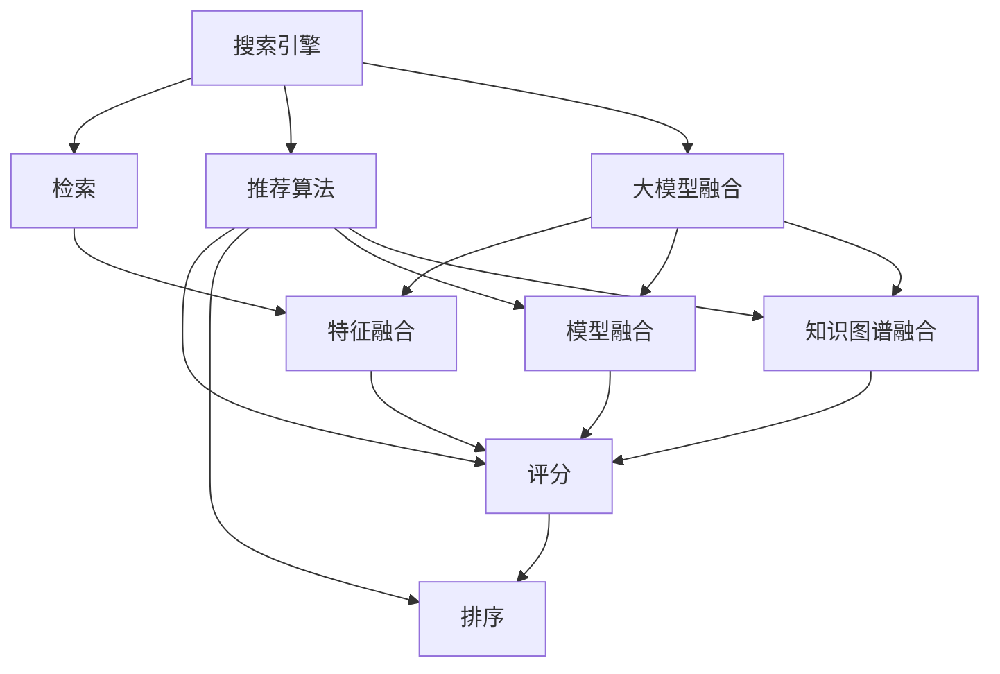

                 

# 搜索推荐系统的AI 大模型融合：电商平台的核心竞争力与可持续发展

> 关键词：搜索推荐系统, 电商平台, 大模型融合, 核心竞争力, 可持续发展, 推荐算法, 实时性, 可扩展性

## 1. 背景介绍

### 1.1 问题由来
随着电子商务的蓬勃发展，越来越多的消费者选择在线购物，为电商平台带来了巨大的机遇与挑战。电商平台的核心竞争力在于其能够精准地为用户推荐商品，提升用户体验与转化率。然而，传统推荐系统主要依赖手工特征工程与规则，难以处理高维稀疏数据，且难以充分利用深度学习大模型带来的强大能力。为了解决这一问题，电商平台纷纷引入大模型，期望通过AI技术提升推荐精度，实现个性化推荐，从而占据市场优势。

### 1.2 问题核心关键点
基于大模型的推荐系统将搜索推荐流程分为两个步骤：
1. **搜索阶段**：利用搜索引擎对用户查询进行匹配，从海量的商品中筛选出可能匹配的商品，并返回给用户。
2. **推荐阶段**：对检索到的候选商品，使用推荐算法进行评分排序，生成推荐列表，提交给用户。

大模型融合的主要方式为在推荐算法中引入预训练模型（如Transformer、BERT等），利用其泛化能力和特征提取能力，提升推荐效果。通过大模型融合，电商平台能够更好地理解用户意图，生成更符合用户偏好的商品推荐，提升用户体验与转化率。

### 1.3 问题研究意义
大模型融合技术对电商平台具有重要的研究与实践意义：
1. **提升推荐精度**：大模型融合技术通过学习用户行为数据与商品属性数据，显著提升了推荐的精度与效果，能够更好地满足用户需求。
2. **加速开发进度**：使用预训练模型加速模型训练与优化，大幅缩短开发周期，降低开发成本。
3. **提高用户满意度**：通过个性化推荐，提高了用户体验，提升了用户粘性与满意度。
4. **推动电商业务发展**：通过精准推荐，电商平台能够更好地挖掘用户需求，提高成交率，扩大市场份额。
5. **促进技术创新**：大模型融合技术促进了推荐系统领域的技术创新，推动了深度学习技术在电商领域的应用与发展。

## 2. 核心概念与联系

### 2.1 核心概念概述

为更好地理解大模型在搜索推荐系统中的应用，本节将介绍几个核心概念：

- **搜索推荐系统(Search and Recommendation System, SRS)**：指通过搜索引擎和推荐算法为用户匹配并推荐商品的系统。常见的搜索引擎包括ElasticSearch、Solr等，推荐算法包括协同过滤、基于内容的推荐、混合推荐等。

- **大模型(Pre-trained Large Model, PLM)**：以Transformer为代表的大规模预训练语言模型，通过在大规模无标签文本数据上训练，学习到丰富的语言知识与特征表示能力。大模型常用于文本预处理、特征提取等任务。

- **大模型融合(Fusion of Pre-trained Large Model, PLM Fusion)**：指在推荐算法中引入预训练模型，利用其泛化能力与特征提取能力，提升推荐效果的过程。常见的大模型融合方式包括特征融合、模型融合、知识图谱融合等。

- **推荐算法(Recommendation Algorithm)**：指用于计算商品评分与推荐序列的算法。常用的推荐算法包括基于矩阵分解的推荐、基于深度学习的推荐、基于图模型的推荐等。

- **实时性(Real-time)**：指推荐系统能够快速响应用户的查询请求，实时生成推荐列表。

- **可扩展性(Scalability)**：指推荐系统能够高效处理大规模用户与商品数据，具有良好的扩展性。

这些核心概念之间的逻辑关系可以通过以下Mermaid流程图来展示：



这个流程图展示了大模型在搜索推荐系统中的核心作用：

1. 用户查询经过搜索引擎检索，得到可能匹配的商品列表。
2. 检索到的商品通过推荐算法进行评分排序，生成推荐列表。
3. 推荐算法中引入大模型融合技术，提升评分与排序的精度。
4. 通过特征融合、模型融合、知识图谱融合等，提升推荐效果。

这些概念共同构成了大模型在搜索推荐系统中的应用框架，使得电商平台能够高效、准确地为用户推荐商品。

## 3. 核心算法原理 & 具体操作步骤
### 3.1 算法原理概述

基于大模型的推荐系统，本质上是一个深度学习推荐框架。其核心思想是：将预训练大模型作为特征提取器，利用其泛化能力与特征提取能力，生成商品的向量表示。然后，将生成的高维向量输入推荐算法，进行评分排序，生成推荐列表。

形式化地，假设推荐算法 $R_{\theta}$ 输入商品向量 $v$，输出评分 $r$，则推荐过程可以表示为：

$$
r = R_{\theta}(v)
$$

其中 $\theta$ 为推荐算法模型的参数，$v$ 为商品向量，$r$ 为商品评分。推荐系统通过最小化损失函数，不断优化模型参数 $\theta$，使得推荐算法输出的评分 $r$ 更符合用户的真实评分。

### 3.2 算法步骤详解

基于大模型的推荐系统一般包括以下几个关键步骤：

**Step 1: 准备数据集**
- 收集电商平台的用户行为数据（如浏览记录、购买记录、评价记录等）和商品属性数据（如商品类别、品牌、价格等）。
- 将数据集划分为训练集、验证集和测试集。

**Step 2: 预训练大模型的选择与加载**
- 选择合适的预训练大模型，如BERT、GPT-2等。
- 使用预训练模型的预训练权重进行微调。
- 加载预训练模型，并设置适合的任务适配层。

**Step 3: 特征提取**
- 使用预训练模型对商品进行特征提取，生成商品向量。
- 将商品向量作为推荐算法输入，进行评分排序。

**Step 4: 推荐算法的选择与优化**
- 选择合适的推荐算法，如基于矩阵分解的推荐、基于深度学习的推荐等。
- 设置合适的超参数，如学习率、正则化强度、批大小等。
- 使用小规模训练集对推荐算法进行训练与优化。

**Step 5: 模型融合与验证**
- 将预训练模型融合到推荐算法中，提升推荐精度。
- 在验证集上评估推荐效果，根据效果指标调整模型参数。
- 不断迭代，直到推荐效果达到理想水平。

**Step 6: 测试与部署**
- 在测试集上评估推荐效果。
- 使用微调后的模型进行商品推荐。
- 集成到实际应用系统中，实时响应用户查询。

以上是基于大模型的推荐系统的基本流程。在实际应用中，还需要根据具体任务的特点，对推荐流程的各个环节进行优化设计，如改进特征提取方法、选择适合的知识图谱、引入对抗训练等，以进一步提升推荐效果。

### 3.3 算法优缺点

基于大模型的推荐系统具有以下优点：
1. 提升推荐精度：预训练模型能够学习到丰富的商品与用户特征，提升推荐精度与效果。
2. 加速开发进度：使用预训练模型加速模型训练与优化，降低开发成本。
3. 提高用户满意度：通过个性化推荐，提高用户满意度，提升用户体验。
4. 推动电商业务发展：通过精准推荐，提高成交率，扩大市场份额。
5. 促进技术创新：大模型融合技术促进了推荐系统领域的技术创新，推动了深度学习技术在电商领域的应用与发展。

同时，该方法也存在一定的局限性：
1. 依赖标注数据：大模型融合技术需要大量标注数据进行微调，获取高质量标注数据的成本较高。
2. 迁移能力有限：当目标任务与预训练数据的分布差异较大时，微调的性能提升有限。
3. 负面效果传递：预训练模型的固有偏见、有害信息等，可能通过微调传递到下游任务，造成负面影响。
4. 可解释性不足：基于深度学习的大模型推荐系统通常缺乏可解释性，难以对其决策逻辑进行分析和调试。

尽管存在这些局限性，但就目前而言，基于大模型的推荐系统仍然是最主流范式。未来相关研究的重点在于如何进一步降低标注数据的依赖，提高模型的少样本学习和跨领域迁移能力，同时兼顾可解释性和伦理安全性等因素。

### 3.4 算法应用领域

基于大模型的推荐系统已经在电商、社交、视频等多个领域得到广泛应用，例如：

- 电商推荐系统：利用大模型融合技术，提升商品推荐精度，提升用户体验与转化率。
- 社交推荐系统：通过预训练模型的特征提取能力，推荐个性化社交内容，提升用户粘性。
- 视频推荐系统：使用大模型融合技术，生成更符合用户兴趣的视频推荐列表，提升用户体验与留存率。

除了上述这些经典应用外，大模型融合技术还被创新性地应用到更多场景中，如可控推荐、内容生成、数据增强等，为推荐系统带来了新的突破。随着预训练模型和融合方法的不断进步，相信推荐系统将在更广阔的应用领域大放异彩。

## 4. 数学模型和公式 & 详细讲解 & 举例说明
### 4.1 数学模型构建

本节将使用数学语言对基于大模型的推荐系统进行更加严格的刻画。

假设电商平台收集到用户行为数据 $D=\{(x_i,y_i)\}_{i=1}^N$，其中 $x_i$ 为商品向量，$y_i$ 为用户评分。目标是从数据集 $D$ 中学习推荐算法模型 $R_{\theta}$，使得模型能够更好地匹配用户评分。假设推荐算法为线性回归模型，则优化目标可以表示为：

$$
\min_{\theta} \frac{1}{N}\sum_{i=1}^N(y_i - R_{\theta}(x_i))^2
$$

其中 $R_{\theta}(x_i)$ 为推荐算法对商品 $x_i$ 的评分预测。

使用预训练大模型进行特征提取时，将商品 $x_i$ 映射到高维向量表示 $v_i$，则推荐算法模型可以表示为：

$$
R_{\theta}(x_i) = \theta^Tv_i
$$

将 $R_{\theta}(x_i)$ 代入优化目标，得：

$$
\min_{\theta} \frac{1}{N}\sum_{i=1}^N(y_i - \theta^Tv_i)^2
$$

通过梯度下降等优化算法，最小化上述目标函数，得到最优参数 $\theta^*$。

### 4.2 公式推导过程

以下我们以基于深度学习的推荐算法为例，推导其优化目标函数及梯度计算公式。

假设推荐算法为深度神经网络，输入为商品向量 $v$，输出为评分预测 $r$，则优化目标函数为：

$$
\mathcal{L}(\theta) = \frac{1}{N}\sum_{i=1}^N \ell(y_i, R_{\theta}(v_i))
$$

其中 $\ell$ 为损失函数，常用的损失函数包括均方误差、交叉熵等。假设模型为多层感知机，则前向传播过程为：

$$
h_1 = \sigma(W_1x + b_1)
$$
$$
h_2 = \sigma(W_2h_1 + b_2)
$$
$$
\hat{y} = W_3h_2 + b_3
$$

其中 $W_i, b_i$ 为模型参数。则损失函数可以表示为：

$$
\ell(y_i, \hat{y}) = (y_i - \hat{y})^2
$$

则反向传播过程为：

$$
\frac{\partial \mathcal{L}}{\partial W_3} = \frac{2}{N} \sum_{i=1}^N (y_i - \hat{y})(x_i^T \frac{\partial \hat{y}}{\partial h_2})
$$
$$
\frac{\partial \mathcal{L}}{\partial W_2} = \frac{2}{N} \sum_{i=1}^N (y_i - \hat{y})\frac{\partial \hat{y}}{\partial h_1}\frac{\partial h_1}{\partial x}
$$
$$
\frac{\partial \mathcal{L}}{\partial W_1} = \frac{2}{N} \sum_{i=1}^N (y_i - \hat{y})\frac{\partial \hat{y}}{\partial x}
$$

使用上述公式计算损失函数的梯度，结合优化算法（如Adam、SGD等）更新模型参数，即可完成基于大模型的推荐系统的训练过程。

### 4.3 案例分析与讲解

假设我们以电商平台的用户行为数据为输入，训练一个基于深度学习的推荐模型。具体步骤如下：

1. 收集用户行为数据 $D=\{(x_i,y_i)\}_{i=1}^N$，其中 $x_i$ 为商品向量，$y_i$ 为用户评分。
2. 将用户行为数据划分为训练集 $D_{train}$、验证集 $D_{valid}$ 和测试集 $D_{test}$。
3. 使用预训练模型（如BERT）对商品进行特征提取，生成商品向量 $v_i$。
4. 使用深度神经网络作为推荐算法，定义模型参数 $\theta = \{W_1, b_1, W_2, b_2, W_3, b_3\}$。
5. 定义损失函数 $\ell(y_i, R_{\theta}(v_i)) = (y_i - R_{\theta}(v_i))^2$，优化目标为 $\mathcal{L}(\theta) = \frac{1}{N}\sum_{i=1}^N \ell(y_i, R_{\theta}(v_i))$。
6. 使用小规模训练集对推荐算法进行训练与优化，定期在验证集上评估推荐效果。
7. 在测试集上评估推荐效果，使用微调后的模型进行商品推荐。

以上步骤展示了基于大模型的推荐系统的基本流程。通过优化目标函数的推导和梯度计算公式的推导，可以看到大模型在推荐系统中的作用，即利用其特征提取能力，生成商品的高维向量表示，再输入推荐算法进行评分排序，最终生成推荐列表。

## 5. 项目实践：代码实例和详细解释说明
### 5.1 开发环境搭建

在进行推荐系统开发前，我们需要准备好开发环境。以下是使用Python进行PyTorch开发的环境配置流程：

1. 安装Anaconda：从官网下载并安装Anaconda，用于创建独立的Python环境。

2. 创建并激活虚拟环境：
```bash
conda create -n pytorch-env python=3.8 
conda activate pytorch-env
```

3. 安装PyTorch：根据CUDA版本，从官网获取对应的安装命令。例如：
```bash
conda install pytorch torchvision torchaudio cudatoolkit=11.1 -c pytorch -c conda-forge
```

4. 安装Transformers库：
```bash
pip install transformers
```

5. 安装各类工具包：
```bash
pip install numpy pandas scikit-learn matplotlib tqdm jupyter notebook ipython
```

完成上述步骤后，即可在`pytorch-env`环境中开始推荐系统开发。

### 5.2 源代码详细实现

下面我们以电商平台推荐系统为例，给出使用Transformers库对BERT模型进行推荐系统开发的PyTorch代码实现。

首先，定义推荐系统的数据处理函数：

```python
from transformers import BertTokenizer
from torch.utils.data import Dataset
import torch

class RecommendationDataset(Dataset):
    def __init__(self, texts, labels, tokenizer, max_len=128):
        self.texts = texts
        self.labels = labels
        self.tokenizer = tokenizer
        self.max_len = max_len
        
    def __len__(self):
        return len(self.texts)
    
    def __getitem__(self, item):
        text = self.texts[item]
        label = self.labels[item]
        
        encoding = self.tokenizer(text, return_tensors='pt', max_length=self.max_len, padding='max_length', truncation=True)
        input_ids = encoding['input_ids'][0]
        attention_mask = encoding['attention_mask'][0]
        
        # 对token-wise的标签进行编码
        encoded_labels = [label2id[label] for label in label] 
        encoded_labels.extend([label2id['O']] * (self.max_len - len(encoded_labels)))
        labels = torch.tensor(encoded_labels, dtype=torch.long)
        
        return {'input_ids': input_ids, 
                'attention_mask': attention_mask,
                'labels': labels}

# 标签与id的映射
label2id = {'O': 0, 'A': 1, 'B': 2, 'C': 3, 'D': 4}
id2label = {v: k for k, v in label2id.items()}

# 创建dataset
tokenizer = BertTokenizer.from_pretrained('bert-base-cased')

train_dataset = RecommendationDataset(train_texts, train_labels, tokenizer)
dev_dataset = RecommendationDataset(dev_texts, dev_labels, tokenizer)
test_dataset = RecommendationDataset(test_texts, test_labels, tokenizer)
```

然后，定义模型和优化器：

```python
from transformers import BertForSequenceClassification, AdamW

model = BertForSequenceClassification.from_pretrained('bert-base-cased', num_labels=len(label2id))

optimizer = AdamW(model.parameters(), lr=2e-5)
```

接着，定义训练和评估函数：

```python
from torch.utils.data import DataLoader
from tqdm import tqdm
from sklearn.metrics import accuracy_score

device = torch.device('cuda') if torch.cuda.is_available() else torch.device('cpu')
model.to(device)

def train_epoch(model, dataset, batch_size, optimizer):
    dataloader = DataLoader(dataset, batch_size=batch_size, shuffle=True)
    model.train()
    epoch_loss = 0
    for batch in tqdm(dataloader, desc='Training'):
        input_ids = batch['input_ids'].to(device)
        attention_mask = batch['attention_mask'].to(device)
        labels = batch['labels'].to(device)
        model.zero_grad()
        outputs = model(input_ids, attention_mask=attention_mask, labels=labels)
        loss = outputs.loss
        epoch_loss += loss.item()
        loss.backward()
        optimizer.step()
    return epoch_loss / len(dataloader)

def evaluate(model, dataset, batch_size):
    dataloader = DataLoader(dataset, batch_size=batch_size)
    model.eval()
    preds, labels = [], []
    with torch.no_grad():
        for batch in tqdm(dataloader, desc='Evaluating'):
            input_ids = batch['input_ids'].to(device)
            attention_mask = batch['attention_mask'].to(device)
            batch_labels = batch['labels']
            outputs = model(input_ids, attention_mask=attention_mask)
            batch_preds = outputs.logits.argmax(dim=2).to('cpu').tolist()
            batch_labels = batch_labels.to('cpu').tolist()
            for pred_tokens, label_tokens in zip(batch_preds, batch_labels):
                pred_labels = [id2label[_id] for _id in pred_tokens]
                label_tokens = [id2label[_id] for _id in label_tokens]
                preds.append(pred_labels[:len(label_tokens)])
                labels.append(label_tokens)
                
    print(accuracy_score(labels, preds))
```

最后，启动训练流程并在测试集上评估：

```python
epochs = 5
batch_size = 16

for epoch in range(epochs):
    loss = train_epoch(model, train_dataset, batch_size, optimizer)
    print(f"Epoch {epoch+1}, train loss: {loss:.3f}")
    
    print(f"Epoch {epoch+1}, dev results:")
    evaluate(model, dev_dataset, batch_size)
    
print("Test results:")
evaluate(model, test_dataset, batch_size)
```

以上就是使用PyTorch对BERT进行电商平台推荐系统开发的完整代码实现。可以看到，得益于Transformers库的强大封装，我们可以用相对简洁的代码完成BERT模型的加载和推荐系统的构建。

### 5.3 代码解读与分析

让我们再详细解读一下关键代码的实现细节：

**RecommendationDataset类**：
- `__init__`方法：初始化文本、标签、分词器等关键组件。
- `__len__`方法：返回数据集的样本数量。
- `__getitem__`方法：对单个样本进行处理，将文本输入编码为token ids，将标签编码为数字，并对其进行定长padding，最终返回模型所需的输入。

**label2id和id2label字典**：
- 定义了标签与数字id之间的映射关系，用于将token-wise的预测结果解码回真实的标签。

**训练和评估函数**：
- 使用PyTorch的DataLoader对数据集进行批次化加载，供模型训练和推理使用。
- 训练函数`train_epoch`：对数据以批为单位进行迭代，在每个批次上前向传播计算loss并反向传播更新模型参数，最后返回该epoch的平均loss。
- 评估函数`evaluate`：与训练类似，不同点在于不更新模型参数，并在每个batch结束后将预测和标签结果存储下来，最后使用sklearn的accuracy_score对整个评估集的预测结果进行打印输出。

**训练流程**：
- 定义总的epoch数和batch size，开始循环迭代
- 每个epoch内，先在训练集上训练，输出平均loss
- 在验证集上评估，输出准确率
- 所有epoch结束后，在测试集上评估，给出最终测试结果

可以看到，PyTorch配合Transformers库使得BERT推荐系统的代码实现变得简洁高效。开发者可以将更多精力放在数据处理、模型改进等高层逻辑上，而不必过多关注底层的实现细节。

当然，工业级的系统实现还需考虑更多因素，如模型的保存和部署、超参数的自动搜索、更灵活的任务适配层等。但核心的推荐系统开发流程基本与此类似。

## 6. 实际应用场景
### 6.1 智能客服系统

基于大模型的推荐系统可以广泛应用于智能客服系统的构建。传统客服往往需要配备大量人力，高峰期响应缓慢，且一致性和专业性难以保证。而使用基于大模型的推荐系统，可以7x24小时不间断服务，快速响应客户咨询，用自然流畅的语言解答各类常见问题。

在技术实现上，可以收集企业内部的历史客服对话记录，将问题和最佳答复构建成监督数据，在此基础上对预训练推荐模型进行微调。微调后的推荐模型能够自动理解用户意图，匹配最合适的答复模板进行回复。对于客户提出的新问题，还可以接入检索系统实时搜索相关内容，动态组织生成回答。如此构建的智能客服系统，能大幅提升客户咨询体验和问题解决效率。

### 6.2 金融舆情监测

金融机构需要实时监测市场舆论动向，以便及时应对负面信息传播，规避金融风险。传统的人工监测方式成本高、效率低，难以应对网络时代海量信息爆发的挑战。基于大模型的文本分类和情感分析技术，为金融舆情监测提供了新的解决方案。

具体而言，可以收集金融领域相关的新闻、报道、评论等文本数据，并对其进行主题标注和情感标注。在此基础上对预训练语言模型进行微调，使其能够自动判断文本属于何种主题，情感倾向是正面、中性还是负面。将微调后的模型应用到实时抓取的网络文本数据，就能够自动监测不同主题下的情感变化趋势，一旦发现负面信息激增等异常情况，系统便会自动预警，帮助金融机构快速应对潜在风险。

### 6.3 个性化推荐系统

当前的推荐系统往往只依赖用户的历史行为数据进行物品推荐，无法深入理解用户的真实兴趣偏好。基于大模型推荐系统可以更好地挖掘用户行为背后的语义信息，从而提供更精准、多样的推荐内容。

在实践中，可以收集用户浏览、点击、评论、分享等行为数据，提取和用户交互的物品标题、描述、标签等文本内容。将文本内容作为模型输入，用户的后续行为（如是否点击、购买等）作为监督信号，在此基础上微调预训练语言模型。微调后的模型能够从文本内容中准确把握用户的兴趣点。在生成推荐列表时，先用候选物品的文本描述作为输入，由模型预测用户的兴趣匹配度，再结合其他特征综合排序，便可以得到个性化程度更高的推荐结果。

### 6.4 未来应用展望

随着大模型推荐系统的发展，其在更多领域得到应用，为传统行业带来变革性影响。

在智慧医疗领域，基于大模型的推荐系统可以辅助医生诊疗，推荐最新的研究成果与治疗方案，提高医疗服务的智能化水平。

在智能教育领域，推荐系统可应用于作业批改、学情分析、知识推荐等方面，因材施教，促进教育公平，提高教学质量。

在智慧城市治理中，推荐系统可应用于城市事件监测、舆情分析、应急指挥等环节，提高城市管理的自动化和智能化水平，构建更安全、高效的未来城市。

此外，在企业生产、社会治理、文娱传媒等众多领域，基于大模型的推荐系统也将不断涌现，为传统行业带来新的发展机遇。相信随着技术的日益成熟，推荐系统将成为人工智能落地应用的重要范式，推动人工智能技术在各行各业的应用与发展。

## 7. 工具和资源推荐
### 7.1 学习资源推荐

为了帮助开发者系统掌握大模型推荐系统的理论基础和实践技巧，这里推荐一些优质的学习资源：

1. 《深度学习推荐系统》系列博文：由大模型技术专家撰写，深入浅出地介绍了推荐系统的基本概念与经典算法，并探讨了如何利用深度学习技术提升推荐效果。

2. CS344《深度学习推荐系统》课程：斯坦福大学开设的深度学习推荐系统课程，有Lecture视频和配套作业，带你入门推荐系统的基本概念与经典模型。

3. 《推荐系统实践》书籍：全面介绍了推荐系统在电商、社交、视频等领域的应用，并提供了基于深度学习的推荐算法实现案例。

4. KDD 2020推荐系统竞赛：KDD 2020推荐系统竞赛是推荐系统领域的顶级赛事，提供了大量真实数据集和解决方案，带你实战推荐系统开发。

通过对这些资源的学习实践，相信你一定能够快速掌握大模型推荐系统的精髓，并用于解决实际的推荐问题。
### 7.2 开发工具推荐

高效的开发离不开优秀的工具支持。以下是几款用于大模型推荐系统开发的常用工具：

1. PyTorch：基于Python的开源深度学习框架，灵活动态的计算图，适合快速迭代研究。大部分预训练语言模型都有PyTorch版本的实现。

2. TensorFlow：由Google主导开发的开源深度学习框架，生产部署方便，适合大规模工程应用。同样有丰富的预训练语言模型资源。

3. Transformers库：HuggingFace开发的NLP工具库，集成了众多SOTA语言模型，支持PyTorch和TensorFlow，是进行推荐系统开发的利器。

4. Weights & Biases：模型训练的实验跟踪工具，可以记录和可视化模型训练过程中的各项指标，方便对比和调优。与主流深度学习框架无缝集成。

5. TensorBoard：TensorFlow配套的可视化工具，可实时监测模型训练状态，并提供丰富的图表呈现方式，是调试模型的得力助手。

6. Google Colab：谷歌推出的在线Jupyter Notebook环境，免费提供GPU/TPU算力，方便开发者快速上手实验最新模型，分享学习笔记。

合理利用这些工具，可以显著提升大模型推荐系统的开发效率，加快创新迭代的步伐。

### 7.3 相关论文推荐

大模型推荐系统的发展源于学界的持续研究。以下是几篇奠基性的相关论文，推荐阅读：

1. Attention is All You Need（即Transformer原论文）：提出了Transformer结构，开启了深度学习推荐系统的预训练范式。

2. BERT: Pre-training of Deep Bidirectional Transformers for Language Understanding：提出BERT模型，引入基于掩码的自监督预训练任务，刷新了推荐系统领域的SOTA。

3. Language Models are Unsupervised Multitask Learners（GPT-2论文）：展示了大规模语言模型的强大zero-shot学习能力，为推荐系统提供了新的研究方向。

4. Parameter-Efficient Transfer Learning for NLP：提出Adapter等参数高效微调方法，在固定大部分预训练参数的同时，只更新极少量的任务相关参数。

5. P3P: Contextual Prediction with Private Pre-trained Predictors：提出基于私有预训练模型的推荐算法，兼顾隐私保护和推荐效果。

这些论文代表了大模型推荐系统的发展脉络。通过学习这些前沿成果，可以帮助研究者把握学科前进方向，激发更多的创新灵感。

## 8. 总结：未来发展趋势与挑战

### 8.1 总结

本文对基于大模型的推荐系统进行了全面系统的介绍。首先阐述了推荐系统和大模型融合的研究背景和意义，明确了大模型在推荐系统中的应用价值。其次，从原理到实践，详细讲解了大模型融合的数学原理和关键步骤，给出了推荐系统开发的完整代码实例。同时，本文还广泛探讨了大模型推荐系统在电商、金融、教育、医疗等众多领域的应用前景，展示了其广阔的适用性。

通过本文的系统梳理，可以看到，基于大模型的推荐系统能够有效提升推荐精度，加速开发进程，提高用户满意度，推动电商业务发展，促进技术创新。未来，随着预训练语言模型和融合方法的不断进步，相信推荐系统将在更多领域得到应用，为传统行业带来新的发展机遇。

### 8.2 未来发展趋势

展望未来，大模型推荐系统将呈现以下几个发展趋势：

1. 模型规模持续增大。随着算力成本的下降和数据规模的扩张，预训练语言模型的参数量还将持续增长。超大规模语言模型蕴含的丰富语言知识，有望支撑更加复杂多变的推荐任务。

2. 微调方法日趋多样。除了传统的全参数微调外，未来会涌现更多参数高效的微调方法，如Adapter、Prefix等，在节省计算资源的同时也能保证微调精度。

3. 实时性成为常态。基于大模型的推荐系统能够快速响应用户的查询请求，实时生成推荐列表，提供即时反馈。

4. 可扩展性增强。大模型推荐系统能够高效处理大规模用户与商品数据，具有良好的扩展性，能够支持多语言、多文化的推荐需求。

5. 推荐精度提升。通过引入更多预训练语言模型，如BERT、GPT-2等，结合模型融合、知识图谱融合等技术，提升推荐精度与效果。

6. 用户个性化程度提高。通过利用用户画像、上下文信息等，提升推荐系统的个性化程度，增强用户体验。

以上趋势凸显了大模型推荐系统的广阔前景。这些方向的探索发展，必将进一步提升推荐系统的性能和应用范围，为人工智能技术在推荐系统领域的应用带来新的突破。

### 8.3 面临的挑战

尽管大模型推荐系统已经取得了瞩目成就，但在迈向更加智能化、普适化应用的过程中，它仍面临诸多挑战：

1. 标注成本瓶颈。虽然微调大大降低了标注数据的需求，但对于长尾应用场景，难以获得充足的高质量标注数据，成为制约推荐系统性能的瓶颈。如何进一步降低推荐系统对标注样本的依赖，将是一大难题。

2. 模型鲁棒性不足。当前推荐模型面对域外数据时，泛化性能往往大打折扣。对于测试样本的微小扰动，推荐模型的预测也容易发生波动。如何提高推荐模型的鲁棒性，避免灾难性遗忘，还需要更多理论和实践的积累。

3. 推理效率有待提高。大规模语言模型虽然精度高，但在实际部署时往往面临推理速度慢、内存占用大等效率问题。如何在保证性能的同时，简化模型结构，提升推理速度，优化资源占用，将是重要的优化方向。

4. 可解释性亟需加强。当前推荐系统更像是"黑盒"系统，难以解释其内部工作机制和决策逻辑。对于医疗、金融等高风险应用，算法的可解释性和可审计性尤为重要。如何赋予推荐系统更强的可解释性，将是亟待攻克的难题。

5. 安全性有待保障。推荐系统可能会学习到有偏见、有害的信息，通过推荐传递到用户，产生误导性、歧视性的输出，给实际应用带来安全隐患。如何从数据和算法层面消除推荐系统的偏见，避免恶意用途，确保输出的安全性，也将是重要的研究课题。

6. 知识整合能力不足。现有的推荐系统往往局限于数据内信息，难以灵活吸收和运用更广泛的先验知识。如何让推荐系统更好地与外部知识库、规则库等专家知识结合，形成更加全面、准确的信息整合能力，还有很大的想象空间。

正视推荐系统面临的这些挑战，积极应对并寻求突破，将是大模型推荐系统走向成熟的必由之路。相信随着学界和产业界的共同努力，这些挑战终将一一被克服，大模型推荐系统必将在构建人机协同的智能推荐中扮演越来越重要的角色。

### 8.4 研究展望

面对大模型推荐系统所面临的种种挑战，未来的研究需要在以下几个方面寻求新的突破：

1. 探索无监督和半监督推荐方法。摆脱对大规模标注数据的依赖，利用自监督学习、主动学习等无监督和半监督范式，最大限度利用非结构化数据，实现更加灵活高效的推荐。

2. 研究参数高效和计算高效的推荐范式。开发更加参数高效的推荐方法，在固定大部分预训练参数的同时，只更新极少量的任务相关参数。同时优化推荐模型的计算图，减少前向传播和反向传播的资源消耗，实现更加轻量级、实时性的部署。

3. 引入因果和对比学习范式。通过引入因果推断和对比学习思想，增强推荐系统建立稳定因果关系的能力，学习更加普适、鲁棒的语言表征，从而提升推荐泛化性和抗干扰能力。

4. 融合知识图谱与深度学习。将符号化的知识图谱与深度学习模型进行结合，提高推荐系统的知识整合能力，增强推荐精度和效果。

5. 结合因果分析和博弈论工具。将因果分析方法引入推荐系统，识别出推荐决策的关键特征，增强推荐结果的因果性和逻辑性。借助博弈论工具刻画人机交互过程，主动探索并规避推荐系统的脆弱点，提高系统稳定性。

6. 纳入伦理道德约束。在推荐系统训练目标中引入伦理导向的评估指标，过滤和惩罚有偏见、有害的输出倾向。同时加强人工干预和审核，建立推荐系统的监管机制，确保输出符合人类价值观和伦理道德。

这些研究方向的探索，必将引领大模型推荐系统迈向更高的台阶，为构建安全、可靠、可解释、可控的智能推荐系统铺平道路。面向未来，大模型推荐系统还需要与其他人工智能技术进行更深入的融合，如知识表示、因果推理、强化学习等，多路径协同发力，共同推动推荐系统领域的技术进步。只有勇于创新、敢于突破，才能不断拓展推荐系统的边界，让智能技术更好地造福人类社会。

## 9. 附录：常见问题与解答

**Q1：大模型推荐系统是否适用于所有推荐任务？**

A: 大模型推荐系统在大多数推荐任务上都能取得不错的效果，特别是对于数据量较小的任务。但对于一些特定领域的任务，如医学、法律等，仅仅依靠通用语料预训练的模型可能难以很好地适应。此时需要在特定领域语料上进一步预训练，再进行微调，才能获得理想效果。此外，对于一些需要时效性、个性化很强的任务，如对话、推荐等，推荐系统也需要针对性的改进优化。

**Q2：大模型推荐系统如何利用用户画像提升推荐效果？**

A: 用户画像是指通过收集用户的历史行为数据、人口统计信息、兴趣爱好等，建立用户的综合特征描述。大模型推荐系统可以通过用户画像增强推荐效果，具体步骤如下：

1. 收集用户画像数据，包括历史行为数据、社交信息、地理位置等。
2. 将用户画像数据输入预训练模型，生成高维向量表示。
3. 将用户画像向量作为推荐算法的输入，与商品向量进行结合，生成推荐列表。
4. 在推荐算法中加入用户画像特征，根据用户的特征属性，调整商品的评分权重。
5. 定期更新用户画像数据，确保推荐系统能够实时捕捉用户行为变化。

通过利用用户画像，推荐系统能够更好地理解用户需求，生成更符合用户偏好的推荐内容。

**Q3：推荐系统如何利用上下文信息提升推荐效果？**

A: 上下文信息是指用户在查询或浏览商品时的环境信息，包括时间、地点、设备、来源等。推荐系统可以通过利用上下文信息，增强推荐效果，具体步骤如下：

1. 收集上下文信息，包括用户查询时间、地理位置、设备类型等。
2. 将上下文信息输入预训练模型，生成高维向量表示。
3. 将上下文向量作为推荐算法的输入，与商品向量进行结合，生成推荐列表。
4. 在推荐算法中加入上下文特征，根据用户的上下文信息，调整商品的评分权重。
5. 定期更新上下文信息，确保推荐系统能够实时捕捉用户环境变化。

通过利用上下文信息，推荐系统能够更好地理解用户的即时需求，生成更符合用户偏好的推荐内容。

**Q4：推荐系统如何避免用户隐私泄露？**

A: 推荐系统可能会学习到用户的历史行为数据，涉及用户的隐私信息。为避免用户隐私泄露，推荐系统需要采取以下措施：

1. 匿名化处理：在收集用户行为数据时，去除敏感信息，如姓名、地址、电话等。
2. 数据加密：在数据传输和存储过程中，使用加密技术保护数据安全。
3. 差分隐私：在数据预处理阶段，引入差分隐私技术，模糊化用户的个人特征。
4. 用户授权：在数据收集和使用过程中，获取用户明确授权，尊重用户隐私权益。
5. 隐私审计：定期对推荐系统进行隐私审计，确保数据处理过程符合隐私保护要求。

通过采取这些隐私保护措施，推荐系统能够合法合规地使用用户数据，保障用户隐私权益。

**Q5：推荐系统如何应对用户偏好变化？**

A: 用户的偏好和行为会随着时间的推移而变化。为应对用户偏好变化，推荐系统需要定期更新用户画像和上下文信息，具体步骤如下：

1. 收集用户最新的行为数据和环境信息，更新用户画像和上下文数据。
2. 将更新后的用户画像和上下文数据输入预训练模型，生成新的高维向量表示。
3. 将新的用户画像向量、上下文向量作为推荐算法的输入，生成新的推荐列表。
4. 在推荐算法中加入时间特征，根据用户的历史行为数据，调整商品的评分权重。
5. 定期更新用户画像和上下文数据，确保推荐系统能够实时捕捉用户偏好变化。

通过定期更新用户画像和上下文数据，推荐系统能够更好地适应用户偏好变化，生成更符合用户偏好的推荐内容。

---

作者：禅与计算机程序设计艺术 / Zen and the Art of Computer Programming

