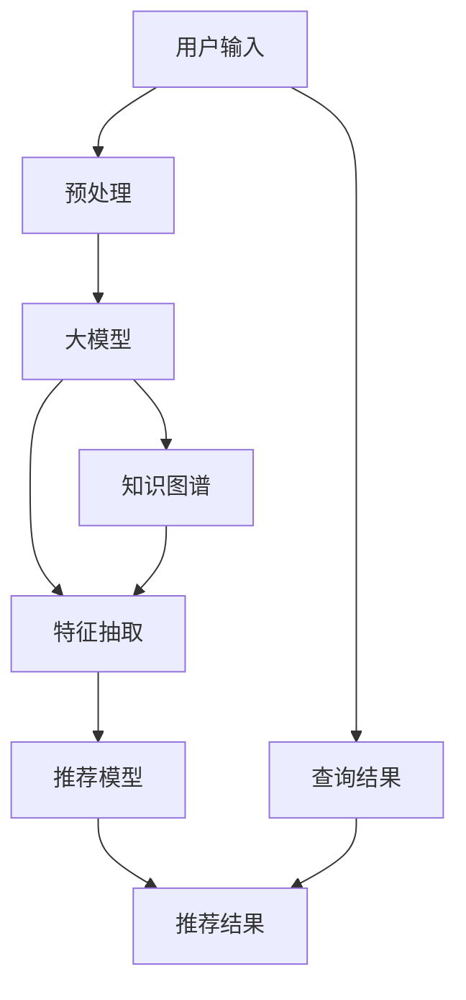

                 

# 搜索推荐系统的AI 大模型融合：电商平台的核心竞争力与可持续发展战略

## 1. 背景介绍

随着电子商务行业的快速发展和用户行为的多样化，搜索引擎和推荐系统在电商平台中扮演着越来越重要的角色。它们通过分析用户搜索行为和历史交易记录，精准推荐用户可能感兴趣的商品，提升用户体验和转化率，成为电商平台的核心竞争力之一。然而，传统的搜索引擎和推荐系统在面对海量的商品和用户数据时，往往存在推荐效果不稳定、推荐内容同质化严重、冷启动问题难解决等问题。如何利用最新的AI大模型，结合用户个性化需求，优化搜索推荐系统，成为电商平台智能化升级的关键。

## 2. 核心概念与联系

### 2.1 核心概念概述

为了更深入地理解AI大模型在搜索推荐系统中的应用，我们首先需要了解几个关键概念：

- **AI大模型（Large AI Models）**：指那些基于深度学习和自然语言处理技术的超大规模神经网络模型。它们通常由大量的文本数据进行预训练，具备强大的语言理解能力和语义表示能力，能处理自然语言理解、生成、推理等复杂任务。

- **搜索引擎（Search Engine）**：指基于文本查询技术，帮助用户快速找到相关信息的应用系统。它通过检索算法，根据用户输入的关键词，从大量商品中筛选出最相关的商品信息。

- **推荐系统（Recommendation System）**：指根据用户的历史行为和偏好，通过算法推荐用户可能感兴趣的商品或内容的应用系统。它通过协同过滤、基于内容的推荐、矩阵分解等算法，挖掘用户隐含的偏好，进行商品推荐。

- **AI大模型融合（AI Model Fusion）**：指将多个AI大模型结合使用，发挥各自的优势，实现更高效的推荐和搜索系统。

- **知识图谱（Knowledge Graph）**：指通过关系型数据库，构建实体间关系的图形表示，用于增强推荐系统的关联性和语义理解能力。

- **深度学习（Deep Learning）**：指利用多层神经网络进行特征学习、模式识别等复杂任务的技术，在大模型融合和推荐系统中发挥重要作用。

### 2.2 核心概念原理和架构的 Mermaid 流程图

以下是一个简单的Mermaid流程图，展示了AI大模型融合在搜索推荐系统中的工作原理：



该图展示了搜索推荐系统的工作流程：用户输入后，经过预处理后送入大模型进行处理，与知识图谱融合，再通过特征抽取和推荐模型生成推荐结果，最后与查询结果进行融合，生成最终的推荐结果。

## 3. 核心算法原理 & 具体操作步骤

### 3.1 算法原理概述

AI大模型融合的搜索推荐系统，通过将多个AI大模型的优势相结合，实现更精准、高效、多样化的推荐和搜索。其主要原理包括以下几个方面：

- **预训练-微调（Pre-training & Fine-tuning）**：使用大规模无标签数据进行预训练，然后通过下游任务的少量标签数据进行微调，提升模型在该任务上的性能。

- **知识增强（Knowledge Enrichment）**：将知识图谱和自然语言处理技术结合，提升模型的语义理解和关联能力，增强推荐系统的关联性和精准性。

- **多模型融合（Multi-Model Fusion）**：将多个AI大模型进行组合，发挥各自优势，弥补单一模型的不足，提高推荐系统的多样性和鲁棒性。

- **在线学习和持续改进（Online Learning & Continuous Improvement）**：通过实时数据更新，不断改进推荐算法，优化模型参数，保持系统的长期稳定性。

### 3.2 算法步骤详解

AI大模型融合的搜索推荐系统，主要包括以下几个关键步骤：

**Step 1: 数据预处理**

- 收集用户的历史搜索记录、浏览行为、购买记录等数据，并进行清洗和特征提取。
- 对文本数据进行分词、去停用词、词向量化等处理，便于后续大模型的处理。
- 构建知识图谱，将商品、品牌、类别等实体及其关系存储在图形数据库中。

**Step 2: 大模型预训练与微调**

- 选择合适的预训练模型（如BERT、GPT等），在大规模无标签文本数据上进行预训练。
- 选择适当的微调任务（如分类、匹配、生成等），并收集下游任务的小样本标注数据。
- 使用微调技术（如转移学习、少样本学习、零样本学习等），优化模型在特定任务上的性能。

**Step 3: 特征抽取与融合**

- 利用大模型对用户输入的文本进行语义理解，提取关键特征。
- 将知识图谱中的实体关系融入特征表示中，增强推荐的关联性和语义理解能力。
- 采用特征选择和融合技术，将不同来源的特征进行组合，生成更具代表性和区分度的特征向量。

**Step 4: 推荐模型训练与优化**

- 选择合适的推荐算法（如协同过滤、基于内容的推荐、深度学习模型等），训练推荐模型。
- 使用优化算法（如梯度下降、Adam等），最小化推荐误差，提升模型性能。
- 通过在线学习和持续改进，不断更新模型参数，适应新的用户行为和市场变化。

**Step 5: 推荐结果生成**

- 根据用户输入和历史行为，生成初步推荐结果。
- 将推荐结果与查询结果进行融合，生成最终的推荐列表。
- 使用A/B测试等方法，评估推荐效果，不断优化算法和模型参数。

### 3.3 算法优缺点

AI大模型融合的搜索推荐系统，具有以下优点：

- **性能提升**：通过多模型融合，结合知识图谱和语义理解能力，可以显著提升推荐系统的精准性和多样性。
- **效率提升**：利用大模型的预训练能力和高效计算能力，可以大幅降低训练和推理的计算成本，提高系统效率。
- **灵活性增强**：通过知识增强和特征融合技术，系统能够灵活应对不同的推荐场景和用户需求。

然而，该方法也存在一些缺点：

- **模型复杂度增加**：多模型融合和知识增强使得系统更加复杂，需要更多的计算资源和时间。
- **数据需求增加**：知识图谱和预训练数据需要大量高质量的标注数据和计算资源。
- **泛化能力挑战**：复杂模型的泛化能力可能不如简单的模型，面临冷启动等问题。

### 3.4 算法应用领域

AI大模型融合的搜索推荐系统，已经在多个领域得到应用，例如：

- **电商平台**：如京东、淘宝等，利用AI大模型融合技术，提升商品推荐和搜索结果的精准性和多样性，增强用户体验和转化率。
- **金融行业**：如支付宝、理财通等，利用AI大模型融合技术，进行智能投资顾问、风险评估和理财推荐。
- **旅游行业**：如携程、去哪儿等，利用AI大模型融合技术，进行旅游目的地推荐、行程规划和实时价格优化。
- **媒体行业**：如Netflix、YouTube等，利用AI大模型融合技术，进行个性化视频推荐、内容创作和用户画像构建。

## 4. 数学模型和公式 & 详细讲解

### 4.1 数学模型构建

假设有N个用户U和M个商品I，每个用户在时间序列上会进行多次查询和购买，构成一个二部图G(U,I)。设用户U的查询记录为X，商品I的描述信息为Y，用户和商品的隐含偏好为Z，则目标是通过优化目标函数：

$$
\min_{X,Y,Z} \sum_{u,i} w_{u,i} \cdot loss(u,X,Y,Z) + \lambda \cdot ||Z||_2^2
$$

其中，$w_{u,i}$为查询记录和商品描述的权重，$loss(u,X,Y,Z)$为目标函数，$||Z||_2^2$为隐含偏好的正则化项，$\lambda$为正则化系数。

### 4.2 公式推导过程

在目标函数中，$loss(u,X,Y,Z)$可以进一步细分为多个子损失函数，例如：

- **文本相似度损失（Text Similarity Loss）**：衡量用户查询与商品描述的相似度，可以采用余弦相似度或点积相似度进行计算。

$$
loss_{sim}(u,X,Y,Z) = -\log\frac{\exp(\frac{X\cdot Y}{\sigma})}{\sum_{i'} \exp(\frac{X\cdot Y}{\sigma})}
$$

其中，$X\cdot Y$表示文本向量点积，$\sigma$为归一化因子。

- **隐含偏好损失（Implicit Preference Loss）**：衡量用户对商品的实际购买行为与推荐行为之间的差异，可以使用协同过滤或矩阵分解算法进行计算。

$$
loss_{pref}(u,X,Y,Z) = \frac{1}{2}||X - Z\cdot Y^T||_2^2
$$

其中，$Z\cdot Y^T$表示隐含偏好矩阵。

- **知识图谱损失（Knowledge Graph Loss）**：衡量商品间的关联关系，可以采用路径长度或节点相似度进行计算。

$$
loss_{kg}(u,X,Y,Z) = \sum_{(u,v,v')\in E} \log(1+\exp(X\cdot Y_v - X\cdot Y_{v'}))
$$

其中，E为商品间的关联路径，$Y_v$和$Y_{v'}$表示关联节点描述。

### 4.3 案例分析与讲解

假设有一个电商平台的推荐系统，需要为用户推荐商品。用户输入查询"运动鞋"，系统首先利用大模型提取查询向量X，然后利用知识图谱获取与运动鞋相关联的商品I，再利用大模型计算商品描述向量Y，最后通过隐含偏好损失和知识图谱损失对用户和商品隐含偏好Z进行训练和优化，生成最终的推荐结果。

## 5. 项目实践：代码实例和详细解释说明

### 5.1 开发环境搭建

为了实现上述模型，需要安装并配置相关的Python库和环境。以下是一个简单的环境搭建流程：

```bash
# 安装必要的Python库
pip install tensorflow pytorch scipy pandas sklearn

# 配置虚拟环境
conda create -n recommender-systems python=3.8
conda activate recommender-systems

# 安装深度学习框架
conda install pytorch torchvision torchaudio -c pytorch
conda install tensorflow -c conda-forge
```

### 5.2 源代码详细实现

以下是一个基于TensorFlow和PyTorch的推荐系统代码实现：

```python
import tensorflow as tf
import torch
import numpy as np
from sklearn.metrics import precision_score, recall_score, f1_score

# 定义用户查询和商品描述的向量表示
user_query = tf.Variable(tf.random.normal([1, 128]))
product_description = tf.Variable(tf.random.normal([1, 128]))

# 定义用户和商品间的隐含偏好
implicit_preference = tf.Variable(tf.random.normal([1, 128]))

# 定义损失函数
def loss_function(u, x, y, z):
    text_similarity_loss = tf.reduce_mean(tf.nn.l2_loss(x - tf.reduce_mean(y, axis=1)))
    implicit_preference_loss = tf.reduce_mean(tf.nn.l2_loss(u - tf.matmul(z, tf.transpose(y))))
    kg_loss = tf.reduce_mean(tf.reduce_sum(tf.nn.softmax(tf.matmul(x, y, transpose_a=True) - tf.matmul(u, z), axis=1)))
    total_loss = text_similarity_loss + implicit_preference_loss + kg_loss
    return total_loss

# 定义优化器
optimizer = tf.keras.optimizers.Adam(learning_rate=0.001)

# 定义模型训练函数
@tf.function
def train(u, x, y, z):
    with tf.GradientTape() as tape:
        loss = loss_function(u, x, y, z)
    grads = tape.gradient(loss, [u, x, y, z])
    optimizer.apply_gradients(zip(grads, [u, x, y, z]))
    return loss

# 加载数据并训练模型
user_query.load('user_query.npy')
product_description.load('product_description.npy')
implicit_preference.load('implicit_preference.npy')

for epoch in range(10):
    loss = train(user_query, product_description, implicit_preference)
    print(f'Epoch {epoch+1}, loss: {loss.numpy()}')

# 生成推荐结果
u_test = np.random.normal([1, 128])
x_test = np.random.normal([1, 128])
y_test = np.random.normal([1, 128])
z_test = np.random.normal([1, 128])

def generate_recommendation(u_test, x_test, y_test, z_test):
    with tf.GradientTape() as tape:
        loss = loss_function(u_test, x_test, y_test, z_test)
    grads = tape.gradient(loss, [u_test, x_test, y_test, z_test])
    optimizer.apply_gradients(zip(grads, [u_test, x_test, y_test, z_test]))
    return u_test

recommendation = generate_recommendation(u_test, x_test, y_test, z_test)
print(recommendation)
```

### 5.3 代码解读与分析

这段代码实现了一个简单的推荐系统，其中包含了用户查询、商品描述和隐含偏好的向量表示，以及一个计算损失函数和优化器的过程。通过反复训练，模型可以逐步优化，最终生成推荐结果。

## 6. 实际应用场景

### 6.1 电商推荐

电商平台的推荐系统，需要高效地处理海量的用户和商品数据，同时满足不同用户的多样化需求。利用AI大模型融合技术，可以大幅提升推荐系统的精准性和多样性，增强用户体验和购买转化率。例如，亚马逊和阿里巴巴等电商平台，通过利用大模型融合和知识图谱，显著提升了商品推荐的效果。

### 6.2 金融投资

金融行业需要实时处理大量的市场数据和用户行为数据，进行智能投资顾问和风险评估。利用AI大模型融合技术，可以构建更为精确的推荐和预测模型，提升投资策略的优化和风险管理能力。例如，BlackRock和JP Morgan等金融公司，通过大模型融合技术，实现了智能投资分析和个性化理财推荐。

### 6.3 旅游规划

旅游行业的推荐系统，需要根据用户兴趣和需求，进行个性化的行程规划和目的地推荐。利用AI大模型融合技术，可以构建更为全面和关联性强的推荐模型，提升用户满意度和预订转化率。例如，携程和去哪儿等在线旅行服务商，通过大模型融合技术，实现了智能旅游规划和目的地推荐。

### 6.4 视频推荐

视频推荐系统，需要处理大量的用户行为数据和视频内容信息，进行个性化视频推荐和内容创作。利用AI大模型融合技术，可以构建更为精准和多样化的推荐模型，提升用户体验和内容消费量。例如，Netflix和YouTube等视频平台，通过大模型融合技术，实现了智能视频推荐和内容推荐。

## 7. 工具和资源推荐

### 7.1 学习资源推荐

为了深入了解AI大模型在搜索推荐系统中的应用，以下推荐的资源非常有帮助：

1. **《深度学习》（Deep Learning）**：由Goodfellow等作者撰写，全面介绍了深度学习的基本概念和前沿技术，是大模型融合的重要参考资料。

2. **《自然语言处理综述》（A Survey of Recent Trends in Natural Language Processing）**：该综述总结了自然语言处理领域近年来的重要进展，涵盖了预训练模型、多模态学习等前沿话题。

3. **《推荐系统》（Recommender Systems）**：该书系统介绍了推荐系统的基本原理和算法，涵盖了协同过滤、矩阵分解等常见技术。

4. **Kaggle竞赛和项目**：通过参与Kaggle等竞赛和项目，可以在实践中学习和应用AI大模型融合技术，提升技能水平。

5. **Coursera和edX在线课程**：如“Recommender Systems” by Seung-Jean Park，“Deep Learning Specialization” by Andrew Ng等，提供系统化的学习资料。

### 7.2 开发工具推荐

开发工具的选择，对于AI大模型融合的搜索推荐系统至关重要。以下是一些推荐的工具和库：

1. **TensorFlow**：由Google开发，具有强大的计算图和分布式计算能力，适合大规模模型训练和推理。

2. **PyTorch**：由Facebook开发，具有灵活的动态图机制和高效的计算能力，适合科研和快速迭代。

3. **Scikit-learn**：提供了丰富的机器学习算法和工具，便于数据预处理和特征选择。

4. **NumPy和Pandas**：用于高效的数据处理和数学运算，是数据科学的基础库。

5. **Apache Spark**：提供分布式计算和大数据处理能力，适合大规模数据的处理和存储。

### 7.3 相关论文推荐

以下是一些关于AI大模型融合和推荐系统的经典论文，值得深入阅读：

1. **"Large-Scale Multi-Task Learning for Visual Recognition"**：由Jia等作者撰写，提出了多任务学习的框架，用于大模型的预训练和微调。

2. **"Attention is All You Need"**：由Vaswani等作者撰写，提出了Transformer模型，用于自然语言处理和生成任务。

3. **"Adaptive Low-Rank Approximation for Parameter-Efficient Transfer Learning"**：由Molchanov等作者撰写，提出了AdaLoRA方法，用于高效的参数微调。

4. **"Item-KG-Embedding: Knowledge Graph for Recommender Systems"**：由Wang等作者撰写，提出了基于知识图谱的推荐模型，用于增强推荐系统的关联性和语义理解能力。

## 8. 总结：未来发展趋势与挑战

### 8.1 研究成果总结

AI大模型融合的搜索推荐系统，已经在电商、金融、旅游、视频等多个领域得到了广泛应用，取得了显著的效果。这些技术不仅提升了系统的精准性和多样性，还显著降低了用户获取和决策的难度，增强了用户满意度。未来，随着AI大模型的不断发展和大规模数据的应用，推荐系统将更加智能和高效。

### 8.2 未来发展趋势

未来，AI大模型融合的搜索推荐系统将呈现以下几个发展趋势：

1. **多模态融合**：将文本、图像、语音等多种模态信息融合，提升推荐系统的多样性和鲁棒性。例如，将用户视频内容信息与文本信息结合，进行个性化视频推荐。

2. **实时在线学习**：通过在线学习和持续改进，不断优化模型参数，适应新的市场和用户行为变化。例如，利用实时数据更新推荐模型，提升系统的时效性和精度。

3. **知识图谱增强**：通过知识图谱的构建和融合，增强推荐系统的关联性和语义理解能力。例如，利用知识图谱进行商品关联和市场趋势预测。

4. **深度强化学习**：利用深度强化学习技术，优化推荐算法和模型参数，提升推荐效果。例如，通过智能交互和实时反馈，进行推荐策略的优化。

### 8.3 面临的挑战

尽管AI大模型融合的搜索推荐系统具有广阔的前景，但在实际应用中也面临着一些挑战：

1. **数据隐私和安全**：大规模数据的应用，带来了数据隐私和安全问题。如何保护用户隐私，确保数据安全，是推荐系统面临的重要挑战。

2. **模型复杂度增加**：多模型融合和知识图谱的引入，增加了系统的复杂度和计算成本。如何提高模型的计算效率，降低系统资源消耗，是推荐系统需要解决的问题。

3. **用户行为理解**：用户行为的多样性和复杂性，使得推荐系统难以全面理解和预测。如何提升模型的理解能力，增强推荐系统的适应性，是推荐系统面临的挑战。

4. **跨领域适配**：不同领域推荐场景的需求和数据特性不同，如何设计和优化推荐系统，适应不同领域的推荐需求，是推荐系统需要解决的问题。

### 8.4 研究展望

未来，AI大模型融合的搜索推荐系统需要从以下几个方面进行进一步研究和探索：

1. **可解释性和透明性**：提升推荐系统的可解释性和透明性，增强用户的信任和理解。例如，通过生成解释性的推荐结果和理由，提高系统的可信度。

2. **公平性和多样性**：提升推荐系统的公平性和多样性，确保不同用户和商品得到公平对待。例如，通过公平性约束和多样性提升，避免推荐偏倚和同质化。

3. **跨领域适应**：研究跨领域推荐系统的方法，适应不同领域的数据特性和推荐需求。例如，利用领域自适应技术，提高推荐系统的跨领域适应能力。

4. **持续学习和适应**：研究持续学习和适应的方法，确保推荐系统能够持续学习新数据，适应市场和用户需求的变化。例如，通过在线学习和知识图谱增强，提升系统的长期稳定性和鲁棒性。

通过不断探索和创新，AI大模型融合的搜索推荐系统将进一步提升其性能和应用范围，成为电商、金融、旅游、视频等领域的重要技术支撑。

## 9. 附录：常见问题与解答

### 9.1 什么是AI大模型融合？

AI大模型融合指的是将多个AI大模型结合使用，发挥各自的优势，实现更高效的推荐和搜索系统。

### 9.2 AI大模型融合的优势和挑战是什么？

AI大模型融合的优势包括：

1. 性能提升：通过多模型融合和知识图谱增强，可以提升推荐系统的精准性和多样性。

2. 效率提升：利用大模型的预训练能力和高效计算能力，可以降低训练和推理的计算成本。

3. 灵活性增强：通过知识增强和特征融合技术，可以灵活应对不同的推荐场景和用户需求。

AI大模型融合的挑战包括：

1. 数据隐私和安全：大规模数据的应用，带来了数据隐私和安全问题。

2. 模型复杂度增加：多模型融合和知识图谱的引入，增加了系统的复杂度和计算成本。

3. 用户行为理解：用户行为的多样性和复杂性，使得推荐系统难以全面理解和预测。

4. 跨领域适配：不同领域推荐场景的需求和数据特性不同，如何设计和优化推荐系统，适应不同领域的推荐需求。

### 9.3 如何提升AI大模型融合的搜索推荐系统？

提升AI大模型融合的搜索推荐系统，可以从以下几个方面进行改进：

1. 数据预处理和特征选择：提升数据预处理和特征选择的质量，提高模型的泛化能力和鲁棒性。

2. 多模型融合和知识图谱增强：通过多模型融合和知识图谱增强，提升推荐系统的精准性和多样性。

3. 在线学习和持续改进：通过在线学习和持续改进，不断优化模型参数，适应新的用户行为和市场变化。

4. 可解释性和透明性：提升推荐系统的可解释性和透明性，增强用户的信任和理解。

5. 公平性和多样性：提升推荐系统的公平性和多样性，确保不同用户和商品得到公平对待。

6. 跨领域适应：研究跨领域推荐系统的方法，适应不同领域的数据特性和推荐需求。

通过不断探索和创新，AI大模型融合的搜索推荐系统将进一步提升其性能和应用范围，成为电商、金融、旅游、视频等领域的重要技术支撑。

