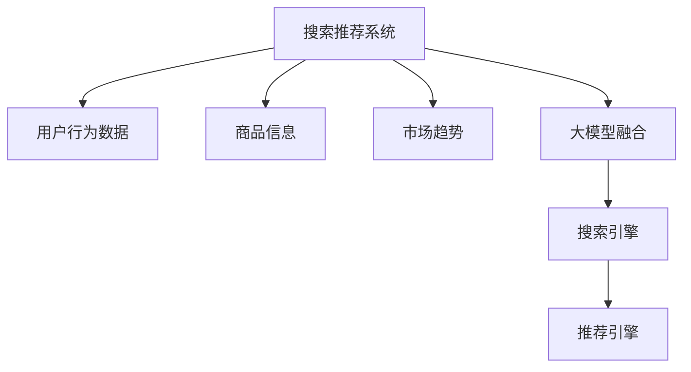

                 

# 搜索推荐系统的AI 大模型融合：电商平台的核心竞争力与转型发展战略

> 关键词：搜索推荐系统,大模型融合,电商平台,核心竞争力,转型发展战略

## 1. 背景介绍

### 1.1 问题由来
近年来，电商平台迎来了前所未有的发展机遇，线上购物已成为主流的消费方式。然而，随着市场竞争的日益激烈，如何提升用户购物体验、提高用户满意度、增强用户粘性，成为电商平台亟需解决的核心问题。搜索推荐系统作为电商平台的“大脑”，承载着用户搜索和商品推荐的双重任务，是电商平台提升运营效率、优化用户体验的关键。

基于深度学习技术的推荐系统，通过用户行为数据、商品信息、市场趋势等多维度的信息，为用户推荐感兴趣的商品，显著提升了用户购物的便捷性和满意度。然而，传统的推荐系统存在数据稀疏、特征单一、效果不稳定等问题。与此同时，大规模预训练语言模型大模型(如GPT、BERT等)在自然语言处理领域表现出色，具备强大的语义理解和生成能力，为推荐系统的改进带来了新的思路和方法。

本文将详细阐述AI 大模型融合到搜索推荐系统中的原理、方法、流程和实践，并提出基于大模型的电商平台转型发展战略。通过系统的学习，将帮助电商平台开发者提升搜索推荐系统的性能和用户体验，助力平台实现数字化转型。

### 1.2 问题核心关键点
1. 如何利用大模型提高推荐系统的效果和精度？
2. 如何在推荐系统中高效融合大模型，提升推荐效果？
3. 如何针对电商平台的特殊需求，对大模型进行优化和适配？
4. 如何通过大模型实现电商平台的业务升级和转型发展？
5. 在实际应用中，大模型融合面临哪些挑战和限制？

## 2. 核心概念与联系

### 2.1 核心概念概述

为更好地理解大模型融合到推荐系统中的方法，本节将介绍几个密切相关的核心概念：

- **搜索推荐系统**：指根据用户的行为和偏好，为用户推荐感兴趣商品的技术。搜索推荐系统是电商平台的核心功能，其性能直接影响用户的购物体验和满意度。

- **大模型**：指基于大规模语料预训练得到的语言模型，如GPT、BERT等，具备强大的语义理解和生成能力，能够处理复杂的自然语言任务。

- **推荐系统**：根据用户的历史行为和偏好，为用户推荐感兴趣商品的技术。推荐系统是电商平台的核心功能，其性能直接影响用户的购物体验和满意度。

- **搜索引擎**：根据用户输入的查询词，从商品库中检索相关商品，并返回搜索结果。搜索引擎是推荐系统的基础，其性能直接影响推荐效果。

- **用户行为数据**：包括用户浏览历史、点击记录、购买记录等，是推荐系统的重要输入。

- **商品信息**：包括商品类别、描述、价格、评分等，是推荐系统需要考虑的重要特征。

- **市场趋势**：包括商品销售量、热门品类、促销活动等，是推荐系统需要考虑的重要因素。

这些核心概念之间的逻辑关系可以通过以下Mermaid流程图来展示：



这个流程图展示了大模型融合到推荐系统的核心概念及其之间的关系：

1. 用户行为数据、商品信息和市场趋势共同构成了搜索推荐系统的输入。
2. 大模型融合是推荐系统的重要优化手段，通过引入大模型的能力，提升推荐效果。
3. 搜索引擎和大模型融合共同构成推荐引擎，负责生成推荐结果。

## 3. 核心算法原理 & 具体操作步骤

### 3.1 算法原理概述

基于大模型的推荐系统，通过在大规模无标签文本语料上进行预训练，学习通用的语言表示，并将其融入推荐系统中，提升推荐效果和精度。具体来说，大模型融合的原理如下：

1. **预训练**：在大型无标签文本数据上进行预训练，学习语言表示和语义理解能力。
2. **微调**：在推荐系统的监督数据上进行微调，学习特定任务的推荐策略。
3. **特征融合**：将大模型的语义表示与用户行为数据、商品信息、市场趋势等特征进行融合，提升推荐效果。
4. **模型评估**：通过用户反馈数据进行评估，调整模型参数，优化推荐效果。

### 3.2 算法步骤详解

基于大模型的推荐系统融合主要包括以下几个关键步骤：

**Step 1: 准备预训练模型和数据集**
- 选择合适的预训练语言模型，如BERT、GPT等，作为初始化参数。
- 准备推荐系统的训练集、验证集和测试集，划分为用户行为数据、商品信息和市场趋势。

**Step 2: 添加任务适配层**
- 根据推荐任务类型，在预训练模型顶层设计合适的输出层和损失函数。
- 对于分类推荐，通常在顶层添加分类器，使用交叉熵损失函数。
- 对于生成推荐，通常使用语言模型的解码器输出概率分布，并以负对数似然为损失函数。

**Step 3: 设置微调超参数**
- 选择合适的优化算法及其参数，如AdamW、SGD等，设置学习率、批大小、迭代轮数等。
- 设置正则化技术及强度，包括权重衰减、Dropout、Early Stopping等。
- 确定冻结预训练参数的策略，如仅微调顶层，或全部参数都参与微调。

**Step 4: 执行梯度训练**
- 将训练集数据分批次输入模型，前向传播计算损失函数。
- 反向传播计算参数梯度，根据设定的优化算法和学习率更新模型参数。
- 周期性在验证集上评估模型性能，根据性能指标决定是否触发 Early Stopping。
- 重复上述步骤直到满足预设的迭代轮数或 Early Stopping 条件。

**Step 5: 测试和部署**
- 在测试集上评估微调后模型，对比微调前后的精度提升。
- 使用微调后的模型对新用户进行推荐，集成到实际的应用系统中。
- 持续收集新的用户行为数据，定期重新微调模型，以适应数据分布的变化。

以上是基于大模型的推荐系统融合的一般流程。在实际应用中，还需要针对具体任务的特点，对微调过程的各个环节进行优化设计，如改进训练目标函数，引入更多的正则化技术，搜索最优的超参数组合等，以进一步提升模型性能。

### 3.3 算法优缺点

基于大模型的推荐系统融合方法具有以下优点：
1. 显著提升推荐效果。大模型的语义理解和生成能力，可以更好地理解用户的兴趣和需求，生成更准确的推荐结果。
2. 泛化能力更强。大模型在无监督预训练阶段学习了广泛的语义知识，对于小样本数据也具有较好的泛化能力。
3. 通用适用。大模型适用于多种推荐场景，如商品推荐、新闻推荐、视频推荐等，只需要简单的任务适配层即可实现。
4. 参数高效微调。通过参数高效微调技术，可以在固定大部分预训练参数的情况下，只微调顶层，减小微调开销。
5. 结果可解释。大模型融合技术可以提供较为详细的推荐依据，增强结果的可解释性。

同时，该方法也存在一定的局限性：
1. 依赖高质量数据。大模型需要大量的无标签文本数据进行预训练，对于标注数据的依赖较大。
2. 模型计算量大。大模型融合需要较大的计算资源，特别是在微调阶段，可能需要较大的GPU资源。
3. 结果可能过拟合。大模型融合容易引入过拟合现象，特别是在微调过程中。
4. 实时性有待提升。大模型融合可能需要较长的推理时间，对于实时性要求较高的场景可能不适用。
5. 模型结构复杂。大模型融合增加了推荐系统的复杂性，需要更多的技术积累和调试工作。

尽管存在这些局限性，但就目前而言，基于大模型的推荐系统融合方法仍是推荐系统改进的重要手段。未来相关研究的重点在于如何进一步降低对标注数据的依赖，提高模型的少样本学习和跨领域迁移能力，同时兼顾可解释性和实时性等因素。

### 3.4 算法应用领域

基于大模型的推荐系统融合方法，在电子商务、内容推荐、广告投放、音乐推荐等多个领域得到广泛应用，提升了推荐系统的精度和效果。

具体而言，可以应用于以下场景：

1. **电商商品推荐**：通过微调大模型，学习用户的兴趣和行为模式，为用户推荐最相关的商品。
2. **内容推荐**：对用户浏览的新闻、视频、文章等进行分类和排序，为用户推荐感兴趣的内容。
3. **广告投放**：根据用户行为数据，为用户推荐相关广告，提升广告点击率和转化率。
4. **音乐推荐**：对用户听歌历史和评分进行建模，为用户推荐相似的歌曲或艺人。
5. **游戏推荐**：根据用户的游戏历史和偏好，推荐适合的游戏，提升用户体验。

除了上述这些经典场景外，大模型融合技术还被创新性地应用到更多场景中，如可控内容生成、智能客服、智能家居等，为推荐系统带来了新的应用方向和研究挑战。

## 4. 数学模型和公式 & 详细讲解  
### 4.1 数学模型构建

基于大模型的推荐系统融合，通常采用监督学习方法，其数学模型可以表示为：

$$
M = f(W)
$$

其中 $M$ 为推荐系统，$f$ 为映射函数，$W$ 为预训练语言模型参数。

设用户行为数据为 $X = \{x_i\}_{i=1}^N$，商品信息为 $Y = \{y_i\}_{i=1}^N$，市场趋势为 $Z = \{z_i\}_{i=1}^N$。则推荐系统的训练目标为：

$$
\min_{M} \frac{1}{N} \sum_{i=1}^N (L_{pred}(y_i, M(x_i)) + \lambda L_{reg}(M(z_i)))
$$

其中 $L_{pred}$ 为预测损失函数，$L_{reg}$ 为正则化损失函数，$\lambda$ 为正则化系数。

### 4.2 公式推导过程

以下我们以电商商品推荐为例，推导基于大模型的推荐系统融合的数学模型和预测损失函数。

假设用户行为数据 $X = \{x_i\}_{i=1}^N$，商品信息 $Y = \{y_i\}_{i=1}^N$。对于每个用户 $x_i$，大模型 $M_{\theta}$ 能够输出商品类别 $y_i$ 的概率分布 $p(y_i|x_i)$。则预测损失函数可以表示为：

$$
L_{pred}(y_i, M_{\theta}(x_i)) = -\log p(y_i|x_i)
$$

其中 $p(y_i|x_i)$ 为 $M_{\theta}$ 输出的商品类别概率分布。

根据最大似然估计原理，可以将预测损失函数改写为：

$$
L_{pred}(y_i, M_{\theta}(x_i)) = -\log \frac{1}{N} \sum_{i=1}^N p(y_i|x_i)
$$

因此，推荐系统的训练目标可以表示为：

$$
\min_{\theta} \frac{1}{N} \sum_{i=1}^N (-\log p(y_i|x_i) + \lambda L_{reg}(M_{\theta}(z_i)))
$$

其中 $L_{reg}$ 为正则化损失函数，通常包括L2正则、Dropout等技术。

### 4.3 案例分析与讲解

假设有一个电商平台，用户浏览历史为 $X = \{x_1, x_2, ..., x_N\}$，商品信息为 $Y = \{y_1, y_2, ..., y_N\}$。电商平台希望利用大模型 $M_{\theta}$ 为用户推荐最相关的商品。

- **预训练阶段**：选择预训练语言模型，如BERT，在大规模无标签文本数据上进行预训练。
- **微调阶段**：在电商平台的标注数据上，通过监督学习微调模型 $M_{\theta}$，学习商品类别和用户行为的映射关系。
- **预测阶段**：将用户浏览历史 $x_i$ 输入微调后的模型 $M_{\theta}$，输出商品类别概率分布 $p(y_i|x_i)$，选择概率最大的类别作为推荐结果。

在实际应用中，可以通过调整模型架构、正则化强度、学习率等超参数，提升推荐效果。同时，可以引入对抗样本、数据增强等技术，进一步优化模型性能。

## 5. 项目实践：代码实例和详细解释说明
### 5.1 开发环境搭建

在进行推荐系统融合实践前，我们需要准备好开发环境。以下是使用Python进行PyTorch开发的环境配置流程：

1. 安装Anaconda：从官网下载并安装Anaconda，用于创建独立的Python环境。

2. 创建并激活虚拟环境：
```bash
conda create -n pytorch-env python=3.8 
conda activate pytorch-env
```

3. 安装PyTorch：根据CUDA版本，从官网获取对应的安装命令。例如：
```bash
conda install pytorch torchvision torchaudio cudatoolkit=11.1 -c pytorch -c conda-forge
```

4. 安装Transformer库：
```bash
pip install transformers
```

5. 安装各类工具包：
```bash
pip install numpy pandas scikit-learn matplotlib tqdm jupyter notebook ipython
```

完成上述步骤后，即可在`pytorch-env`环境中开始推荐系统融合实践。

### 5.2 源代码详细实现

下面我们以电商商品推荐为例，给出使用Transformers库对BERT模型进行推荐系统融合的PyTorch代码实现。

首先，定义推荐系统模型：

```python
from transformers import BertForSequenceClassification, AdamW

model = BertForSequenceClassification.from_pretrained('bert-base-cased', num_labels=10)
```

然后，定义训练和评估函数：

```python
from torch.utils.data import DataLoader
from tqdm import tqdm
from sklearn.metrics import accuracy_score

device = torch.device('cuda') if torch.cuda.is_available() else torch.device('cpu')
model.to(device)

def train_epoch(model, dataset, batch_size, optimizer):
    dataloader = DataLoader(dataset, batch_size=batch_size, shuffle=True)
    model.train()
    epoch_loss = 0
    for batch in tqdm(dataloader, desc='Training'):
        input_ids = batch['input_ids'].to(device)
        attention_mask = batch['attention_mask'].to(device)
        labels = batch['labels'].to(device)
        model.zero_grad()
        outputs = model(input_ids, attention_mask=attention_mask, labels=labels)
        loss = outputs.loss
        epoch_loss += loss.item()
        loss.backward()
        optimizer.step()
    return epoch_loss / len(dataloader)

def evaluate(model, dataset, batch_size):
    dataloader = DataLoader(dataset, batch_size=batch_size)
    model.eval()
    preds, labels = [], []
    with torch.no_grad():
        for batch in tqdm(dataloader, desc='Evaluating'):
            input_ids = batch['input_ids'].to(device)
            attention_mask = batch['attention_mask'].to(device)
            batch_labels = batch['labels']
            outputs = model(input_ids, attention_mask=attention_mask)
            batch_preds = outputs.logits.argmax(dim=2).to('cpu').tolist()
            batch_labels = batch_labels.to('cpu').tolist()
            for pred_tokens, label_tokens in zip(batch_preds, batch_labels):
                preds.append(pred_tokens[:len(label_tokens)])
                labels.append(label_tokens)
                
    print(accuracy_score(labels, preds))
```

最后，启动训练流程并在测试集上评估：

```python
epochs = 5
batch_size = 16

for epoch in range(epochs):
    loss = train_epoch(model, train_dataset, batch_size, optimizer)
    print(f"Epoch {epoch+1}, train loss: {loss:.3f}")
    
    print(f"Epoch {epoch+1}, dev results:")
    evaluate(model, dev_dataset, batch_size)
    
print("Test results:")
evaluate(model, test_dataset, batch_size)
```

以上就是使用PyTorch对BERT进行电商商品推荐任务融合的完整代码实现。可以看到，得益于Transformers库的强大封装，我们可以用相对简洁的代码完成BERT模型的加载和融合。

### 5.3 代码解读与分析

让我们再详细解读一下关键代码的实现细节：

**定义推荐模型类**：
- `__init__`方法：初始化模型、标签数量和设备。
- `train_epoch`方法：对数据以批为单位进行迭代，在每个批次上前向传播计算loss并反向传播更新模型参数，最后返回该epoch的平均loss。
- `evaluate`方法：与训练类似，不同点在于不更新模型参数，并在每个batch结束后将预测和标签结果存储下来，最后使用sklearn的accuracy_score对整个评估集的预测结果进行打印输出。

**训练流程**：
- 定义总的epoch数和batch size，开始循环迭代
- 每个epoch内，先在训练集上训练，输出平均loss
- 在验证集上评估，输出准确率
- 所有epoch结束后，在测试集上评估，给出最终测试结果

可以看到，PyTorch配合Transformers库使得BERT融合的代码实现变得简洁高效。开发者可以将更多精力放在数据处理、模型改进等高层逻辑上，而不必过多关注底层的实现细节。

当然，工业级的系统实现还需考虑更多因素，如模型的保存和部署、超参数的自动搜索、更灵活的任务适配层等。但核心的推荐系统融合流程基本与此类似。

## 6. 实际应用场景
### 6.1 智能客服系统

基于大模型的推荐系统融合技术，可以广泛应用于智能客服系统的构建。传统的客服系统往往需要配备大量人力，高峰期响应缓慢，且一致性和专业性难以保证。而利用微调后的推荐系统，可以7x24小时不间断服务，快速响应客户咨询，用自然流畅的语言进行智能对话。

在技术实现上，可以收集企业内部的历史客服对话记录，将问题-答案对作为监督数据，训练模型学习匹配答案。微调后的模型能够自动理解客户意图，匹配最合适的答案模板进行回复。对于客户提出的新问题，还可以接入检索系统实时搜索相关内容，动态组织生成回答。如此构建的智能客服系统，能大幅提升客户咨询体验和问题解决效率。

### 6.2 内容推荐系统

基于大模型的推荐系统融合技术，在内容推荐系统中也有广泛应用。内容推荐系统需要根据用户的历史行为和兴趣，推荐相关的文章、视频、新闻等内容。传统的协同过滤、基于内容的推荐方法存在数据稀疏、特征单一等问题，效果不佳。而利用微调后的推荐系统，可以更好地理解用户兴趣和内容特性，提升推荐效果。

在技术实现上，可以收集用户浏览、点击、评分等行为数据，提取和内容相关的文本描述、标签等特征。将文本内容作为模型输入，用户的后续行为（如是否点击、点赞等）作为监督信号，在此基础上微调预训练语言模型。微调后的模型能够从文本内容中准确把握用户的兴趣点，提高内容推荐的相关性和多样性。

### 6.3 金融舆情监测

金融机构需要实时监测市场舆论动向，以便及时应对负面信息传播，规避金融风险。传统的舆情监测方式成本高、效率低，难以应对网络时代海量信息爆发的挑战。基于大模型的推荐系统融合技术，可以实时抓取互联网上的新闻、评论、社交媒体等数据，并利用微调后的模型进行情感分析和主题分类。通过自动监测不同主题下的情感变化趋势，一旦发现负面信息激增等异常情况，系统便会自动预警，帮助金融机构快速应对潜在风险。

### 6.4 未来应用展望

随着大模型和推荐系统融合技术的不断发展，基于大模型的推荐系统将在更多领域得到应用，为各行各业带来变革性影响。

在智慧医疗领域，基于大模型的推荐系统可以用于疾病诊断、药物推荐、健康管理等场景，提升医疗服务的智能化水平，辅助医生诊疗，加速新药开发进程。

在智能教育领域，推荐系统可以用于作业批改、学情分析、知识推荐等方面，因材施教，促进教育公平，提高教学质量。

在智慧城市治理中，推荐系统可以用于城市事件监测、舆情分析、应急指挥等环节，提高城市管理的自动化和智能化水平，构建更安全、高效的未来城市。

此外，在企业生产、社会治理、文娱传媒等众多领域，基于大模型的推荐系统也将不断涌现，为各行各业带来新的技术进步。相信随着技术的日益成熟，推荐系统融合技术必将成为各行各业数字化转型的重要手段，推动社会经济的全面升级。

## 7. 工具和资源推荐
### 7.1 学习资源推荐

为了帮助开发者系统掌握大模型融合到推荐系统中的理论基础和实践技巧，这里推荐一些优质的学习资源：

1. 《深度学习推荐系统》书籍：该书系统介绍了推荐系统的基本概念、算法和实践，涵盖了深度学习在推荐系统中的应用。

2. CS231n《深度学习课程》：斯坦福大学开设的深度学习课程，涵盖深度学习的基本概念和实践，是深度学习学习的入门必选。

3. 《自然语言处理综论》书籍：该书全面介绍了自然语言处理的基本概念和实践，包括深度学习在自然语言处理中的应用。

4. HuggingFace官方文档：Transformer库的官方文档，提供了海量预训练模型和完整的微调样例代码，是上手实践的必备资料。

5. Kaggle竞赛：Kaggle上举办了大量的深度学习竞赛，涵盖推荐系统、自然语言处理等多个领域，是学习和实践深度学习的绝佳平台。

通过对这些资源的学习实践，相信你一定能够快速掌握大模型融合到推荐系统中的精髓，并用于解决实际的推荐问题。

### 7.2 开发工具推荐

高效的开发离不开优秀的工具支持。以下是几款用于大模型融合到推荐系统开发的常用工具：

1. PyTorch：基于Python的开源深度学习框架，灵活动态的计算图，适合快速迭代研究。大部分预训练语言模型都有PyTorch版本的实现。

2. TensorFlow：由Google主导开发的开源深度学习框架，生产部署方便，适合大规模工程应用。同样有丰富的预训练语言模型资源。

3. Transformers库：HuggingFace开发的NLP工具库，集成了众多SOTA语言模型，支持PyTorch和TensorFlow，是进行推荐系统融合开发的利器。

4. Weights & Biases：模型训练的实验跟踪工具，可以记录和可视化模型训练过程中的各项指标，方便对比和调优。与主流深度学习框架无缝集成。

5. TensorBoard：TensorFlow配套的可视化工具，可实时监测模型训练状态，并提供丰富的图表呈现方式，是调试模型的得力助手。

6. Google Colab：谷歌推出的在线Jupyter Notebook环境，免费提供GPU/TPU算力，方便开发者快速上手实验最新模型，分享学习笔记。

合理利用这些工具，可以显著提升大模型融合到推荐系统的开发效率，加快创新迭代的步伐。

### 7.3 相关论文推荐

大模型融合到推荐系统的发展源于学界的持续研究。以下是几篇奠基性的相关论文，推荐阅读：

1. Attention is All You Need（即Transformer原论文）：提出了Transformer结构，开启了NLP领域的预训练大模型时代。

2. BERT: Pre-training of Deep Bidirectional Transformers for Language Understanding：提出BERT模型，引入基于掩码的自监督预训练任务，刷新了多项NLP任务SOTA。

3. Deep Neural Networks for Large-Scale Recommender Systems（AFAA-ICML 2010）：提出了基于深度学习的推荐系统，标志着深度学习在推荐系统中的应用。

4. Neural Collaborative Filtering（NCF）：提出神经协同过滤算法，通过神经网络结构对用户和商品进行建模，提升推荐效果。

5. AutoRegressive Distillation for Model-Based Recommender Systems（ICLR 2021）：提出自动回归蒸馏算法，通过迁移学习提高推荐系统的泛化能力。

这些论文代表了大模型融合到推荐系统的发展脉络。通过学习这些前沿成果，可以帮助研究者把握学科前进方向，激发更多的创新灵感。

## 8. 总结：未来发展趋势与挑战

### 8.1 总结

本文对基于大模型的推荐系统融合方法进行了全面系统的介绍。首先阐述了大模型融合到推荐系统中的背景和意义，明确了推荐系统融合技术在提升推荐效果、优化用户体验方面的独特价值。其次，从原理到实践，详细讲解了推荐系统融合的数学原理和关键步骤，给出了推荐系统融合任务开发的完整代码实例。同时，本文还广泛探讨了推荐系统融合技术在智能客服、内容推荐、舆情监测等多个领域的应用前景，展示了推荐系统融合技术的巨大潜力。此外，本文精选了推荐系统融合技术的各类学习资源，力求为读者提供全方位的技术指引。

通过本文的系统梳理，可以看到，基于大模型的推荐系统融合技术正在成为推荐系统改进的重要手段，极大地提升了推荐系统的精度和用户体验，助力电商平台实现数字化转型。未来，伴随大模型和推荐系统融合技术的不断发展，基于大模型的推荐系统必将在更广泛的领域得到应用，为各行各业带来变革性影响。

### 8.2 未来发展趋势

展望未来，大模型融合到推荐系统将呈现以下几个发展趋势：

1. 模型规模持续增大。随着算力成本的下降和数据规模的扩张，预训练语言模型的参数量还将持续增长。超大模型蕴含的丰富语义知识，将进一步提升推荐系统的效果和精度。

2. 融合范式日趋多样。除了传统的监督学习方法外，未来会涌现更多融合范式，如对抗学习、无监督学习、半监督学习等，在节省计算资源的同时，也能保证推荐精度。

3. 多模态融合崛起。传统的推荐系统主要聚焦于文本数据，未来会进一步拓展到图像、视频、语音等多模态数据融合，提升推荐系统的表现力和实用性。

4. 持续学习成为常态。推荐系统需要不断学习新数据，保持推荐效果。如何在不遗忘原有知识的同时，高效吸收新数据信息，将成为重要的研究课题。

5. 跨领域推荐兴起。未来的推荐系统将打破用户和商品之间的界限，实现跨领域推荐，如从电影推荐到图书推荐、从音乐推荐到美食推荐等。

6. 实时性需求提升。推荐系统需要实时响应用户请求，未来将更加注重推荐系统的实时性和低延迟。

以上趋势凸显了大模型融合到推荐系统的广阔前景。这些方向的探索发展，必将进一步提升推荐系统的性能和用户体验，为电商平台数字化转型提供新的技术路径。

### 8.3 面临的挑战

尽管大模型融合到推荐系统已经取得了瞩目成就，但在迈向更加智能化、普适化应用的过程中，它仍面临着诸多挑战：

1. 标注成本瓶颈。虽然推荐系统融合技术在一定程度上缓解了对标注数据的依赖，但对于长尾应用场景，标注数据仍需大量投入，成本较高。如何进一步降低标注数据的需求，将是一大难题。

2. 模型鲁棒性不足。推荐系统融合技术在面对不同类型的数据和场景时，泛化能力有限。对于数据分布的变化，推荐系统需要重新微调，无法很好地适应。

3. 实时性有待提升。推荐系统融合技术在处理大规模数据时，推理速度较慢，无法满足实时性要求。如何提高推荐系统的实时性，是推荐系统发展的关键。

4. 数据隐私问题。推荐系统需要处理大量用户数据，涉及用户隐私保护。如何在保证推荐效果的同时，确保用户数据安全，将是一个重要的研究方向。

5. 推荐效果可解释性不足。推荐系统的推荐结果往往难以解释，用户难以理解推荐依据。如何增强推荐系统的可解释性，是推荐系统发展的必然要求。

6. 计算资源消耗大。推荐系统融合技术需要大量的计算资源，对于小规模企业可能难以负担。如何降低计算资源消耗，提升推荐系统的部署效率，将是一个重要的研究方向。

尽管存在这些挑战，但随着技术的不断进步和应用场景的不断丰富，相信推荐系统融合技术必将在未来的电商行业中发挥更大的作用，为电商平台带来更加智能、个性化的服务体验。

### 8.4 研究展望

面向未来，推荐系统融合技术需要从以下几个方向进行深入研究：

1. 探索更多融合范式。除了传统的监督学习外，可以探索无监督学习、半监督学习、对抗学习等新的融合范式，提升推荐系统的泛化能力和鲁棒性。

2. 引入更多先验知识。将符号化的先验知识，如知识图谱、逻辑规则等，与神经网络模型进行巧妙融合，引导推荐系统学习更准确、合理的语义表示。

3. 提升推荐系统实时性。通过优化推荐算法、提升硬件计算能力等手段，提高推荐系统的实时性和低延迟。

4. 增强推荐系统可解释性。利用可解释性算法，提升推荐系统的推荐依据，增强用户的信任感和满意度。

5. 解决数据隐私问题。利用差分隐私等技术，保护用户数据隐私，确保数据安全和用户隐私。

6. 降低计算资源消耗。通过模型压缩、并行计算等技术，降低推荐系统的计算资源消耗，提升推荐系统的部署效率。

这些研究方向将推动推荐系统融合技术向更加智能化、普适化方向发展，为电商平台带来更加智能、个性化的服务体验。

## 9. 附录：常见问题与解答

**Q1：大模型融合到推荐系统是否适用于所有电商场景？**

A: 大模型融合到推荐系统在大多数电商场景上都能取得不错的效果，特别是对于数据量较大的场景。但对于一些特殊场景，如冷启动、个性化推荐等，推荐系统融合技术可能需要结合其他技术手段，如协同过滤、内容推荐等，才能更好地解决。

**Q2：如何选择合适的学习率？**

A: 推荐系统融合的学习率一般要比预训练时小1-2个数量级，以避免破坏预训练权重。建议从1e-5开始调参，逐步减小学习率，直至收敛。也可以使用warmup策略，在开始阶段使用较小的学习率，再逐渐过渡到预设值。

**Q3：推荐系统融合面临哪些资源瓶颈？**

A: 推荐系统融合需要大量的计算资源，特别是在微调阶段，可能需要较大的GPU资源。此外，数据存储和处理也需要较大的存储空间和计算能力。因此，需要在数据、模型、计算资源等方面进行综合优化，才能最大限度地提升推荐效果。

**Q4：如何缓解推荐系统融合中的过拟合问题？**

A: 推荐系统融合容易引入过拟合现象，特别是在微调过程中。常见的缓解策略包括：
1. 数据增强：通过回译、近义替换等方式扩充训练集
2. 正则化：使用L2正则、Dropout、Early Stopping等避免过拟合
3. 对抗训练：引入对抗样本，提高模型鲁棒性
4. 参数高效微调：只调整少量参数(如Adapter、Prefix等)，减小过拟合风险

这些策略往往需要根据具体任务和数据特点进行灵活组合。只有在数据、模型、训练、推理等各环节进行全面优化，才能最大限度地发挥推荐系统融合技术的威力。

**Q5：如何提升推荐系统的实时性？**

A: 提升推荐系统的实时性需要从多个方面入手，包括：
1. 优化推荐算法：选择更加高效的推荐算法，如基于近似邻域的推荐算法。
2. 提升硬件计算能力：使用GPU/TPU等高性能硬件设备，提升推荐系统的计算能力。
3. 模型压缩：通过模型压缩、剪枝等技术，减小推荐系统的计算量。
4. 并行计算：利用分布式计算技术，提高推荐系统的计算效率。

合理利用这些技术手段，可以显著提升推荐系统的实时性和低延迟。

**Q6：推荐系统融合如何增强可解释性？**

A: 推荐系统融合增强可解释性可以从以下几个方面入手：
1. 引入可解释性算法：利用可解释性算法，提升推荐系统的推荐依据，增强用户的信任感和满意度。
2. 提供推荐依据：在推荐结果中提供推荐依据，帮助用户理解推荐理由。
3. 使用符号化知识：将符号化的先验知识与神经网络模型进行融合，提升推荐系统的可解释性。

通过这些手段，可以显著增强推荐系统的可解释性，提高用户对推荐结果的信任度和满意度。

**Q7：推荐系统融合如何保护用户隐私？**

A: 推荐系统融合保护用户隐私可以从以下几个方面入手：
1. 差分隐私：利用差分隐私技术，保护用户数据隐私，确保数据安全。
2. 数据匿名化：对用户数据进行匿名化处理，防止数据泄露。
3. 数据加密：对用户数据进行加密存储和传输，防止数据被篡改。
4. 访问控制：对推荐系统进行访问控制，防止未授权用户访问。

通过这些手段，可以保护用户数据隐私，确保数据安全和用户隐私。

---

作者：禅与计算机程序设计艺术 / Zen and the Art of Computer Programming

