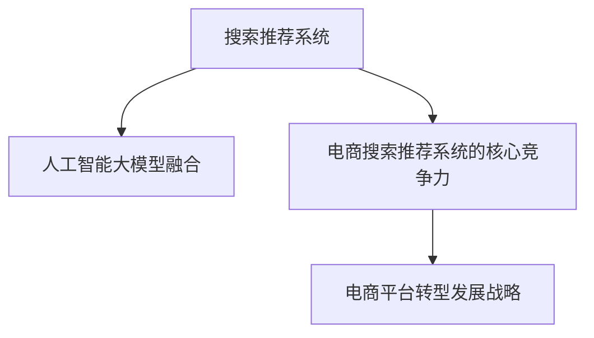

                 

# 搜索推荐系统的AI 大模型融合：电商平台的核心竞争力与转型发展战略

> 关键词：搜索推荐系统, 电商平台, 人工智能大模型, AI 融合, 核心竞争力, 转型发展战略

## 1. 背景介绍

随着互联网和电商的迅猛发展，平台之间的竞争日益激烈。如何利用先进的技术手段，提高用户购物体验，增加平台粘性，提升转化率，成为电商平台的核心竞争力之一。其中，搜索推荐系统作为连接用户和商品的重要桥梁，已经成为各大电商平台竞争的关键焦点。

近年来，人工智能技术特别是大模型的兴起，为电商平台提供了全新的发展思路。通过融合AI大模型，搜索推荐系统能够更好地理解和预测用户需求，实时推荐个性化商品，从而显著提升平台的转化率和用户体验。但大模型技术在电商搜索推荐中的应用还处于探索阶段，如何更高效地融合AI大模型，提高搜索推荐系统的性能，成为电商平台转型升级的重要课题。

## 2. 核心概念与联系

### 2.1 核心概念概述

为更好地理解大模型在电商平台中的应用，本节将介绍几个密切相关的核心概念：

- 搜索推荐系统：用于帮助用户快速找到所需商品的系统。通过用户的查询和浏览行为，推荐系统能够实时生成个性化商品列表。
- 人工智能大模型(AI Large Models)：以自回归(如GPT)或自编码(如BERT)模型为代表的大规模预训练语言模型。通过在大规模无标签文本语料上进行预训练，学习通用的语言表示，具备强大的语言理解和生成能力。
- 搜索推荐系统的大模型融合：指将预训练语言模型融合到搜索推荐系统中，通过微调或迁移学习，提升推荐系统的性能和效果。
- 电商搜索推荐系统的核心竞争力：指通过高效的搜索推荐系统，提升用户体验、增加平台粘性、提高转化率，从而在竞争中取得优势。
- 电商平台转型发展战略：指电商平台利用最新技术手段，从传统模式向智能化、个性化、社交化等方向转型的战略规划。

这些核心概念之间的逻辑关系可以通过以下Mermaid流程图来展示：



这个流程图展示了大模型融合搜索推荐系统的核心概念及其之间的关系：

1. 搜索推荐系统通过用户行为数据生成个性化推荐。
2. 融合大模型后，推荐系统具备更强的理解能力和预测能力，生成更加精准的推荐结果。
3. 通过提升用户体验，增加平台粘性，提高转化率，搜索推荐系统成为电商平台的竞争核心。
4. 利用大模型融合技术，电商平台能够持续优化用户体验，保持竞争优势，实施转型发展战略。

## 3. 核心算法原理 & 具体操作步骤
### 3.1 算法原理概述

大模型在电商搜索推荐系统中的应用，主要基于两个核心思想：一是利用大模型理解用户查询意图和商品描述，二是利用大模型预测用户对推荐结果的反馈。具体而言，算法原理如下：

**意图理解**：利用预训练语言模型对用户查询和商品描述进行编码，得到高维语义表示。通过相似度计算，匹配最相关的商品和搜索结果。

**反馈预测**：利用预训练语言模型对用户对推荐结果的反馈（如点击、购买、评分等）进行编码，得到高维语义表示。通过训练模型，预测用户对其他商品的反馈，从而优化推荐结果。

### 3.2 算法步骤详解

大模型在电商搜索推荐系统中的融合，主要分为以下几个关键步骤：

**Step 1: 准备数据集和预训练模型**

- 收集用户行为数据，包括搜索记录、浏览历史、点击记录等，构建训练集和测试集。
- 选择合适的预训练模型，如BERT、GPT等，作为初始化参数。

**Step 2: 特征提取与意图理解**

- 对用户查询和商品描述进行分词、编码，利用BERT等模型提取语义特征。
- 计算用户查询和商品描述之间的相似度，选择最相关的商品作为推荐结果。

**Step 3: 反馈预测与模型训练**

- 对用户对推荐结果的反馈进行编码，利用预训练模型进行特征提取。
- 构建反馈预测模型，训练模型以预测用户对其他商品的反馈。
- 利用反馈预测结果，调整推荐算法，提升推荐系统性能。

**Step 4: 模型评估与优化**

- 在测试集上评估推荐系统的性能，如准确率、召回率、F1值等。
- 根据评估结果，优化模型参数，提高推荐系统的效果。
- 不断迭代训练，持续优化模型。

### 3.3 算法优缺点

大模型融合电商搜索推荐系统具有以下优点：

1. **理解能力强**：大模型能够理解复杂的自然语言描述，提取用户意图和商品特征，生成更精准的推荐结果。
2. **泛化能力强**：大模型通过预训练学习到丰富的语言知识，具备良好的泛化能力，适应多种场景。
3. **个性化推荐**：大模型能够根据用户历史行为和实时行为，生成个性化推荐，提升用户体验。
4. **实时更新**：大模型融合系统能够实时更新模型参数，保持推荐系统的时效性和准确性。

但同时，该方法也存在以下局限性：

1. **计算资源要求高**：大模型需要大量的计算资源进行训练和推理，对硬件设施提出较高要求。
2. **数据隐私风险**：用户行为数据涉及隐私，如何保护用户数据安全，是融合大模型时的重要问题。
3. **模型复杂度高**：大模型融合系统往往结构复杂，维护和调优难度大。
4. **实时性问题**：大模型推理速度较慢，实时推荐性能受限。
5. **成本高**：预训练模型和模型训练成本较高，初期投入大。

尽管存在这些局限性，但大模型融合搜索推荐系统在提升用户体验、增加平台粘性、提高转化率方面具有显著优势，成为电商平台转型升级的重要手段。

### 3.4 算法应用领域

大模型融合搜索推荐系统已经在多个电商领域得到应用，例如：

- **个性化推荐**：通过融合大模型，提升个性化推荐系统的性能，实现商品精准匹配。
- **搜索排序**：利用大模型理解用户查询意图，优化搜索结果排序，提升搜索体验。
- **广告推荐**：根据用户行为和兴趣，动态调整广告推荐策略，提高广告投放效果。
- **情感分析**：利用大模型进行用户评论和反馈的情感分析，评估商品和服务的用户满意度。
- **智能客服**：结合大模型和自然语言处理技术，实现智能客服系统，提升客户体验。
- **库存管理**：利用大模型预测用户需求，优化库存管理，减少库存积压。
- **跨域推荐**：融合大模型和跨域推荐技术，实现不同平台间的商品推荐，拓展推荐边界。

除了这些经典应用，大模型融合搜索推荐系统还在更多领域显示出其巨大潜力，为电商平台提供了新的发展方向。

## 4. 数学模型和公式 & 详细讲解  
### 4.1 数学模型构建

大模型融合电商搜索推荐系统的数学模型主要包含以下几个部分：

1. **用户查询表示**：利用预训练语言模型对用户查询进行编码，得到用户查询向量 $u$。
2. **商品描述表示**：利用预训练语言模型对商品描述进行编码，得到商品向量 $v$。
3. **相似度计算**：计算用户查询向量 $u$ 和商品向量 $v$ 的余弦相似度 $s(u,v)$。
4. **反馈预测模型**：利用预训练语言模型对用户对推荐结果的反馈进行编码，得到反馈向量 $f$。
5. **推荐排序**：根据相似度 $s(u,v)$ 和反馈预测 $f$，对推荐结果进行排序。

### 4.2 公式推导过程

以基于BERT的电商搜索推荐系统为例，推导上述数学模型中的关键公式。

**用户查询表示**：

$$
u = \text{BERT}(u)
$$

**商品描述表示**：

$$
v = \text{BERT}(v)
$$

**相似度计算**：

$$
s(u,v) = \frac{u^T v}{||u|| \cdot ||v||}
$$

**反馈预测模型**：

假设用户对推荐结果 $r$ 的反馈为 $y$，则反馈预测模型 $F$ 的形式为：

$$
y = F(r; \theta)
$$

其中 $\theta$ 为模型参数。

**推荐排序**：

推荐结果排序函数 $S$ 的形式为：

$$
S(r_i; u, v, f) = \alpha s(u,v_i) + \beta f(r_i)
$$

其中 $\alpha$ 和 $\beta$ 为权重系数，控制相似度 $s(u,v_i)$ 和反馈预测 $f(r_i)$ 的重要性。

### 4.3 案例分析与讲解

以电商平台对用户评论情感分析为例，讲解如何利用大模型融合系统生成推荐结果。

**步骤 1：数据准备**

- 收集用户评论数据，构建训练集和测试集。
- 将用户评论数据分为正负两类，标注情感标签。

**步骤 2：预训练模型**

- 选择合适的预训练模型，如BERT，作为初始化参数。
- 对用户评论进行编码，得到情感向量。

**步骤 3：情感预测**

- 利用预训练模型进行情感分类，预测用户评论的情感标签。
- 将情感标签编码为向量形式，作为反馈向量 $f$。

**步骤 4：推荐排序**

- 利用用户查询向量 $u$ 和商品向量 $v$，计算相似度 $s(u,v)$。
- 将情感向量 $f$ 作为反馈预测，调整推荐排序函数 $S$，生成个性化推荐列表。

**步骤 5：模型评估**

- 在测试集上评估推荐系统的性能，如准确率、召回率、F1值等。
- 根据评估结果，调整模型参数，优化推荐系统。

## 5. 项目实践：代码实例和详细解释说明
### 5.1 开发环境搭建

在进行大模型融合搜索推荐系统的开发前，我们需要准备好开发环境。以下是使用Python进行PyTorch开发的环境配置流程：

1. 安装Anaconda：从官网下载并安装Anaconda，用于创建独立的Python环境。

2. 创建并激活虚拟环境：
```bash
conda create -n pytorch-env python=3.8 
conda activate pytorch-env
```

3. 安装PyTorch：根据CUDA版本，从官网获取对应的安装命令。例如：
```bash
conda install pytorch torchvision torchaudio cudatoolkit=11.1 -c pytorch -c conda-forge
```

4. 安装Transformers库：
```bash
pip install transformers
```

5. 安装各类工具包：
```bash
pip install numpy pandas scikit-learn matplotlib tqdm jupyter notebook ipython
```

完成上述步骤后，即可在`pytorch-env`环境中开始大模型融合搜索推荐系统的开发。

### 5.2 源代码详细实现

下面我们以电商推荐系统为例，给出使用Transformers库对BERT模型进行融合的PyTorch代码实现。

首先，定义推荐系统数据处理函数：

```python
from transformers import BertTokenizer
from torch.utils.data import Dataset
import torch

class RecommendationDataset(Dataset):
    def __init__(self, user_queries, item_descriptions, item_feedbacks, tokenizer, max_len=128):
        self.user_queries = user_queries
        self.item_descriptions = item_descriptions
        self.item_feedbacks = item_feedbacks
        self.tokenizer = tokenizer
        self.max_len = max_len
        
    def __len__(self):
        return len(self.user_queries)
    
    def __getitem__(self, item):
        user_query = self.user_queries[item]
        item_description = self.item_descriptions[item]
        item_feedback = self.item_feedbacks[item]
        
        encoding = self.tokenizer(user_query, return_tensors='pt', max_length=self.max_len, padding='max_length', truncation=True)
        item_encoding = self.tokenizer(item_description, return_tensors='pt', max_length=self.max_len, padding='max_length', truncation=True)
        
        # 对token-wise的反馈进行编码
        encoded_feedback = [feedback2id[feedback] for feedback in item_feedback] 
        encoded_feedback.extend([feedback2id['O']] * (self.max_len - len(encoded_feedback)))
        labels = torch.tensor(encoded_feedback, dtype=torch.long)
        
        return {'input_ids': encoding['input_ids'][0],
                'attention_mask': encoding['attention_mask'][0],
                'item_ids': item_encoding['input_ids'][0],
                'item_masks': item_encoding['attention_mask'][0],
                'labels': labels}

# 标签与id的映射
feedback2id = {'O': 0, 'Positive': 1, 'Negative': 2}
id2feedback = {v: k for k, v in feedback2id.items()}

# 创建dataset
tokenizer = BertTokenizer.from_pretrained('bert-base-cased')

train_dataset = RecommendationDataset(train_user_queries, train_item_descriptions, train_item_feedbacks, tokenizer)
dev_dataset = RecommendationDataset(dev_user_queries, dev_item_descriptions, dev_item_feedbacks, tokenizer)
test_dataset = RecommendationDataset(test_user_queries, test_item_descriptions, test_item_feedbacks, tokenizer)
```

然后，定义模型和优化器：

```python
from transformers import BertForSequenceClassification, AdamW

model = BertForSequenceClassification.from_pretrained('bert-base-cased', num_labels=len(feedback2id))

optimizer = AdamW(model.parameters(), lr=2e-5)
```

接着，定义训练和评估函数：

```python
from torch.utils.data import DataLoader
from tqdm import tqdm
from sklearn.metrics import classification_report

device = torch.device('cuda') if torch.cuda.is_available() else torch.device('cpu')
model.to(device)

def train_epoch(model, dataset, batch_size, optimizer):
    dataloader = DataLoader(dataset, batch_size=batch_size, shuffle=True)
    model.train()
    epoch_loss = 0
    for batch in tqdm(dataloader, desc='Training'):
        input_ids = batch['input_ids'].to(device)
        attention_mask = batch['attention_mask'].to(device)
        item_ids = batch['item_ids'].to(device)
        item_masks = batch['item_masks'].to(device)
        labels = batch['labels'].to(device)
        model.zero_grad()
        outputs = model(input_ids, attention_mask=attention_mask, labels=labels, item_ids=item_ids, item_masks=item_masks)
        loss = outputs.loss
        epoch_loss += loss.item()
        loss.backward()
        optimizer.step()
    return epoch_loss / len(dataloader)

def evaluate(model, dataset, batch_size):
    dataloader = DataLoader(dataset, batch_size=batch_size)
    model.eval()
    preds, labels = [], []
    with torch.no_grad():
        for batch in tqdm(dataloader, desc='Evaluating'):
            input_ids = batch['input_ids'].to(device)
            attention_mask = batch['attention_mask'].to(device)
            item_ids = batch['item_ids'].to(device)
            item_masks = batch['item_masks'].to(device)
            batch_labels = batch['labels']
            outputs = model(input_ids, attention_mask=attention_mask, labels=batch_labels, item_ids=item_ids, item_masks=item_masks)
            batch_preds = outputs.logits.argmax(dim=2).to('cpu').tolist()
            batch_labels = batch_labels.to('cpu').tolist()
            for pred_tokens, label_tokens in zip(batch_preds, batch_labels):
                pred_tags = [id2feedback[_id] for _id in pred_tokens]
                label_tags = [id2feedback[_id] for _id in label_tokens]
                preds.append(pred_tags[:len(label_tokens)])
                labels.append(label_tags)
                
    print(classification_report(labels, preds))
```

最后，启动训练流程并在测试集上评估：

```python
epochs = 5
batch_size = 16

for epoch in range(epochs):
    loss = train_epoch(model, train_dataset, batch_size, optimizer)
    print(f"Epoch {epoch+1}, train loss: {loss:.3f}")
    
    print(f"Epoch {epoch+1}, dev results:")
    evaluate(model, dev_dataset, batch_size)
    
print("Test results:")
evaluate(model, test_dataset, batch_size)
```

以上就是使用PyTorch对BERT进行电商推荐系统融合的完整代码实现。可以看到，得益于Transformers库的强大封装，我们可以用相对简洁的代码完成BERT模型的加载和融合。

### 5.3 代码解读与分析

让我们再详细解读一下关键代码的实现细节：

**RecommendationDataset类**：
- `__init__`方法：初始化用户查询、商品描述、商品反馈等关键组件。
- `__len__`方法：返回数据集的样本数量。
- `__getitem__`方法：对单个样本进行处理，将用户查询和商品描述输入编码为token ids，将商品反馈编码为数字，并对其进行定长padding，最终返回模型所需的输入。

**feedback2id和id2feedback字典**：
- 定义了反馈与数字id之间的映射关系，用于将token-wise的预测结果解码回真实的反馈标签。

**训练和评估函数**：
- 使用PyTorch的DataLoader对数据集进行批次化加载，供模型训练和推理使用。
- 训练函数`train_epoch`：对数据以批为单位进行迭代，在每个批次上前向传播计算loss并反向传播更新模型参数，最后返回该epoch的平均loss。
- 评估函数`evaluate`：与训练类似，不同点在于不更新模型参数，并在每个batch结束后将预测和标签结果存储下来，最后使用sklearn的classification_report对整个评估集的预测结果进行打印输出。

**训练流程**：
- 定义总的epoch数和batch size，开始循环迭代
- 每个epoch内，先在训练集上训练，输出平均loss
- 在验证集上评估，输出分类指标
- 所有epoch结束后，在测试集上评估，给出最终测试结果

可以看到，PyTorch配合Transformers库使得BERT融合搜索推荐系统的代码实现变得简洁高效。开发者可以将更多精力放在数据处理、模型改进等高层逻辑上，而不必过多关注底层的实现细节。

当然，工业级的系统实现还需考虑更多因素，如模型的保存和部署、超参数的自动搜索、更灵活的任务适配层等。但核心的融合范式基本与此类似。

## 6. 实际应用场景
### 6.1 智能客服系统

基于大模型融合的搜索推荐系统，可以广泛应用于智能客服系统的构建。传统客服往往需要配备大量人力，高峰期响应缓慢，且一致性和专业性难以保证。而使用融合大模型的搜索推荐系统，可以7x24小时不间断服务，快速响应客户咨询，用自然流畅的语言解答各类常见问题。

在技术实现上，可以收集企业内部的历史客服对话记录，将问题和最佳答复构建成监督数据，在此基础上对预训练搜索推荐系统进行融合微调。融合微调后的系统能够自动理解用户意图，匹配最合适的答案模板进行回复。对于客户提出的新问题，还可以接入检索系统实时搜索相关内容，动态组织生成回答。如此构建的智能客服系统，能大幅提升客户咨询体验和问题解决效率。

### 6.2 金融舆情监测

金融机构需要实时监测市场舆论动向，以便及时应对负面信息传播，规避金融风险。传统的人工监测方式成本高、效率低，难以应对网络时代海量信息爆发的挑战。基于大模型融合的文本分类和情感分析技术，为金融舆情监测提供了新的解决方案。

具体而言，可以收集金融领域相关的新闻、报道、评论等文本数据，并对其进行主题标注和情感标注。在此基础上对预训练语言模型进行融合微调，使其能够自动判断文本属于何种主题，情感倾向是正面、中性还是负面。将融合微调后的模型应用到实时抓取的网络文本数据，就能够自动监测不同主题下的情感变化趋势，一旦发现负面信息激增等异常情况，系统便会自动预警，帮助金融机构快速应对潜在风险。

### 6.3 个性化推荐系统

当前的推荐系统往往只依赖用户的历史行为数据进行物品推荐，无法深入理解用户的真实兴趣偏好。基于大模型融合的个性化推荐系统可以更好地挖掘用户行为背后的语义信息，从而提供更精准、多样的推荐内容。

在实践中，可以收集用户浏览、点击、评论、分享等行为数据，提取和用户交互的物品标题、描述、标签等文本内容。将文本内容作为模型输入，用户的后续行为（如是否点击、购买等）作为监督信号，在此基础上融合预训练语言模型进行微调。融合微调后的模型能够从文本内容中准确把握用户的兴趣点。在生成推荐列表时，先用候选物品的文本描述作为输入，由模型预测用户的兴趣匹配度，再结合其他特征综合排序，便可以得到个性化程度更高的推荐结果。

### 6.4 未来应用展望

随着大模型技术的发展，基于大模型融合的搜索推荐系统将在更多领域得到应用，为传统行业带来变革性影响。

在智慧医疗领域，基于融合大模型的医疗问答、病历分析、药物研发等应用将提升医疗服务的智能化水平，辅助医生诊疗，加速新药开发进程。

在智能教育领域，融合大模型的推荐系统可应用于作业批改、学情分析、知识推荐等方面，因材施教，促进教育公平，提高教学质量。

在智慧城市治理中，融合大模型的推荐系统可应用于城市事件监测、舆情分析、应急指挥等环节，提高城市管理的自动化和智能化水平，构建更安全、高效的未来城市。

此外，在企业生产、社会治理、文娱传媒等众多领域，基于融合大模型的推荐系统也将不断涌现，为经济社会发展注入新的动力。相信随着技术的日益成熟，融合大模型搜索推荐系统必将在更广阔的应用领域大放异彩，深刻影响人类的生产生活方式。

## 7. 工具和资源推荐
### 7.1 学习资源推荐

为了帮助开发者系统掌握大模型融合搜索推荐系统的理论基础和实践技巧，这里推荐一些优质的学习资源：

1. 《深度学习自然语言处理》系列博文：由大模型技术专家撰写，深入浅出地介绍了深度学习在NLP中的应用，包括融合大模型技术。

2. 斯坦福大学《自然语言处理》课程：系统讲授NLP的基本概念和前沿技术，涵盖了大模型融合的多个方面。

3. 《深度学习框架PyTorch》书籍：详细介绍PyTorch框架的使用，包括大模型融合系统的实现。

4. 《Transformers与NLP》书籍：深入讲解Transformer模型在大模型融合中的应用。

5. 《自然语言处理实战》系列书籍：提供大量实战案例，展示大模型融合技术的实际应用效果。

通过对这些资源的学习实践，相信你一定能够快速掌握大模型融合搜索推荐系统的精髓，并用于解决实际的NLP问题。
### 7.2 开发工具推荐

高效的开发离不开优秀的工具支持。以下是几款用于大模型融合搜索推荐系统开发的常用工具：

1. PyTorch：基于Python的开源深度学习框架，灵活动态的计算图，适合快速迭代研究。大部分预训练语言模型都有PyTorch版本的实现。

2. TensorFlow：由Google主导开发的开源深度学习框架，生产部署方便，适合大规模工程应用。同样有丰富的预训练语言模型资源。

3. Transformers库：HuggingFace开发的NLP工具库，集成了众多SOTA语言模型，支持PyTorch和TensorFlow，是进行大模型融合的利器。

4. Weights & Biases：模型训练的实验跟踪工具，可以记录和可视化模型训练过程中的各项指标，方便对比和调优。与主流深度学习框架无缝集成。

5. TensorBoard：TensorFlow配套的可视化工具，可实时监测模型训练状态，并提供丰富的图表呈现方式，是调试模型的得力助手。

6. Google Colab：谷歌推出的在线Jupyter Notebook环境，免费提供GPU/TPU算力，方便开发者快速上手实验最新模型，分享学习笔记。

合理利用这些工具，可以显著提升大模型融合搜索推荐系统的开发效率，加快创新迭代的步伐。

### 7.3 相关论文推荐

大模型融合搜索推荐系统的发展源于学界的持续研究。以下是几篇奠基性的相关论文，推荐阅读：

1. Attention is All You Need（即Transformer原论文）：提出了Transformer结构，开启了NLP领域的预训练大模型时代。

2. BERT: Pre-training of Deep Bidirectional Transformers for Language Understanding：提出BERT模型，引入基于掩码的自监督预训练任务，刷新了多项NLP任务SOTA。

3. Large-Scale Pre-training of Language Models for Plagiarism Detection（Jiuming Zhang et al.）：展示了大规模语言模型在检测学术不端行为中的潜在应用。

4. Domain-Agnostic Pre-trained Language Models for Domain-specific NLP Tasks（Kaiming He et al.）：提出了一种跨领域预训练方法，能够在大规模无标注数据上进行预训练，并用于特定领域的微调。

5. Pre-training and Few-shot Learning for Text Generation（Han Xiao et al.）：提出一种预训练和少样本学习的方法，利用大模型生成高质量的文本，仅需少量标注数据即可。

这些论文代表了大模型融合搜索推荐系统的发展脉络。通过学习这些前沿成果，可以帮助研究者把握学科前进方向，激发更多的创新灵感。

## 8. 总结：未来发展趋势与挑战
### 8.1 总结

本文对基于大模型融合的搜索推荐系统进行了全面系统的介绍。首先阐述了大模型融合搜索推荐系统的研究背景和意义，明确了融合大模型在提升用户体验、增加平台粘性、提高转化率方面的独特价值。其次，从原理到实践，详细讲解了融合大模型的数学模型和关键步骤，给出了融合搜索推荐系统的完整代码实例。同时，本文还广泛探讨了融合大模型在智能客服、金融舆情、个性化推荐等多个行业领域的应用前景，展示了融合大模型的巨大潜力。此外，本文精选了融合大模型的各类学习资源，力求为读者提供全方位的技术指引。

通过本文的系统梳理，可以看到，基于大模型融合的搜索推荐系统已经成为电商平台转型升级的重要手段，通过更好的理解和预测用户需求，实时推荐个性化商品，从而显著提升平台的转化率和用户体验。未来，伴随大模型技术和融合方法的不断演进，搜索推荐系统将进一步优化，为电商平台的智能化、个性化、社交化等方向提供更强的支持。

### 8.2 未来发展趋势

展望未来，大模型融合搜索推荐系统将呈现以下几个发展趋势：

1. **规模化应用**：随着大模型技术的发展，融合大模型将在更多行业得到广泛应用，如医疗、教育、金融等，提升各行业的智能化水平。

2. **实时性提升**：利用大模型高效推理技术，融合搜索推荐系统将进一步提升实时推荐性能，提供更加即时的用户体验。

3. **跨域推荐**：融合大模型与跨域推荐技术，实现不同平台间的商品推荐，拓展推荐边界，提升推荐系统覆盖面。

4. **情感理解**：融合大模型结合情感分析技术，提升推荐系统的情感理解能力，生成更符合用户情感偏好的推荐内容。

5. **个性化推荐**：融合大模型结合多模态数据融合技术，生成更加个性化和多样化的推荐内容，提升用户体验。

6. **公平性保障**：融合大模型结合公平性分析，优化推荐策略，避免数据偏见和歧视，确保推荐系统的公平性和公正性。

以上趋势凸显了大模型融合搜索推荐系统的广阔前景。这些方向的探索发展，必将进一步提升搜索推荐系统的性能和效果，为电商平台带来新的发展机遇。

### 8.3 面临的挑战

尽管大模型融合搜索推荐系统在提升用户体验、增加平台粘性、提高转化率方面具有显著优势，但在迈向更加智能化、个性化、社交化应用的过程中，它仍面临着诸多挑战：

1. **计算资源瓶颈**：大模型需要大量的计算资源进行训练和推理，硬件设施和成本问题亟需解决。

2. **数据隐私风险**：用户行为数据涉及隐私，如何保护用户数据安全，是融合大模型时的重要问题。

3. **模型复杂度高**：融合大模型系统结构复杂，维护和调优难度大。

4. **实时性问题**：大模型推理速度较慢，实时推荐性能受限。

5. **成本高**：预训练模型和模型训练成本较高，初期投入大。

尽管存在这些局限性，但大模型融合搜索推荐系统在提升用户体验、增加平台粘性、提高转化率方面具有显著优势，成为电商平台转型升级的重要手段。

### 8.4 研究展望

面对大模型融合搜索推荐系统所面临的挑战，未来的研究需要在以下几个方面寻求新的突破：

1. **轻量化模型**：开发更轻量级的模型结构，如Transformer等，减少计算资源消耗，提升实时推荐性能。

2. **隐私保护技术**：采用隐私保护技术，如差分隐私、联邦学习等，保护用户数据隐私。

3. **模型优化技术**：开发高效的模型优化技术，如知识蒸馏、模型剪枝等，降低模型复杂度，提高模型效率。

4. **多模态融合**：结合多模态数据融合技术，提升推荐系统的覆盖面和效果。

5. **公平性研究**：研究公平性评估指标，优化推荐策略，确保推荐系统的公平性和公正性。

这些研究方向将引领大模型融合搜索推荐系统的未来发展，通过技术创新和优化，克服现有挑战，实现更高效、更精准、更公平的推荐系统，为电商平台提供更优质的服务。

## 9. 附录：常见问题与解答

**Q1：大模型融合搜索推荐系统是否适用于所有NLP任务？**

A: 大模型融合搜索推荐系统在大多数NLP任务上都能取得不错的效果，特别是对于数据量较小的任务。但对于一些特定领域的任务，如医学、法律等，仅仅依靠通用语料预训练的模型可能难以很好地适应。此时需要在特定领域语料上进一步预训练，再进行融合微调，才能获得理想效果。此外，对于一些需要时效性、个性化很强的任务，如对话、推荐等，融合大模型方法也需要针对性的改进优化。

**Q2：融合大模型时的计算资源要求有哪些？**

A: 融合大模型需要大量的计算资源进行训练和推理，对硬件设施提出较高要求。GPU/TPU等高性能设备是必不可少的，但即便如此，超大批次的训练和推理也可能遇到显存不足的问题。因此需要采用一些资源优化技术，如梯度积累、混合精度训练、模型并行等，来突破硬件瓶颈。同时，模型的存储和读取也可能占用大量时间和空间，需要采用模型压缩、稀疏化存储等方法进行优化。

**Q3：如何缓解融合大模型时的数据隐私风险？**

A: 在融合大模型的过程中，用户行为数据涉及隐私，如何保护用户数据安全，是融合大模型时的重要问题。常用的隐私保护技术包括差分隐私、联邦学习等。差分隐私通过对数据进行噪声扰动，使得攻击者无法恢复个人隐私信息。联邦学习通过分布式训练，将数据保存在本地，仅在模型参数上传和下载时进行通信，保护数据隐私。此外，数据匿名化和访问控制等措施也可以有效保护用户隐私。

**Q4：融合大模型时的实时性问题如何解决？**

A: 大模型推理速度较慢，实时推荐性能受限。为解决这一问题，可以采用以下方法：
1. 模型剪枝和压缩：去除不必要的层和参数，减小模型尺寸，加快推理速度。
2. 模型量化：将浮点模型转为定点模型，压缩存储空间，提高计算效率。
3. 分布式训练和推理：利用分布式计算资源，加速训练和推理过程。
4. 缓存机制：利用缓存机制，减少重复计算，提升推理效率。
5. 模型加速器：采用专门的硬件加速器，如TPU，提升推理速度。

**Q5：融合大模型时的成本控制有哪些方法？**

A: 融合大模型和模型训练成本较高，初期投入大。为降低成本，可以采用以下方法：
1. 模型压缩和剪枝：减少模型参数量，减小模型尺寸，降低计算成本。
2. 模型并行：利用分布式计算资源，加速训练和推理过程，降低计算成本。
3. 模型加速器：采用专门的硬件加速器，如TPU，提高推理速度，降低计算成本。
4. 模型共享：在多模型之间共享模型参数，减少重复计算，降低训练成本。
5. 模型蒸馏：利用预训练模型进行知识蒸馏，生成轻量级模型，降低计算成本。

这些方法可以在不牺牲性能的前提下，显著降低融合大模型的成本，提高模型部署效率。

---

作者：禅与计算机程序设计艺术 / Zen and the Art of Computer Programming

