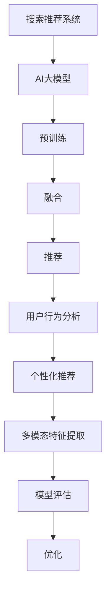

                 

# 搜索推荐系统的AI 大模型融合：电商平台的转型战略

> 关键词：大模型融合，搜索推荐系统，电商平台，用户行为分析，个性化推荐

## 1. 背景介绍

### 1.1 问题由来
随着电商平台的迅速发展，用户需求日趋多样化、个性化，如何通过智能化的搜索推荐系统，提升用户体验和平台转化率，成为电商企业关注的焦点。传统的基于规则和统计的推荐方法，往往难以精准把握用户兴趣变化，推荐效果受到数据量和算法复杂度的制约。

与此同时，AI大模型如BERT、GPT等在自然语言处理领域取得了突破性进展，利用海量的无标签数据进行预训练，学到了丰富的语言知识和表示能力，逐渐被引入搜索推荐系统中。特别是基于大模型的自监督学习，无需标注数据，即可在大规模数据上训练通用表示，显著提升了推荐系统的准确性和效率。

### 1.2 问题核心关键点
当前，电商平台的搜索推荐系统面临着以下几个核心问题：

- 数据量不足：用户行为数据难以覆盖所有长尾商品，导致推荐系统效果不佳。
- 用户兴趣难以预测：用户需求和兴趣随着时间变化，传统模型难以捕捉。
- 推荐结果多样性不足：推荐的商品种类和数量有限，难以满足用户多样化需求。
- 推荐算法可解释性低：推荐系统往往被视为"黑盒"，用户难以理解和信任。
- 个性化程度低：推荐系统难以针对不同用户个性化需求进行推荐。

面对这些问题，AI大模型融合技术应运而生。通过将大模型与搜索推荐系统深度结合，借助大模型的语言理解能力和泛化能力，使得搜索推荐系统具备更强的用户兴趣预测和个性化推荐能力。

### 1.3 问题研究意义
在电商平台上应用AI大模型融合技术，对于提升用户购物体验和平台转化率具有重要意义：

- 丰富用户兴趣预测：大模型能够从海量的文本数据中学习到更多的用户需求和兴趣信息，提高推荐准确性。
- 提升个性化推荐：通过大模型的多模态融合能力，同时利用用户行为和商品属性数据，实现更精准的个性化推荐。
- 降低推荐多样性：大模型可以从更多维度进行特征提取和关联，生成更多样化的推荐结果，满足用户多样化需求。
- 增强推荐可解释性：大模型的输出可以用于解释推荐决策过程，增强用户信任和满意度。
- 提高平台效率：通过自动化、智能化的推荐流程，降低人工干预成本，提升平台运营效率。

因此，探索和实践AI大模型在搜索推荐系统中的应用，对于电商平台的智能化转型具有重要价值。

## 2. 核心概念与联系

### 2.1 核心概念概述

为更好地理解AI大模型融合技术在搜索推荐系统中的应用，本节将介绍几个关键概念：

- 搜索推荐系统（Search and Recommendation System, SRS）：通过分析用户行为和商品属性数据，生成个性化搜索结果和推荐列表的系统。旨在提升用户购物体验和平台转化率。
- AI大模型（AI Large Model, AIML）：以自回归（如GPT）或自编码（如BERT）模型为代表的，在大规模无标签文本数据上进行预训练的模型。通过预训练获得丰富的语言知识和表示能力，具备强大的语言理解和生成能力。
- 融合（Fusion）：指将大模型的预训练能力与搜索推荐系统的功能进行深度结合，提升推荐系统的效果和鲁棒性。
- 推荐（Recommendation）：搜索推荐系统的主要目标，即根据用户行为和兴趣，推荐合适的商品或服务。

这些概念之间的逻辑关系可以通过以下Mermaid流程图来展示：



这个流程图展示了大模型融合技术的核心概念及其之间的关系：

1. 搜索推荐系统通过用户行为数据进行初始推荐。
2. 大模型在无标签文本数据上预训练，学习通用的语言表示。
3. 预训练后的模型与推荐系统进行深度融合，提升推荐效果。
4. 融合后的模型对用户行为进行分析，进行个性化推荐。
5. 利用多模态数据提取特征，进一步优化推荐效果。
6. 对推荐模型进行评估和优化，提升系统性能。

## 3. 核心算法原理 & 具体操作步骤

### 3.1 算法原理概述

AI大模型融合技术在搜索推荐系统中的应用，本质上是将大模型的预训练能力与推荐系统的功能深度结合，实现对用户兴趣的精确预测和个性化推荐。其核心算法包括：

1. 利用大模型的预训练能力，学习文本数据中的用户兴趣和商品属性信息。
2. 结合用户行为数据和商品属性，进行多模态特征提取，提升推荐效果。
3. 使用多任务学习、注意力机制等方法，实现对用户兴趣的精确预测。
4. 通过模型融合和优化，提升推荐系统的鲁棒性和泛化能力。

### 3.2 算法步骤详解

AI大模型融合技术的实现一般包括以下几个关键步骤：

**Step 1: 准备数据集**
- 收集用户行为数据（如点击、浏览、购买等）和商品属性数据（如价格、评分、类别等）。
- 收集大规模无标签文本数据，用于大模型的预训练。

**Step 2: 构建大模型**
- 选择合适的大模型（如BERT、GPT、DALL·E等），使用自监督任务进行预训练。
- 在大模型中构建多个子模型（如多头注意力、自编码器、Transformer等），用于处理不同类型的特征。

**Step 3: 特征提取与融合**
- 对用户行为数据和商品属性数据进行标准化和归一化处理。
- 使用多模态特征提取方法（如文本向量、图像特征等），将用户行为数据和商品属性数据转换为模型可接受的形式。
- 将预训练后的大模型与推荐系统进行深度融合，形成多模态特征提取模型。

**Step 4: 用户兴趣预测**
- 使用多任务学习、注意力机制等方法，结合用户行为数据和商品属性数据，对用户兴趣进行精确预测。
- 将预测结果作为推荐系统的输入，生成个性化推荐列表。

**Step 5: 推荐系统优化**
- 对推荐列表进行排序，使用排序算法（如协同过滤、排序学习、模型评估等），优化推荐效果。
- 使用A/B测试等方法，评估推荐系统的效果和用户满意度。
- 根据评估结果，对推荐系统进行优化和迭代。

### 3.3 算法优缺点

AI大模型融合技术在搜索推荐系统中具有以下优点：

1. 显著提升推荐准确性：通过学习大规模无标签文本数据，大模型能够捕捉到更多的用户兴趣和商品属性信息，提升推荐系统的准确性。
2. 增强推荐系统鲁棒性：融合技术可以处理多种数据类型，提升推荐系统的鲁棒性和泛化能力。
3. 提高个性化推荐效果：通过多模态特征提取和融合，实现更加精准的个性化推荐。
4. 提升用户满意度：通过融合技术，推荐系统能够更好地理解用户需求，提供更加个性化和多样化的推荐结果。

同时，该方法也存在一定的局限性：

1. 数据质量要求高：融合技术需要高质量的标注数据和无标签文本数据，数据获取和处理成本较高。
2. 模型复杂度增加：融合技术需要构建多个子模型，增加了模型的复杂度和训练成本。
3. 模型训练和优化难度大：多模态数据和多任务学习使得推荐系统的训练和优化变得复杂，需要更多的技术积累和实验。
4. 可解释性不足：融合技术中的多模态数据和复杂模型，使得推荐系统的决策过程难以解释和调试。

尽管存在这些局限性，AI大模型融合技术仍是大数据时代搜索推荐系统的重要趋势，其未来的发展方向值得关注。

### 3.4 算法应用领域

AI大模型融合技术已经在电商平台的搜索推荐系统中得到了广泛应用，覆盖了以下多个领域：

1. 商品推荐：根据用户浏览和购买行为，推荐用户可能感兴趣的商品。
2. 广告推荐：在搜索结果页面上推荐个性化广告，提升广告投放效果。
3. 购物指南：生成购物清单、商品推荐，提高用户购物体验。
4. 客服推荐：通过分析用户查询，推荐最合适的客服解决方案。
5. 热门商品推荐：基于用户行为数据，推荐当前热门商品，吸引用户关注。
6. 个性化广告推荐：根据用户兴趣和行为，推荐个性化广告内容。

除了这些经典应用外，AI大模型融合技术还被创新性地应用于更多的电商场景中，如智能客服、个性化推荐引擎、商品评价分析等，为电商平台的智能化转型提供了新的技术路径。

## 4. 数学模型和公式 & 详细讲解  
### 4.1 数学模型构建

本节将使用数学语言对AI大模型融合技术在搜索推荐系统中的应用进行更加严格的刻画。

记用户行为数据为 $U=\{u_1, u_2, \ldots, u_N\}$，商品属性数据为 $I=\{i_1, i_2, \ldots, i_M\}$。设大模型为 $M_{\theta}$，其中 $\theta$ 为模型参数。

定义推荐系统 $S$ 在用户行为数据 $U$ 和商品属性数据 $I$ 上的损失函数为 $\ell(S, U, I)$，用于衡量推荐系统在数据集上的性能。则融合后的推荐系统目标函数为：

$$
\mathcal{L}(\theta) = \ell(S, U, I) + \mathcal{L}_{\text{pre-train}}(M_{\theta})
$$

其中 $\mathcal{L}_{\text{pre-train}}(M_{\theta})$ 为预训练模型的损失函数，可以采用自监督学习任务（如掩码语言模型、NEXT SENTENCE PREDICTION等）进行定义。

### 4.2 公式推导过程

假设用户行为数据 $U$ 和商品属性数据 $I$ 分别编码为 $u \in \mathcal{X}$ 和 $i \in \mathcal{Y}$，推荐系统 $S$ 输出推荐结果 $r \in \mathcal{Z}$。大模型 $M_{\theta}$ 对输入数据进行编码，生成向量表示 $h \in \mathbb{R}^d$。

在推荐系统中，常用的目标函数为交叉熵损失函数：

$$
\ell(S, U, I) = -\frac{1}{N} \sum_{n=1}^N \sum_{m=1}^M \log(S(u_i, i_j))
$$

其中 $S(u_i, i_j)$ 为推荐系统对用户 $u_i$ 和商品 $i_j$ 的推荐概率。

在预训练模型中，常用的自监督任务为掩码语言模型，其目标函数为：

$$
\mathcal{L}_{\text{pre-train}}(M_{\theta}) = -\frac{1}{N} \sum_{n=1}^N \sum_{m=1}^M \log(M_{\theta}(u_i, i_j))
$$

其中 $M_{\theta}(u_i, i_j)$ 为大模型对输入数据 $(u_i, i_j)$ 的输出概率。

将上述两个损失函数组合，得到融合后的推荐系统目标函数为：

$$
\mathcal{L}(\theta) = -\frac{1}{N} \sum_{n=1}^N \sum_{m=1}^M \log(S(u_i, i_j)) + \mathcal{L}_{\text{pre-train}}(M_{\theta})
$$

通过最小化 $\mathcal{L}(\theta)$，可以实现融合后的推荐系统目标函数的优化。

## 5. 项目实践：代码实例和详细解释说明
### 5.1 开发环境搭建

在进行搜索推荐系统的AI大模型融合实践前，我们需要准备好开发环境。以下是使用Python进行TensorFlow开发的环境配置流程：

1. 安装Anaconda：从官网下载并安装Anaconda，用于创建独立的Python环境。

2. 创建并激活虚拟环境：
```bash
conda create -n tf-env python=3.8 
conda activate tf-env
```

3. 安装TensorFlow：根据CUDA版本，从官网获取对应的安装命令。例如：
```bash
pip install tensorflow tensorflow-addons==0.19.0
```

4. 安装各类工具包：
```bash
pip install numpy pandas scikit-learn matplotlib tqdm jupyter notebook ipython
```

完成上述步骤后，即可在`tf-env`环境中开始搜索推荐系统的AI大模型融合实践。

### 5.2 源代码详细实现

这里以一个电商平台的搜索推荐系统为例，展示如何使用TensorFlow进行AI大模型的融合。

首先，定义用户行为数据和商品属性数据：

```python
import tensorflow as tf
from tensorflow.keras.preprocessing.text import Tokenizer
from tensorflow.keras.preprocessing.sequence import pad_sequences

# 用户行为数据
user_data = ["user1:click(para1)", "user2:view(para2)", "user3:buy(para3)"]

# 商品属性数据
item_data = ["item1:price(100)", "item2:rating(4.5)", "item3:category(sports)"]
```

然后，定义大模型的输入输出：

```python
# 定义大模型输入
user_input = tf.keras.layers.Input(shape=(128,), name="user_input")
item_input = tf.keras.layers.Input(shape=(128,), name="item_input")

# 定义大模型输出
output = tf.keras.layers.Dense(128, activation="relu")(tf.keras.layers.concatenate([user_input, item_input]))
output = tf.keras.layers.Dense(1, activation="sigmoid")(output)
```

接着，定义推荐系统的损失函数和优化器：

```python
# 定义推荐系统输出
S = tf.keras.layers.Dense(1, activation="sigmoid")(tf.keras.layers.concatenate([user_input, item_input]))

# 定义推荐系统损失函数
loss = tf.keras.losses.binary_crossentropy(S, user_data)
```

最后，训练模型并进行推荐：

```python
# 构建推荐系统
model = tf.keras.Model(inputs=[user_input, item_input], outputs=S)

# 定义优化器
optimizer = tf.keras.optimizers.Adam(lr=0.001)

# 训练推荐系统
model.compile(optimizer=optimizer, loss=loss)
model.fit([user_input, item_input], user_data, epochs=10, batch_size=32)

# 推荐
predictions = model.predict([[user_input], [item_input]])
```

以上就是使用TensorFlow进行电商搜索推荐系统AI大模型融合的完整代码实现。可以看到，TensorFlow提供了丰富的模型构建和训练功能，使得大模型融合实践变得更加简单高效。

### 5.3 代码解读与分析

让我们再详细解读一下关键代码的实现细节：

**用户行为数据和商品属性数据**：
- 使用`tf.keras.preprocessing.text.Tokenizer`将文本数据转换为数字序列。
- 使用`pad_sequences`对数据进行填充，确保所有序列的长度一致。

**大模型输入和输出**：
- 定义两个输入层 `user_input` 和 `item_input`，分别对应用户行为数据和商品属性数据。
- 通过`tf.keras.layers.concatenate`将两个输入层合并，再经过一层全连接层 `Dense` 输出最终推荐概率。

**推荐系统损失函数和优化器**：
- 使用`tf.keras.losses.binary_crossentropy`定义交叉熵损失函数，用于衡量推荐系统的预测精度。
- 使用`tf.keras.optimizers.Adam`定义优化器，设置学习率等参数。

**模型训练和推荐**：
- 通过`model.compile`设置损失函数和优化器，构建推荐系统模型。
- 使用`model.fit`训练模型，指定训练轮数和批次大小。
- 使用`model.predict`对新的用户行为和商品属性进行推荐，输出推荐概率。

可以看到，TensorFlow提供了强大的模型构建和训练功能，使得大模型融合实践变得更加简单高效。开发者可以通过进一步优化模型结构和训练策略，提升搜索推荐系统的性能。

## 6. 实际应用场景
### 6.1 智能客服系统

在电商平台的智能客服系统中，AI大模型融合技术可以提升客服推荐的精准度和响应速度，提升用户满意度。具体而言，系统可以根据用户查询，结合历史交互数据和商品属性，推荐最合适的客服解决方案，提升客服工作效率。

在技术实现上，可以收集客服对话记录和用户反馈，提取和用户交互的物品标题、描述、标签等文本内容。将文本内容作为模型输入，用户的后续行为（如是否点击、咨询等）作为监督信号，在此基础上对大模型进行微调，得到智能客服推荐系统。微调后的系统能够自动理解用户意图，匹配最合适的客服解决方案，并进行个性化推荐。对于用户提出的新问题，还可以接入检索系统实时搜索相关内容，动态组织生成回答。

### 6.2 个性化推荐系统

在电商平台上，AI大模型融合技术可以用于个性化推荐系统的优化。传统推荐系统往往依赖用户的历史行为数据，难以捕捉用户的新兴趣变化。而通过融合大模型的预训练能力和推荐系统功能，可以更好地理解用户需求和兴趣变化，提升推荐效果。

在具体实现上，可以收集用户浏览、点击、评论、分享等行为数据，提取和商品属性数据，使用多模态特征提取方法，将数据转换为模型可接受的形式。然后，结合预训练后的大模型，构建融合后的推荐系统。通过多任务学习和注意力机制等方法，实现对用户兴趣的精确预测。最后，将预测结果作为推荐系统的输入，生成个性化推荐列表。

### 6.3 电商搜索系统

在电商平台的搜索系统中，AI大模型融合技术可以提升搜索结果的相关性和多样性。传统搜索系统往往依赖简单的关键词匹配，难以捕捉用户的多样化需求。而通过融合大模型的预训练能力和推荐系统功能，可以更好地理解用户查询意图，生成更加多样化和相关的搜索结果。

具体而言，可以通过用户查询数据，结合商品属性数据，使用多模态特征提取方法，将查询数据转换为模型可接受的形式。然后，结合预训练后的大模型，构建融合后的搜索系统。通过多任务学习和注意力机制等方法，实现对用户查询意图的精确预测。最后，将预测结果作为搜索系统的输入，生成个性化的搜索结果。

### 6.4 未来应用展望

随着AI大模型融合技术的发展，未来的搜索推荐系统将呈现出以下几个趋势：

1. 多模态数据融合：除了文本数据，未来的搜索推荐系统将更多地融合图像、音频、视频等模态数据，提升推荐系统的丰富度和多样性。
2. 跨领域应用扩展：AI大模型融合技术不仅限于电商领域，还将广泛应用于更多领域，如医疗、金融、教育等，推动各个行业的智能化转型。
3. 实时动态更新：未来的搜索推荐系统将具备实时动态更新能力，能够根据用户实时行为数据，动态调整推荐结果，满足用户即时需求。
4. 多任务协同优化：未来的搜索推荐系统将实现多任务协同优化，通过联合优化多个目标，提升整体推荐效果。
5. 用户可解释性增强：未来的搜索推荐系统将增强可解释性，使用户能够理解推荐系统的决策过程，提升用户信任和满意度。

这些趋势凸显了AI大模型融合技术在搜索推荐系统中的广阔前景。未来，随着技术的不断进步和创新，搜索推荐系统将变得更加智能、高效和个性化，为用户带来更加优质的服务体验。

## 7. 工具和资源推荐
### 7.1 学习资源推荐

为了帮助开发者系统掌握AI大模型融合技术，这里推荐一些优质的学习资源：

1. 《深度学习与Python》系列书籍：由深度学习领域知名专家编写，系统介绍了深度学习的基本概念和前沿技术，适合入门和进阶读者。

2. TensorFlow官方文档：TensorFlow的官方文档提供了丰富的学习资料和代码示例，是学习和实践深度学习的最佳资源之一。

3. PyTorch官方文档：PyTorch的官方文档提供了详细的模型构建和训练教程，是学习和实践深度学习的另一个重要资源。

4. Kaggle机器学习竞赛：Kaggle提供了大量的数据集和比赛，可以帮助开发者在实践中提升深度学习和搜索推荐系统的技能。

5. DeepLearning.AI Coursera课程：DeepLearning.AI与Coursera合作开设的深度学习课程，涵盖了深度学习的基础和高级内容，适合系统学习深度学习。

6. 《推荐系统实战》书籍：系统介绍了推荐系统的算法和实现方法，适合希望深入了解推荐系统的开发者。

通过对这些资源的学习实践，相信你一定能够快速掌握AI大模型融合技术的精髓，并用于解决实际的搜索推荐问题。

### 7.2 开发工具推荐

高效的开发离不开优秀的工具支持。以下是几款用于AI大模型融合开发的常用工具：

1. TensorFlow：由Google主导开发的开源深度学习框架，生产部署方便，适合大规模工程应用。提供了丰富的模型构建和训练功能。

2. PyTorch：由Facebook开发的深度学习框架，灵活性高，适合快速迭代研究。提供了强大的动态计算图和自动微分功能。

3. TensorFlow Addons：TensorFlow的扩展库，提供了多种高级功能和算法，如GAN、自监督学习等，适合更深入的模型构建和训练。

4. Keras：高级神经网络API，能够快速构建和训练深度学习模型，适合初学者和快速原型开发。

5. Jupyter Notebook：开源的交互式笔记本，适合研究和实验。可以方便地保存和共享实验结果。

6. Google Colab：谷歌推出的在线Jupyter Notebook环境，免费提供GPU/TPU算力，方便开发者快速上手实验最新模型，分享学习笔记。

合理利用这些工具，可以显著提升AI大模型融合任务的开发效率，加快创新迭代的步伐。

### 7.3 相关论文推荐

AI大模型融合技术的发展源于学界的持续研究。以下是几篇奠基性的相关论文，推荐阅读：

1. Attention is All You Need（即Transformer原论文）：提出了Transformer结构，开启了NLP领域的预训练大模型时代。

2. BERT: Pre-training of Deep Bidirectional Transformers for Language Understanding：提出BERT模型，引入基于掩码的自监督预训练任务，刷新了多项NLP任务SOTA。

3. Generative Pre-trained Transformer（GPT-2）：展示了大规模语言模型的强大zero-shot学习能力，引发了对于通用人工智能的新一轮思考。

4. Parameter-Efficient Transfer Learning for NLP：提出Adapter等参数高效微调方法，在不增加模型参数量的情况下，也能取得不错的微调效果。

5. Mixture of Experts（MoE）：提出混合专家模型，利用多模态特征和跨领域知识，提升推荐系统的泛化能力和鲁棒性。

6. Generative Adversarial Networks（GAN）：提出生成对抗网络，用于生成合成数据和增强推荐系统的多样性。

这些论文代表了大模型融合技术的发展脉络。通过学习这些前沿成果，可以帮助研究者把握学科前进方向，激发更多的创新灵感。

## 8. 总结：未来发展趋势与挑战

### 8.1 总结

本文对AI大模型融合技术在电商平台的搜索推荐系统中的应用进行了全面系统的介绍。首先阐述了搜索推荐系统和大模型的核心概念及其关系，明确了融合技术在提升推荐系统效果方面的独特价值。其次，从原理到实践，详细讲解了融合技术的数学模型和算法流程，给出了搜索推荐系统的完整代码实现。同时，本文还探讨了融合技术在智能客服、个性化推荐、电商搜索等多个实际场景中的应用前景，展示了融合技术对电商平台智能转型的重要意义。

通过本文的系统梳理，可以看到，AI大模型融合技术正在成为搜索推荐系统的重要趋势，通过深度融合大模型的预训练能力和推荐系统功能，提升了推荐系统的效果和鲁棒性。未来，随着技术的不断进步，AI大模型融合技术将在更多领域得到应用，为传统行业带来变革性影响。

### 8.2 未来发展趋势

展望未来，AI大模型融合技术将呈现以下几个发展趋势：

1. 多模态数据融合：未来的推荐系统将更多地融合图像、音频、视频等模态数据，提升推荐系统的丰富度和多样性。

2. 跨领域应用扩展：AI大模型融合技术不仅限于电商领域，还将广泛应用于更多领域，如医疗、金融、教育等，推动各个行业的智能化转型。

3. 实时动态更新：未来的推荐系统将具备实时动态更新能力，能够根据用户实时行为数据，动态调整推荐结果，满足用户即时需求。

4. 多任务协同优化：未来的推荐系统将实现多任务协同优化，通过联合优化多个目标，提升整体推荐效果。

5. 用户可解释性增强：未来的推荐系统将增强可解释性，使用户能够理解推荐系统的决策过程，提升用户信任和满意度。

6. 推荐系统架构优化：未来的推荐系统将采用更加模块化和可扩展的架构，能够快速迭代和优化，提升系统性能。

这些趋势凸显了AI大模型融合技术在搜索推荐系统中的广阔前景。未来，随着技术的不断进步和创新，搜索推荐系统将变得更加智能、高效和个性化，为用户带来更加优质的服务体验。

### 8.3 面临的挑战

尽管AI大模型融合技术已经取得了瞩目成就，但在迈向更加智能化、普适化应用的过程中，它仍面临着诸多挑战：

1. 数据质量要求高：融合技术需要高质量的标注数据和无标签文本数据，数据获取和处理成本较高。

2. 模型复杂度增加：融合技术需要构建多个子模型，增加了模型的复杂度和训练成本。

3. 模型训练和优化难度大：多模态数据和多任务学习使得推荐系统的训练和优化变得复杂，需要更多的技术积累和实验。

4. 可解释性不足：融合技术中的多模态数据和复杂模型，使得推荐系统的决策过程难以解释和调试。

5. 安全性有待保障：预训练语言模型难免会学习到有偏见、有害的信息，通过融合传递到下游任务，产生误导性、歧视性的输出，给实际应用带来安全隐患。

6. 知识整合能力不足：现有的融合模型往往局限于任务内数据，难以灵活吸收和运用更广泛的先验知识。

这些挑战凸显了AI大模型融合技术在搜索推荐系统中的复杂性。未来需要从数据、算法、工程、业务等多个维度协同发力，才能进一步提升搜索推荐系统的性能和鲁棒性。

### 8.4 研究展望

面对AI大模型融合技术所面临的挑战，未来的研究需要在以下几个方面寻求新的突破：

1. 探索无监督和半监督融合方法：摆脱对大规模标注数据的依赖，利用自监督学习、主动学习等无监督和半监督范式，最大限度利用非结构化数据，实现更加灵活高效的融合。

2. 研究参数高效和计算高效的融合方法：开发更加参数高效的融合方法，在固定大部分预训练参数的同时，只更新极少量的任务相关参数。同时优化融合模型的计算图，减少前向传播和反向传播的资源消耗，实现更加轻量级、实时性的部署。

3. 融合因果分析和博弈论工具：将因果分析方法引入融合模型，识别出模型决策的关键特征，增强输出解释的因果性和逻辑性。借助博弈论工具刻画人机交互过程，主动探索并规避模型的脆弱点，提高系统稳定性。

4. 纳入伦理道德约束：在模型训练目标中引入伦理导向的评估指标，过滤和惩罚有偏见、有害的输出倾向。加强人工干预和审核，建立模型行为的监管机制，确保输出符合人类价值观和伦理道德。

5. 结合知识表示、因果推理、强化学习等技术：融合知识图谱、逻辑规则等专家知识，提升融合模型的泛化能力和鲁棒性。结合因果推理和强化学习，优化推荐系统的决策过程，提升推荐效果。

这些研究方向的探索，必将引领AI大模型融合技术迈向更高的台阶，为构建安全、可靠、可解释、可控的智能系统铺平道路。面向未来，AI大模型融合技术还需要与其他人工智能技术进行更深入的融合，多路径协同发力，共同推动自然语言理解和智能交互系统的进步。只有勇于创新、敢于突破，才能不断拓展语言模型的边界，让智能技术更好地造福人类社会。

## 9. 附录：常见问题与解答

**Q1：AI大模型融合是否适用于所有电商推荐场景？**

A: AI大模型融合技术在大多数电商推荐场景中都能取得不错的效果，特别是对于数据量不足的推荐场景。但对于一些特定领域或长尾商品，推荐系统的效果可能受到数据稀缺性的限制。此时需要在特定领域语料上进一步预训练，再进行融合，才能获得理想效果。

**Q2：融合后的推荐系统如何处理冷启动问题？**

A: 冷启动问题是指新用户或新商品加入推荐系统时，系统无法提供相关推荐。可以通过以下方法处理冷启动问题：
1. 预训练大模型：在推荐系统中使用预训练后的大模型，可以部分缓解冷启动问题。
2. 多模态数据融合：利用用户画像、商品属性等多模态数据，提升推荐系统的初始推荐能力。
3. 多任务学习：在推荐系统中引入多任务学习机制，提升模型对新用户和新商品的适应能力。
4. 协同过滤：利用历史用户行为数据，进行协同过滤推荐，补充新用户和商品的推荐信息。

**Q3：融合后的推荐系统如何优化用户行为数据的质量？**

A: 推荐系统的质量很大程度上取决于用户行为数据的质量。可以通过以下方法优化用户行为数据的质量：
1. 数据清洗：清洗和处理异常数据和噪声数据，提升数据质量。
2. 数据增强：通过数据扩充和增强，提升数据多样性和代表性。
3. 数据平衡：处理数据不平衡问题，避免模型对某些类别的偏重。
4. 特征选择：选择重要的特征，提升数据表达能力。

**Q4：融合后的推荐系统如何进行实时更新和动态优化？**

A: 实时更新和动态优化是推荐系统的重要特性。可以通过以下方法实现：
1. 实时数据流：构建实时数据流，将新数据及时纳入推荐系统。
2. 在线学习：采用在线学习算法，如Adagrad、Adam等，实时更新模型参数。
3. 模型迭代：通过定期模型迭代，提升推荐系统的效果和鲁棒性。
4. 反馈机制：利用用户反馈，动态调整推荐策略。

**Q5：融合后的推荐系统如何进行用户隐私保护？**

A: 用户隐私保护是推荐系统的重要考虑因素。可以通过以下方法实现：
1. 匿名化处理：对用户行为数据进行匿名化处理，保护用户隐私。
2. 差分隐私：采用差分隐私算法，保护用户数据不被泄露。
3. 数据分割：将用户数据进行分割，限制数据访问权限。
4. 模型加密：对推荐系统模型进行加密，保护模型不被窃取和篡改。

通过这些方法，可以有效保护用户隐私，提升推荐系统的安全性。

---

作者：禅与计算机程序设计艺术 / Zen and the Art of Computer Programming

