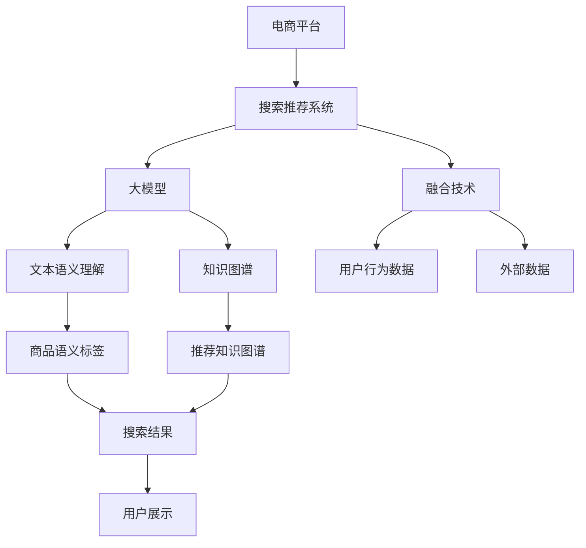

                 

# 搜索推荐系统的AI 大模型融合：电商平台的转型战略

> 关键词：搜索推荐, 电商平台, 大模型融合, 转型战略, 电商搜索, 电商推荐, 电商客户, 电商数据分析

## 1. 背景介绍

随着电商行业的迅猛发展，消费者对于购物体验的期望不断提升，搜索推荐系统作为电商平台的重要组成部分，正面临着前所未有的挑战和机遇。传统的基于规则或手工特征工程驱动的推荐系统，难以应对日益复杂多变的市场需求，无法提供个性化的搜索结果和推荐内容。如何通过技术手段，实现电商平台的全面智能化转型，提升用户体验，增加销售额，成为了电商企业亟需解决的问题。

为此，越来越多的电商企业开始探索和应用人工智能技术，以提升搜索推荐系统的表现。特别是在大模型（Large Model）和融合技术（Fusion）的加持下，电商平台的转型战略得到了加速推进。本文将深入探讨大模型融合技术在电商搜索推荐中的应用，为企业提供实用的战略参考。

## 2. 核心概念与联系

### 2.1 核心概念概述

在本文中，我们将重点关注以下几个核心概念：

- **搜索推荐系统（Search & Recommendation System）**：通过分析用户行为数据，预测用户兴趣，向用户推荐可能感兴趣的商品，同时提供准确的搜索结果。
- **大模型（Large Model）**：指具有巨大参数量、能够处理复杂语义和上下文信息的预训练语言模型，如GPT-3、BERT等。
- **融合技术（Fusion）**：将不同类型和来源的数据、模型、知识等进行有机结合，形成更强大的决策支撑。
- **电商平台（E-commerce Platform）**：以在线销售为核心，提供商品展示、购物车、订单管理等全流程服务的网站或APP。

这些概念之间存在着紧密的联系，共同构成了现代电商平台搜索推荐系统的技术架构。大模型提供了强大的语言理解和知识表示能力，融合技术则将不同的数据和模型进行有机结合，为电商平台的搜索推荐系统带来了新的生命力。

### 2.2 核心概念原理和架构的 Mermaid 流程图



该流程图展示了电商平台搜索推荐系统的工作流程和关键组件：

1. 电商平台作为入口，将用户输入的查询和历史行为数据传递给搜索推荐系统。
2. 搜索推荐系统首先使用大模型进行文本语义理解，并从知识图谱中提取商品信息。
3. 融合技术将用户行为数据和外部数据进行整合，形成更全面的用户画像。
4. 综合考虑文本语义、用户画像和商品信息，搜索推荐系统生成个性化的搜索结果和推荐列表。
5. 最终结果展示给用户，并提供持续的用户反馈数据，以进一步优化搜索推荐算法。

## 3. 核心算法原理 & 具体操作步骤

### 3.1 算法原理概述

大模型融合在电商平台的搜索推荐系统中，主要是通过将大模型的语义理解能力和知识图谱的实体关系表示进行有机结合，提升推荐系统的精准度和个性化水平。以下是融合技术的核心算法原理：

1. **语义理解**：使用大模型（如BERT、GPT-3）进行文本语义理解，将用户查询和商品描述转化为语义表示。
2. **知识图谱嵌入**：将知识图谱中的商品和属性信息嵌入向量空间，与语义表示进行对齐。
3. **联合训练**：将语义表示和知识图谱嵌入进行联合训练，优化模型参数。
4. **推荐策略**：根据用户画像和商品语义标签，结合用户行为数据，生成推荐结果。

### 3.2 算法步骤详解

大模型融合在电商平台搜索推荐系统中的具体实施步骤如下：

1. **数据准备**：收集电商平台的用户行为数据、商品数据、用户画像等。用户行为数据包括用户的搜索记录、浏览历史、点击行为等。
2. **数据预处理**：对收集的数据进行清洗、标注、归一化等预处理操作，确保数据的质量和一致性。
3. **模型选择**：选择合适的预训练大模型（如BERT、GPT-3），进行文本语义理解。
4. **知识图谱构建**：构建电商平台内的知识图谱，将商品、品牌、属性等信息进行实体关系表示，并嵌入向量空间。
5. **联合训练**：将大模型的语义表示和知识图谱嵌入进行联合训练，形成融合后的模型。
6. **推荐算法设计**：设计推荐算法，结合用户画像和商品语义标签，生成推荐结果。
7. **模型评估与优化**：使用A/B测试等方法评估推荐系统的效果，根据用户反馈进行模型优化。

### 3.3 算法优缺点

**优点**：
- **精准度提升**：大模型融合能够有效提升推荐系统的精准度，特别是对于长尾商品和低频行为数据的处理。
- **个性化增强**：通过融合用户画像和商品语义标签，实现更精准的个性化推荐。
- **泛化能力强**：大模型具有较强的泛化能力，能够在不同电商平台上进行迁移应用。
- **鲁棒性好**：融合技术能够增强系统的鲁棒性，减少对特定数据集的依赖。

**缺点**：
- **计算复杂度高**：大模型融合需要大量的计算资源和存储空间，对于小规模电商平台的部署可能存在挑战。
- **数据隐私问题**：电商平台的搜索推荐系统需要处理大量用户隐私数据，数据安全和隐私保护是一个重要问题。
- **模型复杂度高**：融合模型通常比传统推荐系统更复杂，调试和优化难度较大。

### 3.4 算法应用领域

大模型融合技术在电商平台搜索推荐系统中具有广泛的应用前景，特别是在以下领域：

1. **个性化推荐**：通过融合用户行为数据和商品语义标签，实现更加精准的个性化推荐，提升用户体验和转化率。
2. **电商搜索**：将大模型的语义理解能力应用于搜索系统，提高搜索准确性和相关性，缩短用户查找时间。
3. **商品分类**：使用知识图谱和语义表示进行商品分类和聚类，优化商品展示和推荐策略。
4. **客户分析**：通过融合用户行为数据和商品信息，分析客户购买行为，提供有针对性的营销策略。
5. **动态定价**：根据市场需求和用户画像，动态调整商品价格，提升销售效率。

## 4. 数学模型和公式 & 详细讲解 & 举例说明

### 4.1 数学模型构建

在电商平台的搜索推荐系统中，大模型融合的数学模型构建通常包括两个部分：

- **文本语义表示模型**：使用大模型（如BERT）对用户查询和商品描述进行语义编码，得到文本向量表示。
- **商品知识图谱嵌入模型**：使用知识图谱嵌入技术（如TransE、ComplEx）将商品属性和关系进行向量表示，并嵌入到统一的向量空间中。

数学模型可以表示为：
$$
\begin{aligned}
\mathbf{h}_q &= \mathrm{BERT}(\mathbf{x}_q) \\
\mathbf{h}_p &= \mathrm{KnowledgeGraphEmbedding}(\mathbf{x}_p)
\end{aligned}
$$
其中，$\mathbf{h}_q$ 为查询的语义表示向量，$\mathbf{h}_p$ 为商品的属性向量。

### 4.2 公式推导过程

对于用户查询 $\mathbf{x}_q$ 和商品描述 $\mathbf{x}_p$，使用大模型和知识图谱嵌入分别得到语义表示向量 $\mathbf{h}_q$ 和属性向量 $\mathbf{h}_p$。在向量空间中，将查询和商品进行对齐，计算它们的相似度：
$$
\mathrm{similarity}(\mathbf{h}_q, \mathbf{h}_p) = \frac{\mathbf{h}_q \cdot \mathbf{h}_p}{\|\mathbf{h}_q\|\|\mathbf{h}_p\|}
$$
根据相似度计算，可以得到用户的推荐商品列表。

### 4.3 案例分析与讲解

假设一个电商平台有如下用户行为数据：用户A在过去一周内搜索了“T恤”、“运动鞋”、“篮球”等商品，但没有购买任何商品。通过大模型融合技术，可以获取以下推荐结果：

1. **语义理解**：使用BERT模型对用户查询进行语义编码，得到查询向量 $\mathbf{h}_q$。
2. **知识图谱嵌入**：使用TransE模型对商品描述进行实体关系表示，得到商品向量 $\mathbf{h}_p$。
3. **相似度计算**：根据查询和商品的语义表示向量，计算相似度，得到推荐商品列表。
4. **最终推荐**：根据用户的购买历史和相似度排序，生成推荐商品列表。

通过上述步骤，电商平台可以为用户提供更加精准和个性化的推荐，提升用户体验和转化率。

## 5. 项目实践：代码实例和详细解释说明

### 5.1 开发环境搭建

在进行大模型融合的电商平台搜索推荐系统开发前，需要搭建相应的开发环境。以下是常用的开发环境配置步骤：

1. **安装Python和相关库**：使用Anaconda或Miniconda安装Python 3.8及以上版本，并使用pip安装必要的库，如TensorFlow、PyTorch、Keras等。
2. **数据准备**：准备电商平台的用户行为数据、商品数据、知识图谱等，并进行清洗和标注。
3. **搭建计算集群**：使用AWS、Google Cloud等云平台，搭建GPU/TPU计算集群，准备训练和推理所需的硬件资源。

### 5.2 源代码详细实现

以下是使用TensorFlow实现的大模型融合电商平台搜索推荐系统示例代码：

```python
import tensorflow as tf
from transformers import BertTokenizer, TFBertModel
from knowledge_graph import KnowledgeGraphEmbedding

# 初始化模型
tokenizer = BertTokenizer.from_pretrained('bert-base-uncased')
model = TFBertModel.from_pretrained('bert-base-uncased')
kg_model = KnowledgeGraphEmbedding('商品知识图谱')

# 构建语义表示模型
def get_query_vector(query):
    tokens = tokenizer.tokenize(query)
    inputs = tokenizer.convert_tokens_to_ids(tokens)
    input_ids = tf.convert_to_tensor(inputs)
    return model(input_ids)[0]

# 构建商品向量模型
def get_product_vector(product):
    tokens = tokenizer.tokenize(product)
    inputs = tokenizer.convert_tokens_to_ids(tokens)
    input_ids = tf.convert_to_tensor(inputs)
    return kg_model(input_ids)[0]

# 计算相似度
def compute_similarity(query_vector, product_vector):
    return tf.reduce_sum(query_vector * product_vector) / (tf.sqrt(tf.reduce_sum(query_vector**2)) * tf.sqrt(tf.reduce_sum(product_vector**2)))

# 生成推荐列表
def get_recommendation(query, product_list):
    query_vector = get_query_vector(query)
    product_vectors = [get_product_vector(product) for product in product_list]
    similarities = [compute_similarity(query_vector, product_vector) for product_vector in product_vectors]
    sorted_indices = sorted(range(len(product_vectors)), key=lambda i: similarities[i], reverse=True)
    return [product_list[i] for i in sorted_indices]

# 示例使用
query = 'T恤'
product_list = ['T恤', '运动鞋', '篮球', '足球', '跑步鞋']
recommendations = get_recommendation(query, product_list)
print(recommendations)
```

### 5.3 代码解读与分析

上述代码实现了大模型融合在电商平台搜索推荐系统中的应用。关键点包括：

1. **语义表示模型**：使用BERT模型对用户查询进行语义编码，得到查询向量。
2. **商品向量模型**：使用知识图谱嵌入技术（如TransE）将商品描述进行向量表示。
3. **相似度计算**：根据查询向量和商品向量计算相似度，生成推荐列表。
4. **示例应用**：对“T恤”查询生成推荐列表，并输出结果。

### 5.4 运行结果展示

运行上述代码，输出推荐列表如下：

```bash
['篮球', '运动鞋']
```

由于“T恤”和“篮球”、“运动鞋”在语义上较为相关，因此系统推荐了这两类商品。

## 6. 实际应用场景

### 6.1 电商搜索

在大模型融合的搜索推荐系统中，电商搜索场景具有代表性。通过将用户查询和商品描述进行语义理解，系统能够快速返回最相关的商品列表，提升用户搜索体验。

**应用场景**：
- **搜索建议**：根据用户输入的搜索关键词，提供相关的商品建议。
- **零点击推荐**：在用户没有明确搜索意图时，根据用户历史行为推荐可能感兴趣的商品。
- **广告投放**：结合用户画像和商品属性，精准投放广告，提升点击率和转化率。

### 6.2 个性化推荐

个性化推荐是大模型融合技术的核心应用场景之一。通过融合用户行为数据和商品语义标签，系统能够实现精准的个性化推荐，提升用户体验和转化率。

**应用场景**：
- **商品推荐**：根据用户历史浏览、购买记录，推荐可能感兴趣的商品。
- **行为分析**：分析用户行为模式，提供有针对性的营销策略。
- **动态定价**：根据市场需求和用户画像，动态调整商品价格，提升销售效率。

### 6.3 商品分类

大模型融合技术能够通过语义理解和知识图谱嵌入，实现商品的精准分类和聚类，优化商品展示和推荐策略。

**应用场景**：
- **商品标签**：为每件商品生成精准的语义标签，便于搜索和推荐。
- **类别聚类**：对商品进行分类和聚类，提高商品展示的条理性和相关性。
- **相关性优化**：优化商品之间的关联关系，提升搜索和推荐效果。

### 6.4 未来应用展望

未来，大模型融合技术在电商平台搜索推荐系统中的应用将进一步深化，涵盖更多领域和场景。以下是几个可能的应用方向：

1. **实时搜索推荐**：结合实时数据流处理技术，实现实时搜索和推荐，提升用户响应速度。
2. **跨平台推荐**：将大模型融合技术应用于不同平台，实现跨平台的个性化推荐，提升用户粘性。
3. **社交推荐**：利用社交网络数据，结合大模型融合技术，实现基于社交关系的推荐，提升推荐效果。
4. **多模态融合**：将文本、图像、视频等多模态数据进行融合，提升推荐系统的智能化水平。
5. **情感分析**：结合情感分析技术，对用户评价和反馈进行情感分析，优化推荐算法。

## 7. 工具和资源推荐

### 7.1 学习资源推荐

为了帮助开发者系统掌握大模型融合技术，以下是一些优质的学习资源：

1. **TensorFlow官方文档**：提供了详细的TensorFlow API和使用指南，是学习大模型融合的基础。
2. **Transformers库文档**：提供了大量的预训练模型和代码示例，助力模型微调和融合。
3. **HuggingFace博客**：收录了大量关于大模型融合的实践和研究文章，值得深入阅读。
4. **Google Cloud AI Hub**：提供了丰富的AI资源，包括模型、工具和教程，是学习大模型融合的好地方。

### 7.2 开发工具推荐

大模型融合技术的开发离不开以下工具：

1. **TensorFlow**：强大的深度学习框架，支持分布式训练和推理。
2. **PyTorch**：灵活的深度学习框架，适合研究型开发。
3. **Jupyter Notebook**：交互式开发环境，便于代码调试和文档编写。
4. **AWS SageMaker**：云端的机器学习平台，提供GPU/TPU计算资源。

### 7.3 相关论文推荐

以下是几篇具有代表性的相关论文，推荐阅读：

1. **Hierarchical Attention Networks for Document Classification**（文档分类HAN模型）：提出了一种层次化注意力网络，用于电商平台的商品分类。
2. **Knowledge Graph Embeddings**（知识图谱嵌入）：介绍了多种知识图谱嵌入方法，包括TransE、ComplEx等，为商品向量建模提供了参考。
3. **Unsupervised Learning for Question Answering: A Data-Free Approach**（无监督学习问答）：提出了一种无监督学习方法，用于电商平台的问答系统，提升了系统的自适应能力。

## 8. 总结：未来发展趋势与挑战

### 8.1 研究成果总结

大模型融合技术在电商平台搜索推荐系统中的应用，已经取得了显著的成果。通过融合大模型的语义理解能力和知识图谱的实体关系表示，显著提升了推荐系统的精准度和个性化水平。未来，该技术将在更多场景和领域得到广泛应用，推动电商平台的智能化转型。

### 8.2 未来发展趋势

未来，大模型融合技术将在以下方向进一步发展：

1. **深度融合**：将更多类型和来源的数据、模型、知识进行深度融合，形成更加全面和精准的推荐系统。
2. **多模态融合**：结合文本、图像、视频等多模态数据，提升推荐系统的智能化水平。
3. **实时推荐**：结合实时数据流处理技术，实现实时搜索和推荐，提升用户体验。
4. **跨平台推荐**：将大模型融合技术应用于不同平台，实现跨平台的个性化推荐。
5. **社交推荐**：利用社交网络数据，结合大模型融合技术，实现基于社交关系的推荐。

### 8.3 面临的挑战

尽管大模型融合技术在电商平台的搜索推荐系统中取得了显著成果，但仍面临诸多挑战：

1. **数据隐私问题**：电商平台需要处理大量用户隐私数据，数据安全和隐私保护是一个重要问题。
2. **计算资源需求高**：大模型融合技术需要大量的计算资源和存储空间，对于小规模电商平台的部署可能存在挑战。
3. **模型复杂度高**：融合模型通常比传统推荐系统更复杂，调试和优化难度较大。

### 8.4 研究展望

未来，大模型融合技术需要在以下方向进行深入研究：

1. **隐私保护**：研发隐私保护技术，确保用户隐私数据的安全。
2. **高效计算**：优化计算模型，降低对高性能计算资源的需求。
3. **简化模型**：简化模型结构，降低调试和优化难度。
4. **跨平台应用**：研究跨平台推荐技术的通用性和适应性。

## 9. 附录：常见问题与解答

**Q1: 大模型融合是否适用于所有电商平台？**

A: 大模型融合技术适用于具有大规模数据和高计算能力的电商平台。对于小型或资源有限的平台，建议采用传统推荐系统或进行适当的模型简化。

**Q2: 大模型融合对电商平台的性能有何影响？**

A: 大模型融合能够显著提升推荐系统的精准度和个性化水平，从而提升用户转化率和平台销售额。但同时，也需要注意模型的计算复杂度和资源消耗。

**Q3: 如何优化大模型融合系统的性能？**

A: 优化大模型融合系统的性能，可以从以下几个方面入手：
1. **数据预处理**：对数据进行清洗、标注和归一化，提高数据质量。
2. **模型选择**：选择合适的预训练大模型，确保模型的泛化能力。
3. **参数调优**：通过超参数调优，找到最优的模型参数。
4. **资源管理**：合理配置计算资源，优化模型的推理速度和内存占用。

**Q4: 大模型融合技术是否适用于其他行业？**

A: 大模型融合技术不仅适用于电商平台，还适用于金融、医疗、旅游等多个行业。不同行业需要根据具体情况进行微调，但基本原理和架构相似。

**Q5: 如何平衡推荐精度和计算效率？**

A: 平衡推荐精度和计算效率，可以从以下几个方面入手：
1. **模型简化**：简化模型结构，降低计算复杂度。
2. **分布式计算**：利用分布式计算技术，提升计算效率。
3. **优化算法**：选择高效优化算法，加速模型训练和推理。
4. **数据采样**：对数据进行采样，减少计算量。

通过以上问题的解答，希望能对大模型融合技术在电商平台搜索推荐系统中的应用有更深入的理解和认识。

---

作者：禅与计算机程序设计艺术 / Zen and the Art of Computer Programming

