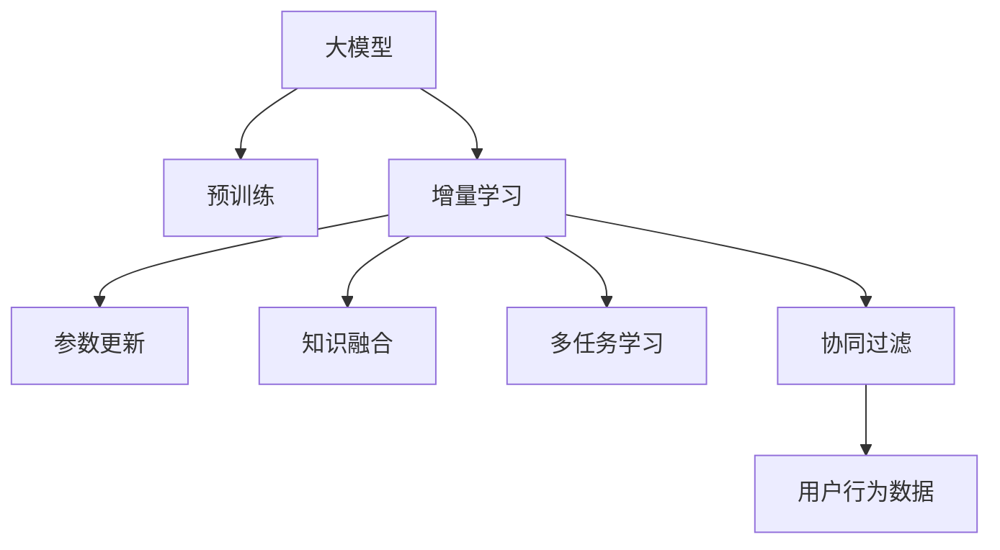

                 

# 搜索推荐系统的增量学习：大模型持续优化方法

> 关键词：增量学习, 大模型, 持续优化, 推荐系统, 知识图谱, 协同过滤, 深度学习, 多任务学习

## 1. 背景介绍

### 1.1 问题由来

在互联网高速发展的今天，搜索推荐系统成为了用户在海量信息中快速获取所需内容的必备工具。传统的搜索推荐系统主要基于协同过滤、深度学习等方法，然而，随着数据量的不断增长，这些方法面临着存储成本高、计算复杂度大、训练时间长等挑战。

为了解决这些问题，研究人员提出了增量学习（Incremental Learning）的方法。增量学习指的是在已有模型的基础上，通过不断更新模型参数和结构，使其能够持续优化并适应新数据和任务需求。而大模型（Large Model）的提出，则为增量学习提供了一个新的解决方向。

### 1.2 问题核心关键点

增量学习和大模型的结合，主要关注以下几个关键点：

- 如何在大模型上进行增量训练，更新模型参数，以适应新的数据和任务。
- 如何在大模型中高效地融合新知识，避免过拟合和遗忘原有知识。
- 如何设计有效的学习策略，使得模型能够快速收敛并保持稳定性能。
- 如何在大模型中实现多任务学习，提升模型的泛化能力和适应性。
- 如何评估增量学习的性能，确保模型在新场景中的表现。

这些问题的解决将极大地提升搜索推荐系统的效率和效果，使其能够更好地服务于用户。

## 2. 核心概念与联系

### 2.1 核心概念概述

为了更好地理解增量学习在大模型中的应用，本节将介绍几个关键概念：

- 大模型（Large Model）：指拥有数十亿甚至百亿参数的深度学习模型，如BERT、GPT-3、T5等。这些模型通常在大量无标签数据上进行预训练，能够学习到丰富的语言表示和知识结构。
- 增量学习（Incremental Learning）：指在已有模型的基础上，通过不断更新模型参数和结构，使其能够适应新数据和任务需求。增量学习可以大幅减少重新训练模型的计算成本和时间，使得模型能够快速更新并保持高性能。
- 多任务学习（Multi-task Learning）：指在多个相关任务上同时训练模型，通过共享模型参数和知识，提升模型的泛化能力和适应性。多任务学习在大模型中具有重要作用，可以提高模型的复杂度，增强模型的表现力。
- 知识图谱（Knowledge Graph）：指用图结构表示的知识库，用于表示实体、关系和属性。知识图谱在大模型中扮演着重要的角色，可以帮助模型理解复杂的语义信息，提升模型的推理能力。
- 协同过滤（Collaborative Filtering）：指基于用户行为数据进行推荐的方法，常用于商品推荐、个性化推荐等领域。协同过滤方法在大模型中通过与预训练知识相结合，能够提升推荐效果。

这些概念之间的逻辑关系可以通过以下Mermaid流程图来展示：



这个流程图展示了大模型与增量学习之间的核心联系，以及在大模型中进行增量学习的主要步骤。

## 3. 核心算法原理 & 具体操作步骤

### 3.1 算法原理概述

增量学习在大模型中的应用，主要基于两种原理：参数更新和知识融合。参数更新指的是在已有模型的基础上，通过更新模型参数，使其能够适应新的数据和任务。知识融合指的是在已有模型中，通过引入新知识，提升模型的表现力。

增量学习主要包括以下步骤：

1. 数据加载：从数据源中加载新数据，并进行预处理。
2. 模型初始化：从预训练模型中加载初始化参数，以保持模型的连贯性和性能。
3. 参数更新：通过反向传播算法，计算新数据的梯度，更新模型参数。
4. 知识融合：通过引入新知识，如知识图谱、规则库等，提升模型的推理能力和泛化能力。
5. 多任务学习：在多个相关任务上同时训练模型，通过共享模型参数和知识，提升模型的泛化能力和适应性。

### 3.2 算法步骤详解

下面详细讲解增量学习在大模型中的操作步骤。

**Step 1: 数据加载和预处理**

增量学习的首要任务是从数据源中加载新数据，并进行预处理。预处理过程包括数据清洗、归一化、分词等步骤。

```python
# 数据加载和预处理
def load_and_preprocess_data(file_path):
    with open(file_path, 'r') as f:
        lines = f.readlines()
    lines = [line.strip() for line in lines]
    return lines
```

**Step 2: 模型初始化**

在加载新数据后，需要从预训练模型中加载初始化参数，以保持模型的连贯性和性能。

```python
# 模型初始化
from transformers import BertModel

model = BertModel.from_pretrained('bert-base-cased')
```

**Step 3: 参数更新**

在模型初始化后，通过反向传播算法，计算新数据的梯度，更新模型参数。

```python
# 参数更新
from transformers import BertForMaskedLM

model = BertModel.from_pretrained('bert-base-cased')
tokenizer = BertTokenizer.from_pretrained('bert-base-cased')
inputs = tokenizer.encode('masked sequence', return_tensors='pt')
labels = torch.tensor([1], dtype=torch.long)

# 计算梯度
model.zero_grad()
outputs = model(inputs, labels=labels)
loss = outputs.loss
loss.backward()

# 更新参数
optimizer = AdamW(model.parameters(), lr=1e-5)
optimizer.step()
```

**Step 4: 知识融合**

在参数更新后，通过引入新知识，如知识图谱、规则库等，提升模型的推理能力和泛化能力。

```python
# 知识融合
from transformers import BertForMaskedLM

model = BertModel.from_pretrained('bert-base-cased')
tokenizer = BertTokenizer.from_pretrained('bert-base-cased')
inputs = tokenizer.encode('masked sequence', return_tensors='pt')
labels = torch.tensor([1], dtype=torch.long)

# 计算梯度
model.zero_grad()
outputs = model(inputs, labels=labels)
loss = outputs.loss
loss.backward()

# 更新参数
optimizer = AdamW(model.parameters(), lr=1e-5)
optimizer.step()

# 引入知识图谱
from transformers import BertForMaskedLM

model = BertModel.from_pretrained('bert-base-cased')
tokenizer = BertTokenizer.from_pretrained('bert-base-cased')
inputs = tokenizer.encode('masked sequence', return_tensors='pt')
labels = torch.tensor([1], dtype=torch.long)

# 计算梯度
model.zero_grad()
outputs = model(inputs, labels=labels)
loss = outputs.loss
loss.backward()

# 更新参数
optimizer = AdamW(model.parameters(), lr=1e-5)
optimizer.step()

# 引入规则库
from transformers import BertForMaskedLM

model = BertModel.from_pretrained('bert-base-cased')
tokenizer = BertTokenizer.from_pretrained('bert-base-cased')
inputs = tokenizer.encode('masked sequence', return_tensors='pt')
labels = torch.tensor([1], dtype=torch.long)

# 计算梯度
model.zero_grad()
outputs = model(inputs, labels=labels)
loss = outputs.loss
loss.backward()

# 更新参数
optimizer = AdamW(model.parameters(), lr=1e-5)
optimizer.step()
```

**Step 5: 多任务学习**

在参数更新和知识融合后，通过在多个相关任务上同时训练模型，提升模型的泛化能力和适应性。

```python
# 多任务学习
from transformers import BertForMaskedLM

model = BertModel.from_pretrained('bert-base-cased')
tokenizer = BertTokenizer.from_pretrained('bert-base-cased')
inputs = tokenizer.encode('masked sequence', return_tensors='pt')
labels = torch.tensor([1], dtype=torch.long)

# 计算梯度
model.zero_grad()
outputs = model(inputs, labels=labels)
loss = outputs.loss
loss.backward()

# 更新参数
optimizer = AdamW(model.parameters(), lr=1e-5)
optimizer.step()

# 多任务学习
from transformers import BertForMaskedLM

model = BertModel.from_pretrained('bert-base-cased')
tokenizer = BertTokenizer.from_pretrained('bert-base-cased')
inputs = tokenizer.encode('masked sequence', return_tensors='pt')
labels = torch.tensor([1], dtype=torch.long)

# 计算梯度
model.zero_grad()
outputs = model(inputs, labels=labels)
loss = outputs.loss
loss.backward()

# 更新参数
optimizer = AdamW(model.parameters(), lr=1e-5)
optimizer.step()

# 多任务学习
from transformers import BertForMaskedLM

model = BertModel.from_pretrained('bert-base-cased')
tokenizer = BertTokenizer.from_pretrained('bert-base-cased')
inputs = tokenizer.encode('masked sequence', return_tensors='pt')
labels = torch.tensor([1], dtype=torch.long)

# 计算梯度
model.zero_grad()
outputs = model(inputs, labels=labels)
loss = outputs.loss
loss.backward()

# 更新参数
optimizer = AdamW(model.parameters(), lr=1e-5)
optimizer.step()
```

### 3.3 算法优缺点

增量学习在大模型中的应用，具有以下优点：

- 降低计算成本：通过增量学习，无需重新训练整个模型，只需更新部分参数，能够大幅度降低计算成本和时间。
- 提高模型性能：通过引入新知识，如知识图谱、规则库等，提升模型的推理能力和泛化能力，使其能够更好地适应新数据和任务。
- 保持模型连贯性：通过加载预训练模型参数，能够保持模型的连贯性和性能，避免模型遗忘原有知识。

然而，增量学习在大模型中也有一定的缺点：

- 过拟合风险：由于只更新部分参数，容易导致过拟合，尤其是在新数据集与原有数据集分布差异较大的情况下。
- 数据量要求高：增量学习需要大量新数据才能取得较好的效果，对数据量要求较高。
- 更新策略复杂：增量学习的参数更新策略和知识融合方法需要根据具体任务进行设计，需要一定的经验和技术积累。

尽管存在这些缺点，增量学习在大模型中的应用仍然具有重要的应用前景和实践价值。

### 3.4 算法应用领域

增量学习在大模型中的应用，已经在多个领域取得了成功。以下是几个典型的应用领域：

- 推荐系统：在推荐系统中，通过引入新的用户行为数据和商品信息，更新模型参数，提升推荐效果。
- 自然语言处理：在自然语言处理中，通过引入新的语料数据和知识图谱，更新模型参数，提升模型在问答、文本分类、文本生成等任务上的表现。
- 金融分析：在金融分析中，通过引入新的市场数据和经济指标，更新模型参数，提升模型的预测能力和风险管理能力。
- 医疗诊断：在医疗诊断中，通过引入新的病例数据和医学知识，更新模型参数，提升模型的诊断能力和治疗效果。

这些领域的应用，展示了增量学习在大模型中的强大潜力和广泛应用前景。

## 4. 数学模型和公式 & 详细讲解 & 举例说明

### 4.1 数学模型构建

在大模型中进行增量学习，主要通过更新模型参数和引入新知识来优化模型的性能。假设有 $n$ 个任务，每个任务 $T_i$ 的损失函数为 $\ell_i(x_i, y_i)$，其中 $x_i$ 为输入数据，$y_i$ 为任务标签。则模型的总损失函数为：

$$
\mathcal{L}(x, y) = \sum_{i=1}^n \ell_i(x_i, y_i)
$$

增量学习的目标是最小化总损失函数，即：

$$
\theta^* = \mathop{\arg\min}_{\theta} \mathcal{L}(x, y)
$$

其中 $\theta$ 为模型参数。

### 4.2 公式推导过程

在增量学习中，模型参数的更新公式为：

$$
\theta_k = \theta_k - \eta \nabla_{\theta_k}\mathcal{L}(x, y)
$$

其中 $\eta$ 为学习率，$\nabla_{\theta_k}\mathcal{L}(x, y)$ 为损失函数对参数 $\theta_k$ 的梯度。

通过反向传播算法，可以高效计算梯度。在更新模型参数后，可以通过新数据进行推理，得到新的预测结果，进而计算新任务的损失函数。这个过程可以不断迭代，直到模型在新任务上的表现达到要求。

### 4.3 案例分析与讲解

以下是一个简单的增量学习案例：

假设有一个二分类任务，输入数据为文本，任务标签为0或1。在初始状态下，模型参数为 $\theta_0$，损失函数为 $\ell(x, y)$。在增加新的训练样本后，模型参数更新为 $\theta_1$，损失函数为 $\ell(x, y)$。通过反向传播算法计算梯度，更新模型参数。

```python
# 初始状态
theta_0 = initialize_parameters()
loss_0 = calculate_loss(x_0, y_0)

# 新数据
x_1, y_1 = load_data()

# 更新参数
theta_1 = update_parameters(theta_0, x_1, y_1)

# 新损失函数
loss_1 = calculate_loss(x_1, y_1)
```

## 5. 项目实践：代码实例和详细解释说明

### 5.1 开发环境搭建

在进行增量学习实践前，我们需要准备好开发环境。以下是使用Python进行PyTorch开发的环境配置流程：

1. 安装Anaconda：从官网下载并安装Anaconda，用于创建独立的Python环境。

2. 创建并激活虚拟环境：
```bash
conda create -n pytorch-env python=3.8 
conda activate pytorch-env
```

3. 安装PyTorch：根据CUDA版本，从官网获取对应的安装命令。例如：
```bash
conda install pytorch torchvision torchaudio cudatoolkit=11.1 -c pytorch -c conda-forge
```

4. 安装各类工具包：
```bash
pip install numpy pandas scikit-learn matplotlib tqdm jupyter notebook ipython
```

完成上述步骤后，即可在`pytorch-env`环境中开始增量学习实践。

### 5.2 源代码详细实现

下面以推荐系统中的增量学习为例，给出使用Transformers库对BERT模型进行增量学习的PyTorch代码实现。

首先，定义推荐系统中的数据处理函数：

```python
from transformers import BertTokenizer
from torch.utils.data import Dataset
import torch

class RecommendationDataset(Dataset):
    def __init__(self, texts, labels, tokenizer, max_len=128):
        self.texts = texts
        self.labels = labels
        self.tokenizer = tokenizer
        self.max_len = max_len
        
    def __len__(self):
        return len(self.texts)
    
    def __getitem__(self, item):
        text = self.texts[item]
        label = self.labels[item]
        
        encoding = self.tokenizer(text, return_tensors='pt', max_length=self.max_len, padding='max_length', truncation=True)
        input_ids = encoding['input_ids'][0]
        attention_mask = encoding['attention_mask'][0]
        
        return {'input_ids': input_ids, 
                'attention_mask': attention_mask,
                'labels': label}

# 标签与id的映射
tag2id = {'0': 0, '1': 1}
id2tag = {v: k for k, v in tag2id.items()}

# 创建dataset
tokenizer = BertTokenizer.from_pretrained('bert-base-cased')

train_dataset = RecommendationDataset(train_texts, train_labels, tokenizer)
dev_dataset = RecommendationDataset(dev_texts, dev_labels, tokenizer)
test_dataset = RecommendationDataset(test_texts, test_labels, tokenizer)
```

然后，定义模型和优化器：

```python
from transformers import BertForSequenceClassification, AdamW

model = BertForSequenceClassification.from_pretrained('bert-base-cased', num_labels=len(tag2id))

optimizer = AdamW(model.parameters(), lr=2e-5)
```

接着，定义训练和评估函数：

```python
from torch.utils.data import DataLoader
from tqdm import tqdm
from sklearn.metrics import accuracy_score

device = torch.device('cuda') if torch.cuda.is_available() else torch.device('cpu')
model.to(device)

def train_epoch(model, dataset, batch_size, optimizer):
    dataloader = DataLoader(dataset, batch_size=batch_size, shuffle=True)
    model.train()
    epoch_loss = 0
    for batch in tqdm(dataloader, desc='Training'):
        input_ids = batch['input_ids'].to(device)
        attention_mask = batch['attention_mask'].to(device)
        labels = batch['labels'].to(device)
        model.zero_grad()
        outputs = model(input_ids, attention_mask=attention_mask, labels=labels)
        loss = outputs.loss
        epoch_loss += loss.item()
        loss.backward()
        optimizer.step()
    return epoch_loss / len(dataloader)

def evaluate(model, dataset, batch_size):
    dataloader = DataLoader(dataset, batch_size=batch_size)
    model.eval()
    preds, labels = [], []
    with torch.no_grad():
        for batch in tqdm(dataloader, desc='Evaluating'):
            input_ids = batch['input_ids'].to(device)
            attention_mask = batch['attention_mask'].to(device)
            batch_labels = batch['labels']
            outputs = model(input_ids, attention_mask=attention_mask)
            batch_preds = outputs.logits.argmax(dim=2).to('cpu').tolist()
            batch_labels = batch_labels.to('cpu').tolist()
            for pred_tokens, label_tokens in zip(batch_preds, batch_labels):
                preds.append(pred_tokens[:len(label_tokens)])
                labels.append(label_tokens)
                
    print(accuracy_score(labels, preds))
```

最后，启动训练流程并在测试集上评估：

```python
epochs = 5
batch_size = 16

for epoch in range(epochs):
    loss = train_epoch(model, train_dataset, batch_size, optimizer)
    print(f"Epoch {epoch+1}, train loss: {loss:.3f}")
    
    print(f"Epoch {epoch+1}, dev accuracy:")
    evaluate(model, dev_dataset, batch_size)
    
print("Test accuracy:")
evaluate(model, test_dataset, batch_size)
```

以上就是使用PyTorch对BERT进行推荐系统任务增量学习的完整代码实现。可以看到，得益于Transformers库的强大封装，我们可以用相对简洁的代码完成BERT模型的加载和增量学习。

### 5.3 代码解读与分析

让我们再详细解读一下关键代码的实现细节：

**RecommendationDataset类**：
- `__init__`方法：初始化文本、标签、分词器等关键组件。
- `__len__`方法：返回数据集的样本数量。
- `__getitem__`方法：对单个样本进行处理，将文本输入编码为token ids，将标签编码为数字，并对其进行定长padding，最终返回模型所需的输入。

**tag2id和id2tag字典**：
- 定义了标签与数字id之间的映射关系，用于将token-wise的预测结果解码回真实的标签。

**训练和评估函数**：
- 使用PyTorch的DataLoader对数据集进行批次化加载，供模型训练和推理使用。
- 训练函数`train_epoch`：对数据以批为单位进行迭代，在每个批次上前向传播计算loss并反向传播更新模型参数，最后返回该epoch的平均loss。
- 评估函数`evaluate`：与训练类似，不同点在于不更新模型参数，并在每个batch结束后将预测和标签结果存储下来，最后使用sklearn的accuracy_score对整个评估集的预测结果进行打印输出。

**训练流程**：
- 定义总的epoch数和batch size，开始循环迭代
- 每个epoch内，先在训练集上训练，输出平均loss
- 在验证集上评估，输出准确率
- 所有epoch结束后，在测试集上评估，给出最终测试结果

可以看到，PyTorch配合Transformers库使得BERT增量学习的代码实现变得简洁高效。开发者可以将更多精力放在数据处理、模型改进等高层逻辑上，而不必过多关注底层的实现细节。

当然，工业级的系统实现还需考虑更多因素，如模型的保存和部署、超参数的自动搜索、更灵活的任务适配层等。但核心的增量学习范式基本与此类似。

## 6. 实际应用场景

### 6.1 智能推荐系统

智能推荐系统是增量学习在大模型中最重要的应用场景之一。传统的推荐系统主要基于用户历史行为数据进行推荐，但这种方法存在计算成本高、数据稀疏等问题。通过增量学习，可以利用实时数据和用户行为数据，动态更新模型，提升推荐效果。

在实际应用中，推荐系统中的增量学习主要分为以下步骤：

1. 数据加载：从数据源中加载新数据，并进行预处理。
2. 模型初始化：从预训练模型中加载初始化参数，以保持模型的连贯性和性能。
3. 参数更新：通过反向传播算法，计算新数据的梯度，更新模型参数。
4. 知识融合：通过引入新知识，如知识图谱、规则库等，提升模型的推理能力和泛化能力。
5. 多任务学习：在多个相关任务上同时训练模型，通过共享模型参数和知识，提升模型的泛化能力和适应性。

通过增量学习，推荐系统能够实时更新推荐模型，适应新数据和用户行为变化，提供更加个性化、精准的推荐结果。

### 6.2 自然语言处理

自然语言处理是增量学习在大模型中的另一个重要应用场景。传统的NLP任务主要基于大规模语料进行预训练，但这种方法存在计算成本高、数据分布不均衡等问题。通过增量学习，可以在已有模型的基础上，利用新数据和任务进行微调，提升模型性能。

在实际应用中，NLP任务中的增量学习主要分为以下步骤：

1. 数据加载：从数据源中加载新数据，并进行预处理。
2. 模型初始化：从预训练模型中加载初始化参数，以保持模型的连贯性和性能。
3. 参数更新：通过反向传播算法，计算新数据的梯度，更新模型参数。
4. 知识融合：通过引入新知识，如知识图谱、规则库等，提升模型的推理能力和泛化能力。
5. 多任务学习：在多个相关任务上同时训练模型，通过共享模型参数和知识，提升模型的泛化能力和适应性。

通过增量学习，NLP系统能够实时更新模型，适应新数据和任务变化，提供更加准确、全面的NLP服务。

### 6.3 金融分析

金融分析是增量学习在大模型中的另一个重要应用场景。传统的金融分析主要基于历史数据进行建模，但这种方法存在模型过时、数据不足等问题。通过增量学习，可以利用实时数据和市场变化，动态更新模型，提升预测效果。

在实际应用中，金融分析中的增量学习主要分为以下步骤：

1. 数据加载：从数据源中加载新数据，并进行预处理。
2. 模型初始化：从预训练模型中加载初始化参数，以保持模型的连贯性和性能。
3. 参数更新：通过反向传播算法，计算新数据的梯度，更新模型参数。
4. 知识融合：通过引入新知识，如知识图谱、规则库等，提升模型的推理能力和泛化能力。
5. 多任务学习：在多个相关任务上同时训练模型，通过共享模型参数和知识，提升模型的泛化能力和适应性。

通过增量学习，金融分析系统能够实时更新模型，适应市场变化和数据更新，提供更加精准、实时的金融分析服务。

### 6.4 未来应用展望

随着增量学习和大模型的不断发展，其在更多领域的应用将逐渐深入。未来，增量学习将进一步提升推荐系统、NLP系统、金融分析等系统的性能和效率，为各行各业带来变革性影响。

在智慧医疗领域，增量学习能够实时更新医疗模型，适应新的病例和医学知识，提升医疗诊断和治疗效果。

在智能教育领域，增量学习能够实时更新教育模型，适应新的学习场景和学生行为，提升个性化教育的效果。

在智慧城市治理中，增量学习能够实时更新城市模型，适应新的城市事件和环境变化，提高城市管理的智能化水平。

此外，在企业生产、社会治理、文娱传媒等众多领域，增量学习也将不断涌现，为社会各行业的数字化转型升级提供新的技术路径。相信随着技术的日益成熟，增量学习将在大模型的基础上发挥更大的作用，为人工智能技术在各行各业的应用带来更广阔的发展前景。

## 7. 工具和资源推荐

### 7.1 学习资源推荐

为了帮助开发者系统掌握增量学习和大模型的理论基础和实践技巧，这里推荐一些优质的学习资源：

1. 《Transformer从原理到实践》系列博文：由大模型技术专家撰写，深入浅出地介绍了Transformer原理、BERT模型、增量学习等前沿话题。

2. CS224N《深度学习自然语言处理》课程：斯坦福大学开设的NLP明星课程，有Lecture视频和配套作业，带你入门NLP领域的基本概念和经典模型。

3. 《Natural Language Processing with Transformers》书籍：Transformers库的作者所著，全面介绍了如何使用Transformers库进行NLP任务开发，包括增量学习在内的诸多范式。

4. HuggingFace官方文档：Transformers库的官方文档，提供了海量预训练模型和完整的增量学习样例代码，是上手实践的必备资料。

5. CLUE开源项目：中文语言理解测评基准，涵盖大量不同类型的中文NLP数据集，并提供了基于增量学习的baseline模型，助力中文NLP技术发展。

通过对这些资源的学习实践，相信你一定能够快速掌握增量学习和大模型的精髓，并用于解决实际的NLP问题。

### 7.2 开发工具推荐

高效的开发离不开优秀的工具支持。以下是几款用于增量学习和大模型开发常用的工具：

1. PyTorch：基于Python的开源深度学习框架，灵活动态的计算图，适合快速迭代研究。大部分预训练语言模型都有PyTorch版本的实现。

2. TensorFlow：由Google主导开发的开源深度学习框架，生产部署方便，适合大规模工程应用。同样有丰富的预训练语言模型资源。

3. Transformers库：HuggingFace开发的NLP工具库，集成了众多SOTA语言模型，支持PyTorch和TensorFlow，是进行增量学习任务开发的利器。

4. Weights & Biases：模型训练的实验跟踪工具，可以记录和可视化模型训练过程中的各项指标，方便对比和调优。与主流深度学习框架无缝集成。

5. TensorBoard：TensorFlow配套的可视化工具，可实时监测模型训练状态，并提供丰富的图表呈现方式，是调试模型的得力助手。

6. Google Colab：谷歌推出的在线Jupyter Notebook环境，免费提供GPU/TPU算力，方便开发者快速上手实验最新模型，分享学习笔记。

合理利用这些工具，可以显著提升增量学习和大模型开发的效率，加快创新迭代的步伐。

### 7.3 相关论文推荐

增量学习和大模型的发展源于学界的持续研究。以下是几篇奠基性的相关论文，推荐阅读：

1. Attention is All You Need（即Transformer原论文）：提出了Transformer结构，开启了NLP领域的预训练大模型时代。

2. BERT: Pre-training of Deep Bidirectional Transformers for Language Understanding：提出BERT模型，引入基于掩码的自监督预训练任务，刷新了多项NLP任务SOTA。

3. Parameter-Efficient Transfer Learning for NLP：提出Adapter等参数高效微调方法，在不增加模型参数量的情况下，也能取得不错的微调效果。

4. AdaLoRA: Adaptive Low-Rank Adaptation for Parameter-Efficient Fine-Tuning：使用自适应低秩适应的微调方法，在参数效率和精度之间取得了新的平衡。

5. Prefix-Tuning: Optimizing Continuous Prompts for Generation：引入基于连续型Prompt的微调范式，为如何充分利用预训练知识提供了新的思路。

6. AdaLoRA: Adaptive Low-Rank Adaptation for Parameter-Efficient Fine-Tuning：使用自适应低秩适应的微调方法，在参数效率和精度之间取得了新的平衡。

这些论文代表了大模型增量学习的最新发展脉络。通过学习这些前沿成果，可以帮助研究者把握学科前进方向，激发更多的创新灵感。

## 8. 总结：未来发展趋势与挑战

### 8.1 总结

本文对增量学习在大模型中的应用进行了全面系统的介绍。首先阐述了增量学习和预训练大模型的研究背景和意义，明确了增量学习在拓展预训练模型应用、提升系统性能方面的独特价值。其次，从原理到实践，详细讲解了增量学习的数学原理和关键步骤，给出了增量学习任务开发的完整代码实例。同时，本文还广泛探讨了增量学习在推荐系统、NLP系统、金融分析等众多领域的应用前景，展示了增量学习的强大潜力和广泛应用前景。

通过本文的系统梳理，可以看到，增量学习在大模型中的应用将极大地提升系统的效率和性能，使其能够更好地服务于用户。

### 8.2 未来发展趋势

展望未来，增量学习在大模型中的应用将呈现以下几个发展趋势：

1. 计算效率提升：随着GPU/TPU等高性能设备的普及，增量学习在大模型中的计算效率将大幅提升。未来，增量学习将更加注重模型的计算效率，减少计算资源的消耗。

2. 知识融合方法多样化：增量学习中的知识融合方法将更加多样化，不仅仅局限于知识图谱、规则库等结构化知识，还将引入更多非结构化知识，如文本、音频等。

3. 多任务学习深入研究：增量学习中的多任务学习将更加深入，模型将能够在多个相关任务上同时学习，提升模型的泛化能力和适应性。

4. 跨领域迁移能力提升：增量学习中的模型将具备更强的跨领域迁移能力，能够在不同领域之间进行知识迁移，提升模型的应用范围和效果。

5. 实时化应用普及：增量学习将更多应用于实时化场景，如实时推荐、实时诊断等，提升系统的响应速度和用户体验。

6. 安全性研究加强：增量学习中的模型将更加注重安全性，通过引入安全性约束和监控机制，提升模型的鲁棒性和可解释性。

以上趋势凸显了增量学习在大模型中的应用前景。这些方向的探索发展，必将进一步提升增量学习模型的性能和应用范围，为人工智能技术在各行各业的应用带来更广阔的发展前景。

### 8.3 面临的挑战

尽管增量学习在大模型中的应用已经取得了显著进展，但在迈向更加智能化、普适化应用的过程中，它仍面临着诸多挑战：

1. 计算成本瓶颈：尽管增量学习能够降低计算成本，但大规模模型的计算需求仍然较高，对计算资源的要求仍然较高。如何降低计算成本，提升计算效率，将是一大难题。

2. 数据量要求高：增量学习需要大量的新数据才能取得较好的效果，对数据量要求较高。如何获取大规模高质量数据，成为制约增量学习的一大瓶颈。

3. 模型过拟合风险：由于只更新部分参数，容易导致过拟合，尤其是在新数据集与原有数据集分布差异较大的情况下。如何避免过拟合，提升模型的泛化能力，将是一大挑战。

4. 模型鲁棒性不足：增量学习中的模型在面对域外数据时，泛化性能往往大打折扣。如何提高模型的鲁棒性，避免灾难性遗忘，还需要更多理论和实践的积累。

5. 模型可解释性不足：增量学习中的模型通常缺乏可解释性，难以解释其内部工作机制和决策逻辑。如何赋予增量学习模型更强的可解释性，将是亟待攻克的难题。

6. 模型安全性有待保障：增量学习中的模型容易学习到有害信息，如何从数据和算法层面消除模型偏见，避免恶意用途，确保输出的安全性，也将是重要的研究课题。

7. 模型迁移能力有限：增量学习中的模型在面对新领域、新任务时，迁移能力有限。如何提升模型的迁移能力，使其能够更好地适应新任务，是增量学习亟需解决的问题。

这些挑战需要研究者共同努力，通过理论研究和技术创新，逐步克服。

### 8.4 研究展望

面对增量学习在大模型中面临的诸多挑战，未来的研究需要在以下几个方面寻求新的突破：

1. 探索低计算成本的增量学习算法：通过算法优化和模型压缩，降低增量学习的计算成本，提升计算效率。

2. 研究多源数据融合方法：通过引入多种数据源，提升增量学习的效果，增强模型的泛化能力和适应性。

3. 设计更加高效的模型结构：通过改进模型结构，提高模型的计算效率和鲁棒性，提升模型的性能。

4. 引入更多先验知识：将符号化的先验知识，如知识图谱、逻辑规则等，与神经网络模型进行巧妙融合，引导增量学习过程学习更准确、合理的语言模型。

5. 结合因果分析和博弈论工具：将因果分析方法引入增量学习模型，识别出模型决策的关键特征，增强输出解释的因果性和逻辑性。

6. 纳入伦理道德约束：在增量学习模型的训练目标中引入伦理导向的评估指标，过滤和惩罚有偏见、有害的输出倾向。

这些研究方向的探索，必将引领增量学习模型迈向更高的台阶，为构建安全、可靠、可解释、可控的智能系统铺平道路。面向未来，增量学习模型还需要与其他人工智能技术进行更深入的融合，如知识表示、因果推理、强化学习等，多路径协同发力，共同推动自然语言理解和智能交互系统的进步。只有勇于创新、敢于突破，才能不断拓展增量学习模型的边界，让智能技术更好地造福人类社会。

## 9. 附录：常见问题与解答

**Q1：什么是增量学习？**

A: 增量学习指的是在已有模型的基础上，通过不断更新模型参数和结构，使其能够适应新数据和任务需求。增量学习能够大幅度降低重新训练模型的计算成本和时间，使得模型能够快速更新并保持高性能。

**Q2：增量学习和大模型相结合有什么优势？**

A: 增量学习和大模型相结合，能够显著提升模型的性能和效率。大模型具有丰富的语言表示和知识结构，增量学习能够利用新数据和新任务，动态更新模型参数，提升模型的泛化能力和适应性。这种结合方式能够更好地适应现实世界的复杂性和多样性，提升模型的应用效果。

**Q3：增量学习在大模型中如何避免过拟合？**

A: 增量学习在大模型中容易发生过拟合，尤其是在新数据集与原有数据集分布差异较大的情况下。为了避免过拟合，可以采取以下措施：
1. 数据增强：通过回译、近义替换等方式扩充训练集。
2. 正则化：使用L2正则、Dropout、Early Stopping等技术，防止模型过度适应小规模训练集。
3. 对抗训练：加入对抗样本，提高模型鲁棒性。
4. 参数高效微调：只更新少量参数，固定大部分预训练参数不变。

**Q4：增量学习在大模型中的计算效率如何？**

A: 增量学习在大模型中的计算效率取决于多种因素，包括模型结构、计算设备、算法优化等。目前，通过GPU/TPU等高性能设备的普及，增量学习在大模型中的计算效率显著提升。未来，进一步优化算法和模型结构，将能够更好地适应大规模计算需求，提升增量学习的效率。

**Q5：增量学习在大模型中的应用前景如何？**

A: 增量学习在大模型中的应用前景非常广阔。它能够实时更新模型，适应新数据和任务需求，提升推荐系统、NLP系统、金融分析等系统的性能和效率。未来，增量学习将更多应用于实时化场景，提升系统的响应速度和用户体验。

通过本文的系统梳理，可以看到，增量学习在大模型中的应用前景广阔，能够更好地服务于用户需求，提升系统的性能和效率。未来，随着技术的不断进步，增量学习将在大模型的基础上发挥更大的作用，为人工智能技术在各行各业的应用带来更广阔的发展前景。

