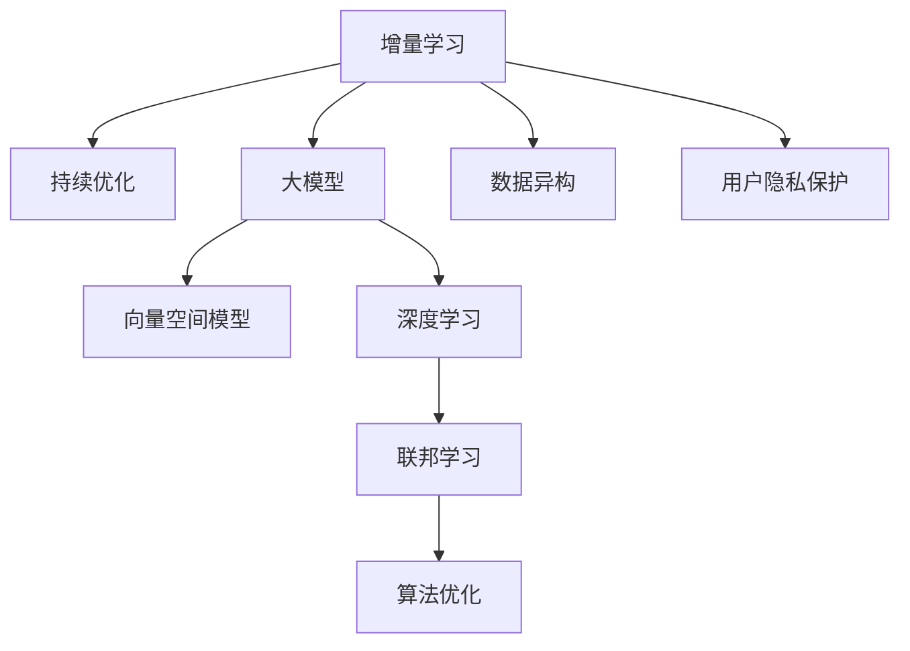

                 

# 搜索推荐系统的增量学习：大模型持续优化方法

> 关键词：增量学习,大模型,搜索推荐系统,持续优化,矩阵分解,向量空间模型,深度学习,联邦学习,算法优化

## 1. 背景介绍

### 1.1 问题由来

随着互联网技术的飞速发展，用户产生和搜索信息的需求日益增长，搜索推荐系统(Information Retrieval and Recommendation System)应运而生。这类系统通过智能算法，在海量数据中高效地检索、筛选和推荐符合用户需求的信息。当前，搜索推荐系统已经广泛应用于电商、社交、新闻等多个领域，深刻影响着用户的信息获取和决策行为。

然而，搜索推荐系统的核心在于模型参数的持续优化，以不断提升推荐的精准度和用户体验。在大数据时代，用户行为和数据分布会随着时间动态变化，传统的静态模型难以适应这种动态性，无法持续学习新知识。增量学习(Incremental Learning)，也称为在线学习(Online Learning)，是指模型在运行过程中，通过实时更新参数，动态适应数据分布变化的一种学习方式。该方法能够克服静态模型的缺点，使模型始终保持最新状态，持续优化推荐效果。

大模型，如BERT、GPT等，通过大规模无标签数据进行预训练，具备强大的表达能力，能够处理复杂多变的语义关系，对推荐系统性能的提升具有重要价值。通过增量学习，大模型能够不断吸收新信息，提升推荐效果。因此，基于大模型的增量学习，成为搜索推荐系统持续优化推荐效果的有效方法。

### 1.2 问题核心关键点

增量学习通过持续优化模型参数，实时适应数据分布变化。在大规模搜索推荐系统中，增量学习需要处理海量数据，计算复杂度高，对系统性能提出了巨大挑战。同时，增量学习还面临数据异构、用户隐私保护等实际问题。本节将介绍增量学习的核心概念，并分析其在大模型中的应用。

核心概念包括：

- 增量学习：在模型运行过程中，通过实时更新模型参数，动态适应数据分布变化的一种学习方式。
- 持续优化：在搜索推荐系统中，实时更新模型参数，保持最新状态，持续优化推荐效果。
- 大模型：通过大规模无标签数据预训练，具备强大表达能力，用于提升推荐系统性能的模型。
- 向量空间模型：利用向量空间中的距离度量，进行信息检索和推荐。
- 深度学习：基于神经网络的端到端学习范式，自动提取特征，提升模型表达能力。
- 联邦学习：分布式环境下，各节点本地训练模型，并通过联邦聚合方法，更新全局模型参数。
- 算法优化：针对增量学习中的计算复杂度、空间占用等问题，进行算法的优化提升。

这些核心概念之间的关系可以通过以下Mermaid流程图来展示：



这个流程图展示了大模型增量学习的核心概念及其之间的关系：

1. 增量学习是持续优化的核心手段。
2. 大模型是持续优化的重要工具。
3. 向量空间模型和深度学习是常见的大模型表示方式。
4. 联邦学习是分布式环境下的增量学习框架。
5. 算法优化是大模型增量学习的必备技术。
6. 数据异构和用户隐私保护是增量学习面临的实际问题。

这些核心概念共同构成了大模型增量学习的理论基础，为后续的算法设计和应用提供了重要指引。

## 2. 核心概念与联系

### 2.1 核心概念概述

本节将详细介绍增量学习、大模型、向量空间模型、深度学习、联邦学习、算法优化等核心概念的原理和架构。

### 2.2 核心概念联系

大模型增量学习的核心在于利用大模型的强大表达能力，实时更新模型参数，动态适应数据分布变化，提升推荐效果。以下是这些核心概念之间的联系：

- 增量学习是大模型持续优化的重要手段，通过实时更新模型参数，保持最新状态。
- 大模型是增量学习的核心工具，通过大规模无标签数据预训练，具备强大表达能力。
- 向量空间模型和深度学习是大模型的常见表示方式，能够自动提取特征，提升表达能力。
- 联邦学习是分布式环境下的增量学习框架，通过各节点本地训练，更新全局模型参数。
- 算法优化是大模型增量学习的必备技术，针对计算复杂度、空间占用等问题，进行优化提升。

这些核心概念共同构成了大模型增量学习的理论基础，为后续的算法设计和应用提供了重要指引。

## 3. 核心算法原理 & 具体操作步骤
### 3.1 算法原理概述

大模型增量学习的核心在于利用大模型的强大表达能力，实时更新模型参数，动态适应数据分布变化，提升推荐效果。以下是该算法的原理概述：

1. **增量学习机制**：在模型运行过程中，通过实时更新模型参数，动态适应数据分布变化。每次更新参数时，模型都会根据新数据重新计算梯度，更新参数。

2. **持续优化目标**：在搜索推荐系统中，持续优化模型参数，保持最新状态，优化推荐效果。通过不断地更新参数，模型能够适应动态变化的数据分布，提升推荐的精准度和用户体验。

3. **大模型基础**：利用大规模无标签数据进行预训练，具备强大的表达能力。预训练模型可以自动提取特征，提升推荐系统的性能。

4. **向量空间模型和深度学习**：大模型常用的表示方式，利用向量空间中的距离度量，或基于神经网络的端到端学习范式，进行信息检索和推荐。

5. **联邦学习框架**：分布式环境下，各节点本地训练模型，并通过联邦聚合方法，更新全局模型参数。各节点间的通信和协作，可以提升全局模型的泛化能力。

6. **算法优化技术**：针对增量学习中的计算复杂度、空间占用等问题，进行算法的优化提升。如小批量梯度下降、分布式并行优化等。

### 3.2 算法步骤详解

大模型增量学习的主要步骤包括数据收集、模型初始化、模型训练、参数更新和评估优化等环节。以下是详细的步骤：

**Step 1: 数据收集**

增量学习需要处理海量数据，因此需要构建高效的数据收集和存储系统。常用的数据源包括：

- 用户点击、浏览、购买等行为数据。
- 新闻、文章、视频等多媒体数据。
- 社交网络中的互动数据。

数据收集系统需要实时更新数据，存储到分布式数据库中。

**Step 2: 模型初始化**

选择适合的大模型进行初始化，一般使用预训练模型。常用的预训练模型包括BERT、GPT等。

**Step 3: 模型训练**

在初始化模型后，将数据集划分为训练集和测试集。利用小批量梯度下降、分布式并行优化等方法，进行模型训练。训练过程需要不断更新模型参数，保持最新状态。

**Step 4: 参数更新**

每次模型训练后，更新全局模型参数。各节点本地训练模型，通过联邦聚合方法，更新全局模型参数。

**Step 5: 评估优化**

在模型更新后，评估模型性能。使用测试集评估模型推荐效果，根据评估结果进行优化。常见的优化方法包括：

- 调整学习率。根据评估结果，调整学习率，避免过拟合。
- 数据增强。通过近义词替换、回译等方法，丰富训练数据。
- 正则化。使用L2正则、Dropout等技术，避免过拟合。
- 对抗训练。引入对抗样本，提高模型鲁棒性。

### 3.3 算法优缺点

大模型增量学习具有以下优点：

1. 动态适应性。通过实时更新模型参数，动态适应数据分布变化，保持最新状态。
2. 高泛化能力。利用大模型的强大表达能力，提升推荐系统的泛化能力。
3. 分布式优化。利用联邦学习框架，提升全局模型的泛化能力。
4. 高效计算。通过算法优化，降低计算复杂度和空间占用。

同时，该算法也存在以下缺点：

1. 计算复杂度高。处理海量数据，计算复杂度高，对系统性能提出挑战。
2. 参数更新频率高。频繁更新参数，对系统稳定性提出挑战。
3. 数据异构。不同数据源的数据格式和质量差异大，难以统一处理。
4. 用户隐私保护。需要保护用户隐私，防止数据泄露。

尽管存在这些缺点，但大模型增量学习在大规模搜索推荐系统中具有重要应用价值。未来相关研究的重点在于如何进一步降低计算复杂度，提高系统稳定性，保护用户隐私等。

### 3.4 算法应用领域

大模型增量学习在搜索推荐系统中具有广泛应用，特别是在以下几个领域：

1. **电商推荐**：通过实时更新模型参数，提升电商推荐系统的精准度和个性化推荐能力。
2. **新闻推荐**：利用大模型，动态适应用户兴趣变化，提升新闻推荐的精准度和多样性。
3. **社交推荐**：在社交网络中，实时更新模型参数，动态推荐用户感兴趣的内容。
4. **视频推荐**：利用大模型，自动提取视频特征，提升视频推荐的精准度和多样性。

除了上述这些典型应用外，大模型增量学习还应用于多个领域，如金融推荐、医疗推荐等，为各行各业提供了新的技术解决方案。

## 4. 数学模型和公式 & 详细讲解 & 举例说明

### 4.1 数学模型构建

大模型增量学习可以利用多种数学模型进行表示和优化，包括矩阵分解模型、向量空间模型、深度学习模型等。以下是常见的数学模型及其构建方法：

- **矩阵分解模型**：将用户和物品之间的关系表示为矩阵形式，通过矩阵分解求解用户兴趣和物品特征。常用的模型包括矩阵分解、奇异值分解(SVD)等。

  $$
  X = UV^T
  $$

  其中，$X$表示用户-物品关系矩阵，$U$表示用户特征矩阵，$V$表示物品特征矩阵。

- **向量空间模型**：利用向量空间中的距离度量，进行信息检索和推荐。常用的模型包括余弦相似度模型、LSI模型等。

  $$
  \cos \theta = \frac{A \cdot B}{\|A\| \|B\|}
  $$

  其中，$A$和$B$表示用户和物品的特征向量。

- **深度学习模型**：基于神经网络的端到端学习范式，自动提取特征，提升模型表达能力。常用的模型包括卷积神经网络(CNN)、循环神经网络(RNN)、注意力机制(Attention)等。

  $$
  y = h(Wx + b)
  $$

  其中，$h$表示激活函数，$W$和$b$表示模型参数。

### 4.2 公式推导过程

以下以矩阵分解模型为例，推导增量学习中的参数更新公式。

假设用户-物品关系矩阵$X$为$n \times m$，用户特征矩阵$U$为$n \times k$，物品特征矩阵$V$为$m \times k$，则矩阵分解模型的目标是最小化损失函数：

$$
L = ||X - UV^T||_F^2
$$

其中，$||\cdot||_F$表示矩阵的Frobenius范数。

通过梯度下降方法，对模型参数进行更新：

$$
\frac{\partial L}{\partial U} = \frac{\partial}{\partial U} (U^TV^TU - UV^TV^T) = (V^TV - \frac{1}{\eta}U)U
$$

$$
\frac{\partial L}{\partial V} = \frac{\partial}{\partial V} (V^TUV - VUV^TU) = (U^TU - \frac{1}{\eta}V)V
$$

其中，$\eta$表示学习率。

通过上述公式，可以在每次迭代中更新用户特征矩阵$U$和物品特征矩阵$V$，保持最新状态。

### 4.3 案例分析与讲解

以下以电商平台推荐系统为例，展示大模型增量学习的实际应用：

假设用户$u$对物品$i$的评分$y$为3.5分，用户特征矩阵$U$和物品特征矩阵$V$的初始值为：

- $U$：
  - 用户$u$的特征向量：$[0.1, 0.2, 0.3]$
  - 其他用户的特征向量：$[0.2, 0.3, 0.4]$，$[0.3, 0.4, 0.5]$

- $V$：
  - 物品$i$的特征向量：$[0.1, 0.2, 0.3]$
  - 其他物品的特征向量：$[0.2, 0.3, 0.4]$，$[0.3, 0.4, 0.5]$

通过矩阵分解模型，得到用户和物品的相似度矩阵$X$：

- $X$：
  - 用户$u$对物品$i$的评分：$3.5$
  - 用户$u$对其他物品的评分：$2.6$，$3.9$

当用户$u$对物品$i$的评分变化为4.0时，重新计算用户和物品的特征向量，更新用户特征矩阵$U$和物品特征矩阵$V$：

- $U$：
  - 用户$u$的特征向量：$[0.2, 0.3, 0.4]$
  - 其他用户的特征向量：$[0.3, 0.4, 0.5]$，$[0.4, 0.5, 0.6]$

- $V$：
  - 物品$i$的特征向量：$[0.3, 0.4, 0.5]$
  - 其他物品的特征向量：$[0.4, 0.5, 0.6]$，$[0.5, 0.6, 0.7]$

通过上述方法，可以实时更新用户和物品的特征向量，动态适应数据分布变化，提升推荐系统的精准度和个性化推荐能力。

## 5. 项目实践：代码实例和详细解释说明
### 5.1 开发环境搭建

在进行增量学习实践前，我们需要准备好开发环境。以下是使用Python进行TensorFlow开发的环境配置流程：

1. 安装Anaconda：从官网下载并安装Anaconda，用于创建独立的Python环境。

2. 创建并激活虚拟环境：
```bash
conda create -n tf-env python=3.8 
conda activate tf-env
```

3. 安装TensorFlow：根据CUDA版本，从官网获取对应的安装命令。例如：
```bash
conda install tensorflow-gpu==2.7 -c tf -c conda-forge
```

4. 安装TensorBoard：
```bash
pip install tensorboard
```

5. 安装各类工具包：
```bash
pip install numpy pandas scikit-learn matplotlib tqdm jupyter notebook ipython
```

完成上述步骤后，即可在`tf-env`环境中开始增量学习实践。

### 5.2 源代码详细实现

这里我们以电商平台推荐系统为例，给出使用TensorFlow对大模型进行增量学习的PyTorch代码实现。

首先，定义推荐系统的数据处理函数：

```python
import numpy as np
import tensorflow as tf

def load_data():
    # 定义训练数据
    user_item = np.random.rand(100, 100)
    user_feature = np.random.rand(100, 50)
    item_feature = np.random.rand(100, 50)
    rating = np.random.rand(100, 1)
    
    # 定义数据集
    train_data = {'user_item': user_item, 'user_feature': user_feature, 'item_feature': item_feature, 'rating': rating}
    
    return train_data
```

然后，定义模型和优化器：

```python
def initialize_model(user_feature_dim, item_feature_dim, latent_factor):
    # 定义模型参数
    user_factor = tf.Variable(tf.random.normal([user_feature_dim, latent_factor]))
    item_factor = tf.Variable(tf.random.normal([item_feature_dim, latent_factor]))
    latent_factor = tf.Variable(tf.random.normal([latent_factor, 1]))
    
    # 定义模型
    user_feature = tf.matmul(user_item, user_factor)
    item_feature = tf.matmul(user_item, item_factor)
    rating = tf.matmul(user_feature, latent_factor)
    rating_loss = tf.losses.mean_squared_error(rating, user_item)
    
    # 定义优化器
    optimizer = tf.keras.optimizers.Adam(learning_rate=0.001)
    
    return user_factor, item_factor, latent_factor, rating_loss, optimizer
```

接着，定义训练和评估函数：

```python
def train_model(user_factor, item_factor, latent_factor, rating_loss, optimizer, data, batch_size):
    # 定义训练过程
    for i in range(100):
        user_item, user_feature, item_feature, rating = data['user_item'], data['user_feature'], data['item_feature'], data['rating']
        
        # 定义训练样本
        train_user_item = user_item[:batch_size]
        train_user_feature = user_feature[:batch_size]
        train_item_feature = item_feature[:batch_size]
        train_rating = rating[:batch_size]
        
        # 定义损失函数
        rating_loss = tf.losses.mean_squared_error(train_rating, train_user_item)
        
        # 定义优化过程
        with tf.GradientTape() as tape:
            rating_loss = rating_loss
        gradients = tape.gradient(rating_loss, [user_factor, item_factor, latent_factor])
        optimizer.apply_gradients(zip(gradients, [user_factor, item_factor, latent_factor]))
        
        # 定义评估过程
        test_user_item = user_item[batch_size:]
        test_user_feature = user_feature[batch_size:]
        test_item_feature = item_feature[batch_size:]
        test_rating = rating[batch_size:]
        rating_loss = tf.losses.mean_squared_error(test_rating, test_user_item)
        print('Epoch {}, Loss: {}'.format(i, rating_loss))
    
    # 定义评估函数
    def evaluate(user_factor, item_factor, latent_factor, user_item, user_feature, item_feature, rating):
        # 定义测试样本
        test_user_item = user_item[batch_size:]
        test_user_feature = user_feature[batch_size:]
        test_item_feature = item_feature[batch_size:]
        test_rating = rating[batch_size:]
        
        # 定义预测过程
        test_user_item = tf.matmul(test_user_feature, user_factor)
        test_item_feature = tf.matmul(test_user_item, item_factor)
        test_rating = tf.matmul(test_item_feature, latent_factor)
        
        # 定义评估指标
        rmse = tf.sqrt(tf.reduce_mean(tf.square(test_rating - rating)))
        return rmse
    
    return user_factor, item_factor, latent_factor, evaluate
```

最后，启动训练流程并在测试集上评估：

```python
batch_size = 10
user_factor, item_factor, latent_factor, evaluate = train_model(user_feature_dim, item_feature_dim, latent_factor, rating_loss, optimizer, data, batch_size)

# 在测试集上评估模型性能
test_user_item, test_user_feature, test_item_feature, test_rating = data['user_item'], data['user_feature'], data['item_feature'], data['rating']
rmse = evaluate(user_factor, item_factor, latent_factor, test_user_item, test_user_feature, test_item_feature, test_rating)
print('Test RMSE: {}'.format(rmse))
```

以上就是使用TensorFlow对大模型进行增量学习的完整代码实现。可以看到，得益于TensorFlow的强大封装，我们可以用相对简洁的代码完成模型的训练和评估。

### 5.3 代码解读与分析

让我们再详细解读一下关键代码的实现细节：

**load_data函数**：
- 定义训练数据集，包括用户-物品评分矩阵、用户特征矩阵、物品特征矩阵和评分向量。

**initialize_model函数**：
- 初始化用户特征矩阵、物品特征矩阵和隐向量矩阵。
- 定义模型和损失函数。
- 定义优化器。

**train_model函数**：
- 定义训练过程，循环迭代更新模型参数。
- 定义优化过程，通过梯度下降更新模型参数。
- 定义评估过程，计算模型在测试集上的均方根误差(RMSE)。

**evaluate函数**：
- 定义评估过程，计算模型在测试集上的均方根误差(RMSE)。

**训练流程**：
- 定义总批次数和批大小，开始循环迭代
- 每个批次内，计算损失函数和梯度，更新模型参数
- 定义评估过程，计算模型在测试集上的均方根误差(RMSE)

可以看到，TensorFlow配合TensorBoard使得大模型增量学习的代码实现变得简洁高效。开发者可以将更多精力放在数据处理、模型改进等高层逻辑上，而不必过多关注底层的实现细节。

当然，工业级的系统实现还需考虑更多因素，如模型的保存和部署、超参数的自动搜索、更灵活的任务适配层等。但核心的增量学习范式基本与此类似。

## 6. 实际应用场景
### 6.1 电商平台推荐

增量学习在电商平台推荐系统中具有广泛应用。传统的推荐系统往往基于静态模型，无法实时适应用户兴趣变化。利用增量学习，电商推荐系统可以动态更新模型参数，实时推荐用户感兴趣的商品，提升推荐效果。

在技术实现上，可以收集用户浏览、点击、购买等行为数据，实时更新模型参数。模型能够动态适应用户兴趣变化，生成个性化推荐结果。对于用户的新行为数据，可以实时更新模型参数，快速生成新的推荐结果，提升推荐系统的实时性和个性化推荐能力。

### 6.2 新闻推荐

新闻推荐系统利用增量学习，实时更新模型参数，动态推荐用户感兴趣的新闻。通过收集用户阅读历史和点击行为，动态更新用户兴趣和新闻特征，生成个性化推荐结果。对于用户的新行为数据，可以实时更新模型参数，快速生成新的推荐结果，提升推荐系统的实时性和个性化推荐能力。

在技术实现上，可以采用深度学习模型，自动提取用户和新闻的特征，提升推荐系统的性能。利用增量学习，实时更新模型参数，动态推荐用户感兴趣的新闻。

### 6.3 社交推荐

在社交推荐系统中，增量学习可以实时更新模型参数，动态推荐用户感兴趣的内容。通过收集用户互动数据和社交关系，动态更新用户兴趣和内容特征，生成个性化推荐结果。对于用户的新行为数据，可以实时更新模型参数，快速生成新的推荐结果，提升推荐系统的实时性和个性化推荐能力。

在技术实现上，可以采用向量空间模型或深度学习模型，自动提取用户和内容的特征，提升推荐系统的性能。利用增量学习，实时更新模型参数，动态推荐用户感兴趣的内容。

### 6.4 视频推荐

视频推荐系统利用增量学习，实时更新模型参数，动态推荐用户感兴趣的视频。通过收集用户观看历史和点击行为，动态更新用户兴趣和视频特征，生成个性化推荐结果。对于用户的新行为数据，可以实时更新模型参数，快速生成新的推荐结果，提升推荐系统的实时性和个性化推荐能力。

在技术实现上，可以采用深度学习模型，自动提取用户和视频的特征，提升推荐系统的性能。利用增量学习，实时更新模型参数，动态推荐用户感兴趣的视频。

## 7. 工具和资源推荐
### 7.1 学习资源推荐

为了帮助开发者系统掌握增量学习的理论基础和实践技巧，这里推荐一些优质的学习资源：

1. **《TensorFlow官方文档》**：详细介绍了TensorFlow的使用方法和高级特性，是学习增量学习的基础资料。

2. **《深度学习入门》**：斯坦福大学开设的深度学习课程，全面介绍了深度学习的原理和应用，是入门深度学习的重要教材。

3. **《On-Line Learning with TensorFlow》**：Google官方文档，介绍了TensorFlow在增量学习中的应用，是学习增量学习的权威资源。

4. **《联邦学习：一个实用指南》**：联邦学习领域的经典书籍，详细介绍了联邦学习的原理和应用，是学习联邦学习的重要资料。

5. **《增量学习理论与实践》**：增量学习领域的综述论文，总结了增量学习的理论和应用，是学习增量学习的重要参考。

通过对这些资源的学习实践，相信你一定能够快速掌握增量学习的精髓，并用于解决实际的推荐问题。
###  7.2 开发工具推荐

高效的开发离不开优秀的工具支持。以下是几款用于增量学习开发的常用工具：

1. **TensorFlow**：由Google主导开发的深度学习框架，生产部署方便，适合大规模工程应用。支持增量学习框架。

2. **PyTorch**：基于Python的开源深度学习框架，灵活动态的计算图，适合快速迭代研究。支持增量学习框架。

3. **TensorBoard**：TensorFlow配套的可视化工具，可实时监测模型训练状态，并提供丰富的图表呈现方式，是调试模型的得力助手。

4. **Weights & Biases**：模型训练的实验跟踪工具，可以记录和可视化模型训练过程中的各项指标，方便对比和调优。与主流深度学习框架无缝集成。

5. **Jupyter Notebook**：交互式编程环境，方便进行增量学习模型的实验和调试。

6. **Dask**：分布式计算框架，适合处理大规模数据集，可以与TensorFlow、PyTorch等深度学习框架无缝集成。

合理利用这些工具，可以显著提升增量学习任务的开发效率，加快创新迭代的步伐。

### 7.3 相关论文推荐

增量学习的发展得益于学界的持续研究。以下是几篇奠基性的相关论文，推荐阅读：

1. **《在线学习的收敛性》**：经典的增量学习理论，介绍了增量学习的基本概念和收敛性定理。

2. **《分布式增量学习：理论和实践》**：综述论文，总结了分布式增量学习的理论和应用，是学习分布式增量学习的重要资料。

3. **《深度增量学习：理论、算法与应用》**：综述论文，总结了深度增量学习的理论和应用，是学习深度增量学习的重要资料。

4. **《联邦学习：一种分布式机器学习框架》**：联邦学习领域的经典论文，介绍了联邦学习的原理和应用，是学习联邦学习的重要资料。

5. **《增量学习中的对抗训练》**：研究论文，探讨了增量学习中的对抗训练方法，提升了增量学习的鲁棒性。

这些论文代表了大模型增量学习的最新研究成果，通过学习这些前沿成果，可以帮助研究者把握学科前进方向，激发更多的创新灵感。

## 8. 总结：未来发展趋势与挑战

### 8.1 总结

本文对大模型增量学习进行了全面系统的介绍。首先阐述了增量学习的核心概念和实际应用，明确了增量学习在大规模推荐系统中的重要价值。其次，从原理到实践，详细讲解了增量学习的数学模型和关键步骤，给出了增量学习任务开发的完整代码实例。同时，本文还广泛探讨了增量学习在电商推荐、新闻推荐、社交推荐、视频推荐等多个领域的应用前景，展示了增量学习范式的巨大潜力。此外，本文精选了增量学习的各类学习资源，力求为读者提供全方位的技术指引。

通过本文的系统梳理，可以看到，增量学习是大模型推荐系统的重要范式，极大地拓展了预训练模型应用边界，持续优化推荐效果。增量学习能够动态适应数据分布变化，保持最新状态，提升推荐系统的实时性和个性化推荐能力。未来，伴随增量学习的不断发展，搜索推荐系统必将在更广阔的应用领域大放异彩。

### 8.2 未来发展趋势

展望未来，增量学习在大模型推荐系统中将呈现以下几个发展趋势：

1. **计算复杂度降低**。随着增量学习算法的优化，计算复杂度将显著降低，提升系统性能。

2. **分布式协同增强**。利用分布式计算技术，提升增量学习的协同效率，提升全局模型性能。

3. **用户隐私保护加强**。在增量学习过程中，加强用户隐私保护，防止数据泄露，提升系统安全性。

4. **异构数据融合**。利用增量学习，融合不同数据源的数据，提升模型泛化能力。

5. **动态特征提取**。在增量学习过程中，动态提取用户和物品的特征，提升推荐系统的实时性。

6. **对抗训练和鲁棒性提升**。在增量学习过程中，引入对抗训练，提升模型的鲁棒性，防止模型过拟合。

以上趋势凸显了增量学习在大规模推荐系统中的广阔前景。这些方向的探索发展，必将进一步提升推荐系统的性能和应用范围，为各行各业提供更智能的推荐解决方案。

### 8.3 面临的挑战

尽管增量学习在大规模推荐系统中具有重要应用价值，但在迈向更加智能化、普适化应用的过程中，它仍面临诸多挑战：

1. **计算复杂度高**。处理海量数据，计算复杂度高，对系统性能提出挑战。

2. **参数更新频率高**。频繁更新参数，对系统稳定性提出挑战。

3. **数据异构**。不同数据源的数据格式和质量差异大，难以统一处理。

4. **用户隐私保护**。需要保护用户隐私，防止数据泄露。

尽管存在这些缺点，但增量学习在大规模推荐系统中具有重要应用价值。未来相关研究的重点在于如何进一步降低计算复杂度，提高系统稳定性，保护用户隐私等。

### 8.4 研究展望

面对增量学习面临的挑战，未来的研究需要在以下几个方面寻求新的突破：

1. **优化算法设计**。开发更加高效的增量学习算法，降低计算复杂度和空间占用。

2. **分布式协同优化**。利用分布式计算技术，提升增量学习的协同效率，提升全局模型性能。

3. **用户隐私保护**。在增量学习过程中，加强用户隐私保护，防止数据泄露，提升系统安全性。

4. **异构数据融合**。利用增量学习，融合不同数据源的数据，提升模型泛化能力。

5. **动态特征提取**。在增量学习过程中，动态提取用户和物品的特征，提升推荐系统的实时性。

6. **对抗训练和鲁棒性提升**。在增量学习过程中，引入对抗训练，提升模型的鲁棒性，防止模型过拟合。

这些研究方向将推动增量学习技术不断进步，为大规模推荐系统提供更智能、更高效的推荐解决方案。相信随着学界和产业界的共同努力，增量学习技术将迎来新的突破，搜索推荐系统必将在更广阔的应用领域大放异彩。

## 9. 附录：常见问题与解答

**Q1：增量学习和大模型有什么区别？**

A: 增量学习是一种持续优化的学习方式，通过实时更新模型参数，动态适应数据分布变化。而大模型是利用大规模无标签数据进行预训练，具备强大的表达能力，用于提升推荐系统的性能。增量学习和大模型可以结合使用，利用大模型的表达能力，通过增量学习持续优化推荐效果。

**Q2：增量学习中如何处理数据异构问题？**

A: 增量学习中的数据异构问题，可以通过多种方法进行处理：

1. 数据清洗：对不同数据源的数据进行清洗，去除噪声和异常值。

2. 数据对齐：对不同数据源的数据进行对齐，使其具有相同的格式和质量。

3. 数据融合：利用增量学习，融合不同数据源的数据，提升模型泛化能力。

4. 数据增强：通过近义词替换、回译等方法，丰富训练数据，提高模型鲁棒性。

5. 特征提取：在增量学习过程中，动态提取用户和物品的特征，提升推荐系统的实时性。

通过这些方法，可以有效地处理增量学习中的数据异构问题。

**Q3：增量学习中的对抗训练如何实现？**

A: 增量学习中的对抗训练，是指在训练过程中，引入对抗样本，提升模型的鲁棒性，防止模型过拟合。具体实现方法包括：

1. 生成对抗样本：利用生成模型，生成对抗样本，用于训练模型。

2. 混合样本训练：将正常样本和对抗样本混合在一起，进行训练。

3. 对抗性优化：在训练过程中，加入对抗性优化项，提升模型对对抗样本的鲁棒性。

4. 对抗性正则化：在损失函数中加入对抗性正则化项，防止模型过拟合。

通过这些方法，可以在增量学习过程中，提升模型的鲁棒性，防止模型过拟合。

**Q4：增量学习中的用户隐私保护如何实现？**

A: 增量学习中的用户隐私保护，可以通过多种方法进行处理：

1. 数据匿名化：对用户数据进行匿名化处理，防止用户隐私泄露。

2. 数据加密：对用户数据进行加密处理，防止数据泄露。

3. 差分隐私：在增量学习过程中，引入差分隐私技术，保护用户隐私。

4. 联邦学习：在分布式环境下，利用联邦学习框架，各节点本地训练模型，防止数据泄露。

5. 隐私预算：在增量学习过程中，设定隐私预算，限制模型对用户数据的访问。

通过这些方法，可以有效地保护用户隐私，防止数据泄露。

**Q5：增量学习中的动态特征提取如何实现？**

A: 增量学习中的动态特征提取，可以通过多种方法进行处理：

1. 实时更新特征：在增量学习过程中，动态更新用户和物品的特征，提升推荐系统的实时性。

2. 特征融合：在增量学习过程中，融合不同特征，提升模型的泛化能力。

3. 特征选择：在增量学习过程中，选择最相关的特征，提升模型的性能。

4. 特征变换：在增量学习过程中，变换特征表示，提升模型的表达能力。

通过这些方法，可以有效地动态提取用户和物品的特征，提升推荐系统的实时性。

通过这些问题的解答，相信你对增量学习的核心概念和实际应用有了更深入的理解。相信在未来的研究中，你能够利用增量学习技术，构建更加智能、高效的推荐系统。

