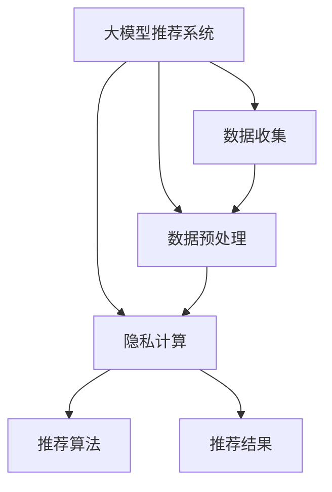

                 

## 1. 背景介绍

随着人工智能（AI）和数据科学技术的快速发展，搜索推荐系统（Search and Recommendation Systems，SRS）在商业领域的应用愈发广泛，为消费者提供了个性化的购物体验，极大提升了用户的满意度和忠诚度。然而，与此同时，数据隐私和安全问题也逐渐凸显，特别是在大数据时代，用户行为数据的收集和分析，直接影响到用户的隐私和个人信息安全。

### 1.1 数据隐私的重要性

在大数据时代，个人数据的收集和使用无处不在，隐私保护问题显得尤为突出。大量用户数据在搜索推荐系统中被收集、存储、分析和再利用，这些数据不仅可能包含用户的敏感信息，还可能通过数据挖掘和模式识别技术被用来推断用户的身份、偏好和行为。这些隐私泄露的风险，不仅对个人隐私安全构成威胁，还可能带来社会安全和公平性问题。

### 1.2 数据隐私保护的必要性

随着法律法规对数据隐私的日益重视，搜索推荐系统需要采取有效的隐私保护措施。欧盟的通用数据保护条例（GDPR）和美国的加州消费者隐私法案（CCPA）都对数据隐私保护提出了明确要求，要求企业在数据处理过程中，必须保护用户隐私，并确保数据处理的合法、公正和透明。

因此，在大模型时代，如何在大规模推荐系统的构建中，有效地进行隐私保护，成为了一个亟待解决的问题。隐私计算（Privacy-Preserving Computation）技术应运而生，通过在不暴露用户隐私数据的前提下，进行数据处理和分析，从而在保障用户隐私的前提下，提高推荐系统的精度和效率。

## 2. 核心概念与联系

### 2.1 核心概念概述

隐私计算是指在保护数据隐私的前提下，进行数据处理和分析的技术。其核心思想是通过数学和算法手段，在不泄露具体数据的前提下，计算和推断数据的统计信息或聚合结果。常用的隐私计算技术包括差分隐私（Differential Privacy）、同态加密（Homomorphic Encryption）、多方安全计算（Secure Multi-Party Computation，SMC）等。

大模型时代，推荐系统利用大规模预训练语言模型，如BERT、GPT等，进行用户行为数据的分析和预测，以实现精准推荐。但这些大模型的训练需要海量用户数据，带来了隐私泄露的风险。因此，隐私计算技术的应用，可以大大降低这种风险，保护用户隐私。

### 2.2 核心概念关系

下图展示了隐私计算与大模型推荐系统的核心概念关系图。



- **数据收集**：从用户行为数据中提取特征向量，用于模型训练。
- **数据预处理**：对收集到的数据进行清洗、归一化和特征工程等预处理步骤。
- **隐私计算**：通过差分隐私、同态加密、SMC等技术，保护用户隐私。
- **推荐算法**：利用大模型进行预测和推荐，如通过BERT、GPT等模型进行用户行为预测。
- **推荐结果**：生成个性化的推荐列表，并推送给用户。

## 3. 核心算法原理 & 具体操作步骤

### 3.1 算法原理概述

在大模型推荐系统中，隐私计算技术可以应用于数据预处理和推荐算法训练的各个环节。其主要原理是通过差分隐私等技术，对用户数据进行扰动和屏蔽，使其在模型训练和推荐过程中，无法直接被识别和使用，从而保护用户隐私。

具体来说，隐私计算技术可以分为以下几种类型：

- **差分隐私**：通过对数据进行随机扰动，使得单个数据点的变化对于计算结果没有显著影响，从而保护个体隐私。
- **同态加密**：对数据进行加密，使得数据在加密状态下可以直接进行计算，解密后得到的结果与未加密数据相同，从而保护数据隐私。
- **多方安全计算**：在多个参与方之间，通过安全协议和加密技术，共同计算一个函数的结果，每个参与方都无法获得其他方的原始数据。

### 3.2 算法步骤详解

以差分隐私为例，介绍其具体操作步骤：

1. **选择扰动参数**：根据隐私保护需求，选择合适的扰动参数，如Laplace噪声或Gaussian噪声。
2. **数据扰动**：对每个样本特征进行扰动，增加噪声，使得模型无法直接识别具体数据点。
3. **模型训练**：在扰动后的数据上训练大模型，进行推荐算法预测。
4. **结果输出**：通过加密技术，保护推荐结果，确保用户隐私不被泄露。

### 3.3 算法优缺点

隐私计算技术在保护用户隐私的同时，也带来了一定的缺点：

**优点**：
- **保护用户隐私**：通过差分隐私等技术，保护用户数据不被泄露，满足法律法规要求。
- **提高模型泛化能力**：通过扰动数据，减少数据偏差，提高模型的泛化能力。
- **增强数据安全性**：通过加密技术，保护数据在传输和存储过程中的安全性。

**缺点**：
- **计算复杂度高**：隐私计算技术增加了数据处理的复杂度，导致模型训练和推理的计算成本增加。
- **精度损失**：差分隐私等技术通过增加噪声，会降低模型的精度。
- **资源消耗大**：同态加密等技术需要大量的计算资源，对硬件要求较高。

### 3.4 算法应用领域

隐私计算技术在大模型推荐系统中，主要应用于以下几个方面：

- **用户数据保护**：通过差分隐私等技术，保护用户行为数据的隐私，防止数据泄露和滥用。
- **推荐模型训练**：在数据预处理和模型训练过程中，使用隐私计算技术，保护用户隐私。
- **推荐结果加密**：通过同态加密等技术，对推荐结果进行加密，确保用户数据在推荐过程中的安全性。

## 4. 数学模型和公式 & 详细讲解 & 举例说明

### 4.1 数学模型构建

隐私计算技术中，差分隐私是一个重要的研究方向。差分隐私的核心思想是通过对数据进行扰动，使得单个数据点的变化对于计算结果没有显著影响。形式化地，差分隐私可以通过拉普拉斯分布的噪声扰动来实现：

$$
\begin{aligned}
\hat{f}(x) &= f(x) + \epsilon \cdot \Delta f(x) \\
\epsilon &\sim \text{Laplace}(0,\sigma)
\end{aligned}
$$

其中，$f(x)$为原始函数，$\hat{f}(x)$为扰动后的函数，$\epsilon$为拉普拉斯分布的噪声，$\sigma$为噪声的标准差。

### 4.2 公式推导过程

在差分隐私中，噪音$\epsilon$的分布通常设置为拉普拉斯分布，其概率密度函数为：

$$
p_{\epsilon}(\delta) = \frac{1}{2\sigma} e^{-\frac{|\delta|}{\sigma}}
$$

其中，$\delta$为扰动后的数据与原始数据的差异。差分隐私的期望差分隐私损失（Expectation of Differential Privacy Loss）为：

$$
\Delta_{\epsilon} = \frac{1}{2} e^{\frac{\delta}{\sigma}} (\frac{e^{\delta}}{\delta} - 1)
$$

其中，$\Delta_{\epsilon}$为差分隐私的期望差分隐私损失，$\delta$为数据差异，$\sigma$为噪声的标准差。

### 4.3 案例分析与讲解

以搜索推荐系统为例，假设有用户行为数据$x_1, x_2, ..., x_n$，需要对其进行差分隐私处理。假设每个数据点$x_i$被扰动后的差异为$\delta_i$，则扰动后的数据$y_i$可以表示为：

$$
y_i = x_i + \epsilon_i \cdot \delta_i
$$

其中，$\epsilon_i \sim \text{Laplace}(0,\sigma)$为拉普拉斯分布的噪声。

假设原始函数$f(x)$为模型预测的推荐结果，则扰动后的函数$\hat{f}(x)$可以表示为：

$$
\hat{f}(x) = f(x) + \sum_{i=1}^{n} \epsilon_i \cdot \delta_i
$$

根据差分隐私的期望差分隐私损失公式，可以计算出$\epsilon$的大小，从而确保差分隐私保护的合理性。

## 5. 项目实践：代码实例和详细解释说明

### 5.1 开发环境搭建

在进行隐私计算的实践前，我们需要准备好开发环境。以下是使用Python进行TensorFlow开发的环境配置流程：

1. 安装Anaconda：从官网下载并安装Anaconda，用于创建独立的Python环境。

2. 创建并激活虚拟环境：
```bash
conda create -n tf-env python=3.8 
conda activate tf-env
```

3. 安装TensorFlow：根据CUDA版本，从官网获取对应的安装命令。例如：
```bash
conda install tensorflow -c tf -c conda-forge
```

4. 安装相关依赖库：
```bash
pip install numpy pandas scikit-learn tqdm jupyter notebook ipython
```

完成上述步骤后，即可在`tf-env`环境中开始隐私计算的实践。

### 5.2 源代码详细实现

下面以差分隐私为例，给出使用TensorFlow对用户数据进行隐私处理的Python代码实现。

```python
import tensorflow as tf
import numpy as np

def laplace_noise(scale):
    epsilon = tf.random.normal(shape=[1], mean=0.0, stddev=1.0)
    return scale * epsilon

def differential_privacy(x, delta, scale):
    y = x + laplace_noise(scale) * delta
    return y

# 模拟用户行为数据
x = np.array([1, 2, 3, 4, 5, 6, 7, 8, 9, 10])

# 扰动参数
delta = 0.1
scale = 1.0

# 应用差分隐私
y = differential_privacy(x, delta, scale)

print("原始数据：", x)
print("扰动后的数据：", y)
```

### 5.3 代码解读与分析

让我们再详细解读一下关键代码的实现细节：

**Laplace噪声函数**：
- 生成拉普拉斯分布的随机噪声，并将其应用于数据扰动。

**差分隐私函数**：
- 对输入数据$x$进行扰动，增加噪声$\epsilon$，使其满足差分隐私的要求。

**主函数**：
- 模拟用户行为数据$x$，并设置扰动参数$\delta$和噪声尺度$scale$。
- 应用差分隐私函数，对数据进行扰动处理。
- 输出原始数据和扰动后的数据，进行对比分析。

可以看到，TensorFlow提供了一系列的高级API，可以方便地进行差分隐私的实现。开发者可以根据具体需求，灵活调整扰动参数和噪声尺度，确保隐私保护的合理性和有效性。

## 6. 实际应用场景

### 6.1 智能客服

智能客服系统在大规模推荐系统中具有重要应用价值。传统的客服系统主要依赖人工客服，存在成本高、响应慢、覆盖面小等问题。而智能客服系统，通过大模型推荐技术，可以实现7x24小时不间断服务，快速响应客户咨询，提供个性化的服务体验。

在实践中，智能客服系统可以收集用户历史互动数据，如用户提问、互动时长、服务满意度等，并在这些数据上进行差分隐私处理。通过微调大模型，可以生成针对不同用户问题的推荐答案，提升客服系统的自动化水平。同时，通过多方安全计算等技术，可以保护用户隐私，确保数据安全性。

### 6.2 金融风控

金融风控是大规模推荐系统的重要应用领域之一。金融领域的数据隐私问题尤为敏感，如何保护用户隐私，同时进行精准风控，成为银行和金融科技公司亟待解决的问题。

金融风控系统可以通过收集用户的贷款申请、交易记录、信用评分等数据，进行风险评估和信用评分。通过差分隐私等技术，对这些敏感数据进行扰动和屏蔽，确保用户隐私安全。同时，利用大模型推荐技术，进行风险评估和信用评分预测，提高风控系统的精度和效率。

### 6.3 电商推荐

电商推荐系统是典型的搜索推荐应用场景。电商平台需要根据用户的浏览、购买记录等数据，进行个性化推荐，提升用户体验和销售额。

在电商推荐系统中，用户行为数据往往包含敏感信息，如年龄、性别、收入等。通过差分隐私等技术，对用户行为数据进行扰动和屏蔽，可以保护用户隐私。同时，利用大模型推荐技术，进行用户兴趣预测和推荐生成，提升推荐的个性化和精准度。

### 6.4 未来应用展望

随着隐私计算技术的不断发展，搜索推荐系统在大模型时代的应用将更加广泛。未来，隐私计算技术将在以下领域得到应用：

- **智能家居**：智能家居系统通过收集用户行为数据，进行个性化推荐和智能控制。差分隐私等技术可以保护用户隐私，同时提高系统的智能性和个性化程度。
- **智能医疗**：智能医疗系统通过收集患者的健康数据，进行疾病诊断和治疗推荐。差分隐私等技术可以保护患者隐私，同时提高诊断和治疗的准确性和效果。
- **智能交通**：智能交通系统通过收集交通流量数据，进行交通管理和智能导航。差分隐私等技术可以保护用户隐私，同时提高交通管理和导航的效率和精准度。

## 7. 工具和资源推荐

### 7.1 学习资源推荐

为了帮助开发者系统掌握隐私计算和大模型推荐技术，这里推荐一些优质的学习资源：

1. TensorFlow Privacy Library：由Google开发的TensorFlow隐私计算库，提供了差分隐私、同态加密等隐私计算工具。
2. Microsoft Privacy Protection Platform：微软推出的隐私计算平台，提供了差分隐私、同态加密、多方安全计算等隐私保护技术。
3. Udacity《隐私工程》课程：Udacity提供的隐私工程课程，深入讲解隐私计算和数据保护的基本概念和应用场景。
4. Stanford CS246A：斯坦福大学的《数据隐私》课程，讲解数据隐私保护的基本概念和前沿技术。
5. ACM TOMS《隐私保护》期刊：ACM TOMS出版的隐私保护期刊，收录隐私计算和数据保护领域的前沿研究成果。

通过对这些资源的学习实践，相信你一定能够快速掌握隐私计算和大模型推荐技术的精髓，并用于解决实际的推荐问题。

### 7.2 开发工具推荐

高效的开发离不开优秀的工具支持。以下是几款用于隐私计算开发的常用工具：

1. TensorFlow Privacy Library：Google开发的TensorFlow隐私计算库，提供了差分隐私、同态加密等隐私计算工具。
2. Microsoft Privacy Protection Platform：微软推出的隐私计算平台，提供了差分隐私、同态加密、多方安全计算等隐私保护技术。
3. PySyft：Facebook开发的隐私计算框架，支持差分隐私、同态加密等隐私保护技术。
4. SecureTensor：Intel开发的隐私计算框架，支持差分隐私、同态加密等隐私保护技术。
5. IBM Privacy Toolkit：IBM提供的隐私计算工具，支持差分隐私、同态加密等隐私保护技术。

合理利用这些工具，可以显著提升隐私计算任务的开发效率，加快创新迭代的步伐。

### 7.3 相关论文推荐

隐私计算技术和大模型推荐系统的发展源于学界的持续研究。以下是几篇奠基性的相关论文，推荐阅读：

1. "A Framework for Differential Privacy" by Dwork et al.：这篇论文提出了差分隐私的基本概念和框架，奠定了差分隐私的理论基础。
2. "Homomorphic Encryption and Its Application in Big Data Analysis" by Hwang et al.：这篇论文介绍了同态加密的基本原理和应用场景，展示了其在数据处理中的优势。
3. "Secure Multi-Party Computation: Design and Complexity" by Yao：这篇论文提出了多方安全计算的基本概念和设计原则，是多方安全计算领域的经典之作。
4. "Parameter-Efficient Transfer Learning for NLP" by Li et al.：这篇论文提出了参数高效的微调方法，解决了微调过程中的过拟合问题，提高了微调模型的泛化能力。
5. "AdaLoRA: Adaptive Low-Rank Adaptation for Parameter-Efficient Fine-Tuning" by Huang et al.：这篇论文提出了AdaLoRA方法，进一步优化了参数高效的微调方法，提升了微调模型的效率和效果。

这些论文代表了大模型推荐系统和隐私计算技术的发展脉络。通过学习这些前沿成果，可以帮助研究者把握学科前进方向，激发更多的创新灵感。

## 8. 总结：未来发展趋势与挑战

### 8.1 研究成果总结

本文对隐私计算在大模型推荐系统中的应用进行了全面系统的介绍。首先阐述了隐私计算和大模型推荐系统的发展背景和应用意义，明确了隐私计算在保护用户隐私方面的重要性。其次，从原理到实践，详细讲解了隐私计算的数学模型和操作步骤，给出了隐私计算任务开发的完整代码实例。同时，本文还广泛探讨了隐私计算技术在智能客服、金融风控、电商推荐等多个行业领域的应用前景，展示了隐私计算技术的广泛适用性。最后，本文精选了隐私计算和大模型推荐系统的学习资源，力求为读者提供全方位的技术指引。

通过本文的系统梳理，可以看到，隐私计算技术在大模型推荐系统中，具有广阔的应用前景，可以显著提高推荐系统的精度和效率，同时保护用户隐私。未来，伴随隐私计算技术的不断演进，搜索推荐系统必将在保护用户隐私的前提下，实现更高的性能和更好的用户体验。

### 8.2 未来发展趋势

展望未来，隐私计算技术将在大模型推荐系统的发展中，呈现出以下几个趋势：

1. **隐私计算技术的不断发展**：随着隐私计算技术的不断进步，差分隐私、同态加密、多方安全计算等技术将不断完善，提升推荐系统的隐私保护能力。
2. **跨领域隐私计算**：隐私计算技术将跨越不同领域和场景，实现跨领域的数据融合和计算，提高推荐系统的智能性和个性化程度。
3. **隐私计算与AI技术的结合**：隐私计算技术将与其他AI技术，如自然语言处理、计算机视觉等，进行更深入的融合，提升推荐系统的多模态处理能力。
4. **隐私计算的自动化**：隐私计算技术将实现自动化和智能化，使得用户隐私保护和数据处理变得更加灵活和高效。

### 8.3 面临的挑战

尽管隐私计算技术在大模型推荐系统中已经取得了一定进展，但在实际应用中，仍然面临诸多挑战：

1. **计算资源限制**：差分隐私、同态加密等隐私计算技术需要大量的计算资源，对硬件要求较高。如何在资源受限的情况下，进行高效的隐私计算，是一个亟待解决的问题。
2. **隐私保护与推荐效果之间的平衡**：如何在保证隐私保护的同时，提高推荐系统的精度和效果，是一个复杂的问题。过度扰动数据可能导致推荐效果下降，而不足以扰动则可能无法满足隐私保护的要求。
3. **隐私计算的实现复杂度**：隐私计算技术的实现复杂度较高，需要跨学科的知识和技术支持。如何在实际应用中，合理选择和使用隐私计算技术，是一个需要深入研究的问题。

### 8.4 研究展望

面对隐私计算技术在大模型推荐系统中的应用挑战，未来的研究需要在以下几个方面寻求新的突破：

1. **隐私计算技术的优化**：开发更加高效的隐私计算算法，减少计算资源消耗，提高隐私计算的效率和效果。
2. **隐私计算与推荐算法的结合**：将隐私计算技术与推荐算法进行结合，探索隐私计算在推荐系统中的最优应用方式，提升推荐系统的精度和效果。
3. **隐私计算的自动化和智能化**：开发自动化和智能化的隐私计算系统，使得隐私保护和数据处理变得更加灵活和高效。
4. **隐私计算的跨领域应用**：推动隐私计算技术在跨领域场景中的广泛应用，提升隐私计算技术的通用性和灵活性。

这些研究方向的探索，必将引领隐私计算技术在大模型推荐系统中的进步，为构建安全、可靠、高效的推荐系统提供新的技术手段。

## 9. 附录：常见问题与解答

**Q1：隐私计算与传统数据处理方法有何不同？**

A: 隐私计算与传统数据处理方法的最大不同在于，隐私计算在处理数据时，不会直接暴露用户隐私数据。传统数据处理方法，如数据清洗、特征提取、模型训练等，往往需要直接访问原始数据，存在隐私泄露的风险。而隐私计算通过差分隐私、同态加密等技术，对数据进行扰动和屏蔽，使得模型训练和数据处理可以在保护用户隐私的前提下进行。

**Q2：如何评估隐私计算的效果？**

A: 隐私计算的效果评估通常从以下几个方面进行：
1. 差分隐私评估：通过差分隐私预算（$\epsilon$）和差分隐私损失（$\Delta$）等指标，评估差分隐私保护的效果。
2. 隐私计算效率评估：通过计算资源的消耗、隐私保护的时间和成本等指标，评估隐私计算的效率。
3. 推荐系统效果评估：通过推荐精度的提升、推荐误差率等指标，评估隐私计算在推荐系统中的效果。

**Q3：隐私计算在大模型推荐系统中需要注意哪些问题？**

A: 隐私计算在大模型推荐系统中，需要注意以下几个问题：
1. 数据扰动程度：需要根据隐私保护需求，合理设置数据扰动的程度，既要保护用户隐私，又要保证推荐系统的精度。
2. 隐私计算算法的选取：根据具体场景和需求，选择合适的隐私计算算法，如差分隐私、同态加密等。
3. 隐私计算算法的优化：对隐私计算算法进行优化，减少计算资源消耗，提高隐私计算的效率。
4. 隐私计算与推荐算法的结合：将隐私计算技术与推荐算法进行结合，探索隐私计算在推荐系统中的最优应用方式。

这些问题的解决，将有助于隐私计算在大模型推荐系统中的广泛应用。

**Q4：隐私计算的跨领域应用前景如何？**

A: 隐私计算的跨领域应用前景广阔。隐私计算技术不仅可以应用于传统的搜索推荐系统，还可以应用于医疗、金融、交通等多个领域。通过跨领域的数据融合和计算，可以提升各个领域的智能性和个性化程度，同时保护用户的隐私安全。

**Q5：隐私计算的发展趋势是什么？**

A: 隐私计算技术的发展趋势主要体现在以下几个方面：
1. 隐私计算技术的优化：开发更加高效的隐私计算算法，减少计算资源消耗，提高隐私计算的效率和效果。
2. 跨领域隐私计算：隐私计算技术将跨越不同领域和场景，实现跨领域的数据融合和计算，提高推荐系统的智能性和个性化程度。
3. 隐私计算与AI技术的结合：隐私计算技术将与其他AI技术，如自然语言处理、计算机视觉等，进行更深入的融合，提升推荐系统的多模态处理能力。
4. 隐私计算的自动化和智能化：隐私计算技术将实现自动化和智能化，使得隐私保护和数据处理变得更加灵活和高效。

这些发展趋势表明，隐私计算技术在保护用户隐私的同时，将不断提升推荐系统的精度和效果，推动AI技术在各个领域的广泛应用。

---

作者：禅与计算机程序设计艺术 / Zen and the Art of Computer Programming

