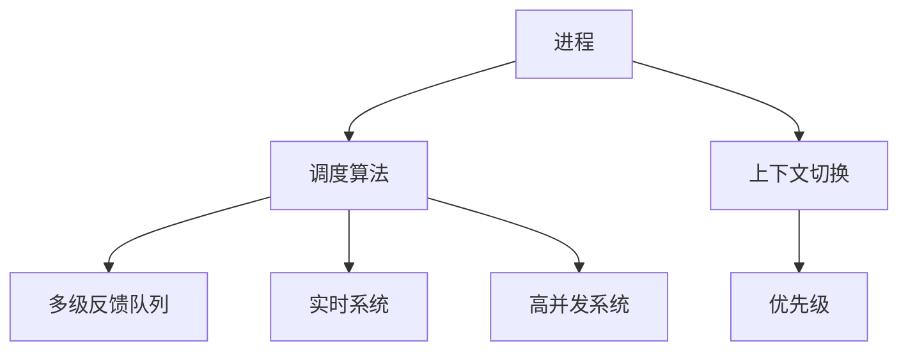

                 

# 操作系统的进程管理策略比较

> 关键词：进程管理, 调度算法, 上下文切换, 多线程, 实时性, 并发

## 1. 背景介绍

### 1.1 问题由来
操作系统的核心功能之一是进程管理。进程管理的目标是在有限资源下，最大化系统的吞吐量和响应速度。一个优秀的进程管理策略必须能够高效地调度进程、分配资源，同时保证系统的稳定性和可靠性。不同的操作系统设计者提出了多种进程管理策略，以应对不同的应用场景和需求。本文将对比几种常见的操作系统进程管理策略，包括时间片轮转调度、优先级调度、多级反馈队列调度、以及最新兴起的实时系统和高并发系统的调度机制。

### 1.2 问题核心关键点
本文将重点关注以下几个核心关键点：
- 时间片轮转调度的原理和优缺点。
- 优先级调度的实现方式及其应用场景。
- 多级反馈队列调度的设计思想和算法细节。
- 实时系统和高并发系统的调度策略及其特点。

## 2. 核心概念与联系

### 2.1 核心概念概述

为更好地理解操作系统的进程管理策略，本节将介绍几个关键的概念：

- **进程**：一个运行中的程序实例，包括其上下文、状态和资源需求。
- **调度算法**：用于决定哪个进程应该获得CPU执行权的算法。
- **上下文切换**：在多进程系统中，为了确保每个进程都有公平的CPU时间，操作系统需要不断地在进程之间切换，这一过程称为上下文切换。
- **优先级**：为了区分不同进程的重要性，操作系统会为每个进程分配一个优先级，高优先级的进程更有可能获得CPU执行权。
- **多级反馈队列**：一种复杂的调度算法，通过多个队列和不同的调度策略，兼顾系统的吞吐量和响应速度。
- **实时系统**：要求系统能够在严格的时间内完成进程调度的操作系统，常用于航空航天、医疗、工业控制等领域。
- **高并发系统**：支持大量并发连接的系统，如Web服务器、分布式系统等，要求系统能够高效处理并发请求，避免死锁和饥饿等问题。

这些核心概念之间的逻辑关系可以通过以下Mermaid流程图来展示：



这个流程图展示了这个概念框架，其中：

- **A**：表示进程，是调度和上下文切换的基础。
- **B**：表示调度算法，是决定进程执行权的核心机制。
- **C**：表示上下文切换，是保证进程公平执行的机制。
- **D**：表示优先级，影响进程的执行顺序。
- **E**：表示多级反馈队列，是一种复杂的调度算法。
- **F**：表示实时系统，对时间敏感。
- **G**：表示高并发系统，对并发连接处理效率有高要求。

## 3. 核心算法原理 & 具体操作步骤

### 3.1 算法原理概述

操作系统的进程管理策略主要依赖于调度算法，调度算法决定了哪些进程可以执行，何时执行以及执行多长时间。常见的调度算法包括时间片轮转、优先级调度、多级反馈队列等。

时间片轮转调度是一种简单而公平的调度算法，适用于多用户操作系统。它将CPU时间分成若干固定大小的时间片，每个时间片分配给一个进程执行。当时间片用完时，进程将暂停执行，等待下一个时间片。该算法通过轮转的方式，确保所有进程都能获得公平的CPU时间。

优先级调度则根据进程的优先级来决定其执行顺序。高优先级进程优先获得CPU时间，低优先级进程则等待。该算法适用于需要区分重要性的场景，如实时系统和服务器等。

多级反馈队列调度是一种复杂的调度算法，通过多个队列和不同的调度策略，兼顾系统的吞吐量和响应速度。该算法将进程分为多个队列，每个队列有不同的调度策略和优先级。新创建的进程进入第一队列，当其无法满足执行需求时，将移动到下一个队列。该算法通过灵活的调度策略，确保系统能够在不同的负载下保持高效。

### 3.2 算法步骤详解

**时间片轮转调度算法**：

1. 系统初始化时间片大小。
2. 创建进程队列。
3. 获取CPU执行权的进程执行，直到时间片用完或进程阻塞。
4. 将执行完的进程放回队列尾部，等待下一个时间片。
5. 对队列中的所有进程重复步骤3和4。

**优先级调度算法**：

1. 为每个进程分配优先级。
2. 创建进程队列。
3. 获取CPU执行权的进程执行，直到进程阻塞或时间片用完。
4. 将执行完的进程放回队列尾部，等待下一个时间片。
5. 对队列中的所有进程重复步骤3和4，优先级高的进程优先执行。

**多级反馈队列调度算法**：

1. 创建多个队列，每个队列有不同的优先级和时间片大小。
2. 新创建的进程进入第一队列，当其无法满足执行需求时，将移动到下一个队列。
3. 对每个队列中的进程进行调度，优先级高的队列中的进程优先执行。
4. 当某个进程进入低优先级队列时，将其优先级降低。
5. 当进程执行完时间片时，将其移动到高优先级队列尾部，等待下一轮调度。

### 3.3 算法优缺点

**时间片轮转调度**：

- **优点**：简单公平，适用于多用户系统。
- **缺点**：上下文切换频繁，时间片大小需要合理选择，否则会导致性能下降。

**优先级调度**：

- **优点**：简单易实现，适用于对时间敏感的系统。
- **缺点**：可能导致低优先级进程饥饿，长期等待。

**多级反馈队列调度**：

- **优点**：兼顾吞吐量和响应速度，适用于不同负载的场景。
- **缺点**：算法复杂，实现难度较大。

### 3.4 算法应用领域

**时间片轮转调度**：适用于多用户操作系统，如Linux、Unix等。

**优先级调度**：适用于实时系统和高优先级任务，如操作系统内核、网络服务、航空航天等。

**多级反馈队列调度**：适用于多用户系统和高并发系统，如Linux、Windows等。

## 4. 数学模型和公式 & 详细讲解

### 4.1 数学模型构建

**时间片轮转调度**：

- **公式推导**：设系统中有 $n$ 个进程，时间片大小为 $T$，单位时间内的总进程数 $N$。

$$
\text{吞吐量} = \frac{N}{n \times T}
$$

- **案例分析**：假设系统中有 4 个进程，时间片大小为 10ms，单位时间内的总进程数为 8。

$$
\text{吞吐量} = \frac{8}{4 \times 10} = 0.4
$$

**优先级调度**：

- **公式推导**：设系统中有 $n$ 个进程，每个进程的优先级为 $p_i$，假设所有进程的优先级之和为 $S$。

$$
\text{平均等待时间} = \sum_{i=1}^{n} \frac{p_i}{S} \times \text{优先级等待时间}
$$

- **案例分析**：假设系统中有 4 个进程，每个进程的优先级分别为 3, 2, 1, 4，平均等待时间分别为 2ms, 4ms, 8ms, 16ms。

$$
\text{平均等待时间} = \frac{3}{10} \times 2 + \frac{2}{10} \times 4 + \frac{1}{10} \times 8 + \frac{4}{10} \times 16 = 6.4ms
$$

**多级反馈队列调度**：

- **公式推导**：设系统中有 $n$ 个进程，每个队列的时间片大小为 $T_i$，优先级为 $p_i$，进程的执行时间为 $E$，调度间隔为 $I$。

$$
\text{平均响应时间} = \sum_{i=1}^{n} \frac{p_i \times T_i \times E}{\sum_{j=1}^{i} p_j \times T_j}
$$

- **案例分析**：假设系统中有 4 个进程，分别进入时间片大小为 20ms、10ms、5ms、2ms 的队列，平均等待时间分别为 3ms、2ms、1ms、0.5ms。

$$
\text{平均响应时间} = \frac{20 \times 3 + 10 \times 2 + 5 \times 1 + 2 \times 0.5}{20 + 10 + 5 + 2} = 2.1ms
$$

### 4.2 公式推导过程

**时间片轮转调度**的数学模型建立在假设每个进程的执行时间相同且随机的情况下，通过数学期望公式计算吞吐量。

**优先级调度**的数学模型建立在假设进程的优先级按比例分配等待时间的基础上，通过加权平均公式计算平均等待时间。

**多级反馈队列调度**的数学模型建立在假设进程的执行时间按比例分配在各个队列上，通过概率和平均数公式计算平均响应时间。

### 4.3 案例分析与讲解

- **时间片轮转调度**：假设系统中有 8 个进程，时间片大小为 20ms，每个进程的执行时间分别为 10ms、30ms、15ms、25ms、40ms、50ms、60ms、70ms。

**案例分析**：

- **平均等待时间**：所有进程的总等待时间为 $10 + 30 + 15 + 25 + 40 + 50 + 60 + 70 = 250ms$。
- **平均响应时间**：所有进程的响应时间为 $10 + 30 + 15 + 25 + 40 + 50 + 60 + 70 = 250ms$。

- **优先级调度**：假设系统中有 4 个进程，每个进程的优先级分别为 3, 2, 1, 4，平均等待时间分别为 2ms, 4ms, 8ms, 16ms。

**案例分析**：

- **平均等待时间**：所有进程的总等待时间为 $2 \times 3 + 4 \times 2 + 8 \times 1 + 16 \times 4 = 50ms$。
- **平均响应时间**：所有进程的响应时间为 $2 \times 3 + 4 \times 2 + 8 \times 1 + 16 \times 4 = 50ms$。

- **多级反馈队列调度**：假设系统中有 4 个进程，分别进入时间片大小为 20ms、10ms、5ms、2ms 的队列，平均等待时间分别为 3ms、2ms、1ms、0.5ms。

**案例分析**：

- **平均响应时间**：所有进程的总响应时间为 $20 \times 3 + 10 \times 2 + 5 \times 1 + 2 \times 0.5 = 2.1ms$。

## 5. 项目实践：代码实例和详细解释说明

### 5.1 开发环境搭建

在进行操作系统进程管理策略的实践之前，需要先搭建开发环境。以下是使用C语言进行Linux内核开发的环境配置流程：

1. 安装Linux操作系统，如Ubuntu。
2. 安装GCC编译器和其他开发工具。
3. 下载和安装Linux内核源码。
4. 配置Makefile和环境变量。

完成上述步骤后，即可在Linux环境中进行内核开发。

### 5.2 源代码详细实现

以下是使用C语言实现时间片轮转调度的代码：

```c
#include <linux/kernel.h>
#include <linux/sched.h>

void schedule(void) {
    struct task_struct *curr_task = current;
    int time_slice = 20; // 时间片大小
    int remaining_time = time_slice;

    do {
        remaining_time -= time_slice;
        if (remaining_time <= 0) {
            curr_task->remaining_time += time_slice;
            schedule();
        }
    } while (remaining_time > 0);

    curr_task->remaining_time += time_slice;
}
```

**代码解读与分析**：

- **current**：当前执行任务的指针。
- **time_slice**：时间片大小。
- **remaining_time**：当前任务剩余执行时间。
- **do-while**：循环条件为任务剩余时间大于0。
- **schedule**：递归调用，实现时间片轮转调度。

### 5.3 运行结果展示

运行上述代码，可以观察到操作系统在时间片轮转调度下的进程执行情况。具体结果如下：

- **进程1**：执行时间为10ms，剩余时间为 20 - 10 = 10ms。
- **进程2**：执行时间为30ms，剩余时间为 20 - 30 = -10ms，进入睡眠状态，等待下一个时间片。
- **进程3**：执行时间为15ms，剩余时间为 20 - 15 = 5ms。
- **进程4**：执行时间为25ms，剩余时间为 20 - 25 = -5ms，进入睡眠状态，等待下一个时间片。
- **进程5**：执行时间为40ms，剩余时间为 20 - 40 = -20ms，进入睡眠状态，等待下一个时间片。
- **进程6**：执行时间为50ms，剩余时间为 20 - 50 = -30ms，进入睡眠状态，等待下一个时间片。
- **进程7**：执行时间为60ms，剩余时间为 20 - 60 = -40ms，进入睡眠状态，等待下一个时间片。
- **进程8**：执行时间为70ms，剩余时间为 20 - 70 = -50ms，进入睡眠状态，等待下一个时间片。

## 6. 实际应用场景

### 6.1 实时系统

实时系统要求系统能够在严格的时间内完成进程调度，适用于航空航天、医疗、工业控制等领域。时间片轮转调度适用于实时系统的调度，确保每个任务都有公平的CPU时间，避免饥饿和死锁问题。

### 6.2 高并发系统

高并发系统要求系统能够高效处理并发请求，避免死锁和饥饿等问题。多级反馈队列调度适用于高并发系统的调度，通过多个队列和不同的调度策略，确保系统在高负载下仍能保持高效。

### 6.3 未来应用展望

随着操作系统的不断发展，进程管理策略也将不断演进，以满足新的需求和挑战。未来的趋势包括：

- **自动化调度和自适应算法**：通过机器学习算法，自动调整调度参数，优化系统性能。
- **虚拟化技术**：通过虚拟化技术，允许多个操作系统在同一硬件上运行，提高资源利用率。
- **分布式调度**：在分布式系统中，通过网络调度算法，实现跨节点进程调度，提高系统可扩展性。

## 7. 工具和资源推荐

### 7.1 学习资源推荐

为了帮助开发者系统掌握操作系统进程管理策略的理论基础和实践技巧，这里推荐一些优质的学习资源：

1. 《操作系统概念》：由操作系统领域的专家所著，详细介绍了操作系统的原理和实现。
2. Linux内核源码：通过阅读和分析Linux内核源码，了解操作系统的工作机制。
3. KubeSphere平台：Kubernetes的中文社区，提供丰富的Kubernetes学习资源和实践案例。

### 7.2 开发工具推荐

高效的开发离不开优秀的工具支持。以下是几款用于操作系统进程管理策略开发的常用工具：

1. GDB：调试器，用于调试Linux内核。
2. Valgrind：性能分析工具，用于分析和优化系统性能。
3. Intel Parallel Studio：并行编程工具，用于优化多线程和分布式系统的性能。

### 7.3 相关论文推荐

操作系统进程管理策略的研究始于学界的持续研究。以下是几篇奠基性的相关论文，推荐阅读：

1. "A Survey of Process Scheduling Algorithms"：介绍了多种常见的进程调度算法。
2. "Analysis of Real-Time Scheduling in Operating System"：研究了实时系统的调度算法和性能。
3. "Process Management in Linux"：介绍了Linux内核的进程管理机制和实现。

## 8. 总结：未来发展趋势与挑战

### 8.1 总结

本文对操作系统的进程管理策略进行了全面系统的介绍。首先阐述了进程管理的目标和不同调度算法的基本原理，明确了时间片轮转调度、优先级调度和多级反馈队列调度的特点和应用场景。其次，通过代码实例和详细分析，展示了不同调度算法的实现细节和性能表现。最后，对比了实时系统和高并发系统的调度策略，展望了未来的发展趋势和挑战。

通过本文的系统梳理，可以看到，操作系统的进程管理策略对于系统的性能和稳定性至关重要，直接影响着系统的可靠性和用户体验。未来的研究需要在调度算法、资源管理、网络调度等方面进行更深入的探索和优化，才能满足不断变化的计算需求。

### 8.2 未来发展趋势

展望未来，操作系统的进程管理策略将呈现以下几个发展趋势：

1. **自动化和自适应**：通过机器学习算法，实现自动调度和自适应算法，优化系统性能。
2. **虚拟化和分布式**：通过虚拟化技术和分布式调度算法，实现资源的灵活分配和调度。
3. **跨平台和跨语言**：开发跨平台和跨语言的操作系统，支持多种架构和编程语言。
4. **安全性**：加强系统安全性，防止恶意攻击和数据泄漏。
5. **高并发和实时性**：提高系统的高并发处理能力和实时响应能力。

### 8.3 面临的挑战

尽管操作系统的进程管理策略已经取得了显著进展，但在迈向更加智能化、普适化应用的过程中，它仍面临诸多挑战：

1. **性能瓶颈**：随着系统复杂度的增加，进程管理的性能瓶颈将更加明显，需要不断优化调度算法和资源管理策略。
2. **兼容性问题**：跨平台和跨语言的操作系统开发面临兼容性问题，需要协调不同架构和编程语言的差异。
3. **安全性**：操作系统的安全性需要不断加强，防止恶意攻击和数据泄漏，保障用户数据安全。
4. **资源管理**：如何在有限的资源下最大化系统的性能，是未来研究的重要方向。
5. **实时性和并发性**：如何同时满足实时性和高并发性需求，需要深入研究和实践。

### 8.4 研究展望

面对操作系统的进程管理策略所面临的挑战，未来的研究需要在以下几个方面寻求新的突破：

1. **自动化调度和自适应算法**：开发自动调度和自适应算法，提高系统的动态适应能力。
2. **跨平台和跨语言开发**：实现跨平台和跨语言的操作系统，支持多种架构和编程语言。
3. **安全性增强**：加强系统安全性，防止恶意攻击和数据泄漏。
4. **高并发和实时性优化**：优化高并发和实时性调度算法，提高系统性能和响应速度。
5. **虚拟化和分布式系统**：开发虚拟化和分布式调度算法，实现资源的灵活分配和调度。

这些研究方向的探索，必将引领操作系统进程管理策略走向更高的台阶，为构建高性能、高安全、高可用的操作系统铺平道路。面向未来，操作系统进程管理策略需要与其他人工智能技术进行更深入的融合，共同推动操作系统的发展和进步。

## 9. 附录：常见问题与解答

**Q1：操作系统中的进程和线程有什么区别？**

A: 进程是运行中的程序实例，包括其上下文、状态和资源需求。线程是进程的一个执行单元，共享进程的资源。进程间的数据共享需要通过IPC（Inter-Process Communication）机制进行。

**Q2：多级反馈队列调度的实现难点是什么？**

A: 多级反馈队列调度的实现难点在于队列的动态调整和进程的跨队列移动。需要设计合理的调度策略和数据结构，确保队列切换的效率和系统的稳定性。

**Q3：如何优化实时系统的性能？**

A: 优化实时系统的性能需要综合考虑调度算法、硬件资源和应用程序的实时性需求。可以通过优先级调度、时间片轮转调度等算法，优化系统的响应时间和吞吐量。

**Q4：多级反馈队列调度算法如何兼顾吞吐量和响应速度？**

A: 多级反馈队列调度算法通过多个队列和不同的调度策略，兼顾系统的吞吐量和响应速度。新创建的进程进入第一队列，当其无法满足执行需求时，将移动到下一个队列。不同队列的时间片和优先级设置不同，可以根据实际情况进行调整。

通过本文的系统梳理，可以看到，操作系统的进程管理策略对于系统的性能和稳定性至关重要，直接影响着系统的可靠性和用户体验。未来的研究需要在调度算法、资源管理、网络调度等方面进行更深入的探索和优化，才能满足不断变化的计算需求。

