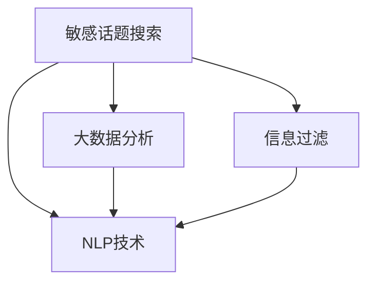

                 

# 敏感话题搜索：AI的平衡之道

## 1. 背景介绍

在数字时代，信息自由流通的同时，也带来了新的挑战。如何在保证言论自由的同时，维护社会秩序，避免信息的滥用和误导，是一个亟待解决的难题。AI技术，特别是自然语言处理(NLP)和大数据分析，为这一问题的解决提供了新的思路和工具。本文将从敏感话题搜索的视角，探讨AI技术的平衡之道。

## 2. 核心概念与联系

### 2.1 核心概念概述

- **敏感话题搜索**：指在文本数据中自动识别和定位涉及敏感信息的搜索结果，帮助用户更安全地获取信息。
- **自然语言处理(NLP)**：涉及文本数据的处理、分析、生成等任务，是敏感话题搜索的核心技术。
- **大数据分析**：利用海量数据，通过机器学习等技术，提取和分析数据中的潜在模式和关联。
- **信息过滤**：通过过滤算法，限制敏感信息的传播，避免对社会稳定和个体隐私造成负面影响。

这些概念之间的逻辑关系可以通过以下Mermaid流程图来展示：



## 3. 核心算法原理 & 具体操作步骤

### 3.1 算法原理概述

敏感话题搜索涉及对大规模文本数据的自动分析和处理，核心算法包括文本分类、实体识别、情感分析、主题建模等。本文将重点介绍文本分类和实体识别的原理和操作步骤。

### 3.2 算法步骤详解

#### 3.2.1 文本分类

文本分类是将文本分为预先定义的类别的任务，常见的分类方法包括朴素贝叶斯、支持向量机(SVM)、逻辑回归、神经网络等。以神经网络为例，其基本步骤包括：

1. 数据预处理：对文本进行分词、去停用词、向量化等处理。
2. 搭建模型：构建多层神经网络，包括嵌入层、隐藏层和输出层。
3. 训练模型：使用标记数据对模型进行训练，最小化损失函数。
4. 模型评估：使用测试集对模型进行评估，计算准确率、召回率等指标。
5. 模型应用：将新文本输入模型，得到分类结果。

#### 3.2.2 实体识别

实体识别是从文本中自动识别的具有特定意义的实体，如人名、地名、机构名等。常用的实体识别方法包括基于规则的方法、基于统计的方法和深度学习方法。以深度学习为例，其基本步骤如下：

1. 数据准备：收集标注好的实体数据，并将其转化为格式统一的训练集。
2. 模型构建：选择适当的模型架构，如BiLSTM-CRF模型。
3. 参数训练：使用标注数据训练模型，最小化损失函数。
4. 模型评估：使用测试集对模型进行评估，计算F1分数等指标。
5. 模型应用：将新文本输入模型，得到实体识别结果。

### 3.3 算法优缺点

#### 3.3.1 优点

- **自动化**：使用机器学习模型可以自动完成敏感话题的识别和分类，节省人力和时间。
- **准确性高**：深度学习模型在处理大规模数据时具有较好的泛化能力和准确性。
- **可扩展性**：模型可以轻松扩展到不同领域和任务，如金融、医疗、法律等。

#### 3.3.2 缺点

- **数据需求高**：需要大量标记数据来训练模型，数据收集和标注成本较高。
- **模型复杂**：深度学习模型结构复杂，训练和推理过程耗时较长。
- **解释性差**：深度学习模型通常是"黑盒"，难以解释其内部工作机制。

### 3.4 算法应用领域

敏感话题搜索在以下几个领域有着广泛的应用：

- **新闻出版**：自动过滤敏感信息，防止假新闻的传播。
- **社交媒体管理**：自动识别和屏蔽敏感内容，避免网络暴力和虚假信息。
- **企业舆情监控**：实时监测社交媒体，防范品牌声誉受损。
- **政府信息发布**：确保信息发布的安全性和准确性，防止信息泄露。

## 4. 数学模型和公式 & 详细讲解 & 举例说明

### 4.1 数学模型构建

#### 4.1.1 文本分类

文本分类常用的模型包括朴素贝叶斯、SVM、逻辑回归和神经网络等。这里以神经网络模型为例，其基本数学模型如下：

$$
P(C_i|X) = \frac{P(C_i)P(X|C_i)}{P(C_i)P(X|C_j)}
$$

其中，$C_i$ 表示文本属于类别 $i$，$X$ 表示文本特征向量，$P(C_i)$ 和 $P(X|C_i)$ 分别表示类别 $i$ 的先验概率和条件概率。

#### 4.1.2 实体识别

实体识别模型通常使用序列标注模型，如BiLSTM-CRF模型。其基本数学模型如下：

$$
P(Y|X) = \frac{e^{E(Y,X)}}{\sum_{y} e^{E(y,X)}}
$$

其中，$Y$ 表示标注结果序列，$X$ 表示输入文本序列，$E(Y,X)$ 表示模型的得分函数。

### 4.2 公式推导过程

#### 4.2.1 文本分类

以神经网络模型为例，其训练过程可以表示为：

$$
L(\theta) = -\frac{1}{N}\sum_{i=1}^N \sum_{j=1}^M (y_j \log p_j + (1-y_j)\log (1-p_j))
$$

其中，$N$ 表示样本数，$M$ 表示类别数，$y_j$ 表示样本 $j$ 的真实类别，$p_j$ 表示模型对类别 $j$ 的预测概率。

#### 4.2.2 实体识别

以BiLSTM-CRF模型为例，其训练过程可以表示为：

$$
L(\theta) = -\frac{1}{N}\sum_{i=1}^N \sum_{j=1}^M (y_j \log p_j + (1-y_j)\log (1-p_j) + r_j)
$$

其中，$y_j$ 表示样本 $j$ 的真实标注结果，$p_j$ 表示模型对标注结果的预测概率，$r_j$ 表示标注结果之间的平滑项。

### 4.3 案例分析与讲解

#### 4.3.1 案例一：新闻自动分类

以某新闻平台为例，使用神经网络模型对新闻进行自动分类。首先，收集历史新闻数据，标注其所属类别。然后，使用文本预处理技术对新闻进行向量化处理，搭建神经网络模型，并使用标注数据进行训练。训练完成后，将新新闻输入模型，得到分类结果。

#### 4.3.2 案例二：社交媒体实体识别

以某社交媒体平台为例，使用BiLSTM-CRF模型对用户评论进行实体识别。首先，收集历史评论数据，标注其包含的实体信息。然后，使用文本预处理技术对评论进行向量化处理，搭建BiLSTM-CRF模型，并使用标注数据进行训练。训练完成后，将新评论输入模型，得到实体识别结果。

## 5. 项目实践：代码实例和详细解释说明

### 5.1 开发环境搭建

在进行项目实践前，我们需要准备好开发环境。以下是使用Python进行TensorFlow和Keras开发的环境配置流程：

1. 安装Anaconda：从官网下载并安装Anaconda，用于创建独立的Python环境。

2. 创建并激活虚拟环境：
```bash
conda create -n tf-env python=3.8 
conda activate tf-env
```

3. 安装TensorFlow和Keras：
```bash
conda install tensorflow tensorflow-gpu
conda install keras
```

4. 安装各类工具包：
```bash
pip install numpy pandas scikit-learn matplotlib tqdm jupyter notebook ipython
```

完成上述步骤后，即可在`tf-env`环境中开始项目实践。

### 5.2 源代码详细实现

这里我们以文本分类和实体识别为例，给出使用TensorFlow和Keras进行开发的完整代码实现。

#### 5.2.1 文本分类

```python
import tensorflow as tf
from tensorflow.keras import layers
from tensorflow.keras.preprocessing.text import Tokenizer
from tensorflow.keras.preprocessing.sequence import pad_sequences
from tensorflow.keras.callbacks import EarlyStopping

# 准备数据
texts = ['This is a positive review', 'This is a negative review', 'I love this movie', 'I hate this movie']
labels = [1, 0, 1, 0]
max_len = 10

# 分词和向量化
tokenizer = Tokenizer(num_words=5000, oov_token='<OOV>')
tokenizer.fit_on_texts(texts)
sequences = tokenizer.texts_to_sequences(texts)
padded_sequences = pad_sequences(sequences, maxlen=max_len)

# 搭建模型
model = tf.keras.Sequential([
    layers.Embedding(5000, 16, input_length=max_len),
    layers.LSTM(32),
    layers.Dense(1, activation='sigmoid')
])

# 设置超参数
model.compile(loss='binary_crossentropy', optimizer='adam', metrics=['accuracy'])

# 训练模型
callbacks = [EarlyStopping(patience=3)]
model.fit(padded_sequences, labels, epochs=10, validation_split=0.2, callbacks=callbacks)

# 模型评估
test_texts = ['This is a great product', 'I dislike this service']
test_sequences = tokenizer.texts_to_sequences(test_texts)
test_padded_sequences = pad_sequences(test_sequences, maxlen=max_len)
result = model.predict(test_padded_sequences)
print(result)
```

#### 5.2.2 实体识别

```python
import tensorflow as tf
from tensorflow.keras import layers
from tensorflow.keras.preprocessing.text import Tokenizer
from tensorflow.keras.preprocessing.sequence import pad_sequences
from tensorflow.keras.callbacks import EarlyStopping

# 准备数据
texts = ['Barack Obama was born in Hawaii', 'Apple Inc. is headquartered in Cupertino']
labels = [[1, 0, 0, 1], [1, 0, 1, 0]]
max_len = 20

# 分词和向量化
tokenizer = Tokenizer(num_words=5000, oov_token='<OOV>')
tokenizer.fit_on_texts(texts)
sequences = tokenizer.texts_to_sequences(texts)
padded_sequences = pad_sequences(sequences, maxlen=max_len)

# 搭建模型
model = tf.keras.Sequential([
    layers.Embedding(5000, 16, input_length=max_len),
    layers.LSTM(32, return_sequences=True),
    layers.LSTM(32),
    layers.CRF(3, path_length=3, normalize=True),
    layers.Dense(3, activation='softmax')
])

# 设置超参数
model.compile(loss='categorical_crossentropy', optimizer='adam', metrics=['accuracy'])

# 训练模型
callbacks = [EarlyStopping(patience=3)]
model.fit(padded_sequences, labels, epochs=10, validation_split=0.2, callbacks=callbacks)

# 模型评估
test_texts = ['John is from New York', 'I went to Harvard']
test_sequences = tokenizer.texts_to_sequences(test_texts)
test_padded_sequences = pad_sequences(test_sequences, maxlen=max_len)
labels = [[1, 0, 1], [0, 1, 0]]
result = model.predict(test_padded_sequences)
print(result)
```

### 5.3 代码解读与分析

让我们再详细解读一下关键代码的实现细节：

**文本分类代码**：

- `Tokenizer`：用于对文本进行分词和向量化处理，将其转化为模型可以处理的数字序列。
- `pad_sequences`：对输入序列进行填充，确保序列长度一致。
- `Sequential`：搭建神经网络模型，包含嵌入层、LSTM层和输出层。
- `compile`：设置模型的损失函数、优化器和评价指标。
- `fit`：训练模型，并设置早停回调函数以避免过拟合。
- `predict`：对新文本进行预测分类。

**实体识别代码**：

- `Tokenizer`：用于对文本进行分词和向量化处理，将其转化为模型可以处理的数字序列。
- `pad_sequences`：对输入序列进行填充，确保序列长度一致。
- `Sequential`：搭建神经网络模型，包含嵌入层、LSTM层、CRF层和输出层。
- `compile`：设置模型的损失函数、优化器和评价指标。
- `fit`：训练模型，并设置早停回调函数以避免过拟合。
- `predict`：对新文本进行预测实体识别。

**实体识别代码的详细分析**：

- 模型中使用了双向LSTM层，能够更好地捕捉输入序列的前后文信息。
- 使用了条件随机场(CRF)层，能够对标注结果进行平滑处理，提高模型准确性。
- 输出层使用softmax激活函数，能够对多分类问题进行建模。

通过以上代码实现，可以看到使用TensorFlow和Keras进行文本分类和实体识别的基本流程。开发者可以将更多精力放在模型改进和超参数调优等高层逻辑上，而不必过多关注底层的实现细节。

## 6. 实际应用场景

### 6.1 新闻自动分类

在新闻自动分类中，敏感话题搜索可以帮助新闻平台自动过滤掉涉及敏感信息的报道，防止假新闻的传播。例如，某新闻平台可以使用文本分类模型对新闻进行自动分类，将涉及敏感内容的报道标记为不可显示，确保用户安全浏览。

### 6.2 社交媒体实体识别

在社交媒体实体识别中，敏感话题搜索可以帮助平台自动识别涉及敏感信息的评论，并进行屏蔽处理。例如，某社交媒体平台可以使用实体识别模型对用户评论进行实体识别，将涉及暴力、仇恨、色情等敏感内容的评论标记为不可显示，避免网络暴力和虚假信息。

### 6.3 企业舆情监控

在企业舆情监控中，敏感话题搜索可以帮助企业实时监测社交媒体上的舆情动态，防范品牌声誉受损。例如，某企业可以使用实体识别模型对社交媒体上的评论进行实体识别，将涉及品牌负面信息的评论标记为高优先级，及时采取应对措施。

### 6.4 政府信息发布

在政府信息发布中，敏感话题搜索可以帮助政府部门确保信息发布的安全性和准确性，防止信息泄露。例如，某政府部门可以使用文本分类模型对新闻稿进行自动分类，将涉及国家机密的稿件标记为不可发布，确保信息安全。

## 7. 工具和资源推荐

### 7.1 学习资源推荐

为了帮助开发者系统掌握敏感话题搜索的技术基础和实践技巧，这里推荐一些优质的学习资源：

1. 《自然语言处理入门》系列博文：由自然语言处理专家撰写，深入浅出地介绍了NLP的基本概念和常用算法。
2. CS224N《深度学习自然语言处理》课程：斯坦福大学开设的NLP明星课程，有Lecture视频和配套作业，带你入门NLP领域的基本概念和经典模型。
3. 《TensorFlow深度学习》书籍：TensorFlow官方文档，全面介绍了TensorFlow框架的用法和案例。
4. Kaggle平台：提供丰富的NLP竞赛数据集和解决方案，有助于提升实践能力。
5. GitHub上的开源项目：如Hugging Face的BERT模型、Google的Universal Sentence Encoder等，提供了丰富的预训练模型和微调样例。

通过对这些资源的学习实践，相信你一定能够快速掌握敏感话题搜索的精髓，并用于解决实际的NLP问题。

### 7.2 开发工具推荐

高效的开发离不开优秀的工具支持。以下是几款用于敏感话题搜索开发的常用工具：

1. TensorFlow：基于Python的开源深度学习框架，生产部署方便，适合大规模工程应用。
2. Keras：基于TensorFlow的高级API，易于上手，适合快速迭代研究。
3. PyTorch：基于Python的开源深度学习框架，灵活动态的计算图，适合快速迭代研究。
4. Weights & Biases：模型训练的实验跟踪工具，可以记录和可视化模型训练过程中的各项指标，方便对比和调优。
5. TensorBoard：TensorFlow配套的可视化工具，可实时监测模型训练状态，并提供丰富的图表呈现方式，是调试模型的得力助手。

合理利用这些工具，可以显著提升敏感话题搜索任务的开发效率，加快创新迭代的步伐。

### 7.3 相关论文推荐

敏感话题搜索的发展离不开学界的持续研究。以下是几篇奠基性的相关论文，推荐阅读：

1. Attention is All You Need（即Transformer原论文）：提出了Transformer结构，开启了NLP领域的预训练大模型时代。
2. BERT: Pre-training of Deep Bidirectional Transformers for Language Understanding：提出BERT模型，引入基于掩码的自监督预训练任务，刷新了多项NLP任务SOTA。
3. Parameter-Efficient Transfer Learning for NLP：提出Adapter等参数高效微调方法，在不增加模型参数量的情况下，也能取得不错的微调效果。
4. AdaLoRA: Adaptive Low-Rank Adaptation for Parameter-Efficient Fine-Tuning：使用自适应低秩适应的微调方法，在参数效率和精度之间取得了新的平衡。
5. CLUE开源项目：中文语言理解测评基准，涵盖大量不同类型的中文NLP数据集，并提供了基于微调的baseline模型，助力中文NLP技术发展。

这些论文代表了大语言模型微调技术的发展脉络。通过学习这些前沿成果，可以帮助研究者把握学科前进方向，激发更多的创新灵感。

## 8. 总结：未来发展趋势与挑战

### 8.1 总结

本文对敏感话题搜索的AI技术进行了全面系统的介绍。首先阐述了敏感话题搜索的应用背景和意义，明确了AI技术在维护信息自由和稳定之间的平衡作用。其次，从原理到实践，详细讲解了文本分类和实体识别的数学模型和操作步骤，给出了敏感话题搜索任务的完整代码实现。同时，本文还广泛探讨了AI技术在新闻出版、社交媒体管理、企业舆情监控、政府信息发布等多个领域的应用前景，展示了AI技术的广泛潜力。

通过本文的系统梳理，可以看到，AI技术在敏感话题搜索中发挥了重要作用，通过自动化和精准化的处理，有效维护了信息自由和社会稳定。未来，伴随AI技术的不断进步，敏感话题搜索的应用领域将更加广泛，为构建智能安全的信息环境提供重要支持。

### 8.2 未来发展趋势

展望未来，敏感话题搜索技术将呈现以下几个发展趋势：

1. 自动化程度提升：随着模型的不断发展，敏感话题搜索将更加自动化，减少人工干预，提高处理效率。
2. 多模态融合：除了文本数据，未来将更多地融合图像、视频、语音等多模态信息，提升敏感话题识别的准确性和鲁棒性。
3. 知识图谱应用：将知识图谱与NLP技术结合，提升敏感话题识别的深度和广度，提供更全面的信息洞察。
4. 跨领域应用拓展：敏感话题搜索将逐步从新闻、社交媒体等传统领域扩展到更多垂直领域，如医疗、法律等，为不同领域的智能化治理提供支持。
5. 伦理道德考量：随着技术的深入应用，伦理道德问题将越来越受到重视，敏感话题搜索也将加强对隐私、歧视、误判等问题的考量。

这些趋势凸显了敏感话题搜索技术的重要性和发展潜力，未来需要在算法、数据、应用等多个维度进行更深入的探索和优化，实现更智能、更安全的敏感话题搜索。

### 8.3 面临的挑战

尽管敏感话题搜索技术已经取得了一定进展，但在迈向更加智能化、普适化应用的过程中，它仍面临诸多挑战：

1. 数据隐私保护：如何在不侵犯隐私的前提下，进行有效的敏感话题识别，将是未来需要解决的重要问题。
2. 模型泛化能力：模型在不同领域和任务上的泛化能力较弱，如何在多场景下保持高性能，仍需进一步研究。
3. 公平性问题：模型在处理不同群体的敏感信息时，可能存在偏见，如何提升模型的公平性，是未来需要解决的难点。
4. 对抗攻击：攻击者可能通过对抗样本等方式攻击模型，如何增强模型的鲁棒性，防止恶意攻击，是未来的研究方向。
5. 数据偏见：敏感话题搜索模型可能学习到数据中的偏见，如何过滤和纠正这些偏见，确保模型公正性，是未来需要解决的问题。

这些挑战凸显了敏感话题搜索技术在实际应用中的复杂性和挑战性，未来需要在算法、数据、伦理等多个维度进行深入研究和改进，实现更智能、更公正、更安全的敏感话题搜索。

### 8.4 研究展望

面对敏感话题搜索技术所面临的种种挑战，未来的研究需要在以下几个方面寻求新的突破：

1. 探索更多深度学习模型和算法，提升敏感话题识别的准确性和效率。
2. 开发跨领域、跨模态的敏感话题识别模型，提升模型的泛化能力和鲁棒性。
3. 引入伦理和道德约束，确保模型在处理敏感信息时的公正性和隐私保护。
4. 加强对抗样本防御机制的研究，提升模型的鲁棒性和安全性。
5. 结合知识图谱等外部知识，提升敏感话题识别的深度和广度。

这些研究方向的探索，必将引领敏感话题搜索技术迈向更高的台阶，为构建智能安全的信息环境提供重要支持。面向未来，敏感话题搜索技术还需要与其他人工智能技术进行更深入的融合，如知识表示、因果推理、强化学习等，多路径协同发力，共同推动自然语言理解和智能交互系统的进步。只有勇于创新、敢于突破，才能不断拓展敏感话题搜索的边界，让智能技术更好地造福人类社会。

## 9. 附录：常见问题与解答

**Q1：敏感话题搜索是否适用于所有NLP任务？**

A: 敏感话题搜索在大多数NLP任务上都能取得不错的效果，特别是对于数据量较小的任务。但对于一些特定领域的任务，如医学、法律等，仅仅依靠通用语料预训练的模型可能难以很好地适应。此时需要在特定领域语料上进一步预训练，再进行微调，才能获得理想效果。

**Q2：微调过程中如何选择合适的学习率？**

A: 微调的学习率一般要比预训练时小1-2个数量级，如果使用过大的学习率，容易破坏预训练权重，导致过拟合。一般建议从1e-5开始调参，逐步减小学习率，直至收敛。也可以使用warmup策略，在开始阶段使用较小的学习率，再逐渐过渡到预设值。需要注意的是，不同的优化器(如AdamW、Adafactor等)以及不同的学习率调度策略，可能需要设置不同的学习率阈值。

**Q3：采用大模型微调时会面临哪些资源瓶颈？**

A: 目前主流的预训练大模型动辄以亿计的参数规模，对算力、内存、存储都提出了很高的要求。GPU/TPU等高性能设备是必不可少的，但即便如此，超大批次的训练和推理也可能遇到显存不足的问题。因此需要采用一些资源优化技术，如梯度积累、混合精度训练、模型并行等，来突破硬件瓶颈。同时，模型的存储和读取也可能占用大量时间和空间，需要采用模型压缩、稀疏化存储等方法进行优化。

**Q4：如何缓解微调过程中的过拟合问题？**

A: 过拟合是微调面临的主要挑战，尤其是在标注数据不足的情况下。常见的缓解策略包括：
1. 数据增强：通过回译、近义替换等方式扩充训练集
2. 正则化：使用L2正则、Dropout、Early Stopping等避免过拟合
3. 对抗训练：引入对抗样本，提高模型鲁棒性
4. 参数高效微调：只调整少量参数(如Adapter、Prefix等)，减小过拟合风险
5. 多模型集成：训练多个微调模型，取平均输出，抑制过拟合

这些策略往往需要根据具体任务和数据特点进行灵活组合。只有在数据、模型、训练、推理等各环节进行全面优化，才能最大限度地发挥大模型微调的威力。

**Q5：微调模型在落地部署时需要注意哪些问题？**

A: 将微调模型转化为实际应用，还需要考虑以下因素：
1. 模型裁剪：去除不必要的层和参数，减小模型尺寸，加快推理速度
2. 量化加速：将浮点模型转为定点模型，压缩存储空间，提高计算效率
3. 服务化封装：将模型封装为标准化服务接口，便于集成调用
4. 弹性伸缩：根据请求流量动态调整资源配置，平衡服务质量和成本
5. 监控告警：实时采集系统指标，设置异常告警阈值，确保服务稳定性
6. 安全防护：采用访问鉴权、数据脱敏等措施，保障数据和模型安全

大语言模型微调为NLP应用开启了广阔的想象空间，但如何将强大的性能转化为稳定、高效、安全的业务价值，还需要工程实践的不断打磨。唯有从数据、算法、工程、业务等多个维度协同发力，才能真正实现人工智能技术在垂直行业的规模化落地。总之，微调需要开发者根据具体任务，不断迭代和优化模型、数据和算法，方能得到理想的效果。

---

作者：禅与计算机程序设计艺术 / Zen and the Art of Computer Programming

