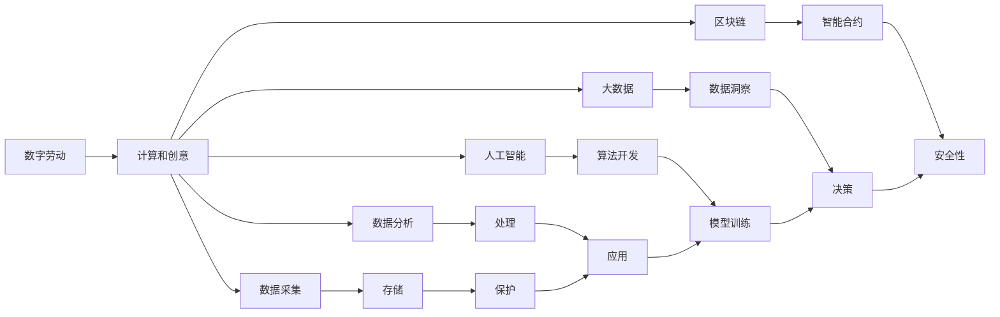

                 

## 1. 背景介绍

### 1.1 问题由来

在21世纪，随着信息技术的飞速发展，特别是互联网、云计算、大数据等技术的普及，人类进入了一个前所未有的数字化时代。在这个时代，数字劳动作为劳动的重要组成部分，在社会和经济领域产生了深远的影响。然而，人们对于数字劳动的定义、本质及其带来的影响，仍存在诸多模糊和误解。

### 1.2 问题核心关键点

- **数字劳动**：指在数字技术驱动下，人类通过计算机进行各种计算、设计和创意活动的过程，包括但不限于编程、数据分析、内容创作等。
- **社会影响**：包括就业结构的变化、收入不平等的加剧、工作环境的变化等。
- **经济影响**：包括生产效率的提升、产业结构的重塑、市场竞争格局的改变等。
- **数字鸿沟**：不同地区、群体、企业之间在数字化技术应用和利用上的不平等。
- **数据隐私与安全**：随着数据的重要性日益增加，如何保护个人隐私、数据安全成为了一大挑战。
- **算法伦理**：算法偏见、透明度、可解释性等问题对社会的公平与公正提出了新的要求。

## 2. 核心概念与联系

### 2.1 核心概念概述

数字劳动作为劳动的一种形式，其核心在于通过数字技术进行各类计算和创意活动。这些活动涉及数据的采集、存储、处理、分析以及应用，从而创造价值。数字劳动不仅涵盖了传统的IT技术领域，如软件开发、网络运维、系统架构等，还扩展到了新兴领域，如人工智能、大数据、区块链等。

### 2.2 核心概念原理和架构的 Mermaid 流程图



这个流程图展示了数字劳动的核心流程：从数据的采集和存储，到数据的处理和分析，再到算法的开发和应用。每一步都涉及到计算和创意的投入，最终创造新的价值。

## 3. 核心算法原理 & 具体操作步骤

### 3.1 算法原理概述

数字劳动的算法原理主要围绕数据处理和分析展开。数字劳动的核心在于利用计算机对数据进行高效的存储、处理和分析，从而提取有价值的信息。常见算法包括但不限于：

- **机器学习算法**：通过数据训练模型，预测未来趋势或优化特定问题。
- **深度学习算法**：利用神经网络模型处理复杂数据，如图像识别、自然语言处理等。
- **自然语言处理(NLP)**：理解、分析、生成人类语言，涉及文本分析、情感分析、智能对话等。
- **数据挖掘算法**：从大规模数据集中提取模式和知识，如关联规则、聚类分析等。

### 3.2 算法步骤详解

1. **数据采集与预处理**：
   - 确定需要采集的数据类型和格式。
   - 进行数据清洗和标准化，确保数据的质量和一致性。

2. **模型训练与优化**：
   - 选择合适的算法模型，如线性回归、决策树、支持向量机等。
   - 对模型进行训练，调整超参数以优化性能。

3. **模型评估与部署**：
   - 使用交叉验证等方法评估模型效果。
   - 将模型部署到生产环境中，实时处理数据。

### 3.3 算法优缺点

**优点**：
- **效率高**：数字劳动能够高效处理大量数据，提高生产效率。
- **灵活性**：算法模型可以根据需要灵活调整，适应不同的应用场景。
- **可扩展性强**：随着数据量的增加，数字劳动的规模和能力可以不断扩展。

**缺点**：
- **数据依赖**：数字劳动的效果高度依赖于数据的完整性和质量。
- **算法复杂性**：模型设计和调参复杂，需要专业知识和经验。
- **资源消耗**：大规模数据处理需要大量计算资源，如高性能计算集群、GPU等。

### 3.4 算法应用领域

数字劳动在多个领域有着广泛的应用，包括：

- **金融科技**：算法模型在金融风险控制、投资分析、智能投顾等方面有重要作用。
- **医疗健康**：机器学习算法在疾病预测、药物研发、个性化治疗等方面发挥作用。
- **零售电商**：数据挖掘和推荐算法优化商品推荐、库存管理、客户服务。
- **智能制造**：物联网和数据分析技术在生产流程优化、质量控制、供应链管理等方面发挥作用。
- **公共安全**：数据分析和模式识别技术用于反恐、犯罪预测、灾害预警等。

## 4. 数学模型和公式 & 详细讲解 & 举例说明

### 4.1 数学模型构建

数字劳动中的数学模型主要围绕数据处理和分析展开。以机器学习中的线性回归为例，数学模型为：

$$ y = w_0 + w_1x_1 + w_2x_2 + \ldots + w_nx_n + \epsilon $$

其中，$y$为预测结果，$x_i$为输入特征，$w_i$为特征系数，$\epsilon$为误差项。

### 4.2 公式推导过程

线性回归的公式推导基于最小二乘法，目标是最小化预测误差：

$$ \min_{w_0, w_1, \ldots, w_n} \sum_{i=1}^n (y_i - (w_0 + w_1x_{i1} + w_2x_{i2} + \ldots + w_nx_{in}))^2 $$

通过求解该目标函数的最小值，得到最优的特征系数$w$。

### 4.3 案例分析与讲解

以金融领域的信用风险评估为例，我们收集了历史交易数据，利用线性回归模型预测客户的信用风险等级。模型训练集包含客户的年龄、收入、资产、交易记录等特征，目标变量为信用风险等级。

训练集：

| 年龄 | 收入 | 资产 | 交易记录 | 风险等级 |
| ---- | ---- | ---- | -------- | -------- |
| 30   | 5万  | 50万 | 500次    | 低       |
| 40   | 10万 | 100万| 200次    | 中       |
| ...  | ...  | ...  | ...      | ...      |

使用最小二乘法求解最优特征系数$w$，代入新数据进行预测。

## 5. 项目实践：代码实例和详细解释说明

### 5.1 开发环境搭建

为了实践数字劳动项目，需要搭建一个基于Python的开发环境。

1. **安装Anaconda**：从官网下载并安装Anaconda，用于创建独立的Python环境。

2. **创建并激活虚拟环境**：
```bash
conda create -n digital-labor python=3.8 
conda activate digital-labor
```

3. **安装相关工具包**：
```bash
pip install numpy pandas scikit-learn matplotlib scikit-image
```

### 5.2 源代码详细实现

以下是一个简单的线性回归模型代码示例，用于信用风险评估：

```python
import numpy as np
from sklearn.linear_model import LinearRegression

# 假设数据已加载到X和y中
X = np.array([[30, 5000, 500000, 500], [40, 10000, 1000000, 200], ...])
y = np.array([1, 0, -1, 1, ...])

# 创建线性回归模型
model = LinearRegression()

# 训练模型
model.fit(X, y)

# 预测新数据
new_data = np.array([[35, 60000, 1000000, 300]])
prediction = model.predict(new_data)
print(prediction)
```

### 5.3 代码解读与分析

**数据准备**：
- `X`为特征数据，包含客户的年龄、收入、资产、交易记录等。
- `y`为目标变量，表示客户的信用风险等级。

**模型创建**：
- 使用`LinearRegression`创建线性回归模型。

**模型训练**：
- 调用`fit`方法，传入特征数据和目标变量，训练模型。

**模型预测**：
- 使用`predict`方法，传入新的特征数据，预测其信用风险等级。

**运行结果展示**：
- 打印预测结果，显示模型对新数据的评估。

## 6. 实际应用场景

### 6.1 智能客服系统

数字劳动在智能客服系统中得到了广泛应用，通过机器学习算法和自然语言处理技术，智能客服系统能够快速、准确地回答客户问题，提升客户满意度。例如，某电商平台的智能客服系统，利用机器学习算法分析历史客服数据，构建了一个能够自动理解客户意图，提供个性化回答的系统。

### 6.2 智慧医疗

数字劳动在智慧医疗领域的应用，显著提升了医疗服务的质量和效率。通过机器学习和大数据技术，医疗诊断、疾病预测、个性化治疗等任务得到了优化。例如，某医院使用机器学习算法分析患者的医疗数据，预测其患病风险，并给出个性化的治疗建议。

### 6.3 智能交通

在智能交通系统中，数字劳动被用于交通流量分析、路径规划、智能调度等。例如，某城市通过数字劳动技术，分析历史交通数据，优化信号灯控制策略，减少了交通拥堵，提高了通行效率。

### 6.4 未来应用展望

数字劳动的未来应用前景广阔，将在更多领域得到广泛应用：

- **智能制造**：通过物联网和数据分析技术，优化生产流程、提高生产效率。
- **智能物流**：利用数字劳动优化仓储管理、配送路线、库存管理等。
- **智能农业**：通过数据分析和机器学习，优化农作物种植、病虫害防治、产量预测等。
- **智能城市**：通过数据分析和智能算法，优化城市管理、公共安全、环境监测等。

## 7. 工具和资源推荐

### 7.1 学习资源推荐

为了深入了解数字劳动，推荐以下学习资源：

1. **《数字劳动与人工智能》**：一本系统介绍数字劳动和人工智能应用的书籍，适合初学者和研究人员阅读。

2. **Coursera《数据科学导论》**：由约翰霍普金斯大学开设的课程，系统介绍数据科学的基础知识和应用案例。

3. **Kaggle数据科学竞赛平台**：通过参与实际数据竞赛，实践数据处理和模型训练技能。

4. **IEEE Xplore**：IEEE的期刊和会议论文数据库，包含大量数字劳动和人工智能领域的最新研究。

5. **Google AI博文**：Google AI团队发布的系列博文，涵盖机器学习、深度学习、自然语言处理等领域的前沿技术。

### 7.2 开发工具推荐

数字劳动开发常用的工具包括：

1. **Python**：广泛使用的编程语言，支持大量数据处理和分析库。
2. **R**：主要用于统计分析和数据可视化。
3. **MATLAB**：适用于复杂数学模型和数据分析。
4. **Jupyter Notebook**：支持交互式编程和数据可视化，适合数据分析和模型训练。
5. **TensorFlow和PyTorch**：两个流行的深度学习框架，支持大规模数据处理和复杂模型训练。

### 7.3 相关论文推荐

数字劳动相关的经典论文推荐：

1. **《数据劳动的社会化》**：探讨数据劳动的社会影响和经济价值。
2. **《数字劳动与自动化》**：分析数字劳动和自动化对就业市场的影响。
3. **《数字鸿沟与技术普及》**：研究数字劳动技术在不同地区和群体之间的普及情况。
4. **《算法伦理与透明性》**：探讨算法偏见、透明性和可解释性问题。
5. **《数字劳动与创新》**：分析数字劳动对产业创新和市场竞争格局的影响。

## 8. 总结：未来发展趋势与挑战

### 8.1 研究成果总结

数字劳动作为数字时代的重要劳动形式，已在多个领域得到广泛应用，展示了其巨大的潜力和价值。机器学习、深度学习、自然语言处理等技术的不断进步，使得数字劳动能够更好地处理复杂数据，提取有价值的信息，优化决策过程。

### 8.2 未来发展趋势

数字劳动的未来发展趋势如下：

- **技术进步**：算法和模型的不断优化，将使得数字劳动更具普适性和灵活性。
- **应用拓展**：数字劳动将进一步拓展到更多领域，如智能制造、智慧城市、智能交通等。
- **跨学科融合**：数字劳动将与其他学科（如心理学、社会学、经济学）进行更深入的融合，形成跨学科的知识体系。
- **伦理规范**：数字劳动将更加注重伦理和规范，保护数据隐私和安全，确保算法的公平和透明。

### 8.3 面临的挑战

数字劳动在发展过程中，仍面临以下挑战：

- **数据隐私与安全**：如何保护个人数据隐私，防止数据泄露和滥用。
- **算法透明性与可解释性**：如何提高算法的透明度，确保算法的可解释性，避免算法偏见。
- **数字鸿沟**：如何缩小数字鸿沟，促进数字劳动技术的普及和应用。
- **资源消耗**：如何优化资源使用，降低大规模数据处理和算力消耗。

### 8.4 研究展望

未来的数字劳动研究应在以下几个方面进行突破：

- **隐私保护**：开发隐私保护技术，确保数据安全和隐私。
- **算法伦理**：研究算法伦理问题，确保算法公平透明。
- **跨领域应用**：探索数字劳动与其他领域的结合，拓展应用场景。
- **可持续性**：研究数字劳动的可持续发展，避免资源浪费和环境影响。

## 9. 附录：常见问题与解答

**Q1：数字劳动与传统劳动有何区别？**

A: 数字劳动主要通过计算机进行计算和创意活动，依赖于数字化技术。而传统劳动则主要依赖人力手工操作，不涉及大规模数据处理和分析。

**Q2：数字劳动对就业市场有何影响？**

A: 数字劳动对就业市场有双重影响：一方面，它创造了大量新的就业机会，如数据分析师、机器学习工程师等；另一方面，它也对传统劳动市场造成冲击，导致某些行业岗位的减少。

**Q3：如何保护数据隐私与安全？**

A: 保护数据隐私和安全需要采取以下措施：
- 数据加密：对数据进行加密处理，防止数据泄露。
- 访问控制：限制数据访问权限，确保数据仅被授权人员访问。
- 匿名化处理：对数据进行匿名化处理，避免数据泄露个人身份。
- 安全审计：定期对数据系统进行安全审计，发现并修复安全漏洞。

**Q4：数字劳动的未来发展方向是什么？**

A: 数字劳动的未来发展方向包括：
- 数据处理和分析能力的提升。
- 跨领域应用的拓展。
- 伦理规范和透明度的加强。
- 技术的可持续发展。

---

作者：禅与计算机程序设计艺术 / Zen and the Art of Computer Programming

