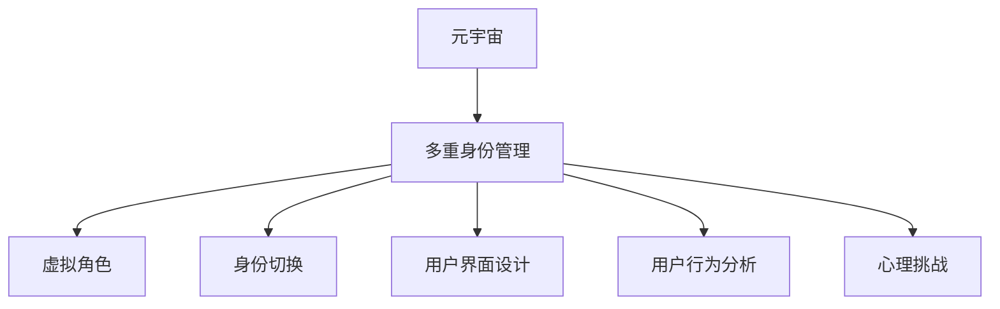

                 

# 数字化人格分裂:元宇宙多重身份管理的心理挑战

> 关键词：元宇宙、多重身份、心理挑战、数字人格、虚拟现实、用户界面设计、用户行为分析

## 1. 背景介绍

随着技术的不断发展，元宇宙作为一个虚拟和现实的交融空间，正在迅速崛起。它不仅仅是游戏、社交和娱乐的新形态，更成为一种全新的生活方式和工作方式。人们在元宇宙中拥有了多重身份，可以自由切换不同的虚拟角色，进行多样化的互动。但这种多重身份的管理，同时也带来了新的心理挑战。本文将探讨在元宇宙中管理多重身份所面临的心理挑战，并提出一些解决策略。

## 2. 核心概念与联系

### 2.1 核心概念概述

元宇宙是一种沉浸式的虚拟空间，它结合了数字技术、虚拟现实（VR）、增强现实（AR）和人工智能（AI）等多种技术，为人们提供了全新的互动体验和身份管理方式。多重身份管理，指的是在元宇宙中，个体根据不同的环境和需求，通过创建和维护多个虚拟角色，来进行自我表达和互动。这种身份的多样性，带来了更丰富的生活体验和更多的可能性，但也带来了一些心理和认知上的挑战。

### 2.2 核心概念原理和架构的 Mermaid 流程图



该图展示了元宇宙、多重身份管理、虚拟角色、身份切换、用户界面设计和用户行为分析之间的联系。多重身份管理依赖于虚拟角色和身份切换，而用户界面设计和用户行为分析则与多重身份管理的优化和改进密切相关，共同构成了一个完整的元宇宙体验体系。

## 3. 核心算法原理 & 具体操作步骤

### 3.1 算法原理概述

多重身份管理算法的核心是如何在元宇宙中高效地创建、维护和管理虚拟角色，以及如何通过身份切换和用户行为分析来优化用户体验。这涉及到用户界面设计、交互设计、认知心理学等多个领域。

### 3.2 算法步骤详解

1. **虚拟角色创建与管理**
   - 用户通过图形化界面创建虚拟角色，并设定初始参数，如外观、行为等。
   - 系统根据用户设定自动生成虚拟角色的虚拟化形象和行为特征。
   - 用户可以在需要时更新和调整虚拟角色的属性，以便在不同场景下使用。

2. **身份切换**
   - 用户在元宇宙中切换不同的虚拟角色，根据当前环境和需求选择最合适的角色。
   - 系统记录用户的当前角色信息，并根据用户的操作自动切换到相应的虚拟角色。

3. **用户界面设计**
   - 设计直观、易用的用户界面，让用户能够轻松管理多个虚拟角色。
   - 界面应具备个性化设置选项，支持用户根据个人喜好定制界面风格。

4. **用户行为分析**
   - 通过数据分析工具，收集用户在不同虚拟角色下的行为数据。
   - 根据行为数据，分析用户的心理状态和偏好，调整和优化虚拟角色的设置。

### 3.3 算法优缺点

**优点：**
- 提高了用户在元宇宙中的灵活性和多样性，增强了互动体验。
- 有助于用户根据不同情境和需求进行角色切换，提高效率。

**缺点：**
- 可能会增加用户认知负荷，特别是在需要频繁切换角色时。
- 用户界面设计复杂，需要考虑多个角色的管理。

### 3.4 算法应用领域

多重身份管理算法主要应用于元宇宙、社交网络和虚拟现实等领域。它不仅适用于游戏和娱乐，也适用于远程工作和虚拟社区等场景。在企业中，可以利用多重身份管理来优化内部沟通和协作，提高工作效率。

## 4. 数学模型和公式 & 详细讲解 & 举例说明

### 4.1 数学模型构建

我们可以使用信息熵来量化多重身份管理带来的认知负荷。设用户有 $n$ 个虚拟角色，每个角色在某个场景下的状态概率为 $p_i$。则用户在该场景下的认知负荷 $H$ 可以通过信息熵来表示：

$$
H = -\sum_{i=1}^n p_i \log p_i
$$

其中 $p_i$ 表示用户选择第 $i$ 个角色的概率。

### 4.2 公式推导过程

信息熵 $H$ 的值越小，表示用户在该场景下的认知负荷越小，即用户在选择角色时的犹豫和困惑越小。通过最小化信息熵，我们可以找到最合适的角色切换策略，减少用户的认知负荷。

### 4.3 案例分析与讲解

假设用户有三个虚拟角色，分别为 "工作"、"社交" 和 "娱乐"。每个角色在不同场景下的使用概率分别为 $p_{work}=0.6$，$p_{social}=0.3$，$p_{entertainment}=0.1$。

使用上述信息熵公式，可以计算出用户在每个场景下的认知负荷：

$$
H_{work} = -0.6 \log 0.6 - 0.3 \log 0.3 - 0.1 \log 0.1 \approx 0.462
$$

$$
H_{social} = -0.6 \log 0.6 - 0.3 \log 0.3 - 0.1 \log 0.1 \approx 0.462
$$

$$
H_{entertainment} = -0.6 \log 0.6 - 0.3 \log 0.3 - 0.1 \log 0.1 \approx 0.462
$$

计算结果表明，用户在每个场景下的认知负荷相近，说明三种角色使用均衡，没有明显的偏颇。

## 5. 项目实践：代码实例和详细解释说明

### 5.1 开发环境搭建

要实现多重身份管理，需要使用跨平台的前端框架，如React或Vue。同时，后端系统需要具备良好的用户界面设计和数据管理功能。

1. 安装Node.js和npm。
2. 创建新项目并初始化React或Vue。
3. 安装相关的依赖库，如Axios用于后端API调用。

### 5.2 源代码详细实现

以React为例，设计一个虚拟角色管理界面，用户可以在该界面中创建、编辑和删除虚拟角色，并切换不同的角色。代码如下：

```javascript
import React, { useState } from 'react';

function ManageRoles() {
  const [roles, setRoles] = useState([]);

  const addRole = () => {
    // 创建新角色的逻辑
  }

  const deleteRole = (index) => {
    // 删除指定角色的逻辑
  }

  return (
    <div>
      {roles.map((role, index) => (
        <div key={index}>
          <h3>{role.name}</h3>
          <button onClick={() => setRoles(roles.filter((r, i) => i !== index))}>删除</button>
        </div>
      ))}
      <button onClick={addRole}>添加角色</button>
    </div>
  );
}

export default ManageRoles;
```

### 5.3 代码解读与分析

上述代码展示了虚拟角色管理的核心逻辑，使用React的State来管理虚拟角色列表，并通过函数式组件实现用户界面。在实际应用中，可以进一步扩展该界面，添加更多角色属性设置和切换功能。

### 5.4 运行结果展示

运行上述代码后，界面将展示当前的所有虚拟角色，并提供添加、删除和切换角色的按钮。用户可以根据需要管理多个虚拟角色，并通过角色切换进行不同的虚拟互动。

## 6. 实际应用场景

### 6.1 企业内部协作

在企业内部，员工可以通过多重身份管理来切换不同的角色，如 "员工"、"客户代表"、"项目经理" 等。这有助于提高工作效率和团队协作，特别是在远程工作时，能够更好地适应不同的工作环境和需求。

### 6.2 虚拟会议

在虚拟会议中，参与者可以通过多重身份管理来切换不同的角色，如 "发言者"、"记录员"、"观察者" 等。这有助于优化会议流程，提高会议效率和质量。

### 6.3 社交网络

在社交网络中，用户可以通过多重身份管理来切换不同的角色，如 "好友"、"媒体工作者"、"粉丝" 等。这有助于用户根据不同的社交环境和需求，进行多样化的互动和表达。

### 6.4 未来应用展望

随着技术的进一步发展，多重身份管理将在元宇宙中发挥更大的作用。未来，我们可以期待更智能化的身份管理系统，能够根据用户的行为和反馈，自动调整和优化虚拟角色的设置，提供更个性化的体验。

## 7. 工具和资源推荐

### 7.1 学习资源推荐

1. 《设计心理学》：了解用户界面设计和用户行为分析的基本原则。
2. 《交互设计原理》：掌握交互设计的核心技术和方法。
3. 《认知负荷理论》：学习如何量化和优化认知负荷。
4. Coursera的《数字设计》课程：学习数字设计和用户体验设计的基本技能。

### 7.2 开发工具推荐

1. React/Vue：跨平台的前端框架，支持多角色管理界面设计。
2. Node.js/Express：后端系统，用于数据管理和API调用。
3. Axios：用于API调用的库，支持跨平台数据传输。

### 7.3 相关论文推荐

1. "User Interface Design Principles" by Donald A. Norman：探讨了用户界面设计的基本原则和方法。
2. "Cognitive Load Theory" by John Sweller：阐述了认知负荷理论和如何量化认知负荷。
3. "Interaction Design Foundation"：提供交互设计的基础知识和案例研究。

## 8. 总结：未来发展趋势与挑战

### 8.1 研究成果总结

多重身份管理算法的研究主要集中在如何优化虚拟角色管理和用户行为分析，以提升用户体验。通过信息熵理论，量化和管理用户的认知负荷，提供了切实可行的解决方案。

### 8.2 未来发展趋势

1. 技术进一步智能化：未来的身份管理系统将更加智能，能够根据用户的行为和反馈，自动调整和优化虚拟角色的设置。
2. 跨平台协作加强：多重身份管理将更好地支持跨平台协作，提高工作效率和团队协作。
3. 用户行为数据挖掘：通过数据挖掘和分析，提供更个性化的虚拟角色体验。

### 8.3 面临的挑战

1. 技术复杂度：多重身份管理的实现需要结合多种技术和方法，增加了开发难度和复杂度。
2. 用户认知负荷：如何降低用户在多个角色之间的认知负荷，提高用户体验，是一个重要的研究方向。
3. 安全性问题：在虚拟角色管理中，如何确保用户数据的安全性和隐私性，也是一个需要解决的问题。

### 8.4 研究展望

未来，多重身份管理算法将进一步融合人工智能和认知科学，提高系统的智能性和用户适应性。同时，通过用户行为分析，实现更个性化的虚拟角色设置和用户体验，使元宇宙成为真正意义上的数字化生活和工作平台。

## 9. 附录：常见问题与解答

**Q1: 多重身份管理会对用户造成心理压力吗？**

A: 多重身份管理确实可能会对用户造成心理压力，特别是在频繁切换角色时。这需要用户在不同的角色间进行认知和情感的快速切换，增加了认知负荷。

**Q2: 如何设计多角色切换的界面？**

A: 设计多角色切换的界面时，应该简洁明了，易于操作。可以使用图形化的角色卡片或按钮，让用户能够直观地查看和管理多个角色。

**Q3: 多重身份管理对元宇宙体验有什么影响？**

A: 多重身份管理能够增强用户在元宇宙中的灵活性和多样性，提高互动体验。但同时也需要避免频繁切换角色带来的认知负荷和心理压力。

**Q4: 如何量化多重身份管理带来的认知负荷？**

A: 可以使用信息熵理论来量化多重身份管理带来的认知负荷。信息熵越小，表示用户认知负荷越小，角色切换越流畅。

**Q5: 多重身份管理有哪些实际应用场景？**

A: 多重身份管理在企业内部协作、虚拟会议、社交网络等领域都有实际应用。它能够提高工作效率、优化会议流程、丰富社交体验。

---

作者：禅与计算机程序设计艺术 / Zen and the Art of Computer Programming

